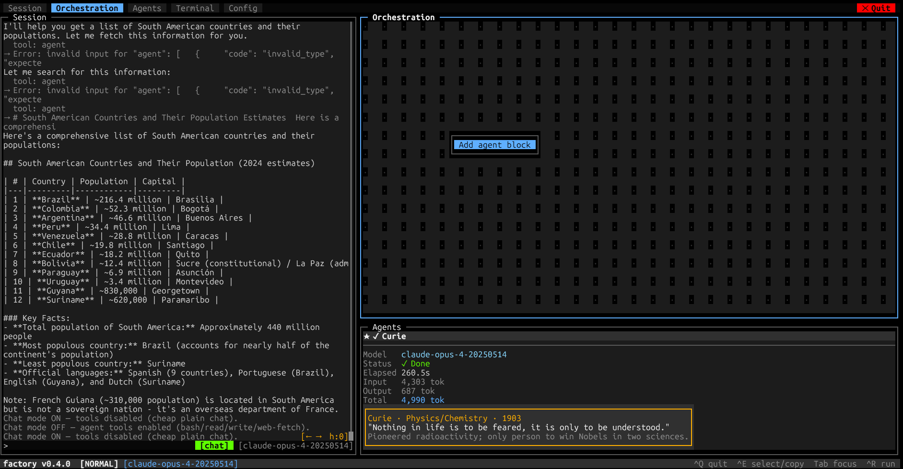
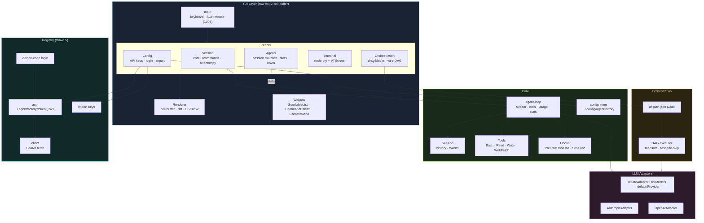
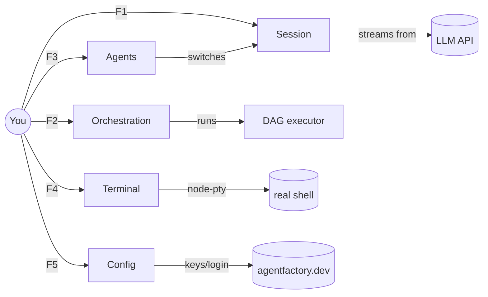
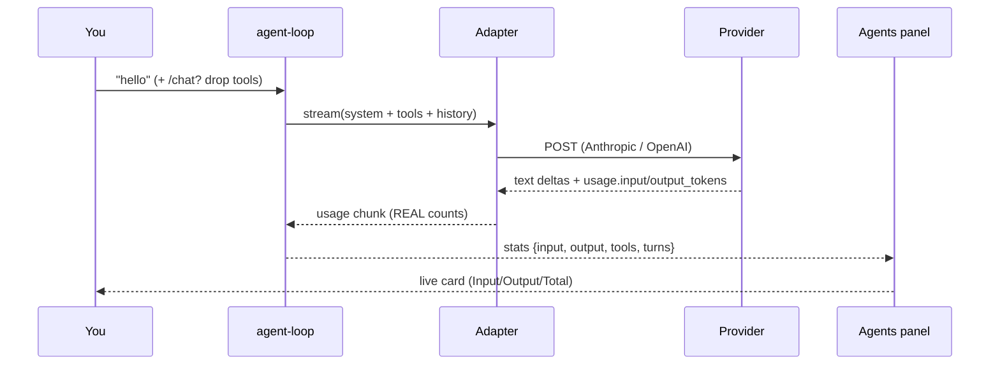

# agentfactory-harness
<!-- version: 2.0.0 -->

`factory` — an **ITUI** (Interactive TUI) orchestration shell for AI agents.
Chat with models, build agent DAGs by dragging ASCII blocks, run a real shell,
and manage provider keys — all inside the terminal, with no GUI.




> Above: a live session answering in the left **Session** pane, the **Orchestration**
> canvas (drag-drop agent blocks) top-right, and the **Agents** panel bottom-right
> acting as a multi-session switcher with real token stats and a hover tooltip for
> the Nobel-laureate-named session ("Curie").

---

## What is ITUI?

ITUI is a terminal interaction model: a full-screen TUI with **mouse drag-and-drop
ASCII blocks** for building and executing agent orchestration plans visually, plus
a streaming chat session, an embedded PTY, and a config plane — rendered by a custom
ANSI cell-buffer (no Ink, no blessed).

```
╔═════════════╗              ╔═══════════════╗              ╔═══════════╗
║  data-fetch ║              ║  transform    ║              ║    load   ║
║  ✓ done     ║──wire────────╫►● ⏳ running ║──wire────────╫►●  ○ idle ║
╚═════════════╝              ╚═══════════════╝              ╚═══════════╝
   Drag blocks · Draw wires (click ○ → click ●) · Right-click menus · Live status
```

---

## Solution Architecture



---

## The Five Planes



| Plane | Tab | What it does |
|-------|-----|--------------|
| **Session** | F1 | Streaming chat with any model · `/commands` · drag-select copy · multi-session |
| **Orchestration** | F2 | Drag ASCII agent blocks, wire them into a DAG, run live |
| **Agents** | F3 | Switch between sessions, see real token stats, hover for laureate quotes |
| **Terminal** | F4 | A real embedded shell via `node-pty` + a from-scratch VT parser |
| **Config** | F5 | Manage 35+ provider keys, login to AgentFactory, import keys from installed tools |

---

## Request & Token Flow

Every Session message carries a **system prompt** + the **tool catalog**, then
streams back with **real usage** from the provider API.



A plain "hello" costs **~237 input tokens** in agent mode (the tool catalog
dominates) and **~36** in `/chat` mode (tools stripped). Full breakdown,
diagrams, and 10 worked scenarios:
[`docs/features/FEATURE-TOOLS-AND-TOKEN-FLOW.md`](docs/features/FEATURE-TOOLS-AND-TOKEN-FLOW.md).

---

## Install & Run

```bash
npm install -g agentfactory-harness
factory doctor   # check Node >=20, provider keys, registry token, .ai/ harness
factory          # launch the TUI
```

Set a provider key (or do it in the Config tab / import from Claude Code):

```bash
export ANTHROPIC_API_KEY=sk-ant-...     # or OPENAI_API_KEY=sk-...
```

---

## Key bindings

| Key | Action |
|-----|--------|
| `F1`–`F5` | Jump to Session / Orchestration / Agents / Terminal / Config |
| `Tab` | Cycle tabs |
| `Ctrl+P` | Command palette (fuzzy) |
| `Ctrl+R` | Run the loaded `af-plan.json` |
| `Ctrl+E` | Toggle mouse capture (native terminal text selection) |
| `Ctrl+C` | Copy selection (or quit if none) · `Ctrl+Q` always quits |
| `← →` | Horizontal scroll (wide tables) · `↑ ↓` scroll history |
| Drag-select | Copy text to clipboard (OSC 52) |
| Click `[tools]`/`[chat]` | Toggle tool catalog on/off |
| Click Session tab / `F1` again | New Session menu |

## Slash commands

| Command | Description |
|---------|-------------|
| `/model` | Pick provider → model (live-fetched from the API) |
| `/chat` | Toggle plain chat (no tools, ~6x cheaper input) |
| `/config` | Open the Config tab |
| `/clear` | Clear the conversation |
| `/tokens` | Approximate token count |
| `/help` | List commands |

Type `/` for an autocomplete popup.

---

## Notable engineering nuances

- **Custom ANSI renderer** — a `CellBuffer` with damage-tracking `diff()`; supports
  256-color + truecolor, OSC 8 hyperlinks, and OSC 52 clipboard. No TUI framework.
- **Real token accounting** — usage comes straight from the provider API
  (Anthropic `message_start`/`message_delta`, OpenAI `stream_options.include_usage`),
  not estimated.
- **Provider-consistent agent loop** — one normalized `StreamChunk` stream for both
  providers; o-series models use `max_completion_tokens`; concise tool-error feedback
  so any model recovers in one turn.
- **Multi-session** — each session is named after a Nobel laureate with a hover quote;
  background streaming is record-captured so switching never corrupts output.
- **Terminal-friendly output** — multi-line responses split on `\n`, prose word-wraps,
  and markdown tables render boxed with lateral `◂ ▸` scroll; emoji are sanitized for
  the monospace grid.
- **Embedded PTY** — `node-pty` + a hand-written `VTScreen` ANSI parser (alt-screen,
  scroll regions, SGR) renders a real shell into the cell-buffer.
- **DAG orchestration** — `af-plan.json` (Zod-validated) → toposort executor with
  parallel fan-out and cascade-skip on failure; canvas blocks reflect live status.

---

## Repository layout

```
src/
├── tui/
│   ├── renderer/    cell-buffer · ansi · layout · theme
│   ├── input/       keyboard · mouse (SGR) · router · vt (PTY parser)
│   ├── panels/      Session · Orchestration · Agents · Terminal · Config · StatusBar
│   └── widgets/     ScrollableList · CommandPalette · ContextMenu · Block · Wire
├── core/
│   ├── agent-loop.ts    stream · tools · usage · stats events
│   ├── session.ts       history + token tracking
│   ├── nobel.ts         laureate names + quotes
│   ├── tools/           Bash · Read · Write · WebFetch (+ agent for orchestration)
│   ├── hooks.ts         Pre/PostToolUse · Session lifecycle
│   ├── config/          provider catalog + persistent key store
│   └── llm/             Anthropic + OpenAI adapters · createAdapter · listModels
├── orchestration/   schema (Zod) · executor · planner · graph
├── harness/         .ai/ reader · doctor
└── registry/        auth · client · login (device code) · import-keys
```

`.ai/project-index.yml` is the canonical map of every file (path · purpose · exports · wave).

---

## Wave plan

| Wave | Status | Scope |
|------|--------|-------|
| 0 | ✓ done | Scaffold: renderer, layout, `factory doctor` |
| 1 | ✓ done | Claude session, tools, hooks, slash commands |
| 2 | ✓ done | ITUI mouse canvas, block drag, wire routing |
| 3 | ✓ done | DAG executor, `/run`, live canvas status |
| 3.5 | ✓ done | Multi-LLM provider layer (Anthropic + OpenAI) |
| 4 | ✓ done | PTY terminal panel, VTScreen ANSI, mouse navigation |
| 5 | 🚧 in progress | Registry auth/login, model picker, multi-session, key import |

---

## Governance

Every feature starts with an approved plan in `specs/docs/approvedPlans/`, is
implemented in a dedicated git worktree branched from `main`, carries an 80%+ test
bar (vitest), and follows TypeScript strict mode (no `any`). See `.ai/rules/`.

## Relationship to AgentFactory

`agentfactory-harness` consumes the same `.ai/` harness convention and Portable Unit
format as [`agentfactory-gen`](https://github.com/matheusmlopess/AgentFactory).
Orchestration primitives proven here (`af-plan.json`, DAG executor) will be upstreamed.

## Registered Agents
<!-- @agent-registry:start -->
- **security-review**: Produces dated REVIEW-SECURITY-ARCHITECTURE-YYYY-MM-DD.md reports: component matrix, Mermaid diagrams, SEV-classified security findings, design gaps, and a prioritised recommendations table. (See: `.ai/agents/security-review/docs/CLAUDE.md`)
<!-- @agent-registry:end -->

## Available Skills
<!-- @skills-registry:start -->
- **security-review**: Full security and architecture review of a repo: component matrix, Mermaid diagrams, SEV-classified findings, design gaps, recommendations table. (See: `.ai/skills/security-review/SKILL.md`)
<!-- @skills-registry:end -->
