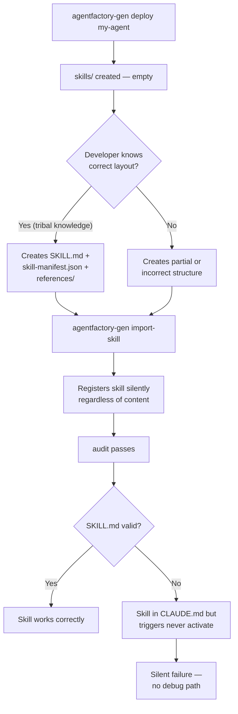
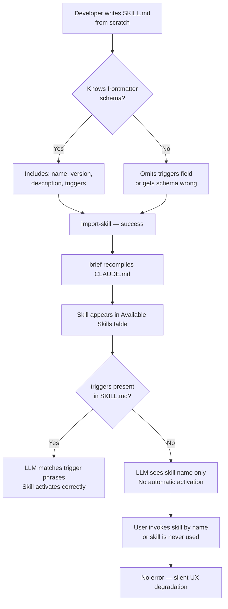
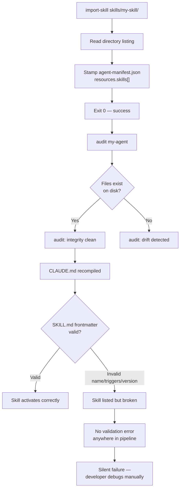
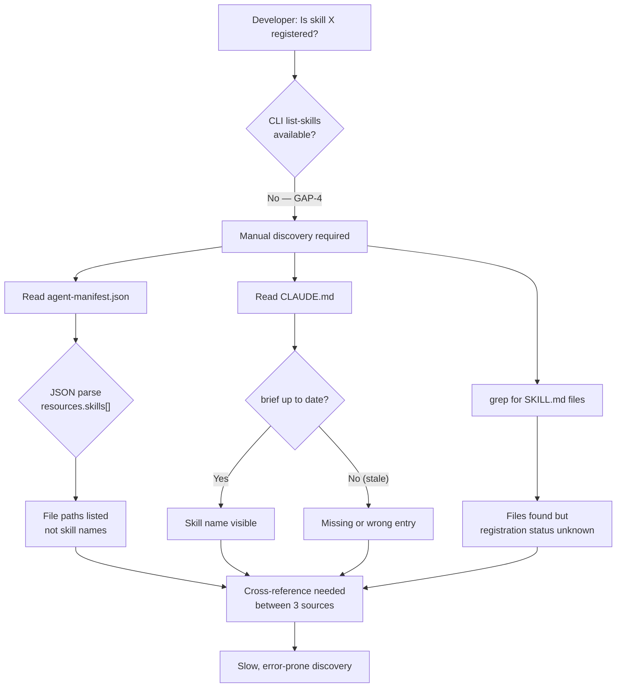
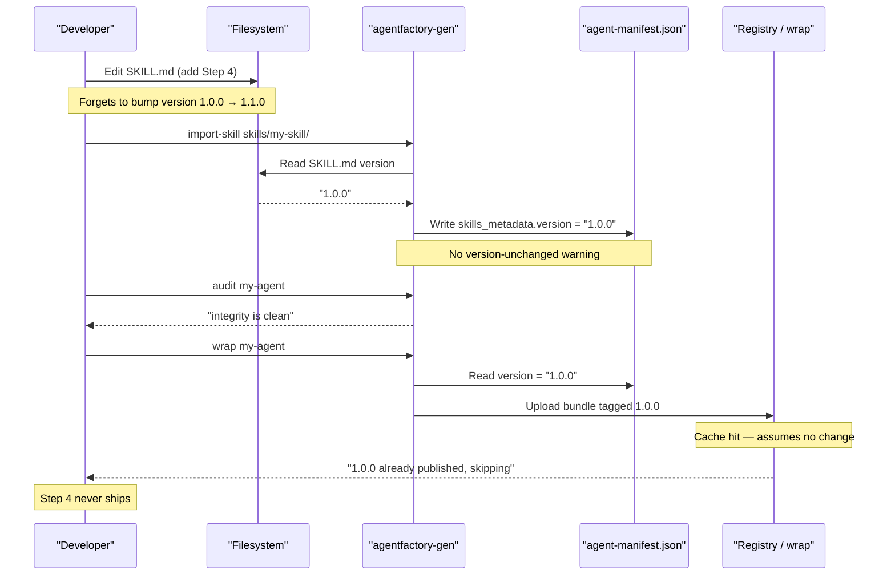
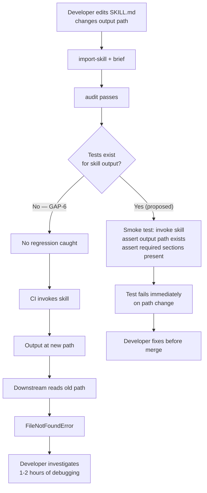
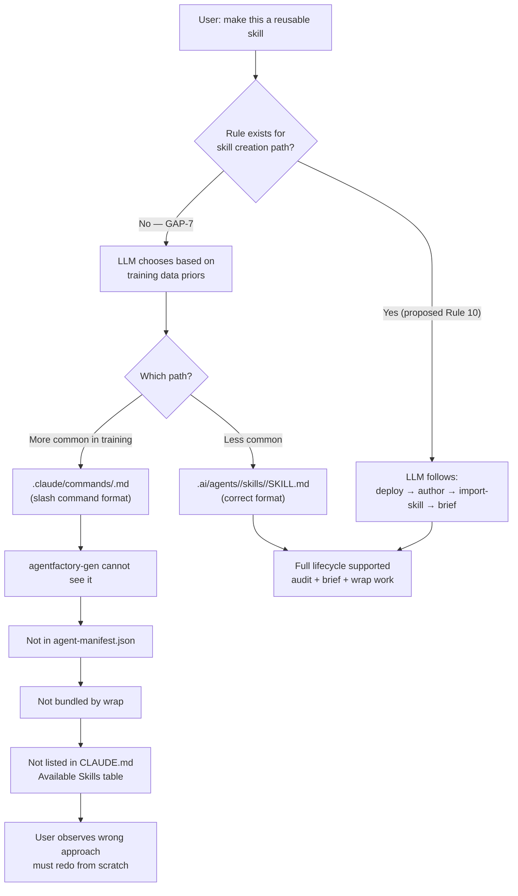
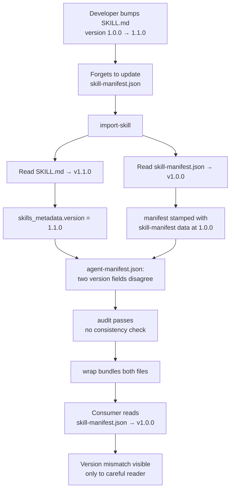
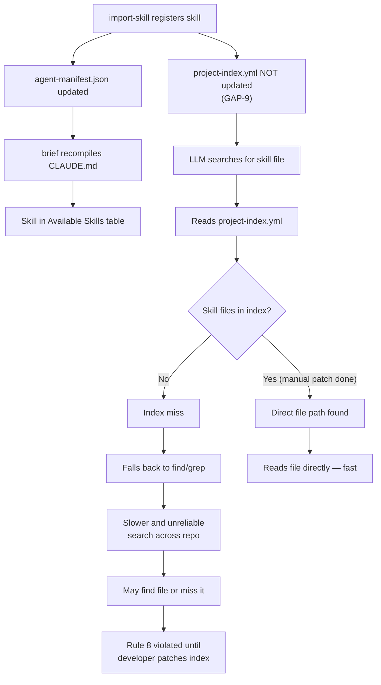
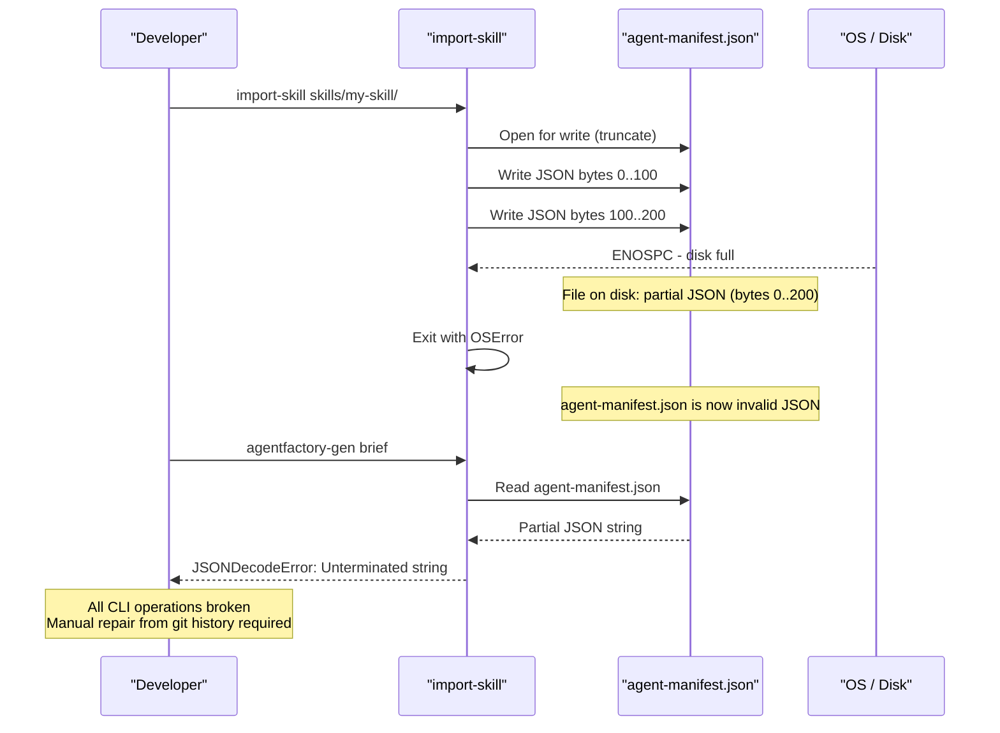

<!-- version: 1.1.0 -->
# agentfactory-gen Skill Creation Pipeline — Documentation
<!-- version: 1.1.0 -->

> Full account of how to create a reusable skill through the `agentfactory-gen` CLI,
> with expanded gap analysis: context, workflow failure paths, and Mermaid diagrams
> for each of the 10 CLI gaps discovered during the `security-review` skill build.

---

## Table of Contents

1. [What agentfactory-gen is](#1-what-agentfactory-gen-is)
2. [CLI Command Reference](#2-cli-command-reference)
3. [Full Skill Creation Workflow](#3-full-skill-creation-workflow)
4. [The security-review Skill as a Concrete Example](#4-the-security-review-skill-as-a-concrete-example)
5. [File Structure Reference](#5-file-structure-reference)
6. [CLI Gaps: Expanded Analysis](#6-cli-gaps-expanded-analysis)
7. [Known Limitations](#7-known-limitations)

---

## 1. What agentfactory-gen is

`agentfactory-gen` (installed via pip) is an **agent lifecycle manager** — it handles:

- Scaffolding the agent directory structure
- Registering agents and skills in `agent-manifest.json`
- Recompiling adapter briefs (`CLAUDE.md`, etc.) from the `.ai/` state
- Auditing agent integrity
- Bundling and publishing agents

It is **NOT** a skill authoring tool. It does not generate `SKILL.md` content,
reference files, or procedural steps. All authoring is manual.

---

## 2. CLI Command Reference

```
agentfactory-gen [OPTIONS] COMMAND [ARGS]

Commands:
  adapter       Manage CLI adapters (activate, rewire, recompile briefs)
  audit         Check an agent for integrity drift and missing metadata
  brief         Recompile all active adapter briefs → CLAUDE.md
  deploy        Deploy a new agent directory and initialise its manifest
  describe      Update agent metadata (description, orchestration plan)
  import        Unpack a portable agent bundle and register it
  import-skill  Import a standalone skill into an existing agent or root
  init          Initialize the AgentFactory harness in a project
  publish       Upload a wrapped agent to the public registry
  retrofit      Ingest and standardize an existing agent directory
  uninstall     Remove an agent and its registration
  wrap          Validate and bundle an agent into a portable .zip
```

Key flags:
- `deploy NAME` — creates `agents/<name>/{skills,commands,docs,scripts,orchestration}/` + `agent-manifest.json`
- `import-skill PATH [--to AGENT]` — registers a skill directory into an existing agent
- `brief` — recompiles all adapter briefs; call after any structural change
- `audit NAME` — verifies agent integrity (manifest completeness, file presence)

---

## 3. Full Skill Creation Workflow

```
┌─────────────────────────────────────────────────────────────────────────┐
│                   agentfactory-gen Skill Pipeline                       │
└─────────────────────────────────────────────────────────────────────────┘

  Step 1                    Step 2                     Step 3
  ──────                    ──────                     ──────
  agentfactory-gen          Author SKILL.md            Create references/
  deploy <name>             (manual)                   (manual)
  │                         │                          │
  └─ scaffolds:             └─ YAML frontmatter:       └─ report-template.md
     .ai/agents/<name>/        name, version,             mermaid-safe-patterns.md
     ├── skills/               description,               any domain-specific refs
     ├── commands/             triggers
     ├── docs/              └─ Markdown body:
     ├── scripts/              Step 0 … Step N
     ├── orchestration/        (deterministic procedure)
     └── agent-manifest.json

  Step 4                    Step 5                     Step 6
  ──────                    ──────                     ──────
  agentfactory-gen          Write docs/SKILL-*.md      agentfactory-gen
  import-skill              (Rule 3 compliance)        brief
  skills/<name>/            (manual)                   │
  [--to <agent>]                                       └─ recompiles CLAUDE.md
  │                                                       updates "Available Skills"
  └─ registers skill                                      table in all adapter briefs
     in agent-manifest.json
     populates resources.skills[]
     stamps git_ref + created_at
```

### Step-by-step commands

```bash
cd /path/to/your/project

# 1. Scaffold the agent directory
agentfactory-gen deploy <agent-name>
# Creates: .ai/agents/<agent-name>/ with all subdirs + agent-manifest.json

# 2. Author the skill (MANUAL — CLI does not generate this)
#    Create: .ai/agents/<agent-name>/skills/<skill-name>/SKILL.md
#    Format: YAML frontmatter + Markdown procedural steps (see §5)

# 3. Create reference files (MANUAL — CLI does not generate these)
#    Create: .ai/agents/<agent-name>/skills/<skill-name>/references/*.md
#    Create: .ai/agents/<agent-name>/skills/<skill-name>/skill-manifest.json

# 4. Register the skill in the agent manifest
agentfactory-gen import-skill .ai/agents/<agent-name>/skills/<skill-name>/ \
  --to <agent-name>
# Updates: agent-manifest.json resources.skills[], skills_metadata{}

# 5. Write the feature doc (Rule 3 — required before commit)
#    Create: .ai/agents/<agent-name>/docs/SKILL-<SKILL-NAME>.md

# 6. Recompile adapter briefs
agentfactory-gen brief
# Updates: CLAUDE.md "Available Skills" table, .ai/adapters/*/brief.md

# 7. Audit
agentfactory-gen audit <agent-name>
# Verifies: manifest completeness, file presence, no integrity drift

# 8. (Optional) Wrap for distribution
agentfactory-gen wrap <agent-name>
# Produces: <agent-name>.zip portable bundle
```

---

## 4. The security-review Skill as a Concrete Example

The `security-review` skill was created through exactly this pipeline.

### Actual commands run

```bash
# Step 1 — scaffold
agentfactory-gen deploy security-review

# Step 4 — after manual authoring of SKILL.md + references/
agentfactory-gen import-skill \
  .ai/agents/security-review/skills/security-review/ \
  --to security-review

# Step 6 — recompile briefs
agentfactory-gen brief

# Verify
agentfactory-gen audit security-review
# → [librarian] ✓ 'security-review' integrity is clean.
```

### Resulting agent-manifest.json (excerpt)

```json
{
  "name": "security-review",
  "version": "1.0.0",
  "git_ref": "981f312",
  "created_at": "2026-04-28T13:16:52",
  "resources": {
    "skills": [
      "skills/security-review/SKILL.md",
      "skills/security-review/references/mermaid-safe-patterns.md",
      "skills/security-review/references/report-template.md",
      "skills/security-review/skill-manifest.json"
    ],
    "docs": ["docs/SKILL-SECURITY-REVIEW.md"]
  }
}
```

### What had to be authored manually

| File | CLI support | Manual work |
|------|-------------|-------------|
| `SKILL.md` — frontmatter + 6 procedural steps | ❌ None | ~150 lines |
| `references/report-template.md` — 11-section skeleton | ❌ None | ~165 lines |
| `references/mermaid-safe-patterns.md` — rendering constraints | ❌ None | ~70 lines |
| `skill-manifest.json` — minimal JSON | ❌ None | 5 lines |
| `docs/SKILL-SECURITY-REVIEW.md` — feature doc | ❌ None | ~120 lines |

CLI handled: directory scaffolding, manifest stamping, brief recompilation, audit.

---

## 5. File Structure Reference

### SKILL.md format

```markdown
---
name: <skill-name>
version: 1.0.0
description: One-sentence summary of what this skill produces.
triggers: phrase one, phrase two, phrase three
---

# <skill-name> — v1.0.0

Narrative intro paragraph.

---

## Step 0 — <First step title>

Procedural instructions...

## Step 1 — <Second step title>

...

## Step N — Write Output
```

### skill-manifest.json format

```json
{
  "name": "<skill-name>",
  "version": "1.0.0",
  "description": "One-sentence summary."
}
```

### Full agent directory layout

```
.ai/agents/<agent-name>/
├── agent-manifest.json          ← created + maintained by agentfactory-gen
├── skills/
│   └── <skill-name>/
│       ├── SKILL.md             ← authored manually (frontmatter + steps)
│       ├── skill-manifest.json  ← authored manually (JSON metadata)
│       └── references/          ← authored manually (domain-specific refs)
│           ├── <ref-1>.md
│           └── <ref-2>.md
├── docs/
│   └── SKILL-<SKILL-NAME>.md   ← authored manually (Rule 3 feature doc)
├── commands/                    ← empty unless slash commands added
├── scripts/                     ← empty unless helper scripts added
└── orchestration/               ← empty unless DAG plan added
```

---

## 6. CLI Gaps: Expanded Analysis

Each gap is documented with: the missing capability, the concrete workflow context where it surfaces, the exact failure path, a Mermaid diagram of that path, and the proposed fix.

---

### GAP-1 — No skill scaffold command

**Missing command:** `agentfactory-gen create-skill <name> --in <agent>`

#### Context

After running `agentfactory-gen deploy <agent>`, the developer has an agent directory
with an empty `skills/` folder. There is no next step in the CLI — the developer must
know (from documentation, prior art, or tribal knowledge) to manually create a full
skill subdirectory with the correct file layout.

#### Workflow failure path

```
agentfactory-gen deploy my-agent
  └─ creates .ai/agents/my-agent/skills/   ← empty, no guidance

Developer opens skills/ directory
  └─ sees empty folder
  └─ must infer: need skills/<name>/SKILL.md + skill-manifest.json + references/
  └─ creates wrong structure or skips files

agentfactory-gen import-skill skills/my-skill/
  └─ registers whatever exists (even broken)
  └─ no error, no warning

agentfactory-gen audit my-agent
  └─ passes (manifest is internally consistent)
  └─ skill content never validated

LLM loads CLAUDE.md
  └─ skill appears in "Available Skills" table
  └─ trigger phrases may not work (missing frontmatter)
  └─ no error surfaced to user
```

#### Diagram



**Proposed fix:** `agentfactory-gen create-skill <name> --in <agent>` creates
`skills/<name>/SKILL.md` with frontmatter stubs, `skill-manifest.json`, and an
empty `references/` directory. Mirrors the `deploy` UX pattern.

---

### GAP-2 — No SKILL.md template generator

**Missing:** Auto-generated SKILL.md with correct frontmatter schema and step structure.

#### Context

Even when a developer knows to create `SKILL.md`, there is no template. The required
frontmatter fields (`name`, `version`, `description`, `triggers`) are undocumented at
the CLI level. The `triggers` field is the most critical — it is what causes the LLM
to activate the skill automatically — but is the least obvious.

#### Workflow failure path

```
Developer creates SKILL.md from scratch
  └─ writes frontmatter from memory
  └─ omits `triggers:` field (not obvious it exists)

import-skill registers the file
  └─ no frontmatter validation

agentfactory-gen brief
  └─ CLAUDE.md updated: skill appears in "Available Skills"
  └─ no triggers row shown in the table

User says "run review design"
  └─ LLM scans CLAUDE.md — no trigger match
  └─ falls through to generic response
  └─ skill never invoked
  └─ developer has no idea why skill is ignored
```

#### Diagram



**Proposed fix:** `create-skill` (from GAP-1) outputs a pre-populated template:

```markdown
---
name: {{name}}
version: 1.0.0
description: TODO — one sentence describing what this skill produces.
triggers: TODO, add, trigger, phrases, here
---

# {{name}} — v1.0.0

TODO — describe what this skill does.

---

## Step 0 — Detect Mode

TODO — first step instructions.
```

---

### GAP-3 — No skill format validation

**Missing:** `agentfactory-gen validate-skill PATH` or inline validation in `import-skill`.

#### Context

`import-skill` is a registration command. It reads the directory, stamps the manifest,
and exits. It performs no content checks. A skill with missing frontmatter, wrong name,
or no `triggers` is registered identically to a valid one. The `audit` command checks
manifest integrity but not skill content.

#### Workflow failure path

```
Developer creates SKILL.md with:
  - name: "my skill" (spaces — invalid identifier)
  - version: "latest" (non-semver)
  - triggers: (empty)
  - description: (missing)

agentfactory-gen import-skill skills/my-skill/ --to my-agent
  └─ reads directory listing
  └─ stamps agent-manifest.json: resources.skills = ["skills/my-skill/SKILL.md"]
  └─ no frontmatter parsed
  └─ exits 0

agentfactory-gen audit my-agent
  └─ checks: agent-manifest.json exists? yes
  └─ checks: files in resources.skills[] exist on disk? yes
  └─ exits: "integrity is clean"

CLAUDE.md brief generated
  └─ skill listed with name "my skill" (spaces break the trigger matcher)

User says trigger phrase → no match
Developer runs audit → clean
No actionable error anywhere in the pipeline
```

#### Diagram



**Proposed fix:** `import-skill` parses SKILL.md frontmatter before stamping and
errors on: missing required fields, non-semver version, empty triggers, name mismatch
with directory name. Add `agentfactory-gen validate-skill PATH` as a standalone check.

---

### GAP-4 — No skill listing command

**Missing:** `agentfactory-gen list-skills [--agent NAME]`

#### Context

After importing multiple skills across multiple agents, there is no CLI command to
answer "what skills are registered?" The developer must read `agent-manifest.json`
or `CLAUDE.md` — two different files with partially overlapping information.

#### Workflow failure path

```
Project has 3 agents, each with 2-4 skills (8 total)

Developer wants to know: "is data-pipeline skill registered?"
  └─ No CLI command available

Option A: read .ai/agents/*/agent-manifest.json (3 files to cat)
  └─ JSON is dense, requires jq or manual scan
  └─ skill names are in resources.skills[] as file paths, not names

Option B: read CLAUDE.md "Available Skills" table
  └─ only shows skills from the LAST brief compilation
  └─ stale if brief not re-run after recent import
  └─ no path info, just skill name + trigger path

Option C: grep for SKILL.md files
  └─ finds files but not registration status
  └─ unregistered skills look identical to registered ones
```

#### Diagram



**Proposed fix:** `agentfactory-gen list-skills [--agent NAME]` reads all
`agent-manifest.json` files and prints a table: agent | skill name | version | triggers.

---

### GAP-5 — No skill versioning enforcement

**Missing:** Version change detection on re-import; semver format enforcement.

#### Context

Skills evolve. A developer fixes a bug in `SKILL.md`, adds a step, or changes trigger
phrases. The correct action is to bump the version in both `SKILL.md` and
`skill-manifest.json`, then re-run `import-skill`. Nothing enforces this. The manifest
is re-stamped with whatever version is in the file, unchanged or not. `audit` passes.

#### Workflow failure path

```
SKILL.md at version 1.0.0
Developer adds a new Step 4 to the procedure
Forgets to bump version to 1.1.0

agentfactory-gen import-skill skills/my-skill/ --to my-agent
  └─ reads SKILL.md: version = "1.0.0" (unchanged)
  └─ stamps manifest: skills_metadata.version = "1.0.0"
  └─ no warning: "version unchanged since last import"

agentfactory-gen audit my-agent
  └─ passes: files present, manifest consistent

Downstream tooling (e.g. wrap, publish) reads version 1.0.0
  └─ cache hit: assumes skill unchanged
  └─ ships stale version to registry
  └─ consumers get old skill behavior

Developer debugging: "why is Step 4 missing in the deployed skill?"
  └─ version string is the only signal — both show 1.0.0
  └─ no git-ref delta surfaced for the skill specifically
```

#### Diagram



**Proposed fix:** On re-import, `import-skill` compares the incoming version against
the currently registered version. If unchanged but file content differs (by hash or
git-ref), emit a warning: `WARN: skill version 1.0.0 unchanged but content differs
since last import. Did you forget to bump the version?`

---

### GAP-6 — No skill test scaffold

**Missing:** `agentfactory-gen test-skill <name>` or any automated smoke-test template.

#### Context

Skills are procedural prompt documents — their "correctness" is whether the LLM
follows the steps and produces the expected output. There is no test runner, no
fixture system, and no way to assert that a skill produces the right file at the
right path with the right sections. Regression is caught only by manually invoking
the skill and eyeballing the result.

#### Workflow failure path

```
Developer edits SKILL.md — changes report filename pattern
  └─ was: docs/REVIEW-SECURITY-*.md
  └─ now: reports/SECURITY-REVIEW-*.md

No test catches this
  └─ skill is re-imported, audit passes

CI/CD pipeline runs skill
  └─ output written to reports/ (new path)
  └─ downstream tool reads from docs/ (old path)
  └─ docs/ file missing → downstream tool fails

Developer debugging:
  └─ no test failure pointed to skill output path change
  └─ reads SKILL.md, compares to old version manually
  └─ finds path change in Step 6
  └─ 1-2 hours of debugging for a 1-line change
```

#### Diagram



**Proposed fix:** `agentfactory-gen test-skill <name>` runs the skill with fixture
inputs in a sandbox, then asserts: output file created at expected path, required
section headers present, no unclosed `{{PLACEHOLDER}}` tokens in output.

---

### GAP-7 — No governance rule for skill creation

**Missing:** A harness rule (Rule N) defining when and how to create a skill vs. a
slash command, enforcing the `deploy → author → import-skill → brief` lifecycle.

#### Context

`CLAUDE.md` has rules for worktrees (Rule 2), documentation (Rule 3), version markers
(Rule 4), secrets (Rule 6), and reference repos (Rule 9). There is no rule that says:
"reusable procedures belong in `.ai/agents/<name>/skills/`" or "do not create skills
as bare `.claude/commands/*.md` files." Both paths are syntactically valid; without a
rule, the LLM picks whichever it has seen more often in training data (slash commands).

#### Workflow failure path — what actually happened in this repo

```
User request: "make the design security report a reusable skill"

LLM interprets request:
  └─ knows Claude Code slash commands from training data
  └─ creates .claude/commands/review-design.md
  └─ format: Claude Code slash command (plain Markdown, no frontmatter)

Result:
  └─ file is NOT a skill — agentfactory-gen cannot see it
  └─ agentfactory-gen brief does NOT add it to CLAUDE.md "Available Skills"
  └─ NOT registered in agent-manifest.json
  └─ audit cannot check it
  └─ wrap cannot bundle it
  └─ user observes: "the command was created but didn't use agent-factory pipy cli"

Correct path (what should have happened):
  └─ agentfactory-gen deploy security-review
  └─ author .ai/agents/security-review/skills/security-review/SKILL.md
  └─ agentfactory-gen import-skill ... --to security-review
  └─ agentfactory-gen brief
```

#### Diagram



**Proposed fix:** Add Rule 10 — Skill Authorship to `.ai/rules/`:
> A reusable procedure MUST be implemented as an agentfactory skill at
> `.ai/agents/<name>/skills/<name>/SKILL.md`. Never create a skill as a
> `.claude/commands/*.md` file. Lifecycle: `deploy` → author SKILL.md → `import-skill`
> → `brief`. The `.claude/commands/` path is for one-off slash commands only.

---

### GAP-8 — import-skill does not derive skill-manifest.json

**Missing:** Auto-generation of `skill-manifest.json` from SKILL.md frontmatter,
or consistency validation between the two files.

#### Context

`SKILL.md` and `skill-manifest.json` carry the same three fields: `name`, `version`,
`description`. They must be kept in sync manually. `import-skill` reads both files but
does not check that they agree. If they diverge, different parts of the toolchain
see different metadata.

#### Workflow failure path

```
Developer updates SKILL.md: version 1.0.0 → 1.1.0, description updated

Forgets to update skill-manifest.json (still shows 1.0.0)

agentfactory-gen import-skill ...
  └─ reads SKILL.md → stamps skills_metadata from SKILL.md (v1.1.0)
  └─ reads skill-manifest.json → stamps manifest.version from skill-manifest (v1.0.0)
  └─ no consistency check
  └─ agent-manifest.json now has two different versions for the same skill

agentfactory-gen audit my-agent
  └─ checks file presence only
  └─ does not compare SKILL.md version vs skill-manifest.json version
  └─ exits clean

agentfactory-gen wrap my-agent
  └─ bundles both files
  └─ consumer sees skill-manifest.json (v1.0.0) as the authoritative version
  └─ SKILL.md says 1.1.0
  └─ version conflict in the bundle
```

#### Diagram



**Proposed fix:** `import-skill` auto-generates `skill-manifest.json` from SKILL.md
frontmatter if the file is absent. If present, validate name + version consistency and
error if they differ. Only one source of truth: SKILL.md frontmatter.

---

### GAP-9 — No project-index integration

**Missing:** Automatic update of `.ai/project-index.yml` when a new skill is imported.

#### Context

The harness enforces Rule 8: "When searching for a file, function, or module, read
`.ai/project-index.yml` first." This index must be manually updated when new files are
added. `agentfactory-gen import-skill` and `brief` do not touch `project-index.yml`.
Every new skill breaks Rule 8 until the developer manually patches the index.

#### Workflow failure path

```
agentfactory-gen import-skill skills/my-skill/ --to my-agent
  └─ registers skill in agent-manifest.json
  └─ does NOT update .ai/project-index.yml

agentfactory-gen brief
  └─ updates CLAUDE.md Available Skills table
  └─ does NOT update .ai/project-index.yml

LLM receives: "show me the SKILL.md for my-skill"
  └─ follows Rule 8: reads .ai/project-index.yml
  └─ skill files not in index → not found
  └─ falls back to find/grep (slower, less reliable)
  └─ may find file, may not depending on search pattern

Developer manually patches project-index.yml
  └─ 5-7 lines per skill file (path, purpose, wave, status)
  └─ error-prone: wrong path, wrong section
  └─ required for EVERY new skill
```

#### Diagram



**Proposed fix:** `import-skill` appends new skill file rows to `project-index.yml`
under the `docs:` or a new `agents:` section, with path, auto-detected purpose
(from SKILL.md description), and status `implemented`.

---

### GAP-10 — No rollback on import-skill failure

**Missing:** Atomic write for `agent-manifest.json` during `import-skill`.

#### Context

`import-skill` writes `agent-manifest.json` in-place. If the process is interrupted
mid-write (SIGKILL, disk-full, power loss), the manifest is left in a partially-written
state — typically valid JSON up to the write cursor, then truncated. All subsequent
`agentfactory-gen` invocations fail with a JSON parse error until the file is manually
repaired. In a team environment, this corrupts the shared manifest on disk.

#### Workflow failure path

```
agentfactory-gen import-skill skills/my-skill/ --to my-agent
  └─ opens agent-manifest.json for write (truncates existing file)
  └─ begins writing updated JSON

  -- disk full at 60% of write --
  └─ partial JSON written: {"name":"my-agent","version":"1.0.0","resources":{"skills":[

Process exits with OSError

agent-manifest.json on disk:
  {"name":"my-agent","version":"1.0.0","resources":{"skills":[
  ↑ truncated, invalid JSON

agentfactory-gen brief
  └─ reads agent-manifest.json
  └─ JSONDecodeError: Unterminated string at line 1 column 87
  └─ exits 1

agentfactory-gen audit my-agent
  └─ same JSONDecodeError

All CLI operations on this agent are now broken
Developer must manually reconstruct agent-manifest.json from git history
```

#### Diagram



**Proposed fix:** Write to a temp file (`agent-manifest.json.tmp`), validate JSON
completeness, then `os.replace()` (atomic rename on POSIX). If any step fails,
delete the temp file and leave the original manifest untouched.

---

## 7. Known Limitations

- `agentfactory-gen` operates on `.ai/agents/` only — skills outside this path
  (e.g., `.claude/commands/`) are invisible to the CLI
- `brief` recompilation is not incremental — it rewrites all adapter briefs on
  every call regardless of what changed
- `wrap` produces a `.zip` bundle but `publish` requires a registry endpoint
  not yet documented in the harness

---

*Documented from full execution of the `security-review` skill pipeline on 2026-04-28.*
*CLI behavior confirmed from `agentfactory-gen --help` and subcommand `--help` output*
*on the version installed at `/home/magooo/.local/bin/agentfactory-gen`.*
