<!-- version: 1.0.0 -->
<!-- classification: SUMMARY -->
<!-- date: 2026-06-19 -->
<!-- last-updated: 2026-06-17 -->
<!-- status: ACTIVE -->
<!-- generated-by: scripts/docs-compile.sh -->

# PLANS — Memorial (Descriptive Compendium)

> **Auto-generated** by `scripts/docs-compile.sh` — **do not edit by hand**.
> Edit the source docs in `PLANS/` and re-run the script.
> Documents: **16** · ordered by creation date · each section links its source.

<a id="index"></a>
## Index

1. [PLAN-00 — Orchestration Kernel](#d1) — `2026-06-17` — The kernel is the **single shared spine** of the multi-agent runtime. It owns the *only* · [[PLAN-00-ORCHESTRATION-KERNEL]]
2. [PLAN-01 — Agent Definition System](#d2) — `2026-06-17` — Defines the declarative `af-team.json` format, the Zod `TeamSchema`, role/skill loading, · [[PLAN-01-AGENT-DEFINITION-SYSTEM]]
3. [PLAN-02 — HandoffChain & HandoffPackage](#d3) — `2026-06-17` — A handoff is a structured relay: when agent A finishes, it packages its result and the · [[PLAN-02-HANDOFF-CHAIN]]
4. [PLAN-03 — Cross-Provider LLM Adapters](#d4) — `2026-06-17` — Lets agents on different providers (Claude → DeepSeek → Ollama …) hand off to each other. · [[PLAN-03-CROSS-PROVIDER-LLM]]
5. [PLAN-04 — MessageBus](#d5) — `2026-06-17` — In-process pub/sub for agent-to-agent messages. No external broker. **Critical fix (§O / F6):** · [[PLAN-04-MESSAGE-BUS]]
6. [PLAN-05 — SharedMemory (Runtime, Layer 1)](#d6) — `2026-06-17` — Ephemeral, namespaced key-value store shared by all agents **within one team run**. This is · [[PLAN-05-SHARED-MEMORY]]
7. [PLAN-06 — Logic Ports](#d7) — `2026-06-17` — Logic ports are **non-agent DAG nodes** that gate flow with boolean logic. They fire *early* · [[PLAN-06-LOGIC-PORTS]]
8. [PLAN-07 — AgentAsk](#d8) — `2026-06-17` — A running agent can pause and ask the user a question; the agent resumes when answered while · [[PLAN-07-AGENT-ASK]]
9. [PLAN-08 — TeamExecutor Engine](#d9) — `2026-06-17` — The orchestration heart. Drives the **settlement-driven loop** (PART II §K — fixes the · [[PLAN-08-TEAM-EXECUTOR]]
10. [PLAN-09 — CLI Design](#d10) — `2026-06-17` — Two new subcommands: `factory agent` (one-shot / handoff chain) and `factory orchestrate` · [[PLAN-09-CLI]]
11. [PLAN-10 — TUI Multi-Agent](#d11) — `2026-06-17` — Three TUI surfaces wired to `TeamStepEvent`s: AgentsPanel redesign (status + messages + · [[PLAN-10-TUI-MULTI-AGENT]]
12. [PLAN-11 — Coordinator / Goal Decomposition](#d12) — `2026-06-17` — Implements the `factory orchestrate "goal"` path (Mode B) that was referenced everywhere but · [[PLAN-11-COORDINATOR]]
13. [PLAN-12 — Tiered Persistent Memory (Claude-Code-style)](#d13) — `2026-06-17` — Adds Claude Code's **tiered persistent memory** on top of the ephemeral runtime · [[PLAN-12-TIERED-MEMORY]]
14. [PLAN-13 — Visual Orchestration Studio (n8n-style team builder)](#d14) — `2026-06-17` — A **design-time** visual editor: drag agent/port nodes from a toolbox onto the canvas, · [[PLAN-13-ORCHESTRATION-STUDIO]]
15. [PLAN-CORE — Core Integration Seam](#d15) — `2026-06-17` — The feature specs (PLAN-00…12) assume core abstractions that **do not exist today**. This · [[PLAN-CORE-INTEGRATION-SEAM]]
16. [Multi-Agent Orchestration — Spec Index (Wave 6)](#d16) — `2026-06-17` — These 13 specs decompose the multi-agent orchestration design into self-contained, · [[PLAN-INDEX-MULTI-AGENT]]

## Glossary

Term & acronym definitions: [GLOSSARY](../documentation/GLOSSARY.md) · [[GLOSSARY]]

---

<a id="d1"></a>

## 1 · 2026-06-17 · PLAN-00 — Orchestration Kernel

Source: [PLAN-00-ORCHESTRATION-KERNEL.md](PLAN-00-ORCHESTRATION-KERNEL.md) · [[PLAN-00-ORCHESTRATION-KERNEL]]  ·  [↑ Index](#index)


<!-- version: 1.0.0 -->
<!-- classification: PLAN -->
<!-- date: 2026-06-17 -->
<!-- last-updated: 2026-06-17 -->
<!-- feature: src/orchestration/context.ts, gate.ts, normalize.ts, abort-registry.ts -->
<!-- depends-on: PLAN-01 -->
<!-- enables: PLAN-06, PLAN-07, PLAN-08, PLAN-11 -->

## 1. Overview & Purpose

The kernel is the **single shared spine** of the multi-agent runtime. It owns the *only*
copies of orchestration state (statuses, outputs, tokens), the cancellation registry, the
settlement signal, and the event buffer. Every runtime plan (06, 07, 08, 11) plugs into it
rather than inventing its own state, which is what eliminates the 15 integration flaws
catalogued in the master plan PART II.

**Design rule:** state, ordering, cancellation, and delivery each have *exactly one home*.
`OrchestrationContext` is that home.

## 2. Interface Definitions

```typescript
// src/orchestration/context.ts
import type { StepStatus } from './executor.js'
import type { TeamStepEvent } from './events.js'
import type { MessageBus } from '../core/team/message-bus.js'
import type { SharedMemory } from '../core/team/shared-memory.js'
import type { AskBroker } from '../core/team/ask-broker.js'
import type { NormalizedGraph, Node, PortNode } from './normalize.js'
import type { LogicPortResult } from './gate.js'

export interface TokenUsage { input: number; output: number }

export interface OrchestrationContext {
  readonly graph:    NormalizedGraph
  readonly statuses: Map<string, StepStatus>     // node → status
  readonly outputs:  Map<string, string>         // node → human-readable output
  readonly tokens:   Map<string, TokenUsage>     // node → provider-normalized usage
  readonly bus:      MessageBus
  readonly memory:   SharedMemory
  readonly broker:   AskBroker
  readonly abort:    AbortRegistry

  // settlement signalling
  waitForNextSettlement(): Promise<void>         // resolves when any node settles OR a slot frees
  notifySettled(node: string): void
  drainEvents(): TeamStepEvent[]                 // FIFO buffer the executor yields

  // state transitions — the ONLY path that mutates statuses
  markRunning(node: string): void
  markDone(node: string, output: string): void
  markError(node: string, err: Error): void
  markSkipped(node: string): void
  firePort(node: string, res: LogicPortResult): void
  cancelXorLosers(port: PortNode): void

  recordTokens(node: string, usage: TokenUsage): void
  allTerminal(): boolean
  verdict(): 'APPROVE' | 'FAILED' | 'COMPLETE'
}
```

```typescript
// src/orchestration/abort-registry.ts
export class AbortRegistry {
  private controllers = new Map<string, AbortController>()
  signal(node: string): AbortSignal {
    let c = this.controllers.get(node)
    if (!c) { c = new AbortController(); this.controllers.set(node, c) }
    return c.signal
  }
  cancel(node: string, reason: string): void { this.controllers.get(node)?.abort(reason) }
  cancelAll(reason: string): void { for (const c of this.controllers.values()) c.abort(reason) }
}
```

### 2.1 Settlement signal implementation

A resettable promise. `waitForNextSettlement()` returns the current promise; `notifySettled`
resolves it and swaps in a fresh one. This gives zero-CPU blocking with no busy loop.

```typescript
class SettlementSignal {
  private resolve!: () => void
  private promise = this.fresh()
  private fresh(): Promise<void> { return new Promise(r => { this.resolve = r }) }
  wait(): Promise<void> { return this.promise }
  notify(): void { const r = this.resolve; this.promise = this.fresh(); r() }
}
```

## 3. The Tri-State Gate (gate.ts)

```typescript
// src/orchestration/gate.ts
export type Gate = 'FIRE' | 'SKIP' | 'WAIT'
export type GateType = 'AND' | 'OR' | 'XOR' | 'NAND'

export interface LogicPortResult { gateType: GateType; outputs: Record<string, string> }

export function evaluateGate(
  node: Node, statuses: Map<string, StepStatus>,
): Gate {
  const deps = node.dependsOn
  const st = (n: string) => statuses.get(n)!
  const done   = deps.filter(d => st(d) === 'done').length
  const failed = deps.filter(d => st(d) === 'error' || st(d) === 'skipped').length
  const total  = deps.length
  const pending = total - done - failed

  if (node.kind === 'agent') {
    if (failed > 0) return 'SKIP'                 // any dead dep poisons this node
    return done === total ? 'FIRE' : 'WAIT'
  }
  // port — early-fire semantics
  switch (node.logicPort) {
    case 'AND':  return failed > 0 ? 'SKIP' : (done === total ? 'FIRE' : 'WAIT')
    case 'OR':   return done >= 1 ? 'FIRE' : (pending > 0 ? 'WAIT' : 'SKIP')
    case 'XOR':  return done >= 1 ? 'FIRE' : (pending > 0 ? 'WAIT' : 'SKIP')
    case 'NAND': return failed >= 1 ? 'FIRE' : (pending > 0 ? 'WAIT' : 'SKIP')
  }
}

export function evaluateLogicPort(
  port: PortNode, statuses: Map<string, StepStatus>, outputs: Map<string, string>,
): LogicPortResult {
  const succeeded = port.dependsOn.filter(d => statuses.get(d) === 'done')
  const agg: Record<string, string> = {}
  for (const d of succeeded) agg[d] = outputs.get(d) ?? ''
  return { gateType: port.logicPort, outputs: agg }
}
```

### Gate truth table (the canonical reference)

| Gate | all-done | one-failed | partial (1 done, rest pending) | all-failed |
|---|---|---|---|---|
| agent | FIRE | SKIP | WAIT | SKIP |
| AND | FIRE | SKIP | WAIT | SKIP |
| OR | FIRE | (depends) FIRE if ≥1 done else WAIT | FIRE | SKIP |
| XOR | FIRE* | FIRE if ≥1 done | FIRE | SKIP |
| NAND | SKIP | FIRE | WAIT | FIRE |

\*XOR fires on the **first** success and cancels still-running siblings (§firePort + cancelXorLosers).

## 4. Implementation Details

### 4.1 firePort — readable aggregation (not JSON soup)

```typescript
firePort(name: string, res: LogicPortResult): void {
  const digest = Object.entries(res.outputs)
    .map(([agent, out]) => `### From ${agent}\n${truncate(out, 1200)}`)
    .join('\n\n')
  this.outputs.set(name, `## Aggregated inputs (${res.gateType})\n\n${digest}`)
  this.statuses.set(name, 'done')
  this.buffer.push({ type: 'logic:port:fired', portName: name, gateType: res.gateType })
  this.signal.notify()
}
```

### 4.2 cancelXorLosers — real cancellation

```typescript
cancelXorLosers(port: PortNode): void {
  for (const dep of port.dependsOn) {
    if (this.statuses.get(dep) === 'running') {
      this.abort.cancel(dep, `XOR ${port.name} resolved by a sibling`)
      this.markSkipped(dep)
    }
  }
}
```

### 4.3 markDone / markError / markSkipped

Each sets the status, pushes the matching event onto the buffer, and calls
`signal.notify()`. `markError` does NOT itself cascade — cascade is the executor's job via
the gate (a dependent of an errored node evaluates to SKIP). This keeps the kernel's state
transitions atomic and side-effect-light.

### 4.4 verdict()

```typescript
verdict(): 'APPROVE' | 'FAILED' | 'COMPLETE' {
  const vals = [...this.statuses.values()]
  if (vals.some(s => s === 'error')) return 'FAILED'
  // APPROVE if a reviewer node ended 'done' with an APPROVE output; else COMPLETE
  return this.hasApprovingReviewer() ? 'APPROVE' : 'COMPLETE'
}
```

## 4.5 TeamStepEvent — the canonical event union (`src/orchestration/events.ts`)

Referenced by every plan; defined **once** here (closes G11).

```typescript
// src/orchestration/events.ts
import type { StepStatus } from './executor.js'   // REUSE existing union (executor.ts:4)

export type GateType = 'AND' | 'OR' | 'XOR' | 'NAND'

export type TeamStepEvent =
  | { type: 'step:start';        stepId: string; provider: string; model: string }
  | { type: 'step:done';         stepId: string; output: string; tokens: { input: number; output: number } }
  | { type: 'step:error';        stepId: string; error: string }
  | { type: 'step:skipped';      stepId: string; reason: string }
  | { type: 'logic:port:fired';  portName: string; gateType: GateType }
  | { type: 'logic:port:skip';   portName: string; reason: string }
  | { type: 'agent:message';     from: string; to: string; content: string }
  | { type: 'agent:ask';         agentName: string; askId: string; question: string; options: string[] }
  | { type: 'agent:ask:answer';  askId: string; answer: string }
  | { type: 'memory:write';      agentName: string; key: string }
  | { type: 'handoff:start';     from: string; to: string; payloadMode: string }
  | { type: 'team:awaiting-user' }
  | { type: 'plan:done';         verdict: 'APPROVE' | 'FAILED' | 'COMPLETE' }
```
`StepStatus` is reused verbatim from `executor.ts:4` (`'pending'|'running'|'done'|'error'|'skipped'`).

## 4.6 createContext factory (`src/orchestration/context.ts`) — closes G12

```typescript
export function createContext(graph: NormalizedGraph, team: TeamDef): OrchestrationContext {
  return new OrchestrationContextImpl(graph, {
    bus: new MessageBus(),
    memory: new SharedMemory(teamMemoryPath()),
    broker: new AskBroker(),
    abort: new AbortRegistry(),
  })
}
```
`OrchestrationContextImpl` holds the `statuses/outputs/tokens` Maps, the `SettlementSignal`,
and the event `buffer`. `recordTokens(node, usage)` is fed by `TeamExecutor` from each
`runAgentLoop` return value (PLAN-CORE §3.5), closing G7 (no `session.getTokenUsage`).

## 4.7 NormalizedGraph.injectNodes — dynamic injection (closes G13)

Lets the coordinator (PLAN-11) add nodes at runtime, before priming:
```typescript
// on NormalizedGraph (defined in PLAN-01)
injectNodes(nodes: AgentDef[]): void {
  for (const n of nodes) this.nodes.push(n)
  const cycles = detectCycles(toGraphInput(this.nodes))   // re-validate (PLAN-01 shim)
  if (cycles.length) throw new TeamError(`injected plan cycle: ${cycles[0].join('→')}`)
}
```

## 4.8 Codebase Reality

| This spec assumes | Reality | Resolution |
|---|---|---|
| `StepStatus` | exists `executor.ts:4` | import & reuse |
| token map source | no `session.getTokenUsage` (G7) | `recordTokens` fed by `runAgentLoop` return (PLAN-CORE) |
| `TeamStepEvent` | undefined (G11) | defined here in `events.ts` |
| `createContext` | undefined (G12) | defined §4.6 |
| graph mutation | immutable build (G13) | `injectNodes` §4.7 |

## 4.9 Contracts

```
IMPORTS:
  StepStatus            ← executor.ts (existing)
  detectCycles          ← graph.ts (existing)
  NormalizedGraph, Node, PortNode, AgentDef, TeamDef, TeamError ← PLAN-01
  MessageBus            ← PLAN-04
  SharedMemory          ← PLAN-05
  AskBroker             ← PLAN-07
  AgentPool             ← PLAN-08
  TokenUsage            ← PLAN-CORE (run-agent.ts)
EXPORTS:
  OrchestrationContext, createContext   → PLAN-06,07,08,11
  evaluateGate, evaluateLogicPort, Gate, GateType, LogicPortResult → PLAN-06,08
  AbortRegistry         → PLAN-08
  TeamStepEvent (events.ts) → PLAN-08,09,10
```

## 5. Mermaid — kernel as the spine

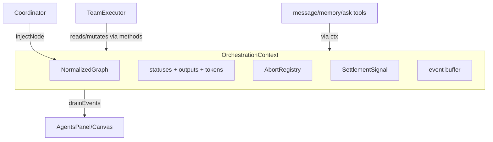

## 6. Edge Cases & Error Handling

| Case | Handling |
|---|---|
| `markDone` on an already-terminal node | no-op + warn (idempotent) |
| `cancel` on a node with no controller | no-op |
| `waitForNextSettlement` with nothing in flight and not all terminal | liveness guard (PLAN-08 §Q) emits `team:awaiting-user` or times out |
| port fired twice (double settlement) | guarded: only fires if status still pending |
| `recordTokens` for unknown provider shape | defaults to {0,0}, logs once |

## 7. Test Cases

```
gate.test.ts:
  - evaluateGate agent: all-done→FIRE, one-failed→SKIP, partial→WAIT
  - AND: all-done→FIRE, one-failed→SKIP, partial→WAIT, all-failed→SKIP
  - OR: 1-done→FIRE, 0-done-some-pending→WAIT, all-failed→SKIP
  - XOR: 1-done→FIRE, 0-done-pending→WAIT, all-failed→SKIP
  - NAND: 1-failed→FIRE, all-done→SKIP, all-pending→WAIT, all-failed→FIRE
  - evaluateLogicPort: aggregates only succeeded deps' outputs

context.test.ts:
  - markDone pushes event + resolves settlement signal
  - waitForNextSettlement blocks then resolves on notifySettled
  - markSkipped counts as settlement (skip cascade works)
  - firePort stores readable digest, not JSON
  - cancelXorLosers aborts running siblings + marks skipped
  - allTerminal() true only when every node done/error/skipped
  - drainEvents returns FIFO and empties buffer
  - recordTokens accumulates; verdict FAILED if any error

abort-registry.test.ts:
  - signal(node) returns stable signal per node
  - cancel(node) aborts that node's signal
  - cancelAll aborts every registered controller
```

## 8. Verification Checklist

- [ ] `npm test` green; ≥80% coverage on context/gate/abort
- [ ] No busy loop: a `run()` over a 3-node chain wakes exactly 3 times
- [ ] XOR over two agents cancels the loser's `AbortSignal` (assert `signal.aborted`)
- [ ] Skip cascade: erroring a root marks all descendants skipped via gate evaluation only
- [ ] `evaluateGate` matches the truth table for all 4 ports × 4 dep-state combinations

---

<a id="d2"></a>

## 2 · 2026-06-17 · PLAN-01 — Agent Definition System

Source: [PLAN-01-AGENT-DEFINITION-SYSTEM.md](PLAN-01-AGENT-DEFINITION-SYSTEM.md) · [[PLAN-01-AGENT-DEFINITION-SYSTEM]]  ·  [↑ Index](#index)


<!-- version: 1.0.0 -->
<!-- classification: PLAN -->
<!-- date: 2026-06-17 -->
<!-- last-updated: 2026-06-17 -->
<!-- feature: src/orchestration/team-schema.ts, src/orchestration/normalize.ts, .ai/roles/, .ai/skills/ -->
<!-- depends-on: none -->
<!-- enables: ALL other plans -->

## 1. Overview & Purpose

Defines the declarative `af-team.json` format, the Zod `TeamSchema`, role/skill loading,
and — critically — the **normalization pass** that turns `handoffTo` into real DAG edges and
runs cycle detection. Normalization makes the DAG the single source of truth so the
scheduler (PLAN-00/08) never disagrees with handoff intent (master plan PART II §L, fixes F4/F8).

## 2. Role Catalog (`.ai/roles/<role>.md`)

```
.ai/roles/
├── coordinator.md   — decomposes goals, dispatches, synthesizes
├── planner.md       — designs specs / af-plan.json
├── worker.md        — implements: writes code, runs tools
├── reviewer.md      — evaluates → APPROVE | REQUEST_CHANGES
├── critic.md        — adversarial, challenges assumptions
├── aggregator.md    — collects parallel outputs, applies gate logic
└── generic.md       — empty (user supplies systemPrompt)
```

Each is a markdown prompt fragment prepended to the agent's system prompt; skills append after.

## 3. TeamSchema (Zod)

```typescript
// src/orchestration/team-schema.ts
import { z } from 'zod'

const HandoffSpec = z.object({
  to: z.string().regex(/^[a-z][a-z0-9-]*$/),
  payload: z.union([
    z.enum(['full', 'summary']),
    z.string().regex(/^outputs\.[a-z][a-z0-9-._]*$/),
  ]).default('summary'),
})

const LogicPortType = z.enum(['AND', 'OR', 'XOR', 'NAND'])

const AgentNode = z.object({
  kind: z.literal('agent').default('agent'),
  name: z.string().regex(/^[a-z][a-z0-9-]*$/),
  role: z.enum(['coordinator','planner','worker','reviewer','critic','aggregator','generic']).optional(),
  skills: z.array(z.string()).default([]),
  provider: z.string().default('anthropic'),
  model: z.string().optional(),
  systemPrompt: z.string().optional(),
  maxTurns: z.number().int().min(1).max(100).default(20),
  maxTokens: z.number().int().min(256).max(200_000).default(8192),
  tools: z.array(z.string()).default([]),
  handoffTo: HandoffSpec.optional(),
  dependsOn: z.array(z.string()).default([]),
  timeout: z.number().int().positive().optional(),
  maxRetries: z.number().int().min(0).max(5).default(0),
  prompt: z.string().optional(),
})

const PortNode = z.object({
  kind: z.literal('port'),
  name: z.string().regex(/^[a-z][a-z0-9-]*$/),
  logicPort: LogicPortType,
  dependsOn: z.array(z.string()).min(2),
  description: z.string().optional(),
})

const AgentDef = z.discriminatedUnion('kind', [AgentNode, PortNode])

export const TeamSchema = z.object({
  version: z.literal('1.0'),
  name: z.string(),
  goal: z.string().optional(),
  coordinator: z.string().optional(),
  agents: z.array(AgentDef).min(1),
  maxConcurrency: z.number().int().min(1).max(20).default(4),
  sharedMemory: z.boolean().default(true),
  timeout: z.number().int().positive().optional(),       // team-level wall clock (seconds)
  promoteMemory: z.boolean().optional(),                 // PLAN-12 Layer1→Layer2 promotion
}).superRefine((data, ctx) => {
  const names = data.agents.map(a => a.name)
  names.filter((n, i) => names.indexOf(n) !== i)
       .forEach(d => ctx.addIssue({ code: 'custom', message: `Duplicate agent name: ${d}` }))
  const nameSet = new Set(names)
  for (const a of data.agents) {
    for (const dep of a.dependsOn) {
      if (!nameSet.has(dep)) ctx.addIssue({ code: 'custom', message: `${a.name}: dependsOn unknown '${dep}'` })
    }
    if (a.kind === 'agent' && a.handoffTo && !nameSet.has(a.handoffTo.to)) {
      ctx.addIssue({ code: 'custom', message: `${a.name}: handoffTo unknown '${a.handoffTo.to}'` })
    }
  }
  if (data.coordinator && !nameSet.has(data.coordinator)) {
    ctx.addIssue({ code: 'custom', message: `coordinator '${data.coordinator}' not in agents` })
  }
})

export type TeamDef = z.infer<typeof TeamSchema>
export type AgentDef = z.infer<typeof AgentDef>
export type AgentNode = z.infer<typeof AgentNode>
export type PortNode = z.infer<typeof PortNode>
export type HandoffSpec = z.infer<typeof HandoffSpec>
export type LogicPortType = z.infer<typeof LogicPortType>
```

## 4. Normalization (`src/orchestration/normalize.ts`) — fixes F4/F8

```typescript
import { detectCycles } from './graph.js'   // REUSE existing util

export class NormalizedGraph {
  constructor(
    readonly nodes: AgentDef[],
    readonly handoffEdges: Map<string, HandoffSpec>,   // `${from}->${to}` → spec
  ) {}
  dependentsOf(name: string): AgentDef[] {
    return this.nodes.filter(n => n.dependsOn.includes(name))
  }
  byName(name: string): AgentDef | undefined { return this.nodes.find(n => n.name === name) }
}

export class TeamError extends Error {}

export function normalizeTeam(team: TeamDef): NormalizedGraph {
  const nodes = structuredClone(team.agents)
  const handoffEdges = new Map<string, HandoffSpec>()
  for (const a of nodes) {
    if (a.kind === 'agent' && a.handoffTo) {
      const target = nodes.find(n => n.name === a.handoffTo!.to)
      if (!target) throw new TeamError(`handoffTo '${a.handoffTo.to}' not found (agent ${a.name})`)
      if (!target.dependsOn.includes(a.name)) target.dependsOn.push(a.name)   // handoff ⇒ edge
      handoffEdges.set(`${a.name}->${a.handoffTo.to}`, a.handoffTo)
    }
  }
  const cycles = detectCycles(nodes as unknown as { id: string; dependsOn: string[] }[])
  if (cycles.length) throw new TeamError(`Team cycle(s): ${cycles.map(c => c.join('→')).join('; ')}`)
  return new NormalizedGraph(nodes, handoffEdges)
}
```

> Note: `detectCycles` in `graph.ts` keys on `.id`; the normalizer maps `.name`→`.id` (adapt
> the call or add a thin shim). Verify against `src/orchestration/graph.ts:50`.

## 5. Skill Loading & System Prompt Assembly

```typescript
export async function loadSkillPrompt(skill: string): Promise<string> {
  for (const p of [`.ai/skills/${skill}.md`, join(configDir(), 'skills', `${skill}.md`)]) {
    try { return await readFile(p, 'utf8') } catch { /* try next */ }
  }
  throw new TeamError(`skill '${skill}' not found in .ai/skills or registry cache`)
}

export async function buildSystemPrompt(agent: AgentNode): Promise<string> {
  const rolePart = agent.systemPrompt
    ?? (agent.role && agent.role !== 'generic' ? await readRole(agent.role) : '')
  const skillParts = await Promise.all(agent.skills.map(loadSkillPrompt))
  return [rolePart, ...skillParts].filter(Boolean).join('\n\n---\n\n')
}
```

## 6. Provider Routing (extends `src/core/llm/index.ts`)

```typescript
export function getAdapter(provider: string, apiKey?: string): LLMAdapter {
  switch (provider) {
    case 'anthropic': return new AnthropicAdapter(apiKey)
    case 'openai':    return new OpenAIAdapter(apiKey)
    default:          return new OpenAICompatAdapter(provider, apiKey)  // PLAN-03
  }
}
```

## 7. af-team.json Examples

(1) minimal generic, (2) linear chain w/ handoffs, (3) parallel + AND port, (4) coordinator
+ workers + NAND. Full JSON in master plan §3.2 and PLAN-08 scenarios — include all four
verbatim in the implemented file.

## 7.5 Codebase Reality

| Assumed | Reality (file:line) | Resolution |
|---|---|---|
| `detectCycles(nodes-by-name)` | keys on `.id` (`graph.ts:50`); `Step` shape | `toGraphInput()` shim maps `{name,dependsOn}`→`{id:name,dependsOn}` (G14) |
| `.ai/roles/*.md` exist | absent | author 7 role files (§7.6) as part of this plan |
| `configDir()` | ad-hoc paths across code | define `configDir()` = `~/.config/agentfactory` once; reuse `ConfigStore`'s base if exposed |
| `NormalizedGraph` immutable | n/a | add `injectNodes()` (G13, body in PLAN-00 §4.7) — make `nodes` a mutable array |

```typescript
function toGraphInput(nodes: AgentDef[]): { id: string; dependsOn: string[] }[] {
  return nodes.map(n => ({ id: n.name, dependsOn: n.dependsOn }))
}
```

## 7.6 Role file bodies (author these `.ai/roles/*.md`)

Each is a short prompt fragment. Author all seven; representative content:
- `coordinator.md` — "You are a Coordinator. Decompose the goal into discrete tasks, assign each to the most capable agent, and at the end synthesize all results into one answer."
- `planner.md` — "You are a Planner. Produce a concrete, ordered plan/spec before any implementation. Do not write code."
- `worker.md` — "You are a Worker. Implement the task using the available tools. Store key outputs via the `memory` tool (e.g. key `patch`, `summary`)."
- `reviewer.md` — "You are a Reviewer. Evaluate the work. End with exactly `APPROVE` or `REQUEST_CHANGES: <reason>`. Store your verdict via `memory` key `verdict`."
- `critic.md` — "You are a Critic. Adversarially challenge assumptions and surface risks the others missed."
- `aggregator.md` — "You are an Aggregator. Merge the inputs you received into a single coherent result."
- `generic.md` — empty (user supplies `systemPrompt`).

## 7.7 Contracts

```
IMPORTS:
  z (zod), detectCycles ← graph.ts (existing), readFile/join (node)
  ConfigStore (optional, for configDir) ← src/core/config/store.ts (existing)
EXPORTS:
  TeamSchema, TeamDef, AgentDef, AgentNode, PortNode, HandoffSpec, LogicPortType  → ALL plans
  NormalizedGraph (+ dependentsOf, byName, injectNodes), normalizeTeam, TeamError  → PLAN-00,08,11
  buildSystemPrompt, loadSkillPrompt  → PLAN-08
```

## 7.8 Definition of Done

- [ ] `TeamSchema.parse` + `normalizeTeam` round-trips all 4 example files
- [ ] `detectCycles` shim rejects a handoff cycle
- [ ] 7 role files exist under `.ai/roles/`
- [ ] `buildSystemPrompt` concatenates role + skills (override path tested)
- [ ] `injectNodes` re-validates and rejects cyclic injections

## 8. Mermaid — validation + normalization flow

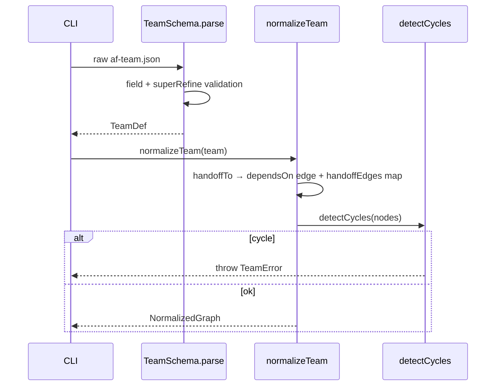

## 9. Edge Cases

| Case | Handling |
|---|---|
| handoffTo creates a cycle | normalizeTeam throws TeamError with the cycle path |
| port with <2 deps | Zod rejects (min 2) |
| skill missing everywhere | loadSkillPrompt throws actionable error |
| systemPrompt set on a role agent | systemPrompt replaces role text, skills still append |
| duplicate names | superRefine error before normalization |

## 10. Test Cases

```
team-schema.test.ts:  valid minimal; valid coordinator+ports; dup names; bad dependsOn;
  port min-2; coordinator missing; handoffTo missing target
normalize.test.ts:    handoffTo adds dependsOn edge; handoffEdges populated; cycle rejected;
  no-handoff team passes through unchanged
prompt.test.ts:       buildSystemPrompt role+skills order; systemPrompt override; generic=empty;
  loadSkillPrompt .ai first then registry; throws if absent
```

## 11. Verification Checklist

- [ ] `factory orchestrate --team af-team.json --dry-run` prints parsed + normalized team
- [ ] Invalid JSON → actionable Zod error with field path
- [ ] A `handoffTo` with no `dependsOn` still runs in correct order (edge was added)
- [ ] Cyclic team is rejected before any agent runs

---

<a id="d3"></a>

## 3 · 2026-06-17 · PLAN-02 — HandoffChain & HandoffPackage

Source: [PLAN-02-HANDOFF-CHAIN.md](PLAN-02-HANDOFF-CHAIN.md) · [[PLAN-02-HANDOFF-CHAIN]]  ·  [↑ Index](#index)


<!-- version: 1.0.0 -->
<!-- classification: PLAN -->
<!-- date: 2026-06-17 -->
<!-- last-updated: 2026-06-17 -->
<!-- feature: src/core/team/handoff.ts -->
<!-- depends-on: PLAN-01 -->
<!-- consumed-by: PLAN-03, PLAN-08 -->

## 1. Overview

A handoff is a structured relay: when agent A finishes, it packages its result and the
package becomes agent B's initial context. Distinct from `dependsOn` (which is pure
ordering) — though after PLAN-01 normalization every handoff *also* has a `dependsOn` edge.
Three payload modes: `summary` (default), `full`, `outputs.<key>`.

## 2. HandoffPackage Interface

```typescript
// src/core/team/handoff.ts
import type { MessageParam } from '@anthropic-ai/sdk/resources/messages.js'

export interface HandoffPackage {
  schema:       '1.0'
  fromAgent:    string
  fromRole:     string | undefined
  fromSkills:   string[]
  fromProvider: string
  fromModel:    string
  finishedAt:   string                       // ISO 8601
  tokensUsed:   { input: number; output: number }
  payload:      HandoffPayload
}

export type HandoffPayload =
  | { mode: 'summary'; summary: string }
  | { mode: 'full';    messages: MessageParam[] }
  | { mode: 'outputs'; key: string; value: string }
```

## 3. Payload spec parsing

```typescript
export function parseHandoffPayloadSpec(spec: string): { to: string; payload: string } {
  const [to, payload = 'summary'] = spec.split(':')
  return { to, payload }
}
// "worker"→summary · "worker:full"→full · "worker:outputs.diff"→outputs.diff
```

## 4. buildHandoffPackage — uses kernel tokens (fixes F9) and §R summary (fixes F13)

```typescript
export async function buildHandoffPackage(
  agent: AgentNode, session: Session, ctx: OrchestrationContext, spec: HandoffSpec,
): Promise<HandoffPackage> {
  let payload: HandoffPayload
  if (spec.payload === 'full') {
    payload = { mode: 'full', messages: [...session.getHistory()] }
  } else if (spec.payload === 'summary') {
    payload = { mode: 'summary', summary: await resolveSummary(agent, session, ctx) }
  } else {
    const key = spec.payload.slice('outputs.'.length)
    payload = { mode: 'outputs', key, value: ctx.memory.read(`${agent.name}/${key}`) ?? '' }
  }
  return {
    schema: '1.0', fromAgent: agent.name, fromRole: agent.role, fromSkills: agent.skills,
    fromProvider: agent.provider, fromModel: agent.model ?? 'unknown',
    finishedAt: new Date().toISOString(),
    tokensUsed: ctx.tokens.get(agent.name) ?? { input: 0, output: 0 },   // kernel, not session
    payload,
  }
}
```

### §R resolveSummary — no extra LLM call by default

```typescript
async function resolveSummary(agent: AgentNode, session: Session, ctx: OrchestrationContext): Promise<string> {
  const explicit = ctx.memory.read(`${agent.name}/summary`)
  if (explicit) return explicit                                  // 1. agent self-summarized
  const last = lastAssistantText(session)
  if (estimateTokens(last) <= 800) return last                   // 2. final message, free
  return summarizeWith(getAdapter(agent.provider), session)      // 3. last resort, source adapter
}
```

## 5. defaultSerializeHandoff — neutral receiving format

```typescript
export function defaultSerializeHandoff(pkg: HandoffPackage): MessageParam[] {
  const intro = [
    `You are receiving a handoff from **${pkg.fromAgent}**`,
    pkg.fromRole ? `(role: ${pkg.fromRole})` : '',
    pkg.fromSkills.length ? `with skills: ${pkg.fromSkills.join(', ')}` : '',
    `| via ${pkg.fromProvider} | tokens ${pkg.tokensUsed.input}in/${pkg.tokensUsed.output}out`,
  ].filter(Boolean).join(' ')

  if (pkg.payload.mode === 'full') return pkg.payload.messages
  const body = pkg.payload.mode === 'summary'
    ? `**Summary:**\n${pkg.payload.summary}`
    : `**Output (${pkg.payload.key}):**\n\`\`\`\n${pkg.payload.value}\n\`\`\``
  return [{ role: 'user', content: `${intro}\n\n${body}` }]
}
```

## 6. Mermaid — summary mode (memory-hit, no extra LLM call)

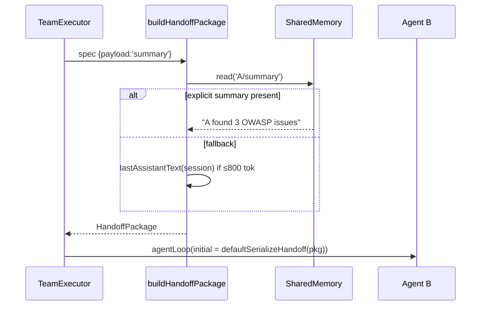

## 7. Mermaid — outputs.patch & full modes

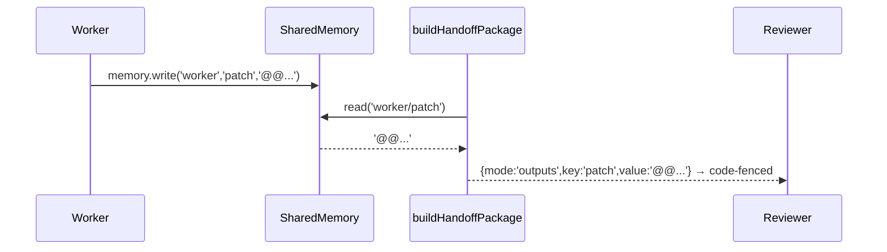
Full mode passes `session.getHistory()` verbatim; receiving agent gets entire trail
(⚠️ token-heavy; truncate oldest if it exceeds receiver `maxTokens`).

## 8. Edge Cases

| Case | Handling |
|---|---|
| `outputs.key` missing in memory | empty string + logged warning |
| `full` exceeds receiver maxTokens | truncate oldest messages, keep most recent |
| summary fallback LLM call fails | use last assistant text raw |
| handoffTo target already terminal (shouldn't happen post-normalize) | log + skip relay |

## 9. Test Cases

```
handoff.test.ts:
  - buildHandoffPackage summary: memory hit returns explicit
  - summary fallback: short last message used, no LLM call
  - full: returns all session messages
  - outputs.patch: reads SharedMemory key
  - outputs.missing: empty string, no throw
  - tokensUsed read from ctx.tokens (not session)
  - defaultSerializeHandoff summary/full/outputs shapes
  - parseHandoffPayloadSpec worker / worker:full / worker:outputs.diff
```

## 9.5 Codebase Reality

| Assumed | Reality | Resolution |
|---|---|---|
| `session.getTokenUsage()` | only `tokenCount()` (G7) | read `ctx.tokens.get(agent.name)` (kernel map, fed by `runAgentLoop`) |
| `summarizeWith(adapter, session)` | n/a | thin wrapper over `runAgentLoop` (maxTurns 1, "summarize in 1 paragraph") |
| `lastAssistantText(session)` | n/a | scan `session.getHistory()` for last `role:'assistant'` text |
| `estimateTokens(s)` | n/a | `Math.ceil(s.length / 4)` heuristic |
| `getAdapter(provider)` | added by PLAN-CORE §3.7 | import from `llm/index.ts` |

```typescript
function lastAssistantText(session: Session): string {
  const h = session.getHistory()
  for (let i = h.length - 1; i >= 0; i--) {
    const m = h[i]; if (m.role === 'assistant')
      return typeof m.content === 'string' ? m.content
        : m.content.filter(b => b.type === 'text').map(b => (b as { text: string }).text).join('\n')
  }
  return ''
}
const estimateTokens = (s: string) => Math.ceil(s.length / 4)
async function summarizeWith(adapter: LLMAdapter, session: Session): Promise<string> {
  const s = new Session()
  const { output } = await runAgentLoop(s, { adapter, systemPrompt: 'Summarize the following work in one paragraph.',
    initialMessages: [{ role: 'user', content: lastAssistantText(session).slice(0, 4000) }], maxTurns: 1 })
  return output
}
```

## 9.6 Contracts

```
IMPORTS:
  AgentNode, HandoffSpec ← PLAN-01 · Session ← core/session.ts · MessageParam ← anthropic sdk
  OrchestrationContext (ctx.tokens, ctx.memory) ← PLAN-00 · getAdapter, runAgentLoop ← PLAN-CORE
EXPORTS:
  HandoffPackage, HandoffPayload, buildHandoffPackage, defaultSerializeHandoff, parseHandoffPayloadSpec
    → PLAN-03 (serialize override), PLAN-08 (relay)
```

## 9.7 Integration test (crosses PLAN-03)

`handoff→serialize.test.ts`: build a summary `HandoffPackage`, pass through
`OpenAICompatAdapter('deepseek').serializeHandoff(pkg)` → assert resulting messages have
string `content` (no ContentBlock[]), intro line present.

## 10. Verification Checklist / Definition of Done

- [ ] Summary handoff with a prior `memory.write('A/summary',…)` makes **no** extra LLM call
- [ ] `outputs.patch` reaches receiver inside a code fence
- [ ] `tokensUsed` reflects kernel token map (G7), matching TUI totals
- [ ] helpers defined; no placeholders; Contracts resolve

---

<a id="d4"></a>

## 4 · 2026-06-17 · PLAN-03 — Cross-Provider LLM Adapters

Source: [PLAN-03-CROSS-PROVIDER-LLM.md](PLAN-03-CROSS-PROVIDER-LLM.md) · [[PLAN-03-CROSS-PROVIDER-LLM]]  ·  [↑ Index](#index)


<!-- version: 1.0.0 -->
<!-- classification: PLAN -->
<!-- date: 2026-06-17 -->
<!-- last-updated: 2026-06-17 -->
<!-- feature: src/core/llm/openai-compat-adapter.ts, extend src/core/llm/types.ts -->
<!-- depends-on: PLAN-02 -->
<!-- consumed-by: PLAN-08 -->

## 1. Overview

Lets agents on different providers (Claude → DeepSeek → Ollama …) hand off to each other.
A single `OpenAICompatAdapter` covers every OpenAI-compatible backend. Resolves API keys via
the existing Wave-5 `ConfigStore` first (fixes F14) and normalizes per-provider token usage
(fixes F9).

## 2. Extended LLMAdapter interface

```typescript
// src/core/llm/types.ts — add serializeHandoff
export interface LLMAdapter {
  readonly provider: string
  readonly defaultModel: string
  stream(messages: MessageParam[], opts: LLMStreamOptions): AsyncIterable<StreamChunk>
  serializeHandoff(pkg: HandoffPackage): MessageParam[]   // NEW
}
```

## 3. Provider routing table

```
anthropic → AnthropicAdapter                     ANTHROPIC_API_KEY
openai    → OpenAIAdapter                         OPENAI_API_KEY
deepseek  → OpenAICompatAdapter api.deepseek.com  DEEPSEEK_API_KEY
ollama    → OpenAICompatAdapter localhost:11434/v1 (no key)
gemini    → .../v1beta/openai                     GEMINI_API_KEY
groq      → api.groq.com/openai/v1                GROQ_API_KEY
together  → api.together.xyz/v1                    TOGETHER_API_KEY
<custom>  → AGENTFACTORY_<NAME>_URL                AGENTFACTORY_<NAME>_KEY
```

## 4. OpenAICompatAdapter

```typescript
// src/core/llm/openai-compat-adapter.ts
import { store } from '../config/store.js'    // REUSE Wave-5 ConfigStore (fixes F14)

interface ProviderConfig { baseURL: string; envVar: string; defaultModel: string }

const PROVIDER_CONFIGS: Record<string, ProviderConfig> = {
  deepseek: { baseURL: 'https://api.deepseek.com',  envVar: 'DEEPSEEK_API_KEY', defaultModel: 'deepseek-chat' },
  ollama:   { baseURL: 'http://localhost:11434/v1', envVar: '',                 defaultModel: 'llama3.2' },
  gemini:   { baseURL: 'https://generativelanguage.googleapis.com/v1beta/openai', envVar: 'GEMINI_API_KEY', defaultModel: 'gemini-1.5-pro' },
  groq:     { baseURL: 'https://api.groq.com/openai/v1', envVar: 'GROQ_API_KEY', defaultModel: 'llama-3.1-70b-versatile' },
  together: { baseURL: 'https://api.together.xyz/v1',    envVar: 'TOGETHER_API_KEY', defaultModel: 'meta-llama/Llama-3-70b-chat-hf' },
}

export class OpenAICompatAdapter implements LLMAdapter {
  readonly provider: string
  readonly defaultModel: string
  private baseURL: string
  private apiKey: string

  constructor(provider: string, apiKey?: string) {
    const conf = PROVIDER_CONFIGS[provider] ?? deriveConfig(provider)
    this.provider = provider
    this.baseURL = conf.baseURL
    this.defaultModel = conf.defaultModel
    // ConfigStore first, then env, then explicit arg
    this.apiKey = apiKey ?? store.get(provider) ?? (conf.envVar ? process.env[conf.envVar] ?? '' : 'local')
  }

  async *stream(messages: MessageParam[], opts: LLMStreamOptions): AsyncIterable<StreamChunk> {
    const body = {
      model: opts.model ?? this.defaultModel,
      messages: messages.map(convertAnthropicToOpenAI),
      tools: opts.tools.map(convertToOpenAITool),
      stream: true,
      stream_options: { include_usage: true },        // ensure usage emitted (fixes F9)
      max_tokens: opts.maxTokens,
    }
    const res = await fetch(`${this.baseURL}/chat/completions`, {
      method: 'POST',
      headers: { Authorization: `Bearer ${this.apiKey}`, 'Content-Type': 'application/json' },
      body: JSON.stringify(body),
      ...(opts.signal ? { signal: opts.signal } : {}),
    })
    for await (const chunk of parseSSEStream(res)) yield normalizeOpenAIChunk(chunk)
  }

  serializeHandoff(pkg: HandoffPackage): MessageParam[] {
    return defaultSerializeHandoff(pkg).map(convertMessageToOpenAICompat)
  }
}
```

## 5. Conversion helpers

- `convertAnthropicToOpenAI(msg)` — MessageParam → ChatCompletionMessageParam
- `convertMessageToOpenAICompat(msg)` — flatten ContentBlock[] → string
- `convertToOpenAITool(tool)` — ToolDef → OpenAI tool schema
- `normalizeOpenAIChunk(raw)` — delta.content→text_delta; delta.tool_calls→tool_start; usage→`{type:'usage'}`
- `parseSSEStream(res)` — async-iterate `data:` lines, JSON.parse, stop on `[DONE]`

### Usage normalization (per-provider field names)

```
OpenAI/DeepSeek/Groq: usage.prompt_tokens / usage.completion_tokens
Ollama:               prompt_eval_count / eval_count
Gemini(compat):       usageMetadata.promptTokenCount / candidatesTokenCount
→ all map to StreamChunk { type:'usage', inputTokens, outputTokens }
```

## 6. Mermaid — Claude → DeepSeek handoff

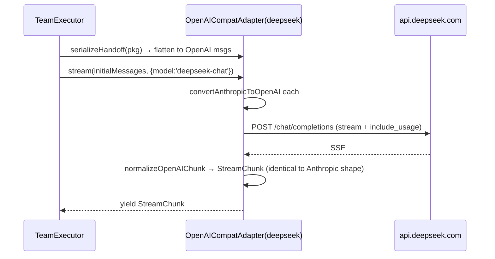

## 7. Mermaid — Ollama (local, no key)

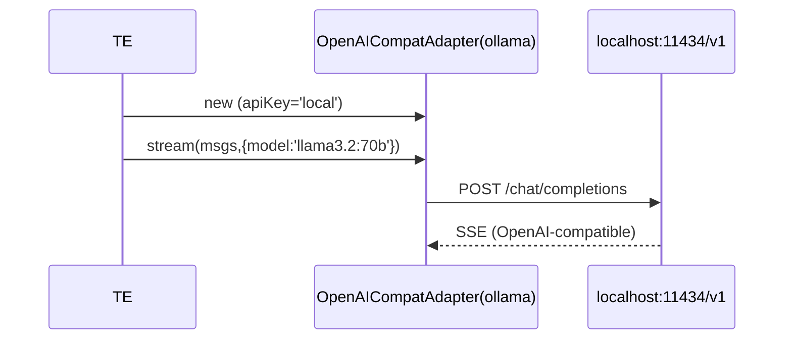

## 8. Edge Cases

| Case | Handling |
|---|---|
| no key for a remote provider | clear error: "set <PROVIDER>_API_KEY or run factory config" |
| Ollama not running | fetch ECONNREFUSED → agent marked error, retry/cascade |
| provider omits usage | StreamChunk usage absent → kernel records {0,0}, logs once |
| AbortSignal fires mid-stream | fetch aborts, generator returns cleanly |

## 9. Test Cases

```
openai-compat-adapter.test.ts:
  - stream(): mock fetch → yields normalized StreamChunk
  - stream(): AbortSignal cancels
  - serializeHandoff summary: OpenAI message shape (content is string)
  - serializeHandoff full: ContentBlock[] flattened
  - convertAnthropicToOpenAI: text + tool_use + tool_result variants
  - normalizeOpenAIChunk: content→text_delta, tool_calls→tool_start, usage mapped
  - key resolution: ConfigStore → env → arg precedence
  - getAdapter('ollama') localhost; ('deepseek') correct URL; unknown→deriveConfig
```

## 9.5 Codebase Reality

| Assumed | Reality | Resolution |
|---|---|---|
| `Provider = string` | `'anthropic'\|'openai'` union (`types.ts:3`) | widened by PLAN-CORE §3.7 |
| `getAdapter` | only `createAdapter` | added by PLAN-CORE §3.7; this plan supplies the `default:` branch |
| `store.get(provider)` | real method is `store.getKey(provider)` | use `store.getKey` |
| `StreamChunk` shape | exists `types.ts:9` incl `usage` | `normalizeOpenAIChunk` emits that exact union |
| `LLMStreamOptions.tools: ToolDef[]` | exists `types.ts:28` | map ToolDef→OpenAI tool |

`serializeHandoff` must be added to `AnthropicAdapter` and `OpenAIAdapter` too (interface
gained the method in PLAN-CORE) — for native providers it returns `defaultSerializeHandoff(pkg)`
unchanged.

## 9.6 Contracts

```
IMPORTS:
  LLMAdapter, LLMStreamOptions, StreamChunk, ToolDef, Provider ← llm/types.ts (PLAN-CORE-widened)
  HandoffPackage, defaultSerializeHandoff ← PLAN-02 · store ← config/store.ts (getKey)
EXPORTS:
  OpenAICompatAdapter, PROVIDER_CONFIGS  → PLAN-CORE getAdapter default branch, PLAN-08
  (AnthropicAdapter/OpenAIAdapter gain serializeHandoff)
```

## 10. Verification Checklist / Definition of Done

- [ ] A team with `provider:'deepseek'` agent runs end-to-end given key via ConfigStore or env
- [ ] Ollama agent runs with no key set
- [ ] Token totals populated for compat providers (usage normalized per §5)
- [ ] Handoff Claude→compat shows no ContentBlock format errors (integration test w/ PLAN-02)
- [ ] Native adapters implement `serializeHandoff` (= default)

---

<a id="d5"></a>

## 5 · 2026-06-17 · PLAN-04 — MessageBus

Source: [PLAN-04-MESSAGE-BUS.md](PLAN-04-MESSAGE-BUS.md) · [[PLAN-04-MESSAGE-BUS]]  ·  [↑ Index](#index)


<!-- version: 1.0.0 -->
<!-- classification: PLAN -->
<!-- date: 2026-06-17 -->
<!-- last-updated: 2026-06-17 -->
<!-- feature: src/core/team/message-bus.ts, src/core/tools/message.ts -->
<!-- depends-on: PLAN-01 -->
<!-- consumed-by: PLAN-07, PLAN-08, PLAN-10 -->

## 1. Overview

In-process pub/sub for agent-to-agent messages. No external broker. **Critical fix (§O / F6):**
agents are LLM loops and never spontaneously poll — so the kernel *auto-delivers* unread
messages into each agent's context at turn boundaries, in addition to the explicit `message`
tool. Without this, messages were write-only TUI decoration.

## 2. Interface & Class

```typescript
// src/core/team/message-bus.ts
export interface AgentMessage {
  id: string; from: string; to: string; content: string; timestamp: Date
}
export interface BusStats { total: number; perAgent: Record<string, { sent: number; received: number }> }

export class MessageBus {
  private messages: AgentMessage[] = []
  private readState = new Map<string, Set<string>>()        // agent → read ids
  private subscribers = new Map<string, Set<(m: AgentMessage) => void>>()

  send(from: string, to: string, content: string): AgentMessage {
    const m = { id: crypto.randomUUID(), from, to, content, timestamp: new Date() }
    this.messages.push(m)
    this.notify(to, m); this.notify('*', m)
    return m
  }
  broadcast(from: string, content: string): AgentMessage { return this.send(from, '*', content) }

  getUnread(agent: string): AgentMessage[] {
    const read = this.readState.get(agent) ?? new Set()
    return this.messages.filter(m => m.from !== agent && (m.to === agent || m.to === '*') && !read.has(m.id))
  }
  markRead(agent: string, ids: string[]): void {
    const s = this.readState.get(agent) ?? new Set(); ids.forEach(i => s.add(i)); this.readState.set(agent, s)
  }
  subscribe(agent: string, cb: (m: AgentMessage) => void): () => void { /* add + return unsub */ }
  getConversation(a: string, b: string): AgentMessage[] { /* a↔b ordered */ }
  getAll(): AgentMessage[] { return [...this.messages] }      // TUI
  getStats(): BusStats { /* counts */ }
  private notify(key: string, m: AgentMessage): void { this.subscribers.get(key)?.forEach(cb => cb(m)) }
}
```

## 3. MessageTool (explicit pull/send)

```typescript
// src/core/tools/message.ts
export const MessageTool = buildTool({
  name: 'message',
  description: 'Send a message to another agent in the team, or "*" to broadcast.',
  isReadOnly: false,
  inputSchema: { type: 'object', properties: {
    to:      { type: 'string', description: 'Agent name or "*"' },
    content: { type: 'string', description: 'Message content' },
  }, required: ['to', 'content'] },
  async call({ to, content }, ctx) {
    ctx.bus.send(ctx.agentName, to, content)
    return `Message sent to ${to}`
  },
})
```

## 4. Auto-delivery (§O — the F6 fix)

The kernel exposes a turn hook that `agentLoop` calls before each turn. It drains the agent's
unread and prepends them as a transient user message, then marks read.

```typescript
export function injectInbox(agentName: string, ctx: OrchestrationContext): MessageParam | null {
  const unread = ctx.bus.getUnread(agentName)
  if (!unread.length) return null
  ctx.bus.markRead(agentName, unread.map(m => m.id))
  const body = unread.map(m => `- **${m.from}**: ${m.content}`).join('\n')
  return { role: 'user', content: `📨 Team messages since your last turn:\n${body}` }
}
```

## 5. Mermaid — auto-delivery

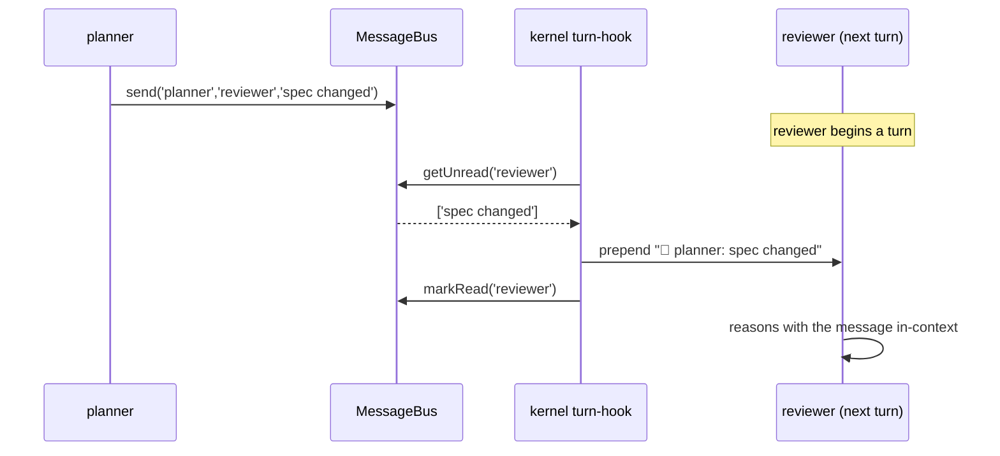

## 6. Mermaid — broadcast

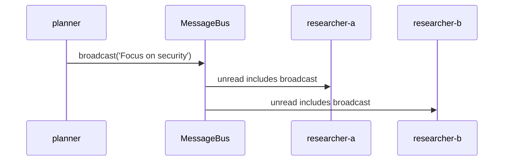

## 7. TUI feed (consumed by PLAN-10)

```
14:02:01  planner → *        "Focus on security aspects only"
14:02:15  worker → reviewer  "Patch ready at worker/patch"
●=unread  ↗=sent this turn   ↙=received this turn
```

## 8. Edge Cases

| Case | Handling |
|---|---|
| send to unknown agent name | message stored; never delivered; surfaced in TUI as undeliverable (warn) |
| broadcast does not echo to sender | `m.from !== agent` filter in getUnread |
| subscriber throws | caught, logged, other subscribers still notified |
| huge message | truncated in TUI feed; full text in rollout |

## 9. Test Cases

```
message-bus.test.ts: send/getUnread; broadcast to all-but-sender; markRead;
  subscribe/unsubscribe; getConversation order; getStats counts
message-tool.test.ts: call sends; broadcast; missing ctx.bus throws
inbox.test.ts: injectInbox returns prepend msg + marks read; null when no unread
```

## 9.5 Codebase Reality

| Assumed | Reality | Resolution |
|---|---|---|
| `buildTool({... call ...})` | no `buildTool`; tools use `run(input,ctx?)` | author via PLAN-CORE `buildTool`; `run` reads `ctx.bus`, `ctx.agentName` |
| "kernel hook before each turn" delivers inbox | no per-turn hook (G10) | use `onBeforeTurn` option (PLAN-CORE §3.6); `runAgentLoop` passes `injectInbox` |
| `ctx.bus`, `ctx.agentName` | `ToolUseContext` (PLAN-CORE §3.1) | import that type |

`injectInbox` (§4) is wired by `TeamExecutor` as `onBeforeTurn: s => injectInbox(node.name, ctx)`.

## 9.6 Contracts

```
IMPORTS:
  buildTool, ToolUseContext, Tool ← PLAN-CORE · MessageParam ← anthropic sdk
EXPORTS:
  MessageBus, AgentMessage, BusStats  → PLAN-00 (createContext), PLAN-07, PLAN-08, PLAN-10
  MessageTool, injectInbox            → PLAN-08 (tool list + onBeforeTurn)
```

## 9.7 Integration test (crosses PLAN-08)

`inbox-delivery.test.ts`: a worker `message('reviewer',…)`; run reviewer via `runAgentLoop`
with `onBeforeTurn: injectInbox`; assert the reviewer's session received a `📨` user message
and the bus marked it read.

## 10. Verification Checklist / Definition of Done

- [ ] A `message('reviewer', …)` from worker appears in reviewer's *context* next turn (not just TUI)
- [ ] Broadcast reaches all agents except sender
- [ ] TUI feed shows live traffic with badges
- [ ] `MessageTool.run` reads `ctx.bus`/`ctx.agentName`; throws clearly if absent

---

<a id="d6"></a>

## 6 · 2026-06-17 · PLAN-05 — SharedMemory (Runtime, Layer 1)

Source: [PLAN-05-SHARED-MEMORY.md](PLAN-05-SHARED-MEMORY.md) · [[PLAN-05-SHARED-MEMORY]]  ·  [↑ Index](#index)


<!-- version: 1.0.0 -->
<!-- classification: PLAN -->
<!-- date: 2026-06-17 -->
<!-- last-updated: 2026-06-17 -->
<!-- feature: src/core/team/shared-memory.ts, src/core/tools/memory.ts -->
<!-- depends-on: PLAN-01 -->
<!-- consumed-by: PLAN-08, PLAN-10, PLAN-12 -->

## 1. Overview

Ephemeral, namespaced key-value store shared by all agents **within one team run**. This is
**Layer 1** of the 3-layer memory model (PLAN-12 adds persistent Layers 2/3). `getSummary()`
is injected at each agent's SessionStart via `additionalContext` — the same seam reused by
message auto-delivery (§O) and tiered memory (PLAN-12).

## 2. Interface & Class

```typescript
// src/core/team/shared-memory.ts
export interface MemoryEntry {
  value: string; agentName: string; key: string; updatedAt: string; createdAt: string
}

export class SharedMemory {
  private store = new Map<string, MemoryEntry>()    // 'agent/key' → entry
  constructor(private persistPath?: string) {}

  write(agentName: string, key: string, value: string): void {
    const k = `${agentName}/${key}`
    const prev = this.store.get(k)
    const now = new Date().toISOString()
    this.store.set(k, { value, agentName, key, updatedAt: now, createdAt: prev?.createdAt ?? now })
  }
  read(fqKey: string): string | undefined { return this.store.get(fqKey)?.value }
  readAll(agentName: string): Record<string, string> {
    const out: Record<string, string> = {}
    for (const [k, e] of this.store) if (e.agentName === agentName) out[e.key] = e.value
    return out
  }
  entries(): IterableIterator<[string, MemoryEntry]> { return this.store.entries() }
  getSummary(): string { /* §3 */ }
  async persist(): Promise<void> { /* JSON to persistPath */ }
  async load(): Promise<void> { /* restore; missing file = empty */ }
  clear(): void { this.store.clear() }
  getStats(): { entries: number; agents: string[] } { /* ... */ }
}
```

## 3. getSummary() output

```markdown
## Team Memory

### planner
- **findings**: "CRITICAL: 3 OWASP violations: (1) line 12 weak secret…"
- **status**: "audit complete"

### worker
- **patch**: "@@ -12,3 +12,5 @@ const secret = process.env…"
```

Values truncated at 200 chars for context safety. Empty store → `""` (caller skips injection).

## 4. Persistence format (`~/.config/agentfactory/team-memory.json`)

```json
{ "version": "1.0", "savedAt": "…", "teamName": "security-audit",
  "entries": { "planner/findings": { "value": "…", "agentName": "planner", "key": "findings", "updatedAt": "…", "createdAt": "…" } } }
```

## 5. Context injection (RE-HOMED — see PLAN-CORE §3.8, fixes G5)

> ⚠️ The original design injected `getSummary()` via a `SessionStart` hook returning
> `additionalContext`. **That channel does not exist** — `HookResult` is `{continue}` only and
> hooks are shell scripts (`hooks.ts:15`). Injection is **re-homed** to the executor, which
> passes the merged context to `runAgentLoop({ additionalContext })`:

```typescript
// in TeamExecutor.runAgent (PLAN-08), NOT a hook:
const additionalContext = [
  await memoryManager.inject(node.prompt),   // PLAN-12 Layers 3+2 (if present)
  ctx.memory.getSummary(),                   // this plan, Layer 1
].filter(Boolean).join('\n\n')
await runAgentLoop(session, { ..., additionalContext })
```
`getSummary()` therefore just needs to return the markdown block (no hook plumbing). PLAN-12's
`inject()` is concatenated *ahead* of it.

## 6. MemoryTool

```typescript
// src/core/tools/memory.ts
export const MemoryTool = buildTool({
  name: 'memory',
  description: 'Store a value in shared team memory for this run. Other agents read it. Use for findings, patches, verdicts, and your own one-line summary (key "summary").',
  inputSchema: { type: 'object', properties: {
    key:   { type: 'string' }, value: { type: 'string' },
  }, required: ['key', 'value'] },
  async call({ key, value }, ctx) {
    ctx.memory.write(ctx.agentName, key, value)
    return `Stored ${ctx.agentName}/${key} (${value.length} chars)`
  },
})
```

## 7. Mermaid — write → inject

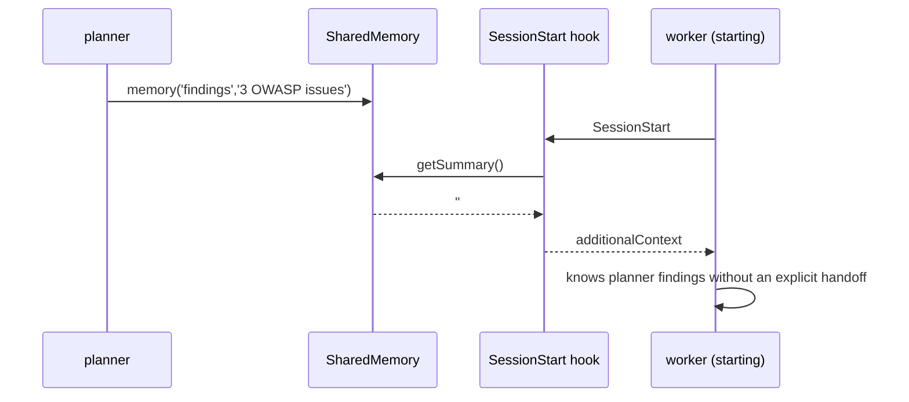

## 8. Edge Cases

| Case | Handling |
|---|---|
| write same key twice | overwrite value, keep original createdAt |
| getSummary on empty store | "" |
| persist on disk error | log, keep in-memory |
| load missing file | empty store, no throw |

## 9. Test Cases

```
shared-memory.test.ts: write/read; namespace isolation; readAll; getSummary markdown;
  empty→""; 200-char truncation; persist/load round-trip; missing-file load; clear; getStats
memory-tool.test.ts: call writes namespaced; "summary" key feeds PLAN-02 §R
```

## 9.5 Codebase Reality & Contracts

| Assumed | Reality | Resolution |
|---|---|---|
| SessionStart hook returns `additionalContext` | impossible (G5) | re-homed to `runAgentLoop({additionalContext})` (§5) |
| `buildTool` for MemoryTool | absent | PLAN-CORE `buildTool`; `run` reads `ctx.memory`, `ctx.agentName` |
| persist path | `~/.config/agentfactory/team-memory.json` | reuse `configDir()` (PLAN-01) |

```
IMPORTS: buildTool, ToolUseContext ← PLAN-CORE · configDir ← PLAN-01
EXPORTS: SharedMemory, MemoryEntry, MemoryTool  → PLAN-00, PLAN-08, PLAN-12
```

## 10. Verification Checklist / Definition of Done

- [ ] worker sees planner's `memory.write` via injected context (no handoff needed)
- [ ] `memory.write('summary', …)` makes the summary handoff free (PLAN-02 §R)
- [ ] team-memory.json written at run end and reloadable
- [ ] injection re-homed (no reliance on a hook return channel)

---

<a id="d7"></a>

## 7 · 2026-06-17 · PLAN-06 — Logic Ports

Source: [PLAN-06-LOGIC-PORTS.md](PLAN-06-LOGIC-PORTS.md) · [[PLAN-06-LOGIC-PORTS]]  ·  [↑ Index](#index)


<!-- version: 1.0.0 -->
<!-- classification: PLAN -->
<!-- date: 2026-06-17 -->
<!-- last-updated: 2026-06-17 -->
<!-- feature: src/orchestration/gate.ts (port rules), src/tui/panels/OrchestrationCanvas.ts -->
<!-- depends-on: PLAN-00, PLAN-01 -->
<!-- consumed-by: PLAN-08, PLAN-10 -->

## 1. Overview

Logic ports are **non-agent DAG nodes** that gate flow with boolean logic. They fire *early*
(before all deps resolve) — which is the whole point and what the original `readySet` broke
(PART II §F2). The fix is the kernel **tri-state gate** (PLAN-00 §3); this plan owns the port
truth-table semantics and the canvas diamond rendering.

## 2. Port semantics (tri-state gate, from PLAN-00)

| Port | FIRE when | SKIP when | else |
|---|---|---|---|
| AND | all deps done | any dep failed | WAIT |
| OR | ≥1 dep done | all deps failed | WAIT |
| XOR | ≥1 dep done (first wins, cancel rest) | all deps failed | WAIT |
| NAND | ≥1 dep failed/skipped | all deps done | WAIT |

`evaluateGate` (PLAN-00 §3) returns FIRE/SKIP/WAIT; `evaluateLogicPort` aggregates the
succeeded deps' outputs into a readable digest (PLAN-00 §4.1 — not JSON soup, fixes F10).

## 3. XOR cancellation (fixes F5)

When XOR fires on the first success, the kernel `cancelXorLosers(port)` aborts every still-
`running` sibling via the AbortRegistry and marks them skipped. The loser's `agentLoop`
actually stops (its `AbortSignal` fires) instead of silently burning tokens.

## 4. Canvas diamond rendering

```typescript
// src/tui/panels/OrchestrationCanvas.ts
function renderPortBlock(buf: CellBuffer, block: PortBlock, status: StepStatus): void {
  const color = { AND: Colors.yellow, OR: Colors.green, XOR: Colors.purple, NAND: Colors.orange }[block.logicPort]
  const statusChar = status === 'done' ? '✓' : status === 'error' ? '✗' : '◇'
  //   ╱ AND ╲
  //  ╱       ╲
  //  ╲       ╱
  //   ╲_____╱
  buf.write(block.row,     block.col + 2, `╱ ${block.logicPort} ╲`, { fg: color })
  buf.write(block.row + 1, block.col,     `╱           ╲`,          { fg: color })
  buf.write(block.row + 2, block.col,     `╲           ╱`,          { fg: color })
  buf.write(block.row + 3, block.col + 2, `╲_________╱`,            { fg: color })
  buf.write(block.row + 1, block.col + 5, statusChar, { fg: color, bold: true })
}
```

## 5. Mermaid — AND (all succeed) → synthesizer

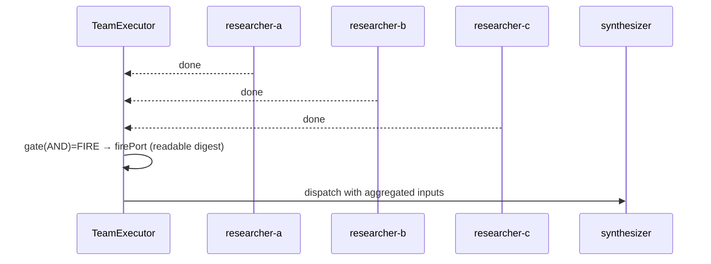

## 6. Mermaid — AND one fails → cascade skip

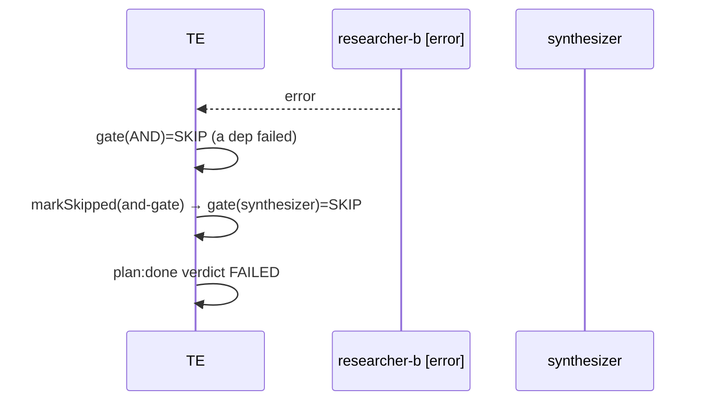

## 7. Mermaid — XOR race (cancel loser)

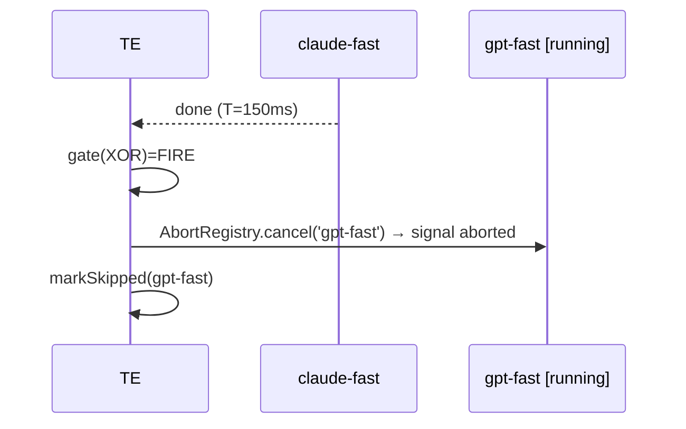

## 8. Mermaid — NAND escalation

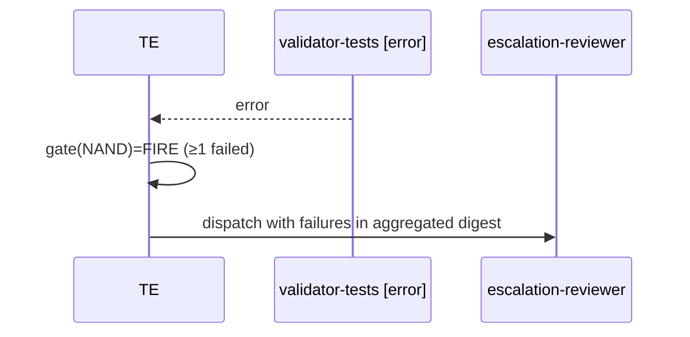

## 9. Canvas status colors

```
pending    dim grey  ◇
evaluating yellow     ◇ (some inputs in)
fired      AND=yellow OR=green XOR=purple NAND=orange  ✓
skipped    dim red    ◇
```

## 10. Edge Cases

| Case | Handling |
|---|---|
| port with all deps skipped | OR/XOR → SKIP; NAND → FIRE (a skip counts as "not all done") |
| XOR with two deps finishing same tick | first in settlement order fires; second cancelled |
| port depends on another port | works; ports settle like nodes |

## 11. Test Cases

```
(gate truth-table lives in PLAN-00 gate.test.ts)
logic-port-integration.test.ts (in team-executor.test.ts):
  - AND all done → fires + synthesizer runs
  - AND one error → skip cascade
  - OR first done → fires immediately, others irrelevant
  - XOR first done → fires + loser AbortSignal.aborted === true
  - NAND one error → fires + escalation runs; all done → skip
canvas: renderPortBlock diamond shape + per-type color + status char
```

## 11.5 Codebase Reality & Contracts

| Assumed | Reality | Resolution |
|---|---|---|
| `PortBlock`, canvas block model | `OrchestrationCanvas` has its own `Block` interface (`OrchestrationCanvas.ts`) | add a `PortBlock` variant + `renderPortBlock`; map from `PortNode` in `syncFromTeam` (PLAN-10) |
| `Colors.orange` | `theme.ts` may lack orange | add an orange (256-color ~208) to `theme.ts` if absent |
| gate logic | lives in PLAN-00 `gate.ts` | this plan only owns port *semantics doc* + canvas render |

```
IMPORTS: evaluateGate, evaluateLogicPort, LogicPortResult, GateType ← PLAN-00 · PortNode ← PLAN-01
  CellBuffer, Colors ← tui/renderer · StepStatus ← executor.ts
EXPORTS: renderPortBlock, PortBlock  → PLAN-10
```

## 12. Verification Checklist / Definition of Done

- [ ] OR fires before its 2nd/3rd dep finishes
- [ ] XOR loser's agentLoop is actually aborted (token spend stops)
- [ ] NAND fires on first failure, routes to escalation
- [ ] Canvas shows colored diamonds with live fraction (e.g. `[2/3]`)
- [ ] orange color present in `theme.ts`; gate logic imported (not duplicated)

---

<a id="d8"></a>

## 8 · 2026-06-17 · PLAN-07 — AgentAsk

Source: [PLAN-07-AGENT-ASK.md](PLAN-07-AGENT-ASK.md) · [[PLAN-07-AGENT-ASK]]  ·  [↑ Index](#index)


<!-- version: 1.0.0 -->
<!-- classification: PLAN -->
<!-- date: 2026-06-17 -->
<!-- last-updated: 2026-06-17 -->
<!-- feature: src/core/team/ask-broker.ts, src/core/tools/ask.ts, src/tui/widgets/AgentAskWidget.ts -->
<!-- depends-on: PLAN-00, PLAN-01, PLAN-04 -->
<!-- consumed-by: PLAN-08, PLAN-10 -->

## 1. Overview

A running agent can pause and ask the user a question; the agent resumes when answered while
**other agents keep running**. Novel to agentfactory-harness. **Critical fix (§M / F3):** the
pause must **release the agent's pool slot**, otherwise N concurrent asks deadlock the
Semaphore.

## 2. AskBroker

```typescript
// src/core/team/ask-broker.ts
export interface AskRequest { question: string; options?: string[]; context?: string }
export interface PendingAsk {
  id: string; agentName: string; question: string; options: string[]
  context: string | undefined; askedAt: Date; resolve: (answer: string) => void
}
export type AskEvent = PendingAsk | { askId: string; answer: string; agentName: string }

export class AskBroker {
  private pending = new Map<string, PendingAsk>()
  private handlers = new Map<string, Set<(e: AskEvent) => void>>()

  request(agentName: string, q: AskRequest): Promise<string> {
    return new Promise(resolve => {
      const ask: PendingAsk = { id: crypto.randomUUID(), agentName, question: q.question,
        options: q.options ?? [], context: q.context, askedAt: new Date(), resolve }
      this.pending.set(ask.id, ask)
      this.emit('ask', ask)
    })
  }
  answer(askId: string, answer: string): void {
    const ask = this.pending.get(askId)
    if (!ask) throw new Error(`Unknown askId: ${askId}`)
    this.pending.delete(askId)
    this.emit('ask:resolved', { askId, answer, agentName: ask.agentName })
    ask.resolve(answer)
  }
  getPending(): PendingAsk[] { return [...this.pending.values()] }
  on(event: 'ask' | 'ask:resolved', cb: (e: AskEvent) => void): () => void { /* ... */ }
  private emit(event: string, data: AskEvent): void { this.handlers.get(event)?.forEach(cb => cb(data)) }
}
```

## 3. AskTool — slot-releasing (§M fix)

```typescript
// src/core/tools/ask.ts
export const AskTool = buildTool({
  name: 'ask',
  description: 'Ask the user a question and wait for an answer. Use ONLY when genuinely blocked.',
  isReadOnly: true,
  inputSchema: { type: 'object', properties: {
    question: { type: 'string' },
    options:  { type: 'array', items: { type: 'string' } },
    context:  { type: 'string' },
  }, required: ['question'] },
  async call({ question, options, context }, ctx) {
    if (!ctx.broker) throw new Error('ask unavailable outside team sessions')
    // release pool slot while blocked (fixes F3), re-acquire before resuming
    return ctx.pool.withSlotReleased(ctx.agentName, () =>
      ctx.broker.request(ctx.agentName, { question, options, context }))
  },
})
```

`AgentPool.withSlotReleased` (defined in PLAN-08 §2): `release()` → `notifySettled` (wake the
scheduler to use the freed slot) → await fn → `acquire()` before returning.

## 4. AgentAskWidget (TUI)

```typescript
// src/tui/widgets/AgentAskWidget.ts
export class AgentAskWidget {
  private asks: PendingAsk[] = []
  private selectedAskIdx = 0
  private selectedOptionIdx = 0
  private customInput = ''
  private inputMode: 'options' | 'custom' = 'options'
  constructor(private broker: AskBroker, private rect: Rect) {
    broker.on('ask', a => this.addAsk(a as PendingAsk))
    broker.on('ask:resolved', e => this.removeAsk((e as { askId: string }).askId))
  }
  render(buf: CellBuffer): void {}      // bar (≤1) or overlay (≥2 / long)
  onKey(e: KeyEvent): void {}           // Tab=cycle, Enter=confirm, Esc=custom
  addAsk(a: PendingAsk): void {}
}
```

## 5. Mermaid — full lifecycle (with slot release)

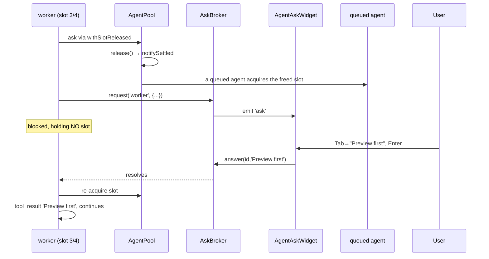

## 6. Mermaid — concurrent asks

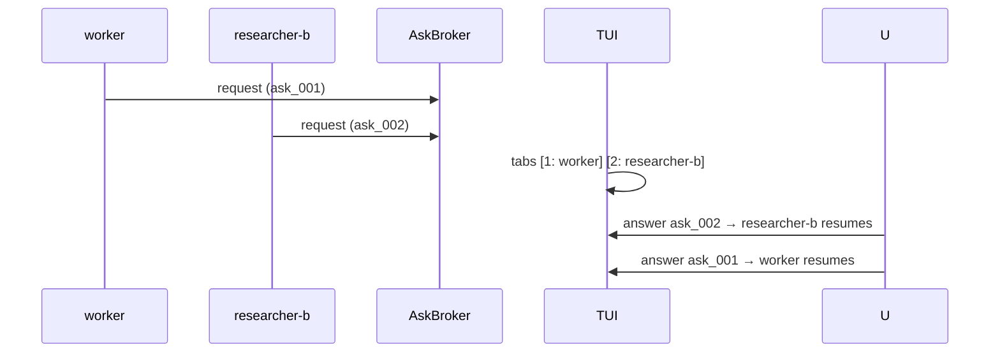

## 7. TUI rendering

```
Bar (1 ask):  [!] worker: "Apply risky fix?" [ Yes ] [ No ] [ … ]
Overlay (≥2): boxed question + context + options + "Pending: worker(1), researcher-b(2)"
Custom (Esc): "> free text_   (Enter send · Esc cancel)"
```

## 8. Edge Cases

| Case | Handling |
|---|---|
| user never answers | agent stays parked (no slot held); liveness guard emits `team:awaiting-user` (PLAN-08 §Q) |
| answer unknown id | throws clear error |
| broker has no free slot to re-acquire on resume | waits in Semaphore queue (no deadlock — slot was released) |
| ask outside team session | tool throws ("unavailable outside team sessions") |

## 9. Test Cases

```
ask-broker.test.ts: request/answer resolves; unknown id throws; getPending; on('ask'); on('ask:resolved');
  multiple concurrent resolved independently
ask-tool.test.ts: call invokes withSlotReleased+request; releases then re-acquires; no broker throws
agent-ask-widget.test.ts: render question+options; Tab cycles; Enter answers; Esc custom; 2 asks → tabs; empty → nothing
slot-release.test.ts: 4 agents all asking → a 5th queued agent still gets dispatched (no deadlock)
```

## 9.5 Codebase Reality & Contracts

| Assumed | Reality | Resolution |
|---|---|---|
| `buildTool({... call ...})` | `run(input,ctx?)` (PLAN-CORE) | author AskTool via `buildTool`; `run` reads `ctx.broker`, `ctx.pool`, `ctx.agentName` |
| `ctx.pool.withSlotReleased` | defined in PLAN-08 §2 | import via ctx |
| widget focus/keys | `InputRouter` dispatches to focused panel (`input/router.ts`) | AgentAskWidget registers as a focus target; reuse `KeyEvent` |
| `AskRequest`, `AskEvent` | n/a | defined §2 here |

```
IMPORTS: buildTool, ToolUseContext ← PLAN-CORE · AgentPool ← PLAN-08 · CellBuffer, Rect, KeyEvent ← tui
EXPORTS: AskBroker, PendingAsk, AskRequest, AskEvent, AskTool, AgentAskWidget
  → PLAN-00 (createContext), PLAN-08 (tool list + awaiting-user), PLAN-10 (overlay)
```

## 9.6 Integration test (crosses PLAN-08)

`ask-no-deadlock.test.ts`: pool max=2; two agents both call `ask`; assert a third ready agent
acquires a slot while the two are parked; answering resumes them in order.

## 10. Verification Checklist / Definition of Done

- [ ] With maxConcurrency=4 and 4 agents asking, a 5th ready agent still runs (F3 gone)
- [ ] Other agents visibly progress while one is parked on an ask
- [ ] Custom answer text reaches the agent verbatim
- [ ] `team:awaiting-user` shown when everything is parked on asks
- [ ] AskTool.run resolves through `withSlotReleased` (slot released then re-acquired)

---

<a id="d9"></a>

## 9 · 2026-06-17 · PLAN-08 — TeamExecutor Engine

Source: [PLAN-08-TEAM-EXECUTOR.md](PLAN-08-TEAM-EXECUTOR.md) · [[PLAN-08-TEAM-EXECUTOR]]  ·  [↑ Index](#index)


<!-- version: 1.0.0 -->
<!-- classification: PLAN -->
<!-- date: 2026-06-17 -->
<!-- last-updated: 2026-06-17 -->
<!-- feature: src/orchestration/team-executor.ts, team-runner.ts, scheduler.ts, src/core/team/agent-pool.ts -->
<!-- depends-on: PLAN-00, PLAN-01, PLAN-02, PLAN-03, PLAN-04, PLAN-05 -->
<!-- consumed-by: PLAN-09, PLAN-10, PLAN-11 -->

## 1. Overview

The orchestration heart. Drives the **settlement-driven loop** (PART II §K — fixes the
busy-loop F1, broken early-firing F2, and ordering race F11), wires the AgentPool with
slot-releasing asks (§M/F3), runs agents with per-agent AbortSignal (§N/F5), retries with
backoff, and cascades skips through the tri-state gate.

## 2. AgentPool + Semaphore (with withSlotReleased — fixes F3)

```typescript
// src/core/team/agent-pool.ts
class Semaphore {
  private count: number; private queue: (() => void)[] = []
  constructor(max: number) { this.count = max }
  async acquire(): Promise<void> {
    if (this.count > 0) { this.count--; return }
    return new Promise(res => this.queue.push(res))
  }
  release(): void { const n = this.queue.shift(); if (n) n(); else this.count++ }
}

export class AgentPool {
  private semaphore: Semaphore
  private running = new Map<string, Promise<string>>()
  constructor(maxConcurrency: number, private ctx: OrchestrationContext) {
    this.semaphore = new Semaphore(maxConcurrency)
  }
  async run(agentName: string, fn: () => Promise<string>): Promise<string> {
    await this.semaphore.acquire()
    try { const p = fn(); this.running.set(agentName, p); return await p }
    finally { this.running.delete(agentName); this.semaphore.release() }
  }
  async withSlotReleased<T>(agentName: string, fn: () => Promise<T>): Promise<T> {
    this.semaphore.release()
    this.ctx.notifySettled(`${agentName}:ask-wait`)   // wake scheduler to use freed slot
    try { return await fn() } finally { await this.semaphore.acquire() }
  }
  activeCount(): number { return this.running.size }
}
```

## 3. Scheduler (dependency-first)

```typescript
// src/orchestration/scheduler.ts
export type SchedulerStrategy = 'dependency-first' | 'round-robin' | 'least-busy'
export class Scheduler {
  constructor(private strategy: SchedulerStrategy = 'dependency-first') {}
  prioritize(ready: AgentDef[], all: AgentDef[], statuses: Map<string, StepStatus>): AgentDef[] {
    if (this.strategy === 'round-robin') return ready
    if (this.strategy === 'least-busy')  return [...ready] // (stable; pool enforces concurrency)
    return [...ready].sort((a, b) => this.criticality(b, all) - this.criticality(a, all))
  }
  private criticality(node: AgentDef, all: AgentDef[]): number {
    // BFS over dependents: how many nodes are (transitively) blocked on this one
    let count = 0; const seen = new Set<string>(); const q = [node.name]
    while (q.length) { const n = q.shift()!; for (const d of all) {
      if (d.dependsOn.includes(n) && !seen.has(d.name)) { seen.add(d.name); count++; q.push(d.name) } } }
    return count
  }
}
```

## 4. TeamExecutor — settlement loop (REVISED, fixes F1/F2/F11)

```typescript
// src/orchestration/team-executor.ts
export class TeamExecutor {
  private settled: string[] = []
  private pendingHandoffs = new Map<string, HandoffPackage>()
  constructor(private ctx: OrchestrationContext, private pool: AgentPool, private sched: Scheduler) {}

  async *run(): AsyncGenerator<TeamStepEvent> {
    for (const n of this.ctx.graph.nodes) this.ctx.statuses.set(n.name, 'pending')
    this.dispatchReady()                                   // prime: zero-dep nodes
    while (!this.ctx.allTerminal()) {
      await this.ctx.waitForNextSettlement()               // zero-CPU block (F1)
      yield* this.ctx.drainEvents()
      while (this.settled.length) {
        const name = this.settled.shift()!
        this.evaluateDependents(name)
        yield* this.ctx.drainEvents()
      }
    }
    yield { type: 'plan:done', verdict: this.ctx.verdict() }
  }

  private dispatchReady(): void {
    for (const node of this.ctx.graph.nodes) {
      if (this.ctx.statuses.get(node.name) !== 'pending') continue
      if (node.dependsOn.length === 0 && evaluateGate(node, this.ctx.statuses) === 'FIRE') {
        this.fire(node)
      }
    }
  }

  private evaluateDependents(settled: string): void {
    for (const dep of this.ctx.graph.dependentsOf(settled)) {
      if (this.ctx.statuses.get(dep.name) !== 'pending') continue
      const gate = evaluateGate(dep, this.ctx.statuses)    // FIRE | SKIP | WAIT (PLAN-00 §3)
      if (gate === 'WAIT') continue
      if (gate === 'SKIP') { this.ctx.markSkipped(dep.name); this.settled.push(dep.name); continue }
      this.fire(dep)
    }
  }

  private fire(node: AgentDef): void {
    if (node.kind === 'port') {
      const res = evaluateLogicPort(node, this.ctx.statuses, this.ctx.outputs)
      this.ctx.firePort(node.name, res)
      if (node.logicPort === 'XOR') this.ctx.cancelXorLosers(node)
      this.settled.push(node.name)
      return
    }
    this.ctx.markRunning(node.name)
    void this.pool.run(node.name, () => this.runAgent(node))
      .then(out => { this.ctx.markDone(node.name, out) })
      .catch(err => { this.ctx.markError(node.name, err) })  // cascade happens via gate on dependents
      .finally(() => this.settled.push(node.name))
  }

  private buildInitialMessages(node: AgentNode): MessageParam[] {
    const pkg = this.pendingHandoffs.get(node.name)
    if (pkg) return getAdapter(node.provider).serializeHandoff(pkg)
    // else thread dep outputs as plain context
    return node.dependsOn
      .map(d => this.ctx.outputs.get(d)).filter(Boolean)
      .map(o => ({ role: 'user' as const, content: o! }))
  }

  private async runAgent(node: AgentNode): Promise<string> {
    let attempt = 0
    for (;;) {
      try {
        const adapter = getAdapter(node.provider)
        const systemPrompt = await buildSystemPrompt(node)
        const session = new Session()
        const signal = this.ctx.abort.signal(node.name)            // §N cancellation
        const output = await runAgentLoop(session, {
          adapter, systemPrompt, initialMessages: this.buildInitialMessages(node),
          tools: this.buildTools(node), maxTurns: node.maxTurns, signal, ctx: this.ctx,
        })
        if (node.handoffTo) {
          const pkg = await buildHandoffPackage(node, session, this.ctx, node.handoffTo)
          this.pendingHandoffs.set(node.handoffTo.to, pkg)
        }
        return output
      } catch (err) {
        if (signalAborted(this.ctx.abort.signal(node.name))) throw err   // don't retry a cancel
        if (attempt >= node.maxRetries) throw err
        await sleep(Math.min(1000 * 2 ** attempt, 30_000)); attempt++
      }
    }
  }
}
```

## 5. TeamRunner (wires kernel + pool + liveness — §Q)

```typescript
// src/orchestration/team-runner.ts
export async function runTeam(teamDef: TeamDef, opts?: TeamRunnerOptions): Promise<TeamRunResult> {
  const graph = normalizeTeam(teamDef)                      // PLAN-01 §L
  const ctx = createContext(graph, teamDef)                 // PLAN-00
  const pool = new AgentPool(teamDef.maxConcurrency, ctx)
  const exec = new TeamExecutor(ctx, pool, new Scheduler('dependency-first'))

  opts?.onAsk && ctx.broker.on('ask', opts.onAsk)
  const timer = startTeamTimeout(teamDef.timeout ?? 1800, ctx)  // §Q wall clock
  const livenessGuard = watchAllParked(ctx, pool)               // §Q awaiting-user

  const results = new Map<string, string>()
  for await (const ev of exec.run()) {
    if (ev.type === 'step:done') results.set(ev.stepId, ev.output ?? '')
    opts?.onProgress?.(ev)
  }
  clearTimeout(timer); livenessGuard.stop()
  await ctx.memory.persist()
  if (teamDef.promoteMemory) await promoteDurableMemory(ctx.memory)   // PLAN-12 Layer1→2
  return { success: ctx.verdict() !== 'FAILED', results, memory: ctx.memory.getStats() }
}
```

## 6. Liveness guards (§Q — fixes F12)

- **Team timeout:** on expiry, `ctx.abort.cancelAll('team timeout')`, yield `plan:done{FAILED}`.
- **All-parked detection:** if `pool.activeCount()===0 && broker.getPending().length>0`, emit
  `team:awaiting-user` so the TUI shows a banner instead of appearing hung.

## 7. Mermaid — full linear run (Scenario 1)

```mermaid
sequenceDiagram
    participant TE
    participant POOL as AgentPool
    participant P as planner
    participant W as worker (DeepSeek)
    participant R as reviewer
    TE->>TE: prime gate(planner)=FIRE
    TE->>POOL: run planner (signal)
    P-->>TE: markDone → settled
    TE->>TE: evaluateDependents(planner): gate(worker)=FIRE; build handoff
    TE->>POOL: run worker (serializeHandoff via DeepSeek)
    W-->>TE: markDone → settled
    TE->>TE: gate(reviewer)=FIRE; handoff outputs.patch
    TE->>POOL: run reviewer
    R-->>TE: markDone
    TE->>TE: allTerminal → plan:done APPROVE
```

## 8. Mermaid — retry with backoff

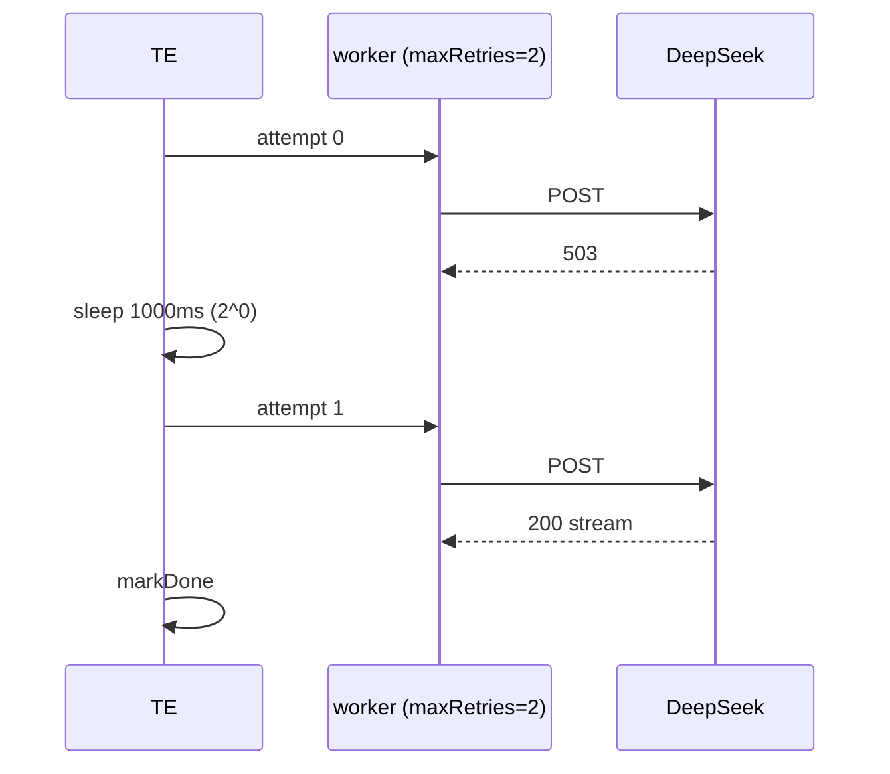

## 9. Edge Cases

| Case | Handling |
|---|---|
| agent error | markError; dependents evaluate gate → SKIP (cascade) |
| XOR fires while sibling running | cancelXorLosers aborts + skips it |
| aborted agent throws | not retried (signalAborted check) |
| all parked on asks | `team:awaiting-user` emitted |
| team timeout | cancelAll + FAILED verdict |

## 10. Test Cases

```
agent-pool.test.ts: single run; maxConcurrency limits; release on error; withSlotReleased frees+reacquires
scheduler.test.ts: dependency-first criticality order; round-robin stable
team-executor.test.ts: single; linear chain order; parallel fan-out+AND; partial-fail cascade skip;
  NAND fires→escalation; XOR race→loser skipped+aborted; retry then success; planner-fail cascades;
  handoffTo builds package injected into receiver; no busy loop (wake count == settlements)
team-runner.test.ts: team timeout → FAILED; all-parked → awaiting-user; promoteMemory on
```

## 10.5 Codebase Reality

| Assumed | Reality | Resolution |
|---|---|---|
| `runAgentLoop(...)→string` | only `agentLoop` generator (G4) | use `runAgentLoop` from PLAN-CORE; returns `{output, tokens}` → `ctx.recordTokens` |
| `buildTools(node)` | n/a | assemble per-agent `Tool[]` = node `tools[]` (from registry) + team tools (message/memory/ask/remember), passed to `runAgentLoop({tools})` |
| `signalAborted(signal)` | n/a | `const signalAborted = (s: AbortSignal) => s.aborted` |
| `createContext` | PLAN-00 §4.6 | import |
| `additionalContext` build | re-homed (G5) | build from MemoryManager.inject + SharedMemory.getSummary (PLAN-CORE §3.8) |
| inbox delivery | `onBeforeTurn` (G10) | pass `onBeforeTurn: s => injectInbox(node.name, ctx)` to `runAgentLoop` |

```typescript
private buildTools(node: AgentNode): Tool[] {
  const named = node.tools.length ? node.tools.map(getTool).filter(Boolean) as Tool[] : defaultAgentTools()
  return [...named, MessageTool, MemoryTool, AskTool, RememberTool]   // team tools always available
}
private buildCtx(node: AgentNode): ToolUseContext {
  return { agentName: node.name, signal: this.ctx.abort.signal(node.name),
           bus: this.ctx.bus, memory: this.ctx.memory, broker: this.ctx.broker,
           pool: this.pool, memoryManager: this.memoryManager }
}
```
`runAgent` (§4) calls `runAgentLoop(session, { adapter, systemPrompt, additionalContext,
initialMessages: this.buildInitialMessages(node), tools: this.buildTools(node),
ctx: this.buildCtx(node), maxTurns: node.maxTurns, signal, onBeforeTurn })` and then
`this.ctx.recordTokens(node.name, result.tokens)`.

## 10.6 Contracts

```
IMPORTS:
  OrchestrationContext, createContext, evaluateGate, evaluateLogicPort, AbortRegistry, TeamStepEvent ← PLAN-00
  normalizeTeam, NormalizedGraph, AgentDef, AgentNode, TeamDef, buildSystemPrompt ← PLAN-01
  buildHandoffPackage, HandoffPackage ← PLAN-02 · getAdapter, OpenAICompatAdapter ← PLAN-03/CORE
  MessageTool, injectInbox ← PLAN-04 · SharedMemory, MemoryTool ← PLAN-05
  AskBroker, AskTool ← PLAN-07 · MemoryManager, promoteDurableMemory, RememberTool ← PLAN-12
  runAgentLoop, TokenUsage, ToolUseContext ← PLAN-CORE · Session ← core · getTool ← tools/index
EXPORTS:
  AgentPool, Semaphore, Scheduler, SchedulerStrategy, TeamExecutor, runTeam, TeamRunResult
    → PLAN-09 (CLI), PLAN-10 (App), PLAN-11 (coordinator runs through runTeam)
```

## 10.7 Integration test (end-to-end, mocked LLM)

`team-e2e.test.ts`: 3-agent linear team with a stub adapter; assert event order
(step:start×3, handoff:start×2, step:done×3, plan:done), tokens recorded per node, and the
worker's session contained the planner handoff message.

## 11. Verification Checklist / Definition of Done

- [ ] 3-node chain wakes exactly 3 times (no busy spin)
- [ ] worker receives planner's HandoffPackage as initial context
- [ ] XOR loser is aborted; OR fires before all deps finish
- [ ] cascade: erroring planner skips worker + reviewer
- [ ] team timeout and all-parked both surface cleanly
- [ ] tokens recorded via `recordTokens` (G7); team tools available to every agent

---

<a id="d10"></a>

## 10 · 2026-06-17 · PLAN-09 — CLI Design

Source: [PLAN-09-CLI.md](PLAN-09-CLI.md) · [[PLAN-09-CLI]]  ·  [↑ Index](#index)


<!-- version: 1.0.0 -->
<!-- classification: PLAN -->
<!-- date: 2026-06-17 -->
<!-- last-updated: 2026-06-17 -->
<!-- feature: src/cli.ts, src/index.ts -->
<!-- depends-on: PLAN-08, PLAN-11 -->

## 1. Overview

Two new subcommands: `factory agent` (one-shot / handoff chain) and `factory orchestrate`
(team; explicit `--team` file or `"goal"` auto-decompose via the coordinator, PLAN-11).
Plus `factory memory` (PLAN-12).

## 2. Command definitions

```typescript
// src/cli.ts
program.command('agent')
  .description('Run a single agent one-shot or start a handoff chain')
  .option('--name <name>', 'Agent name (default: role)')
  .option('--role <role>', 'coordinator|planner|worker|reviewer|critic|aggregator|generic')
  .option('--skill <skill>', 'Load a skill (repeatable)', (v, a: string[]) => [...a, v], [])
  .option('--provider <name>', 'LLM provider', 'anthropic')
  .option('--model <model>', 'Model name')
  .option('--prompt <text>', 'Initial prompt (or stdin)')
  .option('--handoffto <spec>', 'agentName[:mode] — relay on completion')
  .option('--max-turns <n>', 'Max turns', parseInt)
  .option('--dry-run', 'Print resolved config, do not run')
  .action(runAgentCommand)

program.command('orchestrate [goal]')
  .description('Run a multi-agent team (goal auto-decompose or --team file)')
  .option('--team <file>', 'Path to af-team.json')
  .option('--agents <names>', 'Ad-hoc list "planner,worker,reviewer"')
  .option('--max-concurrency <n>', 'Parallel limit', parseInt)
  .option('--dry-run', 'Validate + print resolved team')
  .action(runOrchestrateCommand)
```

## 3. runAgentCommand flow

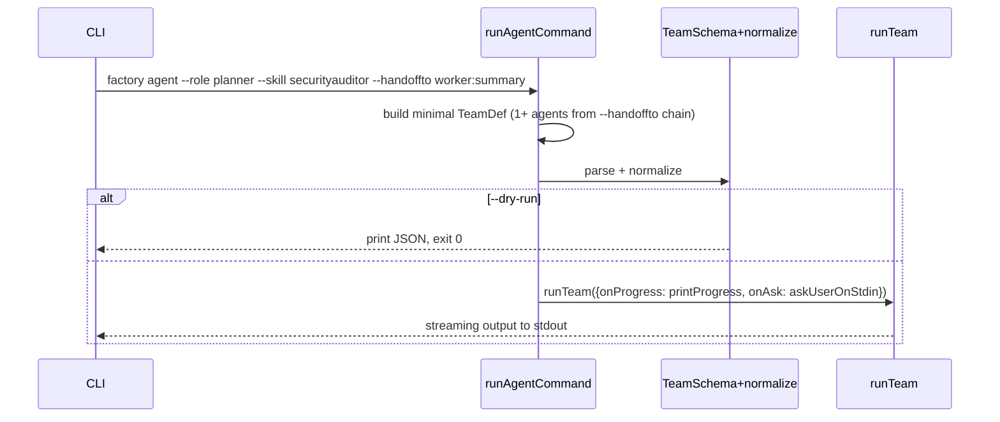

## 4. runOrchestrateCommand flow

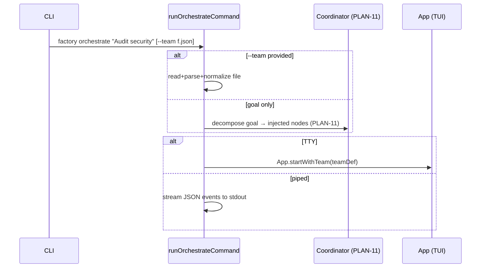

## 5. --handoffto chain expansion

```bash
factory agent --role planner --skill securityauditor --prompt "Audit auth.ts" --handoffto worker:summary
# → TeamDef { agents:[
#     {name:planner, role:planner, skills:[securityauditor], handoffTo:{to:worker,payload:summary}, prompt:"…"},
#     {name:worker,  role:worker,  dependsOn:[planner]}  // loaded from .ai/agents/ or default
#   ]}
```
Multiple `--handoffto` build a longer chain; normalization (PLAN-01) adds the edges.

## 6. Mode detection

`isatty(stdout)` → TUI (`App.startWithTeam`). Piped/redirected → newline-delimited JSON
events (machine-readable), one `TeamStepEvent` per line.

## 7. Edge Cases

| Case | Handling |
|---|---|
| `--provider unknown` with no URL/key | error + exit 1 with guidance |
| `orchestrate` with neither goal nor --team | error: provide a goal or --team |
| invalid team JSON | ZodError printed with field path, exit 1 |
| stdin prompt + no TTY | read prompt from stdin to EOF |

## 8. Test Cases

```
cli.test.ts:
  - agent --role planner --dry-run prints config, exit 0
  - agent --provider unknown → error exit 1
  - orchestrate --team valid --dry-run prints normalized team
  - orchestrate --team invalid → ZodError exit 1
  - orchestrate "goal" (no team) → coordinator path invoked
  - --skill repeatable → array
  - --handoffto worker:summary / worker:outputs.diff parsed
  - piped stdout → JSON event lines
```

## 8.5 Codebase Reality & Contracts

| Assumed | Reality (file:line) | Resolution |
|---|---|---|
| top-level `program` | `buildCli(version): Command` (`cli.ts:14`) | add `.command('agent')` / `.command('orchestrate')` / `.command('memory')` **inside** `buildCli` |
| `App.startWithTeam` | `App` has `start()` (`app.ts:87`) | added by PLAN-10 |
| coordinator | PLAN-11 `decomposeGoal` | import |

```
IMPORTS: buildCli (extend) ← cli.ts · runTeam ← PLAN-08 · decomposeGoal ← PLAN-11
  TeamSchema, normalizeTeam ← PLAN-01 · App ← app.ts (startWithTeam from PLAN-10)
EXPORTS: runAgentCommand, runOrchestrateCommand  (registered in buildCli)
```

## 9. Verification Checklist / Definition of Done

- [ ] `factory agent --role planner --skill securityauditor --handoffto worker` runs planner then worker
- [ ] `factory orchestrate --team af-team.json` opens the TUI (TTY) via `App.startWithTeam`
- [ ] `factory orchestrate "goal"` decomposes (PLAN-11) and runs without a team file
- [ ] Piped invocation emits parseable JSON events (one TeamStepEvent/line)
- [ ] subcommands registered inside `buildCli`, `--dry-run` paths exit cleanly

---

<a id="d11"></a>

## 11 · 2026-06-17 · PLAN-10 — TUI Multi-Agent

Source: [PLAN-10-TUI-MULTI-AGENT.md](PLAN-10-TUI-MULTI-AGENT.md) · [[PLAN-10-TUI-MULTI-AGENT]]  ·  [↑ Index](#index)


<!-- version: 1.0.0 -->
<!-- classification: PLAN -->
<!-- date: 2026-06-17 -->
<!-- last-updated: 2026-06-17 -->
<!-- feature: src/tui/panels/AgentsPanel.ts, OrchestrationCanvas.ts, src/tui/widgets/AgentAskWidget.ts, src/app.ts -->
<!-- depends-on: PLAN-06, PLAN-07, PLAN-08 -->

## 1. Overview

Three TUI surfaces wired to `TeamStepEvent`s: AgentsPanel redesign (status + messages +
memory + asks), OrchestrationCanvas logic-port diamonds with live status, and the
AgentAskWidget overlay. All driven from the kernel event stream (`drainEvents`).

## 1.5 Codebase Reality — honest audit (what exists today is mostly NOT this)

I read `AgentsPanel.ts` (191 lines) in full. Today it is a **single-column session list**,
not a team dashboard. Almost everything PLAN-10 describes is **greenfield**, not "extend."

| PLAN-10 element | State today (file:line) | Verdict |
|---|---|---|
| Single-col session list + select/scroll | works (`AgentsPanel.ts:67-78,143-171`) | ✅ operational (but it's *sessions*, not team agents) |
| Per-agent stats (tokens, elapsed, tools) on a **toggle** | works for the selected row only (`:80-112`) | ⚠️ exists but detail-panel, not inline-per-row |
| Status set | only `idle\|running\|done\|error` (`:11`) — **no `pending`, no `skipped`** | ⚠️ insufficient for teams |
| **Two-column layout** (list ∣ messages ∣ memory) | **none** — single column + toggled detail | ❌ missing |
| **Messages feed** (MessageBus traffic) | **none** | ❌ missing |
| **Memory sub-panel** (SharedMemory) | **none** | ❌ missing |
| **AgentAsk bar** | **none** | ❌ missing |
| **Logic-port rows** (`◇ name [AND] [2/3]`) | `AgentEntry` has no port kind | ❌ missing |
| **`onTeamEvent(TeamStepEvent)`** | model is `setAgents`/`updateAgent(AgentEntry)` — **old shape, no team events** | ❌ missing |
| `App.startWithTeam` | App has only `start()` (confirmed `app.ts:87`) | ❌ missing (greenfield) |
| Nobel-laureate hover tooltip | present (`:114-141`, couples `nobel.ts`) | 🟡 easter-egg; irrelevant to team mode — gate it off when a team is active |
| Runtime canvas status | `OrchestrationCanvas.applyStepEvent` uses **old `StepEvent`** and collapses `skipped→idle` (`OrchestrationCanvas.ts:90-107`) | ⚠️ must become `onTeamEvent`, keep `skipped` |

**Conclusion:** the only solid reuse is the list-render + click/scroll selection. The team
dashboard (columns, feeds, asks, ports, team events) is **new construction**, and the data
model must change.

## 1.6 Operationalization plan

| Gap | Fix | Where |
|---|---|---|
| `AgentEntry` too thin | introduce a **team-mode model** `TeamAgentRow` (adds `kind:'agent'\|'port'`, `pending`/`skipped`, `gateType`, `depsReady`, inline `input/outputTok`) OR extend `AgentEntry`; keep the old shape for session mode | `AgentsPanel.ts` |
| single-column | add a `mode: 'sessions' \| 'team'`; team mode renders **two columns** (list ∣ feed) + a memory strip + an ask bar | `AgentsPanel.render` |
| no events | add `onTeamEvent(ev: TeamStepEvent)` that switches over the union (PLAN-00 events.ts) to mutate rows/feed/memory/asks | new method |
| missing statuses | extend status union with `pending`,`skipped`; add badges `◎`,`⊘` + colors | `statusBadge/statusColor` |
| no feed/memory/ask | subscribe to `MessageBus`, `SharedMemory`, `AskBroker` (passed in ctor) → render sub-panels | ctor + render |
| port rows | render `kind:'port'` rows as `◇ name [GATE] [k/n]` (reuse PLAN-06 colors) | render |
| canvas status event | replace `applyStepEvent(StepEvent)` with `onTeamEvent(TeamStepEvent)`; preserve `skipped` (don't map to idle) | `OrchestrationCanvas.ts:90` |
| laureate tooltip leaks into team mode | only render tooltip when `mode==='sessions'` | render |
| `App.startWithTeam` | new method drives `executor.run()` loop → fan events to panels → `renderFrame` | `app.ts` |

> Same inversion lesson as PLAN-13: today the panel's `AgentEntry[]` *is* the data and can't
> represent ports/messages/memory/asks. Team mode needs a model that can — fed exclusively by
> `TeamStepEvent` + the three kernel primitives.

## 2. AgentsPanel layout (≥80 cols, two-column)

```
╔════════════════════════════════════════════════════════════╗
║  Agents — <team>  [N running / M total]   HH:MM:SS        ║
╠═══════════════════════╦════════════════════════════════════╣
║  Agent List           ║  Messages Feed                     ║
║  ● name  [status]     ║  HH:MM src → dst: "content…"       ║
║    X.Xk/X.Xk tok      ║  HH:MM * src → *: "broadcast…"     ║
║  ◇ portname [AND]     ║  Memory                            ║
║    [2/3 done]         ║  agent/key: "value…"               ║
╠═══════════════════════╩════════════════════════════════════╣
║  [!] AgentAsk bar (if pending)                            ║
╚════════════════════════════════════════════════════════════╝
```

## 3. Status indicators

```
●[running]↻ cyan+spinner · ✓[done] green · ✗[error] red ·
◎[pending] dim · ⊘[skipped] dim strike · ◇port[AND] colored diamond + [2/3]
```

## 4. Event wiring

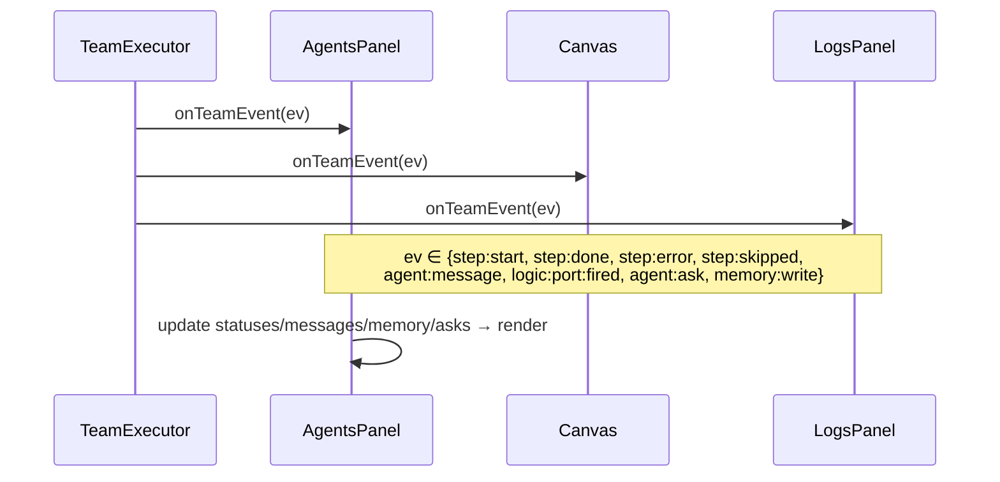

## 5. Canvas port rendering & colors

(Reuses PLAN-06 §4 `renderPortBlock`.) AgentBlock pending=grey, running=cyan, done=green,
error=red, skipped=grey⊘. PortBlock per-type fired color. Wires colored by target status.

## 6. AgentAskWidget modes

```
Bar:     [!] worker: "Apply risky fix?" [ Yes ] [ No ] [ … ]
Overlay: boxed [1/2] question + context + options + Pending list
Custom:  > free text_  (Enter send · Esc cancel)
```
Keyboard: Tab cycles options, Enter confirms (`broker.answer`), Esc → custom input.

## 7. App.startWithTeam wiring

```typescript
// src/app.ts
async function startWithTeam(teamDef: TeamDef): Promise<void> {
  const graph = normalizeTeam(teamDef)
  const ctx = createContext(graph, teamDef)
  const agentsPanel = new AgentsPanel(ctx.bus, ctx.memory, ctx.broker, layout.agents)
  const canvas = new OrchestrationCanvas(layout.canvas); canvas.syncFromTeam(teamDef)
  const askWidget = new AgentAskWidget(ctx.broker, layout.askBar)

  const exec = new TeamExecutor(ctx, new AgentPool(teamDef.maxConcurrency, ctx), new Scheduler())
  for await (const ev of exec.run()) {
    agentsPanel.onTeamEvent(ev); canvas.onTeamEvent(ev); logsPanel.onTeamEvent(ev)
    renderFrame()
  }
}
```

## 8. Backward compatibility

AgentsPanel with no active team renders the existing Wave-5 session list (`render()` checks
`ctx == null`). No regression to single-session mode.

## 9. Edge Cases

| Case | Handling |
|---|---|
| <80 cols | single-column stacked layout; messages collapsible |
| many agents | agent list scrolls (reuse ScrollableList) |
| `team:awaiting-user` | banner: "All agents waiting on your answer" |
| long question | overlay mode auto-selected |

## 10. Test Cases

```
agents-panel.test.ts: empty→session list; team→agent badges; step:start spinner;
  step:done green+tokens; agent:message in feed; logic:port:fired diamond; addAsk bar; Tab/Enter resolves
orchestration-canvas.test.ts: syncFromTeam blocks+diamonds+wires; step:done green;
  port:fired type color; renderPortDiamond shape/label; renderAgentBlock dims
agent-ask-widget.test.ts: render question+options; no asks→nothing; Tab/Enter/Esc
```

## 10.5 Codebase Reality & Contracts

| Assumed | Reality (file:line) | Resolution |
|---|---|---|
| `App.startWithTeam` | `App` has `start()`, `panels: Panel[]`, `router: InputRouter` (`app.ts:43,70,71`) | add `startWithTeam(teamDef)` method; register AgentAskWidget as a focusable target on `router` |
| `AgentsPanel` redesign | existing class (`AgentsPanel.ts`) shows session list | extend with `onTeamEvent` + two-column team mode; `render` branches on team-active |
| `onTeamEvent` | n/a | adapter that switches over `TeamStepEvent` (PLAN-00 events.ts) to update internal state |
| canvas `syncFromTeam` | `OrchestrationCanvas.syncFromPlan` exists | add `syncFromTeam(teamDef)` building agent blocks + `PortBlock`s (PLAN-06) |
| `ScrollableList` | exists (Wave 5, `widgets/ScrollableList.ts`) | reuse for agent list + message feed |

```
IMPORTS: TeamStepEvent, createContext ← PLAN-00 · TeamExecutor, AgentPool, Scheduler ← PLAN-08
  renderPortBlock, PortBlock ← PLAN-06 · AgentAskWidget ← PLAN-07 · MessageBus,SharedMemory,AskBroker ← PLAN-04/05/07
  Panel, InputRouter, CellBuffer, ScrollableList ← existing tui
EXPORTS: AgentsPanel (extended), OrchestrationCanvas (extended), App.startWithTeam → PLAN-09
```

## 11. Verification Checklist / Definition of Done

**Operationalization (every ❌/⚠️ row from §1.5 must now work):**
- [ ] `AgentsPanel` has a `mode: 'sessions' | 'team'`; team mode renders **two columns + memory strip + ask bar** (not the single-column list)
- [ ] Status union extended with `pending` (`◎`) and `skipped` (`⊘`); badges + colors added
- [ ] `onTeamEvent(TeamStepEvent)` mutates rows/feed/memory/asks — the old `setAgents`/`updateAgent` path stays for session mode
- [ ] **Messages feed** renders live `MessageBus` traffic
- [ ] **Memory strip** renders `SharedMemory` entries
- [ ] **Logic-port rows** render `◇ name [GATE] [k/n]`
- [ ] Nobel-laureate tooltip suppressed in team mode (`mode==='sessions'` only)
- [ ] `OrchestrationCanvas.applyStepEvent` replaced by `onTeamEvent(TeamStepEvent)`; `skipped` preserved (not collapsed to idle)

**End-to-end:**
- [ ] Live status badges update as agents run (driven by TeamStepEvent)
- [ ] AgentAsk overlay answerable by mouse/keyboard while others run (router focus)
- [ ] Single-session mode unchanged (no regression — sessions remain the default)
- [ ] `App.startWithTeam` drives the executor event loop + render (greenfield method)

---

<a id="d12"></a>

## 12 · 2026-06-17 · PLAN-11 — Coordinator / Goal Decomposition

Source: [PLAN-11-COORDINATOR.md](PLAN-11-COORDINATOR.md) · [[PLAN-11-COORDINATOR]]  ·  [↑ Index](#index)


<!-- version: 1.0.0 -->
<!-- classification: PLAN -->
<!-- date: 2026-06-17 -->
<!-- last-updated: 2026-06-17 -->
<!-- feature: src/orchestration/coordinator.ts -->
<!-- depends-on: PLAN-00, PLAN-01, PLAN-08 -->
<!-- consumed-by: PLAN-09 -->

## 1. Overview

Implements the `factory orchestrate "goal"` path (Mode B) that was referenced everywhere but
never specified (PART II §F7). A coordinator agent decomposes a natural-language goal into a
task array, injects those tasks as nodes into the `NormalizedGraph` *before* the executor
primes, runs them, then re-invokes the coordinator to synthesize a final result. Ports
`open-multi-agent/orchestrator.ts:641-740` (`runTeam`) and `:944-1001` (`loadSpecsIntoQueue`).

## 2. Interfaces

```typescript
// src/orchestration/coordinator.ts
export interface TaskSpec {
  title: string                       // human label, also the node name (slugified)
  description: string                 // becomes the agent prompt
  assignee?: string                   // role or existing agent name
  dependsOn?: string[]                // task titles (resolved to node names in pass 2)
}

export async function decomposeGoal(
  goal: string, roster: AgentDef[], ctx: OrchestrationContext,
): Promise<AgentDef[]>                // returns nodes to inject

export async function synthesize(
  goal: string, ctx: OrchestrationContext,
): Promise<string>                    // final answer from SharedMemory.getSummary()
```

## 3. Decomposition

```typescript
export async function decomposeGoal(goal, roster, ctx): Promise<AgentDef[]> {
  const coord = makeCoordinatorAgent(roster)                 // maxTurns: 3
  const session = new Session()
  const out = await runAgentLoop(session, {
    adapter: getAdapter('anthropic'), maxTurns: 3,
    systemPrompt: COORDINATOR_PROMPT(roster),
    initialMessages: [{ role: 'user', content: `Goal:\n${goal}\n\nEmit a JSON task array.` }],
    signal: ctx.abort.signal('coordinator'),
  })
  const specs = parseTaskSpecs(out)                          // extract ```json fence + validate
  return specsToNodes(specs, roster)                         // 2-pass title→name resolution
}
```

`parseTaskSpecs(text)`: find the ```json fence, `JSON.parse`, validate each item shape.
`specsToNodes`: pass 1 assigns slugified names; pass 2 maps each `dependsOn` title to a name;
unassigned `assignee` defaults by Scheduler `capability-match` or `worker`.

## 4. Injection + run + synthesis

```mermaid
sequenceDiagram
    participant U as factory orchestrate "goal"
    participant CO as decomposeGoal
    participant C as coordinator (maxTurns 3)
    participant G as NormalizedGraph
    participant TE as TeamExecutor
    participant SM as SharedMemory
    U->>CO: goal + roster
    CO->>C: COORDINATOR_PROMPT
    C-->>CO: ```json [{title,description,assignee,dependsOn}] ```
    CO->>CO: parseTaskSpecs + specsToNodes (2-pass)
    CO->>G: inject nodes
    G->>G: normalize + detectCycles (rejects bad plans)
    TE->>TE: settlement loop over injected nodes
    TE-->>U: all terminal
    U->>SM: synthesize(goal) using getSummary()
    SM-->>U: final synthesized answer
```

## 5. Dynamic injection into the kernel

`ctx.graph.injectNodes(nodes)` adds nodes + edges, re-runs `detectCycles`, and is called
*before* `TeamExecutor.run()` primes. If the generated plan has a cycle or dangling
`dependsOn`, decomposition fails fast with a `TeamError` (no agents run).

## 6. Edge Cases

| Case | Handling |
|---|---|
| coordinator emits no JSON fence | retry once with a stricter reminder; then error |
| generated plan has a cycle | detectCycles rejects; surface coordinator output for debugging |
| assignee references unknown role | default to `worker`, warn |
| empty task array | error: "coordinator produced no tasks for goal" |

## 7. Test Cases

```
coordinator.test.ts:
  - parseTaskSpecs: valid fence → specs; missing fence → retry path; malformed JSON → error
  - specsToNodes: title→name 2-pass resolution; dependsOn titles mapped
  - decomposeGoal (mock LLM): returns injectable nodes
  - cycle in generated plan → TeamError before run
  - synthesize: includes every agent's memory output
```

## 7.5 Codebase Reality & Contracts

| Assumed | Reality | Resolution |
|---|---|---|
| `runAgentLoop` for coordinator | PLAN-CORE | import; coordinator runs maxTurns 3 |
| `ctx.graph.injectNodes` | PLAN-00 §4.7 / PLAN-01 | inject before `TeamExecutor.run()` primes |
| `getAdapter('anthropic')` | PLAN-CORE §3.7 | import |
| `Scheduler capability-match` | PLAN-08 Scheduler | use for unassigned `assignee` defaulting |

```
IMPORTS: runAgentLoop ← PLAN-CORE · getAdapter ← PLAN-CORE/03 · NormalizedGraph.injectNodes, AgentDef ← PLAN-00/01
  Session ← core · Scheduler ← PLAN-08 · OrchestrationContext ← PLAN-00
EXPORTS: decomposeGoal, synthesize, parseTaskSpecs, TaskSpec  → PLAN-09 (orchestrate goal mode)
```

## 8. Verification Checklist / Definition of Done

- [ ] `factory orchestrate "Build a REST API with tests and docs"` produces ≥3 tasks and runs them
- [ ] Generated cyclic plan is rejected before any agent runs (injectNodes re-validates)
- [ ] Final synthesis references all sub-agent outputs (via getSummary)
- [ ] missing JSON fence → one retry then actionable error

---

<a id="d13"></a>

## 13 · 2026-06-17 · PLAN-12 — Tiered Persistent Memory (Claude-Code-style)

Source: [PLAN-12-TIERED-MEMORY.md](PLAN-12-TIERED-MEMORY.md) · [[PLAN-12-TIERED-MEMORY]]  ·  [↑ Index](#index)


<!-- version: 1.0.0 -->
<!-- classification: PLAN -->
<!-- date: 2026-06-17 -->
<!-- last-updated: 2026-06-17 -->
<!-- feature: src/core/memory/manager.ts, src/core/tools/remember.ts, src/tui/panels/MemoryPanel.ts, src/cli.ts (factory memory) -->
<!-- depends-on: PLAN-01, PLAN-05 -->
<!-- consumed-by: PLAN-08 (inject), PLAN-09 (factory memory), PLAN-10 (/memory UI) -->

## 1. Overview

Adds Claude Code's **tiered persistent memory** on top of the ephemeral runtime
`SharedMemory` (PLAN-05). Completes the 3-layer model: Layer 1 = runtime SharedMemory,
Layer 2 = auto-memory facts (persistent, auto-saved), Layer 3 = curated project + user
`MEMORY.md`. All layers inject through the same `additionalContext` seam.

## 2. 3-layer model

```mermaid
graph TD
    subgraph L1[Layer 1 — Runtime ephemeral PLAN-05]
      SM[SharedMemory agent/key→value]
    end
    subgraph L2[Layer 2 — Auto-memory persistent]
      AF[~/.config/agentfactory/memory/*.md + MEMORY.md index]
    end
    subgraph L3[Layer 3 — Curated human-editable]
      PM[./.ai/MEMORY.md checked in]
      UM[~/.config/agentfactory/MEMORY.md personal]
    end
    A[every agent SessionStart] --> INJ[MemoryManager.inject]
    L3 --> INJ
    L2 --> INJ
    L1 --> INJ
    A -->|remember tool| AF
    SM -.->|promote durable at team end| AF
    INJ -->|additionalContext| A
```
Precedence (high→low, all included): Project › User › Auto › Runtime.

## 3. Tier locations (mirrors Claude Code)

| Tier | Path | Scope | Checked in |
|---|---|---|---|
| Project | `./.ai/MEMORY.md` | repo, all agents | ✅ |
| User | `~/.config/agentfactory/MEMORY.md` | this user, all projects | ❌ |
| Auto | `~/.config/agentfactory/memory/<slug>.md` + `MEMORY.md` index | auto-saved facts | ❌ |

## 4. Auto-memory fact format

```markdown
---
name: <kebab-slug>
description: <one-line, used for recall>
metadata:
  type: user | feedback | project | reference
---

<fact body. For feedback/project add **Why:** and **How to apply:**. Link [[other-slug]].>
```
Index line in auto `MEMORY.md`: `- [Title](slug.md) — hook`.

## 5. MemoryManager

```typescript
// src/core/memory/manager.ts
export interface MemoryFact {
  slug: string; description: string
  type: 'user' | 'feedback' | 'project' | 'reference'
  body: string; path: string
}
export class MemoryManager {
  constructor(opts?: { projectRoot?: string; autoMemory?: boolean })
  load(): Promise<{ tier: 'project'|'user'|'auto'; path: string; content: string }[]>
  inject(promptHint?: string): Promise<string>   // merged markdown (Layers 3+2), recall-ranked
  remember(f: { title: string; body: string; type: MemoryFact['type']; scope: 'auto'|'project'|'user' }): Promise<void>
  forget(slug: string): Promise<void>
  recall(query: string, limit?: number): Promise<MemoryFact[]>
  list(): Promise<MemoryFact[]>
  setAutoMemory(on: boolean): void                // persists in ConfigStore
  isAutoMemoryOn(): boolean
}
```
Reuse: frontmatter parsing via harness reader patterns; toggle via `ConfigStore`; injection
prepended to `SharedMemory.getSummary()` in the PLAN-05 SessionStart hook.

## 6. remember tool

```typescript
// src/core/tools/remember.ts
export const RememberTool = buildTool({
  name: 'remember',
  description: 'Persist a durable fact so future sessions recall it (stable prefs, conventions, lessons). For transient run state use `memory`.',
  inputSchema: { type: 'object', properties: {
    fact:  { type: 'string' },
    type:  { type: 'string', enum: ['user','feedback','project','reference'] },
    scope: { type: 'string', enum: ['auto','project','user'] },
  }, required: ['fact','type'] },
  async call({ fact, type, scope = 'auto' }, ctx) {
    if (scope === 'auto' && !ctx.memoryManager.isAutoMemoryOn())
      return 'Auto-memory is off; not saved. Enable via `factory memory`.'
    const title = deriveTitle(fact)
    await ctx.memoryManager.remember({ title, body: fact, type, scope })
    return `Remembered (${scope}): ${title}`
  },
})
```

## 7. Durable promotion (Layer 1 → 2)

```typescript
export async function promoteDurableMemory(mem: SharedMemory, mm: MemoryManager): Promise<void> {
  for (const [, e] of mem.entries()) {
    if (isDurable(e)) await mm.remember({ title: e.key, body: e.value, type: 'project', scope: 'auto' })
  }
}
// isDurable: keep decisions/conventions/lessons; exclude transient keys (patch, diff, status, summary)
```
Called by `TeamRunner` when `team.promoteMemory ?? autoMemory`.

## 8. /memory UI (mirrors Claude Code screen)

```
  Memory

    Auto-memory: on

    1. Project memory             Checked in at ./.ai/MEMORY.md
  ❯ 2. User memory                Saved in ~/.config/agentfactory/MEMORY.md
    3. Open auto-memory folder ✔

  Learn more: docs/MEMORY.md
  Enter to confirm · Esc to cancel
```
`factory memory` (CLI) and `/memory` (palette) open `MemoryPanel.ts` (built on ScrollableList
+ ContextMenu). 1/2 open that tier in `$EDITOR`; 3 opens the auto folder; toggling auto-memory
flips `ConfigStore.set('autoMemory', …)`.

## 9. Injection sequence (all 4 layers)

```mermaid
sequenceDiagram
    participant TE as TeamExecutor
    participant H as SessionStart hook
    participant MM as MemoryManager
    participant SM as SharedMemory
    participant A as agent
    TE->>H: onSessionStart(agentName)
    H->>MM: inject(promptHint) → Layers 3+2 (recall-ranked)
    H->>SM: getSummary() → Layer 1
    H-->>TE: additionalContext = persistent + "\n\n" + runtime
    TE->>A: agentLoop(systemPrompt + additionalContext)
    A->>MM: remember(fact) → persists to Layer 2 for next time
```

## 10. Edge Cases

| Case | Handling |
|---|---|
| auto off + remember(auto) | no-op + guidance |
| project MEMORY.md missing | tier skipped, no error |
| malformed frontmatter | skip with warning, others load |
| duplicate slug | update existing file, dedup index |
| injected context too large | recall()-rank by relevance, cap chars |
| concurrent remember same slug | last-write-wins, index deduped |

## 11. Test Cases

```
memory-manager.test.ts: load all tiers (missing skipped); inject precedence; remember auto/project;
  duplicate slug update; forget; recall ranking; setAutoMemory persists; malformed frontmatter skipped
remember-tool.test.ts: auto on→saved; auto off+scope auto→guidance; scope project writes project tier
memory-panel.test.ts: renders 3 tiers + toggle; Enter opens editor intent; toggle flips ConfigStore
promote.test.ts: durable keys promoted; transient (patch/diff) excluded
```

## 11.5 Codebase Reality & Contracts

| Assumed | Reality (file:line) | Resolution |
|---|---|---|
| `ConfigStore.set/get('autoMemory')` | real API is `getKey`/`setKey` for API keys (`store.ts:35,42`) | store the toggle in a small `prefs.json` via a tiny `getPref/setPref` helper (or extend ConfigStore with a generic field); do NOT abuse `setKey` |
| SessionStart hook injects `inject()` | impossible (G5) | re-homed: executor concatenates `inject()` ahead of `getSummary()` into `runAgentLoop({additionalContext})` (PLAN-CORE §3.8) |
| `buildTool` for RememberTool | PLAN-CORE | `run` reads `ctx.memoryManager` |
| frontmatter parse | harness reader pattern (Wave 5.5 `reader.ts`, if present) else a 10-line parser | implement minimal YAML-frontmatter splitter |
| `deriveTitle(fact)` | n/a | first ≤6 words, kebab-cased |

```
IMPORTS: buildTool, ToolUseContext ← PLAN-CORE · SharedMemory ← PLAN-05 · configDir ← PLAN-01
EXPORTS: MemoryManager, MemoryFact, RememberTool, MemoryPanel, promoteDurableMemory
  → PLAN-08 (inject + promotion), PLAN-09 (factory memory), PLAN-10 (/memory UI)
```

## 12. Verification Checklist / Definition of Done

- [ ] `factory memory` shows the 3-tier screen; toggling auto-memory persists (via prefs, not setKey)
- [ ] `remember(...)` creates a fact file + index pointer
- [ ] A new team run injects that fact via `additionalContext` (re-homed, not a hook)
- [ ] `./.ai/MEMORY.md` edits picked up next run
- [ ] Durable team findings promote to auto-memory when `promoteMemory` is on
- [ ] frontmatter parser + `deriveTitle` defined

---

<a id="d14"></a>

## 14 · 2026-06-17 · PLAN-13 — Visual Orchestration Studio (n8n-style team builder)

Source: [PLAN-13-ORCHESTRATION-STUDIO.md](PLAN-13-ORCHESTRATION-STUDIO.md) · [[PLAN-13-ORCHESTRATION-STUDIO]]  ·  [↑ Index](#index)


<!-- version: 1.0.0 -->
<!-- classification: PLAN -->
<!-- date: 2026-06-17 -->
<!-- last-updated: 2026-06-17 -->
<!-- feature: src/orchestration/studio-model.ts (framework-agnostic), src/tui/panels/OrchestrationCanvas.ts (Build mode), src/tui/widgets/Toolbox.ts, src/tui/widgets/NodeInspector.ts -->
<!-- depends-on: PLAN-01, PLAN-06, PLAN-10 -->
<!-- consumed-by: PLAN-09 (factory orchestrate --team can run the saved file) -->
<!-- wave: 6C -->

## 1. Overview & Purpose

A **design-time** visual editor: drag agent/port nodes from a toolbox onto the canvas,
define each agent's properties in a modal inspector, draw **typed connectors** (plain
dependency vs handoff-with-payload), and **round-trip to `af-team.json`**. It is the authoring
twin of PLAN-10's runtime monitor — the *same* `OrchestrationCanvas`, two modes: **Build**
(this plan) and **Run** (PLAN-10). Inspired by n8n's drag-link-configure flow.

**Decisions baked in (from review):**
- Inspector = **modal overlay**, reusing the Wave-5 `ConfigPanel` edit-overlay pattern.
- Core is **framework-agnostic**: a pure `StudioModel` + `canvasToTeamDef`/`teamDefToCanvas`
  with no rendering, so a future **web** canvas reuses the serialization/validation core; only
  the renderer differs.

## 2. Codebase Reality — what *actually* works today (honest audit)

I read `OrchestrationCanvas.ts` (463 lines) in full. The drag/wire/menu **mechanics render**,
but the feature is a **dead-end visualizer**: you can move rectangles and draw lines, but you
**cannot define an agent, type a connector, persist, or run anything**. Classification:

| Capability | State today (file:line) | Verdict |
|---|---|---|
| Drag a block by its header → grid-snap | works (`:271-287`,`:305-327`) | ✅ operational |
| Output-port→input-port wire draw | works (`:254-269`,`:228-252`) | ✅ operational |
| Right-click delete wire/block, cascade | works (`:329-373`) | ✅ operational |
| **"Add agent block"** | creates a bare rect `id='agent-'+Date.now()`, **no role/provider/model/prompt/skills** (`:375-389`) | ⚠️ **hollow stub** |
| **Edit a node's properties** | **none** — context "Open session" is a **no-op** `()=>{menu=null}` (`:349`) | ❌ **missing** |
| **Block data model** | `Block` is purely visual (id,row,col,w,h,title,status,ports) — **carries zero agent data** | ❌ **no backing model** |
| **Typed connectors** | `CanvasWire` is `{from,to,port}` only — **no handoff vs dependency, no payload** (`:13-19`) | ❌ **untyped** |
| **Serialize canvas → file** | **none** — `syncFromPlan` is one-way (`:54-87`); there is **no `toPlan/toTeamDef`** | ❌ **can't save or run** |
| **Node selection (for inspect)** | only drag-derived `focusedBlockId` (`:405`) — **no click-to-select** | ❌ **missing** |
| Logic-port nodes (AND/OR/XOR/NAND) | not a node kind at all | ❌ **missing** |
| Rename / multi-input ports | title = id, default single in/out | ❌ **missing** |
| Live status from runs | `applyStepEvent` maps **old** `StepEvent`; `skipped→idle` loses the state (`:90-107`) | ⚠️ partial, wrong event type |

**So the user is right:** today's canvas is superficial. PLAN-13 must *operationalize* all of
the ❌/⚠️ rows, not "reuse" them. The two ✅ rows (block drag, wire draw mechanics) are the
only solid foundation.

## 2.5 Operationalization plan (address every gap above)

| Gap | Fix | Where |
|---|---|---|
| no backing model | make **`StudioModel` the source of truth**; `Block`/`CanvasWire` become **derived render views** computed from nodes/edges | `studio-model.ts` + canvas refactor |
| hollow "Add agent block" | toolbox drop / context-add creates a real `StudioNode{kind:'agent', role, name, provider:'anthropic'}` and **immediately opens the inspector** | `Toolbox`, `openContextMenu` |
| no edit | replace the no-op "Open session" with **"Configure…"** → `NodeInspector` modal; double-click also opens it | `NodeInspector`, `:349` |
| no selection | add `selectedNodeId` state + click-to-select highlight (distinct from drag) | canvas |
| untyped wires | extend edge with `kind:'dependency'\|'handoff'` + `payload`; connector menu on wire completion (§7); distinct glyph | `StudioEdge`, `handleLeftPress` |
| no serialize | add pure `canvasToTeamDef()` + `teamDefToCanvas()` (§8); `Ctrl+S` writes `af-team.json` | `studio-model.ts`, canvas |
| no port nodes | toolbox AND/OR/XOR/NAML drop → `StudioNode{kind:'port'}`; render via `renderPortBlock` (PLAN-06); allow **multi-input** | canvas, PLAN-06 |
| rename | inspector `name` field; title renders `name` not `id` | `NodeInspector`, `Block.title` |
| wrong status event | `applyStepEvent` → `onTeamEvent(TeamStepEvent)`; keep `skipped` distinct | PLAN-10 alignment |

> The keystone is **inverting ownership**: today `CanvasState{blocks,wires}` *is* the data;
> after PLAN-13 the **`StudioModel` is the data** and `blocks/wires` are a render cache rebuilt
> by `deriveView(model)`. That is what makes "define agents from the canvas" real and
> round-trippable.

## 3. Architecture — pure core + thin renderer

```
src/orchestration/studio-model.ts   ← FRAMEWORK-AGNOSTIC (no TUI, no DOM)
  StudioNode, StudioEdge, StudioModel
  canvasToTeamDef(model): TeamDef        (validated via TeamSchema + normalizeTeam)
  teamDefToCanvas(team): StudioModel      (inverse; layout coords assigned)
  validate(model): StudioError[]          (live design-time validation)

src/tui/panels/OrchestrationCanvas.ts    ← TUI renderer (Build mode added)
src/tui/widgets/Toolbox.ts               ← palette rail
src/tui/widgets/NodeInspector.ts         ← modal overlay (ConfigPanel pattern)
```
A web UI later implements its own renderer against the **same** `StudioModel` + serialization.

## 4. StudioModel (pure core)

```typescript
// src/orchestration/studio-model.ts
export interface StudioNode {
  id: string                     // stable internal id
  kind: 'agent' | 'port'
  // layout (renderer-owned, persisted for round-trip stability)
  row: number; col: number
  // agent fields (when kind==='agent')
  name?: string; role?: Role; skills?: string[]
  provider?: string; model?: string; prompt?: string
  maxTurns?: number; tools?: string[]; systemPrompt?: string
  // port fields (when kind==='port')
  logicPort?: 'AND' | 'OR' | 'XOR' | 'NAND'
}
export interface StudioEdge {
  id: string
  from: string                   // node id
  to: string                     // node id
  kind: 'dependency' | 'handoff'
  payload?: 'summary' | 'full' | string   // handoff only: 'summary'|'full'|'outputs.<key>'
}
export interface StudioModel { nodes: StudioNode[]; edges: StudioEdge[]; name: string }

export function canvasToTeamDef(m: StudioModel): TeamDef            // §8
export function teamDefToCanvas(t: TeamDef): StudioModel            // §8 (inverse)
export function validateStudio(m: StudioModel): StudioError[]       // §6.3
export function deriveView(m: StudioModel): { blocks: Block[]; wires: CanvasWire[] }  // §4.5
```

### 4.5 Ownership inversion (the core refactor of OrchestrationCanvas)

Today `CanvasState{blocks,wires}` **is** the data (and carries no agent fields). PLAN-13
inverts this: the **`StudioModel` becomes the single source of truth**; the canvas keeps a
`model: StudioModel` and renders a **derived, throwaway view**:

```typescript
// OrchestrationCanvas (Build mode)
private model: StudioModel = { nodes: [], edges: [], name: 'untitled' }
private selectedNodeId: string | null = null
private rebuild(): void { const v = deriveView(this.model); this.state.blocks = v.blocks; this.state.wires = v.wires }
```

`deriveView` maps each `StudioNode` → a `Block` (agent nodes render title=`name`, status from
run events; port nodes render via `renderPortBlock`, PLAN-06 — supporting **multi-input**) and
each `StudioEdge` → a `CanvasWire` with a `kind`-dependent glyph. Every mutation (drop, edit,
connect, delete, drag-move-writes-`row/col`-back) updates `model` then calls `rebuild()`.

This single change retires the three worst gaps at once: blocks now **carry agent data**,
the graph is **serializable** (`canvasToTeamDef(model)`), and round-trip load works
(`model = teamDefToCanvas(file)`).

## 5. Toolbox (`src/tui/widgets/Toolbox.ts`)

A left rail of draggable node templates:

```
┌─ Toolbox ──────┐
│ AGENTS         │
│  ▸ coordinator │
│  ▸ planner     │
│  ▸ worker      │
│  ▸ reviewer    │
│  ▸ critic      │
│  ▸ aggregator  │
│  ▸ generic     │
│ LOGIC PORTS    │
│  ◇ AND         │
│  ◇ OR          │
│  ◇ XOR         │
│  ◇ NAND        │
└────────────────┘
```

- Click a toolbox item → enters **placement mode**; next canvas click drops a new
  `StudioNode` at that cell (agent gets the role's default name + role; port gets the gate).
- Reuses the existing mouse plumbing; placement is a new `DragState` variant
  `{ kind: 'placing'; template: ToolboxItem }`.

## 6. NodeInspector (modal overlay — ConfigPanel pattern)

```typescript
// src/tui/widgets/NodeInspector.ts
export class NodeInspector {
  constructor(private node: StudioNode, private onSave: (n: StudioNode) => void, private onCancel: () => void)
  render(buf: CellBuffer): void   // centered modal
  onKey(e: KeyEvent): void        // Tab fields, Enter open dropdown/confirm, Esc cancel
}
```

Opened by **double-click** on a node (mirrors `ConfigPanel` double-click→edit overlay).

```
┌─ Edit: planner ──────────────┐
│ name     [planner          ] │
│ role     [planner ▾]         │   ← dropdown from .ai/roles
│ provider [anthropic ▾]       │   ← dropdown from PROVIDERS
│ model    [claude-sonnet-4-6] │
│ skills   [securityauditor +] │   ← repeatable chips
│ prompt   [Audit auth.ts…   ] │
│ maxTurns [20]                │
│        [ Save ]  [ Cancel ]  │
└──────────────────────────────┘
```

Port nodes get a tiny inspector (just the gate type, read-only label + delete).

### 6.3 Live validation (`validateStudio`)
On every edit, surface design errors inline (red underline + status line), reusing the
sibling-of-`TeamSchema` rules *without* throwing: duplicate names, dangling edges, a cycle
(via `detectCycles`), a port with <2 inputs, an unknown skill. This is the **gap-check at
design time** — you can't build an invalid team.

## 7. Typed Connectors

When a wire is completed (existing port→port flow), a small `ContextMenu` asks the edge type:

```
Connect planner → worker
  ▸ dependency (just ordering)
  ▸ handoff: summary
  ▸ handoff: full
  ▸ handoff: outputs.<key>…   (prompts for key)
```

- `dependency` → `StudioEdge{kind:'dependency'}` → becomes a plain `dependsOn` in the team.
- `handoff` → `StudioEdge{kind:'handoff', payload}` → becomes `handoffTo{to,payload}` **and**
  (via `normalizeTeam`) the implied `dependsOn` edge. Rendered with a distinct wire glyph
  (e.g. `═` handoff vs `─` dependency) + payload label at the midpoint.
- Wire into a **port node** is always a `dependency` (the gate's input).

## 8. Serialization (round-trip)

```typescript
export function canvasToTeamDef(m: StudioModel): TeamDef {
  const agents: AgentDef[] = m.nodes.map(n => n.kind === 'port'
    ? { kind: 'port', name: n.name ?? n.id, logicPort: n.logicPort!,
        dependsOn: depsInto(n.id, m) }
    : { kind: 'agent', name: n.name!, role: n.role, skills: n.skills ?? [],
        provider: n.provider ?? 'anthropic', model: n.model, prompt: n.prompt,
        maxTurns: n.maxTurns ?? 20, tools: n.tools ?? [],
        dependsOn: depsInto(n.id, m, 'dependency'),
        handoffTo: handoffOutOf(n.id, m) } )
  const team = { version: '1.0' as const, name: m.name, agents, maxConcurrency: 4, sharedMemory: true }
  TeamSchema.parse(team)        // hard validation
  normalizeTeam(team)           // cycle + handoff-edge check (PLAN-01)
  return team
}
```
`teamDefToCanvas(team)` is the inverse used to **load** an existing `af-team.json` for editing:
maps agents/ports → nodes (auto-layout grid like `syncFromPlan`), `dependsOn` → dependency
edges, `handoffTo` → handoff edges (de-duplicating the dependency edge normalization added).

**Persisting:** `Ctrl+S` (or context-menu *Save*) writes `af-team.json` to the cwd; the
status bar confirms. The saved file runs unchanged via `factory orchestrate --team` (PLAN-09).

## 9. Build ⇄ Run mode toggle

`OrchestrationCanvas` gains `mode: 'build' | 'run'`:
- **Build** (this plan): toolbox visible, inspector enabled, edges editable, `canvasToTeamDef`
  on save.
- **Run** (PLAN-10): toolbox hidden, nodes read-only, `onTeamEvent` drives live status colors.
- Toggle via a keybind (e.g. `F6`) or `/build` `/run` palette commands. Switching to Run
  first calls `canvasToTeamDef()` → `runTeam()`; switching back re-syncs status onto the
  same nodes.

## 10. Mermaid

### Authoring flow
```mermaid
sequenceDiagram
    participant U as User
    participant TB as Toolbox
    participant CV as Canvas (Build)
    participant INS as NodeInspector
    participant M as StudioModel
    U->>TB: click "worker"
    TB->>CV: placement mode
    U->>CV: click cell → drop node
    CV->>M: add StudioNode{kind:agent, role:worker}
    U->>CV: double-click node
    CV->>INS: open modal(node)
    U->>INS: set provider=deepseek, prompt=…, Save
    INS->>M: update node
    U->>CV: drag planner.out → worker.in
    CV->>U: connector menu → "handoff: summary"
    CV->>M: add StudioEdge{kind:handoff, payload:summary}
    M->>M: validateStudio() live
```

### Serialize + run
```mermaid
graph LR
    M[StudioModel] -->|canvasToTeamDef| TS[TeamSchema.parse]
    TS -->|normalizeTeam| TD[af-team.json]
    TD -->|Ctrl+S| FILE[(saved file)]
    TD -->|F6 Run| RT[runTeam PLAN-08]
    RT -->|onTeamEvent| CV[Canvas Run mode PLAN-10]
    FILE -->|teamDefToCanvas| M
```

## 11. Edge Cases

| Case | Handling |
|---|---|
| handoff edge creates a cycle | `validateStudio` flags it red; save blocked until fixed |
| agent with no name | inspector requires name (default = role); validation error otherwise |
| port with 1 input | flagged (needs ≥2); save blocked |
| `outputs.<key>` handoff, key empty | prompt re-asks; default to `summary` if cancelled |
| delete a node with edges | edges removed too; dependents re-validated |
| load malformed af-team.json | `teamDefToCanvas` surfaces ZodError; opens empty canvas + error banner |
| two nodes same name | live dup-name validation (sibling of `TeamSchema` superRefine) |

## 12. Contracts

```
IMPORTS:
  TeamSchema, TeamDef, AgentDef, AgentNode, PortNode, HandoffSpec, normalizeTeam, detectCycles-shim ← PLAN-01
  PortBlock, renderPortBlock ← PLAN-06
  OrchestrationCanvas (Build/Run mode), syncFromTeam ← PLAN-10
  PROVIDERS ← config/providers.ts · ContextMenu, CellBuffer, KeyEvent, Rect, Colors ← existing tui
  ConfigPanel edit-overlay pattern ← ConfigPanel.ts (reference)
EXPORTS:
  StudioModel, StudioNode, StudioEdge, canvasToTeamDef, teamDefToCanvas, validateStudio  → web UI (future), PLAN-09
  Toolbox, NodeInspector  → OrchestrationCanvas Build mode
```

## 13. Test Cases

```
studio-model.test.ts (pure, no TUI — also covers future web):
  - canvasToTeamDef: agents+ports+handoff edges → valid TeamDef (TeamSchema passes)
  - canvasToTeamDef: handoff edge produces handoffTo + dependsOn after normalize
  - teamDefToCanvas: round-trips (canvasToTeamDef(teamDefToCanvas(t)) ≡ t, modulo layout)
  - validateStudio: dup names, dangling edge, cycle, port<2 inputs, unknown skill
  - delete node removes incident edges

toolbox.test.ts: click item → placement mode; drop creates node with role defaults
node-inspector.test.ts: render fields; Tab nav; role/provider dropdowns from PROVIDERS/.ai roles;
  Save emits updated node; Esc cancels
orchestration-canvas-build.test.ts: connector menu types an edge; handoff glyph vs dependency glyph;
  F6 Build→Run calls canvasToTeamDef; invalid model blocks Run
```

## 14. Definition of Done

**Operationalization (every ❌/⚠️ row from §2 must now work):**
- [ ] "Add agent" creates a **real** `StudioNode` with role + provider defaults (not a bare rect)
      and opens the inspector — the old hollow `addBlock` (`:375`) is gone
- [ ] Double-click / "Configure…" opens `NodeInspector`; the no-op "Open session" (`:349`) is replaced
- [ ] A node **carries** name/role/skills/provider/model/prompt (StudioModel-backed); title shows `name`
- [ ] Click-to-select highlights a node (selection state exists, distinct from drag)
- [ ] Wires are **typed** (dependency vs handoff+payload), with distinct glyphs
- [ ] Logic-port nodes are droppable, render as diamonds, accept **multiple inputs**
- [ ] Live status uses `TeamStepEvent`; `skipped` stays distinct (not collapsed to idle)

**End-to-end:**
- [ ] Drag worker + reviewer from toolbox, connect `handoff: summary`, set provider/prompt,
      `Ctrl+S` → a **valid `af-team.json` that `factory orchestrate --team` actually runs**
- [ ] Loading that file back reproduces the same graph (round-trip via teamDefToCanvas)
- [ ] Invalid designs (cycle, dup name, port<2, dangling edge) blocked at design time, inline
- [ ] Build⇄Run toggle on the same canvas; Run shows live status (PLAN-10)
- [ ] `studio-model.ts` is **pure** (no TUI imports — enforced by a no-DOM unit test) so a web
      renderer reuses it
- [ ] No `any`; explicit return types

## 15. Migration note (don't break Wave 2/5 behaviour)

`syncFromPlan(Plan)` (af-plan.json) stays for backward compat; it now routes through
`teamDefToCanvas`-style derivation into the `StudioModel`. The legacy `CanvasState`-as-truth
path is removed in favour of `model` + `deriveView`, but the **public methods**
(`syncFromPlan`, `getState`, `applyStepEvent`→deprecated alias of `onTeamEvent`) keep working
so `app.ts` and existing tests don't break in one step.
```

---

<a id="d15"></a>

## 15 · 2026-06-17 · PLAN-CORE — Core Integration Seam

Source: [PLAN-CORE-INTEGRATION-SEAM.md](PLAN-CORE-INTEGRATION-SEAM.md) · [[PLAN-CORE-INTEGRATION-SEAM]]  ·  [↑ Index](#index)


<!-- version: 1.0.0 -->
<!-- classification: PLAN -->
<!-- date: 2026-06-17 -->
<!-- last-updated: 2026-06-17 -->
<!-- feature: src/core/tools/{index,context,factory}.ts, src/core/agent-loop.ts, src/orchestration/run-agent.ts, src/core/llm/{types,index}.ts -->
<!-- depends-on: none -->
<!-- BLOCKS: every other multi-agent plan (00–12) -->
<!-- wave: 6A (FIRST) -->

## 1. Overview & Purpose

The feature specs (PLAN-00…12) assume core abstractions that **do not exist today**. This
spec builds that missing seam, backward-compatibly, so the rest can be implemented. It is the
**hard prerequisite** for Wave 6. Source of truth: the §III.A gap audit in the master plan.

Eight changes. Every one preserves existing single-session behaviour (existing tools and the
existing `agentLoop` keep working unchanged).

## 2. Codebase Reality (what exists vs. what we add)

| Assumed by specs | Real today (file:line) | This plan adds |
|---|---|---|
| `buildTool({...})` | absent — plain `Tool<I,O>` literals (`tools/index.ts:9`) | `buildTool()` factory |
| `ToolUseContext` | absent — `run(input)` only | `ToolUseContext` + optional 2nd arg |
| tool `call(input,ctx)` | `run(input): Promise<O>` (`index.ts`) | widen `run(input, ctx?)` |
| `runAgentLoop(...)→string` | only `agentLoop(): AsyncIterable<AgentEvent>` (`agent-loop.ts:35`) | `runAgentLoop()` wrapper |
| `HookResult.additionalContext` | `HookResult = {continue}` (`hooks.ts:15`); shell hooks, no return data | `additionalContext` option on agentLoop (re-home) |
| `getAdapter(provider:string)` | `createAdapter(provider: Provider)`, `Provider='anthropic'\|'openai'` (`llm/index.ts:12`,`types.ts:3`) | widen `Provider`, add `getAdapter` |
| `session.getTokenUsage()` | `Session.tokenCount()`; usage in `AgentEvent 'stats'` | surface via `runAgentLoop` return |
| signal in tools | none | `ctx.signal` |
| per-agent tool allowlist | global `listTools()` only (`agent-loop.ts:49`) | `opts.tools` subset |
| inbox "before each turn" | no per-turn hook | `opts.onBeforeTurn` |

## 3. Interface Definitions

### 3.1 ToolUseContext (`src/core/tools/context.ts`)

```typescript
import type { MessageBus } from '../team/message-bus.js'
import type { SharedMemory } from '../team/shared-memory.js'
import type { AskBroker } from '../team/ask-broker.js'
import type { AgentPool } from '../team/agent-pool.js'
import type { MemoryManager } from '../memory/manager.js'

export interface ToolUseContext {
  agentName?:     string
  signal?:        AbortSignal
  bus?:           MessageBus
  memory?:        SharedMemory
  broker?:        AskBroker
  pool?:          AgentPool
  memoryManager?: MemoryManager
}
```
All fields optional → single-session tools (bash/read/write) ignore ctx; team tools read it.

### 3.2 Tool interface v2 (`src/core/tools/index.ts`)

```typescript
export interface Tool<I = unknown, O = unknown> {
  name: string
  description: string
  inputSchema: z.ZodSchema<I>
  inputSchemaJson: InputSchemaJson
  run(input: I, ctx?: ToolUseContext): Promise<O>     // ← ctx added (optional)
  concurrent?: boolean
}
```
Existing tools (`run({command})`) remain valid — TS allows ignoring the optional 2nd param.

### 3.3 dispatch v2 (`src/core/tools/index.ts:32`)

```typescript
export async function dispatch(name: string, rawInput: unknown, ctx?: ToolUseContext): Promise<string> {
  const tool = getTool(name)
  if (!tool) return `Error: unknown tool '${name}'`
  const parsed = tool.inputSchema.safeParse(rawInput)
  if (!parsed.success) return `Error: invalid input — ${formatZodError(parsed.error)}`
  try {
    const out = await tool.run(parsed.data, ctx)            // ← forward ctx
    return typeof out === 'string' ? out : JSON.stringify(out)
  } catch (err) { return `Error: ${(err as Error).message}` }
}
```

### 3.4 buildTool factory (`src/core/tools/factory.ts`)

```typescript
import { zodToInputSchemaJson } from './schema-json.js'   // small zod→JSON-schema helper

export interface ToolDefInput<I, O> {
  name: string
  description: string
  inputSchema: z.ZodSchema<I>
  run(input: I, ctx?: ToolUseContext): Promise<O>
  concurrent?: boolean
}
export function buildTool<I, O>(def: ToolDefInput<I, O>): Tool<I, O> {
  return {
    name: def.name,
    description: def.description,
    inputSchema: def.inputSchema,
    inputSchemaJson: zodToInputSchemaJson(def.inputSchema),   // derive, don't hand-write
    run: def.run,
    concurrent: def.concurrent ?? false,
  }
}
```
> Note: specs that wrote `inputSchema: { type:'object', properties… }` (raw JSON) switch to a
> Zod schema passed to `buildTool`, which derives `inputSchemaJson`. `zodToInputSchemaJson`
> handles the small subset used (object of string/array/enum).

### 3.5 runAgentLoop wrapper (`src/orchestration/run-agent.ts`)

```typescript
import { agentLoop } from '../core/agent-loop.js'
import { Session } from '../core/session.js'
import type { Tool } from '../core/tools/index.js'
import type { ToolUseContext } from '../core/tools/context.js'
import type { LLMAdapter } from '../core/llm/types.js'
import type { MessageParam } from '@anthropic-ai/sdk/resources/messages.js'

export interface TokenUsage { input: number; output: number }
export interface RunAgentOptions {
  adapter:          LLMAdapter
  systemPrompt:     string
  initialMessages?: MessageParam[]
  additionalContext?: string                 // prepended to systemPrompt (re-homed injection)
  tools?:           Tool[]                    // per-agent allowlist (default: global registry)
  maxTurns?:        number
  signal?:          AbortSignal
  ctx?:             ToolUseContext
  onBeforeTurn?:    (session: Session) => MessageParam | null
}

export async function runAgentLoop(
  session: Session, opts: RunAgentOptions,
): Promise<{ output: string; tokens: TokenUsage }> {
  for (const m of opts.initialMessages ?? []) session.addMessage(m)
  let output = ''
  const tokens: TokenUsage = { input: 0, output: 0 }
  const systemPrompt = opts.additionalContext
    ? `${opts.additionalContext}\n\n---\n\n${opts.systemPrompt}`
    : opts.systemPrompt
  for await (const ev of agentLoop(session, {
    adapter: opts.adapter, systemPrompt, maxTurns: opts.maxTurns,
    ...(opts.signal ? { signal: opts.signal } : {}),
    ...(opts.tools ? { tools: opts.tools } : {}),
    ...(opts.ctx ? { ctx: opts.ctx } : {}),
    ...(opts.onBeforeTurn ? { onBeforeTurn: opts.onBeforeTurn } : {}),
  })) {
    if (ev.type === 'text_delta') output += ev.delta
    else if (ev.type === 'stats') { tokens.input += ev.inputTokens; tokens.output += ev.outputTokens }
    else if (ev.type === 'error') throw ev.error
  }
  return { output: output.trim(), tokens }
}
```

### 3.6 agent-loop additions (`src/core/agent-loop.ts`)

Extend `AgentLoopOptions`:
```typescript
export interface AgentLoopOptions {
  maxTurns?: number; model?: string; signal?: AbortSignal
  systemPrompt?: string; adapter?: LLMAdapter; noTools?: boolean
  // NEW:
  tools?: Tool[]                               // subset; default listTools()
  ctx?: ToolUseContext                         // forwarded to dispatch()
  onBeforeTurn?: (session: Session) => MessageParam | null
}
```
Implementation deltas inside `agentLoop`:
- Build `toolDefs` from `opts.tools ?? listTools()`.
- Before each turn (top of the per-turn loop): `const m = opts.onBeforeTurn?.(session); if (m) session.addMessage(m)`.
- Tool dispatch site (`:142`): `await dispatch(block.name, parsedInput, opts.ctx)`.
- `systemPrompt` already supported; `additionalContext` is applied by `runAgentLoop` (caller),
  so agentLoop itself needs no change for it.

### 3.7 Provider widening + getAdapter (`src/core/llm/types.ts`, `index.ts`)

```typescript
// types.ts
export type Provider = 'anthropic' | 'openai' | (string & {})   // keep autocomplete, allow any
```
```typescript
// index.ts
export function getAdapter(provider: string, apiKey?: string): LLMAdapter {
  switch (provider) {
    case 'anthropic': return new AnthropicAdapter(apiKey ?? store.getKey('anthropic'))
    case 'openai':    return new OpenAIAdapter(apiKey ?? store.getKey('openai'))
    default:          return new OpenAICompatAdapter(provider, apiKey)   // PLAN-03
  }
}
export const createAdapter = getAdapter   // back-compat alias
```

### 3.8 Re-homed context injection (fixes G5)

The shell-hook `additionalContext` channel does **not** exist. Instead the **TeamExecutor**
assembles the merged context per agent and passes it to `runAgentLoop({ additionalContext })`:
```typescript
const additionalContext = [
  await memoryManager.inject(node.prompt),   // PLAN-12 Layers 3+2
  sharedMemory.getSummary(),                 // PLAN-05 Layer 1
].filter(Boolean).join('\n\n')
```
This **supersedes** PLAN-05 §5 and PLAN-12 §9 (those reference a SessionStart hook return
value that cannot exist). Inbox delivery uses `onBeforeTurn` (PLAN-04 §O), not a hook.

## 4. Mermaid — how the seam threads through one agent run

```mermaid
sequenceDiagram
    participant TE as TeamExecutor
    participant RA as runAgentLoop
    participant AL as agentLoop (generator)
    participant D as dispatch
    participant T as team tool (ctx-aware)
    TE->>RA: {adapter, systemPrompt, additionalContext, tools, ctx, onBeforeTurn, signal}
    RA->>RA: seed session w/ initialMessages; prepend additionalContext
    RA->>AL: agentLoop(session, {tools, ctx, onBeforeTurn, signal})
    loop each turn
        AL->>AL: onBeforeTurn(session) → maybe inject inbox msg
        AL->>D: dispatch(name, input, ctx)
        D->>T: run(input, ctx)  (ctx.bus/memory/broker available)
        T-->>AL: result
    end
    AL-->>RA: text_delta… + stats
    RA-->>TE: { output, tokens }
```

## 5. Edge Cases

| Case | Handling |
|---|---|
| existing tool ignores ctx | optional 2nd param — no change needed |
| `opts.tools` empty array | send no tools (plain chat) |
| onBeforeTurn returns null | nothing injected |
| compat provider with no key | getAdapter → OpenAICompatAdapter resolves via ConfigStore/env (PLAN-03) |
| signal already aborted at entry | agentLoop returns immediately (existing `:62` guard) |

## 6. Test Cases

```
core-tools.test.ts: existing run(input) still works; ctx-aware run reads ctx.bus;
  dispatch forwards ctx; buildTool derives inputSchemaJson from zod
run-agent.test.ts: seeds initialMessages; concatenates text_delta into output;
  sums stats into tokens; additionalContext prepended to systemPrompt;
  onBeforeTurn injects between turns; signal abort propagates
llm-adapter.test.ts: getAdapter('anthropic'|'openai'|'deepseek'); Provider accepts arbitrary string;
  createAdapter alias === getAdapter
```

## 7. Definition of Done

- [ ] `npm test` green incl. existing tool/agent-loop tests (no regression)
- [ ] A ctx-aware tool can call `ctx.bus.send(...)` end-to-end
- [ ] `runAgentLoop` returns `{output, tokens}` for a 2-turn mock session
- [ ] `getAdapter('deepseek')` returns an `OpenAICompatAdapter` (once PLAN-03 lands)
- [ ] `onBeforeTurn` + `additionalContext` both observably affect the sent messages
- [ ] No `any`; explicit return types on public fns

---

<a id="d16"></a>

## 16 · 2026-06-17 · Multi-Agent Orchestration — Spec Index (Wave 6)

Source: [PLAN-INDEX-MULTI-AGENT.md](PLAN-INDEX-MULTI-AGENT.md) · [[PLAN-INDEX-MULTI-AGENT]]  ·  [↑ Index](#index)


<!-- version: 1.0.0 -->
<!-- classification: PLAN -->
<!-- date: 2026-06-17 -->
<!-- last-updated: 2026-06-17 -->

These 13 specs decompose the multi-agent orchestration design into self-contained,
spec-driven implementation units. Build in dependency order. See the master plan
(`check-on-ref-repos-lazy-pumpkin.md`, PART II) for the architecture review that produced
PLAN-00 (kernel) and PLAN-11 (coordinator) and resolved the 15 integration flaws.

| # | Spec | Depends on | Wave |
|---|---|---|---|
| **CORE** | [PLAN-CORE-INTEGRATION-SEAM](PLAN-CORE-INTEGRATION-SEAM.md) | — | **6A (FIRST)** |
| 00 | [PLAN-00-ORCHESTRATION-KERNEL](PLAN-00-ORCHESTRATION-KERNEL.md) | CORE, 01 | 6A |
| 01 | [PLAN-01-AGENT-DEFINITION-SYSTEM](PLAN-01-AGENT-DEFINITION-SYSTEM.md) | — | 6A |
| 02 | [PLAN-02-HANDOFF-CHAIN](PLAN-02-HANDOFF-CHAIN.md) | CORE, 01 | 6A |
| 03 | [PLAN-03-CROSS-PROVIDER-LLM](PLAN-03-CROSS-PROVIDER-LLM.md) | CORE, 02 | 6A |
| 04 | [PLAN-04-MESSAGE-BUS](PLAN-04-MESSAGE-BUS.md) | CORE, 01 | 6A |
| 05 | [PLAN-05-SHARED-MEMORY](PLAN-05-SHARED-MEMORY.md) | CORE, 01 | 6A |
| 06 | [PLAN-06-LOGIC-PORTS](PLAN-06-LOGIC-PORTS.md) | 00, 01 | 6B |
| 07 | [PLAN-07-AGENT-ASK](PLAN-07-AGENT-ASK.md) | CORE, 00, 01, 04 | 6B |
| 08 | [PLAN-08-TEAM-EXECUTOR](PLAN-08-TEAM-EXECUTOR.md) | CORE, 00, 01–05 | 6B |
| 09 | [PLAN-09-CLI](PLAN-09-CLI.md) | 08, 11 | 6C |
| 10 | [PLAN-10-TUI-MULTI-AGENT](PLAN-10-TUI-MULTI-AGENT.md) | 06, 07, 08 | 6C |
| 11 | [PLAN-11-COORDINATOR](PLAN-11-COORDINATOR.md) | CORE, 00, 01, 08 | 6B |
| 12 | [PLAN-12-TIERED-MEMORY](PLAN-12-TIERED-MEMORY.md) | CORE, 01, 05 | 6A |
| **13** | [PLAN-13-ORCHESTRATION-STUDIO](PLAN-13-ORCHESTRATION-STUDIO.md) | 01, 06, 10 | 6C |

> **PLAN-CORE is the hard prerequisite** (master plan PART III): it builds the missing
> `buildTool` / `ToolUseContext` / `runAgentLoop` / context-injection plumbing that the
> feature specs assume. Nothing else compiles without it.

## Build order

```
Wave 6A: CORE → 01 → {00, 02, 04, 05, 12} → 03
Wave 6B: 08 → {06, 07, 11}
Wave 6C: 09, 10, 13
```

**PLAN-13 (Visual Orchestration Studio)** is the n8n-style *authoring* canvas — the design-time
twin of PLAN-10's runtime monitor. It operationalizes the currently-superficial Wave-2/5 canvas
(which can only drag rectangles and draw lines): adds a toolbox, a node-defining inspector,
typed handoff/dependency connectors, logic-port nodes, and **round-trip `af-team.json`
serialization** so a designed team can actually be saved and run.

## Implementation-readiness (PART III expansion)

Every spec now carries: **§ Codebase Reality** (assumed symbol → real symbol → fix),
**§ Contracts** (IMPORTS/EXPORTS), full method bodies (no placeholders), helper definitions,
≥1 cross-spec integration test, and a Definition-of-Done checklist.

## Per-spec implementation prompt

```
Implement <PLAN-NN> for agentfactory-harness. Read docs/PLANS/<PLAN-NN>.md.
Implement exactly what the spec says — no extra features. TypeScript strict, no `any`,
explicit return types. Run `npm test`; ≥80% coverage on new logic.
```

Estimated total: ~25.5 developer-days.

---

