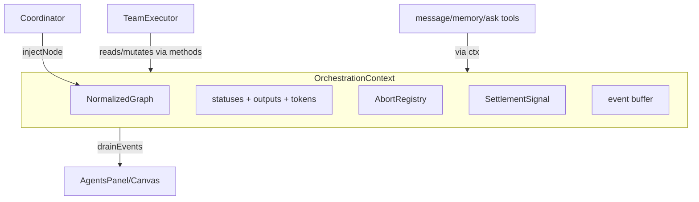

# PLAN-00 — Orchestration Kernel

<!-- version: 1.0.0 -->
<!-- classification: PLAN -->
<!-- date: 2026-06-17 -->
<!-- last-updated: 2026-06-17 -->
<!-- feature: src/orchestration/context.ts, gate.ts, normalize.ts, abort-registry.ts -->
<!-- depends-on: PLAN-01 -->
<!-- enables: PLAN-06, PLAN-07, PLAN-08, PLAN-11 -->

## 1. Overview & Purpose

The kernel is the **single shared spine** of the multi-agent runtime. It owns the *only*
copies of orchestration state (statuses, outputs, tokens), the cancellation registry, the
settlement signal, and the event buffer. Every runtime plan (06, 07, 08, 11) plugs into it
rather than inventing its own state, which is what eliminates the 15 integration flaws
catalogued in the master plan PART II.

**Design rule:** state, ordering, cancellation, and delivery each have *exactly one home*.
`OrchestrationContext` is that home.

## 2. Interface Definitions

```typescript
// src/orchestration/context.ts
import type { StepStatus } from './executor.js'
import type { TeamStepEvent } from './events.js'
import type { MessageBus } from '../core/team/message-bus.js'
import type { SharedMemory } from '../core/team/shared-memory.js'
import type { AskBroker } from '../core/team/ask-broker.js'
import type { NormalizedGraph, Node, PortNode } from './normalize.js'
import type { LogicPortResult } from './gate.js'

export interface TokenUsage { input: number; output: number }

export interface OrchestrationContext {
  readonly graph:    NormalizedGraph
  readonly statuses: Map<string, StepStatus>     // node → status
  readonly outputs:  Map<string, string>         // node → human-readable output
  readonly tokens:   Map<string, TokenUsage>     // node → provider-normalized usage
  readonly bus:      MessageBus
  readonly memory:   SharedMemory
  readonly broker:   AskBroker
  readonly abort:    AbortRegistry

  // settlement signalling
  waitForNextSettlement(): Promise<void>         // resolves when any node settles OR a slot frees
  notifySettled(node: string): void
  drainEvents(): TeamStepEvent[]                 // FIFO buffer the executor yields

  // state transitions — the ONLY path that mutates statuses
  markRunning(node: string): void
  markDone(node: string, output: string): void
  markError(node: string, err: Error): void
  markSkipped(node: string): void
  firePort(node: string, res: LogicPortResult): void
  cancelXorLosers(port: PortNode): void

  recordTokens(node: string, usage: TokenUsage): void
  allTerminal(): boolean
  verdict(): 'APPROVE' | 'FAILED' | 'COMPLETE'
}
```

```typescript
// src/orchestration/abort-registry.ts
export class AbortRegistry {
  private controllers = new Map<string, AbortController>()
  signal(node: string): AbortSignal {
    let c = this.controllers.get(node)
    if (!c) { c = new AbortController(); this.controllers.set(node, c) }
    return c.signal
  }
  cancel(node: string, reason: string): void { this.controllers.get(node)?.abort(reason) }
  cancelAll(reason: string): void { for (const c of this.controllers.values()) c.abort(reason) }
}
```

### 2.1 Settlement signal implementation

A resettable promise. `waitForNextSettlement()` returns the current promise; `notifySettled`
resolves it and swaps in a fresh one. This gives zero-CPU blocking with no busy loop.

```typescript
class SettlementSignal {
  private resolve!: () => void
  private promise = this.fresh()
  private fresh(): Promise<void> { return new Promise(r => { this.resolve = r }) }
  wait(): Promise<void> { return this.promise }
  notify(): void { const r = this.resolve; this.promise = this.fresh(); r() }
}
```

## 3. The Tri-State Gate (gate.ts)

```typescript
// src/orchestration/gate.ts
export type Gate = 'FIRE' | 'SKIP' | 'WAIT'
export type GateType = 'AND' | 'OR' | 'XOR' | 'NAND'

export interface LogicPortResult { gateType: GateType; outputs: Record<string, string> }

export function evaluateGate(
  node: Node, statuses: Map<string, StepStatus>,
): Gate {
  const deps = node.dependsOn
  const st = (n: string) => statuses.get(n)!
  const done   = deps.filter(d => st(d) === 'done').length
  const failed = deps.filter(d => st(d) === 'error' || st(d) === 'skipped').length
  const total  = deps.length
  const pending = total - done - failed

  if (node.kind === 'agent') {
    if (failed > 0) return 'SKIP'                 // any dead dep poisons this node
    return done === total ? 'FIRE' : 'WAIT'
  }
  // port — early-fire semantics
  switch (node.logicPort) {
    case 'AND':  return failed > 0 ? 'SKIP' : (done === total ? 'FIRE' : 'WAIT')
    case 'OR':   return done >= 1 ? 'FIRE' : (pending > 0 ? 'WAIT' : 'SKIP')
    case 'XOR':  return done >= 1 ? 'FIRE' : (pending > 0 ? 'WAIT' : 'SKIP')
    case 'NAND': return failed >= 1 ? 'FIRE' : (pending > 0 ? 'WAIT' : 'SKIP')
  }
}

export function evaluateLogicPort(
  port: PortNode, statuses: Map<string, StepStatus>, outputs: Map<string, string>,
): LogicPortResult {
  const succeeded = port.dependsOn.filter(d => statuses.get(d) === 'done')
  const agg: Record<string, string> = {}
  for (const d of succeeded) agg[d] = outputs.get(d) ?? ''
  return { gateType: port.logicPort, outputs: agg }
}
```

### Gate truth table (the canonical reference)

| Gate | all-done | one-failed | partial (1 done, rest pending) | all-failed |
|---|---|---|---|---|
| agent | FIRE | SKIP | WAIT | SKIP |
| AND | FIRE | SKIP | WAIT | SKIP |
| OR | FIRE | (depends) FIRE if ≥1 done else WAIT | FIRE | SKIP |
| XOR | FIRE* | FIRE if ≥1 done | FIRE | SKIP |
| NAND | SKIP | FIRE | WAIT | FIRE |

\*XOR fires on the **first** success and cancels still-running siblings (§firePort + cancelXorLosers).

## 4. Implementation Details

### 4.1 firePort — readable aggregation (not JSON soup)

```typescript
firePort(name: string, res: LogicPortResult): void {
  const digest = Object.entries(res.outputs)
    .map(([agent, out]) => `### From ${agent}\n${truncate(out, 1200)}`)
    .join('\n\n')
  this.outputs.set(name, `## Aggregated inputs (${res.gateType})\n\n${digest}`)
  this.statuses.set(name, 'done')
  this.buffer.push({ type: 'logic:port:fired', portName: name, gateType: res.gateType })
  this.signal.notify()
}
```

### 4.2 cancelXorLosers — real cancellation

```typescript
cancelXorLosers(port: PortNode): void {
  for (const dep of port.dependsOn) {
    if (this.statuses.get(dep) === 'running') {
      this.abort.cancel(dep, `XOR ${port.name} resolved by a sibling`)
      this.markSkipped(dep)
    }
  }
}
```

### 4.3 markDone / markError / markSkipped

Each sets the status, pushes the matching event onto the buffer, and calls
`signal.notify()`. `markError` does NOT itself cascade — cascade is the executor's job via
the gate (a dependent of an errored node evaluates to SKIP). This keeps the kernel's state
transitions atomic and side-effect-light.

### 4.4 verdict()

```typescript
verdict(): 'APPROVE' | 'FAILED' | 'COMPLETE' {
  const vals = [...this.statuses.values()]
  if (vals.some(s => s === 'error')) return 'FAILED'
  // APPROVE if a reviewer node ended 'done' with an APPROVE output; else COMPLETE
  return this.hasApprovingReviewer() ? 'APPROVE' : 'COMPLETE'
}
```

## 4.5 TeamStepEvent — the canonical event union (`src/orchestration/events.ts`)

Referenced by every plan; defined **once** here (closes G11).

```typescript
// src/orchestration/events.ts
import type { StepStatus } from './executor.js'   // REUSE existing union (executor.ts:4)

export type GateType = 'AND' | 'OR' | 'XOR' | 'NAND'

export type TeamStepEvent =
  | { type: 'step:start';        stepId: string; provider: string; model: string }
  | { type: 'step:done';         stepId: string; output: string; tokens: { input: number; output: number } }
  | { type: 'step:error';        stepId: string; error: string }
  | { type: 'step:skipped';      stepId: string; reason: string }
  | { type: 'logic:port:fired';  portName: string; gateType: GateType }
  | { type: 'logic:port:skip';   portName: string; reason: string }
  | { type: 'agent:message';     from: string; to: string; content: string }
  | { type: 'agent:ask';         agentName: string; askId: string; question: string; options: string[] }
  | { type: 'agent:ask:answer';  askId: string; answer: string }
  | { type: 'memory:write';      agentName: string; key: string }
  | { type: 'handoff:start';     from: string; to: string; payloadMode: string }
  | { type: 'team:awaiting-user' }
  | { type: 'plan:done';         verdict: 'APPROVE' | 'FAILED' | 'COMPLETE' }
```
`StepStatus` is reused verbatim from `executor.ts:4` (`'pending'|'running'|'done'|'error'|'skipped'`).

## 4.6 createContext factory (`src/orchestration/context.ts`) — closes G12

```typescript
export function createContext(graph: NormalizedGraph, team: TeamDef): OrchestrationContext {
  return new OrchestrationContextImpl(graph, {
    bus: new MessageBus(),
    memory: new SharedMemory(teamMemoryPath()),
    broker: new AskBroker(),
    abort: new AbortRegistry(),
  })
}
```
`OrchestrationContextImpl` holds the `statuses/outputs/tokens` Maps, the `SettlementSignal`,
and the event `buffer`. `recordTokens(node, usage)` is fed by `TeamExecutor` from each
`runAgentLoop` return value (PLAN-CORE §3.5), closing G7 (no `session.getTokenUsage`).

## 4.7 NormalizedGraph.injectNodes — dynamic injection (closes G13)

Lets the coordinator (PLAN-11) add nodes at runtime, before priming:
```typescript
// on NormalizedGraph (defined in PLAN-01)
injectNodes(nodes: AgentDef[]): void {
  for (const n of nodes) this.nodes.push(n)
  const cycles = detectCycles(toGraphInput(this.nodes))   // re-validate (PLAN-01 shim)
  if (cycles.length) throw new TeamError(`injected plan cycle: ${cycles[0].join('→')}`)
}
```

## 4.8 Codebase Reality

| This spec assumes | Reality | Resolution |
|---|---|---|
| `StepStatus` | exists `executor.ts:4` | import & reuse |
| token map source | no `session.getTokenUsage` (G7) | `recordTokens` fed by `runAgentLoop` return (PLAN-CORE) |
| `TeamStepEvent` | undefined (G11) | defined here in `events.ts` |
| `createContext` | undefined (G12) | defined §4.6 |
| graph mutation | immutable build (G13) | `injectNodes` §4.7 |

## 4.9 Contracts

```
IMPORTS:
  StepStatus            ← executor.ts (existing)
  detectCycles          ← graph.ts (existing)
  NormalizedGraph, Node, PortNode, AgentDef, TeamDef, TeamError ← PLAN-01
  MessageBus            ← PLAN-04
  SharedMemory          ← PLAN-05
  AskBroker             ← PLAN-07
  AgentPool             ← PLAN-08
  TokenUsage            ← PLAN-CORE (run-agent.ts)
EXPORTS:
  OrchestrationContext, createContext   → PLAN-06,07,08,11
  evaluateGate, evaluateLogicPort, Gate, GateType, LogicPortResult → PLAN-06,08
  AbortRegistry         → PLAN-08
  TeamStepEvent (events.ts) → PLAN-08,09,10
```

## 5. Mermaid — kernel as the spine



## 6. Edge Cases & Error Handling

| Case | Handling |
|---|---|
| `markDone` on an already-terminal node | no-op + warn (idempotent) |
| `cancel` on a node with no controller | no-op |
| `waitForNextSettlement` with nothing in flight and not all terminal | liveness guard (PLAN-08 §Q) emits `team:awaiting-user` or times out |
| port fired twice (double settlement) | guarded: only fires if status still pending |
| `recordTokens` for unknown provider shape | defaults to {0,0}, logs once |

## 7. Test Cases

```
gate.test.ts:
  - evaluateGate agent: all-done→FIRE, one-failed→SKIP, partial→WAIT
  - AND: all-done→FIRE, one-failed→SKIP, partial→WAIT, all-failed→SKIP
  - OR: 1-done→FIRE, 0-done-some-pending→WAIT, all-failed→SKIP
  - XOR: 1-done→FIRE, 0-done-pending→WAIT, all-failed→SKIP
  - NAND: 1-failed→FIRE, all-done→SKIP, all-pending→WAIT, all-failed→FIRE
  - evaluateLogicPort: aggregates only succeeded deps' outputs

context.test.ts:
  - markDone pushes event + resolves settlement signal
  - waitForNextSettlement blocks then resolves on notifySettled
  - markSkipped counts as settlement (skip cascade works)
  - firePort stores readable digest, not JSON
  - cancelXorLosers aborts running siblings + marks skipped
  - allTerminal() true only when every node done/error/skipped
  - drainEvents returns FIFO and empties buffer
  - recordTokens accumulates; verdict FAILED if any error

abort-registry.test.ts:
  - signal(node) returns stable signal per node
  - cancel(node) aborts that node's signal
  - cancelAll aborts every registered controller
```

## 8. Verification Checklist

- [ ] `npm test` green; ≥80% coverage on context/gate/abort
- [ ] No busy loop: a `run()` over a 3-node chain wakes exactly 3 times
- [ ] XOR over two agents cancels the loser's `AbortSignal` (assert `signal.aborted`)
- [ ] Skip cascade: erroring a root marks all descendants skipped via gate evaluation only
- [ ] `evaluateGate` matches the truth table for all 4 ports × 4 dep-state combinations
