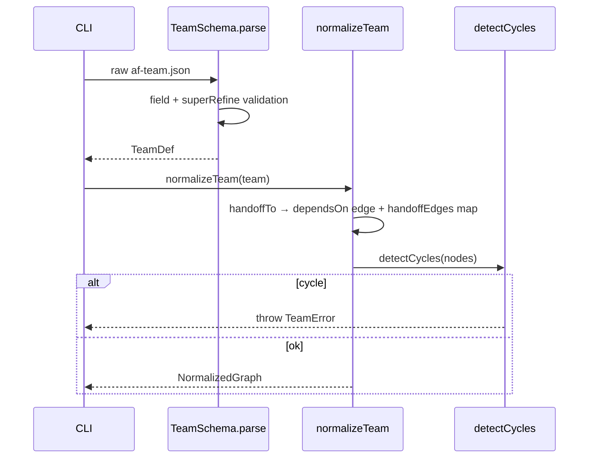

# PLAN-01 — Agent Definition System

<!-- version: 1.0.0 -->
<!-- classification: PLAN -->
<!-- date: 2026-06-17 -->
<!-- last-updated: 2026-06-17 -->
<!-- feature: src/orchestration/team-schema.ts, src/orchestration/normalize.ts, .ai/roles/, .ai/skills/ -->
<!-- depends-on: none -->
<!-- enables: ALL other plans -->

## 1. Overview & Purpose

Defines the declarative `af-team.json` format, the Zod `TeamSchema`, role/skill loading,
and — critically — the **normalization pass** that turns `handoffTo` into real DAG edges and
runs cycle detection. Normalization makes the DAG the single source of truth so the
scheduler (PLAN-00/08) never disagrees with handoff intent (master plan PART II §L, fixes F4/F8).

## 2. Role Catalog (`.ai/roles/<role>.md`)

```
.ai/roles/
├── coordinator.md   — decomposes goals, dispatches, synthesizes
├── planner.md       — designs specs / af-plan.json
├── worker.md        — implements: writes code, runs tools
├── reviewer.md      — evaluates → APPROVE | REQUEST_CHANGES
├── critic.md        — adversarial, challenges assumptions
├── aggregator.md    — collects parallel outputs, applies gate logic
└── generic.md       — empty (user supplies systemPrompt)
```

Each is a markdown prompt fragment prepended to the agent's system prompt; skills append after.

## 3. TeamSchema (Zod)

```typescript
// src/orchestration/team-schema.ts
import { z } from 'zod'

const HandoffSpec = z.object({
  to: z.string().regex(/^[a-z][a-z0-9-]*$/),
  payload: z.union([
    z.enum(['full', 'summary']),
    z.string().regex(/^outputs\.[a-z][a-z0-9-._]*$/),
  ]).default('summary'),
})

const LogicPortType = z.enum(['AND', 'OR', 'XOR', 'NAND'])

const AgentNode = z.object({
  kind: z.literal('agent').default('agent'),
  name: z.string().regex(/^[a-z][a-z0-9-]*$/),
  role: z.enum(['coordinator','planner','worker','reviewer','critic','aggregator','generic']).optional(),
  skills: z.array(z.string()).default([]),
  provider: z.string().default('anthropic'),
  model: z.string().optional(),
  systemPrompt: z.string().optional(),
  maxTurns: z.number().int().min(1).max(100).default(20),
  maxTokens: z.number().int().min(256).max(200_000).default(8192),
  tools: z.array(z.string()).default([]),
  handoffTo: HandoffSpec.optional(),
  dependsOn: z.array(z.string()).default([]),
  timeout: z.number().int().positive().optional(),
  maxRetries: z.number().int().min(0).max(5).default(0),
  prompt: z.string().optional(),
})

const PortNode = z.object({
  kind: z.literal('port'),
  name: z.string().regex(/^[a-z][a-z0-9-]*$/),
  logicPort: LogicPortType,
  dependsOn: z.array(z.string()).min(2),
  description: z.string().optional(),
})

const AgentDef = z.discriminatedUnion('kind', [AgentNode, PortNode])

export const TeamSchema = z.object({
  version: z.literal('1.0'),
  name: z.string(),
  goal: z.string().optional(),
  coordinator: z.string().optional(),
  agents: z.array(AgentDef).min(1),
  maxConcurrency: z.number().int().min(1).max(20).default(4),
  sharedMemory: z.boolean().default(true),
  timeout: z.number().int().positive().optional(),       // team-level wall clock (seconds)
  promoteMemory: z.boolean().optional(),                 // PLAN-12 Layer1→Layer2 promotion
}).superRefine((data, ctx) => {
  const names = data.agents.map(a => a.name)
  names.filter((n, i) => names.indexOf(n) !== i)
       .forEach(d => ctx.addIssue({ code: 'custom', message: `Duplicate agent name: ${d}` }))
  const nameSet = new Set(names)
  for (const a of data.agents) {
    for (const dep of a.dependsOn) {
      if (!nameSet.has(dep)) ctx.addIssue({ code: 'custom', message: `${a.name}: dependsOn unknown '${dep}'` })
    }
    if (a.kind === 'agent' && a.handoffTo && !nameSet.has(a.handoffTo.to)) {
      ctx.addIssue({ code: 'custom', message: `${a.name}: handoffTo unknown '${a.handoffTo.to}'` })
    }
  }
  if (data.coordinator && !nameSet.has(data.coordinator)) {
    ctx.addIssue({ code: 'custom', message: `coordinator '${data.coordinator}' not in agents` })
  }
})

export type TeamDef = z.infer<typeof TeamSchema>
export type AgentDef = z.infer<typeof AgentDef>
export type AgentNode = z.infer<typeof AgentNode>
export type PortNode = z.infer<typeof PortNode>
export type HandoffSpec = z.infer<typeof HandoffSpec>
export type LogicPortType = z.infer<typeof LogicPortType>
```

## 4. Normalization (`src/orchestration/normalize.ts`) — fixes F4/F8

```typescript
import { detectCycles } from './graph.js'   // REUSE existing util

export class NormalizedGraph {
  constructor(
    readonly nodes: AgentDef[],
    readonly handoffEdges: Map<string, HandoffSpec>,   // `${from}->${to}` → spec
  ) {}
  dependentsOf(name: string): AgentDef[] {
    return this.nodes.filter(n => n.dependsOn.includes(name))
  }
  byName(name: string): AgentDef | undefined { return this.nodes.find(n => n.name === name) }
}

export class TeamError extends Error {}

export function normalizeTeam(team: TeamDef): NormalizedGraph {
  const nodes = structuredClone(team.agents)
  const handoffEdges = new Map<string, HandoffSpec>()
  for (const a of nodes) {
    if (a.kind === 'agent' && a.handoffTo) {
      const target = nodes.find(n => n.name === a.handoffTo!.to)
      if (!target) throw new TeamError(`handoffTo '${a.handoffTo.to}' not found (agent ${a.name})`)
      if (!target.dependsOn.includes(a.name)) target.dependsOn.push(a.name)   // handoff ⇒ edge
      handoffEdges.set(`${a.name}->${a.handoffTo.to}`, a.handoffTo)
    }
  }
  const cycles = detectCycles(nodes as unknown as { id: string; dependsOn: string[] }[])
  if (cycles.length) throw new TeamError(`Team cycle(s): ${cycles.map(c => c.join('→')).join('; ')}`)
  return new NormalizedGraph(nodes, handoffEdges)
}
```

> Note: `detectCycles` in `graph.ts` keys on `.id`; the normalizer maps `.name`→`.id` (adapt
> the call or add a thin shim). Verify against `src/orchestration/graph.ts:50`.

## 5. Skill Loading & System Prompt Assembly

```typescript
export async function loadSkillPrompt(skill: string): Promise<string> {
  for (const p of [`.ai/skills/${skill}.md`, join(configDir(), 'skills', `${skill}.md`)]) {
    try { return await readFile(p, 'utf8') } catch { /* try next */ }
  }
  throw new TeamError(`skill '${skill}' not found in .ai/skills or registry cache`)
}

export async function buildSystemPrompt(agent: AgentNode): Promise<string> {
  const rolePart = agent.systemPrompt
    ?? (agent.role && agent.role !== 'generic' ? await readRole(agent.role) : '')
  const skillParts = await Promise.all(agent.skills.map(loadSkillPrompt))
  return [rolePart, ...skillParts].filter(Boolean).join('\n\n---\n\n')
}
```

## 6. Provider Routing (extends `src/core/llm/index.ts`)

```typescript
export function getAdapter(provider: string, apiKey?: string): LLMAdapter {
  switch (provider) {
    case 'anthropic': return new AnthropicAdapter(apiKey)
    case 'openai':    return new OpenAIAdapter(apiKey)
    default:          return new OpenAICompatAdapter(provider, apiKey)  // PLAN-03
  }
}
```

## 7. af-team.json Examples

(1) minimal generic, (2) linear chain w/ handoffs, (3) parallel + AND port, (4) coordinator
+ workers + NAND. Full JSON in master plan §3.2 and PLAN-08 scenarios — include all four
verbatim in the implemented file.

## 7.5 Codebase Reality

| Assumed | Reality (file:line) | Resolution |
|---|---|---|
| `detectCycles(nodes-by-name)` | keys on `.id` (`graph.ts:50`); `Step` shape | `toGraphInput()` shim maps `{name,dependsOn}`→`{id:name,dependsOn}` (G14) |
| `.ai/roles/*.md` exist | absent | author 7 role files (§7.6) as part of this plan |
| `configDir()` | ad-hoc paths across code | define `configDir()` = `~/.config/agentfactory` once; reuse `ConfigStore`'s base if exposed |
| `NormalizedGraph` immutable | n/a | add `injectNodes()` (G13, body in PLAN-00 §4.7) — make `nodes` a mutable array |

```typescript
function toGraphInput(nodes: AgentDef[]): { id: string; dependsOn: string[] }[] {
  return nodes.map(n => ({ id: n.name, dependsOn: n.dependsOn }))
}
```

## 7.6 Role file bodies (author these `.ai/roles/*.md`)

Each is a short prompt fragment. Author all seven; representative content:
- `coordinator.md` — "You are a Coordinator. Decompose the goal into discrete tasks, assign each to the most capable agent, and at the end synthesize all results into one answer."
- `planner.md` — "You are a Planner. Produce a concrete, ordered plan/spec before any implementation. Do not write code."
- `worker.md` — "You are a Worker. Implement the task using the available tools. Store key outputs via the `memory` tool (e.g. key `patch`, `summary`)."
- `reviewer.md` — "You are a Reviewer. Evaluate the work. End with exactly `APPROVE` or `REQUEST_CHANGES: <reason>`. Store your verdict via `memory` key `verdict`."
- `critic.md` — "You are a Critic. Adversarially challenge assumptions and surface risks the others missed."
- `aggregator.md` — "You are an Aggregator. Merge the inputs you received into a single coherent result."
- `generic.md` — empty (user supplies `systemPrompt`).

## 7.7 Contracts

```
IMPORTS:
  z (zod), detectCycles ← graph.ts (existing), readFile/join (node)
  ConfigStore (optional, for configDir) ← src/core/config/store.ts (existing)
EXPORTS:
  TeamSchema, TeamDef, AgentDef, AgentNode, PortNode, HandoffSpec, LogicPortType  → ALL plans
  NormalizedGraph (+ dependentsOf, byName, injectNodes), normalizeTeam, TeamError  → PLAN-00,08,11
  buildSystemPrompt, loadSkillPrompt  → PLAN-08
```

## 7.8 Definition of Done

- [ ] `TeamSchema.parse` + `normalizeTeam` round-trips all 4 example files
- [ ] `detectCycles` shim rejects a handoff cycle
- [ ] 7 role files exist under `.ai/roles/`
- [ ] `buildSystemPrompt` concatenates role + skills (override path tested)
- [ ] `injectNodes` re-validates and rejects cyclic injections

## 8. Mermaid — validation + normalization flow



## 9. Edge Cases

| Case | Handling |
|---|---|
| handoffTo creates a cycle | normalizeTeam throws TeamError with the cycle path |
| port with <2 deps | Zod rejects (min 2) |
| skill missing everywhere | loadSkillPrompt throws actionable error |
| systemPrompt set on a role agent | systemPrompt replaces role text, skills still append |
| duplicate names | superRefine error before normalization |

## 10. Test Cases

```
team-schema.test.ts:  valid minimal; valid coordinator+ports; dup names; bad dependsOn;
  port min-2; coordinator missing; handoffTo missing target
normalize.test.ts:    handoffTo adds dependsOn edge; handoffEdges populated; cycle rejected;
  no-handoff team passes through unchanged
prompt.test.ts:       buildSystemPrompt role+skills order; systemPrompt override; generic=empty;
  loadSkillPrompt .ai first then registry; throws if absent
```

## 11. Verification Checklist

- [ ] `factory orchestrate --team af-team.json --dry-run` prints parsed + normalized team
- [ ] Invalid JSON → actionable Zod error with field path
- [ ] A `handoffTo` with no `dependsOn` still runs in correct order (edge was added)
- [ ] Cyclic team is rejected before any agent runs
