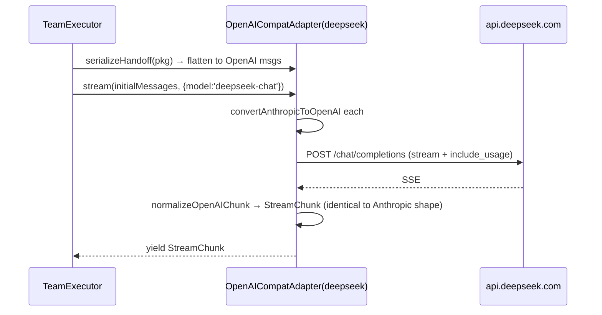
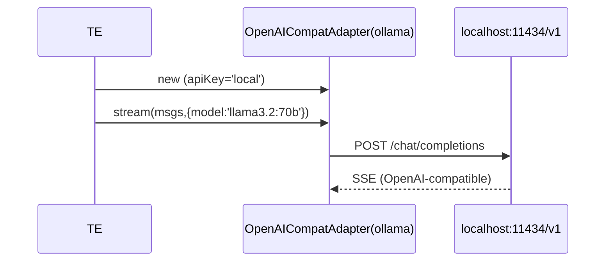

# PLAN-03 — Cross-Provider LLM Adapters

<!-- version: 1.0.0 -->
<!-- classification: PLAN -->
<!-- date: 2026-06-17 -->
<!-- last-updated: 2026-06-17 -->
<!-- feature: src/core/llm/openai-compat-adapter.ts, extend src/core/llm/types.ts -->
<!-- depends-on: PLAN-02 -->
<!-- consumed-by: PLAN-08 -->

## 1. Overview

Lets agents on different providers (Claude → DeepSeek → Ollama …) hand off to each other.
A single `OpenAICompatAdapter` covers every OpenAI-compatible backend. Resolves API keys via
the existing Wave-5 `ConfigStore` first (fixes F14) and normalizes per-provider token usage
(fixes F9).

## 2. Extended LLMAdapter interface

```typescript
// src/core/llm/types.ts — add serializeHandoff
export interface LLMAdapter {
  readonly provider: string
  readonly defaultModel: string
  stream(messages: MessageParam[], opts: LLMStreamOptions): AsyncIterable<StreamChunk>
  serializeHandoff(pkg: HandoffPackage): MessageParam[]   // NEW
}
```

## 3. Provider routing table

```
anthropic → AnthropicAdapter                     ANTHROPIC_API_KEY
openai    → OpenAIAdapter                         OPENAI_API_KEY
deepseek  → OpenAICompatAdapter api.deepseek.com  DEEPSEEK_API_KEY
ollama    → OpenAICompatAdapter localhost:11434/v1 (no key)
gemini    → .../v1beta/openai                     GEMINI_API_KEY
groq      → api.groq.com/openai/v1                GROQ_API_KEY
together  → api.together.xyz/v1                    TOGETHER_API_KEY
<custom>  → AGENTFACTORY_<NAME>_URL                AGENTFACTORY_<NAME>_KEY
```

## 4. OpenAICompatAdapter

```typescript
// src/core/llm/openai-compat-adapter.ts
import { store } from '../config/store.js'    // REUSE Wave-5 ConfigStore (fixes F14)

interface ProviderConfig { baseURL: string; envVar: string; defaultModel: string }

const PROVIDER_CONFIGS: Record<string, ProviderConfig> = {
  deepseek: { baseURL: 'https://api.deepseek.com',  envVar: 'DEEPSEEK_API_KEY', defaultModel: 'deepseek-chat' },
  ollama:   { baseURL: 'http://localhost:11434/v1', envVar: '',                 defaultModel: 'llama3.2' },
  gemini:   { baseURL: 'https://generativelanguage.googleapis.com/v1beta/openai', envVar: 'GEMINI_API_KEY', defaultModel: 'gemini-1.5-pro' },
  groq:     { baseURL: 'https://api.groq.com/openai/v1', envVar: 'GROQ_API_KEY', defaultModel: 'llama-3.1-70b-versatile' },
  together: { baseURL: 'https://api.together.xyz/v1',    envVar: 'TOGETHER_API_KEY', defaultModel: 'meta-llama/Llama-3-70b-chat-hf' },
}

export class OpenAICompatAdapter implements LLMAdapter {
  readonly provider: string
  readonly defaultModel: string
  private baseURL: string
  private apiKey: string

  constructor(provider: string, apiKey?: string) {
    const conf = PROVIDER_CONFIGS[provider] ?? deriveConfig(provider)
    this.provider = provider
    this.baseURL = conf.baseURL
    this.defaultModel = conf.defaultModel
    // ConfigStore first, then env, then explicit arg
    this.apiKey = apiKey ?? store.get(provider) ?? (conf.envVar ? process.env[conf.envVar] ?? '' : 'local')
  }

  async *stream(messages: MessageParam[], opts: LLMStreamOptions): AsyncIterable<StreamChunk> {
    const body = {
      model: opts.model ?? this.defaultModel,
      messages: messages.map(convertAnthropicToOpenAI),
      tools: opts.tools.map(convertToOpenAITool),
      stream: true,
      stream_options: { include_usage: true },        // ensure usage emitted (fixes F9)
      max_tokens: opts.maxTokens,
    }
    const res = await fetch(`${this.baseURL}/chat/completions`, {
      method: 'POST',
      headers: { Authorization: `Bearer ${this.apiKey}`, 'Content-Type': 'application/json' },
      body: JSON.stringify(body),
      ...(opts.signal ? { signal: opts.signal } : {}),
    })
    for await (const chunk of parseSSEStream(res)) yield normalizeOpenAIChunk(chunk)
  }

  serializeHandoff(pkg: HandoffPackage): MessageParam[] {
    return defaultSerializeHandoff(pkg).map(convertMessageToOpenAICompat)
  }
}
```

## 5. Conversion helpers

- `convertAnthropicToOpenAI(msg)` — MessageParam → ChatCompletionMessageParam
- `convertMessageToOpenAICompat(msg)` — flatten ContentBlock[] → string
- `convertToOpenAITool(tool)` — ToolDef → OpenAI tool schema
- `normalizeOpenAIChunk(raw)` — delta.content→text_delta; delta.tool_calls→tool_start; usage→`{type:'usage'}`
- `parseSSEStream(res)` — async-iterate `data:` lines, JSON.parse, stop on `[DONE]`

### Usage normalization (per-provider field names)

```
OpenAI/DeepSeek/Groq: usage.prompt_tokens / usage.completion_tokens
Ollama:               prompt_eval_count / eval_count
Gemini(compat):       usageMetadata.promptTokenCount / candidatesTokenCount
→ all map to StreamChunk { type:'usage', inputTokens, outputTokens }
```

## 6. Mermaid — Claude → DeepSeek handoff



## 7. Mermaid — Ollama (local, no key)



## 8. Edge Cases

| Case | Handling |
|---|---|
| no key for a remote provider | clear error: "set <PROVIDER>_API_KEY or run factory config" |
| Ollama not running | fetch ECONNREFUSED → agent marked error, retry/cascade |
| provider omits usage | StreamChunk usage absent → kernel records {0,0}, logs once |
| AbortSignal fires mid-stream | fetch aborts, generator returns cleanly |

## 9. Test Cases

```
openai-compat-adapter.test.ts:
  - stream(): mock fetch → yields normalized StreamChunk
  - stream(): AbortSignal cancels
  - serializeHandoff summary: OpenAI message shape (content is string)
  - serializeHandoff full: ContentBlock[] flattened
  - convertAnthropicToOpenAI: text + tool_use + tool_result variants
  - normalizeOpenAIChunk: content→text_delta, tool_calls→tool_start, usage mapped
  - key resolution: ConfigStore → env → arg precedence
  - getAdapter('ollama') localhost; ('deepseek') correct URL; unknown→deriveConfig
```

## 9.5 Codebase Reality

| Assumed | Reality | Resolution |
|---|---|---|
| `Provider = string` | `'anthropic'\|'openai'` union (`types.ts:3`) | widened by PLAN-CORE §3.7 |
| `getAdapter` | only `createAdapter` | added by PLAN-CORE §3.7; this plan supplies the `default:` branch |
| `store.get(provider)` | real method is `store.getKey(provider)` | use `store.getKey` |
| `StreamChunk` shape | exists `types.ts:9` incl `usage` | `normalizeOpenAIChunk` emits that exact union |
| `LLMStreamOptions.tools: ToolDef[]` | exists `types.ts:28` | map ToolDef→OpenAI tool |

`serializeHandoff` must be added to `AnthropicAdapter` and `OpenAIAdapter` too (interface
gained the method in PLAN-CORE) — for native providers it returns `defaultSerializeHandoff(pkg)`
unchanged.

## 9.6 Contracts

```
IMPORTS:
  LLMAdapter, LLMStreamOptions, StreamChunk, ToolDef, Provider ← llm/types.ts (PLAN-CORE-widened)
  HandoffPackage, defaultSerializeHandoff ← PLAN-02 · store ← config/store.ts (getKey)
EXPORTS:
  OpenAICompatAdapter, PROVIDER_CONFIGS  → PLAN-CORE getAdapter default branch, PLAN-08
  (AnthropicAdapter/OpenAIAdapter gain serializeHandoff)
```

## 10. Verification Checklist / Definition of Done

- [ ] A team with `provider:'deepseek'` agent runs end-to-end given key via ConfigStore or env
- [ ] Ollama agent runs with no key set
- [ ] Token totals populated for compat providers (usage normalized per §5)
- [ ] Handoff Claude→compat shows no ContentBlock format errors (integration test w/ PLAN-02)
- [ ] Native adapters implement `serializeHandoff` (= default)
