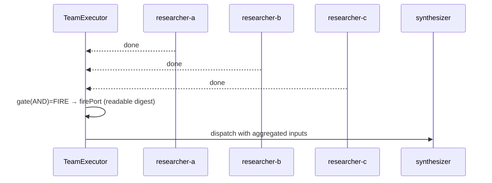
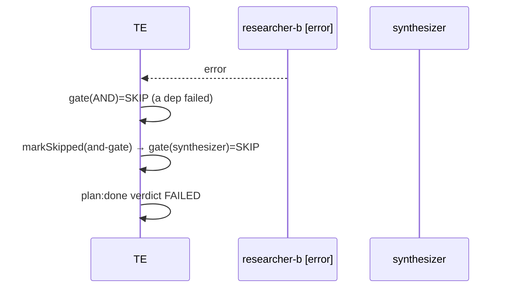
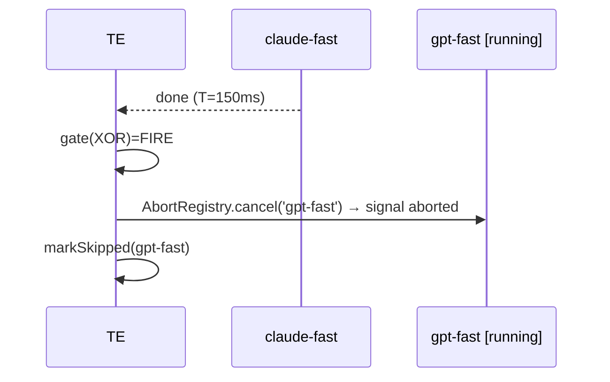
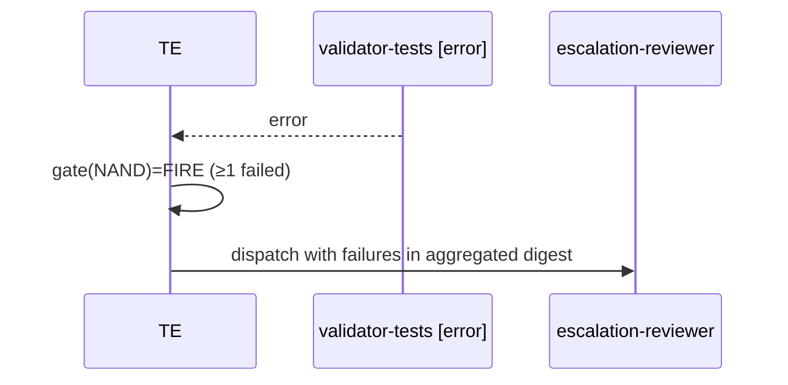

# PLAN-06 — Logic Ports

<!-- version: 1.0.0 -->
<!-- classification: PLAN -->
<!-- date: 2026-06-17 -->
<!-- last-updated: 2026-06-17 -->
<!-- feature: src/orchestration/gate.ts (port rules), src/tui/panels/OrchestrationCanvas.ts -->
<!-- depends-on: PLAN-00, PLAN-01 -->
<!-- consumed-by: PLAN-08, PLAN-10 -->

## 1. Overview

Logic ports are **non-agent DAG nodes** that gate flow with boolean logic. They fire *early*
(before all deps resolve) — which is the whole point and what the original `readySet` broke
(PART II §F2). The fix is the kernel **tri-state gate** (PLAN-00 §3); this plan owns the port
truth-table semantics and the canvas diamond rendering.

## 2. Port semantics (tri-state gate, from PLAN-00)

| Port | FIRE when | SKIP when | else |
|---|---|---|---|
| AND | all deps done | any dep failed | WAIT |
| OR | ≥1 dep done | all deps failed | WAIT |
| XOR | ≥1 dep done (first wins, cancel rest) | all deps failed | WAIT |
| NAND | ≥1 dep failed/skipped | all deps done | WAIT |

`evaluateGate` (PLAN-00 §3) returns FIRE/SKIP/WAIT; `evaluateLogicPort` aggregates the
succeeded deps' outputs into a readable digest (PLAN-00 §4.1 — not JSON soup, fixes F10).

## 3. XOR cancellation (fixes F5)

When XOR fires on the first success, the kernel `cancelXorLosers(port)` aborts every still-
`running` sibling via the AbortRegistry and marks them skipped. The loser's `agentLoop`
actually stops (its `AbortSignal` fires) instead of silently burning tokens.

## 4. Canvas diamond rendering

```typescript
// src/tui/panels/OrchestrationCanvas.ts
function renderPortBlock(buf: CellBuffer, block: PortBlock, status: StepStatus): void {
  const color = { AND: Colors.yellow, OR: Colors.green, XOR: Colors.purple, NAND: Colors.orange }[block.logicPort]
  const statusChar = status === 'done' ? '✓' : status === 'error' ? '✗' : '◇'
  //   ╱ AND ╲
  //  ╱       ╲
  //  ╲       ╱
  //   ╲_____╱
  buf.write(block.row,     block.col + 2, `╱ ${block.logicPort} ╲`, { fg: color })
  buf.write(block.row + 1, block.col,     `╱           ╲`,          { fg: color })
  buf.write(block.row + 2, block.col,     `╲           ╱`,          { fg: color })
  buf.write(block.row + 3, block.col + 2, `╲_________╱`,            { fg: color })
  buf.write(block.row + 1, block.col + 5, statusChar, { fg: color, bold: true })
}
```

## 5. Mermaid — AND (all succeed) → synthesizer



## 6. Mermaid — AND one fails → cascade skip



## 7. Mermaid — XOR race (cancel loser)



## 8. Mermaid — NAND escalation



## 9. Canvas status colors

```
pending    dim grey  ◇
evaluating yellow     ◇ (some inputs in)
fired      AND=yellow OR=green XOR=purple NAND=orange  ✓
skipped    dim red    ◇
```

## 10. Edge Cases

| Case | Handling |
|---|---|
| port with all deps skipped | OR/XOR → SKIP; NAND → FIRE (a skip counts as "not all done") |
| XOR with two deps finishing same tick | first in settlement order fires; second cancelled |
| port depends on another port | works; ports settle like nodes |

## 11. Test Cases

```
(gate truth-table lives in PLAN-00 gate.test.ts)
logic-port-integration.test.ts (in team-executor.test.ts):
  - AND all done → fires + synthesizer runs
  - AND one error → skip cascade
  - OR first done → fires immediately, others irrelevant
  - XOR first done → fires + loser AbortSignal.aborted === true
  - NAND one error → fires + escalation runs; all done → skip
canvas: renderPortBlock diamond shape + per-type color + status char
```

## 11.5 Codebase Reality & Contracts

| Assumed | Reality | Resolution |
|---|---|---|
| `PortBlock`, canvas block model | `OrchestrationCanvas` has its own `Block` interface (`OrchestrationCanvas.ts`) | add a `PortBlock` variant + `renderPortBlock`; map from `PortNode` in `syncFromTeam` (PLAN-10) |
| `Colors.orange` | `theme.ts` may lack orange | add an orange (256-color ~208) to `theme.ts` if absent |
| gate logic | lives in PLAN-00 `gate.ts` | this plan only owns port *semantics doc* + canvas render |

```
IMPORTS: evaluateGate, evaluateLogicPort, LogicPortResult, GateType ← PLAN-00 · PortNode ← PLAN-01
  CellBuffer, Colors ← tui/renderer · StepStatus ← executor.ts
EXPORTS: renderPortBlock, PortBlock  → PLAN-10
```

## 12. Verification Checklist / Definition of Done

- [ ] OR fires before its 2nd/3rd dep finishes
- [ ] XOR loser's agentLoop is actually aborted (token spend stops)
- [ ] NAND fires on first failure, routes to escalation
- [ ] Canvas shows colored diamonds with live fraction (e.g. `[2/3]`)
- [ ] orange color present in `theme.ts`; gate logic imported (not duplicated)
