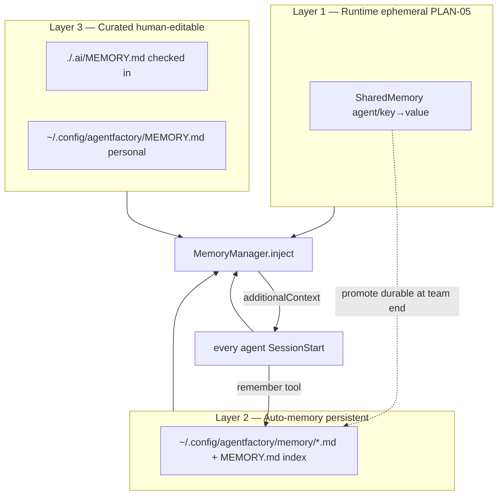
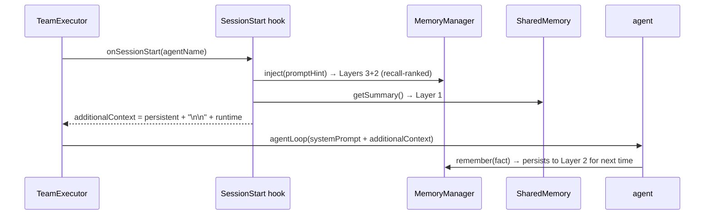

# PLAN-12 — Tiered Persistent Memory (Claude-Code-style)

<!-- version: 1.0.0 -->
<!-- classification: PLAN -->
<!-- date: 2026-06-17 -->
<!-- last-updated: 2026-06-17 -->
<!-- feature: src/core/memory/manager.ts, src/core/tools/remember.ts, src/tui/panels/MemoryPanel.ts, src/cli.ts (factory memory) -->
<!-- depends-on: PLAN-01, PLAN-05 -->
<!-- consumed-by: PLAN-08 (inject), PLAN-09 (factory memory), PLAN-10 (/memory UI) -->

## 1. Overview

Adds Claude Code's **tiered persistent memory** on top of the ephemeral runtime
`SharedMemory` (PLAN-05). Completes the 3-layer model: Layer 1 = runtime SharedMemory,
Layer 2 = auto-memory facts (persistent, auto-saved), Layer 3 = curated project + user
`MEMORY.md`. All layers inject through the same `additionalContext` seam.

## 2. 3-layer model


Precedence (high→low, all included): Project › User › Auto › Runtime.

## 3. Tier locations (mirrors Claude Code)

| Tier | Path | Scope | Checked in |
|---|---|---|---|
| Project | `./.ai/MEMORY.md` | repo, all agents | ✅ |
| User | `~/.config/agentfactory/MEMORY.md` | this user, all projects | ❌ |
| Auto | `~/.config/agentfactory/memory/<slug>.md` + `MEMORY.md` index | auto-saved facts | ❌ |

## 4. Auto-memory fact format

```markdown
---
name: <kebab-slug>
description: <one-line, used for recall>
metadata:
  type: user | feedback | project | reference
---

<fact body. For feedback/project add **Why:** and **How to apply:**. Link [[other-slug]].>
```
Index line in auto `MEMORY.md`: `- [Title](slug.md) — hook`.

## 5. MemoryManager

```typescript
// src/core/memory/manager.ts
export interface MemoryFact {
  slug: string; description: string
  type: 'user' | 'feedback' | 'project' | 'reference'
  body: string; path: string
}
export class MemoryManager {
  constructor(opts?: { projectRoot?: string; autoMemory?: boolean })
  load(): Promise<{ tier: 'project'|'user'|'auto'; path: string; content: string }[]>
  inject(promptHint?: string): Promise<string>   // merged markdown (Layers 3+2), recall-ranked
  remember(f: { title: string; body: string; type: MemoryFact['type']; scope: 'auto'|'project'|'user' }): Promise<void>
  forget(slug: string): Promise<void>
  recall(query: string, limit?: number): Promise<MemoryFact[]>
  list(): Promise<MemoryFact[]>
  setAutoMemory(on: boolean): void                // persists in ConfigStore
  isAutoMemoryOn(): boolean
}
```
Reuse: frontmatter parsing via harness reader patterns; toggle via `ConfigStore`; injection
prepended to `SharedMemory.getSummary()` in the PLAN-05 SessionStart hook.

## 6. remember tool

```typescript
// src/core/tools/remember.ts
export const RememberTool = buildTool({
  name: 'remember',
  description: 'Persist a durable fact so future sessions recall it (stable prefs, conventions, lessons). For transient run state use `memory`.',
  inputSchema: { type: 'object', properties: {
    fact:  { type: 'string' },
    type:  { type: 'string', enum: ['user','feedback','project','reference'] },
    scope: { type: 'string', enum: ['auto','project','user'] },
  }, required: ['fact','type'] },
  async call({ fact, type, scope = 'auto' }, ctx) {
    if (scope === 'auto' && !ctx.memoryManager.isAutoMemoryOn())
      return 'Auto-memory is off; not saved. Enable via `factory memory`.'
    const title = deriveTitle(fact)
    await ctx.memoryManager.remember({ title, body: fact, type, scope })
    return `Remembered (${scope}): ${title}`
  },
})
```

## 7. Durable promotion (Layer 1 → 2)

```typescript
export async function promoteDurableMemory(mem: SharedMemory, mm: MemoryManager): Promise<void> {
  for (const [, e] of mem.entries()) {
    if (isDurable(e)) await mm.remember({ title: e.key, body: e.value, type: 'project', scope: 'auto' })
  }
}
// isDurable: keep decisions/conventions/lessons; exclude transient keys (patch, diff, status, summary)
```
Called by `TeamRunner` when `team.promoteMemory ?? autoMemory`.

## 8. /memory UI (mirrors Claude Code screen)

```
  Memory

    Auto-memory: on

    1. Project memory             Checked in at ./.ai/MEMORY.md
  ❯ 2. User memory                Saved in ~/.config/agentfactory/MEMORY.md
    3. Open auto-memory folder ✔

  Learn more: docs/MEMORY.md
  Enter to confirm · Esc to cancel
```
`factory memory` (CLI) and `/memory` (palette) open `MemoryPanel.ts` (built on ScrollableList
+ ContextMenu). 1/2 open that tier in `$EDITOR`; 3 opens the auto folder; toggling auto-memory
flips `ConfigStore.set('autoMemory', …)`.

## 9. Injection sequence (all 4 layers)



## 10. Edge Cases

| Case | Handling |
|---|---|
| auto off + remember(auto) | no-op + guidance |
| project MEMORY.md missing | tier skipped, no error |
| malformed frontmatter | skip with warning, others load |
| duplicate slug | update existing file, dedup index |
| injected context too large | recall()-rank by relevance, cap chars |
| concurrent remember same slug | last-write-wins, index deduped |

## 11. Test Cases

```
memory-manager.test.ts: load all tiers (missing skipped); inject precedence; remember auto/project;
  duplicate slug update; forget; recall ranking; setAutoMemory persists; malformed frontmatter skipped
remember-tool.test.ts: auto on→saved; auto off+scope auto→guidance; scope project writes project tier
memory-panel.test.ts: renders 3 tiers + toggle; Enter opens editor intent; toggle flips ConfigStore
promote.test.ts: durable keys promoted; transient (patch/diff) excluded
```

## 11.5 Codebase Reality & Contracts

| Assumed | Reality (file:line) | Resolution |
|---|---|---|
| `ConfigStore.set/get('autoMemory')` | real API is `getKey`/`setKey` for API keys (`store.ts:35,42`) | store the toggle in a small `prefs.json` via a tiny `getPref/setPref` helper (or extend ConfigStore with a generic field); do NOT abuse `setKey` |
| SessionStart hook injects `inject()` | impossible (G5) | re-homed: executor concatenates `inject()` ahead of `getSummary()` into `runAgentLoop({additionalContext})` (PLAN-CORE §3.8) |
| `buildTool` for RememberTool | PLAN-CORE | `run` reads `ctx.memoryManager` |
| frontmatter parse | harness reader pattern (Wave 5.5 `reader.ts`, if present) else a 10-line parser | implement minimal YAML-frontmatter splitter |
| `deriveTitle(fact)` | n/a | first ≤6 words, kebab-cased |

```
IMPORTS: buildTool, ToolUseContext ← PLAN-CORE · SharedMemory ← PLAN-05 · configDir ← PLAN-01
EXPORTS: MemoryManager, MemoryFact, RememberTool, MemoryPanel, promoteDurableMemory
  → PLAN-08 (inject + promotion), PLAN-09 (factory memory), PLAN-10 (/memory UI)
```

## 12. Verification Checklist / Definition of Done

- [ ] `factory memory` shows the 3-tier screen; toggling auto-memory persists (via prefs, not setKey)
- [ ] `remember(...)` creates a fact file + index pointer
- [ ] A new team run injects that fact via `additionalContext` (re-homed, not a hook)
- [ ] `./.ai/MEMORY.md` edits picked up next run
- [ ] Durable team findings promote to auto-memory when `promoteMemory` is on
- [ ] frontmatter parser + `deriveTitle` defined
