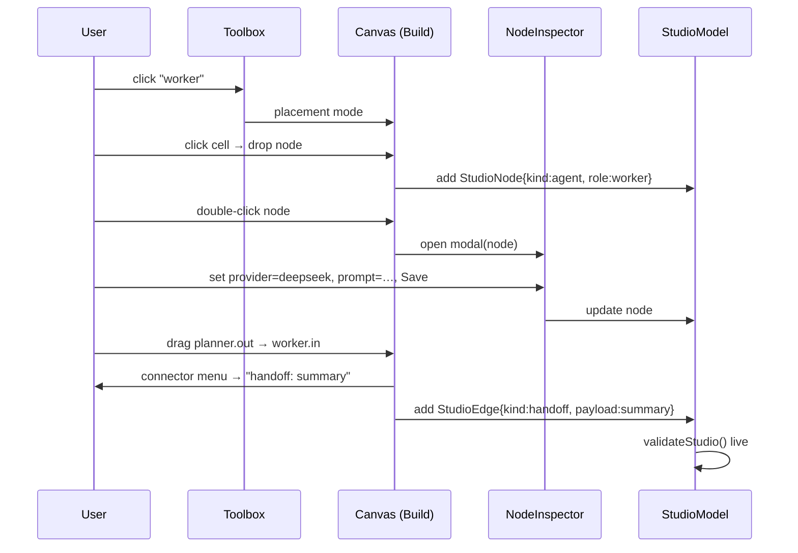
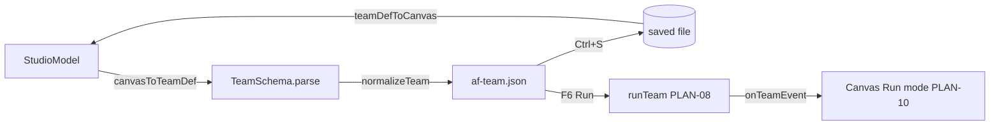

# PLAN-13 — Visual Orchestration Studio (n8n-style team builder)

<!-- version: 1.0.0 -->
<!-- classification: PLAN -->
<!-- date: 2026-06-17 -->
<!-- last-updated: 2026-06-17 -->
<!-- feature: src/orchestration/studio-model.ts (framework-agnostic), src/tui/panels/OrchestrationCanvas.ts (Build mode), src/tui/widgets/Toolbox.ts, src/tui/widgets/NodeInspector.ts -->
<!-- depends-on: PLAN-01, PLAN-06, PLAN-10 -->
<!-- consumed-by: PLAN-09 (factory orchestrate --team can run the saved file) -->
<!-- wave: 6C -->

## 1. Overview & Purpose

A **design-time** visual editor: drag agent/port nodes from a toolbox onto the canvas,
define each agent's properties in a modal inspector, draw **typed connectors** (plain
dependency vs handoff-with-payload), and **round-trip to `af-team.json`**. It is the authoring
twin of PLAN-10's runtime monitor — the *same* `OrchestrationCanvas`, two modes: **Build**
(this plan) and **Run** (PLAN-10). Inspired by n8n's drag-link-configure flow.

**Decisions baked in (from review):**
- Inspector = **modal overlay**, reusing the Wave-5 `ConfigPanel` edit-overlay pattern.
- Core is **framework-agnostic**: a pure `StudioModel` + `canvasToTeamDef`/`teamDefToCanvas`
  with no rendering, so a future **web** canvas reuses the serialization/validation core; only
  the renderer differs.

## 2. Codebase Reality — what *actually* works today (honest audit)

I read `OrchestrationCanvas.ts` (463 lines) in full. The drag/wire/menu **mechanics render**,
but the feature is a **dead-end visualizer**: you can move rectangles and draw lines, but you
**cannot define an agent, type a connector, persist, or run anything**. Classification:

| Capability | State today (file:line) | Verdict |
|---|---|---|
| Drag a block by its header → grid-snap | works (`:271-287`,`:305-327`) | ✅ operational |
| Output-port→input-port wire draw | works (`:254-269`,`:228-252`) | ✅ operational |
| Right-click delete wire/block, cascade | works (`:329-373`) | ✅ operational |
| **"Add agent block"** | creates a bare rect `id='agent-'+Date.now()`, **no role/provider/model/prompt/skills** (`:375-389`) | ⚠️ **hollow stub** |
| **Edit a node's properties** | **none** — context "Open session" is a **no-op** `()=>{menu=null}` (`:349`) | ❌ **missing** |
| **Block data model** | `Block` is purely visual (id,row,col,w,h,title,status,ports) — **carries zero agent data** | ❌ **no backing model** |
| **Typed connectors** | `CanvasWire` is `{from,to,port}` only — **no handoff vs dependency, no payload** (`:13-19`) | ❌ **untyped** |
| **Serialize canvas → file** | **none** — `syncFromPlan` is one-way (`:54-87`); there is **no `toPlan/toTeamDef`** | ❌ **can't save or run** |
| **Node selection (for inspect)** | only drag-derived `focusedBlockId` (`:405`) — **no click-to-select** | ❌ **missing** |
| Logic-port nodes (AND/OR/XOR/NAND) | not a node kind at all | ❌ **missing** |
| Rename / multi-input ports | title = id, default single in/out | ❌ **missing** |
| Live status from runs | `applyStepEvent` maps **old** `StepEvent`; `skipped→idle` loses the state (`:90-107`) | ⚠️ partial, wrong event type |

**So the user is right:** today's canvas is superficial. PLAN-13 must *operationalize* all of
the ❌/⚠️ rows, not "reuse" them. The two ✅ rows (block drag, wire draw mechanics) are the
only solid foundation.

## 2.5 Operationalization plan (address every gap above)

| Gap | Fix | Where |
|---|---|---|
| no backing model | make **`StudioModel` the source of truth**; `Block`/`CanvasWire` become **derived render views** computed from nodes/edges | `studio-model.ts` + canvas refactor |
| hollow "Add agent block" | toolbox drop / context-add creates a real `StudioNode{kind:'agent', role, name, provider:'anthropic'}` and **immediately opens the inspector** | `Toolbox`, `openContextMenu` |
| no edit | replace the no-op "Open session" with **"Configure…"** → `NodeInspector` modal; double-click also opens it | `NodeInspector`, `:349` |
| no selection | add `selectedNodeId` state + click-to-select highlight (distinct from drag) | canvas |
| untyped wires | extend edge with `kind:'dependency'\|'handoff'` + `payload`; connector menu on wire completion (§7); distinct glyph | `StudioEdge`, `handleLeftPress` |
| no serialize | add pure `canvasToTeamDef()` + `teamDefToCanvas()` (§8); `Ctrl+S` writes `af-team.json` | `studio-model.ts`, canvas |
| no port nodes | toolbox AND/OR/XOR/NAML drop → `StudioNode{kind:'port'}`; render via `renderPortBlock` (PLAN-06); allow **multi-input** | canvas, PLAN-06 |
| rename | inspector `name` field; title renders `name` not `id` | `NodeInspector`, `Block.title` |
| wrong status event | `applyStepEvent` → `onTeamEvent(TeamStepEvent)`; keep `skipped` distinct | PLAN-10 alignment |

> The keystone is **inverting ownership**: today `CanvasState{blocks,wires}` *is* the data;
> after PLAN-13 the **`StudioModel` is the data** and `blocks/wires` are a render cache rebuilt
> by `deriveView(model)`. That is what makes "define agents from the canvas" real and
> round-trippable.

## 3. Architecture — pure core + thin renderer

```
src/orchestration/studio-model.ts   ← FRAMEWORK-AGNOSTIC (no TUI, no DOM)
  StudioNode, StudioEdge, StudioModel
  canvasToTeamDef(model): TeamDef        (validated via TeamSchema + normalizeTeam)
  teamDefToCanvas(team): StudioModel      (inverse; layout coords assigned)
  validate(model): StudioError[]          (live design-time validation)

src/tui/panels/OrchestrationCanvas.ts    ← TUI renderer (Build mode added)
src/tui/widgets/Toolbox.ts               ← palette rail
src/tui/widgets/NodeInspector.ts         ← modal overlay (ConfigPanel pattern)
```
A web UI later implements its own renderer against the **same** `StudioModel` + serialization.

## 4. StudioModel (pure core)

```typescript
// src/orchestration/studio-model.ts
export interface StudioNode {
  id: string                     // stable internal id
  kind: 'agent' | 'port'
  // layout (renderer-owned, persisted for round-trip stability)
  row: number; col: number
  // agent fields (when kind==='agent')
  name?: string; role?: Role; skills?: string[]
  provider?: string; model?: string; prompt?: string
  maxTurns?: number; tools?: string[]; systemPrompt?: string
  // port fields (when kind==='port')
  logicPort?: 'AND' | 'OR' | 'XOR' | 'NAND'
}
export interface StudioEdge {
  id: string
  from: string                   // node id
  to: string                     // node id
  kind: 'dependency' | 'handoff'
  payload?: 'summary' | 'full' | string   // handoff only: 'summary'|'full'|'outputs.<key>'
}
export interface StudioModel { nodes: StudioNode[]; edges: StudioEdge[]; name: string }

export function canvasToTeamDef(m: StudioModel): TeamDef            // §8
export function teamDefToCanvas(t: TeamDef): StudioModel            // §8 (inverse)
export function validateStudio(m: StudioModel): StudioError[]       // §6.3
export function deriveView(m: StudioModel): { blocks: Block[]; wires: CanvasWire[] }  // §4.5
```

### 4.5 Ownership inversion (the core refactor of OrchestrationCanvas)

Today `CanvasState{blocks,wires}` **is** the data (and carries no agent fields). PLAN-13
inverts this: the **`StudioModel` becomes the single source of truth**; the canvas keeps a
`model: StudioModel` and renders a **derived, throwaway view**:

```typescript
// OrchestrationCanvas (Build mode)
private model: StudioModel = { nodes: [], edges: [], name: 'untitled' }
private selectedNodeId: string | null = null
private rebuild(): void { const v = deriveView(this.model); this.state.blocks = v.blocks; this.state.wires = v.wires }
```

`deriveView` maps each `StudioNode` → a `Block` (agent nodes render title=`name`, status from
run events; port nodes render via `renderPortBlock`, PLAN-06 — supporting **multi-input**) and
each `StudioEdge` → a `CanvasWire` with a `kind`-dependent glyph. Every mutation (drop, edit,
connect, delete, drag-move-writes-`row/col`-back) updates `model` then calls `rebuild()`.

This single change retires the three worst gaps at once: blocks now **carry agent data**,
the graph is **serializable** (`canvasToTeamDef(model)`), and round-trip load works
(`model = teamDefToCanvas(file)`).

## 5. Toolbox (`src/tui/widgets/Toolbox.ts`)

A left rail of draggable node templates:

```
┌─ Toolbox ──────┐
│ AGENTS         │
│  ▸ coordinator │
│  ▸ planner     │
│  ▸ worker      │
│  ▸ reviewer    │
│  ▸ critic      │
│  ▸ aggregator  │
│  ▸ generic     │
│ LOGIC PORTS    │
│  ◇ AND         │
│  ◇ OR          │
│  ◇ XOR         │
│  ◇ NAND        │
└────────────────┘
```

- Click a toolbox item → enters **placement mode**; next canvas click drops a new
  `StudioNode` at that cell (agent gets the role's default name + role; port gets the gate).
- Reuses the existing mouse plumbing; placement is a new `DragState` variant
  `{ kind: 'placing'; template: ToolboxItem }`.

## 6. NodeInspector (modal overlay — ConfigPanel pattern)

```typescript
// src/tui/widgets/NodeInspector.ts
export class NodeInspector {
  constructor(private node: StudioNode, private onSave: (n: StudioNode) => void, private onCancel: () => void)
  render(buf: CellBuffer): void   // centered modal
  onKey(e: KeyEvent): void        // Tab fields, Enter open dropdown/confirm, Esc cancel
}
```

Opened by **double-click** on a node (mirrors `ConfigPanel` double-click→edit overlay).

```
┌─ Edit: planner ──────────────┐
│ name     [planner          ] │
│ role     [planner ▾]         │   ← dropdown from .ai/roles
│ provider [anthropic ▾]       │   ← dropdown from PROVIDERS
│ model    [claude-sonnet-4-6] │
│ skills   [securityauditor +] │   ← repeatable chips
│ prompt   [Audit auth.ts…   ] │
│ maxTurns [20]                │
│        [ Save ]  [ Cancel ]  │
└──────────────────────────────┘
```

Port nodes get a tiny inspector (just the gate type, read-only label + delete).

### 6.3 Live validation (`validateStudio`)
On every edit, surface design errors inline (red underline + status line), reusing the
sibling-of-`TeamSchema` rules *without* throwing: duplicate names, dangling edges, a cycle
(via `detectCycles`), a port with <2 inputs, an unknown skill. This is the **gap-check at
design time** — you can't build an invalid team.

## 7. Typed Connectors

When a wire is completed (existing port→port flow), a small `ContextMenu` asks the edge type:

```
Connect planner → worker
  ▸ dependency (just ordering)
  ▸ handoff: summary
  ▸ handoff: full
  ▸ handoff: outputs.<key>…   (prompts for key)
```

- `dependency` → `StudioEdge{kind:'dependency'}` → becomes a plain `dependsOn` in the team.
- `handoff` → `StudioEdge{kind:'handoff', payload}` → becomes `handoffTo{to,payload}` **and**
  (via `normalizeTeam`) the implied `dependsOn` edge. Rendered with a distinct wire glyph
  (e.g. `═` handoff vs `─` dependency) + payload label at the midpoint.
- Wire into a **port node** is always a `dependency` (the gate's input).

## 8. Serialization (round-trip)

```typescript
export function canvasToTeamDef(m: StudioModel): TeamDef {
  const agents: AgentDef[] = m.nodes.map(n => n.kind === 'port'
    ? { kind: 'port', name: n.name ?? n.id, logicPort: n.logicPort!,
        dependsOn: depsInto(n.id, m) }
    : { kind: 'agent', name: n.name!, role: n.role, skills: n.skills ?? [],
        provider: n.provider ?? 'anthropic', model: n.model, prompt: n.prompt,
        maxTurns: n.maxTurns ?? 20, tools: n.tools ?? [],
        dependsOn: depsInto(n.id, m, 'dependency'),
        handoffTo: handoffOutOf(n.id, m) } )
  const team = { version: '1.0' as const, name: m.name, agents, maxConcurrency: 4, sharedMemory: true }
  TeamSchema.parse(team)        // hard validation
  normalizeTeam(team)           // cycle + handoff-edge check (PLAN-01)
  return team
}
```
`teamDefToCanvas(team)` is the inverse used to **load** an existing `af-team.json` for editing:
maps agents/ports → nodes (auto-layout grid like `syncFromPlan`), `dependsOn` → dependency
edges, `handoffTo` → handoff edges (de-duplicating the dependency edge normalization added).

**Persisting:** `Ctrl+S` (or context-menu *Save*) writes `af-team.json` to the cwd; the
status bar confirms. The saved file runs unchanged via `factory orchestrate --team` (PLAN-09).

## 9. Build ⇄ Run mode toggle

`OrchestrationCanvas` gains `mode: 'build' | 'run'`:
- **Build** (this plan): toolbox visible, inspector enabled, edges editable, `canvasToTeamDef`
  on save.
- **Run** (PLAN-10): toolbox hidden, nodes read-only, `onTeamEvent` drives live status colors.
- Toggle via a keybind (e.g. `F6`) or `/build` `/run` palette commands. Switching to Run
  first calls `canvasToTeamDef()` → `runTeam()`; switching back re-syncs status onto the
  same nodes.

## 10. Mermaid

### Authoring flow


### Serialize + run


## 11. Edge Cases

| Case | Handling |
|---|---|
| handoff edge creates a cycle | `validateStudio` flags it red; save blocked until fixed |
| agent with no name | inspector requires name (default = role); validation error otherwise |
| port with 1 input | flagged (needs ≥2); save blocked |
| `outputs.<key>` handoff, key empty | prompt re-asks; default to `summary` if cancelled |
| delete a node with edges | edges removed too; dependents re-validated |
| load malformed af-team.json | `teamDefToCanvas` surfaces ZodError; opens empty canvas + error banner |
| two nodes same name | live dup-name validation (sibling of `TeamSchema` superRefine) |

## 12. Contracts

```
IMPORTS:
  TeamSchema, TeamDef, AgentDef, AgentNode, PortNode, HandoffSpec, normalizeTeam, detectCycles-shim ← PLAN-01
  PortBlock, renderPortBlock ← PLAN-06
  OrchestrationCanvas (Build/Run mode), syncFromTeam ← PLAN-10
  PROVIDERS ← config/providers.ts · ContextMenu, CellBuffer, KeyEvent, Rect, Colors ← existing tui
  ConfigPanel edit-overlay pattern ← ConfigPanel.ts (reference)
EXPORTS:
  StudioModel, StudioNode, StudioEdge, canvasToTeamDef, teamDefToCanvas, validateStudio  → web UI (future), PLAN-09
  Toolbox, NodeInspector  → OrchestrationCanvas Build mode
```

## 13. Test Cases

```
studio-model.test.ts (pure, no TUI — also covers future web):
  - canvasToTeamDef: agents+ports+handoff edges → valid TeamDef (TeamSchema passes)
  - canvasToTeamDef: handoff edge produces handoffTo + dependsOn after normalize
  - teamDefToCanvas: round-trips (canvasToTeamDef(teamDefToCanvas(t)) ≡ t, modulo layout)
  - validateStudio: dup names, dangling edge, cycle, port<2 inputs, unknown skill
  - delete node removes incident edges

toolbox.test.ts: click item → placement mode; drop creates node with role defaults
node-inspector.test.ts: render fields; Tab nav; role/provider dropdowns from PROVIDERS/.ai roles;
  Save emits updated node; Esc cancels
orchestration-canvas-build.test.ts: connector menu types an edge; handoff glyph vs dependency glyph;
  F6 Build→Run calls canvasToTeamDef; invalid model blocks Run
```

## 14. Definition of Done

**Operationalization (every ❌/⚠️ row from §2 must now work):**
- [ ] "Add agent" creates a **real** `StudioNode` with role + provider defaults (not a bare rect)
      and opens the inspector — the old hollow `addBlock` (`:375`) is gone
- [ ] Double-click / "Configure…" opens `NodeInspector`; the no-op "Open session" (`:349`) is replaced
- [ ] A node **carries** name/role/skills/provider/model/prompt (StudioModel-backed); title shows `name`
- [ ] Click-to-select highlights a node (selection state exists, distinct from drag)
- [ ] Wires are **typed** (dependency vs handoff+payload), with distinct glyphs
- [ ] Logic-port nodes are droppable, render as diamonds, accept **multiple inputs**
- [ ] Live status uses `TeamStepEvent`; `skipped` stays distinct (not collapsed to idle)

**End-to-end:**
- [ ] Drag worker + reviewer from toolbox, connect `handoff: summary`, set provider/prompt,
      `Ctrl+S` → a **valid `af-team.json` that `factory orchestrate --team` actually runs**
- [ ] Loading that file back reproduces the same graph (round-trip via teamDefToCanvas)
- [ ] Invalid designs (cycle, dup name, port<2, dangling edge) blocked at design time, inline
- [ ] Build⇄Run toggle on the same canvas; Run shows live status (PLAN-10)
- [ ] `studio-model.ts` is **pure** (no TUI imports — enforced by a no-DOM unit test) so a web
      renderer reuses it
- [ ] No `any`; explicit return types

## 15. Migration note (don't break Wave 2/5 behaviour)

`syncFromPlan(Plan)` (af-plan.json) stays for backward compat; it now routes through
`teamDefToCanvas`-style derivation into the `StudioModel`. The legacy `CanvasState`-as-truth
path is removed in favour of `model` + `deriveView`, but the **public methods**
(`syncFromPlan`, `getState`, `applyStepEvent`→deprecated alias of `onTeamEvent`) keep working
so `app.ts` and existing tests don't break in one step.
```
