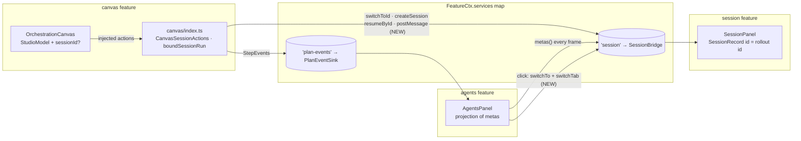
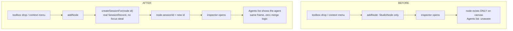
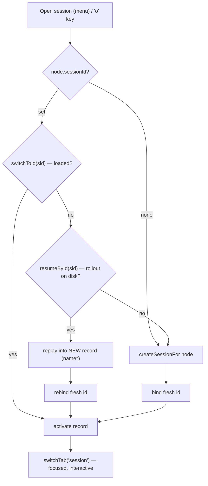
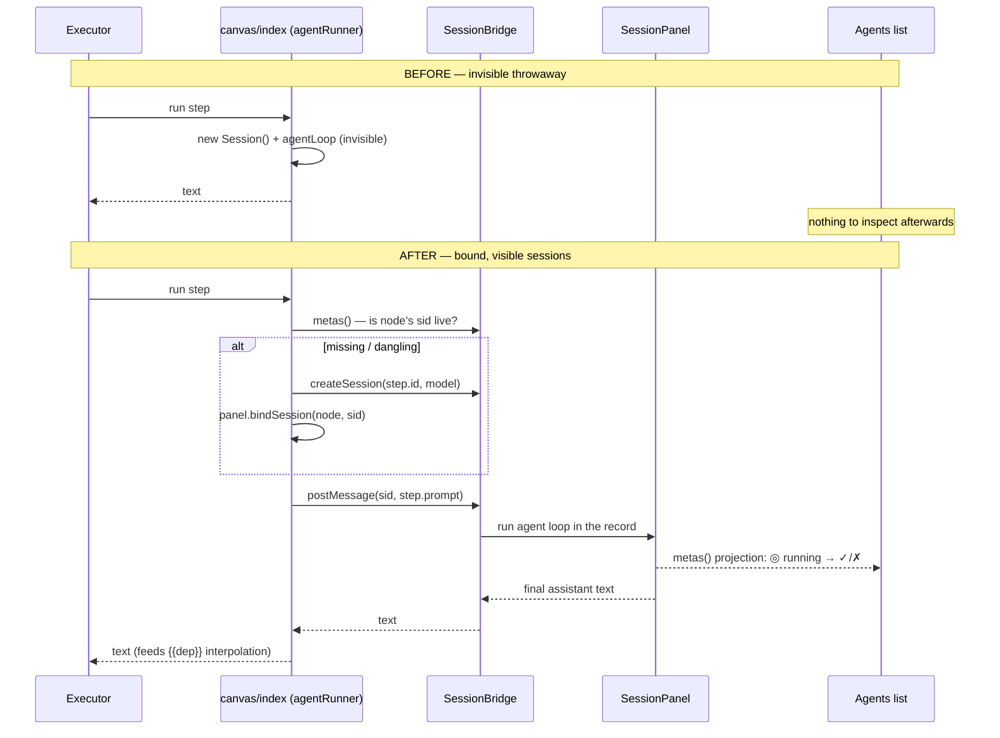

# CHANGE — Canvas Session Binding + Wire-Routing Fix (delta over UI Consolidation)
<!-- version: 1.0.0 -->
<!-- classification: CHANGE -->
<!-- date: 2026-07-09 -->
<!-- last-updated: 2026-07-09 -->

What changed on `feature/ui-consolidation` on 2026-07-08, relative to the
state documented in `CHANGE-UI-CONSOLIDATION-STUDIO-2026-07-07.md`. Scope is
exactly two workstreams: **(A)** the `routeWire` infinite-loop crash fix +
render guard, **(B)** giving sessions a stable identity and binding canvas
agent nodes to real chat sessions. Plan:
`specs/docs/approvedPlans/2026-07-08-canvas-session-binding-and-wire-fix.md`.

---

## 1. Summary of changes

| Area | Before (2026-07-07 state) | After (this change) |
|---|---|---|
| Wire routing | `routeWire` hung forever (→ OOM kill) on same-column or col−1 wires; wrong corner glyphs on right-to-left wires | Direction-safe per-segment loops; vertical wires end `▼`/`▲`; corners orient correctly; 9 new regression tests |
| Render failures | Any panel throw → `uncaughtException` → full TUI teardown | `App.renderTab` try/catch: error painted in-panel, logged once per distinct message, app keeps running |
| Session identity | Name-only (Nobel laureates); no stable id anywhere | `SessionRecord.id` = rollout id (unique file path, resumable); `SessionMeta` exported |
| SessionBridge | `metas / switchTo / model / chat / copy` | + `switchToId / createSession / resumeById / postMessage` |
| Canvas nodes | `StudioNode` had no session concept | optional `sessionId`, persisted via `x-studio.sessions` (additive; legacy files parse) |
| Canvas ↔ sessions | none ("Open session" was a removed no-op) | auto-bind on create; `Open session` / `Bind session…` / `Unbind` menu; `o` key; self-healing resolution ladder |
| Agents list | showed only chat sessions; click switched silently | canvas agents appear as real sessions; click switches AND navigates to the Session tab |
| Plan runs (Ctrl+R) | throwaway invisible `new Session()` per step | each step runs in its node's bound session — visible, inspectable, output feeds `{{dep}}` |

**No files, folders, routes, or services were renamed or removed.** All
changes are additive or in-place; the untyped services-map convention and
the six-feature registry are unchanged.

## 2. Project structure — previous vs current

Only the affected subtree is shown. `M` = modified, `A` = added; everything
else is untouched.

```
PREVIOUS (2026-07-07)                      CURRENT (2026-07-08/09)
src/                                       src/
├── app.ts                                 ├── app.ts                          M  renderTab try/catch + panelRenderErrors
├── features/                              ├── features/
│   ├── agents/                            │   ├── agents/
│   │   ├── index.ts                       │   │   ├── index.ts                M  onSelect: + switchTab('session'); id pass-through
│   │   └── panel.ts                       │   │   └── panel.ts                M  AgentEntry.id?
│   ├── canvas/                            │   ├── canvas/
│   │   ├── Wire.ts                        │   │   ├── Wire.ts                 M  direction-safe router (crash fix)
│   │   ├── wire.test.ts                   │   │   ├── wire.test.ts            M  +9 regression/fuzz/orientation tests
│   │   ├── index.ts                       │   │   ├── index.ts                M  CanvasSessionActions wiring; boundSessionRun
│   │   ├── panel.ts                       │   │   ├── panel.ts                M  auto-bind addNode; openNodeSession; bind menu; 'o'
│   │   └── panel.test.ts                  │   │   └── panel.test.ts           M  +9 binding tests
│   └── session/                           │   └── session/
│       ├── index.ts                       │       ├── index.ts                M  SessionBridge +4 methods; SessionMeta re-export
│       ├── panel.ts                       │       ├── panel.ts                M  SessionRecord.id; switchToId/create/resume/post
│       └── (no tests)                     │       └── panel.test.ts           A  7 identity/postMessage tests (all IO mocked)
└── orchestration/                         └── orchestration/
    ├── schema.ts                              ├── schema.ts                   M  StudioExtSchema.sessions (default {})
    ├── schema.test.ts                         ├── schema.test.ts              M  +2 legacy-default tests
    ├── studio-model.ts                        ├── studio-model.ts             M  StudioNode.sessionId? round-trip
    └── studio-model.test.ts                   └── studio-model.test.ts        M  +2 round-trip/rename tests

docs/  specs/                              docs/  specs/
├── features/                              ├── features/FEATURE-CANVAS-SESSION-BINDING-2026-07-08.md   A
├── testing/                               ├── testing/TESTING-CANVAS-SESSION-BINDING-2026-07-09.md    A
├── changes/                               ├── changes/CHANGE-CANVAS-SESSION-BINDING-2026-07-09.md     A  (this doc)
└── (registry, index)                      ├── reviews/REVIEW-CURRENT-STATE-2026-06-18.md              M  v2.1 analysis
                                           └── specs/docs/approvedPlans/2026-07-08-…-wire-fix.md       A
```

## 3. Ownership boundaries (unchanged seam, new traffic)

Features still talk ONLY through the services map — this change adds traffic
across the existing seam, not a new coupling path:



Boundary rules that held: `studio-model.ts` stays TUI-free (`sessionId` is an
opaque string; purity enforced by test); the canvas panel never imports the
session feature (actions are injected); the Agents panel owns no session
state (pure projection).

## 4. Workflow transitions — before vs after

### 4.1 Creating an agent box



### 4.2 Opening a session from a block (new — resolution ladder)



Every terminal state ends at `nav` — the action cannot dead-end regardless
of binding state (live, on-disk, deleted, or absent).

### 4.3 Plan run execution path



## 5. Concrete example — the same operation before vs after

**Operation:** operator drops a `worker` box, wants to talk to that agent,
then runs the plan.

Before (2026-07-07):

```
1. t → click worker → drop           box appears; prompt stub in inspector
2. "talk to it"                      IMPOSSIBLE — no session exists for the
                                     node; Agents list doesn't know it
3. Ctrl+R                            step runs in an invisible Session();
                                     output visible only as the team-row
                                     preview; transcript unrecoverable
4. (crash hazard) drag a wire        app freezes + dies if the cursor
   straight down                     crosses the port's column
```

After (2026-07-08):

```
1. t → click worker → drop           box appears AND "agent-1" row appears
                                     in Agents (★ stays on your session)
2. right-click → Open session        Session tab focuses agent-1; type to it
   (or select + o)                   like any chat session
3. Ctrl+R                            step streams INTO agent-1's session:
                                     live in Agents, full transcript
                                     inspectable afterwards, output feeds
                                     {{agent-1}} in dependents
4. drag a wire straight down         │…▼ preview renders; app fine
5. Ctrl+S                            x-studio.sessions persists the binding;
                                     reopening the plan restores it
```

## 6. Behavioral changes an operator will notice

1. **New agents rows appear on box creation** — expected, not a leak; delete
   of a node intentionally KEEPS its session (canvas doesn't own history).
2. **Clicking an Agents row now navigates** to the Session tab (previously
   it switched the active session without moving focus).
3. **Resumed sessions show a `name*` marker** and get a fresh id; plan files
   saved before a resume rebind on next save.
4. **A busy bound session fails a step fast** (`Session … is busy`) instead
   of interleaving two prompts into one conversation.
5. **Panel render errors degrade to an in-panel warning** instead of killing
   the TUI.

## 7. Compatibility

- `af-plan.json` files written before this change load unchanged
  (`sessions` defaults to `{}`); files written after are ignored-but-valid
  for the executor/CLI (`x-studio` remains additive).
- All previous `SessionBridge` consumers compile unchanged (`metas()` gained
  a field; methods were added, none altered).
- Headless/embedded use without a session bridge falls back to the previous
  throwaway-run behavior (kept as `throwawayRun`).
