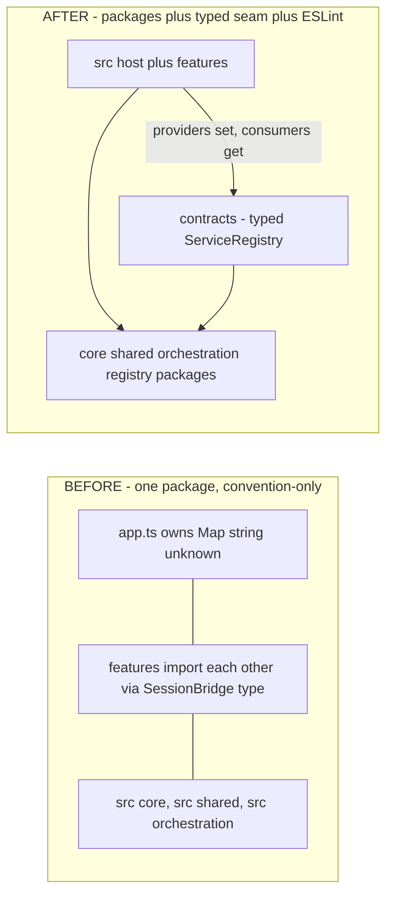
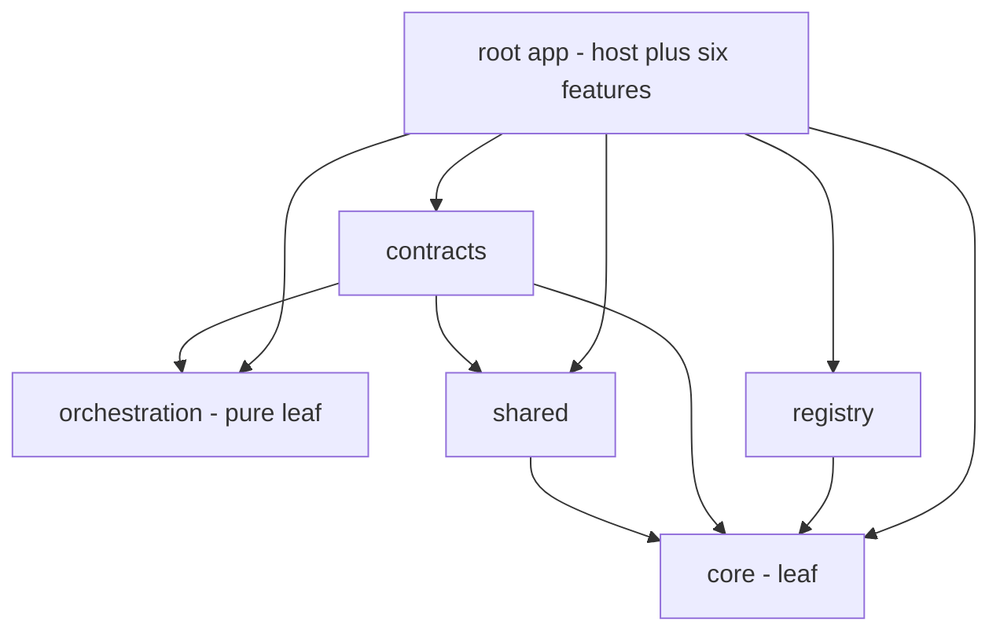
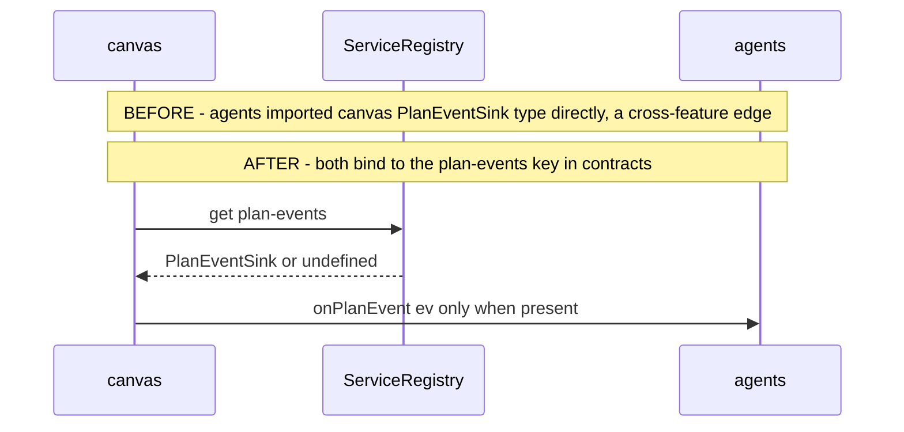
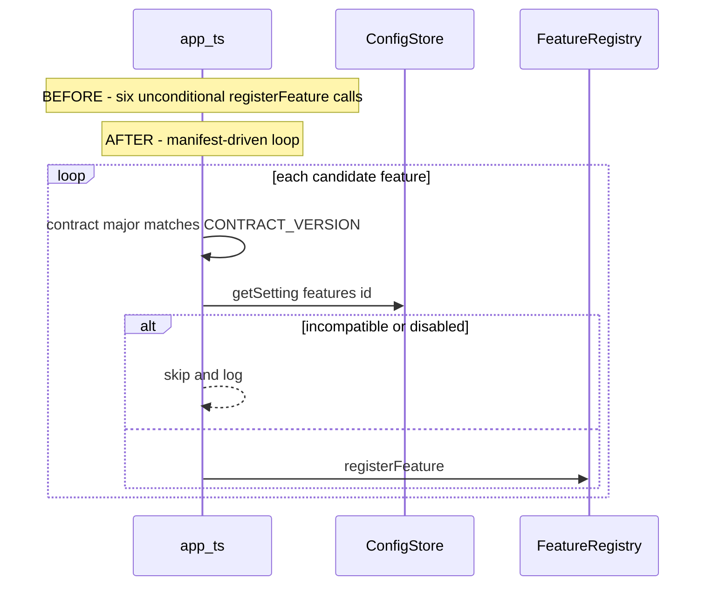

# CHANGE — Compartmentalization (Stages A–E): What Changed and Why

<!-- version: 1.0.0 -->
<!-- classification: CHANGE -->
<!-- date: 2026-08-26 -->
<!-- last-updated: 2026-08-26 -->

Scope: the compartmentalization branches `feature/compartmentalize` (A–C, PR #26) +
`feature/compartmentalize-packages` (D–E, PR #27). Turns the ddd/11 folder structure into
enforced, independently-upgradeable blocks — `@factory/*` workspace packages + a typed service
seam + runtime feature toggles.

> Not applicable to this repo: Docker/Compose/Ansible infrastructure and any routed
> "operator console" — this is a single local TUI binary.

---

## 1. Project structure — previous vs current

```
BEFORE (main @ 8423e93)                     AFTER (feature/compartmentalize-packages)
────────────────────────────────           ──────────────────────────────────────────────
package.json  (single package)             package.json  (root app + "workspaces": packages/*)
tsconfig.json                              tsconfig.base.json      NEW  shared compilerOptions
                                           tsconfig.json           (extends base; src + packages)
                                           eslint.config.js        (src feature-sibling ban)
src/                                        packages/               ← NEW top-level plane
├── app.ts        (Map<string,unknown>)     │  orchestration/  package.json·tsconfig·src/*
├── cli.ts                                  │  core/           package.json·tsconfig·src/*
├── contracts/    (Stage A, in src)         │  shared/         package.json·tsconfig·src/*
│   ├── feature.ts                          │  contracts/      package.json·tsconfig·src/*
│   ├── services.ts                         │  │    + manifest.ts   NEW (Stage E)
│   └── index.ts                            │  └  registry/     package.json·tsconfig·src/*
├── core/         ────────────────────►     src/
├── shared/       ────────────────────►     ├── app.ts   (createServiceRegistry + manifest
├── orchestration/────────────────────►     │             load loop; FKEY; loaded-tab switches)
├── registry/     ────────────────────►     ├── cli.ts   (@factory/orchestration imports)
├── harness/                                ├── harness/
└── features/                               └── features/  (unchanged location; import @factory/*)
    ├── types.ts  (re-exports contracts)        ├── types.ts  (re-export @factory/contracts)
    ├── registry.ts                             ├── registry.ts
    ├── session/  canvas/  agents/              ├── session/  canvas/  agents/   (+ manifest)
    └── terminal/ config/  logs/                └── terminal/ config/  logs/     (+ manifest)
```

Moves (all `git mv`, history preserved): `src/{orchestration,core,shared,contracts,registry}` →
`packages/*/src`. Renames of import specifiers: `../../core/x.js` → `@factory/core/x.js` (and
the four other packages) across every consumer. Nothing user-facing was removed.

---

## 2. Added / removed / modified

| Kind | Item |
|---|---|
| **Added** | `packages/{orchestration,core,shared,contracts,registry}/` (5 workspace packages, each with `package.json` + `tsconfig.json` + `exports` map); `tsconfig.base.json`; `eslint.config.js`; `packages/contracts/src/manifest.ts` (CONTRACT_VERSION + FeatureManifest + gates); `packages/contracts/src/services.ts` (typed `ServiceRegistry`); vitest per-block projects; a `manifest` on all 6 features |
| **Removed** | the untyped `Map<string,unknown>` service map + 6 `as X` casts; the 3 cross-feature type edges (`agents→session`, `canvas→session`, `agents→canvas`); `src/{orchestration,core,shared,contracts,registry}` (moved, not deleted) |
| **Modified** | `src/app.ts` (typed registry, manifest-driven load, loaded-tab-only switch/keymap/cycle); `getVersion()` (deeper upward search); every feature/host import to `@factory/*`; CI `lint` job now runs eslint; `package.json` (workspaces, deps, lint script) |
| **Renamed** | 5 folders `src/x` → `packages/x/src`; import specifiers `../x` → `@factory/x` |

**Behavioural changes:** none for the end-user's normal flows (chat, canvas, PTY, config, logs
all behave identically). New capability: `features.<id>=off` hides a tab at runtime; a
contract-major mismatch skips a feature with a warning instead of loading it.

---

## 3. Ownership & control-flow boundaries — before vs after





---

## 4. Workflow / execution — before vs after

### 4.1 Two features communicating (canvas ↔ agents during a plan run)



Before: `agents/index.ts` did `satisfies import('../canvas/index.js').PlanEventSink` and
`canvas` did `... as PlanEventSink` — a compile-time coupling in both directions. After: the
interface lives in `@factory/contracts`; `set`/`get` are typed by `ServiceMap['plan-events']`;
neither feature names the other.

### 4.2 Startup feature loading



---

## 5. Concrete before/after examples

### 5.1 Reading a cross-feature service

```ts
// BEFORE — untyped, cast, cross-feature import
import type { SessionBridge } from '../session/index.js'
const bridge = ctx.services.get('session') as SessionBridge | undefined

// AFTER — typed by ServiceMap, no import of the session feature, no cast
const bridge = ctx.services.get('session')   // SessionBridge | undefined
```

### 5.2 Importing a platform module

```ts
// BEFORE — relative reach into src/
import { Colors } from '../../shared/renderer/theme.js'
import { agentLoop } from '../../core/agent-loop.js'

// AFTER — the package's public surface
import { Colors } from '@factory/shared/renderer/theme.js'
import { agentLoop } from '@factory/core/agent-loop.js'
```

### 5.3 Running with a feature disabled

```
# BEFORE — impossible; all 6 tabs always present.
# AFTER — config-driven, no rebuild:
$ jq '.settings["features.terminal"]="off"' ~/.config/agentfactory/config.json | sponge …
$ factory        # tab bar: Session Orchestration Agents Config Logs   (no Terminal; no node-pty)
```

### 5.4 A developer accidentally couples two features

```
# BEFORE — compiles; coupling is silent until someone notices.
# AFTER:
$ npm run lint
  src/features/logs/index.ts
    1:1  error  No rule allowing this dependency … File is of type 'feature' with feature 'logs'.
               Dependency is of type 'feature' with feature 'session'  boundaries/element-types
$ echo $?
  1        # CI red — the coupling never lands
```

---

## 6. Operator/developer impact

- **Upgrade in isolation:** edit one package or one feature; the build proves neighbours are safe.
- **Reuse the engine:** `@factory/orchestration` is a pure, dependency-light package a web
  renderer can consume directly.
- **Ship variants:** `features.<id>=off` drops a tab (and, for Terminal, `node-pty`) at runtime.
- **Safety net:** a stale feature (wrong contract major) is skipped, not crashed.
- **Unchanged:** every existing end-user workflow behaves exactly as before.

Full verification: `docs/testing/TESTING-COMPARTMENTALIZE-2026-08-26.md`. Design analysis:
`docs/reviews/REVIEW-CURRENT-STATE-2026-06-18.md` (compartmentalization section).
