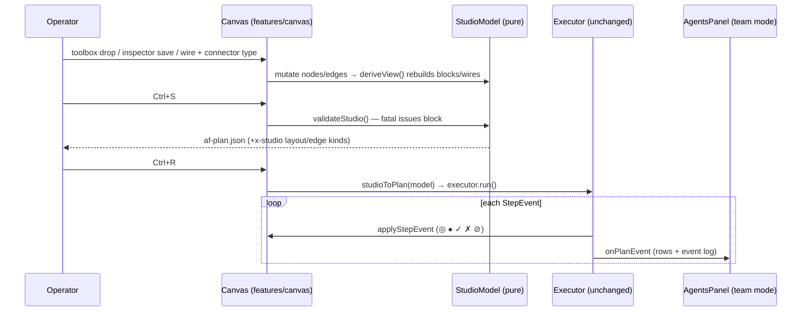
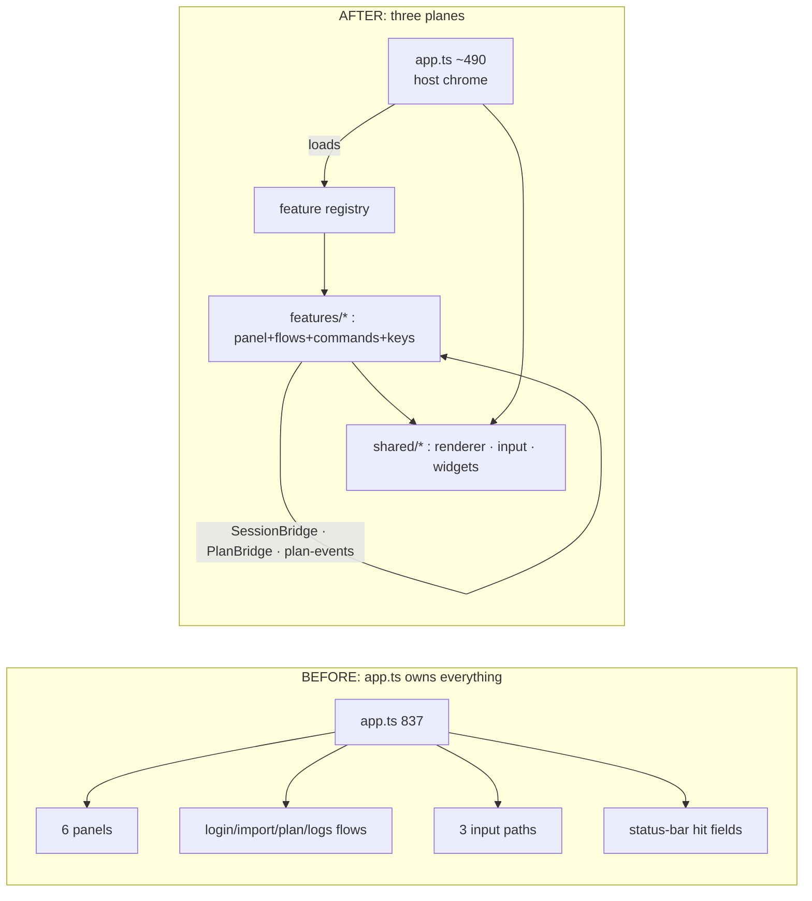

# CHANGE — UI Consolidation + Studio: What Changed and Why

<!-- version: 1.0.0 -->
<!-- classification: CHANGE -->
<!-- date: 2026-07-07 -->
<!-- last-updated: 2026-07-07 -->

Scope: the `feature/ui-consolidation` branch (12 commits, 92 files, +6231/−1796),
implementing `docs/ddd/09-gaps.md` + `10-optimizations.md` (P0–P4 + bucket B) +
`11-feature-isolation.md` in full, and PLAN-13/PLAN-10 in their standalone form.
Plan of record: `specs/docs/approvedPlans/2026-07-04-ui-consolidation-studio.md`.

---

## 1. Project structure — previous vs current

```
BEFORE (main @ fd8d0a1)                    AFTER (feature/ui-consolidation)
──────────────────────────────             ─────────────────────────────────────────
src/                                       src/
├── app.ts            837 lines            ├── app.ts            ~490 lines (thin host)
│     render loop + ALL input +            │     feature loop · render · chrome
│     hit-testing + panel wiring +         ├── shared/                    ← was src/tui/
│     login/import/plan/logs flows         │   ├── panel.ts               ← tui/panels/Panel.ts
├── tui/                                   │   ├── tabs.ts       NEW  TabId/TabEntry model
│   ├── renderer/                          │   ├── tab-bar.ts    NEW  pure tab geometry
│   │   ├── ansi.ts                        │   ├── settings.ts   NEW  applySetting()
│   │   ├── cell-buffer.ts                 │   ├── renderer/
│   │   ├── layout.ts   (fixed 40/70-30)   │   │   ├── ansi.ts · cell-buffer.ts
│   │   └── theme.ts    (13 raw colors,    │   │   ├── layout.ts      + LayoutPrefs, logs rect
│   │        accent==borderActive)         │   │   ├── theme.ts       REWRITTEN: semantic tokens,
│   ├── input/                             │   │   │                  default + high-contrast, setTheme()
│   │   ├── keyboard.ts (no F6!)           │   │   ├── motion.ts      NEW  reduced motion
│   │   ├── mouse.ts                       │   │   └── size-profiles.ts NEW guard screen
│   │   ├── router.ts   (3 of 6 panels)    │   ├── input/
│   │   └── vt.ts                          │   │   ├── keyboard.ts    + F6 mapping (bug fix)
│   ├── panels/                            │   │   ├── mouse.ts · router.ts (TabEntry-based)
│   │   ├── Panel.ts                       │   │   ├── controller.ts  NEW  the input state machine
│   │   ├── SessionPanel.ts                │   │   ├── hit-test.ts    NEW  HitMap zones
│   │   ├── OrchestrationCanvas.ts         │   │   └── keymap.ts      NEW  declarative bindings
│   │   ├── AgentsPanel.ts                 │   └── widgets/
│   │   ├── TerminalPanel.ts               │       ├── Overlay.ts     NEW  one modal frame
│   │   ├── ConfigPanel.ts                 │       ├── ScrollableList.ts + ListOptions/headless
│   │   ├── LogsPanel.ts                   │       ├── ContextMenu.ts + Esc + mouse
│   │   └── StatusBar.ts                   │       ├── HelpOverlay.ts NEW  `?` reference
│   └── widgets/                           │       ├── CommandPalette.ts · StatusBar.ts
│       ├── Block.ts · Wire.ts             ├── features/              ← NEW top-level plane
│       ├── CommandPalette.ts              │   ├── types.ts · registry.ts   (Feature contract)
│       ├── ContextMenu.ts (no Esc/mouse)  │   ├── session/   index.ts · panel.ts
│       └── ScrollableList.ts              │   ├── canvas/    index.ts · panel.ts · Block.ts ·
├── core/  (agent-loop: 2048 tokens,       │   │              Wire.ts · NodeInspector.ts NEW
│           3-way VERSION drift…)          │   ├── agents/    index.ts · panel.ts (+ team mode)
├── orchestration/                         │   ├── terminal/  index.ts · panel.ts · vt.ts
│   ├── schema.ts                          │   ├── config/    index.ts · panel.ts · flows.ts
│   ├── executor.ts · graph.ts             │   └── logs/      index.ts · panel.ts
│   └── planner.ts                         ├── core/
├── harness/ · registry/                   │   ├── version.ts  NEW · config/mask.ts NEW
├── cli.ts · index.ts                      │   ├── llm/limits.ts NEW · llm/model-cache.ts NEW
                                           │   └── (agent-loop: model-aware tokens)
(no smoke script)                          ├── orchestration/
                                           │   ├── schema.ts   + x-studio extension
                                           │   └── studio-model.ts NEW  pure studio core
                                           ├── cli.ts          + run --json (NDJSON)
                                           └── scripts/smoke-tui.sh NEW  tmux E2E
```

Renames (all `git mv`, history preserved): `src/tui/{renderer,input,widgets}` →
`src/shared/…`; each `tui/panels/<X>Panel.ts` → `features/<x>/panel.ts`;
`Panel.ts` → `shared/panel.ts`; `StatusBar.ts` → `shared/widgets/`;
`vt.ts`, `Block.ts`, `Wire.ts` → their owning feature. Removed: nothing user-facing —
only dead host code (listenInput, per-panel wiring, 4 drifted VERSION constants,
2 masking schemes, 3 hand-rolled modal border loops).

---

## 2. Behavioral changes at a glance

| Area | Before | After |
|---|---|---|
| Adding a tab/panel | edit app.ts in 8–10 places | one `registerFeature()` line |
| Input dispatch | 3 paths (router for 3 panels, explicit for Config/Logs, raw for Terminal) | 1 path: Controller → Keymap → Router over `TabEntry` (Terminal bypass preserved verbatim) |
| Keybindings | inline if-chains, undiscoverable | declarative keymap + `?` help overlay |
| F6 / Logs by keyboard | **broken** (byte never mapped) | works |
| Modals | 5 hand-rolled frames, Esc-only (ContextMenu not even Esc) | one Overlay; Esc + click-outside everywhere; menu items clickable |
| Wheel | ×3/×1/selection depending on panel | viewport-only convention (×3 text, ×1 lists) |
| Theme | hard-coded palette, focus==accent | semantic tokens, high-contrast, live swap, reduced motion |
| Small terminals | undefined behavior <80 cols | size profiles + guard screen (input keeps working) |
| Layout | fixed 40% / 70-30 | draggable, persisted dividers |
| `--version` | 0.3.0 vs 0.4.0 vs 0.6.0 in one binary | single source: package.json |
| Max tokens | flat 2048 | model-aware 8192/16384/4096 |
| Canvas | display-only rectangles, "Open session" no-op, nothing saves | StudioModel-backed: real agent data, typed wires, inspector, toolbox, Ctrl+S/Ctrl+R |
| Run visibility | canvas colors only, skipped collapsed to idle | ◎/●/✓/✗/⊘ + team dashboard with event log |
| Automation | human text on stderr only | `run --json` NDJSON + exit codes |

---

## 3. Execution paths — before vs after

### 3.1 A keypress (e.g. `c` on the Logs tab)

```
BEFORE                                        AFTER
──────                                        ─────
stdin ▶ listenInput() (240-line closure)      stdin ▶ InputController.handleData()
  ├─ activeTab===3? raw PTY branch              ├─ terminal? verbatim bypass branch
  ├─ palette open? …                            ├─ palette / help modal? route there
  ├─ 7 inline global if-chains                  ├─ Keymap.match('c','logs',textInput=false)
  ├─ activeTab===4 → configPanel.onKey()        │    └─ 'logs.clear' binding (feature-
  ├─ activeTab===5 → logsPanel.onKey()          │       contributed) → panel.clearLogs()
  │    └─ 'c' handled inside onKey              └─ else Router.dispatchKey → active panel
  └─ router.dispatch(panels[0..2])
                                              same key is now also listed in the `?` overlay
```

### 3.2 "Run a plan" — the same operation, then and now

```
BEFORE                                        AFTER
──────                                        ─────
1. Hand-write af-plan.json in an editor      1. F2 · t · drop worker+reviewer from toolbox
2. Restart factory to load it                2. Inspector: id/agent/provider/model/prompt
3. Canvas shows bare rectangles               3. Drag ○▶● · pick "handoff: summary" (══[H]══)
   (no data, can't edit, can't save)          4. Ctrl+S → af-plan.json (+x-studio) written;
4. Ctrl+R runs the FILE                          cycles/dups/empty prompts BLOCKED with reason
5. skipped steps look idle;                   5. Ctrl+R validates + serializes + runs the MODEL
   no step timeline anywhere                  6. Blocks: ◎▶●▶✓ · failures ✗ + cascade ⊘
                                              7. F3: team dashboard — statuses, durations,
                                                 output/error excerpt, rolling event log
                                              8. Reopen later: identical graph (round-trip)
```



### 3.3 Ownership boundaries



```
┌─ Control flow & ownership (after) ─────────────────────────────────────────┐
│ stdin ──▶ InputController ──▶ Keymap ──▶ InputRouter ──▶ feature panel     │
│              │ (host)          │ (data:      (TabEntry)     (owns its      │
│              │                 │  host + feature bindings)   keys/mouse)   │
│ render() ──▶ size guard ──▶ tab bar + panels + status bar ──▶ HitMap zones │
│ features ──▶ services map ──▶ other features (no direct panel coupling)    │
└─────────────────────────────────────────────────────────────────────────────┘
```

---

## 4. Operator impact summary

- **Discoverability**: `?` shows every binding for the current tab; the palette now also
  carries theme/motion/size/help/save/run commands.
- **Consistency**: one dismissal rule (Esc/click-outside), one wheel rule, one modal look.
- **Resilience**: no more broken layouts on small terminals; failures during runs are
  visible (✗ + ⊘ + event log) instead of silent idle blocks.
- **New capability**: plans can be authored, validated, saved, and run entirely from the
  canvas; CI/automation can consume `run --json`.
- **Unchanged**: chat, PTY fidelity, key management flows, log analysis — same behavior,
  new plumbing.

Full verification procedure: `docs/testing/TESTING-UI-CONSOLIDATION-STUDIO-2026-07-07.md`.
