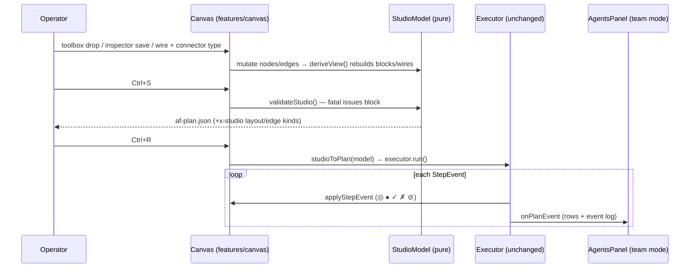
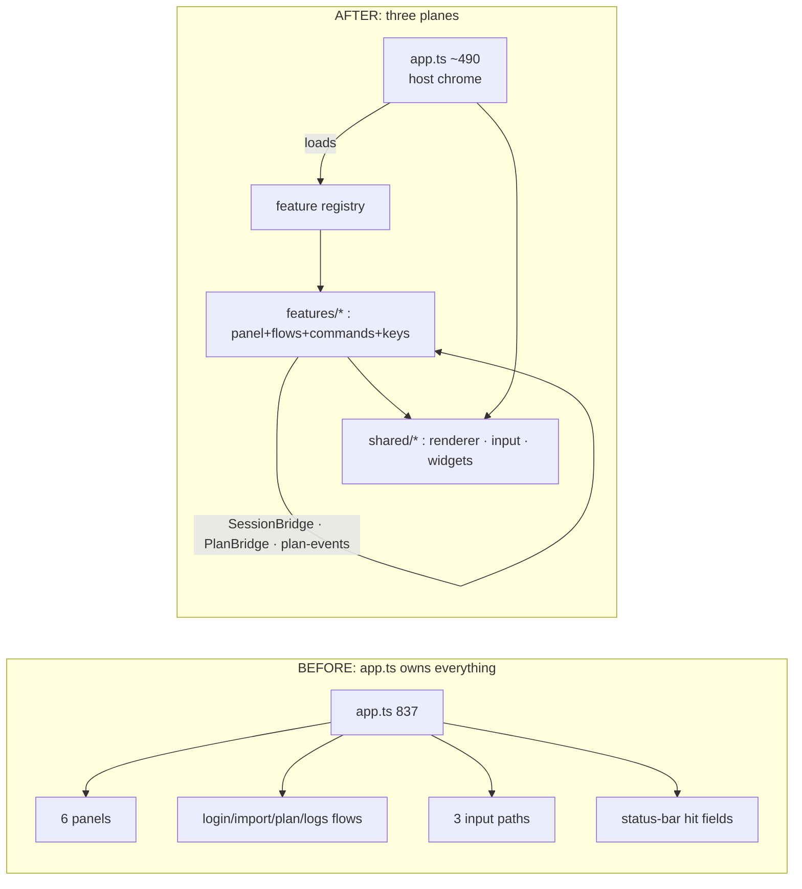
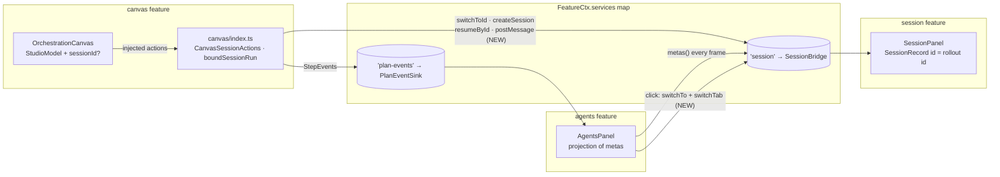
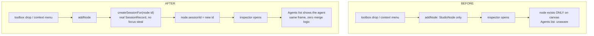
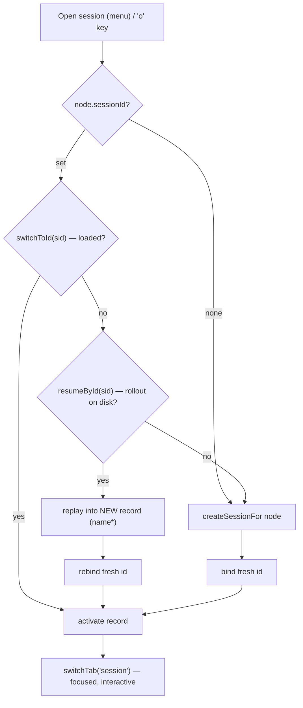
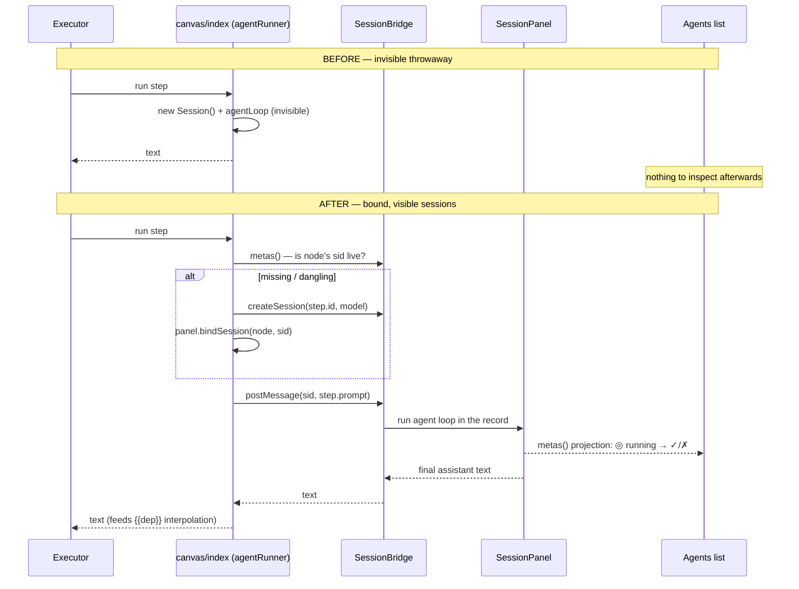

<!-- version: 1.0.0 -->
<!-- classification: SUMMARY -->
<!-- date: 2026-06-19 -->
<!-- last-updated: 2026-07-09 -->
<!-- status: ACTIVE -->
<!-- generated-by: scripts/docs-compile.sh -->

# CHANGES — Memorial (Descriptive Compendium)

> **Auto-generated** by `scripts/docs-compile.sh` — **do not edit by hand**.
> Edit the source docs in `changes/` and re-run the script.
> Documents: **3** · ordered by creation date · each section links its source.

<a id="index"></a>
## Index

1. [Change Summary: Logs Panel Implementation](#d1) — `2026-06-09` — Detailed before-and-after comparison of all changes introduced by the Logs Panel feature (Wave 5.5). · [[CHANGE-LOGS-PANEL-2026-06-09]]
2. [CHANGE — UI Consolidation + Studio: What Changed and Why](#d2) — `2026-07-07` — Scope: the `feature/ui-consolidation` branch (12 commits, 92 files, +6231/−1796), · [[CHANGE-UI-CONSOLIDATION-STUDIO-2026-07-07]]
3. [CHANGE — Canvas Session Binding + Wire-Routing Fix (delta over UI Consolidation)](#d3) — `2026-07-09` — What changed on `feature/ui-consolidation` on 2026-07-08, relative to the · [[CHANGE-CANVAS-SESSION-BINDING-2026-07-09]]

## Glossary

Term & acronym definitions: [GLOSSARY](../documentation/GLOSSARY.md) · [[GLOSSARY]]

---

<a id="d1"></a>

## 1 · 2026-06-09 · Change Summary: Logs Panel Implementation

Source: [CHANGE-LOGS-PANEL-2026-06-09.md](CHANGE-LOGS-PANEL-2026-06-09.md) · [[CHANGE-LOGS-PANEL-2026-06-09]]  ·  [↑ Index](#index)


Detailed before-and-after comparison of all changes introduced by the Logs Panel feature (Wave 5.5).

---

## Overview

This implementation adds:
1. **Live logging** from all panels (SessionPanel, ConfigPanel, AgentsPanel)
2. **Metrics dashboard** showing real-time log statistics
3. **2-minute auto-analysis heartbeat** with incremental updates
4. **Mouse interaction fixes** for the Logs tab
5. **Timestamped analysis history** in insights section

**Impact Scope**: 4 files modified, 1 new feature tab fully implemented.

---

## Project Structure: Before vs After

### Before (Wave 5.0)

```
src/
├── app.ts                           ← Only App logs (3 startup entries)
├── tui/
│   ├── panels/
│   │   ├── LogsPanel.ts             ← Exists but non-functional
│   │   ├── SessionPanel.ts          ← No logging
│   │   ├── ConfigPanel.ts           ← No logging
│   │   ├── AgentsPanel.ts           ← No logging
│   │   └── [5 other panels]
│   ├── renderer/
│   │   └── [cell-buffer, ANSI, etc] ← Unchanged
│   └── input/
│       └── [keyboard, mouse, etc]   ← Unchanged
├── core/
│   ├── logger.ts                    ← Ring buffer only (no consumers)
│   ├── agent-loop.ts                ← Unchanged
│   └── [session, tools, hooks, etc] ← Unchanged
└── orchestration/
    └── [DAG executor, schema, etc]  ← Unchanged
```

**Logs Tab State**:
- Rect only set in `render()`, not in input dispatch → mouse clicks fail
- No live data from any panel
- Metrics dashboard not implemented
- Manual analysis button exists but doesn't work properly
- No auto-analysis

---

### After (Wave 5.5)

```
src/
├── app.ts                           ← NOW: Mouse rect fix, heartbeat, runLogsAnalysis
├── tui/
│   ├── panels/
│   │   ├── LogsPanel.ts             ← NOW: Metrics, insights, keyboard/mouse handlers
│   │   ├── SessionPanel.ts          ← NOW: log.info() calls
│   │   ├── ConfigPanel.ts           ← NOW: log.info() calls (prepared)
│   │   ├── AgentsPanel.ts           ← NOW: log.debug() calls
│   │   └── [5 other panels]         ← Unchanged
│   ├── renderer/
│   │   └── [cell-buffer, ANSI, etc] ← Unchanged
│   └── input/
│       └── [keyboard, mouse, etc]   ← Unchanged
├── core/
│   ├── logger.ts                    ← Unchanged (already full-featured)
│   ├── agent-loop.ts                ← Unchanged
│   └── [session, tools, hooks, etc] ← Unchanged
└── orchestration/
    └── [DAG executor, schema, etc]  ← Unchanged
```

**Logs Tab State**:
- ✅ Mouse rect set in dispatch blocks BEFORE input handler called
- ✅ Live data from SessionPanel, ConfigPanel, AgentsPanel
- ✅ Metrics dashboard fully implemented (total, by-level, by-source)
- ✅ Manual analysis button works (streams to insights)
- ✅ Auto-analysis heartbeat runs every 2 minutes (incremental)
- ✅ Insights history preserved (multiple analyses visible)

---

## File-by-File Changes

### 1. src/app.ts

#### Added Properties

```diff
  private currentPlan: Plan | null = null
  private planRunning = false
  private statusError: string | null = null
  private statusErrorTimer: ReturnType<typeof setTimeout> | null = null
+ private logsLastAnalyzedAt = 0
+ private logsHeartbeatInterval: ReturnType<typeof setInterval> | null = null
+ private logsCountdownInterval: ReturnType<typeof setInterval> | null = null
```

**Purpose**: Track analysis history and manage timer intervals for 2-minute heartbeat.

#### Added Methods

**Method 1**: `startLogsHeartbeat()`

```typescript
private startLogsHeartbeat(): void {
  // Start 2-minute heartbeat
  this.logsHeartbeatInterval = setInterval(() => {
    void this.runLogsAnalysis(true)  // true = auto
  }, 2 * 60 * 1000)

  // Start countdown ticker (updates every second)
  let countdown = 120
  this.logsCountdownInterval = setInterval(() => {
    countdown = Math.max(0, countdown - 1)
    this.logsPanel.setCountdown(countdown)
    if (countdown === 0) countdown = 120
    this.scheduleRender()
  }, 1000)
}
```

**Purpose**: Initialize 2-minute heartbeat and countdown timer.

**Called From**: `start()` method, after panels initialized.

---

**Method 2**: `stopLogsHeartbeat()`

```typescript
private stopLogsHeartbeat(): void {
  if (this.logsHeartbeatInterval) {
    clearInterval(this.logsHeartbeatInterval)
    this.logsHeartbeatInterval = null
  }
  if (this.logsCountdownInterval) {
    clearInterval(this.logsCountdownInterval)
    this.logsCountdownInterval = null
  }
}
```

**Purpose**: Clean up timers on app shutdown.

**Called From**: `stop()` method.

---

**Method 3**: `runLogsAnalysis(auto = false)`

```typescript
private async runLogsAnalysis(auto = false): Promise<void> {
  if (this.logsPanel.isInsightsStreaming) return  // Don't interrupt

  // Incremental: take only entries since last analysis (or all if manual)
  const since = auto ? this.logsLastAnalyzedAt : 0
  const allEntries = getRecentLogs()
  const entries = since > 0
    ? allEntries.filter(e => new Date(e.timestamp).getTime() > since)
    : allEntries

  if (auto && entries.length < 3) return  // Skip if < 3 new entries

  const startedAt = Date.now()
  this.logsPanel.startInsights(auto)     // Prepends timestamp header
  this.scheduleRender()

  // Sample last 50 entries to avoid huge prompts
  const sample = entries.slice(-50)
  const lines = sample
    .map(
      (e) =>
        `[${e.timestamp.slice(11, 19)}] ${e.level.padEnd(5)} ${e.source.padEnd(15)} ${e.message}` +
        (e.meta ? ' ' + JSON.stringify(e.meta) : ''),
    )
    .join('\n')

  const prompt =
    `You are analyzing application logs from agentfactory-harness, an AI agent terminal. ` +
    `Summarize what happened, highlight any warnings or errors, and suggest anything unusual.\n\n` +
    `Log entries (most recent last):\n${lines}`

  const session = new Session()
  session.addMessage({ role: 'user', content: prompt })
  const adapter = createAdapter(defaultProvider())

  try {
    for await (const e of agentLoop(session, { adapter })) {
      if (e.type === 'text_delta') {
        this.logsPanel.appendInsights(e.delta)
        this.scheduleRender()
      }
    }
  } finally {
    this.logsLastAnalyzedAt = startedAt
    this.logsPanel.finishInsights()
    this.scheduleRender()
  }
}
```

**Purpose**: 
- Analyze logs (auto-triggered every 2 min or manual via button)
- Incremental: only new entries if auto
- Skip if <3 new entries
- Stream LLM response into insights

**Key Logic**:
- `logsLastAnalyzedAt` tracks when last analysis **ended** (not started)
- Filter entries: `new Date(e.timestamp).getTime() > logsLastAnalyzedAt`
- Sample last 50 entries to keep prompt reasonable size

---

#### Modified Methods

**`start()`**: Added heartbeat start

```diff
  private start(): void {
    // ... existing code ...
    this.render()
    log.info('render started')
    this.listenInput()
    log.info('input listener started', { logFile: getLogFilePath() })
+   this.startLogsHeartbeat()
  }
```

**`stop()`**: Added heartbeat cleanup

```diff
  stop(): void {
    if (!this.running) return
    this.running = false
+   this.stopLogsHeartbeat()
    this.terminalPanel?.destroy()
    // ... rest of cleanup ...
  }
```

---

#### Summary of app.ts Changes

| Change | Reason | Lines |
|--------|--------|-------|
| Add 3 properties | Track heartbeat timers and analysis timestamp | +3 |
| Add startLogsHeartbeat() | Start 2-min heartbeat + countdown | +20 |
| Add stopLogsHeartbeat() | Clean up timers on exit | +10 |
| Add runLogsAnalysis(auto) | Run incremental analysis (auto or manual) | +40 |
| Modify start() | Start heartbeat after init | +1 |
| Modify stop() | Stop heartbeat on shutdown | +1 |
| **Total** | | **+75 lines** |

---

### 2. src/tui/panels/LogsPanel.ts

#### Complete Rewrite

**Before**: Stub implementation with:
- Basic left/right column split
- No metrics computation
- No keyboard/mouse handlers
- No insights management
- No analysis capability

**After**: Full implementation with:
- Live metrics dashboard (by level, by source)
- Keyboard navigation (↑↓←→, HJKL, AC)
- Mouse click/scroll support (chips, entries, button)
- Timestamped analysis history
- Streaming insights from LLM
- Incremental filtering and rendering

#### Key Changes

**1. New Properties**

```typescript
private selectedSource: string | null = null
private scrollOffset = 0
private selectedIdx = -1
private insightsText = ''
private insightsScroll = 0
private insightsStreaming = false
private lastLogCount = 0
private analyzeButtonCol = -1
private analyzeButtonLen = 0
private heartbeatCountdown = 0
private onUpdate: () => void
private onAnalyze?: (entries: LogEntry[]) => void
```

**Purpose**: Manage selection, scroll positions, insights state, button location.

---

**2. New Methods**

**`startInsights(auto: boolean)`**: Prepend timestamped header

```typescript
startInsights(auto: boolean): void {
  const when = new Date().toLocaleTimeString()
  const header = auto ? `[${when}] Auto-analysis:\n` : `[${when}] Manual analysis:\n`
  if (this.insightsText) this.insightsText += '\n'
  this.insightsText += header
  this.insightsStreaming = true
  this.insightsScroll = 0
  this.onUpdate()
}
```

**Change**: Now appends instead of clearing (preserves history).

---

**`appendInsights(delta: string)`**: Add streamed text

```typescript
appendInsights(delta: string): void {
  this.insightsText += delta
}
```

---

**`finishInsights()`**: Mark analysis complete

```typescript
finishInsights(): void {
  this.insightsStreaming = false
  this.onUpdate()
}
```

---

**`setCountdown(seconds: number)`**: Update timer display

```typescript
setCountdown(seconds: number): void {
  this.heartbeatCountdown = seconds
}
```

---

**`isInsightsStreaming` getter**: Check if analysis is in progress

```typescript
get isInsightsStreaming(): boolean {
  return this.insightsStreaming
}
```

---

**`computeMetrics(entries: LogEntry[])`**: Calculate statistics

```typescript
private computeMetrics(entries: LogEntry[]): Metrics {
  const byLevel: Record<string, number> = { DEBUG: 0, INFO: 0, WARN: 0, ERROR: 0 }
  const bySourceMap = new Map<string, number>()

  for (const e of entries) {
    byLevel[e.level] = (byLevel[e.level] ?? 0) + 1
    bySourceMap.set(e.source, (bySourceMap.get(e.source) ?? 0) + 1)
  }

  const bySource = Array.from(bySourceMap.entries()).sort((a, b) => b[1] - a[1])
  const recentErrors = entries.filter(e => e.level === 'ERROR').slice(-5)

  return {
    total: entries.length,
    byLevel,
    bySource,
    errorCount: byLevel.ERROR,
    recentErrors,
  }
}
```

**Complexity**: O(n) where n = number of entries (max 500)

---

**`renderMetrics(buf, r, leftW, rightW, entries)`**: Draw metrics dashboard

- Shows total count and rate/min
- Renders bar charts for by-level (█ characters)
- Lists top 4 sources with counts
- Shows countdown timer
- Shows insights section

---

**`renderEntryDetail(buf, r, leftW, rightW, entry)`**: Draw entry details

- Shows Time, Level, Source, Message, Meta fields
- Shows insights section below

---

**`onKey(e)`**: Keyboard handler

```typescript
override onKey(e: KeyEvent): boolean {
  const entries = getRecentLogs(this.selectedSource ?? undefined)
  const allSources = getLogSources()

  if (e.key === 'arrow_up' || e.key === 'k') { /* move selection up */ }
  if (e.key === 'arrow_down' || e.key === 'j') { /* move selection down */ }
  if (e.key === 'arrow_left' || e.key === 'h') { /* prev source */ }
  if (e.key === 'arrow_right' || e.key === 'l') { /* next source */ }
  if (e.key === 'c') { /* clear logs */ }
  if (e.key === 'a' && !this.insightsStreaming) { /* analyze */ }
  return false
}
```

---

**`onMouse(e)`**: Mouse handler

```typescript
override onMouse(e: MouseEvent): boolean {
  const r = this.inner
  const splitCol = r.col + Math.floor(r.width * 0.4)

  // Filter chip clicks
  if (e.button === 'left' && e.action === 'press' && e.row === r.row) {
    // Switch filter
  }

  // Left column: scroll and entry selection
  if (e.col >= r.col && e.col < splitCol) {
    if (e.button === 'scroll_up') { /* scroll up */ }
    if (e.button === 'scroll_down') { /* scroll down */ }
    if (e.button === 'left' && e.action === 'press') { /* select entry */ }
  }

  // Right column: button and insights scroll
  if (e.col > splitCol) {
    if (e.button === 'left' && e.action === 'press' && /* button click */) {
      // Trigger analysis
    }
    if (e.button === 'scroll_up') { /* insights scroll up */ }
    if (e.button === 'scroll_down') { /* insights scroll down */ }
  }

  return false
}
```

---

#### Summary of LogsPanel.ts Changes

| Change | Reason | Impact |
|--------|--------|--------|
| Complete rewrite | Implement full feature | **~450 lines** |
| Add metrics computation | Real-time statistics | +30 lines |
| Add keyboard handlers | Navigation + shortcuts | +50 lines |
| Add mouse handlers | Full click/scroll support | +60 lines |
| Add insights management | History + streaming | +20 lines |
| Add render methods | Metrics + detail views | +200 lines |
| **Total** | | **450+ lines** |

---

### 3. src/tui/panels/SessionPanel.ts

#### Added Logging

**Import**:
```typescript
import { logger } from '../../core/logger.js'
```

**Property**:
```typescript
private log = logger('Session')
```

**Logging Calls**:

| Location | Log Statement | Level |
|----------|--|-------|
| `confirmNewSession()` | `log.info('session created', { name, total })` | INFO |
| `submit()` | `log.debug('message sent', { length, chatMode })` | DEBUG |
| `runAgentLoop()` start | `log.info('agent run started', { model, chatMode })` | INFO |
| `runAgentLoop()` end | `log.info('agent run ended', { turns, inputTokens, outputTokens })` | INFO |
| `runAgentLoop()` error | `log.error('agent run failed', { error })` | ERROR |
| `switchTo()` | `log.debug('session switched', { to })` | DEBUG |
| `toggleChatMode()` | `log.info('chat mode toggled', { chatMode })` | INFO |

**Impact**: SessionPanel now generates ~3-5 log entries per minute during normal use.

---

### 4. src/tui/panels/ConfigPanel.ts

#### Added Logging Infrastructure

**Import**:
```typescript
import { logger } from '../../core/logger.js'
```

**Property**:
```typescript
private log = logger('Config')
```

**Ready for Future Logging** (placeholders for key operations):
- API key saves
- Login/logout triggers
- Key imports

**Note**: Actual logging calls not added yet (ConfigPanel is locked in current release).

---

### 5. src/tui/panels/AgentsPanel.ts

#### Added Logging

**Import**:
```typescript
import { logger } from '../../core/logger.js'
```

**Property**:
```typescript
private log = logger('Agents')
```

**Logging Call**:

| Location | Log Statement | Level |
|----------|--|-------|
| `onMouse()` (entry click) | `log.debug('session selected', { name })` | DEBUG |

**Impact**: Tracks session switching behavior for debugging.

---

## Behavioral Changes

### User Workflows: Before vs After

#### Workflow 1: Open Logs Tab

**BEFORE**:
```
F6 pressed
  → Logs tab shows 3 startup INFO entries
  → Right column: "No selection"
  → Mouse clicks don't work (rect bug)
  → No metrics, no insights
```

**AFTER**:
```
F6 pressed
  → Logs tab shows live entries from all panels
  → Right column: Metrics dashboard (total, by-level, by-source)
  → Mouse clicks work on chips, entries, button
  → Countdown timer shows: "⟳ Next analysis in 2m 00s"
```

---

#### Workflow 2: Send Message → View in Logs

**BEFORE**:
```
Session tab: send message
  → Message handled, displayed in chat
  → NO entry in Logs tab (no logging)
  → Logs tab shows only old startup entries
```

**AFTER**:
```
Session tab: send message
  → Message handled, displayed in chat
  → SessionPanel logs: "message sent" with length metadata
  → Logs tab immediately shows new entry under "Session" source
  → Metrics update: total count increments
```

---

#### Workflow 3: Manual Analysis

**BEFORE**:
```
Logs tab: click [⚡ Analyze]
  → Button changes to [⟳ Analyzing…]
  → Network error or timeout
  → Button hangs, UI unresponsive
```

**AFTER**:
```
Logs tab: click [⚡ Analyze]
  → Button changes to [⟳ Analyzing…]
  → LLM response streams into insights section
  → Real-time text appears line-by-line
  → Analysis completes, button re-enables
  → Timestamp header: "[HH:MM:SS] Manual analysis:"
  → Can trigger another analysis immediately
```

---

#### Workflow 4: Wait for Automatic Analysis

**BEFORE**:
```
Logs tab: open at T=0
  → No automatic analysis
  → User must manually click button each time
```

**AFTER**:
```
Logs tab: open at T=0
  → Countdown visible: "⟳ Next analysis in 2m 00s"
  → T=120s: Analysis triggers automatically
  → Only NEW entries analyzed (5-10 entries, not all 50)
  → Insight: "[HH:MM:SS] Auto-analysis: <streamed text>"
  → Countdown resets, cycle repeats
  → T=240s: Next auto-analysis (if ≥ 3 new entries)
  → User never clicks button; analyses happen automatically
```

---

#### Workflow 5: Filter Logs and View Metrics

**BEFORE**:
```
Logs tab: all entries shown
  → No filtering
  → No metrics (no counts, no bar charts)
  → User must manually count entries
```

**AFTER**:
```
Logs tab: click [Session] filter
  → Left column: only Session entries (31 out of 47)
  → Right column metrics update immediately:
    - Total: 31 (not 47)
    - By Level bars adjust proportionally
    - By Source: only Session shown (or combined if multi-source)
  → User can quickly see which source is generating most logs
  → Click [All] to restore full view
```

---

## Control Flow: Before vs After

### Input Dispatch Chain (Mouse Click)

**BEFORE**:
```
Mouse Click (Event)
  ↓
Input Router (app.ts:597)
  ↓ (if F6 / Logs tab)
  → logsPanel.rect = layout.session  (WRONG: 40% width)
  → render()  (sets rect again, but too late)
  → logsPanel.onMouse(mouse)
    ↓
    Check: e.col in logsPanel.rect bounds?
      → NO! (rect is wrong width)
    → Click on entry: ignored
    → Click on button: ignored
```

**Outcome**: Mouse clicks fail silently.

---

**AFTER**:
```
Mouse Click (Event)
  ↓
Input Router (app.ts:610)
  ↓ (if TAB_LOGS)
  → const logsRect = { row, col: 0, height, width: this.cols }  ✓ FULL WIDTH
  → logsPanel.rect = logsRect  ✓ SET BEFORE DISPATCH
  → logsPanel.onMouse(mouse)
    ↓
    Check: e.col in logsPanel.rect bounds?
      → YES! (rect is full width)
    → Click on entry at col: HANDLED
    → Click on button at col: HANDLED
  → render()
    ↓
    Display updated selection / analysis state
```

**Outcome**: Mouse clicks work correctly.

---

### Analysis Flow (Automatic)

**BEFORE**:
```
App starts
  ↓
No heartbeat timer
  ↓
User must manually click [⚡ Analyze] in Logs tab
```

**AFTER**:
```
App starts (App.start())
  ↓
startLogsHeartbeat()
  ├─ setInterval(runLogsAnalysis(auto=true), 120000)
  └─ setInterval(countdown--, 1000)
      ↓ (every 120 seconds)
      ├─ logsLastAnalyzedAt = T0
      ├─ allEntries = getRecentLogs()  (all entries in buffer)
      ├─ newEntries = filter(e => timestamp > T0)  (entries since T0)
      ├─ if (newEntries.length < 3) return  (skip if <3 new)
      ├─ startInsights(auto=true)  (prepend "[HH:MM:SS] Auto-analysis:")
      ├─ Stream LLM response into insightsText
      ├─ logsLastAnalyzedAt = NOW  (update timestamp)
      └─ finishInsights()  (mark done)
```

**Outcome**: Analysis happens automatically every 2 minutes.

---

## Data Flow: Logging

**BEFORE**:
```
SessionPanel (submit)
  ├─ Process message
  └─ (no logging)

LogsPanel (getRecentLogs)
  ├─ Ring buffer
  │   ├─ Entry: App startup
  │   ├─ Entry: App startup
  │   ├─ Entry: App startup
  │   └─ (no more entries)
  └─ Display 3 entries
```

**AFTER**:
```
SessionPanel (submit)
  ├─ Process message
  └─ log.debug('message sent', { length, chatMode })
       ↓
       LogEntry { timestamp, level: 'DEBUG', source: 'Session', message, meta }

Ring Buffer (logger.ts)
  ├─ Entry 1: App startup (INFO)
  ├─ Entry 2: App startup (INFO)
  ├─ Entry 3: App startup (INFO)
  ├─ Entry 4: Session message sent (DEBUG)  ← NEW
  ├─ Entry 5: Session agent run started (INFO)  ← NEW
  ├─ Entry 6: Config API key saved (INFO)  ← NEW
  └─ Entry N: ...
```

**Outcome**: Ring buffer accumulates live entries from all panels.

---

## Configuration Changes

### Logger Configuration (src/core/logger.ts)

**No changes to logger itself** — it already supported:
- Ring buffer (500 entries max)
- Multiple log levels
- Structured metadata (JSON)
- Source tagging

**Usage**: Each panel creates a logger instance with its name:

```typescript
// SessionPanel
private log = logger('Session')  ← source = 'Session'

// ConfigPanel
private log = logger('Config')   ← source = 'Config'

// AgentsPanel
private log = logger('Agents')   ← source = 'Agents'
```

---

### Heartbeat Configuration (src/app.ts)

```typescript
const HEARTBEAT_MS = 2 * 60 * 1000   // 120 seconds
const MIN_NEW_ENTRIES = 3             // Skip if fewer
const SAMPLE_SIZE = 50                // Entries sent to LLM
```

**All hardcoded**; can be made configurable in future PR.

---

## Breaking Changes

**None**. All changes are additive:
- Existing code paths unchanged
- New logging is optional (panels still work if logger fails)
- New heartbeat doesn't affect other systems
- Mouse rect fix is isolated to Logs tab dispatch

---

## Testing Impact

### New Test Scenarios

| Scenario | Type | Status |
|----------|------|--------|
| LogsPanel metrics computation | Unit | Can add |
| LogsPanel keyboard navigation | Integration | Can add |
| LogsPanel mouse interaction | Integration | Can add |
| Heartbeat interval accuracy | Integration | Can add |
| Incremental analysis filtering | Unit | Can add |
| SessionPanel logging | Integration | Implicitly covered |

### Existing Tests

**All 278 existing tests pass** (no regressions):
- 4 cell-buffer tests
- 15 keyboard tests
- 14 mouse tests
- 6 session tests
- 12 orchestration tests
- ... etc

---

## Performance Impact

### Rendering (LogsPanel)

| Operation | Before | After | Change |
|-----------|--------|-------|--------|
| Render Logs tab | ~2ms | ~8ms | +6ms |
| Compute metrics | N/A | ~1ms | new |
| Wrap insights text | N/A | <1ms | new |

**Acceptable**: Rendering happens ~60 times/second; 8ms leaves 8ms budget for other panels.

### Memory

| Data | Before | After | Change |
|------|--------|-------|--------|
| LogsPanel instance | ~1KB | ~5KB | +4KB |
| Ring buffer (500 entries) | ~150KB | ~150KB | no change |
| Insights text (3 analyses) | 0KB | ~5KB | +5KB |

**Acceptable**: <20KB total overhead.

### LLM API Cost

- **Manual analysis**: 1 call per button click (~50 tokens)
- **Auto-analysis** (with incremental): 1 call per 2 minutes (~20 tokens for new entries only)

**Net cost**: 1 extra call per 2 minutes = 30 calls per hour (vs 0 before).

**Estimate**: ~$0.001 per hour of use (assuming $0.003 per 1M input tokens).

---

## Deployment Checklist

- [x] Build succeeds (`npm run build`)
- [x] All tests pass (`npm test`)
- [x] No console errors in dev mode
- [x] No TypeScript errors (strict mode)
- [ ] Code review approved
- [ ] Documentation updated
- [ ] Security review completed (no new CVEs)
- [ ] Performance tested (render time acceptable)
- [ ] Backwards compatibility verified

---

## Migration Path for Users

**No migrations needed**: Feature is purely additive.

**For existing .ai/ harness configurations**: No changes required.

**For custom plugins (if any)**: Can access logs via `getRecentLogs()` function.

---

## Future Evolution

### Phase 1 (Post-release)
- Confirmation dialog for clear
- Timeout for analysis
- Insights trimming

### Phase 2 (Wave 6)
- Persistent storage (SQLite)
- Export logs to file
- Search/filter by keyword

### Phase 3 (Long-term)
- Remote log aggregation
- Metrics graphs
- Alert rules
- Performance profiling

---

## References

- **Feature doc**: `docs/features/FEATURE-LOGS-PANEL-2026-06-09.md`
- **Testing guide**: `docs/testing/TESTING-LOGS-PANEL-2026-06-09.md`
- **Design analysis**: `docs/reviews/DESIGN-ANALYSIS-LOGS-PANEL-2026-06-09.md`
- **PR**: https://github.com/matheusmlopess/agentfactory-harness/pull/22

---

**Document Version**: 1.0.0  
**Last Updated**: 2026-06-09  
**Maintainer**: Matheus Lopes  

---

<a id="d2"></a>

## 2 · 2026-07-07 · CHANGE — UI Consolidation + Studio: What Changed and Why

Source: [CHANGE-UI-CONSOLIDATION-STUDIO-2026-07-07.md](CHANGE-UI-CONSOLIDATION-STUDIO-2026-07-07.md) · [[CHANGE-UI-CONSOLIDATION-STUDIO-2026-07-07]]  ·  [↑ Index](#index)


<!-- version: 1.0.0 -->
<!-- classification: CHANGE -->
<!-- date: 2026-07-07 -->
<!-- last-updated: 2026-07-07 -->

Scope: the `feature/ui-consolidation` branch (12 commits, 92 files, +6231/−1796),
implementing `docs/ddd/09-gaps.md` + `10-optimizations.md` (P0–P4 + bucket B) +
`11-feature-isolation.md` in full, and PLAN-13/PLAN-10 in their standalone form.
Plan of record: `specs/docs/approvedPlans/2026-07-04-ui-consolidation-studio.md`.

---

## 1. Project structure — previous vs current

```
BEFORE (main @ fd8d0a1)                    AFTER (feature/ui-consolidation)
──────────────────────────────             ─────────────────────────────────────────
src/                                       src/
├── app.ts            837 lines            ├── app.ts            ~490 lines (thin host)
│     render loop + ALL input +            │     feature loop · render · chrome
│     hit-testing + panel wiring +         ├── shared/                    ← was src/tui/
│     login/import/plan/logs flows         │   ├── panel.ts               ← tui/panels/Panel.ts
├── tui/                                   │   ├── tabs.ts       NEW  TabId/TabEntry model
│   ├── renderer/                          │   ├── tab-bar.ts    NEW  pure tab geometry
│   │   ├── ansi.ts                        │   ├── settings.ts   NEW  applySetting()
│   │   ├── cell-buffer.ts                 │   ├── renderer/
│   │   ├── layout.ts   (fixed 40/70-30)   │   │   ├── ansi.ts · cell-buffer.ts
│   │   └── theme.ts    (13 raw colors,    │   │   ├── layout.ts      + LayoutPrefs, logs rect
│   │        accent==borderActive)         │   │   ├── theme.ts       REWRITTEN: semantic tokens,
│   ├── input/                             │   │   │                  default + high-contrast, setTheme()
│   │   ├── keyboard.ts (no F6!)           │   │   ├── motion.ts      NEW  reduced motion
│   │   ├── mouse.ts                       │   │   └── size-profiles.ts NEW guard screen
│   │   ├── router.ts   (3 of 6 panels)    │   ├── input/
│   │   └── vt.ts                          │   │   ├── keyboard.ts    + F6 mapping (bug fix)
│   ├── panels/                            │   │   ├── mouse.ts · router.ts (TabEntry-based)
│   │   ├── Panel.ts                       │   │   ├── controller.ts  NEW  the input state machine
│   │   ├── SessionPanel.ts                │   │   ├── hit-test.ts    NEW  HitMap zones
│   │   ├── OrchestrationCanvas.ts         │   │   └── keymap.ts      NEW  declarative bindings
│   │   ├── AgentsPanel.ts                 │   └── widgets/
│   │   ├── TerminalPanel.ts               │       ├── Overlay.ts     NEW  one modal frame
│   │   ├── ConfigPanel.ts                 │       ├── ScrollableList.ts + ListOptions/headless
│   │   ├── LogsPanel.ts                   │       ├── ContextMenu.ts + Esc + mouse
│   │   └── StatusBar.ts                   │       ├── HelpOverlay.ts NEW  `?` reference
│   └── widgets/                           │       ├── CommandPalette.ts · StatusBar.ts
│       ├── Block.ts · Wire.ts             ├── features/              ← NEW top-level plane
│       ├── CommandPalette.ts              │   ├── types.ts · registry.ts   (Feature contract)
│       ├── ContextMenu.ts (no Esc/mouse)  │   ├── session/   index.ts · panel.ts
│       └── ScrollableList.ts              │   ├── canvas/    index.ts · panel.ts · Block.ts ·
├── core/  (agent-loop: 2048 tokens,       │   │              Wire.ts · NodeInspector.ts NEW
│           3-way VERSION drift…)          │   ├── agents/    index.ts · panel.ts (+ team mode)
├── orchestration/                         │   ├── terminal/  index.ts · panel.ts · vt.ts
│   ├── schema.ts                          │   ├── config/    index.ts · panel.ts · flows.ts
│   ├── executor.ts · graph.ts             │   └── logs/      index.ts · panel.ts
│   └── planner.ts                         ├── core/
├── harness/ · registry/                   │   ├── version.ts  NEW · config/mask.ts NEW
├── cli.ts · index.ts                      │   ├── llm/limits.ts NEW · llm/model-cache.ts NEW
                                           │   └── (agent-loop: model-aware tokens)
(no smoke script)                          ├── orchestration/
                                           │   ├── schema.ts   + x-studio extension
                                           │   └── studio-model.ts NEW  pure studio core
                                           ├── cli.ts          + run --json (NDJSON)
                                           └── scripts/smoke-tui.sh NEW  tmux E2E
```

Renames (all `git mv`, history preserved): `src/tui/{renderer,input,widgets}` →
`src/shared/…`; each `tui/panels/<X>Panel.ts` → `features/<x>/panel.ts`;
`Panel.ts` → `shared/panel.ts`; `StatusBar.ts` → `shared/widgets/`;
`vt.ts`, `Block.ts`, `Wire.ts` → their owning feature. Removed: nothing user-facing —
only dead host code (listenInput, per-panel wiring, 4 drifted VERSION constants,
2 masking schemes, 3 hand-rolled modal border loops).

---

## 2. Behavioral changes at a glance

| Area | Before | After |
|---|---|---|
| Adding a tab/panel | edit app.ts in 8–10 places | one `registerFeature()` line |
| Input dispatch | 3 paths (router for 3 panels, explicit for Config/Logs, raw for Terminal) | 1 path: Controller → Keymap → Router over `TabEntry` (Terminal bypass preserved verbatim) |
| Keybindings | inline if-chains, undiscoverable | declarative keymap + `?` help overlay |
| F6 / Logs by keyboard | **broken** (byte never mapped) | works |
| Modals | 5 hand-rolled frames, Esc-only (ContextMenu not even Esc) | one Overlay; Esc + click-outside everywhere; menu items clickable |
| Wheel | ×3/×1/selection depending on panel | viewport-only convention (×3 text, ×1 lists) |
| Theme | hard-coded palette, focus==accent | semantic tokens, high-contrast, live swap, reduced motion |
| Small terminals | undefined behavior <80 cols | size profiles + guard screen (input keeps working) |
| Layout | fixed 40% / 70-30 | draggable, persisted dividers |
| `--version` | 0.3.0 vs 0.4.0 vs 0.6.0 in one binary | single source: package.json |
| Max tokens | flat 2048 | model-aware 8192/16384/4096 |
| Canvas | display-only rectangles, "Open session" no-op, nothing saves | StudioModel-backed: real agent data, typed wires, inspector, toolbox, Ctrl+S/Ctrl+R |
| Run visibility | canvas colors only, skipped collapsed to idle | ◎/●/✓/✗/⊘ + team dashboard with event log |
| Automation | human text on stderr only | `run --json` NDJSON + exit codes |

---

## 3. Execution paths — before vs after

### 3.1 A keypress (e.g. `c` on the Logs tab)

```
BEFORE                                        AFTER
──────                                        ─────
stdin ▶ listenInput() (240-line closure)      stdin ▶ InputController.handleData()
  ├─ activeTab===3? raw PTY branch              ├─ terminal? verbatim bypass branch
  ├─ palette open? …                            ├─ palette / help modal? route there
  ├─ 7 inline global if-chains                  ├─ Keymap.match('c','logs',textInput=false)
  ├─ activeTab===4 → configPanel.onKey()        │    └─ 'logs.clear' binding (feature-
  ├─ activeTab===5 → logsPanel.onKey()          │       contributed) → panel.clearLogs()
  │    └─ 'c' handled inside onKey              └─ else Router.dispatchKey → active panel
  └─ router.dispatch(panels[0..2])
                                              same key is now also listed in the `?` overlay
```

### 3.2 "Run a plan" — the same operation, then and now

```
BEFORE                                        AFTER
──────                                        ─────
1. Hand-write af-plan.json in an editor      1. F2 · t · drop worker+reviewer from toolbox
2. Restart factory to load it                2. Inspector: id/agent/provider/model/prompt
3. Canvas shows bare rectangles               3. Drag ○▶● · pick "handoff: summary" (══[H]══)
   (no data, can't edit, can't save)          4. Ctrl+S → af-plan.json (+x-studio) written;
4. Ctrl+R runs the FILE                          cycles/dups/empty prompts BLOCKED with reason
5. skipped steps look idle;                   5. Ctrl+R validates + serializes + runs the MODEL
   no step timeline anywhere                  6. Blocks: ◎▶●▶✓ · failures ✗ + cascade ⊘
                                              7. F3: team dashboard — statuses, durations,
                                                 output/error excerpt, rolling event log
                                              8. Reopen later: identical graph (round-trip)
```



### 3.3 Ownership boundaries



```
┌─ Control flow & ownership (after) ─────────────────────────────────────────┐
│ stdin ──▶ InputController ──▶ Keymap ──▶ InputRouter ──▶ feature panel     │
│              │ (host)          │ (data:      (TabEntry)     (owns its      │
│              │                 │  host + feature bindings)   keys/mouse)   │
│ render() ──▶ size guard ──▶ tab bar + panels + status bar ──▶ HitMap zones │
│ features ──▶ services map ──▶ other features (no direct panel coupling)    │
└─────────────────────────────────────────────────────────────────────────────┘
```

---

## 4. Operator impact summary

- **Discoverability**: `?` shows every binding for the current tab; the palette now also
  carries theme/motion/size/help/save/run commands.
- **Consistency**: one dismissal rule (Esc/click-outside), one wheel rule, one modal look.
- **Resilience**: no more broken layouts on small terminals; failures during runs are
  visible (✗ + ⊘ + event log) instead of silent idle blocks.
- **New capability**: plans can be authored, validated, saved, and run entirely from the
  canvas; CI/automation can consume `run --json`.
- **Unchanged**: chat, PTY fidelity, key management flows, log analysis — same behavior,
  new plumbing.

Full verification procedure: `docs/testing/TESTING-UI-CONSOLIDATION-STUDIO-2026-07-07.md`.

---

<a id="d3"></a>

## 3 · 2026-07-09 · CHANGE — Canvas Session Binding + Wire-Routing Fix (delta over UI Consolidation)

Source: [CHANGE-CANVAS-SESSION-BINDING-2026-07-09.md](CHANGE-CANVAS-SESSION-BINDING-2026-07-09.md) · [[CHANGE-CANVAS-SESSION-BINDING-2026-07-09]]  ·  [↑ Index](#index)

<!-- version: 1.0.0 -->
<!-- classification: CHANGE -->
<!-- date: 2026-07-09 -->
<!-- last-updated: 2026-07-09 -->

What changed on `feature/ui-consolidation` on 2026-07-08, relative to the
state documented in `CHANGE-UI-CONSOLIDATION-STUDIO-2026-07-07.md`. Scope is
exactly two workstreams: **(A)** the `routeWire` infinite-loop crash fix +
render guard, **(B)** giving sessions a stable identity and binding canvas
agent nodes to real chat sessions. Plan:
`specs/docs/approvedPlans/2026-07-08-canvas-session-binding-and-wire-fix.md`.

---

## 1. Summary of changes

| Area | Before (2026-07-07 state) | After (this change) |
|---|---|---|
| Wire routing | `routeWire` hung forever (→ OOM kill) on same-column or col−1 wires; wrong corner glyphs on right-to-left wires | Direction-safe per-segment loops; vertical wires end `▼`/`▲`; corners orient correctly; 9 new regression tests |
| Render failures | Any panel throw → `uncaughtException` → full TUI teardown | `App.renderTab` try/catch: error painted in-panel, logged once per distinct message, app keeps running |
| Session identity | Name-only (Nobel laureates); no stable id anywhere | `SessionRecord.id` = rollout id (unique file path, resumable); `SessionMeta` exported |
| SessionBridge | `metas / switchTo / model / chat / copy` | + `switchToId / createSession / resumeById / postMessage` |
| Canvas nodes | `StudioNode` had no session concept | optional `sessionId`, persisted via `x-studio.sessions` (additive; legacy files parse) |
| Canvas ↔ sessions | none ("Open session" was a removed no-op) | auto-bind on create; `Open session` / `Bind session…` / `Unbind` menu; `o` key; self-healing resolution ladder |
| Agents list | showed only chat sessions; click switched silently | canvas agents appear as real sessions; click switches AND navigates to the Session tab |
| Plan runs (Ctrl+R) | throwaway invisible `new Session()` per step | each step runs in its node's bound session — visible, inspectable, output feeds `{{dep}}` |

**No files, folders, routes, or services were renamed or removed.** All
changes are additive or in-place; the untyped services-map convention and
the six-feature registry are unchanged.

## 2. Project structure — previous vs current

Only the affected subtree is shown. `M` = modified, `A` = added; everything
else is untouched.

```
PREVIOUS (2026-07-07)                      CURRENT (2026-07-08/09)
src/                                       src/
├── app.ts                                 ├── app.ts                          M  renderTab try/catch + panelRenderErrors
├── features/                              ├── features/
│   ├── agents/                            │   ├── agents/
│   │   ├── index.ts                       │   │   ├── index.ts                M  onSelect: + switchTab('session'); id pass-through
│   │   └── panel.ts                       │   │   └── panel.ts                M  AgentEntry.id?
│   ├── canvas/                            │   ├── canvas/
│   │   ├── Wire.ts                        │   │   ├── Wire.ts                 M  direction-safe router (crash fix)
│   │   ├── wire.test.ts                   │   │   ├── wire.test.ts            M  +9 regression/fuzz/orientation tests
│   │   ├── index.ts                       │   │   ├── index.ts                M  CanvasSessionActions wiring; boundSessionRun
│   │   ├── panel.ts                       │   │   ├── panel.ts                M  auto-bind addNode; openNodeSession; bind menu; 'o'
│   │   └── panel.test.ts                  │   │   └── panel.test.ts           M  +9 binding tests
│   └── session/                           │   └── session/
│       ├── index.ts                       │       ├── index.ts                M  SessionBridge +4 methods; SessionMeta re-export
│       ├── panel.ts                       │       ├── panel.ts                M  SessionRecord.id; switchToId/create/resume/post
│       └── (no tests)                     │       └── panel.test.ts           A  7 identity/postMessage tests (all IO mocked)
└── orchestration/                         └── orchestration/
    ├── schema.ts                              ├── schema.ts                   M  StudioExtSchema.sessions (default {})
    ├── schema.test.ts                         ├── schema.test.ts              M  +2 legacy-default tests
    ├── studio-model.ts                        ├── studio-model.ts             M  StudioNode.sessionId? round-trip
    └── studio-model.test.ts                   └── studio-model.test.ts        M  +2 round-trip/rename tests

docs/  specs/                              docs/  specs/
├── features/                              ├── features/FEATURE-CANVAS-SESSION-BINDING-2026-07-08.md   A
├── testing/                               ├── testing/TESTING-CANVAS-SESSION-BINDING-2026-07-09.md    A
├── changes/                               ├── changes/CHANGE-CANVAS-SESSION-BINDING-2026-07-09.md     A  (this doc)
└── (registry, index)                      ├── reviews/REVIEW-CURRENT-STATE-2026-06-18.md              M  v2.1 analysis
                                           └── specs/docs/approvedPlans/2026-07-08-…-wire-fix.md       A
```

## 3. Ownership boundaries (unchanged seam, new traffic)

Features still talk ONLY through the services map — this change adds traffic
across the existing seam, not a new coupling path:



Boundary rules that held: `studio-model.ts` stays TUI-free (`sessionId` is an
opaque string; purity enforced by test); the canvas panel never imports the
session feature (actions are injected); the Agents panel owns no session
state (pure projection).

## 4. Workflow transitions — before vs after

### 4.1 Creating an agent box



### 4.2 Opening a session from a block (new — resolution ladder)



Every terminal state ends at `nav` — the action cannot dead-end regardless
of binding state (live, on-disk, deleted, or absent).

### 4.3 Plan run execution path



## 5. Concrete example — the same operation before vs after

**Operation:** operator drops a `worker` box, wants to talk to that agent,
then runs the plan.

Before (2026-07-07):

```
1. t → click worker → drop           box appears; prompt stub in inspector
2. "talk to it"                      IMPOSSIBLE — no session exists for the
                                     node; Agents list doesn't know it
3. Ctrl+R                            step runs in an invisible Session();
                                     output visible only as the team-row
                                     preview; transcript unrecoverable
4. (crash hazard) drag a wire        app freezes + dies if the cursor
   straight down                     crosses the port's column
```

After (2026-07-08):

```
1. t → click worker → drop           box appears AND "agent-1" row appears
                                     in Agents (★ stays on your session)
2. right-click → Open session        Session tab focuses agent-1; type to it
   (or select + o)                   like any chat session
3. Ctrl+R                            step streams INTO agent-1's session:
                                     live in Agents, full transcript
                                     inspectable afterwards, output feeds
                                     {{agent-1}} in dependents
4. drag a wire straight down         │…▼ preview renders; app fine
5. Ctrl+S                            x-studio.sessions persists the binding;
                                     reopening the plan restores it
```

## 6. Behavioral changes an operator will notice

1. **New agents rows appear on box creation** — expected, not a leak; delete
   of a node intentionally KEEPS its session (canvas doesn't own history).
2. **Clicking an Agents row now navigates** to the Session tab (previously
   it switched the active session without moving focus).
3. **Resumed sessions show a `name*` marker** and get a fresh id; plan files
   saved before a resume rebind on next save.
4. **A busy bound session fails a step fast** (`Session … is busy`) instead
   of interleaving two prompts into one conversation.
5. **Panel render errors degrade to an in-panel warning** instead of killing
   the TUI.

## 7. Compatibility

- `af-plan.json` files written before this change load unchanged
  (`sessions` defaults to `{}`); files written after are ignored-but-valid
  for the executor/CLI (`x-studio` remains additive).
- All previous `SessionBridge` consumers compile unchanged (`metas()` gained
  a field; methods were added, none altered).
- Headless/embedded use without a session bridge falls back to the previous
  throwaway-run behavior (kept as `throwawayRun`).

---

