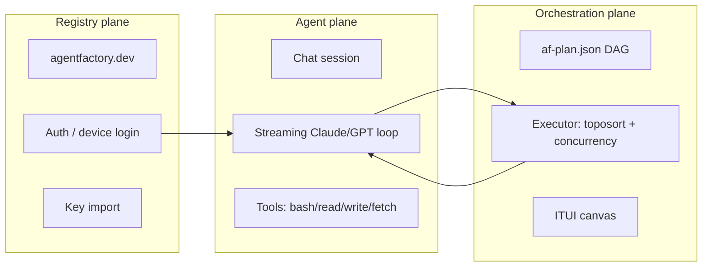
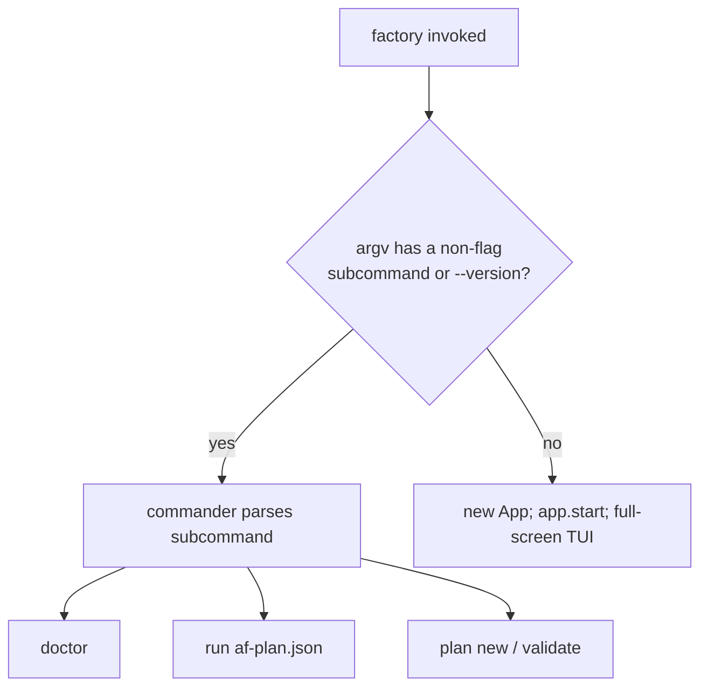

# 00 — Overview, Vision & Product Framing

<!-- version: 1.0.0 -->
<!-- classification: DESIGN -->
<!-- date: 2026-06-18 -->
<!-- last-updated: 2026-06-18 -->

## What `factory` is

`factory` (package `agentfactory-harness`) is a **full-screen terminal application** that acts
as an **interactive orchestration shell for AI agents**. Its core idea is the **ITUI** —
an *Interactive TUI* with a mouse-driven, drag-and-drop ASCII canvas for building and running
agent orchestration plans visually, alongside a live chat session, an embedded real terminal,
configuration, and logs — all inside one terminal screen.

It is built **without any TUI framework** (no Ink, blessed, or React). The entire UI is painted
by a custom **ANSI cell-buffer renderer** that diffs frames and emits minimal escape sequences.
This is a deliberate design choice: full control over rendering, zero framework overhead, and a
single self-contained binary.

## The three planes (conceptual model)

- **Agent plane** — a single streaming LLM conversation with tool use (the Session tab).
- **Orchestration plane** — a DAG of agent steps (`af-plan.json`) executed with dependency
  ordering and bounded concurrency, authored/visualized on the canvas.
- **Registry plane** — authentication and API-key management against `agentfactory.dev`.

## Run model

`factory` has two entry modes, branched in `src/index.ts`:

- **TUI mode** (`factory`): enters alt-screen, enables mouse + bracketed paste, renders the
  6-tab interface.
- **CLI mode** (`factory <cmd>`): `doctor` (env checks), `run` (execute a plan), `plan new`
  (wizard) / `plan validate`, `--version`.

## Target user & value

- **Who:** developers and power-users orchestrating AI agents from the terminal who want a
  keyboard/mouse hybrid, local-first tool with multi-provider support and a visual plan builder.
- **Value:** one screen to (1) chat with an agent that can run tools, (2) compose and run
  multi-step agent plans, (3) drop into a real shell, (4) manage 35 providers' keys, and
  (5) watch structured logs with AI insight — without leaving the terminal.

## Status snapshot (Waves 0–5)

| Wave | Capability | State |
|---|---|---|
| 0 | Scaffold: cell-buffer, ANSI, layout, doctor | ✅ |
| 1 | Session: streaming loop, tools, hooks, slash commands | ✅ |
| 2 | ITUI canvas: mouse, blocks, wires (drag/connect mechanics) | ✅ (authoring superficial — see 09) |
| 3 | Orchestration: DAG executor, planner, `run` | ✅ |
| 3.5 | Multi-LLM: Anthropic + OpenAI adapters | ✅ |
| 4 | Terminal: PTY embed + VTScreen | ✅ |
| 5 | Registry: auth, device login, key import; logs panel; multi-session | ✅ |
| 6+ | Multi-agent teams, visual studio | 📐 specced (PR #23), not implemented |

## Document scope

This DDD set documents the **implemented** app (Waves 0–5) as the design baseline. The
multi-agent/Wave-6 designs (PR #23, PLAN-10/13) appear only where they inform the gaps and the
feature-isolation path.

## Open Design Questions

1. Is the **ITUI canvas** central to the product identity (worth investing in operationalizing),
   or is the **chat session** the primary surface and the canvas secondary?
2. Should the product lean **keyboard-first** (vim-like, consistent bindings) or **mouse-first**
   (n8n-like direct manipulation) — currently it is an inconsistent hybrid?
3. Who is the **primary persona** — an individual developer, or a team operating shared agent
   fleets? (affects whether the Agents panel becomes a team dashboard.)
