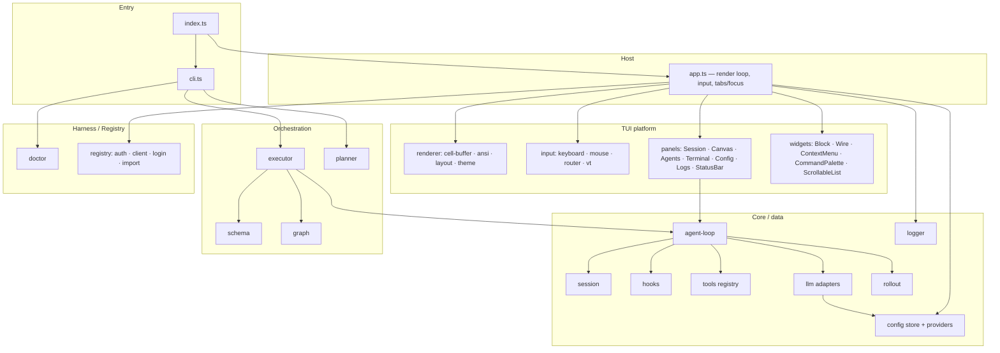

# 01 — Architecture, Module Map & Tech Stack

<!-- version: 1.0.0 -->
<!-- classification: DESIGN -->
<!-- date: 2026-06-18 -->
<!-- last-updated: 2026-06-18 -->

## Technology stack & specs

| Aspect | Value |
|---|---|
| Language | TypeScript 5.4, **strict** + `noUncheckedIndexedAccess`, `exactOptionalPropertyTypes`, `noImplicitReturns`, `noFallthroughCasesInSwitch` |
| Target / module | ES2022 · NodeNext · **ESM** (`"type":"module"`) |
| Runtime | Node ≥20 (enforced only in `doctor.ts`; no `engines` field) |
| Build | `tsup` (esbuild) — `tsup src/index.ts --format esm --dts --clean` |
| Test | `vitest` |
| Binary | `factory` → `dist/index.js` |
| UI framework | **none** — custom cell-buffer renderer |
| Runtime deps | `@anthropic-ai/sdk ^0.39.0` · `openai ^6.35.0` · `node-pty ^1.0.0` · `commander ^12.0.0` · `zod ^3.23.0` |
| Dev deps | `tsup ^8` · `tsx ^4` · `vitest ^1` · `typescript ^5.4` · `@types/node ^20` |

> ⚠️ **Version inconsistency:** `package.json` = `0.4.0`, `src/index.ts` `VERSION` = `0.3.0`
> (what `--version` prints), `StatusBar` shows `0.4.0`. Should be a single source.

## Layered architecture



## Module responsibilities

| Layer | Modules | Responsibility |
|---|---|---|
| **Entry** | `index.ts`, `cli.ts` | branch TUI vs CLI; define the command tree |
| **Host** | `app.ts` | own the render loop, route all input, manage tabs/focus, hit-test the status bar; construct + wire every panel |
| **Renderer** | `cell-buffer`, `ansi`, `layout`, `theme` | paint cells, diff frames, compute regions, hold the palette |
| **Input** | `keyboard`, `mouse`, `router`, `vt` | parse stdin into events, route to panels, emulate a PTY screen |
| **Panels** | 7 panel classes + StatusBar | the user-facing surfaces (one per tab) |
| **Widgets** | Block, Wire, ContextMenu, CommandPalette, ScrollableList | reusable UI pieces |
| **Core** | agent-loop, session, hooks, tools, llm, config, logger, rollout | the agent runtime + data services |
| **Orchestration** | schema, executor, graph, planner | the DAG plane |
| **Harness** | doctor | environment validation |
| **Registry** | auth, client, login, import-keys | agentfactory.dev integration |

## Key architectural characteristics

- **Host-centric wiring.** `app.ts` is the integration hub: it constructs panels with an
  `onUpdate = scheduleRender` callback, owns `activeTab`, and routes input. Panels are mostly
  self-contained views; cross-cutting wiring lives in the host. (This is also why `app.ts` is a
  ~1100-line god object — see 10/11.)
- **Registry patterns already exist.** Tools (`registerTool`), providers (`PROVIDERS`),
  palette commands, and hooks are all list/registry-shaped. This is the seam the
  feature-isolation proposal (11) builds on.
- **Provider-agnostic core.** History is always in Anthropic `MessageParam` format; each
  `LLMAdapter` converts to its own wire format. Adding a provider is mostly an adapter + a
  `PROVIDERS` entry.
- **Local-first persistence.** Config, logs, and session rollouts are all plain files under
  `~/.config/agentfactory/` (see MENTAL-MAP locations).

## CLI command tree

```
factory ─┬─ (no args)            → TUI App
         ├─ -v / --version       → prints index.ts VERSION
         ├─ doctor               → 7 env checks (Node, providers, token, .ai/, CLAUDE.md)
         ├─ run [plan-path]      → execute af-plan.json (events → stderr)
         └─ plan ─┬─ new         → interactive wizard → af-plan.json
                  └─ validate [plan-path] → schema + cycle check
```

## Open Design Questions

1. Should `app.ts` be decomposed into a host + feature modules now (see 11), or left until
   after the multi-agent work lands?
2. Is the **no-framework** custom renderer a permanent constraint, or is a future **web
   renderer** in scope (which would push toward declarative panels)?
3. Should provider/model selection move into a single **capabilities service** so panels,
   orchestration, and CLI share one source of truth?
