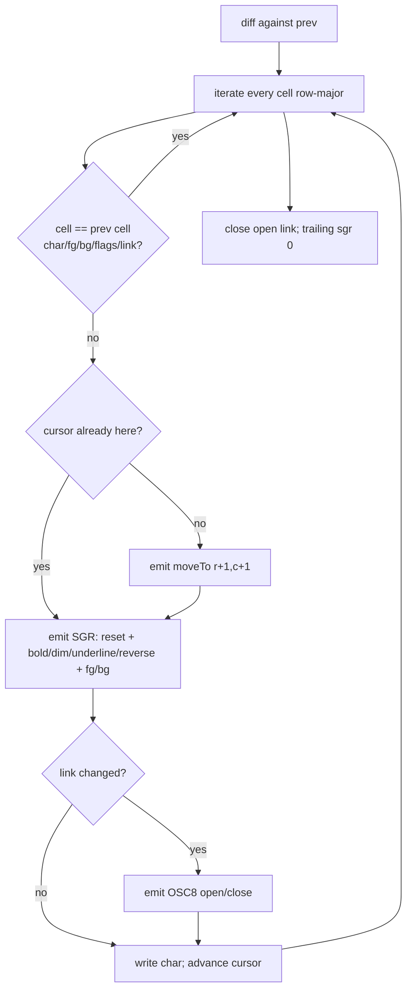

# 02 — Rendering Pipeline

<!-- version: 1.0.0 -->
<!-- classification: DESIGN -->
<!-- date: 2026-06-18 -->
<!-- last-updated: 2026-06-18 -->

The entire UI is painted by a custom cell-buffer renderer that diffs frames and emits minimal
ANSI. No framework. Files: `tui/renderer/{cell-buffer,ansi,layout,theme}.ts` + `app.ts` loop.

## The Cell & CellBuffer

```ts
type Color = number | readonly [number, number, number]   // 256-index, or [r,g,b]; -1 = default
interface Cell { char; fg: Color; bg: Color; bold; dim; underline; reverse; link? }   // link = OSC 8 URL
```

- `CellBuffer(rows, cols)` holds a `Cell[][]` grid initialized to `BLANK`.
- `write(row, col, text, style)` — writes chars L→R, clips out-of-bounds, replaces full style.
- `fill(row, col, h, w, char, style)` — block fill.
- `diff(prev)` — **the minimal-output engine** (see below).
- `flush()` — diff against an empty buffer = full repaint.
- `clone()` — deep copy (used to snapshot `prev` after each paint).

## The diff algorithm (why output is small)



Key efficiencies: unchanged cells are skipped entirely; `moveTo` is emitted only when the
cursor is not already at the target; SGR colors support 256 (`38;5;n`/`48;5;n`) and truecolor
(`38;2;r;g;b`); OSC 8 hyperlinks are opened/closed only on link transitions. If nothing
changed, `diff` returns `''` (no write).

## The render loop — event-driven, no fixed tick

```mermaid
sequenceDiagram
    participant U as User / panel state
    participant S as scheduleRender
    participant I as setImmediate
    participant R as render
    participant D as CellBuffer.diff
    participant T as stdout
    U->>S: state changed (onUpdate)
    S->>S: renderPending already set? return
    S->>I: queue (renderPending = true)
    I->>R: clear flag, call render
    R->>R: computeLayout; paint tab bar + active panels + status bar
    R->>D: diff(prev)
    D-->>R: minimal escape string
    R->>T: write(diff) if non-empty
    R->>R: prev = buf.clone()
```

- **`scheduleRender()`** coalesces many state changes in one tick into a single paint
  (`renderPending` + `setImmediate`). Panels are constructed with `() => scheduleRender()`.
- **`render()`** is also called **synchronously** for direct user actions in the input handler.
- There is **no animation/frame timer**. The only periodic timers are Logs feature timers
  (2-min analysis + 1-s countdown), which call `scheduleRender()`.
- On **resize**, dims recompute, `buf`/`prev` are rebuilt (empty `prev` forces a full repaint),
  panel rects update, the terminal VT resizes, then render.

## Layout regions (`computeLayout(rows, cols)`)

```
┌──────────────────────────── tab bar (row 0) ─────────────────────────────┐
│ Session  Orchestration  Agents  Terminal  Config  Logs           ✕ Quit  │
├───────────────────────────┬───────────────────────────────────────────────┤
│                           │  Orchestration canvas  (top 70% of right col)  │
│   Session (left 40%)      ├───────────────────────────────────────────────┤
│   floor(cols*0.4)         │  Agents (bottom 30% of right col)              │
│                           │                                                │
│   (Terminal / Config overlay the WHOLE right column; Logs overlays full)   │
├───────────────────────────┴───────────────────────────────────────────────┤
│ status bar (row rows-1)                                                     │
└────────────────────────────────────────────────────────────────────────────┘
```

- Session = left 40%; right column split 70/30 (canvas/agents); Terminal & Config replace the
  right column; Logs replaces the full main area (full width). `drawBorder` insets each panel.
- Splits are **fixed ratios** (no user-adjustable dividers) — see 09 responsiveness.

## Theme (palette + glyph sets) — `theme.ts`

| Role | 256-idx | Role | 256-idx |
|---|---|---|---|
| bg | 232 | textBright | 255 |
| bgPanel | 234 | accent | 75 |
| bgActive | 236 | success | 82 |
| border | 240 | warning | 214 |
| borderActive | 75 (blue) | error | 196 |
| text | 252 | info | 117 |
| textDim | 245 | | |

Glyph sets: `Box` single-line `┌┐└┘─│├┤┬┴┼`, `DBox` double-line `╔╗╚╝═║…`, `Wire`
`─│╭╮╰╯►▼●○`, `Status` `○ ⏳ ✓ ✗`. Single-line borders = panels; double-line = canvas nodes.

## ANSI capabilities (`ansi.ts`)

Alt screen (`?1049h/l`), cursor hide/show, **mouse** (`?1000h ?1003h ?1006h` = click + any-motion
hover + SGR coords), **bracketed paste** (`?2004h/l`), `moveTo`, SGR (4-bit/256/truecolor +
attrs), `clearLine`/`clearToEol`, **OSC 8 hyperlinks** (`osc8Open/Close`), **OSC 52 clipboard**
(`osc52Copy` base64). These define the renderer's terminal-capability surface.

## Open Design Questions

1. Add a **dirty-region/row-invalidation** hint on top of `diff` to skip re-painting unchanged
   panels entirely (perf for large terminals / fast streams)?
2. Should colors move to **semantic tokens** (e.g. `--focus`, `--danger`) over raw 256 indices,
   enabling theme swaps + a high-contrast mode (see 08/10)?
3. Are **truecolor** and **OSC 8/52** safe to rely on for the target terminals, or should there
   be capability detection + graceful fallback?
