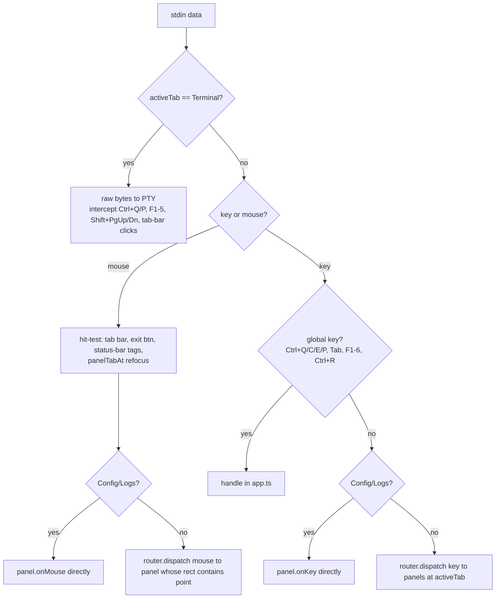

# 03 — Input, Events & Focus Model

<!-- version: 1.0.0 -->
<!-- classification: DESIGN -->
<!-- date: 2026-06-18 -->
<!-- last-updated: 2026-06-18 -->

Files: `tui/input/{keyboard,mouse,router}.ts`, `tui/input/vt.ts`, and the input handler in
`app.ts` (`listenInput`).

## Event types

```ts
// keyboard.ts
interface KeyEvent { key: string; raw: Buffer }    // key e.g. 'enter','escape','ctrl+r','a','arrow_up','f1'
// mouse.ts
interface MouseEvent {
  button: 'left'|'middle'|'right'|'scroll_up'|'scroll_down'|'motion'
  action: 'press'|'release'|'move'
  row; col          // 0-based
  shift; ctrl; alt
}
```

- **`parseKey(data)`** — rejects mouse byte sequences; maps a SPECIAL table (enter for
  `\r/\n/\r\n`, escape, backspace, tab, arrows, home/end, page_up/down, insert/delete, **F1–F5
  in both xterm `\x1bOP…` and VT100 `\x1b[11~…` forms**); `ctrl+a..z` for `0x01–0x1A`; single
  printable char ≥ space; else `null`.
- **`parseMouse(data)`** — legacy X10 scroll + **SGR** (`\x1b[<flags;col;rowM/m`). Decodes
  button (low 2 bits), motion bit, scroll bit, shift/alt/ctrl modifier bits. Converts 1-based →
  0-based coordinates. Hover (`motion`) is delivered as `button:'motion'`.

## The focus model — `activeTab` is the single source



**`InputRouter.dispatch(event, panels, focusedIdx)`:**
- **Key events → `panels[focusedIdx].onKey`** (focused panel only).
- **Mouse events → the first panel whose `rect` geometrically contains `(row,col)`** (hit-test,
  not focus) `.onMouse`.
- Returns the panel's boolean "consumed".

> **Gotcha:** only `[session, canvas, agents]` are passed to the router. **Config, Logs, and
> Terminal are dispatched explicitly** in `app.ts` (they're not in the router array). Any new
> panel must be wired in both places — a key reason 11 proposes a Feature registry.

## Global keybindings (handled in `app.ts`)

| Key | Action |
|---|---|
| `Ctrl+Q` | quit |
| `Ctrl+C` | copy selection (Session) else quit |
| `Ctrl+E` | toggle mouse capture (NORMAL ↔ SELECT for native terminal selection) |
| `Ctrl+P` | toggle Command Palette |
| `Tab` | cycle `activeTab` |
| `F1`–`F6` | jump to a fixed tab |
| `Ctrl+R` | run the loaded `af-plan.json` |
| Tab-bar click / ` ✕ Quit ` | switch tab / quit |
| Status-bar `[model]` / `[chat|tools]` click | open model picker / toggle chat mode |

## Terminal raw-byte bypass (`activeTab == Terminal`)

stdin bytes go **straight to the PTY** (`terminalPanel.write(data)`). Intercepted *before*
forwarding: `Ctrl+Q` (stop), `Ctrl+P` (palette), palette keys when open, F1–F5 (both xterm &
VT100 forms) for tab switching, `Shift+PgUp/PgDn` for scrollback, and SGR mouse only for
tab-bar clicks. Everything else (including Ctrl+C, arrows, etc.) reaches the shell.

## Bracketed paste

When `parseKey` returns `null`, the handler strips `\x1b[200~`/`\x1b[201~` and dispatches each
printable char of the paste — so multi-line pastes land in the focused input without triggering
per-char key logic.

## VTScreen (PTY emulator) — `vt.ts`

A virtual terminal that consumes raw PTY output and maintains a `rows×cols` `VTCell[][]` grid
for the Terminal panel: a small `normal/escape/csi/osc` parser handling CR/LF (scroll-region
aware), SGR (16/256/truecolor), cursor moves, erase, alt screen, cursor visibility, **wide-char
(CJK/emoji) width=2**, and a 1000-line **scrollback** ring with offset. `render(buf, inner)`
blits the virtual grid into the App's CellBuffer, clipped to the panel.

## Open Design Questions

1. The input pipeline is **split** (router for 3 panels, explicit dispatch for 3, raw bypass for
   Terminal). Unify into one dispatch path (Feature registry, 11)?
2. Keybindings are **hard-coded** across `app.ts` and panels. Introduce a **keymap layer**
   (declarative, remappable, discoverable) — and resolve the per-panel inconsistencies (09)?
3. `Ctrl+E` toggles between app mouse capture and native terminal selection. Is this discoverable
   enough, or should copy be a first-class, consistent affordance everywhere?
