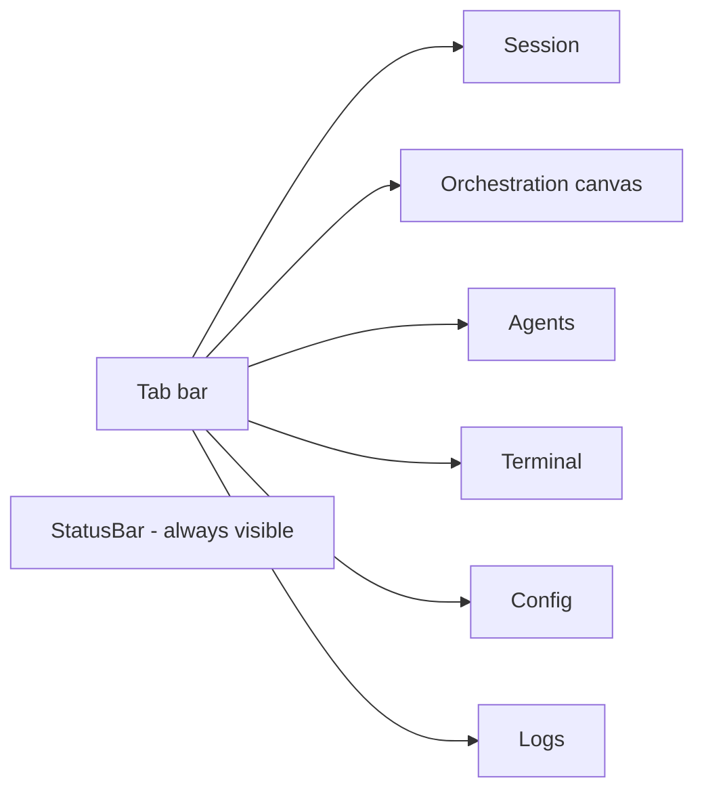

# 04 — Panels & Widgets

<!-- version: 1.0.0 -->
<!-- classification: DESIGN -->
<!-- date: 2026-06-18 -->
<!-- last-updated: 2026-06-18 -->

Every UI surface, its state, layout, and interactions. All panels extend `Panel` (abstract:
`rect`, `focused`, `render`, `onKey`, `onMouse`, computed `inner` = border-inset by 1).

## Panel ↔ tab map



---

## SessionPanel — chat (1160 lines, the largest surface)

The primary surface. **Multi-session**: `sessions: SessionRecord[]` + `activeIdx`; records named
after Nobel laureates. Each `SessionRecord` = `{name, session, lines, inputBuf, scrollOffset,
hScroll, streaming, selectedModel, chatMode, status, lastStats, rollout}`.

**Renders:** scrollable chat lines (role-colored: user=accent, system=dim, assistant=text) +
a multi-line input bar (prompt `> ` / `… ` while streaming, block cursor when focused). Markdown
table rows get a tinted background and `◂▸` edge markers; code/table lines keep horizontal scroll.
A scrollbar thumb appears when content overflows. Emoji are sanitized to ASCII (one UTF-16 unit
per cell).

**Overlays:** slash-command autocomplete (above input), **model picker** (provider → model, live
`listModels`), **new-session menu** (`ScrollableList`). All three are drawn last.

**Slash commands:** `/help /model /chat /resume /config /clear /tokens` (+ `/settings` alias,
`/model <id>`).

**Interactions:** Enter submits · arrows scroll/h-scroll · printable edits input · autocomplete
(arrows wrap, Tab completes) · model picker (arrows + enter) · **wheel scrolls by 3** (arrows by
1) · click-drag selects text → auto-copy via OSC 52 · scrollbar drag.

```mermaid
sequenceDiagram
    participant U as User
    participant SP as SessionPanel
    participant AL as agentLoop
    participant RO as rollout
    U->>SP: type + Enter
    SP->>SP: addMessage(user); rollout user line
    SP->>AL: for-await agentLoop(session, opts)
    AL-->>SP: text_delta → append to live line
    AL-->>SP: tool_start/result → system lines + rollout
    AL-->>SP: stats → lastStats + onStats(StatusBar/Agents)
    SP->>RO: append assistant/stats
    SP->>SP: scheduleRender per event
```

---

## OrchestrationCanvas — DAG canvas (463 lines)

ASCII drag-and-drop canvas. State: `{blocks: Block[], wires: CanvasWire[], drag}` (+ context
menu). Renders grid dots, wires (`routeWire` L-shaped), double-line block nodes (status badge +
title + ports), a wiring preview, and a context menu.

**Interactions:** drag a block by its **header** → grid-snap on release · click **output port** →
wiring mode → click **input port** → create wire · right-click → menu (Delete wire/block,
**"Add agent block"**) · Esc cancels wiring. `syncFromPlan(plan)` populates from `af-plan.json`
(one-way); `applyStepEvent` colors blocks during a run.

> ⚠️ **Authoring is superficial.** "Add agent block" creates a bare rectangle with no agent
> definition; there is no inspector and no serialization back to a plan. The blocks carry no
> agent data. See 09 and PLAN-13 for the operationalization plan.

---

## AgentsPanel — session list + stats (191 lines)

A **single-column session list** (not a team dashboard). State: `agents: AgentEntry[]`,
`selectedIdx`, `showStats`, `hoveredIdx`. Each `AgentEntry` = `{name, status (idle/running/done/
error), active, model, input/outputTokens, toolCalls, turns, start/endTime}`.

**Renders:** the list with status badges + a `★` active marker; clicking toggles a **stats
detail** (model, status, elapsed, tokens, tool calls/turns); hovering shows a **Nobel-laureate
quote tooltip** (sessions are laureate-named). **Wheel moves the selection by 1.**

> ⚠️ No messages feed, no shared-memory view, no logic ports, no `pending`/`skipped` states —
> it is session-oriented, not team-oriented. See 09 and PLAN-10.

---

## ConfigPanel — provider key manager (654 lines)

Manages **35 providers** across 5 categories (api/cli/ide/framework/local; many `aliasOf` an api
provider). State: `entries`, `rows`, `selectedIdx`, `scrollTop`, `mode (browse/edit/login/import)`,
edit buffers, `authUser`, login/import overlay state.

**Renders:** an auth header (`● @handle (plan)` or `○ Not logged in`; `[Login]/[Logout]`,
`[Import keys]`), category-grouped provider rows with **masked values** + `[set]`/`(not set)` +
a `[✕]` delete button, scroll indicators, and a hint bar. **Overlays:** edit modal (env-var label,
format hint, OSC-8 clickable token URL, masked input), device-login overlay (user code + verify
URL + countdown spinner), import overlay.

**Interactions:** arrows/PgUp-Dn navigate (skipping aliases) · Enter / **double-click** opens edit
· `Ctrl+R` deletes the selected key · **wheel moves the selection by 1** · `[✕]` click deletes ·
alias click jumps to canonical.

---

## LogsPanel — logs + metrics + AI insights (505 lines)

Two-column **40/60** split. State: `selectedSource` (filter), `scrollOffset`, `selectedIdx`
(-1 = metrics view), insights stream state, heartbeat countdown.

**Renders:** *Left* — filter chips (`[All]` + per-source) + an auto-scrolling log list
(time · level · message, level-colored). *Right* — either an **entry detail** (Time/Level/Source/
Message + Meta) or a **metrics view** (Total/Rate, By-Level bars, By-Source bars) + an **AI
Insights** section with a `⟳ Next analysis in Xm Ys` countdown and an `[⚡ Analyze]` button.

**Interactions (vim-style — unique to this panel):** `↑/k ↓/j` move selection · `←/h →/l` cycle
filter · `c` clear · `a` analyze · click chip/entry/Analyze · **wheel moves the offset by 1**.

---

## TerminalPanel — PTY embed (104 lines)

Bridges `node-pty` + `VTScreen`. Spawns `$SHELL`, feeds output into the VT, renders the virtual
grid, draws the cursor when focused/visible/not-scrolled. Graceful `[PTY unavailable]` /
`[terminal exited]` messages. `write(data)` forwards raw bytes; `scrollBack/Forward` delegate to
the VT. Input arrives via the **raw-byte bypass** (see 03).

---

## StatusBar — bottom bar (function, not a Panel)

`renderStatusBar(buf, rect, mode, error?, modelId?, chatMode?)` → `StatusBarLayout` with
clickable column ranges. Shows ` factory v0.4.0 [MODE] ` + `[modelId]` (clickable) +
` [chat]/[tools] ` (clickable) + right-aligned ` ^Q quit  ^E select/copy  Tab focus  ^R run `.
Mode = `running | NORMAL | SELECT`.

---

## Widgets

| Widget | Purpose | Notable |
|---|---|---|
| `CommandPalette` | Ctrl+P fuzzy command overlay | `fuzzyScore` (substring>subsequence); **clamp** nav (no wrap); esc + click-out close |
| `ContextMenu` | right-click popup | **no esc handling, no mouse handler** (host-dismissed) — inconsistent |
| `ScrollableList` | reusable list (Session menus) | header-skip selection, scroll hint, `selectAtViewportRow` |
| `Block` | canvas node (pure render) | double-line border, status badge, in/out ports |
| `Wire` | canvas wire (pure routing) | straight or L-shaped with arrowheads |

## Cross-panel interaction inconsistencies (summarized; full list in 09)

- **Scroll wheel:** Session = offset ×3 · Config = selection ×1 · Logs = offset ×1.
- **List nav:** Session autocomplete/new-session **wrap**; Palette/ContextMenu **clamp**.
- **Vim keys** only in Logs. **H-scroll** only in Session.
- **Modals** re-implemented per surface (Session pickers vs Config overlays) with hard-coded sizes.

## Open Design Questions

1. Should every panel share **one interaction grammar** (scroll, select, nav, copy) — and what is
   the canonical set?
2. Is the **Nobel-laureate naming + tooltip** a keeper (delightful) or noise to remove?
3. Should the **canvas** become an authoring tool now (PLAN-13) and the **Agents** panel a team
   dashboard (PLAN-10), or stay as-is for this design pass?
4. Consolidate the **3 modal implementations** into one `Overlay` widget (10)?
