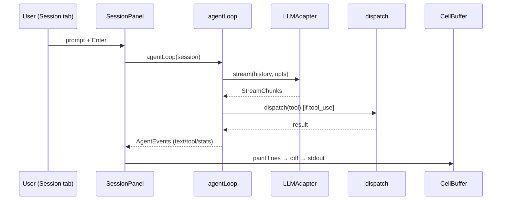

# 05 — Core / Data Layer

<!-- version: 1.0.0 -->
<!-- classification: DESIGN -->
<!-- date: 2026-06-18 -->
<!-- last-updated: 2026-06-18 -->

The agent runtime + data services behind the UI. Files: `core/{agent-loop, session, hooks}.ts`,
`core/tools/`, `core/llm/`, `core/config/`, `core/{logger, rollout}.ts`.

## The agent loop (`agent-loop.ts`)

```ts
interface AgentLoopOptions { maxTurns?; model?; signal?; systemPrompt?; adapter?; noTools? }
type AgentEvent =
  | { type:'text_delta'; delta }
  | { type:'tool_start'; name; id }
  | { type:'tool_result'; id; content }
  | { type:'turn_end'; stop_reason }
  | { type:'error'; error }
  | { type:'stats'; inputTokens; outputTokens; toolCalls; turns; model }
async function* agentLoop(session, opts): AsyncIterable<AgentEvent>
```

Defaults: `maxTurns = 20`, `DEFAULT_MAX_TOKENS = 2048`, system prompt
`"You are a helpful assistant in the factory ITUI agent shell."` Adapter falls back to
`createAdapter(defaultProvider())`; model to `adapter.defaultModel`; tools to `listTools()`
unless `noTools`.

```mermaid
sequenceDiagram
    participant L as agentLoop
    participant H as hooks
    participant AD as LLMAdapter
    participant T as dispatch (tool)
    loop until end_turn or no tools (maxTurns cap)
        L->>H: StepStart
        L->>AD: stream(history, {model, systemPrompt, tools, maxTokens, signal})
        AD-->>L: StreamChunk text_delta / tool_start / tool_input_delta / usage / message_end
        L->>L: build assistant message (text + tool_use blocks)
        loop each tool block
            L->>H: PreToolUse (can block)
            L->>T: dispatch(name, input)
            T-->>L: result string
            L->>H: PostToolUse
            L-->>L: yield tool_result; push tool_result block
        end
        L->>L: token stats (real usage, else len/4 estimate)
        L->>H: StepComplete
        L-->>L: yield turn_end + stats
    end
```

**Hooks fired:** `StepStart`, `PreToolUse`, `PostToolUse`, `StepComplete` (via `runHook` →
`.ai/hooks/<event>.sh`; `HookResult = {continue}` only — no return-data channel). `signal.aborted`
is checked at entry, in the stream loop, and before each stream.

## Session (`session.ts`)

```ts
class Session {
  addMessage(msg: MessageParam): void
  getHistory(): readonly MessageParam[]
  tokenCount(): number   // ceil(JSON.stringify(history).length / 4)
  clear(): void
}
```
History is stored in **Anthropic `MessageParam` format** — the canonical internal format every
adapter converts from.

## Tools (`core/tools/`)

```ts
interface Tool<I,O> { name; description; inputSchema: ZodSchema<I>; inputSchemaJson; run(input): Promise<O>; concurrent? }
registerTool(t) · getTool(name) · listTools() · dispatch(name, rawInput): Promise<string>
```

- `dispatch` Zod-`safeParse`s input (returns a model-friendly error string on failure), runs the
  tool, stringifies non-string output, catches throws → `Error: …`. **Never throws.**
- **Registered (interactive):** `Bash`, `Read`, `Write`, `WebFetch`.
- **`agent` tool is deliberately NOT registered** in the interactive loop (its Zod schema would
  reject the model's free-form input in the singleton registry).
- Tools today receive **only the parsed input** — no context object (relevant to multi-agent
  PR #23, which adds a `ToolUseContext`).

## LLM adapters (`core/llm/`)

```ts
type Provider = 'anthropic' | 'openai'
type StreamChunk = text_delta | tool_start | tool_input_delta | message_end | usage
interface LLMAdapter { provider; defaultModel; stream(messages, opts): AsyncIterable<StreamChunk> }
```

| Adapter | default model | maxTokens | notes |
|---|---|---|---|
| Anthropic | `claude-opus-4-7` | 8192 | maps SDK events; emits cumulative `usage` then `message_end` |
| OpenAI | `gpt-4o` | 4096 | converts Anthropic history → OpenAI msgs/tool_calls; reasoning models (`o\d`/`gpt-5`) use `max_completion_tokens` |

- `createAdapter(provider, apiKey?)` resolves a key via `store.getKey`.
- `defaultProvider()` — `LLM_PROVIDER` env → auto-detect by configured key → default `anthropic`.
- `listModels(provider)` — live API fetch (Anthropic `models.list`; OpenAI filtered to chat models).

## Config (`core/config/`)

- `ConfigStore` → `~/.config/agentfactory/config.json` shaped `{ keys, urls }`. `getKey(configKey,
  envVar?)` (file then env fallback); `setKey(configKey, value, fieldType)` (writes `urls` bucket
  for `url` type, else `keys`); `clearKey`. Singleton `store`.
- `PROVIDERS` — **35** `ProviderDef` across 5 categories; `{id, name, category, envVar?, configKey,
  hint, fieldType (apikey/token/url), aliasOf?, tokenUrl?}`. CLI/IDE/framework entries often
  `aliasOf` an api provider (e.g. Claude Code → anthropic).

## Logger & Rollout (`core/logger.ts`, `core/rollout.ts`)

- **Logger** — levels `DEBUG|INFO|WARN|ERROR` (min via `FACTORY_LOG_LEVEL`, default INFO); writes
  one JSON object per line to `~/.config/agentfactory/logs/factory-<date>.log`; keeps a 500-entry
  **ring buffer** (`getRecentLogs`); console echo only in dev. Feeds the Logs panel.
- **Rollout** — append-only JSONL session persistence at `~/.config/agentfactory/sessions/<date>/
  rollout-<ts>-<name>.jsonl`. `RolloutEvent = meta|user|assistant|system|tool|stats`. `create`
  writes a meta line + returns an append handle; `list` reads meta lines (newest first); `load`
  replays. SessionPanel appends per agent-loop event and **resumes by replay**.

## End-to-end: prompt → rendered output



## Open Design Questions

1. `DEFAULT_MAX_TOKENS = 2048` is low for agentic tool use — raise it, or make it model-aware?
2. Hooks are **shell-script only** with no return channel. Is that sufficient, or should there be
   in-process hooks that can inject context (needed by multi-agent PR #23)?
3. Should **token/usage accounting** be centralized (today it's per-loop) so all surfaces report
   consistent numbers across providers?
