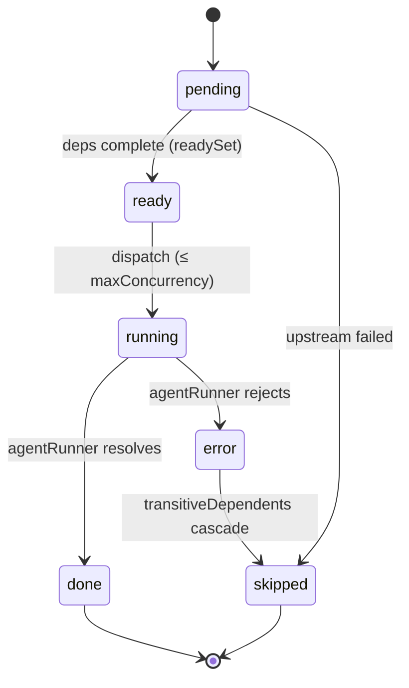
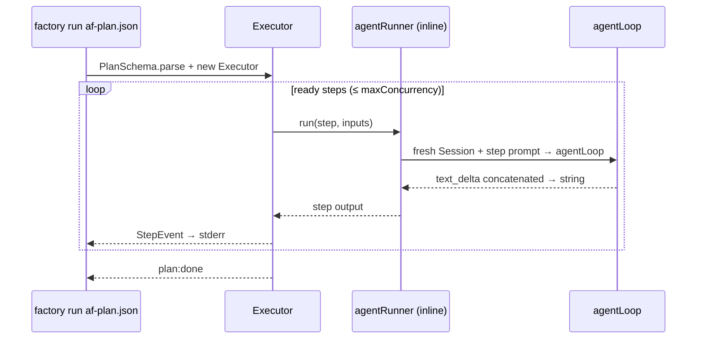

# 06 — Orchestration (DAG Plane)

<!-- version: 1.0.0 -->
<!-- classification: DESIGN -->
<!-- date: 2026-06-18 -->
<!-- last-updated: 2026-06-18 -->

The plan-and-run plane. Files: `orchestration/{schema, executor, graph, planner}.ts`. Authored
visually on the canvas (04) or via the wizard, persisted as `af-plan.json`, run via `factory run`
or `Ctrl+R`.

## Plan schema (`schema.ts`, Zod)

```ts
StepSchema = {
  id: string        // /^[a-z0-9_-]+$/
  agent: string     // non-empty
  prompt: string    // non-empty
  dependsOn: string[]   // default []
  timeout?: number      // positive int
  provider?: 'anthropic' | 'openai'
  model?: string
}
PlanSchema = { version: '1.0', name: string, steps: Step[] (≥1) }
  .superRefine → rejects duplicate step ids + dependsOn refs to unknown ids
```

## Graph utilities (`graph.ts`)

- `toposort(steps)` — Kahn's algorithm; **throws** `Plan contains cycles: …` (message built via
  `detectCycles`).
- `detectCycles(steps): string[][]` — DFS; returns each cycle as an ordered id list.
- `readySet(steps, completed): Set<string>` — pending steps whose every dependency is completed.

## Executor (`executor.ts`)

```ts
StepStatus = pending | running | done | error | skipped
StepEvent  = step:start | step:done | step:error | step:skipped | plan:done
AgentRunnerFn = (step, inputs) => Promise<string>
ExecutorOptions = { maxConcurrency? = 3, agentRunner }
```



- Constructor calls `toposort` (throws on cycle — fail fast).
- `run()` is an `AsyncGenerator<StepEvent>`: computes `readySet`, dispatches up to
  `maxConcurrency` concurrently via an in-flight promise pool, `Promise.race` to interleave.
- **Prompt interpolation:** `{{id}}` in a step prompt is replaced with that dependency's output;
  `sanitiseOutput` neutralizes `{{`/`}}` in outputs to prevent re-expansion.
- **Cascade skip:** on a failure, `transitiveDependents` computes everything downstream and emits
  `step:skipped` for each. Final `plan:done`.

## Planner (`planner.ts`)

`Planner.wizard(cwd)` — readline interactive wizard collecting plan name + steps (id/agent/prompt/
dependsOn), validates with `PlanSchema.parse`, prompts before overwrite, writes `af-plan.json`.

## How a plan runs (CLI path)



In the CLI, `agentRunner` picks `step.provider ?? defaultProvider()`, makes a fresh `Session`, and
collects only `text_delta` into the returned string. In the TUI, the same plan can be run from the
canvas (`Ctrl+R`), with `applyStepEvent` coloring canvas blocks live.

## Current limitations (detail in 09)

- The **canvas authoring** side cannot define agents or serialize back to `af-plan.json` — plans
  are hand-written or wizard-built, then visualized one-way.
- Single linear `agentRunner`; no per-step retry, no shared memory, no logic gates (these are the
  multi-agent PR #23 additions).

## Open Design Questions

1. Should plan authoring be **visual-first** (operationalize the canvas, PLAN-13) or remain
   file/wizard-first with the canvas as a viewer?
2. Is `af-plan.json` (single-agent steps) the right schema, or should it evolve toward the
   richer `af-team.json` (roles, providers, handoffs, logic ports) from PR #23?
3. Should `run` stream to **stdout as structured JSON** (machine-readable) in addition to the
   human stderr stream?
