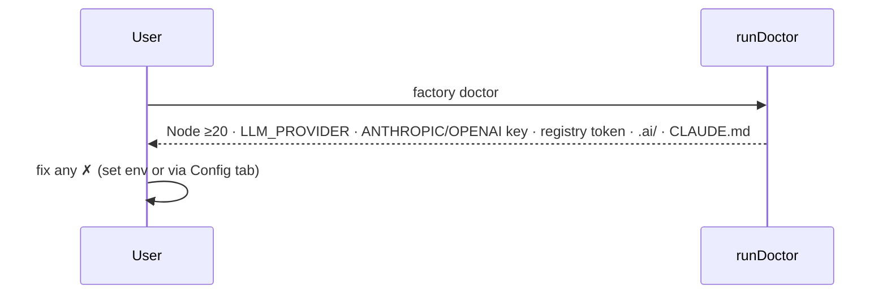
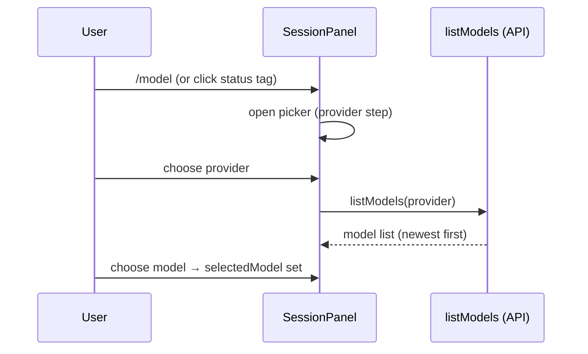
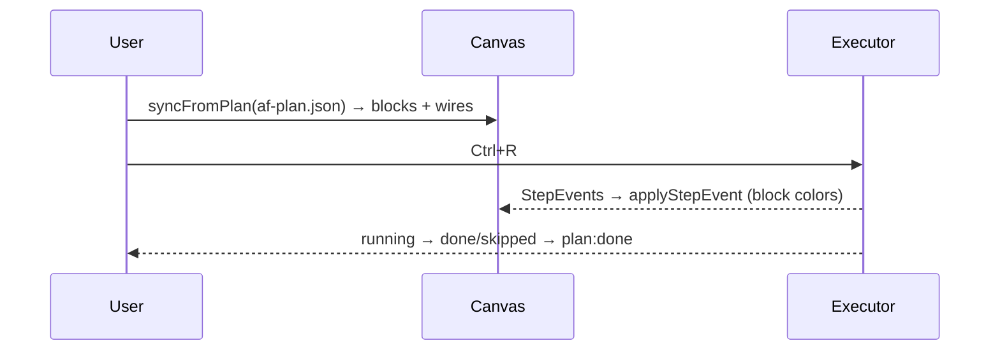
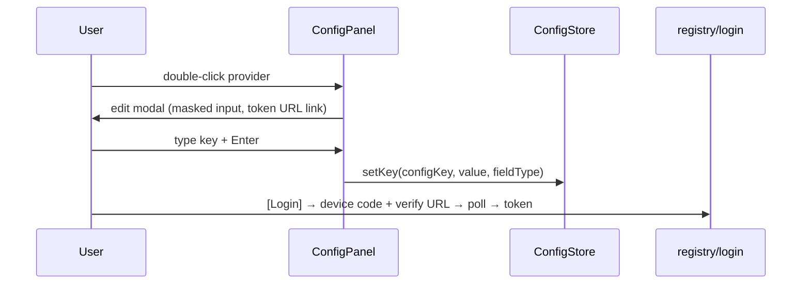

# 07 — User Journeys & Expected Behaviours

<!-- version: 1.0.0 -->
<!-- classification: DESIGN -->
<!-- date: 2026-06-18 -->
<!-- last-updated: 2026-06-18 -->

Nine core journeys. Each pairs the **user steps**, a **sequence/comm diagram**, and an
**expected-behaviours** list (the contract a redesign must preserve or consciously change).

---

## J1 — First run & doctor

**Steps:** `factory doctor` → review checks → set a key if missing → `factory`.



**Expected:** doctor exits 0/non-zero with a colored ✓/✗ table + `N/total passed`; never mutates
state; the TUI runs even with missing keys (chat fails gracefully at send time).

---

## J2 — Create a session & chat (the core loop)

**Steps:** launch → type in Session → Enter → watch streaming reply (tools may run).

```mermaid
sequenceDiagram
    participant U as User
    participant SP as SessionPanel
    participant AL as agentLoop
    U->>SP: prompt + Enter
    SP->>AL: agentLoop(session)
    AL-->>SP: text_delta (live), tool lines, stats
    SP-->>U: streaming assistant text; token/turn counts in StatusBar/Agents
```

**Expected:** input echoes immediately; prompt shows `… ` while streaming; assistant text grows
live; tool calls show `  tool: X` / `  → preview`; tokens update; the rollout file is written; the
session is auto-named (laureate).

---

## J3 — Switch model (provider → model picker)

**Steps:** `/model` or click `[model]` in the status bar → pick provider → pick model (live list).



**Expected:** picker opens centered; provider step first; model step fetches live (shows loading);
arrows navigate (scroll-follow), Enter selects, Esc backs out/closes; selection persists per
session and shows in the status bar.

---

## J4 — Author & run an orchestration plan

**Steps:** `factory plan new` (wizard) **or** edit `af-plan.json` → switch to Orchestration tab to
view the DAG → `Ctrl+R` to run (or `factory run`).



**Expected:** canvas reflects the plan (one block per step, wires per dependency); running colors
blocks (running/done/error); failures cascade-skip downstream; `plan:done` ends. ⚠️ Authoring on
the canvas does not yet persist back (see 09).

---

## J5 — Use the embedded terminal

**Steps:** F4 / Terminal tab → type shell commands → Shift+PgUp/Dn to scroll back → F1–F3 to leave.

**Expected:** raw keystrokes reach the real shell; output renders via VTScreen (colors, wide chars);
Ctrl+Q quits the app, Ctrl+P opens the palette, F-keys switch tabs — everything else goes to the
shell; graceful message if the PTY is unavailable/exited.

---

## J6 — Manage API keys (edit / device login / import)

**Steps:** F5 / Config → navigate providers → Enter/double-click to edit → save; or `[Login]`
(device flow); or `[Import keys]` from local tools.



**Expected:** values masked in the list; edit modal shows env-var + format hint + clickable token
URL; save persists to `config.json`; device login shows a user code + URL + countdown; import
detects keys from local tools; `[✕]` deletes a key.

---

## J7 — View logs & AI insights

**Steps:** F6 / Logs → filter by source → select an entry for detail → `[⚡ Analyze]` for insights.

**Expected:** live log list auto-scrolls; filter chips narrow by source; selecting an entry shows
its detail + meta; metrics view shows rate + by-level/by-source bars; Analyze streams an AI summary;
a 2-minute heartbeat auto-analyzes with a visible countdown; `c` clears, vim keys navigate.

---

## J8 — Resume a saved session

**Steps:** `/resume` → pick a prior rollout → it replays into a new session.

**Expected:** prior sessions listed newest-first (from rollout meta lines); selecting replays the
recorded events into a fresh, `*`-suffixed session; history and stats are reconstructed.

---

## J9 — Copy output (selection + clipboard)

**Steps:** click-drag over chat text (or `Ctrl+E` for native selection) → release → it's copied.

**Expected:** drag highlights text (reverse video); release auto-copies via **OSC 52**; `Ctrl+C`
copies the selection on Session (else quits); `Ctrl+E` toggles app-capture vs native terminal
selection (status mode NORMAL ↔ SELECT).

---

## Cross-journey expected-behaviour invariants

- **Esc** closes the topmost overlay (palette, picker, menu, modal) — *except* `ContextMenu`,
  which the host dismisses (inconsistency, 09).
- **Tab/F1–F6** always switch tabs regardless of panel (except inside the Terminal raw mode, where
  only F1–F5 are intercepted).
- **Streaming never blocks input** — you can scroll/select while a reply streams.
- **Every destructive action** (delete key, clear session, overwrite plan) is explicit (button,
  command, or confirm).

## Open Design Questions

1. Should there be a **guided first-run** (onboarding) flow, or is `doctor` + empty session enough?
2. Is **per-session model selection** the right granularity, or should there be a global default +
   per-message override?
3. Should **resume** surface in the new-session menu and the Agents panel (discoverability), not
   just `/resume`?
