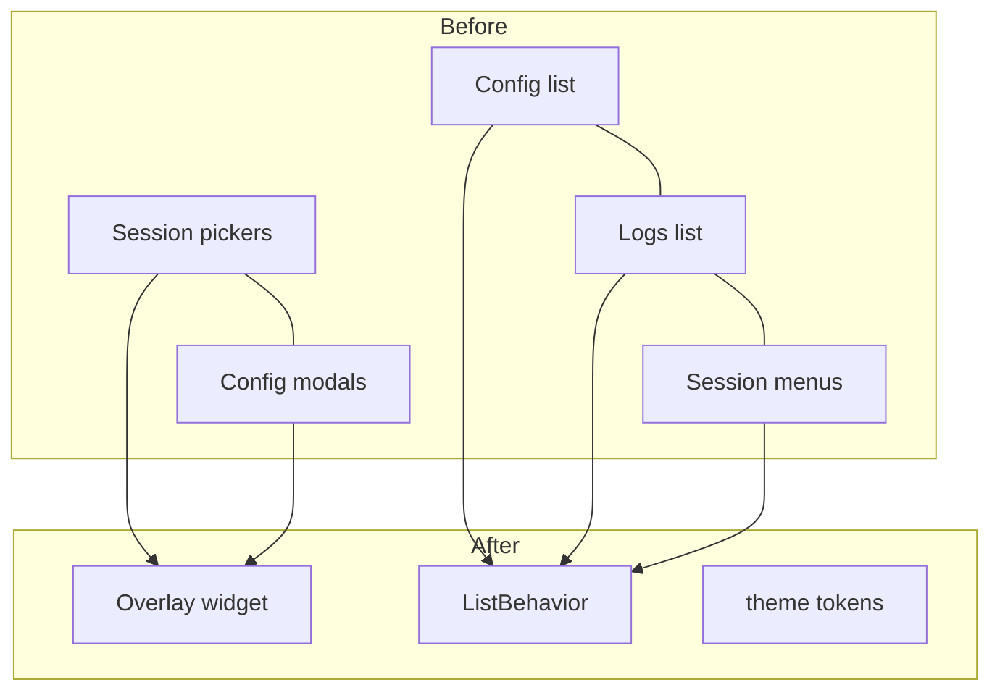
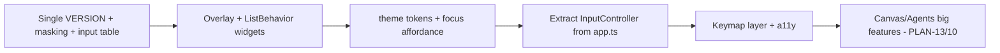

# 10 — Improvements, Optimizations & Simplification

<!-- version: 1.0.0 -->
<!-- classification: DESIGN -->
<!-- date: 2026-06-18 -->
<!-- last-updated: 2026-06-18 -->

Prescriptive. Three buckets: **simplify** (remove/consolidate), **optimize** (perf/UX), and
**improve** (new affordances). Each references the gap it addresses (09).

## A. What can be simplified (consolidate / remove)

| Simplification | Replaces | Addresses | Effort |
|---|---|---|---|
| **One `Overlay`/`Modal` widget** — size tiers, header, footer hints, standard Esc + click-outside dismiss | 3+ hand-rolled modals (Session pickers, Config edit/login/import) with hard-coded sizes | gaps 4, 8 | M |
| **One `ListBehavior`** — scroll, select, wrap policy, header-skip, wheel semantics | Per-panel list code in Config/Logs/Session-menus | gaps 1, 2, 12 | M |
| **One input-convention table** — wheel, nav-wrap, copy, Esc applied uniformly | Divergent per-panel handlers | gaps 1–4 | S (decision) |
| **Single `VERSION` source** — import from one constant | 3 copies (package.json/index.ts/StatusBar) | gap 11 | S |
| **Extract input + hit-testing out of `app.ts`** — an `InputController` + `HitTest` module | ~1100-line god object | gaps 9, 10 | M |
| **Centralize masking** — one `mask(value, fieldType)` | 2 implementations | gap 7 | S |
| **Semantic theme tokens** — `--focus/--primary/--danger/--surface…` over raw 256 | direct `Colors.*` everywhere | gaps 17, 18 | M |

## B. Optimize (performance / responsiveness)

| Optimization | Detail | Addresses |
|---|---|---|
| **Dirty-region hint** | track changed panel rects; skip re-painting untouched panels before `diff` | rendering perf (02) |
| **Motion-event throttling** | debounce/threshold 1003 hover repaints (partly done — only repaint if consumed) | input flood (03) |
| **`listModels` cache** | cache per provider+key with TTL; avoid re-fetch on every picker open | J3 latency |
| **Adjustable / responsive layout** | draggable dividers + breakpoints; min-size guard with a "too small" message | gaps 20–22 |
| **Stream coalescing** | batch rapid `text_delta` into fewer `scheduleRender` ticks (already coalesced; verify under fast streams) | streaming perf |

## C. Improve (new affordances)

| Improvement | Detail | Addresses |
|---|---|---|
| **Keymap layer** | declarative, remappable, discoverable bindings; a `?`/help overlay listing them | gaps 1–4, 3-doc |
| **Consistent focus affordance** | one focus indicator across panels + overlays | gap 18, 08 |
| **Accessibility pass** | glyph+text redundancy for status; high-contrast theme; reduced-motion toggle | gaps 17–19 |
| **Raise/auto-size `DEFAULT_MAX_TOKENS`** | model-aware default | gap 15 |
| **Canvas operationalization** | toolbox + inspector + typed connectors + serialize (PLAN-13) | gap 13 |
| **Agents → team dashboard** | messages feed + memory + ports + statuses (PLAN-10) | gap 14 |
| **Structured `run` output** | newline-delimited JSON events on stdout for automation | 06 |

## Suggested sequencing (low-risk first)

P0 = quick wins (hours). P1–P2 = the consolidation that removes most inconsistencies. P3 = the
god-object refactor (enables the Feature registry, 11). P5 = the large feature work.

## Open Design Questions

1. Which **consolidations** (A) are approved for this UI pass vs deferred?
2. Is the **god-object extraction** (P3) acceptable scope now, given it unblocks feature isolation
   (11)?
3. Priority order between **polish/consistency** (P0–P2) and **big features** (P5)?
4. Adopt **semantic theme tokens** as the foundation before any visual restyle?
