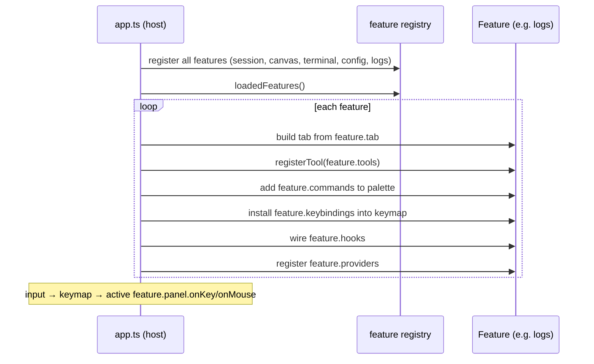
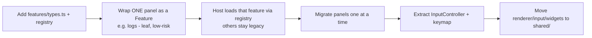

# 11 — Feature Isolation (Lightweight `Feature` Interface)

<!-- version: 1.0.0 -->
<!-- classification: DESIGN -->
<!-- date: 2026-06-18 -->
<!-- last-updated: 2026-06-18 -->

**Goal:** let each feature be worked on **separately** (own folder, own tests, own
branch/worktree) without touching the `app.ts` god object every time. **Approach (chosen):**
lightweight — formalize the registry patterns that *already exist* into one `Feature` contract.
**No package split.** Incremental, not a big-bang rewrite.

## Why this fits

The codebase is already registry-shaped:
- **Tools** → `registerTool` / `listTools`
- **Providers** → `PROVIDERS` array
- **Commands** → CommandPalette command list
- **Hooks** → `runHook(event)`

The only thing missing is a single unit that bundles a feature's **panel + tools + commands +
keybindings + hooks + providers** so the host loads it generically. That removes the multi-place
wiring problem (gaps 9, 10).

## The `Feature` contract

```typescript
// src/features/types.ts
export interface FeatureCtx {
  scheduleRender(): void
  store: ConfigStore
  // …services the host injects (logger, rollout, etc.)
}

export interface KeyBinding { key: string; when?: string; run(ctx: FeatureCtx): void }

export interface Feature {
  id: string
  tab?: { title: string; makePanel(ctx: FeatureCtx): Panel }   // optional UI surface (a tab)
  tools?: Tool[]                                                // → registerTool
  commands?: PaletteCommand[]                                   // → CommandPalette
  keybindings?: KeyBinding[]                                    // → global keymap
  hooks?: Partial<Record<HookEvent, HookHandler>>               // → hook runner
  providers?: ProviderDef[]                                     // → config providers
}

export function registerFeature(f: Feature): void
export function loadedFeatures(): Feature[]
```

The **App becomes a thin host**: iterate `loadedFeatures()` → build the tab bar from
`feature.tab`, route input through a single keymap + the panel's `onKey/onMouse`, and register
each feature's tools/commands/hooks/providers. (This directly enables the P3 input extraction
in 10.)

## Target folder layout

```
src/
  features/
    session/   index.ts · panel.ts · commands.ts
    canvas/    index.ts · panel.ts · tools.ts
    terminal/  index.ts · panel.ts
    config/    index.ts · panel.ts · providers.ts
    logs/      index.ts · panel.ts · commands.ts
    types.ts   (Feature, FeatureCtx, registry)
  shared/      renderer/ · input/ · theme/ · widgets/   (the platform — feature-agnostic)
  core/        agent-loop · session · llm · tools(registry) · config(store) · logger · rollout
  orchestration/  (DAG plane)
  app.ts       thin host: load features → tabs + input + registration
```

`src/shared/` = the reusable platform (renderer, input, theme, Overlay/List widgets from 10).
`src/core/` and `src/orchestration/` stay as services features consume.

## Host ↔ feature-registry flow



## Current → target migration map

| Current file | Target |
|---|---|
| `tui/panels/SessionPanel.ts` | `features/session/panel.ts` (+ `commands.ts` for slash cmds) |
| `tui/panels/OrchestrationCanvas.ts` + `widgets/{Block,Wire}.ts` | `features/canvas/` |
| `tui/panels/TerminalPanel.ts` + `input/vt.ts` | `features/terminal/` |
| `tui/panels/ConfigPanel.ts` + `core/config/providers.ts` | `features/config/` |
| `tui/panels/LogsPanel.ts` | `features/logs/` |
| `tui/renderer/*`, `tui/input/*`, `tui/widgets/{ContextMenu,CommandPalette,ScrollableList}` | `shared/` |
| `tui/panels/AgentsPanel.ts` | `features/agents/` (or fold into orchestration runtime) |
| input handling + hit-testing in `app.ts` | `shared/input/InputController.ts` + a keymap |

## Incremental path (no big-bang)



1. Introduce `features/types.ts` + the registry **alongside** existing wiring.
2. Convert **one leaf feature** (Logs) to a `Feature`; host loads it generically; everything else
   unchanged. Prove the contract.
3. Migrate the rest **one per PR/worktree** (the worktree-per-feature convention already in use).
4. Extract input/hit-testing from `app.ts` into `shared/`. The host shrinks to a loader.
5. Future multi-agent features (PR #23) drop in as `features/orchestration-*` with zero host edits.

## Benefits

- **Parallelizable:** each feature is a folder + a branch/worktree; merge conflicts shrink (no
  shared 1100-line `app.ts`).
- **Testable in isolation:** a feature's tools/commands/panel can be unit-tested without the host.
- **Extensible:** new tab/tool/command/provider = one `Feature`, registered in one place.
- **Future-proof:** if a **web renderer** is ever desired, features expose data + intent; only the
  panel renderer differs (see the open question below).

## Open Design Questions

1. **Panel shape:** keep class-based `Panel` (`render/onKey/onMouse`), or move toward a
   **declarative descriptor** the host renders (better for a future web renderer, more refactor)?
2. **Adopt now or after the UI fixes?** The registry can land incrementally (step 1–2) without
   blocking the current UI work — preferred?
3. **AgentsPanel placement:** its own feature, or part of an `orchestration` feature once the
   multi-agent runtime (PR #23) lands?
4. How much **shared `FeatureCtx`** surface to expose (which services)? Keep it minimal to avoid
   re-coupling.
