<!-- version: 1.0.0 -->
<!-- classification: SUMMARY -->
<!-- date: 2026-06-19 -->
<!-- last-updated: 2026-06-18 -->
<!-- status: ACTIVE -->
<!-- generated-by: scripts/docs-compile.sh -->

# DDD — Memorial (Descriptive Compendium)

> **Auto-generated** by `scripts/docs-compile.sh` — **do not edit by hand**.
> Edit the source docs in `ddd/` and re-run the script.
> Documents: **14** · ordered by creation date · each section links its source.

<a id="index"></a>
## Index

1. [00 — Overview, Vision & Product Framing](#d1) — `2026-06-18` — `factory` (package `agentfactory-harness`) is a **full-screen terminal application** that acts · [[00-overview]]
2. [01 — Architecture, Module Map & Tech Stack](#d2) — `2026-06-18` — graph TD · [[01-architecture]]
3. [02 — Rendering Pipeline](#d3) — `2026-06-18` — The entire UI is painted by a custom cell-buffer renderer that diffs frames and emits minimal · [[02-rendering]]
4. [03 — Input, Events & Focus Model](#d4) — `2026-06-18` — Files: `tui/input/{keyboard,mouse,router}.ts`, `tui/input/vt.ts`, and the input handler in · [[03-input-focus]]
5. [04 — Panels & Widgets](#d5) — `2026-06-18` — Every UI surface, its state, layout, and interactions. All panels extend `Panel` (abstract: · [[04-panels]]
6. [05 — Core / Data Layer](#d6) — `2026-06-18` — The agent runtime + data services behind the UI. Files: `core/{agent-loop, session, hooks}.ts`, · [[05-core-data]]
7. [06 — Orchestration (DAG Plane)](#d7) — `2026-06-18` — The plan-and-run plane. Files: `orchestration/{schema, executor, graph, planner}.ts`. Authored · [[06-orchestration]]
8. [07 — User Journeys & Expected Behaviours](#d8) — `2026-06-18` — Nine core journeys. Each pairs the **user steps**, a **sequence/comm diagram**, and an · [[07-user-journeys]]
9. [08 — Design Language & Visual System](#d9) — `2026-06-18` — The visual + interaction vocabulary, derived from `theme.ts`, the panels, and the renderer · [[08-design-language]]
10. [09 — Gaps, Inconsistencies & Issues](#d10) — `2026-06-18` — Verified issues, classified so a redesign doesn't "fix" intended quirks blindly. Severity: · [[09-gaps]]
11. [10 — Improvements, Optimizations & Simplification](#d11) — `2026-06-18` — Prescriptive. Three buckets: **simplify** (remove/consolidate), **optimize** (perf/UX), and · [[10-optimizations]]
12. [11 — Feature Isolation (Lightweight `Feature` Interface)](#d12) — `2026-06-18` — **Goal:** let each feature be worked on **separately** (own folder, own tests, own · [[11-feature-isolation]]
13. [DDD — Design-Driven Development Reference for `factory`](#d13) — `2026-06-18` — A complete design reference for the `factory` (agentfactory-harness) terminal app, written to · [[INDEX]]
14. [MENTAL MAP — `factory` (agentfactory-harness)](#d14) — `2026-06-18` — `factory` is a **full-screen TypeScript TUI** — an "ITUI" (Interactive TUI) orchestration shell · [[MENTAL-MAP]]

## Glossary

Term & acronym definitions: [GLOSSARY](../documentation/GLOSSARY.md) · [[GLOSSARY]]

---

<a id="d1"></a>

## 1 · 2026-06-18 · 00 — Overview, Vision & Product Framing

Source: [00-overview.md](00-overview.md) · [[00-overview]]  ·  [↑ Index](#index)


<!-- version: 1.0.0 -->
<!-- classification: DESIGN -->
<!-- date: 2026-06-18 -->
<!-- last-updated: 2026-06-18 -->

## What `factory` is

`factory` (package `agentfactory-harness`) is a **full-screen terminal application** that acts
as an **interactive orchestration shell for AI agents**. Its core idea is the **ITUI** —
an *Interactive TUI* with a mouse-driven, drag-and-drop ASCII canvas for building and running
agent orchestration plans visually, alongside a live chat session, an embedded real terminal,
configuration, and logs — all inside one terminal screen.

It is built **without any TUI framework** (no Ink, blessed, or React). The entire UI is painted
by a custom **ANSI cell-buffer renderer** that diffs frames and emits minimal escape sequences.
This is a deliberate design choice: full control over rendering, zero framework overhead, and a
single self-contained binary.

## The three planes (conceptual model)

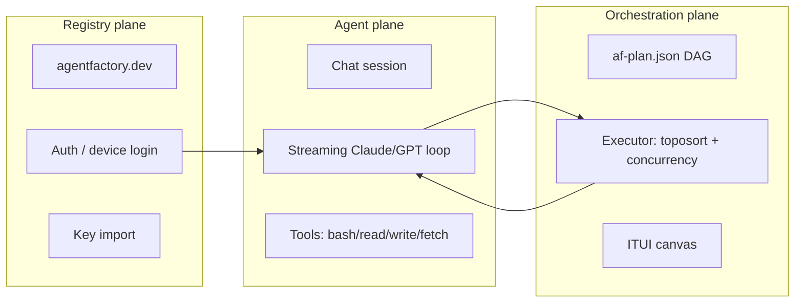

- **Agent plane** — a single streaming LLM conversation with tool use (the Session tab).
- **Orchestration plane** — a DAG of agent steps (`af-plan.json`) executed with dependency
  ordering and bounded concurrency, authored/visualized on the canvas.
- **Registry plane** — authentication and API-key management against `agentfactory.dev`.

## Run model

`factory` has two entry modes, branched in `src/index.ts`:

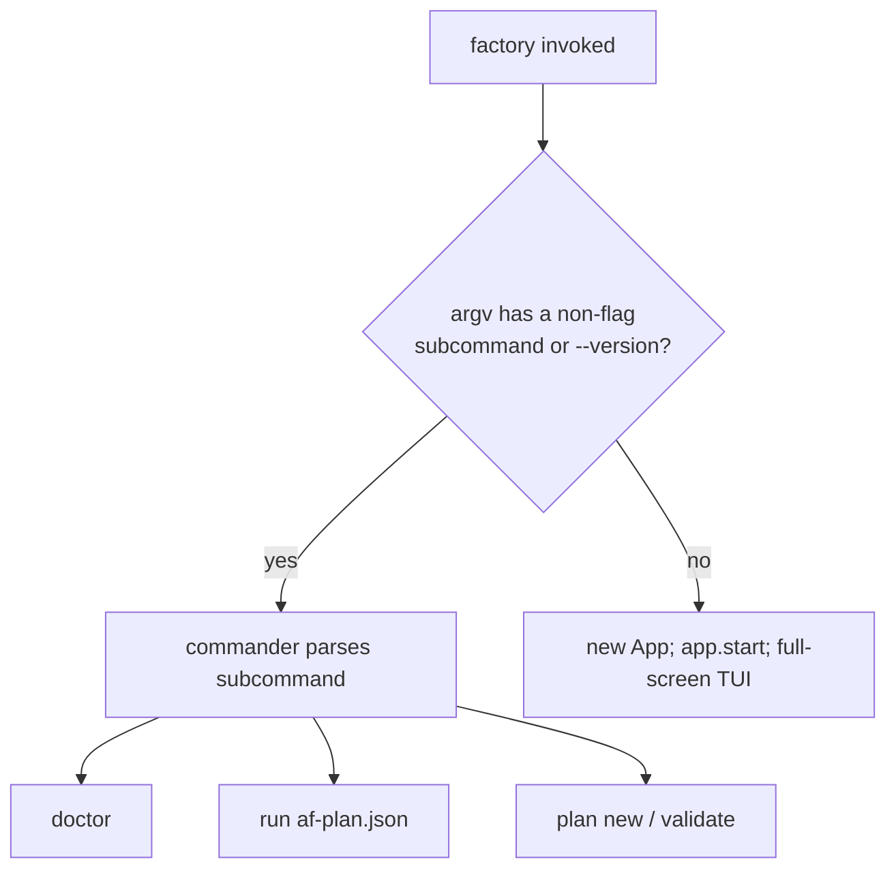

- **TUI mode** (`factory`): enters alt-screen, enables mouse + bracketed paste, renders the
  6-tab interface.
- **CLI mode** (`factory <cmd>`): `doctor` (env checks), `run` (execute a plan), `plan new`
  (wizard) / `plan validate`, `--version`.

## Target user & value

- **Who:** developers and power-users orchestrating AI agents from the terminal who want a
  keyboard/mouse hybrid, local-first tool with multi-provider support and a visual plan builder.
- **Value:** one screen to (1) chat with an agent that can run tools, (2) compose and run
  multi-step agent plans, (3) drop into a real shell, (4) manage 35 providers' keys, and
  (5) watch structured logs with AI insight — without leaving the terminal.

## Status snapshot (Waves 0–5)

| Wave | Capability | State |
|---|---|---|
| 0 | Scaffold: cell-buffer, ANSI, layout, doctor | ✅ |
| 1 | Session: streaming loop, tools, hooks, slash commands | ✅ |
| 2 | ITUI canvas: mouse, blocks, wires (drag/connect mechanics) | ✅ (authoring superficial — see 09) |
| 3 | Orchestration: DAG executor, planner, `run` | ✅ |
| 3.5 | Multi-LLM: Anthropic + OpenAI adapters | ✅ |
| 4 | Terminal: PTY embed + VTScreen | ✅ |
| 5 | Registry: auth, device login, key import; logs panel; multi-session | ✅ |
| 6+ | Multi-agent teams, visual studio | 📐 specced (PR #23), not implemented |

## Document scope

This DDD set documents the **implemented** app (Waves 0–5) as the design baseline. The
multi-agent/Wave-6 designs (PR #23, PLAN-10/13) appear only where they inform the gaps and the
feature-isolation path.

## Open Design Questions

1. Is the **ITUI canvas** central to the product identity (worth investing in operationalizing),
   or is the **chat session** the primary surface and the canvas secondary?
2. Should the product lean **keyboard-first** (vim-like, consistent bindings) or **mouse-first**
   (n8n-like direct manipulation) — currently it is an inconsistent hybrid?
3. Who is the **primary persona** — an individual developer, or a team operating shared agent
   fleets? (affects whether the Agents panel becomes a team dashboard.)

---

<a id="d2"></a>

## 2 · 2026-06-18 · 01 — Architecture, Module Map & Tech Stack

Source: [01-architecture.md](01-architecture.md) · [[01-architecture]]  ·  [↑ Index](#index)


<!-- version: 1.0.0 -->
<!-- classification: DESIGN -->
<!-- date: 2026-06-18 -->
<!-- last-updated: 2026-06-18 -->

## Technology stack & specs

| Aspect | Value |
|---|---|
| Language | TypeScript 5.4, **strict** + `noUncheckedIndexedAccess`, `exactOptionalPropertyTypes`, `noImplicitReturns`, `noFallthroughCasesInSwitch` |
| Target / module | ES2022 · NodeNext · **ESM** (`"type":"module"`) |
| Runtime | Node ≥20 (enforced only in `doctor.ts`; no `engines` field) |
| Build | `tsup` (esbuild) — `tsup src/index.ts --format esm --dts --clean` |
| Test | `vitest` |
| Binary | `factory` → `dist/index.js` |
| UI framework | **none** — custom cell-buffer renderer |
| Runtime deps | `@anthropic-ai/sdk ^0.39.0` · `openai ^6.35.0` · `node-pty ^1.0.0` · `commander ^12.0.0` · `zod ^3.23.0` |
| Dev deps | `tsup ^8` · `tsx ^4` · `vitest ^1` · `typescript ^5.4` · `@types/node ^20` |

> ⚠️ **Version inconsistency:** `package.json` = `0.4.0`, `src/index.ts` `VERSION` = `0.3.0`
> (what `--version` prints), `StatusBar` shows `0.4.0`. Should be a single source.

## Layered architecture

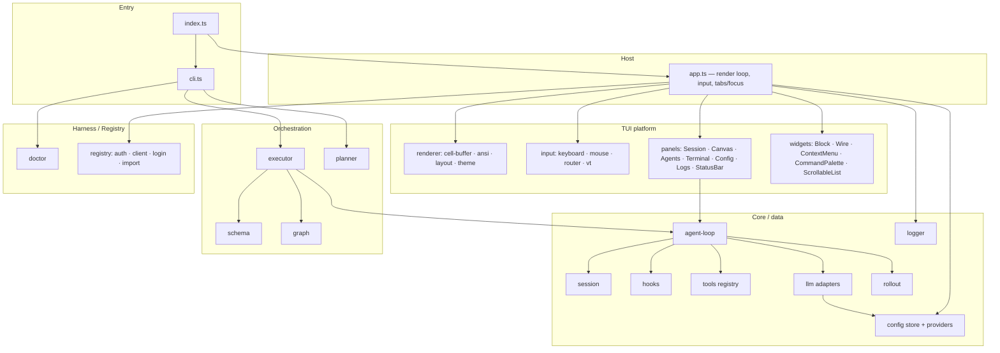

## Module responsibilities

| Layer | Modules | Responsibility |
|---|---|---|
| **Entry** | `index.ts`, `cli.ts` | branch TUI vs CLI; define the command tree |
| **Host** | `app.ts` | own the render loop, route all input, manage tabs/focus, hit-test the status bar; construct + wire every panel |
| **Renderer** | `cell-buffer`, `ansi`, `layout`, `theme` | paint cells, diff frames, compute regions, hold the palette |
| **Input** | `keyboard`, `mouse`, `router`, `vt` | parse stdin into events, route to panels, emulate a PTY screen |
| **Panels** | 7 panel classes + StatusBar | the user-facing surfaces (one per tab) |
| **Widgets** | Block, Wire, ContextMenu, CommandPalette, ScrollableList | reusable UI pieces |
| **Core** | agent-loop, session, hooks, tools, llm, config, logger, rollout | the agent runtime + data services |
| **Orchestration** | schema, executor, graph, planner | the DAG plane |
| **Harness** | doctor | environment validation |
| **Registry** | auth, client, login, import-keys | agentfactory.dev integration |

## Key architectural characteristics

- **Host-centric wiring.** `app.ts` is the integration hub: it constructs panels with an
  `onUpdate = scheduleRender` callback, owns `activeTab`, and routes input. Panels are mostly
  self-contained views; cross-cutting wiring lives in the host. (This is also why `app.ts` is a
  ~1100-line god object — see 10/11.)
- **Registry patterns already exist.** Tools (`registerTool`), providers (`PROVIDERS`),
  palette commands, and hooks are all list/registry-shaped. This is the seam the
  feature-isolation proposal (11) builds on.
- **Provider-agnostic core.** History is always in Anthropic `MessageParam` format; each
  `LLMAdapter` converts to its own wire format. Adding a provider is mostly an adapter + a
  `PROVIDERS` entry.
- **Local-first persistence.** Config, logs, and session rollouts are all plain files under
  `~/.config/agentfactory/` (see MENTAL-MAP locations).

## CLI command tree

```
factory ─┬─ (no args)            → TUI App
         ├─ -v / --version       → prints index.ts VERSION
         ├─ doctor               → 7 env checks (Node, providers, token, .ai/, CLAUDE.md)
         ├─ run [plan-path]      → execute af-plan.json (events → stderr)
         └─ plan ─┬─ new         → interactive wizard → af-plan.json
                  └─ validate [plan-path] → schema + cycle check
```

## Open Design Questions

1. Should `app.ts` be decomposed into a host + feature modules now (see 11), or left until
   after the multi-agent work lands?
2. Is the **no-framework** custom renderer a permanent constraint, or is a future **web
   renderer** in scope (which would push toward declarative panels)?
3. Should provider/model selection move into a single **capabilities service** so panels,
   orchestration, and CLI share one source of truth?

---

<a id="d3"></a>

## 3 · 2026-06-18 · 02 — Rendering Pipeline

Source: [02-rendering.md](02-rendering.md) · [[02-rendering]]  ·  [↑ Index](#index)


<!-- version: 1.0.0 -->
<!-- classification: DESIGN -->
<!-- date: 2026-06-18 -->
<!-- last-updated: 2026-06-18 -->

The entire UI is painted by a custom cell-buffer renderer that diffs frames and emits minimal
ANSI. No framework. Files: `tui/renderer/{cell-buffer,ansi,layout,theme}.ts` + `app.ts` loop.

## The Cell & CellBuffer

```ts
type Color = number | readonly [number, number, number]   // 256-index, or [r,g,b]; -1 = default
interface Cell { char; fg: Color; bg: Color; bold; dim; underline; reverse; link? }   // link = OSC 8 URL
```

- `CellBuffer(rows, cols)` holds a `Cell[][]` grid initialized to `BLANK`.
- `write(row, col, text, style)` — writes chars L→R, clips out-of-bounds, replaces full style.
- `fill(row, col, h, w, char, style)` — block fill.
- `diff(prev)` — **the minimal-output engine** (see below).
- `flush()` — diff against an empty buffer = full repaint.
- `clone()` — deep copy (used to snapshot `prev` after each paint).

## The diff algorithm (why output is small)

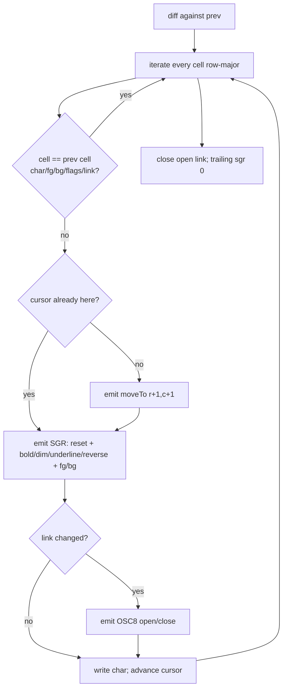

Key efficiencies: unchanged cells are skipped entirely; `moveTo` is emitted only when the
cursor is not already at the target; SGR colors support 256 (`38;5;n`/`48;5;n`) and truecolor
(`38;2;r;g;b`); OSC 8 hyperlinks are opened/closed only on link transitions. If nothing
changed, `diff` returns `''` (no write).

## The render loop — event-driven, no fixed tick

```mermaid
sequenceDiagram
    participant U as User / panel state
    participant S as scheduleRender
    participant I as setImmediate
    participant R as render
    participant D as CellBuffer.diff
    participant T as stdout
    U->>S: state changed (onUpdate)
    S->>S: renderPending already set? return
    S->>I: queue (renderPending = true)
    I->>R: clear flag, call render
    R->>R: computeLayout; paint tab bar + active panels + status bar
    R->>D: diff(prev)
    D-->>R: minimal escape string
    R->>T: write(diff) if non-empty
    R->>R: prev = buf.clone()
```

- **`scheduleRender()`** coalesces many state changes in one tick into a single paint
  (`renderPending` + `setImmediate`). Panels are constructed with `() => scheduleRender()`.
- **`render()`** is also called **synchronously** for direct user actions in the input handler.
- There is **no animation/frame timer**. The only periodic timers are Logs feature timers
  (2-min analysis + 1-s countdown), which call `scheduleRender()`.
- On **resize**, dims recompute, `buf`/`prev` are rebuilt (empty `prev` forces a full repaint),
  panel rects update, the terminal VT resizes, then render.

## Layout regions (`computeLayout(rows, cols)`)

```
┌──────────────────────────── tab bar (row 0) ─────────────────────────────┐
│ Session  Orchestration  Agents  Terminal  Config  Logs           ✕ Quit  │
├───────────────────────────┬───────────────────────────────────────────────┤
│                           │  Orchestration canvas  (top 70% of right col)  │
│   Session (left 40%)      ├───────────────────────────────────────────────┤
│   floor(cols*0.4)         │  Agents (bottom 30% of right col)              │
│                           │                                                │
│   (Terminal / Config overlay the WHOLE right column; Logs overlays full)   │
├───────────────────────────┴───────────────────────────────────────────────┤
│ status bar (row rows-1)                                                     │
└────────────────────────────────────────────────────────────────────────────┘
```

- Session = left 40%; right column split 70/30 (canvas/agents); Terminal & Config replace the
  right column; Logs replaces the full main area (full width). `drawBorder` insets each panel.
- Splits are **fixed ratios** (no user-adjustable dividers) — see 09 responsiveness.

## Theme (palette + glyph sets) — `theme.ts`

| Role | 256-idx | Role | 256-idx |
|---|---|---|---|
| bg | 232 | textBright | 255 |
| bgPanel | 234 | accent | 75 |
| bgActive | 236 | success | 82 |
| border | 240 | warning | 214 |
| borderActive | 75 (blue) | error | 196 |
| text | 252 | info | 117 |
| textDim | 245 | | |

Glyph sets: `Box` single-line `┌┐└┘─│├┤┬┴┼`, `DBox` double-line `╔╗╚╝═║…`, `Wire`
`─│╭╮╰╯►▼●○`, `Status` `○ ⏳ ✓ ✗`. Single-line borders = panels; double-line = canvas nodes.

## ANSI capabilities (`ansi.ts`)

Alt screen (`?1049h/l`), cursor hide/show, **mouse** (`?1000h ?1003h ?1006h` = click + any-motion
hover + SGR coords), **bracketed paste** (`?2004h/l`), `moveTo`, SGR (4-bit/256/truecolor +
attrs), `clearLine`/`clearToEol`, **OSC 8 hyperlinks** (`osc8Open/Close`), **OSC 52 clipboard**
(`osc52Copy` base64). These define the renderer's terminal-capability surface.

## Open Design Questions

1. Add a **dirty-region/row-invalidation** hint on top of `diff` to skip re-painting unchanged
   panels entirely (perf for large terminals / fast streams)?
2. Should colors move to **semantic tokens** (e.g. `--focus`, `--danger`) over raw 256 indices,
   enabling theme swaps + a high-contrast mode (see 08/10)?
3. Are **truecolor** and **OSC 8/52** safe to rely on for the target terminals, or should there
   be capability detection + graceful fallback?

---

<a id="d4"></a>

## 4 · 2026-06-18 · 03 — Input, Events & Focus Model

Source: [03-input-focus.md](03-input-focus.md) · [[03-input-focus]]  ·  [↑ Index](#index)


<!-- version: 1.0.0 -->
<!-- classification: DESIGN -->
<!-- date: 2026-06-18 -->
<!-- last-updated: 2026-06-18 -->

Files: `tui/input/{keyboard,mouse,router}.ts`, `tui/input/vt.ts`, and the input handler in
`app.ts` (`listenInput`).

## Event types

```ts
// keyboard.ts
interface KeyEvent { key: string; raw: Buffer }    // key e.g. 'enter','escape','ctrl+r','a','arrow_up','f1'
// mouse.ts
interface MouseEvent {
  button: 'left'|'middle'|'right'|'scroll_up'|'scroll_down'|'motion'
  action: 'press'|'release'|'move'
  row; col          // 0-based
  shift; ctrl; alt
}
```

- **`parseKey(data)`** — rejects mouse byte sequences; maps a SPECIAL table (enter for
  `\r/\n/\r\n`, escape, backspace, tab, arrows, home/end, page_up/down, insert/delete, **F1–F5
  in both xterm `\x1bOP…` and VT100 `\x1b[11~…` forms**); `ctrl+a..z` for `0x01–0x1A`; single
  printable char ≥ space; else `null`.
- **`parseMouse(data)`** — legacy X10 scroll + **SGR** (`\x1b[<flags;col;rowM/m`). Decodes
  button (low 2 bits), motion bit, scroll bit, shift/alt/ctrl modifier bits. Converts 1-based →
  0-based coordinates. Hover (`motion`) is delivered as `button:'motion'`.

## The focus model — `activeTab` is the single source

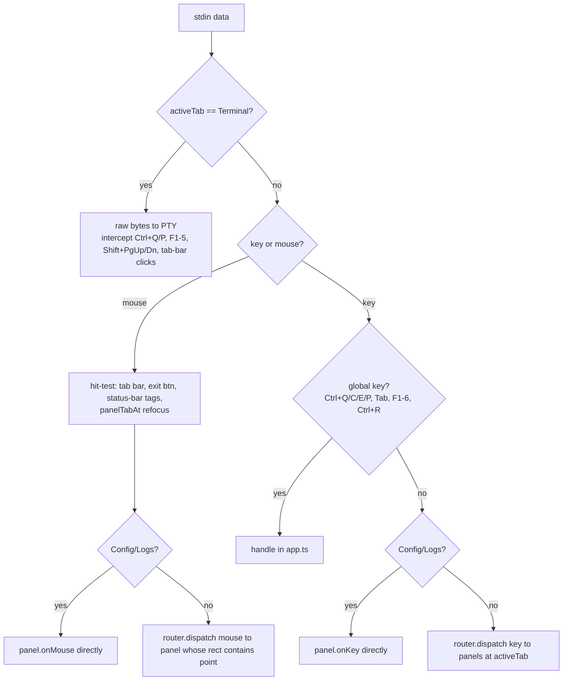

**`InputRouter.dispatch(event, panels, focusedIdx)`:**
- **Key events → `panels[focusedIdx].onKey`** (focused panel only).
- **Mouse events → the first panel whose `rect` geometrically contains `(row,col)`** (hit-test,
  not focus) `.onMouse`.
- Returns the panel's boolean "consumed".

> **Gotcha:** only `[session, canvas, agents]` are passed to the router. **Config, Logs, and
> Terminal are dispatched explicitly** in `app.ts` (they're not in the router array). Any new
> panel must be wired in both places — a key reason 11 proposes a Feature registry.

## Global keybindings (handled in `app.ts`)

| Key | Action |
|---|---|
| `Ctrl+Q` | quit |
| `Ctrl+C` | copy selection (Session) else quit |
| `Ctrl+E` | toggle mouse capture (NORMAL ↔ SELECT for native terminal selection) |
| `Ctrl+P` | toggle Command Palette |
| `Tab` | cycle `activeTab` |
| `F1`–`F6` | jump to a fixed tab |
| `Ctrl+R` | run the loaded `af-plan.json` |
| Tab-bar click / ` ✕ Quit ` | switch tab / quit |
| Status-bar `[model]` / `[chat|tools]` click | open model picker / toggle chat mode |

## Terminal raw-byte bypass (`activeTab == Terminal`)

stdin bytes go **straight to the PTY** (`terminalPanel.write(data)`). Intercepted *before*
forwarding: `Ctrl+Q` (stop), `Ctrl+P` (palette), palette keys when open, F1–F5 (both xterm &
VT100 forms) for tab switching, `Shift+PgUp/PgDn` for scrollback, and SGR mouse only for
tab-bar clicks. Everything else (including Ctrl+C, arrows, etc.) reaches the shell.

## Bracketed paste

When `parseKey` returns `null`, the handler strips `\x1b[200~`/`\x1b[201~` and dispatches each
printable char of the paste — so multi-line pastes land in the focused input without triggering
per-char key logic.

## VTScreen (PTY emulator) — `vt.ts`

A virtual terminal that consumes raw PTY output and maintains a `rows×cols` `VTCell[][]` grid
for the Terminal panel: a small `normal/escape/csi/osc` parser handling CR/LF (scroll-region
aware), SGR (16/256/truecolor), cursor moves, erase, alt screen, cursor visibility, **wide-char
(CJK/emoji) width=2**, and a 1000-line **scrollback** ring with offset. `render(buf, inner)`
blits the virtual grid into the App's CellBuffer, clipped to the panel.

## Open Design Questions

1. The input pipeline is **split** (router for 3 panels, explicit dispatch for 3, raw bypass for
   Terminal). Unify into one dispatch path (Feature registry, 11)?
2. Keybindings are **hard-coded** across `app.ts` and panels. Introduce a **keymap layer**
   (declarative, remappable, discoverable) — and resolve the per-panel inconsistencies (09)?
3. `Ctrl+E` toggles between app mouse capture and native terminal selection. Is this discoverable
   enough, or should copy be a first-class, consistent affordance everywhere?

---

<a id="d5"></a>

## 5 · 2026-06-18 · 04 — Panels & Widgets

Source: [04-panels.md](04-panels.md) · [[04-panels]]  ·  [↑ Index](#index)


<!-- version: 1.0.0 -->
<!-- classification: DESIGN -->
<!-- date: 2026-06-18 -->
<!-- last-updated: 2026-06-18 -->

Every UI surface, its state, layout, and interactions. All panels extend `Panel` (abstract:
`rect`, `focused`, `render`, `onKey`, `onMouse`, computed `inner` = border-inset by 1).

## Panel ↔ tab map

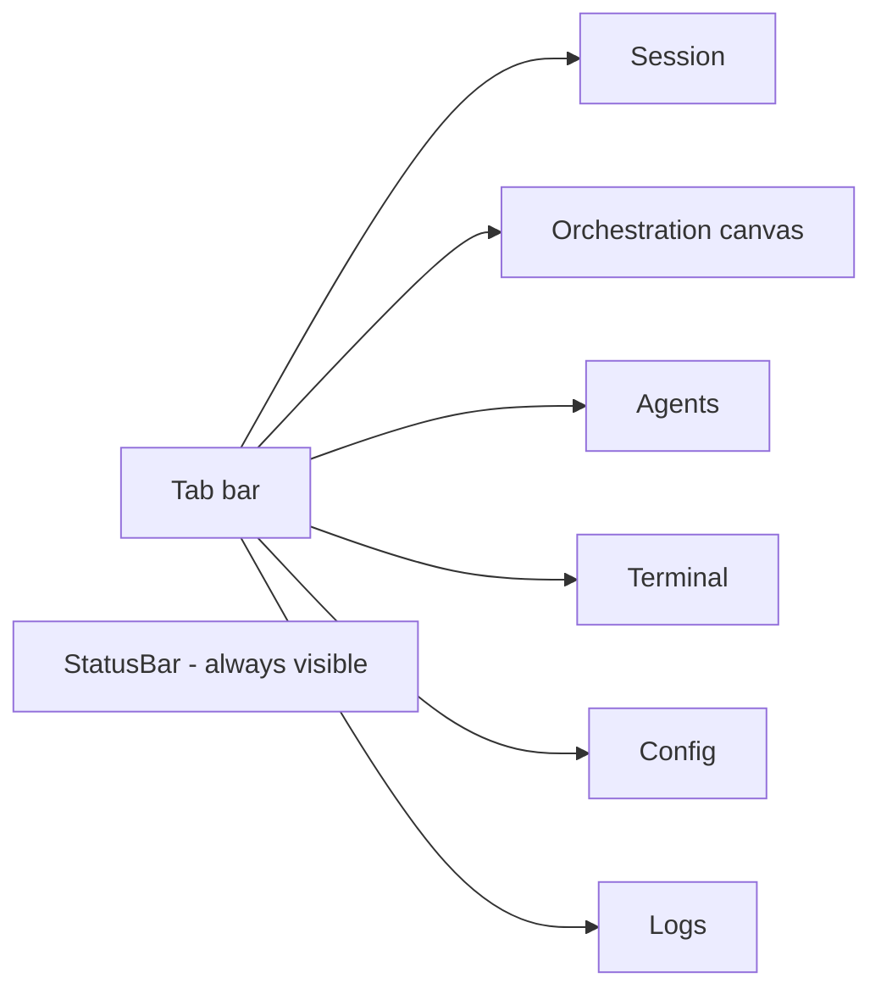

---

## SessionPanel — chat (1160 lines, the largest surface)

The primary surface. **Multi-session**: `sessions: SessionRecord[]` + `activeIdx`; records named
after Nobel laureates. Each `SessionRecord` = `{name, session, lines, inputBuf, scrollOffset,
hScroll, streaming, selectedModel, chatMode, status, lastStats, rollout}`.

**Renders:** scrollable chat lines (role-colored: user=accent, system=dim, assistant=text) +
a multi-line input bar (prompt `> ` / `… ` while streaming, block cursor when focused). Markdown
table rows get a tinted background and `◂▸` edge markers; code/table lines keep horizontal scroll.
A scrollbar thumb appears when content overflows. Emoji are sanitized to ASCII (one UTF-16 unit
per cell).

**Overlays:** slash-command autocomplete (above input), **model picker** (provider → model, live
`listModels`), **new-session menu** (`ScrollableList`). All three are drawn last.

**Slash commands:** `/help /model /chat /resume /config /clear /tokens` (+ `/settings` alias,
`/model <id>`).

**Interactions:** Enter submits · arrows scroll/h-scroll · printable edits input · autocomplete
(arrows wrap, Tab completes) · model picker (arrows + enter) · **wheel scrolls by 3** (arrows by
1) · click-drag selects text → auto-copy via OSC 52 · scrollbar drag.

```mermaid
sequenceDiagram
    participant U as User
    participant SP as SessionPanel
    participant AL as agentLoop
    participant RO as rollout
    U->>SP: type + Enter
    SP->>SP: addMessage(user); rollout user line
    SP->>AL: for-await agentLoop(session, opts)
    AL-->>SP: text_delta → append to live line
    AL-->>SP: tool_start/result → system lines + rollout
    AL-->>SP: stats → lastStats + onStats(StatusBar/Agents)
    SP->>RO: append assistant/stats
    SP->>SP: scheduleRender per event
```

---

## OrchestrationCanvas — DAG canvas (463 lines)

ASCII drag-and-drop canvas. State: `{blocks: Block[], wires: CanvasWire[], drag}` (+ context
menu). Renders grid dots, wires (`routeWire` L-shaped), double-line block nodes (status badge +
title + ports), a wiring preview, and a context menu.

**Interactions:** drag a block by its **header** → grid-snap on release · click **output port** →
wiring mode → click **input port** → create wire · right-click → menu (Delete wire/block,
**"Add agent block"**) · Esc cancels wiring. `syncFromPlan(plan)` populates from `af-plan.json`
(one-way); `applyStepEvent` colors blocks during a run.

> ⚠️ **Authoring is superficial.** "Add agent block" creates a bare rectangle with no agent
> definition; there is no inspector and no serialization back to a plan. The blocks carry no
> agent data. See 09 and PLAN-13 for the operationalization plan.

---

## AgentsPanel — session list + stats (191 lines)

A **single-column session list** (not a team dashboard). State: `agents: AgentEntry[]`,
`selectedIdx`, `showStats`, `hoveredIdx`. Each `AgentEntry` = `{name, status (idle/running/done/
error), active, model, input/outputTokens, toolCalls, turns, start/endTime}`.

**Renders:** the list with status badges + a `★` active marker; clicking toggles a **stats
detail** (model, status, elapsed, tokens, tool calls/turns); hovering shows a **Nobel-laureate
quote tooltip** (sessions are laureate-named). **Wheel moves the selection by 1.**

> ⚠️ No messages feed, no shared-memory view, no logic ports, no `pending`/`skipped` states —
> it is session-oriented, not team-oriented. See 09 and PLAN-10.

---

## ConfigPanel — provider key manager (654 lines)

Manages **35 providers** across 5 categories (api/cli/ide/framework/local; many `aliasOf` an api
provider). State: `entries`, `rows`, `selectedIdx`, `scrollTop`, `mode (browse/edit/login/import)`,
edit buffers, `authUser`, login/import overlay state.

**Renders:** an auth header (`● @handle (plan)` or `○ Not logged in`; `[Login]/[Logout]`,
`[Import keys]`), category-grouped provider rows with **masked values** + `[set]`/`(not set)` +
a `[✕]` delete button, scroll indicators, and a hint bar. **Overlays:** edit modal (env-var label,
format hint, OSC-8 clickable token URL, masked input), device-login overlay (user code + verify
URL + countdown spinner), import overlay.

**Interactions:** arrows/PgUp-Dn navigate (skipping aliases) · Enter / **double-click** opens edit
· `Ctrl+R` deletes the selected key · **wheel moves the selection by 1** · `[✕]` click deletes ·
alias click jumps to canonical.

---

## LogsPanel — logs + metrics + AI insights (505 lines)

Two-column **40/60** split. State: `selectedSource` (filter), `scrollOffset`, `selectedIdx`
(-1 = metrics view), insights stream state, heartbeat countdown.

**Renders:** *Left* — filter chips (`[All]` + per-source) + an auto-scrolling log list
(time · level · message, level-colored). *Right* — either an **entry detail** (Time/Level/Source/
Message + Meta) or a **metrics view** (Total/Rate, By-Level bars, By-Source bars) + an **AI
Insights** section with a `⟳ Next analysis in Xm Ys` countdown and an `[⚡ Analyze]` button.

**Interactions (vim-style — unique to this panel):** `↑/k ↓/j` move selection · `←/h →/l` cycle
filter · `c` clear · `a` analyze · click chip/entry/Analyze · **wheel moves the offset by 1**.

---

## TerminalPanel — PTY embed (104 lines)

Bridges `node-pty` + `VTScreen`. Spawns `$SHELL`, feeds output into the VT, renders the virtual
grid, draws the cursor when focused/visible/not-scrolled. Graceful `[PTY unavailable]` /
`[terminal exited]` messages. `write(data)` forwards raw bytes; `scrollBack/Forward` delegate to
the VT. Input arrives via the **raw-byte bypass** (see 03).

---

## StatusBar — bottom bar (function, not a Panel)

`renderStatusBar(buf, rect, mode, error?, modelId?, chatMode?)` → `StatusBarLayout` with
clickable column ranges. Shows ` factory v0.4.0 [MODE] ` + `[modelId]` (clickable) +
` [chat]/[tools] ` (clickable) + right-aligned ` ^Q quit  ^E select/copy  Tab focus  ^R run `.
Mode = `running | NORMAL | SELECT`.

---

## Widgets

| Widget | Purpose | Notable |
|---|---|---|
| `CommandPalette` | Ctrl+P fuzzy command overlay | `fuzzyScore` (substring>subsequence); **clamp** nav (no wrap); esc + click-out close |
| `ContextMenu` | right-click popup | **no esc handling, no mouse handler** (host-dismissed) — inconsistent |
| `ScrollableList` | reusable list (Session menus) | header-skip selection, scroll hint, `selectAtViewportRow` |
| `Block` | canvas node (pure render) | double-line border, status badge, in/out ports |
| `Wire` | canvas wire (pure routing) | straight or L-shaped with arrowheads |

## Cross-panel interaction inconsistencies (summarized; full list in 09)

- **Scroll wheel:** Session = offset ×3 · Config = selection ×1 · Logs = offset ×1.
- **List nav:** Session autocomplete/new-session **wrap**; Palette/ContextMenu **clamp**.
- **Vim keys** only in Logs. **H-scroll** only in Session.
- **Modals** re-implemented per surface (Session pickers vs Config overlays) with hard-coded sizes.

## Open Design Questions

1. Should every panel share **one interaction grammar** (scroll, select, nav, copy) — and what is
   the canonical set?
2. Is the **Nobel-laureate naming + tooltip** a keeper (delightful) or noise to remove?
3. Should the **canvas** become an authoring tool now (PLAN-13) and the **Agents** panel a team
   dashboard (PLAN-10), or stay as-is for this design pass?
4. Consolidate the **3 modal implementations** into one `Overlay` widget (10)?

---

<a id="d6"></a>

## 6 · 2026-06-18 · 05 — Core / Data Layer

Source: [05-core-data.md](05-core-data.md) · [[05-core-data]]  ·  [↑ Index](#index)


<!-- version: 1.0.0 -->
<!-- classification: DESIGN -->
<!-- date: 2026-06-18 -->
<!-- last-updated: 2026-06-18 -->

The agent runtime + data services behind the UI. Files: `core/{agent-loop, session, hooks}.ts`,
`core/tools/`, `core/llm/`, `core/config/`, `core/{logger, rollout}.ts`.

## The agent loop (`agent-loop.ts`)

```ts
interface AgentLoopOptions { maxTurns?; model?; signal?; systemPrompt?; adapter?; noTools? }
type AgentEvent =
  | { type:'text_delta'; delta }
  | { type:'tool_start'; name; id }
  | { type:'tool_result'; id; content }
  | { type:'turn_end'; stop_reason }
  | { type:'error'; error }
  | { type:'stats'; inputTokens; outputTokens; toolCalls; turns; model }
async function* agentLoop(session, opts): AsyncIterable<AgentEvent>
```

Defaults: `maxTurns = 20`, `DEFAULT_MAX_TOKENS = 2048`, system prompt
`"You are a helpful assistant in the factory ITUI agent shell."` Adapter falls back to
`createAdapter(defaultProvider())`; model to `adapter.defaultModel`; tools to `listTools()`
unless `noTools`.

```mermaid
sequenceDiagram
    participant L as agentLoop
    participant H as hooks
    participant AD as LLMAdapter
    participant T as dispatch (tool)
    loop until end_turn or no tools (maxTurns cap)
        L->>H: StepStart
        L->>AD: stream(history, {model, systemPrompt, tools, maxTokens, signal})
        AD-->>L: StreamChunk text_delta / tool_start / tool_input_delta / usage / message_end
        L->>L: build assistant message (text + tool_use blocks)
        loop each tool block
            L->>H: PreToolUse (can block)
            L->>T: dispatch(name, input)
            T-->>L: result string
            L->>H: PostToolUse
            L-->>L: yield tool_result; push tool_result block
        end
        L->>L: token stats (real usage, else len/4 estimate)
        L->>H: StepComplete
        L-->>L: yield turn_end + stats
    end
```

**Hooks fired:** `StepStart`, `PreToolUse`, `PostToolUse`, `StepComplete` (via `runHook` →
`.ai/hooks/<event>.sh`; `HookResult = {continue}` only — no return-data channel). `signal.aborted`
is checked at entry, in the stream loop, and before each stream.

## Session (`session.ts`)

```ts
class Session {
  addMessage(msg: MessageParam): void
  getHistory(): readonly MessageParam[]
  tokenCount(): number   // ceil(JSON.stringify(history).length / 4)
  clear(): void
}
```
History is stored in **Anthropic `MessageParam` format** — the canonical internal format every
adapter converts from.

## Tools (`core/tools/`)

```ts
interface Tool<I,O> { name; description; inputSchema: ZodSchema<I>; inputSchemaJson; run(input): Promise<O>; concurrent? }
registerTool(t) · getTool(name) · listTools() · dispatch(name, rawInput): Promise<string>
```

- `dispatch` Zod-`safeParse`s input (returns a model-friendly error string on failure), runs the
  tool, stringifies non-string output, catches throws → `Error: …`. **Never throws.**
- **Registered (interactive):** `Bash`, `Read`, `Write`, `WebFetch`.
- **`agent` tool is deliberately NOT registered** in the interactive loop (its Zod schema would
  reject the model's free-form input in the singleton registry).
- Tools today receive **only the parsed input** — no context object (relevant to multi-agent
  PR #23, which adds a `ToolUseContext`).

## LLM adapters (`core/llm/`)

```ts
type Provider = 'anthropic' | 'openai'
type StreamChunk = text_delta | tool_start | tool_input_delta | message_end | usage
interface LLMAdapter { provider; defaultModel; stream(messages, opts): AsyncIterable<StreamChunk> }
```

| Adapter | default model | maxTokens | notes |
|---|---|---|---|
| Anthropic | `claude-opus-4-7` | 8192 | maps SDK events; emits cumulative `usage` then `message_end` |
| OpenAI | `gpt-4o` | 4096 | converts Anthropic history → OpenAI msgs/tool_calls; reasoning models (`o\d`/`gpt-5`) use `max_completion_tokens` |

- `createAdapter(provider, apiKey?)` resolves a key via `store.getKey`.
- `defaultProvider()` — `LLM_PROVIDER` env → auto-detect by configured key → default `anthropic`.
- `listModels(provider)` — live API fetch (Anthropic `models.list`; OpenAI filtered to chat models).

## Config (`core/config/`)

- `ConfigStore` → `~/.config/agentfactory/config.json` shaped `{ keys, urls }`. `getKey(configKey,
  envVar?)` (file then env fallback); `setKey(configKey, value, fieldType)` (writes `urls` bucket
  for `url` type, else `keys`); `clearKey`. Singleton `store`.
- `PROVIDERS` — **35** `ProviderDef` across 5 categories; `{id, name, category, envVar?, configKey,
  hint, fieldType (apikey/token/url), aliasOf?, tokenUrl?}`. CLI/IDE/framework entries often
  `aliasOf` an api provider (e.g. Claude Code → anthropic).

## Logger & Rollout (`core/logger.ts`, `core/rollout.ts`)

- **Logger** — levels `DEBUG|INFO|WARN|ERROR` (min via `FACTORY_LOG_LEVEL`, default INFO); writes
  one JSON object per line to `~/.config/agentfactory/logs/factory-<date>.log`; keeps a 500-entry
  **ring buffer** (`getRecentLogs`); console echo only in dev. Feeds the Logs panel.
- **Rollout** — append-only JSONL session persistence at `~/.config/agentfactory/sessions/<date>/
  rollout-<ts>-<name>.jsonl`. `RolloutEvent = meta|user|assistant|system|tool|stats`. `create`
  writes a meta line + returns an append handle; `list` reads meta lines (newest first); `load`
  replays. SessionPanel appends per agent-loop event and **resumes by replay**.

## End-to-end: prompt → rendered output

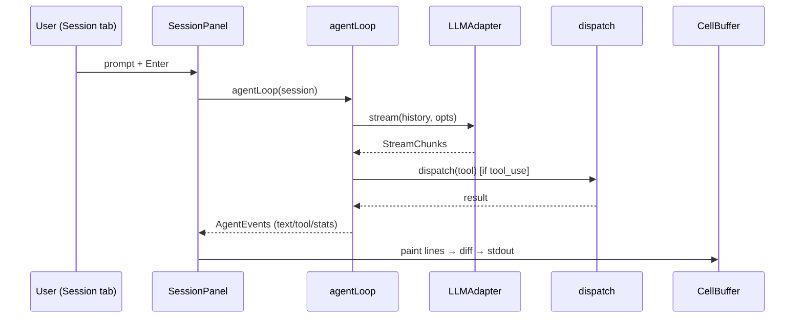

## Open Design Questions

1. `DEFAULT_MAX_TOKENS = 2048` is low for agentic tool use — raise it, or make it model-aware?
2. Hooks are **shell-script only** with no return channel. Is that sufficient, or should there be
   in-process hooks that can inject context (needed by multi-agent PR #23)?
3. Should **token/usage accounting** be centralized (today it's per-loop) so all surfaces report
   consistent numbers across providers?

---

<a id="d7"></a>

## 7 · 2026-06-18 · 06 — Orchestration (DAG Plane)

Source: [06-orchestration.md](06-orchestration.md) · [[06-orchestration]]  ·  [↑ Index](#index)


<!-- version: 1.0.0 -->
<!-- classification: DESIGN -->
<!-- date: 2026-06-18 -->
<!-- last-updated: 2026-06-18 -->

The plan-and-run plane. Files: `orchestration/{schema, executor, graph, planner}.ts`. Authored
visually on the canvas (04) or via the wizard, persisted as `af-plan.json`, run via `factory run`
or `Ctrl+R`.

## Plan schema (`schema.ts`, Zod)

```ts
StepSchema = {
  id: string        // /^[a-z0-9_-]+$/
  agent: string     // non-empty
  prompt: string    // non-empty
  dependsOn: string[]   // default []
  timeout?: number      // positive int
  provider?: 'anthropic' | 'openai'
  model?: string
}
PlanSchema = { version: '1.0', name: string, steps: Step[] (≥1) }
  .superRefine → rejects duplicate step ids + dependsOn refs to unknown ids
```

## Graph utilities (`graph.ts`)

- `toposort(steps)` — Kahn's algorithm; **throws** `Plan contains cycles: …` (message built via
  `detectCycles`).
- `detectCycles(steps): string[][]` — DFS; returns each cycle as an ordered id list.
- `readySet(steps, completed): Set<string>` — pending steps whose every dependency is completed.

## Executor (`executor.ts`)

```ts
StepStatus = pending | running | done | error | skipped
StepEvent  = step:start | step:done | step:error | step:skipped | plan:done
AgentRunnerFn = (step, inputs) => Promise<string>
ExecutorOptions = { maxConcurrency? = 3, agentRunner }
```

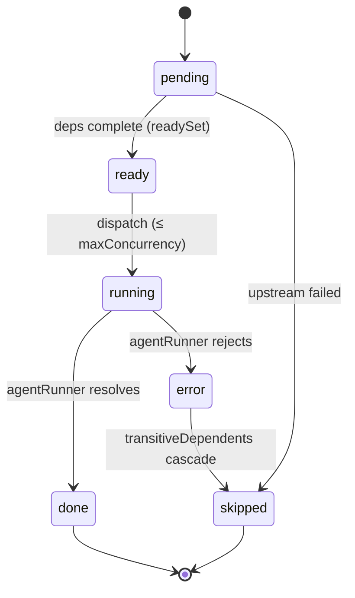

- Constructor calls `toposort` (throws on cycle — fail fast).
- `run()` is an `AsyncGenerator<StepEvent>`: computes `readySet`, dispatches up to
  `maxConcurrency` concurrently via an in-flight promise pool, `Promise.race` to interleave.
- **Prompt interpolation:** `{{id}}` in a step prompt is replaced with that dependency's output;
  `sanitiseOutput` neutralizes `{{`/`}}` in outputs to prevent re-expansion.
- **Cascade skip:** on a failure, `transitiveDependents` computes everything downstream and emits
  `step:skipped` for each. Final `plan:done`.

## Planner (`planner.ts`)

`Planner.wizard(cwd)` — readline interactive wizard collecting plan name + steps (id/agent/prompt/
dependsOn), validates with `PlanSchema.parse`, prompts before overwrite, writes `af-plan.json`.

## How a plan runs (CLI path)

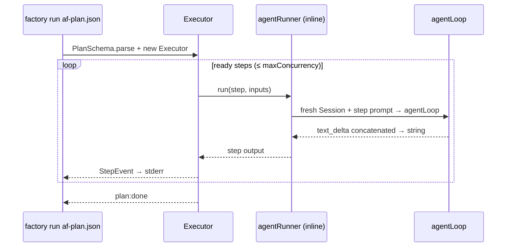

In the CLI, `agentRunner` picks `step.provider ?? defaultProvider()`, makes a fresh `Session`, and
collects only `text_delta` into the returned string. In the TUI, the same plan can be run from the
canvas (`Ctrl+R`), with `applyStepEvent` coloring canvas blocks live.

## Current limitations (detail in 09)

- The **canvas authoring** side cannot define agents or serialize back to `af-plan.json` — plans
  are hand-written or wizard-built, then visualized one-way.
- Single linear `agentRunner`; no per-step retry, no shared memory, no logic gates (these are the
  multi-agent PR #23 additions).

## Open Design Questions

1. Should plan authoring be **visual-first** (operationalize the canvas, PLAN-13) or remain
   file/wizard-first with the canvas as a viewer?
2. Is `af-plan.json` (single-agent steps) the right schema, or should it evolve toward the
   richer `af-team.json` (roles, providers, handoffs, logic ports) from PR #23?
3. Should `run` stream to **stdout as structured JSON** (machine-readable) in addition to the
   human stderr stream?

---

<a id="d8"></a>

## 8 · 2026-06-18 · 07 — User Journeys & Expected Behaviours

Source: [07-user-journeys.md](07-user-journeys.md) · [[07-user-journeys]]  ·  [↑ Index](#index)


<!-- version: 1.0.0 -->
<!-- classification: DESIGN -->
<!-- date: 2026-06-18 -->
<!-- last-updated: 2026-06-18 -->

Nine core journeys. Each pairs the **user steps**, a **sequence/comm diagram**, and an
**expected-behaviours** list (the contract a redesign must preserve or consciously change).

---

## J1 — First run & doctor

**Steps:** `factory doctor` → review checks → set a key if missing → `factory`.

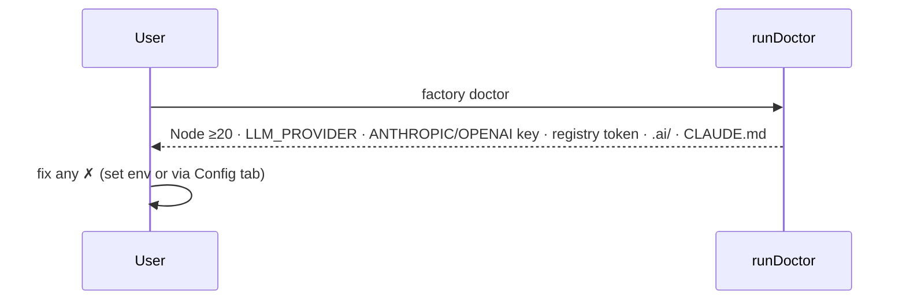

**Expected:** doctor exits 0/non-zero with a colored ✓/✗ table + `N/total passed`; never mutates
state; the TUI runs even with missing keys (chat fails gracefully at send time).

---

## J2 — Create a session & chat (the core loop)

**Steps:** launch → type in Session → Enter → watch streaming reply (tools may run).

```mermaid
sequenceDiagram
    participant U as User
    participant SP as SessionPanel
    participant AL as agentLoop
    U->>SP: prompt + Enter
    SP->>AL: agentLoop(session)
    AL-->>SP: text_delta (live), tool lines, stats
    SP-->>U: streaming assistant text; token/turn counts in StatusBar/Agents
```

**Expected:** input echoes immediately; prompt shows `… ` while streaming; assistant text grows
live; tool calls show `  tool: X` / `  → preview`; tokens update; the rollout file is written; the
session is auto-named (laureate).

---

## J3 — Switch model (provider → model picker)

**Steps:** `/model` or click `[model]` in the status bar → pick provider → pick model (live list).

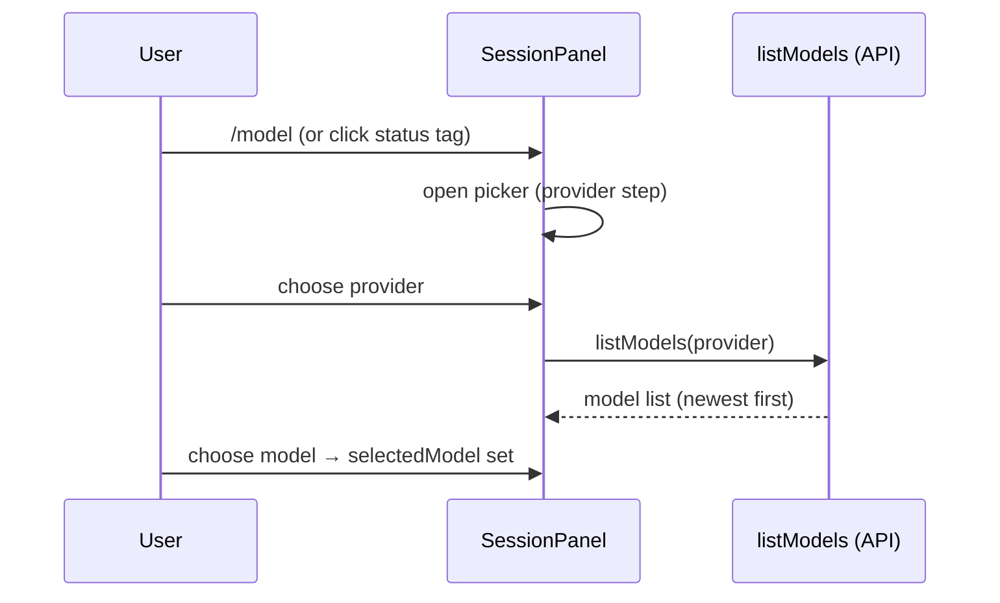

**Expected:** picker opens centered; provider step first; model step fetches live (shows loading);
arrows navigate (scroll-follow), Enter selects, Esc backs out/closes; selection persists per
session and shows in the status bar.

---

## J4 — Author & run an orchestration plan

**Steps:** `factory plan new` (wizard) **or** edit `af-plan.json` → switch to Orchestration tab to
view the DAG → `Ctrl+R` to run (or `factory run`).

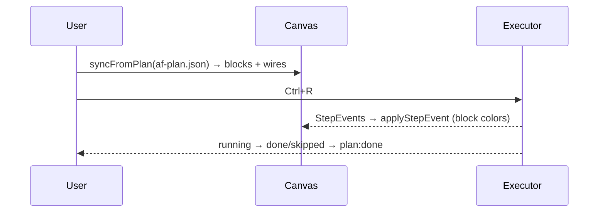

**Expected:** canvas reflects the plan (one block per step, wires per dependency); running colors
blocks (running/done/error); failures cascade-skip downstream; `plan:done` ends. ⚠️ Authoring on
the canvas does not yet persist back (see 09).

---

## J5 — Use the embedded terminal

**Steps:** F4 / Terminal tab → type shell commands → Shift+PgUp/Dn to scroll back → F1–F3 to leave.

**Expected:** raw keystrokes reach the real shell; output renders via VTScreen (colors, wide chars);
Ctrl+Q quits the app, Ctrl+P opens the palette, F-keys switch tabs — everything else goes to the
shell; graceful message if the PTY is unavailable/exited.

---

## J6 — Manage API keys (edit / device login / import)

**Steps:** F5 / Config → navigate providers → Enter/double-click to edit → save; or `[Login]`
(device flow); or `[Import keys]` from local tools.

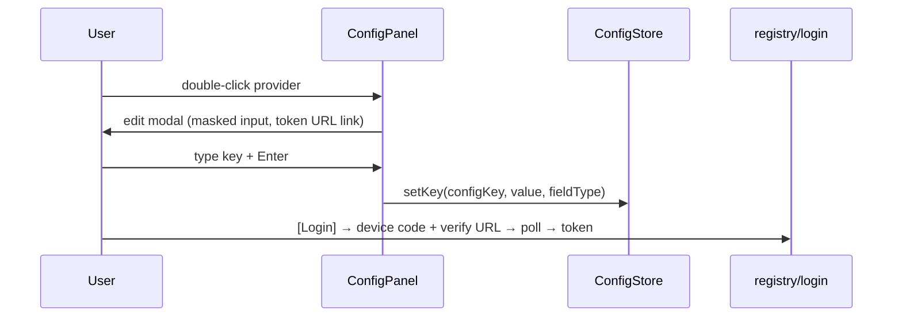

**Expected:** values masked in the list; edit modal shows env-var + format hint + clickable token
URL; save persists to `config.json`; device login shows a user code + URL + countdown; import
detects keys from local tools; `[✕]` deletes a key.

---

## J7 — View logs & AI insights

**Steps:** F6 / Logs → filter by source → select an entry for detail → `[⚡ Analyze]` for insights.

**Expected:** live log list auto-scrolls; filter chips narrow by source; selecting an entry shows
its detail + meta; metrics view shows rate + by-level/by-source bars; Analyze streams an AI summary;
a 2-minute heartbeat auto-analyzes with a visible countdown; `c` clears, vim keys navigate.

---

## J8 — Resume a saved session

**Steps:** `/resume` → pick a prior rollout → it replays into a new session.

**Expected:** prior sessions listed newest-first (from rollout meta lines); selecting replays the
recorded events into a fresh, `*`-suffixed session; history and stats are reconstructed.

---

## J9 — Copy output (selection + clipboard)

**Steps:** click-drag over chat text (or `Ctrl+E` for native selection) → release → it's copied.

**Expected:** drag highlights text (reverse video); release auto-copies via **OSC 52**; `Ctrl+C`
copies the selection on Session (else quits); `Ctrl+E` toggles app-capture vs native terminal
selection (status mode NORMAL ↔ SELECT).

---

## Cross-journey expected-behaviour invariants

- **Esc** closes the topmost overlay (palette, picker, menu, modal) — *except* `ContextMenu`,
  which the host dismisses (inconsistency, 09).
- **Tab/F1–F6** always switch tabs regardless of panel (except inside the Terminal raw mode, where
  only F1–F5 are intercepted).
- **Streaming never blocks input** — you can scroll/select while a reply streams.
- **Every destructive action** (delete key, clear session, overwrite plan) is explicit (button,
  command, or confirm).

## Open Design Questions

1. Should there be a **guided first-run** (onboarding) flow, or is `doctor` + empty session enough?
2. Is **per-session model selection** the right granularity, or should there be a global default +
   per-message override?
3. Should **resume** surface in the new-session menu and the Agents panel (discoverability), not
   just `/resume`?

---

<a id="d9"></a>

## 9 · 2026-06-18 · 08 — Design Language & Visual System

Source: [08-design-language.md](08-design-language.md) · [[08-design-language]]  ·  [↑ Index](#index)


<!-- version: 1.0.0 -->
<!-- classification: DESIGN -->
<!-- date: 2026-06-18 -->
<!-- last-updated: 2026-06-18 -->

The visual + interaction vocabulary, derived from `theme.ts`, the panels, and the renderer
constraints. This is the section to evolve first in a redesign.

## Color roles (current — raw 256 indices)

| Token | 256 | Used for |
|---|---|---|
| `bg` | 232 | app background |
| `bgPanel` | 234 | panel fill |
| `bgActive` | 236 | selected row / focused element fill |
| `border` | 240 | unfocused panel border |
| `borderActive` | 75 | **focused** panel border (focus affordance) |
| `text` | 252 | primary text / assistant |
| `textDim` | 245 | secondary text / system |
| `textBright` | 255 | titles / emphasis |
| `accent` | 75 | primary action / user text / selection bg |
| `success` | 82 | done / chat-mode toggle |
| `warning` | 214 | warnings / WARN logs / countdowns |
| `error` | 196 | errors / danger actions |
| `info` | 117 | informational / output ports |

> Note `accent` and `borderActive` are the **same** blue (75). There is no separate "focus" vs
> "primary" token — a candidate for the semantic-token refactor (10).

## Status iconography

| Glyph | Meaning | Where |
|---|---|---|
| `○` | idle | blocks, agents, status |
| `●` | running / active | blocks, agents |
| `⏳` | running (Status set) | theme `Status` |
| `✓` | done | blocks, agents |
| `✗` | error | blocks, agents |
| `★` | active session | Agents list |
| `►` / `◄` `▼` | wire arrowheads / direction | canvas |
| `●` / `○` | input / output ports | canvas (accent / info) |
| `◂` / `▸` | horizontal-scroll edge markers | Session tables |
| `▲` / `▼` | more-content indicators | Config/lists |

**Accessibility note:** status is conveyed by **color + glyph** in most places, but several states
rely on color alone (log levels, focus). A redesign should ensure shape/text redundancy.

## Structure & borders

- **Single-line box** (`Box`) = a **panel** region.
- **Double-line box** (`DBox`) = a **canvas node** (agent block) — visually distinguishes
  "structural panel" from "content node."
- **Focus affordance** = border switches `border → borderActive` (240 → 75) + bold title. This is
  the *only* focus cue; there is no focus ring, underline, or background change standard across
  panels.

## Overlays & modals

Centered bordered boxes drawn last (on top). Current overlays: Command Palette, Session model
picker, Session new-session menu, Config edit/login/import modals. **Each is hand-implemented**
(border + centering + click-outside-to-close) with **hard-coded dimensions** (widths 46/56/58/64,
heights 10/11/8). Dismiss: Esc and/or click-outside — *inconsistently* (ContextMenu has neither).
→ Consolidation candidate (10).

## Cell & glyph constraints (the hard rules)

- **One UTF-16 code unit per cell.** Multi-codepoint glyphs (emoji with ZWJ/variation selectors)
  break alignment. SessionPanel **sanitizes emoji → ASCII** (`EMOJI_ASCII` map) before display.
- **Wide characters** (CJK/emoji, width 2) are only handled inside `VTScreen` (the terminal panel),
  not in the general renderer — avoid them elsewhere.
- **Truecolor** is supported (`[r,g,b]`) but the palette is 256-index by default.
- **OSC 8 hyperlinks** are supported per-cell (e.g. clickable token URLs in Config).
- **OSC 52** is used for clipboard copy (selection → clipboard without a system call).

## Typography & emphasis

The only "type styles" available are cell attributes: **bold**, **dim**, **underline**, **reverse**.
Current usage: bold = titles/selection/active; dim = secondary/disabled; reverse = text selection
highlight. There is no documented scale or rules for when to use which — emphasis is ad hoc.

## Density & layout language

- Fixed ratio splits (40% session, 70/30 right column). No adjustable dividers, no breakpoints.
- Lists use a `► ` selection prefix + `bgActive` fill; headers in accent/bold.
- Hint bars (bottom of Config/Logs/Session) document keys inline — but the wording/format differs
  per panel.

## Open Design Questions

1. **Semantic tokens:** introduce roles (`--focus`, `--primary`, `--danger`, `--muted`, `--surface`,
   `--surface-raised`) mapping to palette values, enabling theme swaps + high-contrast? (Today
   `accent` == `borderActive`, conflating primary and focus.)
2. **Focus affordance:** is the border-color swap enough, or adopt a consistent focus indicator
   (ring/underline/badge) across all panels and overlays?
3. **Iconography redundancy:** standardize a status vocabulary that always pairs glyph + color
   (and optional text) for accessibility?
4. **Typography scale:** define explicit rules for bold/dim/underline/reverse (an emphasis ladder)?
5. **Modal system:** one canonical overlay (size tiers, header, footer hints, dismiss rules)?
6. **Density modes:** a compact vs comfortable mode for small terminals?

---

<a id="d10"></a>

## 10 · 2026-06-18 · 09 — Gaps, Inconsistencies & Issues

Source: [09-gaps.md](09-gaps.md) · [[09-gaps]]  ·  [↑ Index](#index)


<!-- version: 1.0.0 -->
<!-- classification: DESIGN -->
<!-- date: 2026-06-18 -->
<!-- last-updated: 2026-06-18 -->

Verified issues, classified so a redesign doesn't "fix" intended quirks blindly. Severity:
🔴 functional/UX problem · 🟡 inconsistency · 🟢 intended quirk (decide explicitly).

## A. Cross-panel interaction inconsistencies

| # | Issue | Detail | Sev |
|---|---|---|---|
| 1 | **Scroll-wheel semantics differ** | Session = content offset **×3**; Config = **selection ×1**; Logs = offset **×1**; ScrollableList = offset ×1 | 🟡 |
| 2 | **List nav wrap vs clamp** | Session autocomplete + new-session menu **wrap** (modulo); CommandPalette + ContextMenu **clamp** | 🟡 |
| 3 | **Vim keys only in Logs** | `hjkl` + `c`/`a` letter actions exist only in LogsPanel; no other panel | 🟡 |
| 4 | **ContextMenu lacks Esc + mouse** | No `escape` handling, **no mouse handler at all** — dismissal entirely host-driven; inconsistent with CommandPalette | 🔴 |
| 5 | **H-scroll only in Session** | Horizontal scroll (arrows ×8, table h-scroll) exists nowhere else | 🟢/🟡 |
| 6 | **`override` keyword usage** | SessionPanel omits `override` on `render`/`onKey`; others use it — style drift | 🟢 |
| 7 | **Masking differs** | Config list `maskValue` (prefix + `…▓▓▓▓`) vs import overlay (`slice(0,6)+'…'`) | 🟡 |

## B. Structural / code-design gaps

| # | Issue | Detail | Sev |
|---|---|---|---|
| 8 | **Modal geometry duplicated** | Session pickers vs Config overlays each re-implement border + centering + click-outside with **hard-coded** sizes (46/56/58/64, 10/11/8). No shared `Overlay`/`Modal` | 🔴 |
| 9 | **`app.ts` god object** | ~1100 lines: render loop + all input handling + status-bar hit-testing + per-panel mouse routing. New panels must be wired in multiple places | 🔴 |
| 10 | **Split input pipeline** | Router covers only `[session, canvas, agents]`; Config/Logs/Terminal dispatched explicitly; Terminal raw-bypass. Three code paths | 🟡 |
| 11 | **Version triple-mismatch** | `package.json` 0.4.0 · `index.ts` VERSION 0.3.0 (printed) · StatusBar 0.4.0 | 🔴 |
| 12 | **No shared List behaviour** | Config, Logs, Session-menus each re-implement list scroll/select | 🟡 |

## C. Surface-level functional gaps

| # | Issue | Detail | Sev |
|---|---|---|---|
| 13 | **Canvas authoring is superficial** | "Add agent block" creates a bare rect with **no agent data**; no inspector; **no serialize back to af-plan.json**. Blocks are display-only. (See PLAN-13) | 🔴 |
| 14 | **Agents panel is session-only** | Single-column session list; **no** messages feed, shared-memory, logic ports, `pending`/`skipped` states — not a team dashboard. (See PLAN-10) | 🟡 |
| 15 | **`DEFAULT_MAX_TOKENS = 2048`** | Low for agentic/tool-heavy turns; may truncate replies | 🔴 |
| 16 | **`agent` tool unavailable interactively** | Deliberately not registered (schema rejection); means no nested-agent tool in chat | 🟢 |

## D. Accessibility

| # | Issue | Detail | Sev |
|---|---|---|---|
| 17 | **Color-only status in places** | Log levels and focus rely on color alone (no shape/text redundancy) | 🔴 |
| 18 | **No high-contrast / theme options** | Single hard-coded 256 palette; `accent` == `borderActive` conflates primary/focus | 🟡 |
| 19 | **No reduced-motion option** | Spinners/countdowns always animate | 🟢 |

## E. Responsiveness

| # | Issue | Detail | Sev |
|---|---|---|---|
| 20 | **Fixed split ratios** | 40% session / 70-30 right are hard-coded; no adjustable dividers | 🟡 |
| 21 | **Small terminals untested** | Layout assumes ≥80 cols (modals are 46–64 wide); behaviour <80 cols unspecified | 🔴 |
| 22 | **No min-size guard** | No "terminal too small" message or graceful degradation | 🟡 |

## Intended quirks (do NOT "fix" without a decision)

- **Nobel-laureate session naming + hover tooltip** (a deliberate delight).
- **H-scroll only in Session** (only Session has wide table/code content).
- **`agent` tool not registered interactively** (correctness, not an oversight).
- **`override` keyword drift** (cosmetic).

## Open Design Questions

1. Which inconsistencies (1–7) get **unified** vs **kept** as intentional per-context behaviour?
2. Is fixing the **god object** (9) + **modal duplication** (8) in scope for this UI pass, or a
   follow-up refactor (see 10/11)?
3. What is the **minimum supported terminal size**, and what is the degradation strategy below it?
4. Is **accessibility** (17–19) a goal for this release?

---

<a id="d11"></a>

## 11 · 2026-06-18 · 10 — Improvements, Optimizations & Simplification

Source: [10-optimizations.md](10-optimizations.md) · [[10-optimizations]]  ·  [↑ Index](#index)


<!-- version: 1.0.0 -->
<!-- classification: DESIGN -->
<!-- date: 2026-06-18 -->
<!-- last-updated: 2026-06-18 -->

Prescriptive. Three buckets: **simplify** (remove/consolidate), **optimize** (perf/UX), and
**improve** (new affordances). Each references the gap it addresses (09).

## A. What can be simplified (consolidate / remove)

| Simplification | Replaces | Addresses | Effort |
|---|---|---|---|
| **One `Overlay`/`Modal` widget** — size tiers, header, footer hints, standard Esc + click-outside dismiss | 3+ hand-rolled modals (Session pickers, Config edit/login/import) with hard-coded sizes | gaps 4, 8 | M |
| **One `ListBehavior`** — scroll, select, wrap policy, header-skip, wheel semantics | Per-panel list code in Config/Logs/Session-menus | gaps 1, 2, 12 | M |
| **One input-convention table** — wheel, nav-wrap, copy, Esc applied uniformly | Divergent per-panel handlers | gaps 1–4 | S (decision) |
| **Single `VERSION` source** — import from one constant | 3 copies (package.json/index.ts/StatusBar) | gap 11 | S |
| **Extract input + hit-testing out of `app.ts`** — an `InputController` + `HitTest` module | ~1100-line god object | gaps 9, 10 | M |
| **Centralize masking** — one `mask(value, fieldType)` | 2 implementations | gap 7 | S |
| **Semantic theme tokens** — `--focus/--primary/--danger/--surface…` over raw 256 | direct `Colors.*` everywhere | gaps 17, 18 | M |

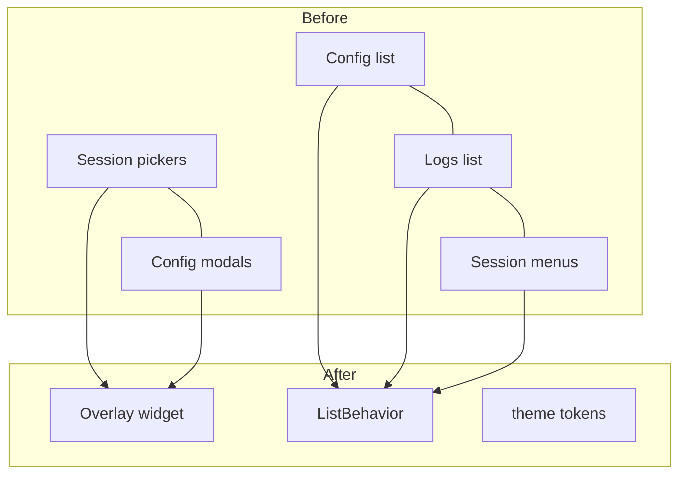

## B. Optimize (performance / responsiveness)

| Optimization | Detail | Addresses |
|---|---|---|
| **Dirty-region hint** | track changed panel rects; skip re-painting untouched panels before `diff` | rendering perf (02) |
| **Motion-event throttling** | debounce/threshold 1003 hover repaints (partly done — only repaint if consumed) | input flood (03) |
| **`listModels` cache** | cache per provider+key with TTL; avoid re-fetch on every picker open | J3 latency |
| **Adjustable / responsive layout** | draggable dividers + breakpoints; min-size guard with a "too small" message | gaps 20–22 |
| **Stream coalescing** | batch rapid `text_delta` into fewer `scheduleRender` ticks (already coalesced; verify under fast streams) | streaming perf |

## C. Improve (new affordances)

| Improvement | Detail | Addresses |
|---|---|---|
| **Keymap layer** | declarative, remappable, discoverable bindings; a `?`/help overlay listing them | gaps 1–4, 3-doc |
| **Consistent focus affordance** | one focus indicator across panels + overlays | gap 18, 08 |
| **Accessibility pass** | glyph+text redundancy for status; high-contrast theme; reduced-motion toggle | gaps 17–19 |
| **Raise/auto-size `DEFAULT_MAX_TOKENS`** | model-aware default | gap 15 |
| **Canvas operationalization** | toolbox + inspector + typed connectors + serialize (PLAN-13) | gap 13 |
| **Agents → team dashboard** | messages feed + memory + ports + statuses (PLAN-10) | gap 14 |
| **Structured `run` output** | newline-delimited JSON events on stdout for automation | 06 |

## Suggested sequencing (low-risk first)

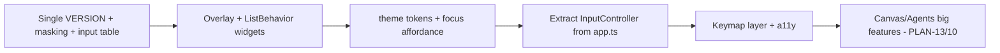

P0 = quick wins (hours). P1–P2 = the consolidation that removes most inconsistencies. P3 = the
god-object refactor (enables the Feature registry, 11). P5 = the large feature work.

## Open Design Questions

1. Which **consolidations** (A) are approved for this UI pass vs deferred?
2. Is the **god-object extraction** (P3) acceptable scope now, given it unblocks feature isolation
   (11)?
3. Priority order between **polish/consistency** (P0–P2) and **big features** (P5)?
4. Adopt **semantic theme tokens** as the foundation before any visual restyle?

---

<a id="d12"></a>

## 12 · 2026-06-18 · 11 — Feature Isolation (Lightweight `Feature` Interface)

Source: [11-feature-isolation.md](11-feature-isolation.md) · [[11-feature-isolation]]  ·  [↑ Index](#index)


<!-- version: 1.0.0 -->
<!-- classification: DESIGN -->
<!-- date: 2026-06-18 -->
<!-- last-updated: 2026-06-18 -->

**Goal:** let each feature be worked on **separately** (own folder, own tests, own
branch/worktree) without touching the `app.ts` god object every time. **Approach (chosen):**
lightweight — formalize the registry patterns that *already exist* into one `Feature` contract.
**No package split.** Incremental, not a big-bang rewrite.

## Why this fits

The codebase is already registry-shaped:
- **Tools** → `registerTool` / `listTools`
- **Providers** → `PROVIDERS` array
- **Commands** → CommandPalette command list
- **Hooks** → `runHook(event)`

The only thing missing is a single unit that bundles a feature's **panel + tools + commands +
keybindings + hooks + providers** so the host loads it generically. That removes the multi-place
wiring problem (gaps 9, 10).

## The `Feature` contract

```typescript
// src/features/types.ts
export interface FeatureCtx {
  scheduleRender(): void
  store: ConfigStore
  // …services the host injects (logger, rollout, etc.)
}

export interface KeyBinding { key: string; when?: string; run(ctx: FeatureCtx): void }

export interface Feature {
  id: string
  tab?: { title: string; makePanel(ctx: FeatureCtx): Panel }   // optional UI surface (a tab)
  tools?: Tool[]                                                // → registerTool
  commands?: PaletteCommand[]                                   // → CommandPalette
  keybindings?: KeyBinding[]                                    // → global keymap
  hooks?: Partial<Record<HookEvent, HookHandler>>               // → hook runner
  providers?: ProviderDef[]                                     // → config providers
}

export function registerFeature(f: Feature): void
export function loadedFeatures(): Feature[]
```

The **App becomes a thin host**: iterate `loadedFeatures()` → build the tab bar from
`feature.tab`, route input through a single keymap + the panel's `onKey/onMouse`, and register
each feature's tools/commands/hooks/providers. (This directly enables the P3 input extraction
in 10.)

## Target folder layout

```
src/
  features/
    session/   index.ts · panel.ts · commands.ts
    canvas/    index.ts · panel.ts · tools.ts
    terminal/  index.ts · panel.ts
    config/    index.ts · panel.ts · providers.ts
    logs/      index.ts · panel.ts · commands.ts
    types.ts   (Feature, FeatureCtx, registry)
  shared/      renderer/ · input/ · theme/ · widgets/   (the platform — feature-agnostic)
  core/        agent-loop · session · llm · tools(registry) · config(store) · logger · rollout
  orchestration/  (DAG plane)
  app.ts       thin host: load features → tabs + input + registration
```

`src/shared/` = the reusable platform (renderer, input, theme, Overlay/List widgets from 10).
`src/core/` and `src/orchestration/` stay as services features consume.

## Host ↔ feature-registry flow

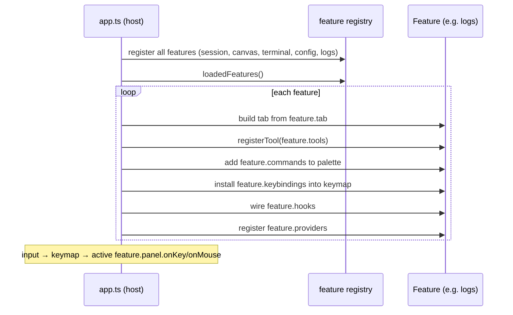

## Current → target migration map

| Current file | Target |
|---|---|
| `tui/panels/SessionPanel.ts` | `features/session/panel.ts` (+ `commands.ts` for slash cmds) |
| `tui/panels/OrchestrationCanvas.ts` + `widgets/{Block,Wire}.ts` | `features/canvas/` |
| `tui/panels/TerminalPanel.ts` + `input/vt.ts` | `features/terminal/` |
| `tui/panels/ConfigPanel.ts` + `core/config/providers.ts` | `features/config/` |
| `tui/panels/LogsPanel.ts` | `features/logs/` |
| `tui/renderer/*`, `tui/input/*`, `tui/widgets/{ContextMenu,CommandPalette,ScrollableList}` | `shared/` |
| `tui/panels/AgentsPanel.ts` | `features/agents/` (or fold into orchestration runtime) |
| input handling + hit-testing in `app.ts` | `shared/input/InputController.ts` + a keymap |

## Incremental path (no big-bang)

```mermaid
flowchart LR
    S1[Add features/types.ts + registry] --> S2[Wrap ONE panel as a Feature<br/>e.g. logs - leaf, low-risk]
    S2 --> S3[Host loads that feature via registry<br/>others stay legacy]
    S3 --> S4[Migrate panels one at a time]
    S4 --> S5[Extract InputController + keymap]
    S5 --> S6[Move renderer/input/widgets to shared/]
```

1. Introduce `features/types.ts` + the registry **alongside** existing wiring.
2. Convert **one leaf feature** (Logs) to a `Feature`; host loads it generically; everything else
   unchanged. Prove the contract.
3. Migrate the rest **one per PR/worktree** (the worktree-per-feature convention already in use).
4. Extract input/hit-testing from `app.ts` into `shared/`. The host shrinks to a loader.
5. Future multi-agent features (PR #23) drop in as `features/orchestration-*` with zero host edits.

## Benefits

- **Parallelizable:** each feature is a folder + a branch/worktree; merge conflicts shrink (no
  shared 1100-line `app.ts`).
- **Testable in isolation:** a feature's tools/commands/panel can be unit-tested without the host.
- **Extensible:** new tab/tool/command/provider = one `Feature`, registered in one place.
- **Future-proof:** if a **web renderer** is ever desired, features expose data + intent; only the
  panel renderer differs (see the open question below).

## Open Design Questions

1. **Panel shape:** keep class-based `Panel` (`render/onKey/onMouse`), or move toward a
   **declarative descriptor** the host renders (better for a future web renderer, more refactor)?
2. **Adopt now or after the UI fixes?** The registry can land incrementally (step 1–2) without
   blocking the current UI work — preferred?
3. **AgentsPanel placement:** its own feature, or part of an `orchestration` feature once the
   multi-agent runtime (PR #23) lands?
4. How much **shared `FeatureCtx`** surface to expose (which services)? Keep it minimal to avoid
   re-coupling.

---

<a id="d13"></a>

## 13 · 2026-06-18 · DDD — Design-Driven Development Reference for `factory`

Source: [INDEX.md](INDEX.md) · [[INDEX]]  ·  [↑ Index](#index)


<!-- version: 1.0.0 -->
<!-- classification: DESIGN -->
<!-- date: 2026-06-18 -->
<!-- last-updated: 2026-06-19 -->

A complete design reference for the `factory` (agentfactory-harness) terminal app, written to
feed into **Claude Design** for UI/UX iteration. Describes the **current implemented** app
(Waves 0–5); planned work is referenced only in gaps/optimizations.

## How to use with Claude Design

1. Start with **[MENTAL-MAP.md](MENTAL-MAP.md)** for fast orientation.
2. Read sections **00–08** for the current state (what exists, how it behaves).
3. Use **09–11** for the change agenda: gaps, optimizations, and how to isolate features so
   each can be redesigned/worked independently.
4. Answer the **Open Design Questions** at the end of each file (aggregated below). Feed your
   answers back as updates to the corresponding section.

## Table of contents

| # | File | Covers |
|---|---|---|
| — | [MENTAL-MAP.md](MENTAL-MAP.md) | Orientation skeleton — read first |
| 00 | [00-overview.md](00-overview.md) | Vision, ITUI concept, product framing, run model |
| 01 | [01-architecture.md](01-architecture.md) | Layers, module map, tech stack, component diagram |
| 02 | [02-rendering.md](02-rendering.md) | Cell-buffer, diff, layout, theme, render loop |
| 03 | [03-input-focus.md](03-input-focus.md) | Keyboard/mouse parse, router, focus, terminal bypass |
| 04 | [04-panels.md](04-panels.md) | Every panel + widget: state, layout, interactions |
| 05 | [05-core-data.md](05-core-data.md) | Agent loop, session, tools, LLM, config, logger, rollout |
| 06 | [06-orchestration.md](06-orchestration.md) | af-plan.json schema, executor, graph, planner |
| 07 | [07-user-journeys.md](07-user-journeys.md) | 9 journeys + sequence diagrams + expected behaviours |
| 08 | [08-design-language.md](08-design-language.md) | Palette semantics, iconography, modals, cell constraints |
| 09 | [09-gaps.md](09-gaps.md) | Inconsistencies, accessibility, responsiveness |
| 10 | [10-optimizations.md](10-optimizations.md) | Improvements + what can be simplified |
| 11 | [11-feature-isolation.md](11-feature-isolation.md) | Lightweight Feature-interface proposal |
| — | [../testing/TESTING-FACTORY-E2E-2026-06-18.md](../testing/TESTING-FACTORY-E2E-2026-06-18.md) | End-to-end test procedures (preconditions, steps, expected, failure indicators) |
| — | [../reviews/REVIEW-CURRENT-STATE-2026-06-18.md](../reviews/REVIEW-CURRENT-STATE-2026-06-18.md) | Consolidated implementation review (reasoning, assumptions, gaps/risks, enhancements, safeguards) |

## Aggregated Open Design Questions (decision checklist)

These are collected from each section. Answer them to drive the redesign.

- **Visual system (08):** Adopt semantic color tokens over raw 256 indices? Ship a high-contrast
  theme? Define a typography/emphasis scale (bold/dim/reverse usage rules)?
- **Status & affordance (08):** Is color-only status acceptable, or add shape/text redundancy
  for accessibility? Standardize one focus-ring affordance across panels?
- **Interaction consistency (09):** Unify scroll-wheel semantics (offset vs selection, ×1 vs ×3)?
  Standardize wrap-vs-clamp list navigation? Bring vim keys to all panels or none?
- **Overlays (10):** Consolidate the 3 duplicate modal implementations into one `Overlay` widget?
  What is the canonical modal geometry/behaviour?
- **Layout/responsiveness (09):** Support <80-column terminals? Make the 40/70 splits adjustable?
- **Canvas (04, 09):** Operationalize the authoring canvas now (see PLAN-13) or keep read-only?
- **Agents panel (04, 09):** Promote to a team dashboard (see PLAN-10) or keep the session list?
- **Feature isolation (11):** Keep panels class-based (`Panel`) or move to declarative descriptors
  (affects a future web renderer)? Adopt the `Feature` registry now or after the UI fixes?
- **Defaults (09):** Raise `DEFAULT_MAX_TOKENS` (2048) for agentic use? Single `VERSION` source?

## Conventions in this doc set

- Every file carries `<!-- version -->`, `<!-- classification -->`, `<!-- date -->`, and
  `<!-- last-updated -->` markers per `docs/documentation/DOCUMENTATION-TAXONOMY.md` (`date` is set once;
  only `last-updated` changes on edits).
- Mermaid diagrams use GitHub-safe patterns (no parentheses inside node labels).
- Facts cite the source file; `file:line` where precision matters.
- "Current state" is descriptive; "gaps/optimizations" are prescriptive and clearly separated.

---

<a id="d14"></a>

## 14 · 2026-06-18 · MENTAL MAP — `factory` (agentfactory-harness)

Source: [MENTAL-MAP.md](MENTAL-MAP.md) · [[MENTAL-MAP]]  ·  [↑ Index](#index)


<!-- version: 1.0.0 -->
<!-- classification: DESIGN -->
<!-- date: 2026-06-18 -->
<!-- last-updated: 2026-06-18 -->
<!-- READ ME FIRST. Orientation skeleton for design/exploration agents. -->
<!-- Complements .ai/project-index.yml (file-oriented). This map is design/behaviour-oriented. -->

## What it is (30 seconds)

`factory` is a **full-screen TypeScript TUI** — an "ITUI" (Interactive TUI) orchestration shell
for AI agents. Custom ANSI cell-buffer renderer (no Ink/blessed). Run model:

- `factory` (no args) → launches the full-screen **App** (alt-screen TUI).
- `factory <subcommand>` → **CLI** path (`doctor`, `run`, `plan new|validate`, `--version`).

Single binary `factory` → `dist/index.js`. ESM, Node ≥20.

## Layer skeleton

```
src/
├── index.ts            entry — branch: TUI App vs CLI (commander)
├── cli.ts              command tree: doctor · run · plan new|validate
├── app.ts              HOST god-object: render loop, input routing, tabs/focus, status-bar hit-test
│
├── tui/                ── presentation platform ──
│   ├── renderer/       cell-buffer · ansi · layout · theme   (the paint engine)
│   ├── input/          keyboard · mouse · router · vt        (stdin → events; PTY emulator)
│   ├── panels/         Panel base + Session · Orchestration · Agents · Terminal · Config · Logs · StatusBar
│   └── widgets/        Block · Wire · ContextMenu · CommandPalette · ScrollableList
│
├── core/               ── runtime / data ──
│   ├── agent-loop.ts   streaming LLM loop + tool dispatch + hooks
│   ├── session.ts      conversation history (Anthropic MessageParam format)
│   ├── hooks.ts        shell-based lifecycle hooks (.ai/hooks/*.sh)
│   ├── tools/          registry + Bash · Read · Write · WebFetch (+ agent, not registered)
│   ├── llm/            LLMAdapter · Anthropic · OpenAI · createAdapter/defaultProvider/listModels
│   ├── config/         ConfigStore (~/.config/agentfactory/config.json) + 35 PROVIDERS
│   ├── logger.ts       leveled logging + 500-entry ring buffer + dated file
│   └── rollout.ts      append-only JSONL session persistence (resume = replay)
│
├── orchestration/      ── DAG plane ──
│   schema.ts (af-plan.json Zod) · executor.ts (toposort+concurrency) · graph.ts · planner.ts
│
├── harness/            doctor.ts (7 env checks)   [reader/manifest planned]
└── registry/           auth · client · login (device flow) · import-keys
```

## File → responsibility → key symbols (the fast index)

| File | Responsibility | Key symbols |
|---|---|---|
| `src/index.ts` | entry; TUI-vs-CLI branch; `VERSION` | `VERSION` (0.3.0 ⚠) |
| `src/cli.ts` | command tree | `buildCli`, doctor/run/plan |
| `src/app.ts` | host: render loop, input, tabs/focus, hit-test | `App`, `scheduleRender`, `render`, `listenInput`, `TABS`, `ensureTerminalPanel` |
| `tui/renderer/cell-buffer.ts` | frame grid + minimal-diff output | `CellBuffer`, `Cell`, `diff`, `flush`, `clone` |
| `tui/renderer/ansi.ts` | escape builders | `enterAltScreen`, `enableMouse`, `moveTo`, `sgr`, `osc8*`, `osc52Copy` |
| `tui/renderer/layout.ts` | panel regions + borders | `Rect`, `PanelLayout`, `computeLayout`, `drawBorder` |
| `tui/renderer/theme.ts` | palette + box/wire/status chars | `Colors`, `Box`, `DBox`, `Wire`, `Status` |
| `tui/input/keyboard.ts` | stdin → KeyEvent | `KeyEvent`, `parseKey` |
| `tui/input/mouse.ts` | SGR mouse parse | `MouseEvent`, `parseMouse` |
| `tui/input/router.ts` | dispatch to focused/hit panel | `InputRouter.dispatch` |
| `tui/input/vt.ts` | PTY virtual terminal | `VTScreen`, `feed`, `render`, scrollback |
| `tui/panels/Panel.ts` | abstract base | `Panel`, `rect`, `focused`, `inner`, `render/onKey/onMouse` |
| `tui/panels/SessionPanel.ts` | chat + multi-session + pickers | `SessionPanel`, `runAgentLoop`, `SLASH_COMMANDS`, `SessionRecord` |
| `tui/panels/OrchestrationCanvas.ts` | DAG canvas (drag/wire) | `OrchestrationCanvas`, `syncFromPlan`, `applyStepEvent`, `CanvasWire` |
| `tui/panels/AgentsPanel.ts` | session list + stats | `AgentsPanel`, `AgentEntry`, `setAgents`, `updateAgent` |
| `tui/panels/ConfigPanel.ts` | provider key manager | `ConfigPanel`, `maskValue`, edit/login/import overlays |
| `tui/panels/LogsPanel.ts` | logs + metrics + AI insights | `LogsPanel`, `startInsights`, two-column |
| `tui/panels/TerminalPanel.ts` | node-pty + VTScreen bridge | `TerminalPanel`, `write`, `scrollBack` |
| `tui/panels/StatusBar.ts` | bottom bar (function) | `renderStatusBar`, `StatusBarLayout` |
| `tui/widgets/CommandPalette.ts` | Ctrl+P fuzzy commands | `CommandPalette`, `fuzzyScore`, `PaletteCommand` |
| `tui/widgets/ContextMenu.ts` | right-click popup | `ContextMenu`, `MenuItem` |
| `tui/widgets/ScrollableList.ts` | reusable list | `ScrollableList`, `ListRow` |
| `tui/widgets/Block.ts` / `Wire.ts` | canvas node + wire (pure render) | `renderBlock`, `routeWire` |
| `core/agent-loop.ts` | streaming loop | `agentLoop`, `AgentEvent`, `AgentLoopOptions` |
| `core/session.ts` | history | `Session`, `tokenCount` |
| `core/hooks.ts` | lifecycle hooks | `runHook`, `HookEvent`, `HookResult` |
| `core/tools/index.ts` | registry + dispatch | `Tool`, `registerTool`, `dispatch`, `listTools` |
| `core/llm/types.ts` / `index.ts` | adapter contract + factory | `LLMAdapter`, `StreamChunk`, `createAdapter`, `defaultProvider`, `listModels` |
| `core/config/store.ts` / `providers.ts` | key store + provider defs | `store`, `getKey`, `setKey`, `PROVIDERS` |
| `core/logger.ts` / `rollout.ts` | logging + persistence | `logger`, `getRecentLogs`, `rolloutStore` |
| `orchestration/schema.ts` | plan schema | `PlanSchema`, `StepSchema` |
| `orchestration/executor.ts` | DAG executor | `Executor`, `StepEvent`, `StepStatus` |
| `orchestration/graph.ts` | DAG utils | `toposort`, `detectCycles`, `readySet` |
| `harness/doctor.ts` | env checks | `runDoctor`, `printDoctorReport` |
| `registry/{auth,client,login,import-keys}.ts` | registry + device login | `getToken`, `decodeUser`, `startDeviceLogin` |

## "Where do I look for X?"

| I want to… | Go to |
|---|---|
| Understand how a frame is painted | `cell-buffer.ts` `diff()` + `app.ts` `render()`/`scheduleRender()` |
| Add a panel / tab | `app.ts` (`TABS`, `initPanels`, render branch, input routing) — see 11-feature-isolation for the cleaner path |
| Add a tool | `core/tools/` + `registerTool` in `app.ts` |
| Handle a key globally | `app.ts` `listenInput` (keyboard section) |
| Understand focus | `app.ts` `activeTab` + `router.ts` (key→focused, mouse→hit-test) |
| Add an LLM provider key | `core/config/providers.ts` (`PROVIDERS`) |
| Persist / resume a session | `core/rollout.ts` + `SessionPanel` `resumeFrom` |
| Change colors | `tui/renderer/theme.ts` `Colors` |
| Edit the chat/agent loop | `core/agent-loop.ts` |
| Run a DAG plan | `orchestration/executor.ts` + `cli.ts` `run` |

## Critical invariants & gotchas

1. **Event-driven render, NO fixed tick.** State changes call `scheduleRender()` →
   `renderPending` flag + `setImmediate` coalesce → one `render()` per tick. Direct user
   actions often call `render()` synchronously. The only timers are Logs feature timers.
2. **`activeTab` IS the focus.** One source of truth. Keys go to the active panel; mouse goes
   to the panel whose rect contains the click.
3. **Only `[session, canvas, agents]` go through `InputRouter`.** Config, Logs, and Terminal
   are dispatched **explicitly** in `app.ts` (don't assume the router covers them).
4. **Terminal tab = raw-byte bypass.** stdin bytes go straight to the PTY; only Ctrl+Q/Ctrl+P/
   F1–F5/Shift+PgUp-Dn/tab-bar clicks are intercepted.
5. **One UTF-16 unit per cell.** Emoji are sanitized to ASCII in SessionPanel; wide (CJK/emoji)
   chars are handled specially only in `VTScreen`. Don't put multi-codepoint glyphs in cells.
6. **`agent` tool is deliberately NOT registered** in the interactive loop (its Zod schema
   would reject the model's input). See `cli.ts` comment.
7. **`app.ts` is a ~1100-line god object** (render + input + status-bar hit-testing). Most
   "wiring" lives here, not in the panels.
8. **Version string is inconsistent**: `package.json` 0.4.0, `index.ts` VERSION 0.3.0 (what
   `--version` prints), StatusBar 0.4.0.

## Data / file locations

| What | Path |
|---|---|
| Provider keys/urls | `~/.config/agentfactory/config.json` |
| Logs (dated) | `~/.config/agentfactory/logs/factory-<YYYY-MM-DD>.log` |
| Session rollouts (JSONL) | `~/.config/agentfactory/sessions/<YYYY-MM-DD>/rollout-*.jsonl` |
| Registry token | `~/.agentfactory/token` |
| Orchestration plan | `./af-plan.json` (cwd) |
| Harness context | `./.ai/` + `./CLAUDE.md` |

## Known-quirk warning

Several **intended** quirks look like bugs (per-panel scroll-wheel semantics differ, vim keys
only in Logs, Nobel-laureate session names + tooltip). Before "fixing", read
[`09-gaps.md`](09-gaps.md) — it classifies which are intended vs real issues.

## See also

- `.ai/project-index.yml` — machine-readable file index (path · purpose · exports · wave · status).
- This DDD set: [`INDEX.md`](INDEX.md) for the full table of contents.

---

