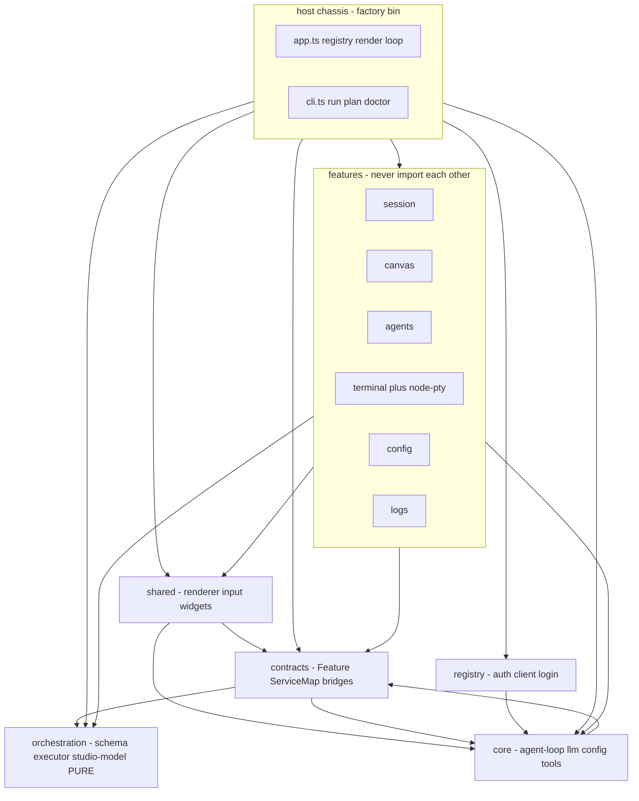
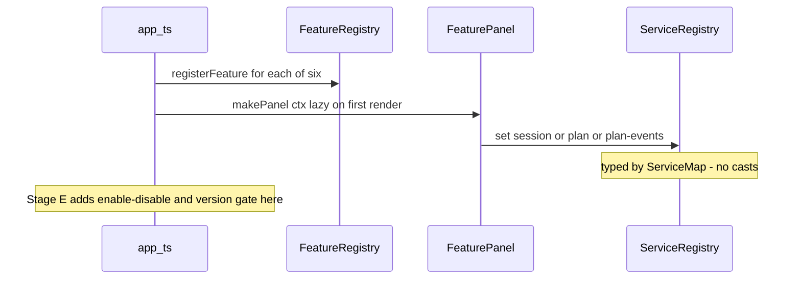
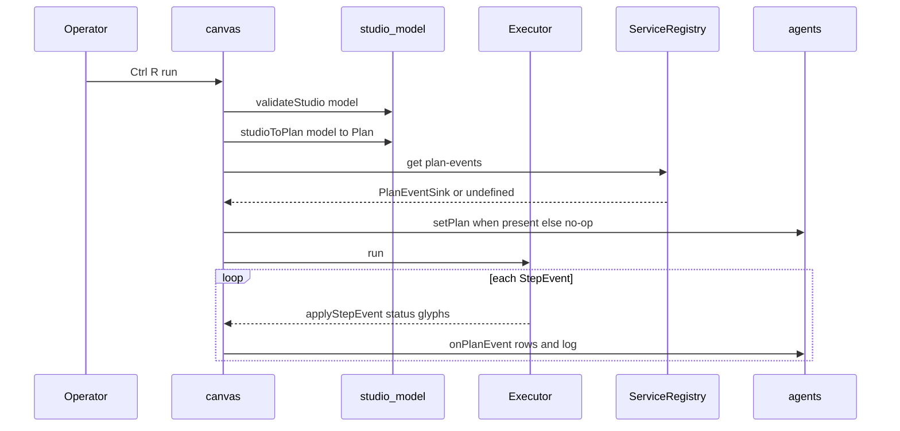
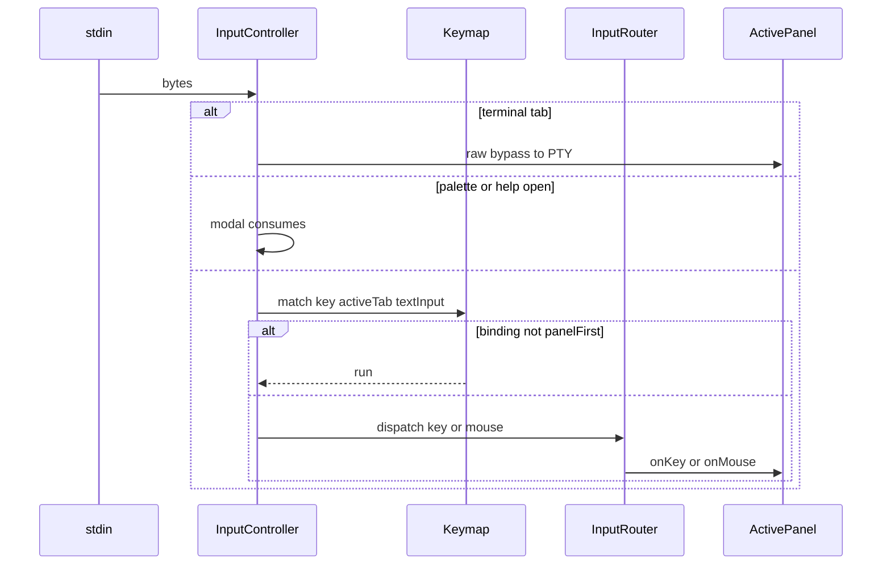
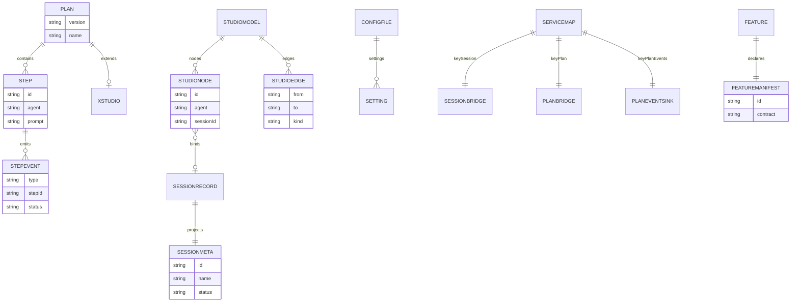
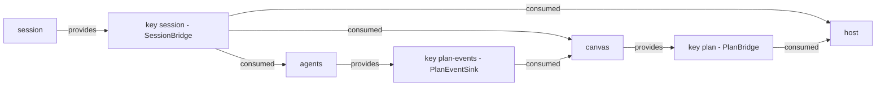

# Architecture Blueprint — Compartmentalized `factory`

<!-- version: 1.0.0 -->
<!-- classification: ARCHITECTURE -->
<!-- date: 2026-08-26 -->
<!-- last-updated: 2026-08-26 -->

The living blueprint for the block architecture: what each block takes in and puts out, which
surfaces are stable connectors (backward-compat-governed) versus free-to-change internals, and
the diagrams that back the design. Plan of record:
`specs/docs/approvedPlans/2026-08-26-compartmentalize-blocks.md`. Boundaries are enforced by
`eslint.config.js` (`.ai/rules/module-boundaries.md`).

**Status:** Stages A–C implemented (contracts + typed registry; ESLint boundary enforcement;
per-block test projects). Stages D (workspace packages) and E (runtime toggles + contract
versioning) are **planned** — sections below mark them.

---

## 1. The parts manual — every block's I/O contract

Legend: **In** = what it consumes · **Out** = its public API · **Connector** = the stable
interface others bind to (breaking it = major bump + consumer adaptation) · **Internal** = free
to change with zero external impact · **Ripple** = changing the *connector* forces these to adapt.

```
┌─ contracts/ ─────────────────────────────────────────── (the bolt-spec; leaf-ward) ─┐
│ In       : orchestration + core + shared TYPES only (import type; erased)            │
│ Out      : Feature, FeatureCtx, ServiceMap, ServiceRegistry, SessionBridge,          │
│            PlanBridge, PlanEventSink, SessionMeta, SessionStats, createServiceRegistry│
│ Connector: ALL of Out — this IS the contract surface. Highest stability bar.         │
│ Internal : createServiceRegistry impl (a Map behind the typed interface)             │
│ Ripple   : a breaking change here ⇒ EVERY feature + host adapt (Stage-E version gate │
│            will reject features not rebuilt against the new major).                   │
├─ orchestration/ ────────────────────────────────── (pure engine; the true leaf) ────┤
│ In       : zod + node only. NOTHING from shared/core/features.                       │
│ Out      : PlanSchema, Plan, Step, Executor, StepEvent, graph utils, studio-model    │
│ Connector: PlanSchema (+ x-studio), StepEvent, Executor.run, studioToPlan/planToStudio│
│ Internal : executor scheduling, graph algorithms, validation messages                │
│ Ripple   : StepEvent ⇒ canvas.applyStepEvent + agents.onPlanEvent; Plan ⇒ round-trip │
├─ core/ ───────────────────────────────── (services: llm, config, tools, logger) ────┤
│ In       : contracts TYPES, @anthropic-ai/sdk, openai, zod, node                     │
│ Out      : agentLoop, Session, ConfigStore, providers, llm adapters, Tool, logger …  │
│ Connector: ConfigStore/getSetting, Tool, agentLoop, ModelEntry, LLMAdapter           │
│ Internal : provider HTTP, token accounting, rollout format, log format               │
│ Ripple   : ConfigStore ⇒ shared(settings/motion/size) + config feature; agentLoop ⇒  │
│            session/canvas/logs run paths                                              │
├─ shared/ ─────────────────────────────────── (platform: render + input + widgets) ──┤
│ In       : contracts TYPES  [+ core/config in 4 files — tracked soft spot]           │
│ Out      : CellBuffer, layout, theme, Overlay, ScrollableList, ContextMenu, Palette, │
│            HelpOverlay, StatusBar, Panel, TabEntry, InputController, Keymap, Router   │
│ Connector: Panel (render/onKey/onMouse), TabEntry, KeyBindingDef, PaletteCommand     │
│ Internal : ANSI emission, diff algorithm, widget pixel layout, theme values          │
│ Ripple   : Panel/TabEntry/KeyBindingDef ⇒ every feature panel; a widget internal ⇒ nobody│
├─ feature-<x>/ (session·canvas·agents·terminal·config·logs) ── (bolt-on parts) ───────┤
│ In       : contracts, shared, core, orchestration (+ node-pty ONLY in terminal;      │
│            + registry in config/harness for auth)                                    │
│ Out      : one factory xFeature(): Feature                                           │
│ Connector: the Feature it returns + any ServiceMap key it PROVIDES                   │
│ Internal : its Panel, private state, flows, helpers, tests                           │
│ Ripple   : changing a PROVIDED bridge ⇒ contracts + consumers; internals only ⇒ NOBODY│
├─ host/ (app.ts + cli + index + registry + harness) ───────── (the chassis) ──────────┤
│ In       : EVERYTHING · Out : the factory bin (nothing imports host)                 │
│ Connector: builds the FeatureCtx + ServiceRegistry it injects                        │
│ Ripple   : FeatureCtx ⇒ contracts bump ⇒ all features; render/CLI ⇒ nobody           │
└──────────────────────────────────────────────────────────────────────────────────────┘
```

### Backward-compatibility policy

- **STABLE** = anything a block exports as a *Connector* (above). Changing it is breaking:
  bump the major, update every consumer in the same PR, run the contract tests. ESLint
  guarantees only the barrel/connector is reachable, so the compat surface has nothing hidden.
- **INTERNAL** = anything not in the connector list → change freely; the build proves no one
  depends on it.
- **ADDITIVE** = a new optional field, a new `ServiceMap` key, a new feature → never breaks
  consumers. This is the pattern of `x-studio` and the lazy/optional `.get()` seams.

---

## 2. Software architecture — current (implemented)



Stage D turns each node into an `@factory/*` workspace package; the edges above become the
package `dependencies` DAG (acyclic). `node-pty` stays inside `feature-terminal` only.

---

## 3. Communication diagrams

### 3a. Boot — feature registration and typed service wiring



### 3b. Runtime — a plan run fans events across blocks



### 3c. Input dispatch — host to shared to the active feature panel



---

## 4. Data model — ERD



`FEATUREMANIFEST` is the Stage-E addition (planned). `XSTUDIO` is the additive `x-studio`
extension on the plan file that carries canvas layout, typed edges, and node-session bindings.

---

## 5. Contract map — who provides and consumes each service key



This is the entire cross-feature surface — three keys, every edge optional and lazy. Any
provider can be absent (toggled off, Stage E) and consumers degrade to a no-op or fallback.

---

## 6. Enforcement — the allow-matrix (live, in `eslint.config.js`)

| from ↓ \ may import → | contracts | orchestration | core | shared | registry | sibling feature |
|---|---|---|---|---|---|---|
| contracts     | ✔ | ✔ type | ✔ type | ✔ type | – | – |
| orchestration | – | ✔ | – | – | – | – |
| core          | ✔ | – | ✔ | – | – | – |
| shared        | ✔ | – | ✔ soft | ✔ | – | – |
| registry      | ✔ | – | ✔ | – | ✔ | – |
| harness       | ✔ | – | ✔ | – | ✔ | – |
| feature       | ✔ | ✔ | ✔ | ✔ | ✔ | ✖ never |
| host          | ✔ | ✔ | ✔ | ✔ | ✔ | ✔ |

A violating import fails `npm run lint` (and CI). Verified: a planted `logs → session` import
and an `orchestration → shared` import both fail; the clean tree passes.

---

## 7. Test blueprint — "test everything"

```
┌ Layer ─────────────┬ Proves ───────────────────────┬ Where / gate ─────────────────┐
│ Boundary lint      │ no block reaches a neighbour;  │ eslint boundaries — CI lint   │
│                    │ no feature→feature import      │ job FAILS on breach           │
│ Contract tests     │ ServiceRegistry set/get/dedup; │ src/contracts/services.test.ts│
│                    │ a provider satisfies its key   │ (extend per key)              │
│ Purity test        │ studio-model imports nothing   │ studio-model.test (grep)      │
│                    │ from shared/features           │                               │
│ Unit per block     │ block internals in isolation   │ vitest run --project <block>  │
│ Integration        │ host loads features, routes    │ controller/app tests via      │
│                    │ input, wires services          │ handleData byte drives        │
│ Event-flow         │ plan run fans to canvas+agents │ canvas/agents with stub Exec  │
│ Round-trip         │ studioToPlan∘planToStudio ≡ id │ studio-model.test             │
│ Version-gate (E)   │ incompatible manifest skipped  │ app test (planned)            │
│ Toggle (E)         │ features.<id>=off degrades ok  │ app test + smoke (planned)    │
│ E2E smoke          │ real TUI renders + studio run  │ scripts/smoke-tui.sh (tmux)   │
│ Build DAG (D)      │ package graph acyclic, bin runs│ tsc -b + npm ci (planned)     │
└────────────────────┴────────────────────────────────┴───────────────────────────────┘
```

Gate summary today: `npm run lint` (eslint boundaries + typecheck) · `npm test` (446, per-block
projects available) · `npm run build` · `scripts/smoke-tui.sh`. A connector change additionally
requires its contract test plus all consumers updated in the same PR.

---

## 8. Roadmap

- **Stage D — workspace packages** (planned): extract leaves-first
  (contracts → orchestration → core → shared → features → host), one package per PR; scope
  `node-pty` to `feature-terminal`; clean the `shared → core/config` soft spot; each edge in §2
  becomes an `@factory/*` dependency.
- **Stage E — runtime toggles + contract versioning** (planned): `FeatureManifest` +
  `CONTRACT_VERSION`; config-driven enable/disable; a major-version gate the host checks on
  load; `factory doctor --features` capability report.
