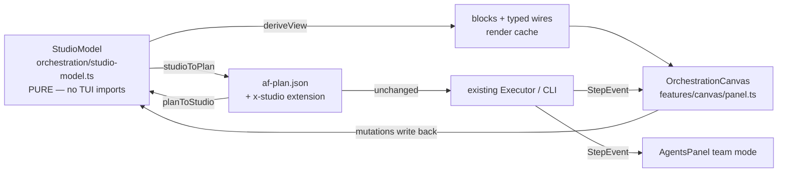

# FEATURE — Orchestration Studio + Team Dashboard (standalone PLAN-13/PLAN-10)

<!-- version: 1.0.0 -->
<!-- classification: FEATURE -->
<!-- date: 2026-07-07 -->
<!-- last-updated: 2026-07-07 -->

Standalone implementation of `docs/PLANS/PLAN-13-ORCHESTRATION-STUDIO.md` (canvas
operationalization) and `docs/PLANS/PLAN-10-TUI-MULTI-AGENT.md` (team dashboard) against the
**existing** `PlanSchema`/`Executor` — the multi-agent kernel (PLAN-00–08) is not required.
Kernel-dependent pieces (MessageBus feed, SharedMemory strip, AgentAskWidget, logic-port
nodes, TeamStepEvent) are deferred to the kernel wave.

## 1. Architecture — pure core + thin renderer



**Legend:** the model is the single source of truth (PLAN-13 §4.5 ownership inversion);
blocks/wires are throwaway views. `x-studio` is additive — old plans parse, the executor
ignores it.

## 2. Serialization contract

- Every edge (dependency **and** handoff) becomes `dependsOn` (ordering).
- Handoff payloads ride the executor's existing `{{depId}}` interpolation: if the target
  prompt lacks `{{from}}`, `\n\nInput from <from>:\n` is appended once (stable
  across round-trips). `payload: summary|full` is recorded in `x-studio` for the future
  kernel; identical at run time today.
- `x-studio.layout` (per-node row/col) + `x-studio.edges` (kinds/payloads) make
  `planToStudio(studioToPlan(m))` lossless — proven by tests and by
  `factory plan validate` accepting the emitted file.

## 3. Canvas usage (Orchestration tab)

| Interaction | Effect |
|---|---|
| `t` | Toggle the toolbox rail (generic/planner/worker/reviewer/critic) |
| Click toolbox item → click a cell | Drop a real node (agent + prompt stub) and open the inspector |
| Right-click empty cell → "Add agent block" | Create a node and open the inspector |
| Click block body | Select (focus border); `Enter`/`e` opens the inspector; Esc deselects |
| Right-click block → "Configure…" | NodeInspector (id/agent/provider/model/timeout/prompt, inline validation; renames remap edges) |
| Drag output ○ → input ● | Typed-connector menu: dependency · handoff:summary · handoff:full |
| Handoff wires | Render `═` + `[H]` midpoint label (glyph, not color-only) |
| `Ctrl+S` | Validate + write `af-plan.json` (fatal issues shown in the status bar) |
| `Ctrl+R` | Validate + serialize the canvas model + run it via the existing executor |

Run statuses render on blocks with `◎ pending` and `⊘ skipped` kept distinct (the old
`skipped→idle` collapse is gone).

## 4. Team dashboard (Agents tab)

Running a plan switches AgentsPanel to team mode (sessions mode untouched; the
Nobel-laureate tooltip is suppressed): header with `[n running / m total]`, step list with
glyph+text labels (`◎ id [pending]`, `⊘ id [skipped]`…), selected-step output/error excerpt,
and a rolling event log fed by the run loop through the `plan-events` service. Two columns
at ≥70 cols, stacked below. `Esc` returns to the session list.

## 5. Automation

`factory run --json` emits one JSON object per `StepEvent` plus an ISO `ts` on **stdout**
(human lines stay on stderr) and exits 1 if any step errored:

```
{"type":"step:start","stepId":"one","status":"running","ts":"…"}
{"type":"step:done","stepId":"one","status":"done","output":"…","durationMs":4,"ts":"…"}
```

## 6. Scenarios

1. **Author → run → reopen**: toolbox-drop worker + reviewer, connect `handoff: summary`,
   set prompts in the inspector, `Ctrl+S`, `Ctrl+R` — blocks go ◎→●→✓ and the Agents tab
   streams the event log. Reopening loads the same graph via `x-studio` (verified round-trip).
2. **Invalid design**: a cycle or duplicate id blocks `Ctrl+S`/`Ctrl+R` with the first fatal
   issue in the status bar; the inspector blocks saves inline (`✗ id "x" already exists`).
3. **Legacy plan**: an af-plan.json without `x-studio` loads with the historical auto-grid
   layout and plain dependency edges.

## 7. Testing

- `studio-model.test.ts`: purity (no shared/features imports), round-trips (both directions +
  stability), handoff scaffold, validation table, deriveView.
- `panel.test.ts`: wiring with typed connectors, dup/self-loop rejection, model write-back on
  drag, selection, toolbox placement, pending/skipped statuses.
- `NodeInspector.test.ts`, `agents/panel.test.ts` (team mode), NDJSON verified end-to-end.
