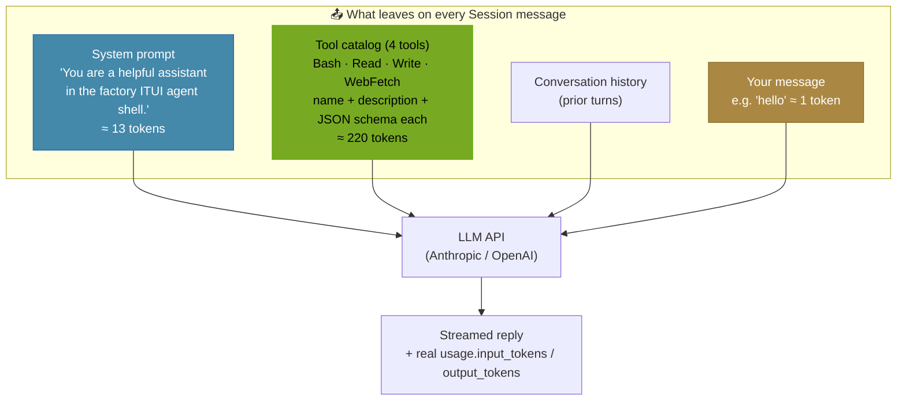
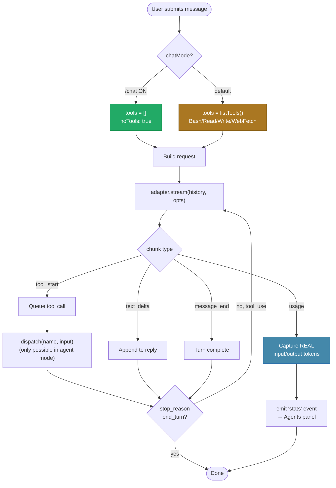
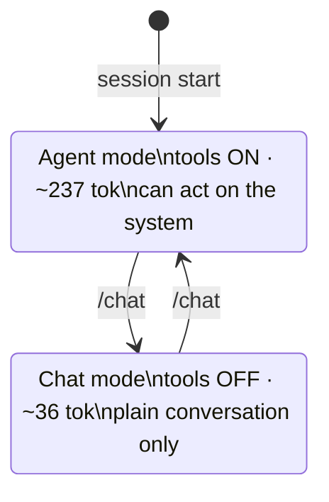
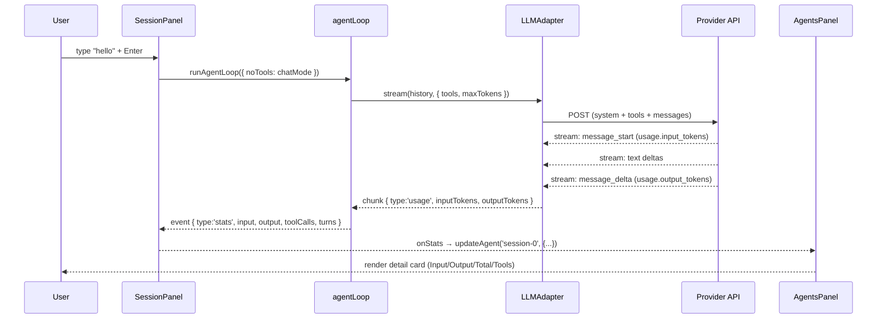
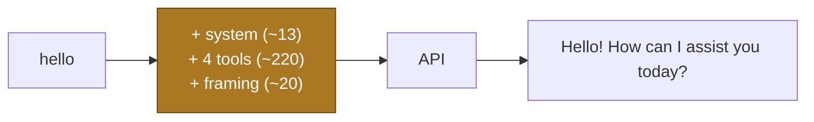
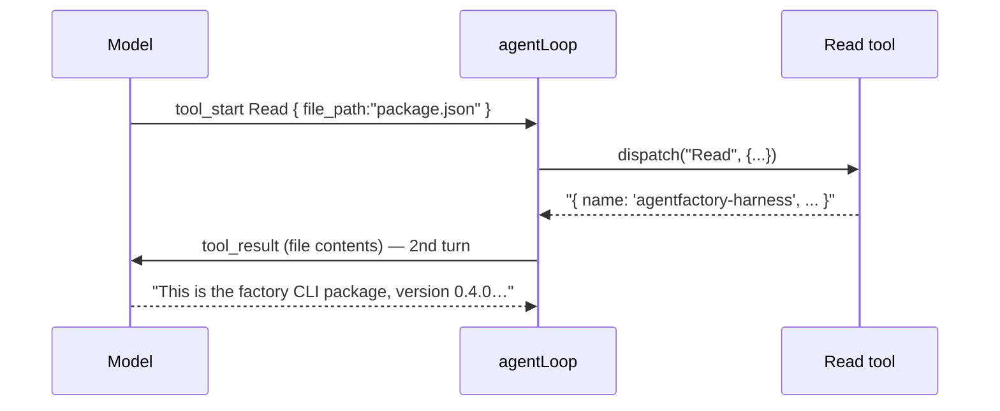
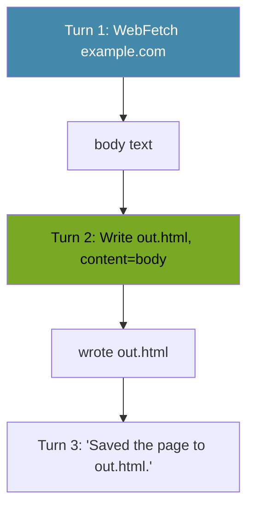
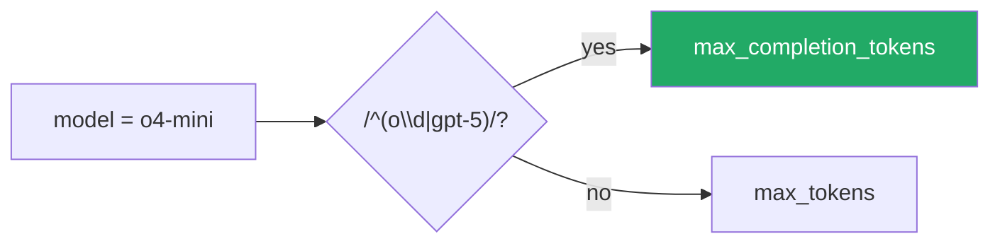

<!-- version: 1.0.0 -->
# Feature: Tool Definitions, Token Flow & Chat Mode

╔══════════════════════════════════════════════════════════════════════════════╗
║  SCOPE   src/core/tools/* · src/core/agent-loop.ts · src/core/llm/*           ║
║  TOPIC   What gets sent to the model, why "hello" costs ~237 tokens,          ║
║          and how /chat mode reduces it to ~36                                 ║
║  STATUS  ✓ documented — reflects PR #19 (registry-auth-login)                 ║
╚══════════════════════════════════════════════════════════════════════════════╝

---

## 1. WHAT THIS DOCUMENT COVERS

Every message you send to a model carries more than your text. The agent loop
attaches a **system prompt** and a **tool catalog** so the model knows who it is
and what actions it can take. This doc catalogs those tools, shows the exact
request anatomy, explains the token cost, and documents `/chat` mode which
strips the tool catalog for cheap plain conversation.

---

## 2. REGISTERED TOOLS — TREE VIEW

```
factory agent tools  (src/core/tools/)
│
├── index.ts ─────────────── ToolRegistry: registerTool() / listTools() / dispatch()
│
├── ● Bash        (bash.ts)        registered in App ✓
│     ├─ description : "Run a shell command and return stdout + stderr"
│     ├─ command : string   (required)
│     └─ timeout : number   (optional, default 30000ms)
│
├── ● Read        (read.ts)        registered in App ✓
│     ├─ description : "Read a file from disk and return its UTF-8 contents"
│     └─ file_path : string  (required)
│
├── ● Write       (write.ts)       registered in App ✓
│     ├─ description : "Write content to a file, creating parent dirs if needed"
│     ├─ file_path : string  (required)
│     └─ content : string    (required)
│
├── ● WebFetch    (web-fetch.ts)   registered in App ✓
│     ├─ description : "Fetch a URL and return the response body as text"
│     └─ url : string        (required)
│
└── ○ agent       (agent.ts)       NOT registered in App (Wave 3 / orchestration only)
      ├─ description : "Run a sub-agent with the given prompt, return final text"
      ├─ prompt : string     (required)
      └─ model : string      (optional)
```

`●` = sent to the model on every Session request · `○` = exists but not wired
into the interactive Session loop (used by the DAG executor instead).

---

## 3. TOOL CATALOG — DETAIL TABLE

| Tool | Wire name | Required args | Optional args | Returns | Side effects |
|------|-----------|---------------|---------------|---------|--------------|
| Bash | `Bash` | `command` | `timeout` | stdout + stderr | runs a shell command |
| Read | `Read` | `file_path` | — | file UTF-8 contents | none (read-only) |
| Write | `Write` | `file_path`, `content` | — | confirmation | writes file + mkdir -p |
| WebFetch | `WebFetch` | `url` | — | response body text | outbound HTTP GET |
| agent* | `agent` | `prompt` | `model` | sub-agent final text | spawns a child loop |

\* `agent` is registered only inside the orchestration executor, not the Session tab.

---

## 4. ANATOMY OF ONE REQUEST



The **tool catalog dominates** the input cost. The model must receive every
tool's full schema to know what it can call — this is the same "tool tax" paid
by Claude Code, Cursor, Aider, and every other tool-enabled agent.

---

## 5. TOKEN BREAKDOWN — "hello"

```
AGENT MODE (default — tools on)              CHAT MODE (/chat — tools off)
─────────────────────────────────           ─────────────────────────────────
 System prompt      ≈  13 tok                 System prompt      ≈  13 tok
 Tool catalog (×4)  ≈ 220 tok   ◄── removed   Tool catalog       ≈   0 tok
 Message framing    ≈  20 tok                  Message framing    ≈  20 tok
 "hello"            ≈   1 tok                  "hello"            ≈   1 tok
 ───────────────────────────                  ───────────────────────────
 TOTAL input        ≈ 237 tok                  TOTAL input        ≈  36 tok

         ~6.5× cheaper input in chat mode
```

> Numbers shown in the Agents panel are **real** `input_tokens` from the
> provider API (Anthropic `message_start.usage`, OpenAI `include_usage`), not
> estimates. The ~20 "message framing" tokens are the provider's unavoidable
> per-request structural overhead.

---

## 6. AGENT-LOOP FLOW (with noTools branch)



---

## 7. AGENT MODE vs CHAT MODE — COMPARISON

| Aspect | Agent mode (default) | Chat mode (`/chat`) |
|--------|----------------------|---------------------|
| Tool catalog sent | ✅ Bash/Read/Write/WebFetch | ❌ none |
| Input tokens for "hello" | ~237 | ~36 |
| Can read files / run commands | ✅ yes | ❌ no |
| Can fetch URLs | ✅ yes | ❌ no |
| Best for | tasks, automation, coding | plain Q&A, brainstorming |
| Input-bar indicator | (none) | green `[chat]` tag |
| Toggle | — | `/chat` (flips live) |



---

## 8. WHERE TOKENS SHOW UP — DATA FLOW



---

## 9. KEY FILES

```
src/core/tools/
├── index.ts          ToolRegistry — registerTool / listTools / dispatch
├── bash.ts           BashTool
├── read.ts           ReadTool
├── write.ts          WriteTool
├── web-fetch.ts      WebFetchTool
└── agent.ts          AgentTool (orchestration only)

src/core/agent-loop.ts
├── AgentLoopOptions.noTools          ← gates the tool catalog
├── tools = opts.noTools ? [] : listTools()
└── emits { type:'stats', ... } per turn with real usage

src/core/llm/
├── anthropic-adapter.ts   usage from message_start + message_delta
├── openai-adapter.ts      usage via stream_options:{ include_usage:true }
└── types.ts               StreamChunk gains 'usage' variant

src/tui/panels/SessionPanel.ts
├── chatMode + /chat command
└── input-bar [chat] tag

src/tui/panels/AgentsPanel.ts
└── stats detail card (Model/Status/Elapsed/Input/Output/Total/Tools)
```

---

## 10. RELATED COMMANDS

| Command | Effect |
|---------|--------|
| `/chat` | Toggle tools off/on (cheap chat ↔ full agent) |
| `/model` | Pick provider → model (status bar tag) |
| `/tokens` | Local estimate of conversation size |
| `/config` | Open Config tab (API keys, login) |
| `/help` | List commands |

---

## 11. WORKED EXAMPLES — EVERY SCENARIO

Each example shows: what you type, what leaves to the API, what comes back, and
the Agents-panel stats. Token figures are real API counts (approximate).

### Scenario A — Agent mode, plain greeting (no tool needed)

```
You ▸ hello
```

```
Agents ▸ session-0
  Model   claude-opus-4-7      Input   237 tok
  Status  ✓ Done               Output   27 tok
  Tools   0 calls / 1 turn     Total   264 tok
```
> The model chose not to call a tool — but the tool catalog was still sent
> (it can't know in advance), so input stays ~237.

---

### Scenario B — Chat mode, same greeting (tools stripped)

```
You ▸ /chat
sys ▸ Chat mode ON — tools disabled (cheap plain chat).
You ▸ hey
```
```
Agents ▸ session-0
  Model   claude-opus-4-7      Input    36 tok   ◄── 237 → 36
  Status  ✓ Done               Output   15 tok
  Tools   0 calls / 0 turns    Total    51 tok
```
> `[chat]` tag shows green in the input bar. Only system prompt + framing remain.

---

### Scenario C — Agent mode, single tool call (read a file)

```
You ▸ what's in package.json?
```

```
Agents ▸ session-0
  Tools   1 call / 2 turns     Total   ~1,100 tok
```
> Two turns: (1) model asks to Read, (2) model answers with the file content
> appended to history. Each turn re-sends the tool catalog.

---

### Scenario D — Agent mode, multi-tool chain (fetch then write)

```
You ▸ fetch example.com and save the body to out.html
```

```
Agents ▸ session-0
  Tools   2 calls / 3 turns
```

---

### Scenario E — Tool error (model called a bad URL)

```
You ▸ get the data from https://nope.invalid/x
sys ▸   tool: WebFetch
sys ▸   → Error: fetch failed
asst ▸ I couldn't reach that URL. Want me to try a different source?
```
> Tool errors are **caught and returned to the model** (never crash the loop);
> the model recovers conversationally. Status stays ✓ Done.

---

### Scenario F — OpenAI reasoning model (o-series token param)

```
You ▸ /model  → OpenAI → o4-mini
You ▸ hello
```

> o1/o3/o4/gpt-5 reject `max_tokens`; the adapter sends `max_completion_tokens`
> instead. Without this the request 400s before any usage is emitted (0 tok).

---

### Scenario G — Switching providers mid-session

```
You ▸ /model → Anthropic → claude-opus-4-7      [status bar: claude-opus-4-7]
You ▸ analyze this code …                         (Anthropic usage)
You ▸ /model → OpenAI → gpt-4o                    [status bar: gpt-4o]
You ▸ now in GPT's words …                        (OpenAI usage)
```
> `defaultProvider()` also auto-detects: if only one provider has a key
> configured, that one is used without asking.

---

### Scenario H — New session from a provider

```
F1 (on Session tab)  →  New Session menu
  ⚡ Standard AgentFactory agent
  ── Providers ──
  ◆ Anthropic Claude session
  ◆ OpenAI session        ← select
→ session cleared, model picker opens for OpenAI
```

---

### Scenario I — Copy output to clipboard

```
Drag-select assistant text → auto-copied (OSC 52)        [or] Ctrl+C
Ctrl+E → toggle mouse off → native terminal selection    (fallback)
```

---

### Scenario J — Wide table output (horizontal scroll)

```
You ▸ give me a table of South American countries
asst ▸ | Country   | Population | States |        ◄── kept intact, not wrapped
       | --------- | ---------- | ------ |
       ← →  scroll horizontally · [← →  h:24] indicator
```
> Table/code lines (containing `│`/`|`/```` ``` ````) are kept on one line and
> scrolled horizontally; prose is word-wrapped. Emoji are sanitized to ASCII.

---

### Scenario summary matrix

| # | Scenario | Mode | Tools used | Turns | ~Input tok |
|---|----------|------|-----------|-------|-----------|
| A | Greeting | agent | 0 | 1 | 237 |
| B | Greeting | chat | 0 | 0 | 36 |
| C | Read file | agent | 1 (Read) | 2 | ~1,100 |
| D | Fetch+write | agent | 2 | 3 | ~1,400 |
| E | Bad URL | agent | 1 (failed) | 2 | ~500 |
| F | o-series | agent | 0 | 1 | ~240 |
| G | Provider switch | agent | varies | varies | varies |
| H | New session | — | — | — | — |
| I | Copy | — | — | — | — |
| J | Wide table | agent | 0–1 | 1–2 | varies |
