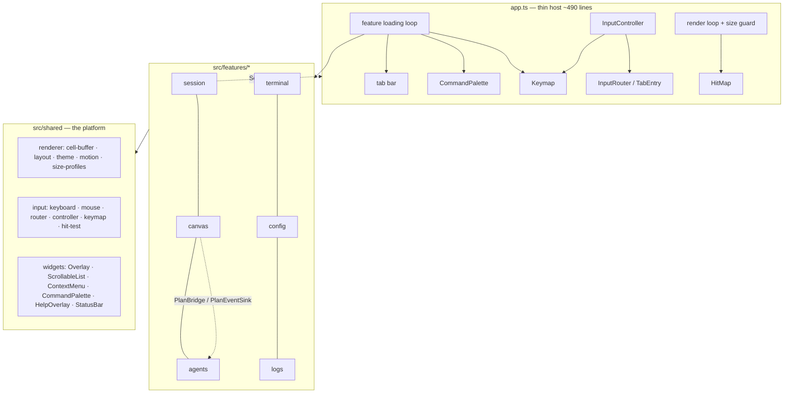

# FEATURE — UI Consolidation (ddd/09–11 implementation)

<!-- version: 1.0.0 -->
<!-- classification: FEATURE -->
<!-- date: 2026-07-07 -->
<!-- last-updated: 2026-07-07 -->

Implements `docs/ddd/09-gaps.md` (all sections), `10-optimizations.md` (P0–P4 + bucket B)
and `11-feature-isolation.md` (full Feature registry). Plan:
`specs/docs/approvedPlans/2026-07-04-ui-consolidation-studio.md`. Branch `feature/ui-consolidation`.

## 1. Architecture

**Legend:** solid = direct dependency · dashed = cross-feature service via `FeatureCtx.services`.

## 2. What changed per gap (docs/ddd/09-gaps.md)

| Gap | Resolution |
|---|---|
| 1–3 wheel/wrap/vim inconsistencies | One convention: wheel = viewport (×3 text panes, ×1 lists, never selection); clamp everywhere except Session slash-autocomplete (documented exception); Logs vim keys are keymap contributions (`when:'logs'`), listed in help |
| 4 ContextMenu lacks Esc + mouse | ContextMenu handles Escape and full mouse (items clickable, elsewhere dismisses) |
| 7 masking differs | One `maskSecret()` (`src/core/config/mask.ts`) |
| 8 modal duplication | One `Overlay` widget (sm/md/lg = 46/56/64) — all 5 modals migrated; CommandPalette stays bespoke by decision |
| 9 app.ts god object | 837 → ~490 lines: InputController + HitMap + Keymap + feature registry; new feature = one `registerFeature()` line |
| 10 split input pipeline | `TabEntry` routing — all six tabs first-class (capture-mouse semantics preserved for Config/Logs) |
| 11 version drift | `getVersion()` reads package.json — 4 drifted values removed |
| 12 no shared list | `ScrollableList` + `ListOptions {wrap, wheel, wheelStep}`; headless-capable |
| 15 DEFAULT_MAX_TOKENS | Model-aware `maxOutputTokens()` (claude 8192 / big-openai 16384 / 4096) |
| 17–19 accessibility | Glyph+text status everywhere (◎●✓✗⊘ + `[label]`), inverse-bold focused titles, high-contrast theme, reduced-motion toggle |
| 20–22 responsiveness | Draggable dividers (persisted ratios), size profiles (compact/standard/wide) with a guard screen below minimum |
| F6 unmapped (found during P3) | `\x1b[17~` added to keyboard.ts — Logs was unreachable by keyboard |

## 3. Usage

- `?` — help overlay listing every binding for the current tab (Global + tab sections).
- `Ctrl+P` — palette: theme (default/high-contrast), reduced motion, size profiles, help, features' commands.
- Config tab → **Interface** section — Enter/double-click cycles Theme / Reduced motion / Size profile.
- Drag the vertical border between Session and the right column, or the border between Orchestration and Agents — ratios persist to `~/.config/agentfactory/config.json` `settings`.
- Below the selected size profile's minimum the guard screen shows current vs required size; `Ctrl+Q`/palette still work.

## 4. Scenarios

1. **High-contrast at startup**: `settings.theme = "high-contrast"` → `setTheme` swaps the live `Colors` object; focus (yellow 226) is distinct from primary (cyan 51).
2. **Small terminal**: 60×20 with the default compact profile → guard screen (verified by `scripts/smoke-tui.sh` in a real tmux session).
3. **New feature**: implement `Feature` (tab + commands + keybindings + lifecycle), add one `registerFeature()` call — tab bar, palette, keymap and routing pick it up with zero other host edits.

## 5. Testing

413 vitest tests. Highlights: byte-level `InputController.handleData` tests (terminal bypass table, global keys, mouse routing); render-diff tests for Overlay/themes/guard; keymap context/suppression tests; `scripts/smoke-tui.sh` drives the real TUI in tmux (13 checks incl. the 60×20 guard).

## 6. Deliberate deviations / deferrals

- **Dirty-region rendering** (10-optimizations B): deferred — `CellBuffer.diff` already limits terminal writes to changed cells; buffer repaint cost is negligible at TUI scale. Revisit only if profiling shows otherwise.
- **Model picker list state** stays bespoke (async two-step flow); its frame/dismissal use Overlay.
- **Keymap remapping UI**: structure supports `settings.keymap.*`, UI not in scope.
