<!-- version: 1.0.0 -->
<!-- classification: SUMMARY -->
<!-- date: 2026-06-19 -->
<!-- last-updated: 2026-06-09 -->
<!-- status: ACTIVE -->
<!-- generated-by: scripts/docs-compile.sh -->

# FEATURES — Memorial (Descriptive Compendium)

> **Auto-generated** by `scripts/docs-compile.sh` — **do not edit by hand**.
> Edit the source docs in `features/` and re-run the script.
> Documents: **12** · ordered by creation date · each section links its source.

<a id="index"></a>
## Index

1. [Feature: Project Index](#d1) — `2026-04-26` — `.ai/project-index.yml` is a machine-readable YAML registry of every file in the · [[FEATURE-PROJECT-INDEX-2026-04-26]]
2. [Feature: Wave 0 — Scaffold](#d2) — `2026-04-26` — Establishes the complete foundational skeleton for `factory` — the agentfactory-harness CLI. · [[FEATURE-WAVE-0-SCAFFOLD-2026-04-26]]
3. [Feature: Wave 1 — Session + Agent Loop](#d3) — `2026-04-27` — Wires the Anthropic Claude API into the `factory` TUI. An async generator agent · [[FEATURE-WAVE-1-SESSION-2026-04-27]]
4. [Feature: Wave 2 — ITUI Mouse Canvas](#d4) — `2026-04-27` — Adds the interactive TUI (ITUI) canvas that is the defining visual feature of · [[FEATURE-WAVE-2-ITUI-CANVAS-2026-04-27]]
5. [agentfactory-gen Skill Creation Pipeline — Documentation](#d5) — `2026-05-01` — 1. [What agentfactory-gen is](#1-what-agentfactory-gen-is) · [[FEATURE-AGENTFACTORY-SKILL-PIPELINE-2026-05-01]]
6. [Feature: Wave 3 — DAG Orchestration Engine](#d6) — `2026-05-01` — Adds a parallel, dependency-aware plan execution engine to `factory`. You · [[FEATURE-WAVE-3-DAG-ORCHESTRATION-2026-05-01]]
7. [agentfactory-harness — System Architecture & Operational Reference](#d7) — `2026-05-18` — `factory` is a full-screen TypeScript TUI (Terminal User Interface) that acts as · [[FEATURE-SYSTEM-ARCHITECTURE-v0.4.0-2026-05-18]]
8. [Feature: Wave 4 — TerminalPanel / PTY Embed + Mouse Navigation](#d8) — `2026-05-18` — Wave 4 adds two major capabilities to the `factory` TUI: · [[FEATURE-WAVE-4-TERMINAL-PANEL-2026-05-18]]
9. [Feature: Tool Definitions, Token Flow & Chat Mode](#d9) — `2026-06-01` — Every message you send to a model carries more than your text. The agent loop · [[FEATURE-TOOLS-AND-TOKEN-FLOW-2026-06-01]]
10. [Logger Feature — AgentFactory Harness](#d10) — `2026-06-09` — Comprehensive logging system for debugging, monitoring, and auditing app behavior. · [[FEATURE-LOGGER-2026-06-09]]
11. [Feature: Live Logs Panel with Metrics Dashboard and Auto-Analysis](#d11) — `2026-06-09` — Complete operational and feature documentation for the Logs tab in AgentFactory Harness. · [[FEATURE-LOGS-PANEL-2026-06-09]]
12. [Feature: Wave 5 — Registry Auth + Prompt Bar Redesign](#d12) — `2026-06-09` — **Registry Authentication**: Log in to agentfactory.dev via device-code flow, authenticate · [[FEATURE-WAVE-5-REGISTRY-AUTH-2026-06-09]]

## Glossary

Term & acronym definitions: [GLOSSARY](../documentation/GLOSSARY.md) · [[GLOSSARY]]

---

<a id="d1"></a>

## 1 · 2026-04-26 · Feature: Project Index

Source: [FEATURE-PROJECT-INDEX-2026-04-26.md](FEATURE-PROJECT-INDEX-2026-04-26.md) · [[FEATURE-PROJECT-INDEX-2026-04-26]]  ·  [↑ Index](#index)

<!-- version: 1.0.0 -->
<!-- classification: FEATURE -->
<!-- date: 2026-04-26 -->
<!-- last-updated: 2026-06-19 -->

## What it does

`.ai/project-index.yml` is a machine-readable YAML registry of every file in the
`agentfactory-harness` repo — both implemented and planned. Agents (Claude, Gemini,
Codex) read it as first-stop context before any search, eliminating unnecessary directory
traversal. It is also queryable via `yq` for automation and CI tasks.

---

## Architecture

```
┌─────────────────────────────────────────────────────────────────────┐
│                       .ai/project-index.yml                         │
│                                                                     │
│  meta:                          ← version, wave, description        │
│    version / wave / description                                     │
│                                                                     │
│  tui_renderer:   [ ...entries ] ← section = top-level YAML key     │
│  tui_input:      [ ...entries ]                                     │
│  tui_panels:     [ ...entries ]                                     │
│  tui_widgets:    [ ...entries ]                                     │
│  core:           [ ...entries ]                                     │
│  orchestration:  [ ...entries ]                                     │
│  harness:        [ ...entries ]                                     │
│  registry:       [ ...entries ]                                     │
│  cli:            [ ...entries ]                                     │
│  governance:     [ ...entries ]                                     │
│  docs:           [ ...entries ]                                     │
│  config:         [ ...entries ]                                     │
│  maintenance:    { rules }      ← update contract (not file list)   │
└─────────────────────────────────────────────────────────────────────┘
          │
          │  referenced by
          ▼
┌──────────────────────────┐    ┌───────────────────────────────────┐
│  .ai/AgentFactory.md     │    │  .ai/adapters/claude/brief.md     │
│  § Project Index         │    │  Rule 8 — Search Index First      │
│  § Search Protocol       │    │  Key Files table (first row)      │
└──────────────────────────┘    └───────────────────────────────────┘
```

| Symbol | Meaning |
|--------|---------|
| `┌─┐└─┘│` | File or component boundary |
| `[ ...entries ]` | YAML sequence (list of file entry objects) |
| `{ rules }` | YAML mapping (key/value maintenance rules) |
| `──►` | Reference / dependency direction |

### Entry schema

Every entry in a section list conforms to this shape:

```yaml
- path: src/tui/renderer/cell-buffer.ts   # repo-relative path
  purpose: "One-line description"          # what the file does
  exports:                                 # key symbols (omitted for non-code)
    - "CellBuffer (class)"
    - "diff(prev: CellBuffer): string"
  wave: 0                                  # integer: which wave adds this file
  status: implemented                      # implemented | planned | stub
```

Governance and config entries use `version` instead of `wave` + `exports`:

```yaml
- path: .ai/AgentFactory.md
  purpose: "Master project brief"
  version: "1.1.0"
  status: implemented
```

---

## How it works

### Agent lookup flow

```
Agent session opens repo
         │
         ▼
  Read .ai/AgentFactory.md  ──► § Search Protocol instructs:
         │                        1. read .ai/project-index.yml first
         │                        2. locate the relevant section
         ▼                        3. read that file directly
  Read .ai/project-index.yml
         │
         ├── section: tui_renderer  ──► look for cell-buffer, ansi, layout, theme
         ├── section: core          ──► agent-loop, hooks, session, tools/*
         ├── section: governance    ──► rules, brief, milestones
         └── ...
         │
         ▼
  Read the specific file (path from YAML entry)
  No find, no grep, no tree walk needed
```

| Symbol | Meaning |
|--------|---------|
| `──►` | Leads to / references |
| `├──` | One of several parallel section options |
| `└──` | Final branch |

### yq query engine

Because entries are typed YAML, any yq-compatible tool can filter without custom parsing:

```bash
# All planned files in a specific wave
yq '.core[] | select(.status == "planned" and .wave == 1) | .path' \
  .ai/project-index.yml

# Every file implementing a specific export
yq '.. | select(type == "!!seq")[] | select(.exports != null) |
    select(.exports[] | contains("CellBuffer")) | .path' \
  .ai/project-index.yml

# Status summary across all sections
yq '[.. | select(type == "!!seq")[] | .status] | group_by(.) |
    map({(.[0]): length}) | add' \
  .ai/project-index.yml
```

### Maintenance contract

The `maintenance:` block at the bottom of the YAML encodes the update rules as data:

```yaml
maintenance:
  new_file: Add entry in the same commit, same PR
  rename_or_delete: Update path in the same commit
  wave_closes: "Flip status planned → implemented; bump meta.wave"
  version_bump: minor per wave, patch per single-file addition
```

This is enforced by Rule 3 (`doc-before-commit.md`) steps 5–6, which require index
updates as part of the pre-commit checklist.

---

## Usage

### Read the index before any file search

```bash
# In a terminal session or agent context
cat .ai/project-index.yml

# Jump directly to the renderer section
yq '.tui_renderer' .ai/project-index.yml
```

### Query planned work for the next wave

```bash
$ yq '[.[][] | select(.status == "planned" and .wave == 1) | .path]' \
    .ai/project-index.yml

# Expected output (Wave 1 targets):
- src/core/agent-loop.ts
- src/core/session.ts
- src/core/hooks.ts
- src/core/tools/index.ts
- src/core/tools/bash.ts
- src/core/tools/read.ts
- src/core/tools/write.ts
- src/core/tools/web-fetch.ts
- src/core/tools/agent.ts
- src/tui/panels/SessionPanel.ts
- src/tui/panels/AgentsPanel.ts
- src/tui/widgets/CommandPalette.ts
```

### Find a file's exports without opening it

```bash
$ yq '.tui_renderer[] | select(.path == "src/tui/renderer/cell-buffer.ts") |
    .exports[]' .ai/project-index.yml

# Expected output:
Cell (interface)
CellBuffer (class)
write(row, col, text, style)
fill(row, col, h, w, char, style)
diff(prev: CellBuffer): string
flush(): string
clone(): CellBuffer
```

### Update the index when adding a new file

```bash
# After creating src/core/agent-loop.ts in Wave 1:
# 1. Open .ai/project-index.yml
# 2. Locate the 'core:' section
# 3. Change status: planned → implemented for that entry
# 4. git add .ai/project-index.yml alongside the new source file
# 5. Commit both in the same commit (Rule 3 step 5)
```

---

## Test coverage

The project index is a static data file — there is no runtime code to unit-test.
Correctness is enforced by convention (Rule 3 checklist) and can be validated with:

```bash
# Validate YAML is well-formed
yq '.' .ai/project-index.yml > /dev/null && echo "valid"

# Check that every entry has required fields
yq '[.. | select(type == "!!seq")[] |
    select(.path == null or .purpose == null or .status == null) |
    .path // "MISSING PATH"] | length' .ai/project-index.yml
# Expected: 0  (no entries with missing required fields)

# Confirm all status values are in the allowed set
yq '[.. | select(type == "!!seq")[] | .status] | unique' \
  .ai/project-index.yml
# Expected: [implemented, planned, stub]
```

Not tested:
- Completeness (no automated check that every src/ file has an entry)
- Staleness detection (no check that `status: implemented` files actually exist)

These are candidates for a Wave 5 `factory doctor` extension.

---

## Scenario walkthroughs

### Scenario A — Agent opens repo cold, needs to find the cell-buffer renderer

```
Session start
     │
     ▼
Read .ai/AgentFactory.md  ──► "§ Search Protocol: read project-index.yml first"
     │
     ▼
Read .ai/project-index.yml
     │
     └── section: tui_renderer
              │
              ├── ansi.ts        status: implemented
              ├── cell-buffer.ts status: implemented  ◄── target found
              ├── layout.ts      status: implemented
              └── theme.ts       status: implemented
     │
     ▼
Read src/tui/renderer/cell-buffer.ts  (direct, no search)
```

| Symbol | Meaning |
|--------|---------|
| `──►` | Follows instruction or pointer |
| `└──` | Drills into section |
| `◄──` | Match found at this row |

1. Agent reads `AgentFactory.md` — §Search Protocol says to read `project-index.yml` first.
2. Agent opens `project-index.yml`, navigates to `tui_renderer` section.
3. Row with `path: src/tui/renderer/cell-buffer.ts` located — no `grep`, no `find`.
4. Agent reads that file directly by path.
5. Total extra files read: 2 (`AgentFactory.md` + `project-index.yml`) instead of exploring the full tree.

---

### Scenario B — Developer adds `src/core/agent-loop.ts` in Wave 1

```
implement agent-loop.ts
         │
         ▼
npm test passes
         │
         ▼
write docs/features/FEATURE-WAVE-1-SESSION-2026-04-27.md  (Rule 3)
         │
         ▼
open .ai/project-index.yml
         │
         └── core: section
                  │
                  └── agent-loop.ts entry
                           │
                           ├── status: planned  ──► change to: implemented
                           └── wave: 1          (unchanged)
         │
         ▼
git add src/core/agent-loop.ts  \
        docs/features/FEATURE-WAVE-1-SESSION-2026-04-27.md  > single commit
        .ai/project-index.yml          /
```

| Symbol | Meaning |
|--------|---------|
| `──►` | Field value change |
| `\` `>` `/` | Files grouped into one commit |

1. New file is written and tests pass.
2. Feature doc written (Rule 3 step 1–4).
3. Developer opens `project-index.yml`, finds the `agent-loop.ts` entry under `core:`.
4. `status: planned` flipped to `status: implemented`.
5. All three files staged and committed together — Rule 3 step 5 satisfied.

---

### Scenario C — Wave 1 closes (all files implemented)

```
Last Wave 1 file committed
         │
         ▼
open .ai/project-index.yml
         │
         ├── meta.wave: 0  ──► bump to: 1
         │
         └── every entry where wave == 1
                  │
                  └── status: planned  ──► implemented  (flip all)
         │
         ▼
git add .ai/project-index.yml
git commit "chore: wave 1 complete — flip index status"
```

| Symbol | Meaning |
|--------|---------|
| `──►` | Value update |
| `└──` | Applies to all matching entries |

1. All Wave 1 files are implemented and merged.
2. `meta.wave` in `project-index.yml` bumped from `0` to `1`.
3. All entries with `wave: 1` and `status: planned` flipped to `status: implemented`.
4. Index `version` minor-bumped (e.g., `1.0.0` → `1.1.0`).
5. Committed as a standalone governance commit on `main`.

---

## Known limitations

- **Manual maintenance only.** There is no script that auto-generates the index from
  the filesystem. A developer who skips step 5 of the Rule 3 checklist will leave the
  index stale.
- **No staleness detection.** `factory doctor` does not currently verify that
  `status: implemented` entries actually exist on disk.
- **No completeness check.** No automated scan confirms every `src/` file has an entry.
- **Exports list is hand-maintained.** Signatures in the `exports:` field are written
  by hand and can drift from the actual TypeScript signatures as code evolves.
- **yq availability assumed.** Queries shown in §Usage require `yq` (mikefarah/yq v4+).
  The index is still useful without it — read it as plain YAML.

---

<a id="d2"></a>

## 2 · 2026-04-26 · Feature: Wave 0 — Scaffold

Source: [FEATURE-WAVE-0-SCAFFOLD-2026-04-26.md](FEATURE-WAVE-0-SCAFFOLD-2026-04-26.md) · [[FEATURE-WAVE-0-SCAFFOLD-2026-04-26]]  ·  [↑ Index](#index)

<!-- version: 1.0.0 -->
<!-- classification: FEATURE -->
<!-- date: 2026-04-26 -->
<!-- last-updated: 2026-06-19 -->

## What it does

Establishes the complete foundational skeleton for `factory` — the agentfactory-harness CLI.
Wave 0 produces a runnable full-screen TUI with a static layout, a health-check command
(`factory doctor`), and all rendering primitives needed by later waves (cell-buffer,
ANSI sequences, layout engine, keyboard input, theming).

---

## Architecture

```
╔══════════════════════════════════════════════════════════════════════╗
║                        factory  (dist/index.js)                      ║
║                                                                      ║
║   ┌─────────────────────────────────────────────────────────────┐   ║
║   │  src/index.ts   — arg routing                               │   ║
║   │    subcommand? ──► commander (src/cli.ts)                   │   ║
║   │    no args?    ──► App.start()  (src/app.ts)                │   ║
║   └──────────────────────────┬──────────────────────────────────┘   ║
║                               │                                      ║
║          ┌────────────────────┼───────────────────────┐             ║
║          ▼                    ▼                        ▼             ║
║   ┌─────────────┐   ┌──────────────────┐   ┌────────────────────┐  ║
║   │  TUI Layer  │   │  Harness Layer   │   │   CLI Layer        │  ║
║   │             │   │                  │   │                    │  ║
║   │ renderer/   │   │ harness/doctor   │   │ cli.ts             │  ║
║   │  ansi.ts    │   │  runDoctor()     │   │  factory doctor    │  ║
║   │  theme.ts   │   │  printDoctor()   │   │  factory --version │  ║
║   │  cell-buf.  │   └──────────────────┘   └────────────────────┘  ║
║   │  layout.ts  │                                                    ║
║   │             │                                                    ║
║   │ input/      │                                                    ║
║   │  keyboard.ts│                                                    ║
║   │             │                                                    ║
║   │ panels/     │                                                    ║
║   │  Panel.ts   │                                                    ║
║   │  StatusBar  │                                                    ║
║   └─────────────┘                                                    ║
╚══════════════════════════════════════════════════════════════════════╝
```

| Symbol | Meaning |
|--------|---------|
| `╔═╗╚╝║` | Double-line box — top-level binary / layer boundary |
| `┌─┐└┘│` | Single-line box — module or class |
| `──►` | Control or data flow direction |
| `▼` | Downward data flow |

### Key files

| File | Role |
|------|------|
| `src/index.ts` | Entry point — arg routing |
| `src/cli.ts` | Commander subcommands (`doctor`, `--version`) |
| `src/app.ts` | `App` class — render loop, input loop, terminal lifecycle |
| `src/tui/renderer/ansi.ts` | Raw ANSI sequence builders |
| `src/tui/renderer/cell-buffer.ts` | `CellBuffer` — `Cell[][]`, `write`, `diff`, `flush`, `clone` |
| `src/tui/renderer/layout.ts` | `computeLayout()`, `drawBorder()`, `Rect` type |
| `src/tui/renderer/theme.ts` | Color palette, box-drawing char sets |
| `src/tui/input/keyboard.ts` | Raw stdin → `KeyEvent` |
| `src/tui/panels/Panel.ts` | Abstract panel base class |
| `src/tui/panels/StatusBar.ts` | `renderStatusBar()` — bottom status line |
| `src/harness/doctor.ts` | `runDoctor()`, `printDoctorReport()` |

---

## How it works

### Rendering pipeline

Every screen update passes through three stages:

```
┌──────────────────┐     write()     ┌──────────────────┐
│   App.render()   │ ──────────────► │  CellBuffer      │
│  (current frame) │                 │  (next frame)    │
└──────────────────┘                 └────────┬─────────┘
                                              │ diff(prev)
                                              ▼
                                    ┌──────────────────┐
                                    │  ANSI string     │  only changed cells
                                    └────────┬─────────┘
                                              │ process.stdout.write()
                                              ▼
                                    ┌──────────────────┐
                                    │  Terminal screen │
                                    └──────────────────┘
```

| Symbol | Meaning |
|--------|---------|
| `──►` | Method call or data flow |
| `▼` | Downward continuation |
| `diff(prev)` | Compares current `Cell[][]` against previous frame; emits ANSI only for changed cells |

`CellBuffer.diff(prev)` iterates every `[row][col]`, compares `char + fg + bg + bold`, and emits `\033[row;colH` + SGR codes only for dirty cells. This minimises stdout writes and eliminates flicker without double-buffering at the OS level.

### Layout computation

```
┌─────────────────────────────────────────────────────────┐
│  Terminal  cols × rows  (updated on SIGWINCH)           │
│                                                         │
│  ┌──────────────────────────────────────────────────┐  │
│  │  Tab bar  (row 0, full width)                     │  │
│  ├────────────────────────┬─────────────────────────┤  │
│  │  Session Panel         │  Canvas Panel           │  │
│  │  (40% width)           │  (60% width, top 70%)   │  │
│  │                        ├─────────────────────────┤  │
│  │                        │  Agents Panel           │  │
│  │                        │  (60% width, bot 30%)   │  │
│  ├────────────────────────┴─────────────────────────┤  │
│  │  Status Bar  (last row, full width)               │  │
│  └──────────────────────────────────────────────────┘  │
└─────────────────────────────────────────────────────────┘
```

| Symbol | Meaning |
|--------|---------|
| `┌─┐└┘│├┤` | Panel boundary |
| `40% / 60%` | Width split from `computeLayout(rows, cols)` |
| `top 70% / bot 30%` | Canvas/Agents height split within right column |

`computeLayout` returns a `PanelLayout` record of `Rect` values (`{ row, col, height, width }`). Every caller receives `Rect` directly — no global state.

### Terminal lifecycle

`App.start()` owns the full terminal state lifecycle:

```
start()
  │
  ├── write( enterAltScreen )       \033[?1049h   — switch to alt screen buffer
  ├── write( enableMouse )          \033[?1000h\033[?1002h\033[?1006h
  ├── stdin.setRawMode(true)        — capture every keypress uncooked
  ├── process.on('SIGWINCH', ...)   — resize handler
  ├── process.on('SIGINT',  ...)    — Ctrl+C → stop()
  │
  ├── render()                      — first paint
  │
  └── listenInput()
        │
        ├── Tab          → cycle focused panel (0–3)
        ├── 1/2/3/4      → jump to panel index
        ├── q / Ctrl+Q   → stop()
        └── (other)      → dispatch to focused panel (Wave 1+)

stop()
  ├── write( disableMouse )         \033[?1000l
  ├── write( exitAltScreen )        \033[?1049l   — restore original screen
  └── process.exit(0)
```

| Symbol | Meaning |
|--------|---------|
| `├──` | Sequential step |
| `└──` | Final step / branch |
| `\033[...]` | ANSI escape sequence |

### Doctor check

`runDoctor(cwd)` runs five checks synchronously and returns `CheckResult[]`:

```
┌───────────────────────────────────────────────────────┐
│  runDoctor(cwd)                                       │
│                                                       │
│  ① Node.js ≥ 20 ?    process.version semver check    │
│  ② API key set?      ANTHROPIC_API_KEY env var        │
│  ③ Token file?       ~/.agentfactory/token existsSync │
│  ④ .ai/ harness?     existsSync(cwd + '/.ai')        │
│  ⑤ CLAUDE.md?        existsSync(cwd + '/CLAUDE.md')  │
│                                                       │
│  → CheckResult[]  { label, ok, detail }               │
└───────────────────────────────────────────────────────┘
         │
         ▼
  printDoctorReport()
    ✓ / ✗  colored table   →  stdout
    "N/M checks passed"    →  stdout
```

| Symbol | Meaning |
|--------|---------|
| `①–⑤` | Sequential check index |
| `→` | Return value or output |
| `✓ / ✗` | Pass / fail indicator in terminal output |

---

## Usage

### Launch the full-screen TUI

```bash
$ factory
```

Expected result: terminal switches to alt-screen, renders four panels with borders and
placeholder text, status bar at bottom. `Tab` cycles focus, `1`–`4` jump to a panel,
`q` or `Ctrl+Q` exits and restores the original terminal.

### Run health check

```bash
$ factory doctor
```

Expected output (all passing):

```
  ✓  Node.js ≥ 20       v22.1.0
  ✓  ANTHROPIC_API_KEY  set
  ✗  Token file         ~/.agentfactory/token not found
  ○  .ai/ harness       not present (optional for Wave 0)
  ✓  CLAUDE.md          present

  4/5 checks passed
```

### Print version

```bash
$ factory --version
# or
$ factory -v
# Output: 0.1.0
```

### Build

```bash
$ npm run build
# tsup compiles src/index.ts → dist/index.js (ESM, with .d.ts)

$ node dist/index.js --version
# 0.1.0
```

### Run tests

```bash
$ npm test
# vitest runs src/tui/renderer/cell-buffer.test.ts
# Expected: 4 tests pass
```

---

## Test coverage

**Test file:** `src/tui/renderer/cell-buffer.test.ts`

| Test | What it verifies |
|------|-----------------|
| `writes a string at given position` | `write()` + `diff()` produces ANSI output containing the written chars |
| `clips writes outside bounds` | Out-of-bounds writes don't throw; buffer stays intact |
| `clone produces independent copy` | Mutating original after `clone()` doesn't affect the clone |
| `diff returns empty string when buffers are identical` | No ANSI output when no cells changed |

**Run:**
```bash
$ npm test
```

**Not yet tested:**
- `CellBuffer.flush()` (full repaint path)
- `CellBuffer.fill()` (rectangle fill)
- `computeLayout()` and `drawBorder()` (layout engine)
- `parseKey()` (keyboard parser)
- `runDoctor()` (requires filesystem mocking)
- `App` class (requires a real or mocked TTY)

---

## Known limitations

- **Mouse events are parsed but not dispatched.** `App.listenInput()` drops mouse input bytes (`\033[<` prefix) — the SGR mouse parser (`src/tui/input/mouse.ts`) is stubbed for Wave 2.
- **Panels are static placeholders.** `SessionPanel`, `OrchestrationCanvas`, `AgentsPanel`, and `TerminalPanel` render placeholder text only — full implementations arrive in Waves 1–4.
- **VT100 passthrough is absent.** `TerminalPanel` has no `node-pty` integration in Wave 0.
- **No Claude API connection.** `agent-loop.ts` is not present; the API key check in `doctor` is informational only.
- **`factory doctor` token check always fails** unless `~/.agentfactory/token` has been manually created. This is expected — registry auth is Wave 5.
- **Test coverage is limited to `CellBuffer`.** The layout, input, and doctor modules have zero test coverage in Wave 0; Wave 1 should add them.

---

<a id="d3"></a>

## 3 · 2026-04-27 · Feature: Wave 1 — Session + Agent Loop

Source: [FEATURE-WAVE-1-SESSION-2026-04-27.md](FEATURE-WAVE-1-SESSION-2026-04-27.md) · [[FEATURE-WAVE-1-SESSION-2026-04-27]]  ·  [↑ Index](#index)

<!-- version: 1.0.0 -->
<!-- classification: FEATURE -->
<!-- date: 2026-04-27 -->
<!-- last-updated: 2026-06-19 -->

## What it does

Wires the Anthropic Claude API into the `factory` TUI. An async generator agent
loop streams Claude responses turn-by-turn, dispatches tool calls, and surfaces
all events to the `SessionPanel` for live rendering. Wave 1 also registers four
built-in tools (Bash, Read, Write, WebFetch) and a lifecycle hook system.

---

## Architecture

```
╔══════════════════════════════════════════════════════════════════════╗
║                     factory — Wave 1 layers                         ║
║                                                                      ║
║  ┌─────────────────────────────────────────────────────────────┐    ║
║  │  src/app.ts   — registers tools, wires SessionPanel         │    ║
║  └────────┬───────────────────────┬───────────────────────────┘    ║
║           │                       │                                  ║
║           ▼                       ▼                                  ║
║  ┌─────────────────┐   ┌───────────────────────────────────────┐    ║
║  │  TUI Layer      │   │  Core Layer                           │    ║
║  │                 │   │                                       │    ║
║  │ SessionPanel.ts │◄──│ agent-loop.ts  (async generator)      │    ║
║  │   ┌─────────┐   │   │ session.ts     (history + tokens)     │    ║
║  │   │scrollbk │   │   │ hooks.ts       (shell hook runner)    │    ║
║  │   │input bar│   │   │ tools/index.ts (registry + dispatch)  │    ║
║  │   └─────────┘   │   │ tools/bash.ts  BashTool               │    ║
║  │                 │   │ tools/read.ts  ReadTool                │    ║
║  │ AgentsPanel.ts  │   │ tools/write.ts WriteTool               │    ║
║  └─────────────────┘   │ tools/web-fetch.ts WebFetchTool        │    ║
║                         └───────────────────────────────────────┘    ║
╚══════════════════════════════════════════════════════════════════════╝
```

| Symbol | Meaning |
|--------|---------|
| `╔═╗╚╝║` | Double-line box — top-level binary / layer boundary |
| `┌─┐└┘│` | Single-line box — module or class |
| `◄──` | Data flow direction |
| `▼` | Downward control flow |

### Key files

| File | Role |
|------|------|
| `src/core/agent-loop.ts` | `async function* agentLoop(...)` — streaming Claude loop |
| `src/core/session.ts` | `Session` class — history, tokenCount, clear |
| `src/core/hooks.ts` | `runHook(event, ctx)` — shell hook runner |
| `src/core/tools/index.ts` | Tool registry: `registerTool`, `dispatch`, `listTools` |
| `src/core/tools/bash.ts` | `BashTool` — exec with timeout |
| `src/core/tools/read.ts` | `ReadTool` — fs.readFile |
| `src/core/tools/write.ts` | `WriteTool` — fs.writeFile |
| `src/core/tools/web-fetch.ts` | `WebFetchTool` — fetch + text |
| `src/tui/panels/SessionPanel.ts` | Chat panel — scrollback + input bar |
| `src/tui/panels/AgentsPanel.ts` | Agent list sidebar — status badges |

---

## How it works

### Agent loop: streaming and accumulation

```
┌─────────────────────────────────────────────────────────────────────┐
│  agentLoop(session, opts)    async function* generator              │
│                                                                     │
│  while (turns < maxTurns && !signal.aborted)                       │
│  │                                                                  │
│  ├── client.messages.create({ stream: true })                      │
│  │      │                                                           │
│  │      │  content_block_start (tool_use)                          │
│  │      │    → yield { type: 'tool_start', name, id }              │
│  │      │                                                           │
│  │      │  content_block_delta (text_delta)                        │
│  │      │    → textAccum += text                                    │
│  │      │    → yield { type: 'text_delta', delta }                 │
│  │      │                                                           │
│  │      │  content_block_delta (input_json_delta)                  │
│  │      │    → block.inputAccum += partial_json    ← accumulate    │
│  │      │      (NOT parsed until content_block_stop)               │
│  │      │                                                           │
│  │      │  content_block_stop                                      │
│  │      │    → JSON.parse(block.inputAccum)   ← parse once        │
│  │      │    → dispatch(block.name, parsedInput)                    │
│  │      │    → yield { type: 'tool_result', id, content }         │
│  │      │                                                           │
│  │      └── message_delta → stopReason                             │
│  │                                                                  │
│  ├── session.addMessage({ role: 'assistant', content: [...] })     │
│  ├── yield { type: 'turn_end', stop_reason }                       │
│  │                                                                  │
│  ├── if stop_reason == 'end_turn' → break                          │
│  └── else: add tool_results, turns++, loop                         │
└─────────────────────────────────────────────────────────────────────┘
```

| Symbol | Meaning |
|--------|---------|
| `├──` | Sequential step in the loop body |
| `└──` | Final step / exit |
| `→ yield` | Generator yield point — caller receives event |
| `← accumulate / ← parse once` | The two-phase delta accumulation pattern |

**Why accumulate deltas?** The API sends `input_json_delta` events with raw JSON
*fragments* — each chunk is not valid JSON on its own. Attempting to parse each delta
would throw on every event. The correct pattern: accumulate all `partial_json` strings
into one buffer per tool block, then call `JSON.parse` exactly once at `content_block_stop`.

### Tool dispatch: concurrency partitioning

```
┌───────────────────────────────────────────────────────────────────┐
│  Tool calls collected in one streaming response                    │
│                                                                   │
│  ┌─────────────┐  ┌─────────────────────────────────────────┐    │
│  │ concurrent  │  │ serial                                  │    │
│  │             │  │                                         │    │
│  │ ReadTool ●  │  │ BashTool ●  WriteTool ●  AgentTool ●   │    │
│  │ WebFetchTool│  │ (run one at a time, in order)           │    │
│  │             │  │                                         │    │
│  │ → Promise.  │  │ → await dispatch() for each, serially  │    │
│  │   allSettled│  │                                         │    │
│  └─────────────┘  └─────────────────────────────────────────┘    │
└───────────────────────────────────────────────────────────────────┘
```

| Symbol | Meaning |
|--------|---------|
| `●` | Tool instance (input port in the dispatch pipeline) |
| `→ Promise.allSettled` | Concurrent tools run in parallel, failures isolated |
| `→ await dispatch() serially` | Destructive tools run one at a time |

> Note: Wave 1 dispatches all tool calls serially for correctness. The
> concurrency field is set on each tool and will be used in Wave 1.1 to
> fan out safe tools.

### Hook system

```
┌───────────────────────────────────────────────────────────────────┐
│  runHook(event, ctx, cwd)                                         │
│                                                                   │
│  hookPath = cwd + '/.ai/hooks/' + event + '.sh'                  │
│                                                                   │
│  existsSync(hookPath)?  ──No──► { continue: true }               │
│       │                                                           │
│       Yes                                                         │
│       │                                                           │
│  execFileAsync(hookPath, env={ HOOK_CTX: JSON.stringify(ctx) })  │
│       │                                                           │
│  exit 0 ──────────────────────► { continue: true }               │
│       │                                                           │
│  exit ≠ 0                                                         │
│       │                                                           │
│  event == 'PreToolUse'? ──Yes──► { continue: false }  ← abort   │
│       │                                                           │
│       No ─────────────────────► { continue: true }   ← log only │
└───────────────────────────────────────────────────────────────────┘
```

| Symbol | Meaning |
|--------|---------|
| `──No──►` | Condition branch — false path |
| `──Yes──►` | Condition branch — true path |
| `← abort` | Hook blocks tool execution |
| `← log only` | Non-PreToolUse hooks can't abort |

Hook events: `PreToolUse`, `PostToolUse`, `SessionStart`, `SessionStop`,
`StepStart`, `StepComplete`. Hook scripts receive context as `$HOOK_CTX` (JSON string).

### SessionPanel layout

```
┌─ Session ──────────────────────────────────────────────────────────┐
│                                                                     │
│  line 0: system  "factory v0.2.0 — type a message or /help"        │
│  line 1: user    "> hello claude"                                   │
│  line 2: asst    "Hello! How can I help you today?"                 │
│  line 3: system  "  tool: Bash"                                     │
│  line 4: system  "  → ls output preview..."                         │
│  ...                                                                │
│  [scrollback — arrow_up/down to scroll]                            │
│─────────────────────────────────────────────────────────────────── │
│  > _ [input bar — last row of inner rect]                          │
└────────────────────────────────────────────────────────────────────┘
```

| Symbol | Meaning |
|--------|---------|
| `┌─┐└┘│` | Panel border (drawn by `drawBorder` in Wave 0) |
| `─── ` | Visual divider between scrollback and input bar |
| `> _` | User input prompt with cursor |

Text roles and colours: `user` = accent (blue), `assistant` = text (default),
`system` = textDim (grey). Long lines word-wrap to panel width.

---

## Usage

### Launch factory and start a session

```bash
$ factory
# Full TUI opens. Press 1 or Tab to focus the Session panel.
# Type a message and press Enter — Claude streams the reply live.
# Type /help for available slash commands.
# Press Ctrl+Q to exit.
```

### Available slash commands

```bash
/help     # Show available commands
/clear    # Reset session history and scrollback
/tokens   # Print approximate token count for current session
```

### Environment setup

```bash
# Required: Anthropic API key
export ANTHROPIC_API_KEY=sk-ant-...

# Run the TUI
$ factory

# Or run health check
$ factory doctor
```

### Run tests

```bash
$ npm test
# 23 tests across 5 files — all must pass
```

### Build

```bash
$ npm run build
# tsup compiles src/index.ts → dist/index.js
$ node dist/index.js --version
# 0.2.0
```

---

## Test coverage

**Test files:**

| File | Tests | What is covered |
|------|-------|----------------|
| `src/core/session.test.ts` | 6 | history ordering, tokenCount, clear |
| `src/core/agent-loop.test.ts` | 4 | text_delta stream, turn_end, history mutation, AbortSignal |
| `src/core/tools/bash.test.ts` | 5 | exec, non-zero exit, stderr, Zod validation, concurrent flag |
| `src/core/tools/read.test.ts` | 4 | read file, missing file, Zod validation, concurrent flag |
| `src/tui/renderer/cell-buffer.test.ts` | 4 | (carried from Wave 0) |

**Not yet tested:**
- `runHook()` (requires filesystem + execFile mocking)
- `SessionPanel` (requires a real or mocked TTY)
- `AgentsPanel.render()` (requires CellBuffer test harness)
- `WebFetchTool` (requires network or `fetch` mock)
- `WriteTool` (side-effectful — tested manually)
- Multi-turn tool loop in `agentLoop` (integration test, deferred to Wave 1.1)

---

## Known limitations

- **Single session only.** `AgentsPanel` is a static list showing one entry. Multiple
  concurrent agent sessions require a session registry (Wave 3).
- **No streaming abort from UI.** The `AbortController` signal path is implemented in
  `agentLoop` and tested, but the TUI has no keybind to trigger it yet.
- **Slash command set is minimal.** Only `/help`, `/clear`, `/tokens`. `/run <plan>`
  and `/spawn <agent>` require Wave 3 (DAG executor).
- **Tool dispatch is serial.** All tools run one at a time in Wave 1. Concurrent
  fan-out for `concurrent: true` tools is deferred to Wave 1.1.
- **No prompt caching.** The `cache_control` block is not attached to system messages
  yet — deferred until token usage becomes significant.
- **`q` no longer exits.** Wave 1 routes `q` to the focused SessionPanel as a literal
  character input. Use `Ctrl+Q` or `Ctrl+C` to quit.

---

<a id="d4"></a>

## 4 · 2026-04-27 · Feature: Wave 2 — ITUI Mouse Canvas

Source: [FEATURE-WAVE-2-ITUI-CANVAS-2026-04-27.md](FEATURE-WAVE-2-ITUI-CANVAS-2026-04-27.md) · [[FEATURE-WAVE-2-ITUI-CANVAS-2026-04-27]]  ·  [↑ Index](#index)

<!-- version: 1.0.0 -->
<!-- classification: FEATURE -->
<!-- date: 2026-04-27 -->
<!-- last-updated: 2026-06-19 -->

## What it does

Adds the interactive TUI (ITUI) canvas that is the defining visual feature of
agentfactory-harness: mouse-driven agent block dragging with snap-to-grid, L-shaped
wire routing between output and input ports, and a right-click context menu. The SGR
mouse parser and `InputRouter` provide the input foundation for all future interactive
panels.

---

## Architecture

```
╔══════════════════════════════════════════════════════════════════════╗
║                     factory — Wave 2 layers                         ║
║                                                                      ║
║  ┌─────────────────────────────────────────────────────────────┐    ║
║  │  src/app.ts  — wires parseMouse + InputRouter              │    ║
║  └────────┬────────────────────────────────────────────────────┘    ║
║           │ stdin raw bytes                                          ║
║           ▼                                                          ║
║  ┌────────────────────┐   ┌──────────────────────────────────────┐  ║
║  │  Input Layer       │   │  Canvas Layer                        │  ║
║  │                    │   │                                      │  ║
║  │  mouse.ts          │──►│  OrchestrationCanvas.ts              │  ║
║  │  parseMouse()      │   │    ├── hitTestHeader()  (drag start) │  ║
║  │  keyboard.ts       │   │    ├── handleMouseMove() (ghost)     │  ║
║  │  parseKey()        │   │    ├── handleLeftRelease() (snap)    │  ║
║  │                    │   │    └── openContextMenu() (right-clk) │  ║
║  │  router.ts         │   │                                      │  ║
║  │  InputRouter       │   │  widgets/Block.ts  renderBlock()     │  ║
║  │  dispatch()        │   │  widgets/Wire.ts   routeWire()       │  ║
║  └────────────────────┘   │  widgets/ContextMenu.ts              │  ║
║                           └──────────────────────────────────────┘  ║
╚══════════════════════════════════════════════════════════════════════╝
```

| Symbol | Meaning |
|--------|---------|
| `╔═╗╚╝║` | Double-line box — top-level layer boundary |
| `┌─┐└┘│` | Single-line box — module |
| `──►` | Data flow direction |
| `├──` | Component within a module |

### Key files

| File | Role |
|------|------|
| `src/tui/input/mouse.ts` | `parseMouse(data)` — Buffer → `MouseEvent \| null` |
| `src/tui/input/router.ts` | `InputRouter.dispatch()` — routes key/mouse to panels |
| `src/tui/widgets/Block.ts` | `renderBlock()` — double-line box with ports and status badge |
| `src/tui/widgets/Wire.ts` | `routeWire(from, to)` — L-shaped path as `WirePoint[]` |
| `src/tui/widgets/ContextMenu.ts` | `ContextMenu` — popup menu with keyboard nav |
| `src/tui/panels/OrchestrationCanvas.ts` | Full drag-drop canvas — state machine + rendering |

---

## How it works

### Mouse input: SGR protocol parsing

```
┌──────────────────────────────────────────────────────────────────┐
│  stdin raw bytes arrive (same stream as keyboard)                │
│                                                                  │
│  str.startsWith('\x1b[<') ?                                      │
│           │                                                      │
│    No ────┤──► parseKey()    — keyboard event                    │
│           │                                                      │
│    Yes ───┤──► parseMouse()                                      │
│                │                                                 │
│                │  Parse: \033[< {flags} ; {col} ; {row} M/m     │
│                │                                                 │
│                │  flags bits:                                    │
│                │    0-1  → button (0=left 1=mid 2=right)        │
│                │    2    → shift                                 │
│                │    3    → alt                                   │
│                │    4    → ctrl                                  │
│                │    5    → motion (held+moved)                   │
│                │    6    → scroll wheel                          │
│                │                                                 │
│                │  M=press m=release                              │
│                │  coords: 1-based → 0-based (subtract 1)        │
│                │                                                 │
│                └──► MouseEvent { button, action, row, col, ... }│
└──────────────────────────────────────────────────────────────────┘
```

| Symbol | Meaning |
|--------|---------|
| `──►` | Code path taken |
| `M/m` | Terminal character suffix — M=press, m=release |
| `0-based` | Convert at parse boundary; all downstream code uses 0-based coords |

### Drag state machine

```
┌─────────────────────────────────────────────────────────────────────┐
│  OrchestrationCanvas drag state machine                             │
│                                                                     │
│         ╭────────────────────────────────────────────╮             │
│         │              IDLE                          │             │
│         ╰─────────────────────┬──────────────────────╯             │
│                               │                                     │
│                  left-press on block header                        │
│                  → record blockId + offset                         │
│                               │                                     │
│                               ▼                                     │
│         ╭────────────────────────────────────────────╮             │
│         │           DRAGGING                         │             │
│         │  blockId: string                           │             │
│         │  offsetRow: number   offsetCol: number     │             │
│         ╰───┬──────────────────┬──────────────────┬──╯             │
│             │                  │                  │                │
│        mousemove          escape/q          mouseup               │
│             │                  │                  │                │
│       render ghost        cancel drag       snap to grid          │
│       at cursor−offset    → IDLE            → IDLE                │
│                                              update block.row/col  │
└─────────────────────────────────────────────────────────────────────┘
```

| Symbol | Meaning |
|--------|---------|
| `╭─╮╰─╯` | State node |
| `▼` | Transition direction |
| `→ IDLE` | State returns to idle |

**Grid snap formula:**
```typescript
row: Math.max(0, Math.round(rawRow / 2) * 2)
col: Math.max(0, Math.round(rawCol / 4) * 4)
```

### Wire routing algorithm

```
┌───────────────────────────────────────────────────────────────────┐
│  routeWire(from, to) — L-shaped path                              │
│                                                                   │
│  same row? ──Yes──► horizontal straight line from→to             │
│       │                                                           │
│       No                                                          │
│       │                                                           │
│  midCol = from.col + floor((to.col - from.col) / 2)              │
│                                                                   │
│  ① horizontal: from.col ──── midCol     (row = from.row)         │
│  ② corner ╮ or ╯ at (from.row, midCol)                           │
│  ③ vertical: from.row → to.row          (col = midCol)            │
│  ④ corner ╰ or ╭ at (to.row, midCol)                             │
│  ⑤ horizontal: midCol ──── to.col ►     (row = to.row)           │
│                                         (last char = ► or ◄)    │
└───────────────────────────────────────────────────────────────────┘
```

| Symbol | Meaning |
|--------|---------|
| `──Yes──►` | Branch path |
| `①–⑤` | Ordered path segment |
| `► / ◄` | Arrow head at destination |
| `╮ ╯ ╰ ╭` | Corner characters chosen by direction |

### InputRouter: panel hit testing

```
┌──────────────────────────────────────────────────────────────────┐
│  InputRouter.dispatch(event, panels, focusedIdx)                 │
│                                                                  │
│  KeyEvent?  ──Yes──► panels[focusedIdx].onKey(event)            │
│      │                                                           │
│      No (MouseEvent)                                             │
│      │                                                           │
│  for each panel:                                                 │
│    panel.rect contains event.{row, col}?                         │
│        │                                                         │
│        Yes ──► panel.onMouse(event) → return true               │
│        │                                                         │
│        No  ──► next panel                                        │
│                                                                  │
│  No panel matched → return false                                │
└──────────────────────────────────────────────────────────────────┘
```

| Symbol | Meaning |
|--------|---------|
| `──Yes──►` | Branch — condition met |
| `──►` | Method call / data flow |

Mouse events are dispatched to whichever panel's rect contains the click —
regardless of which tab is focused. This means right-clicking on the canvas
while the session panel is focused still opens the canvas context menu.

---

## Usage

### Launch and interact with the canvas

```bash
$ factory
# Press 2 or Tab to Tab focus the Orchestration panel.
# Right-click → "Add agent block" to create a block at cursor position.
# Left-click on block header → drag block to new position.
# Release → block snaps to 2×4 grid.
# Right-click on block → "Open session" or "Delete block".
# Escape → close context menu.
```

### Inspect wire routing manually

```bash
$ node -e "
import { routeWire } from './dist/tui/widgets/Wire.js'
const pts = routeWire({ row: 1, col: 2 }, { row: 4, col: 12 })
console.log(pts.map(p => \`(\${p.row},\${p.col}) \${p.char}\`).join('\\n'))
"
```

### Run tests

```bash
$ npm test
# 46 tests across 8 files — all must pass
```

---

## Test coverage

| File | Tests | What is covered |
|------|-------|----------------|
| `src/tui/input/mouse.test.ts` | 11 | left/right/middle press+release, scroll, motion, modifier bits, 1→0 coord conversion |
| `src/tui/widgets/wire.test.ts` | 6 | same row, L-shape, right-to-left, arrow char, no duplicate cells |
| `src/tui/panels/orchestration-canvas.test.ts` | 6 | state load, drag start on header, no drag on body, snap-to-grid, context menu add block, out-of-bounds click |

**Not yet tested:**
- `renderBlock()` visual output (requires CellBuffer snapshot test)
- `ContextMenu.render()` (requires TTY harness)
- Wire rendering onto canvas (integration, deferred to Wave 2.1)
- Wiring two blocks by clicking ports (pointer-to-port detection, Wave 2.1)
- Scroll wheel panning of canvas viewport (Wave 2.1)

---

## Known limitations

- **No wire creation from UI.** `CanvasWire` entries can be loaded via `loadState()` and
  are rendered, but the user cannot yet draw wires interactively. Port-click detection
  and drag-to-wire is Wave 2.1.
- **No canvas scrolling.** The inner rect is the full viewport. Pan/zoom is Wave 2.1.
- **Context menu is dismissed on any press.** Clicking outside the menu before confirming
  an item closes it immediately — this is intentional for Wave 2 simplicity.
- **No block resize.** Block dimensions are fixed at creation (5 rows × 18 cols).
- **Ghost renders on top of real block.** During drag the ghost and the original occupy
  the same position until `mousemove` fires. This is a visual glitch that clears on the
  first move event.

---

<a id="d5"></a>

## 5 · 2026-05-01 · agentfactory-gen Skill Creation Pipeline — Documentation

Source: [FEATURE-AGENTFACTORY-SKILL-PIPELINE-2026-05-01.md](FEATURE-AGENTFACTORY-SKILL-PIPELINE-2026-05-01.md) · [[FEATURE-AGENTFACTORY-SKILL-PIPELINE-2026-05-01]]  ·  [↑ Index](#index)


> Full account of how to create a reusable skill through the `agentfactory-gen` CLI,
> with expanded gap analysis: context, workflow failure paths, and Mermaid diagrams
> for each of the 10 CLI gaps discovered during the `security-review` skill build.

---

## Table of Contents

1. [What agentfactory-gen is](#1-what-agentfactory-gen-is)
2. [CLI Command Reference](#2-cli-command-reference)
3. [Full Skill Creation Workflow](#3-full-skill-creation-workflow)
4. [The security-review Skill as a Concrete Example](#4-the-security-review-skill-as-a-concrete-example)
5. [File Structure Reference](#5-file-structure-reference)
6. [CLI Gaps: Expanded Analysis](#6-cli-gaps-expanded-analysis)
7. [Known Limitations](#7-known-limitations)

---

## 1. What agentfactory-gen is

`agentfactory-gen` (installed via pip) is an **agent lifecycle manager** — it handles:

- Scaffolding the agent directory structure
- Registering agents and skills in `agent-manifest.json`
- Recompiling adapter briefs (`CLAUDE.md`, etc.) from the `.ai/` state
- Auditing agent integrity
- Bundling and publishing agents

It is **NOT** a skill authoring tool. It does not generate `SKILL.md` content,
reference files, or procedural steps. All authoring is manual.

---

## 2. CLI Command Reference

```
agentfactory-gen [OPTIONS] COMMAND [ARGS]

Commands:
  adapter       Manage CLI adapters (activate, rewire, recompile briefs)
  audit         Check an agent for integrity drift and missing metadata
  brief         Recompile all active adapter briefs → CLAUDE.md
  deploy        Deploy a new agent directory and initialise its manifest
  describe      Update agent metadata (description, orchestration plan)
  import        Unpack a portable agent bundle and register it
  import-skill  Import a standalone skill into an existing agent or root
  init          Initialize the AgentFactory harness in a project
  publish       Upload a wrapped agent to the public registry
  retrofit      Ingest and standardize an existing agent directory
  uninstall     Remove an agent and its registration
  wrap          Validate and bundle an agent into a portable .zip
```

Key flags:
- `deploy NAME` — creates `agents/<name>/{skills,commands,docs,scripts,orchestration}/` + `agent-manifest.json`
- `import-skill PATH [--to AGENT]` — registers a skill directory into an existing agent
- `brief` — recompiles all adapter briefs; call after any structural change
- `audit NAME` — verifies agent integrity (manifest completeness, file presence)

---

## 3. Full Skill Creation Workflow

```
┌─────────────────────────────────────────────────────────────────────────┐
│                   agentfactory-gen Skill Pipeline                       │
└─────────────────────────────────────────────────────────────────────────┘

  Step 1                    Step 2                     Step 3
  ──────                    ──────                     ──────
  agentfactory-gen          Author SKILL.md            Create references/
  deploy <name>             (manual)                   (manual)
  │                         │                          │
  └─ scaffolds:             └─ YAML frontmatter:       └─ report-template.md
     .ai/agents/<name>/        name, version,             mermaid-safe-patterns.md
     ├── skills/               description,               any domain-specific refs
     ├── commands/             triggers
     ├── docs/              └─ Markdown body:
     ├── scripts/              Step 0 … Step N
     ├── orchestration/        (deterministic procedure)
     └── agent-manifest.json

  Step 4                    Step 5                     Step 6
  ──────                    ──────                     ──────
  agentfactory-gen          Write docs/SKILL-*.md      agentfactory-gen
  import-skill              (Rule 3 compliance)        brief
  skills/<name>/            (manual)                   │
  [--to <agent>]                                       └─ recompiles CLAUDE.md
  │                                                       updates "Available Skills"
  └─ registers skill                                      table in all adapter briefs
     in agent-manifest.json
     populates resources.skills[]
     stamps git_ref + created_at
```

### Step-by-step commands

```bash
cd /path/to/your/project

# 1. Scaffold the agent directory
agentfactory-gen deploy <agent-name>
# Creates: .ai/agents/<agent-name>/ with all subdirs + agent-manifest.json

# 2. Author the skill (MANUAL — CLI does not generate this)
#    Create: .ai/agents/<agent-name>/skills/<skill-name>/SKILL.md
#    Format: YAML frontmatter + Markdown procedural steps (see §5)

# 3. Create reference files (MANUAL — CLI does not generate these)
#    Create: .ai/agents/<agent-name>/skills/<skill-name>/references/*.md
#    Create: .ai/agents/<agent-name>/skills/<skill-name>/skill-manifest.json

# 4. Register the skill in the agent manifest
agentfactory-gen import-skill .ai/agents/<agent-name>/skills/<skill-name>/ \
  --to <agent-name>
# Updates: agent-manifest.json resources.skills[], skills_metadata{}

# 5. Write the feature doc (Rule 3 — required before commit)
#    Create: .ai/agents/<agent-name>/docs/SKILL-<SKILL-NAME>.md

# 6. Recompile adapter briefs
agentfactory-gen brief
# Updates: CLAUDE.md "Available Skills" table, .ai/adapters/*/brief.md

# 7. Audit
agentfactory-gen audit <agent-name>
# Verifies: manifest completeness, file presence, no integrity drift

# 8. (Optional) Wrap for distribution
agentfactory-gen wrap <agent-name>
# Produces: <agent-name>.zip portable bundle
```

---

## 4. The security-review Skill as a Concrete Example

The `security-review` skill was created through exactly this pipeline.

### Actual commands run

```bash
# Step 1 — scaffold
agentfactory-gen deploy security-review

# Step 4 — after manual authoring of SKILL.md + references/
agentfactory-gen import-skill \
  .ai/agents/security-review/skills/security-review/ \
  --to security-review

# Step 6 — recompile briefs
agentfactory-gen brief

# Verify
agentfactory-gen audit security-review
# → [librarian] ✓ 'security-review' integrity is clean.
```

### Resulting agent-manifest.json (excerpt)

```json
{
  "name": "security-review",
  "version": "1.0.0",
  "git_ref": "981f312",
  "created_at": "2026-04-28T13:16:52",
  "resources": {
    "skills": [
      "skills/security-review/SKILL.md",
      "skills/security-review/references/mermaid-safe-patterns.md",
      "skills/security-review/references/report-template.md",
      "skills/security-review/skill-manifest.json"
    ],
    "docs": ["docs/SKILL-SECURITY-REVIEW.md"]
  }
}
```

### What had to be authored manually

| File | CLI support | Manual work |
|------|-------------|-------------|
| `SKILL.md` — frontmatter + 6 procedural steps | ❌ None | ~150 lines |
| `references/report-template.md` — 11-section skeleton | ❌ None | ~165 lines |
| `references/mermaid-safe-patterns.md` — rendering constraints | ❌ None | ~70 lines |
| `skill-manifest.json` — minimal JSON | ❌ None | 5 lines |
| `docs/SKILL-SECURITY-REVIEW.md` — feature doc | ❌ None | ~120 lines |

CLI handled: directory scaffolding, manifest stamping, brief recompilation, audit.

---

## 5. File Structure Reference

### SKILL.md format

```markdown
---
name: <skill-name>
version: 1.0.0
description: One-sentence summary of what this skill produces.
triggers: phrase one, phrase two, phrase three
---

# <skill-name> — v1.0.0

Narrative intro paragraph.

---

## Step 0 — <First step title>

Procedural instructions...

## Step 1 — <Second step title>

...

## Step N — Write Output
```

### skill-manifest.json format

```json
{
  "name": "<skill-name>",
  "version": "1.0.0",
  "description": "One-sentence summary."
}
```

### Full agent directory layout

```
.ai/agents/<agent-name>/
├── agent-manifest.json          ← created + maintained by agentfactory-gen
├── skills/
│   └── <skill-name>/
│       ├── SKILL.md             ← authored manually (frontmatter + steps)
│       ├── skill-manifest.json  ← authored manually (JSON metadata)
│       └── references/          ← authored manually (domain-specific refs)
│           ├── <ref-1>.md
│           └── <ref-2>.md
├── docs/
│   └── SKILL-<SKILL-NAME>.md   ← authored manually (Rule 3 feature doc)
├── commands/                    ← empty unless slash commands added
├── scripts/                     ← empty unless helper scripts added
└── orchestration/               ← empty unless DAG plan added
```

---

## 6. CLI Gaps: Expanded Analysis

Each gap is documented with: the missing capability, the concrete workflow context where it surfaces, the exact failure path, a Mermaid diagram of that path, and the proposed fix.

---

### GAP-1 — No skill scaffold command

**Missing command:** `agentfactory-gen create-skill <name> --in <agent>`

#### Context

After running `agentfactory-gen deploy <agent>`, the developer has an agent directory
with an empty `skills/` folder. There is no next step in the CLI — the developer must
know (from documentation, prior art, or tribal knowledge) to manually create a full
skill subdirectory with the correct file layout.

#### Workflow failure path

```
agentfactory-gen deploy my-agent
  └─ creates .ai/agents/my-agent/skills/   ← empty, no guidance

Developer opens skills/ directory
  └─ sees empty folder
  └─ must infer: need skills/<name>/SKILL.md + skill-manifest.json + references/
  └─ creates wrong structure or skips files

agentfactory-gen import-skill skills/my-skill/
  └─ registers whatever exists (even broken)
  └─ no error, no warning

agentfactory-gen audit my-agent
  └─ passes (manifest is internally consistent)
  └─ skill content never validated

LLM loads CLAUDE.md
  └─ skill appears in "Available Skills" table
  └─ trigger phrases may not work (missing frontmatter)
  └─ no error surfaced to user
```

#### Diagram

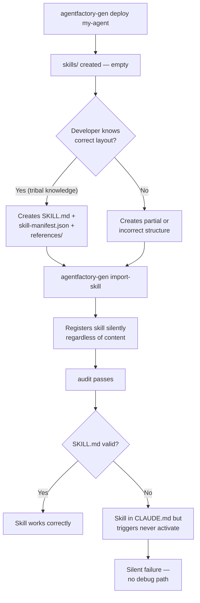

**Proposed fix:** `agentfactory-gen create-skill <name> --in <agent>` creates
`skills/<name>/SKILL.md` with frontmatter stubs, `skill-manifest.json`, and an
empty `references/` directory. Mirrors the `deploy` UX pattern.

---

### GAP-2 — No SKILL.md template generator

**Missing:** Auto-generated SKILL.md with correct frontmatter schema and step structure.

#### Context

Even when a developer knows to create `SKILL.md`, there is no template. The required
frontmatter fields (`name`, `version`, `description`, `triggers`) are undocumented at
the CLI level. The `triggers` field is the most critical — it is what causes the LLM
to activate the skill automatically — but is the least obvious.

#### Workflow failure path

```
Developer creates SKILL.md from scratch
  └─ writes frontmatter from memory
  └─ omits `triggers:` field (not obvious it exists)

import-skill registers the file
  └─ no frontmatter validation

agentfactory-gen brief
  └─ CLAUDE.md updated: skill appears in "Available Skills"
  └─ no triggers row shown in the table

User says "run review design"
  └─ LLM scans CLAUDE.md — no trigger match
  └─ falls through to generic response
  └─ skill never invoked
  └─ developer has no idea why skill is ignored
```

#### Diagram

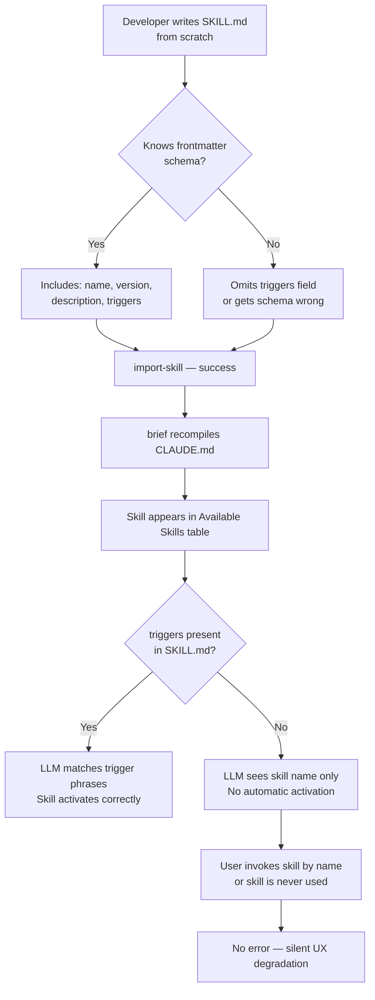

**Proposed fix:** `create-skill` (from GAP-1) outputs a pre-populated template:

```markdown
---
name: {{name}}
version: 1.0.0
description: TODO — one sentence describing what this skill produces.
triggers: TODO, add, trigger, phrases, here
---

# {{name}} — v1.0.0

TODO — describe what this skill does.

---

## Step 0 — Detect Mode

TODO — first step instructions.
```

---

### GAP-3 — No skill format validation

**Missing:** `agentfactory-gen validate-skill PATH` or inline validation in `import-skill`.

#### Context

`import-skill` is a registration command. It reads the directory, stamps the manifest,
and exits. It performs no content checks. A skill with missing frontmatter, wrong name,
or no `triggers` is registered identically to a valid one. The `audit` command checks
manifest integrity but not skill content.

#### Workflow failure path

```
Developer creates SKILL.md with:
  - name: "my skill" (spaces — invalid identifier)
  - version: "latest" (non-semver)
  - triggers: (empty)
  - description: (missing)

agentfactory-gen import-skill skills/my-skill/ --to my-agent
  └─ reads directory listing
  └─ stamps agent-manifest.json: resources.skills = ["skills/my-skill/SKILL.md"]
  └─ no frontmatter parsed
  └─ exits 0

agentfactory-gen audit my-agent
  └─ checks: agent-manifest.json exists? yes
  └─ checks: files in resources.skills[] exist on disk? yes
  └─ exits: "integrity is clean"

CLAUDE.md brief generated
  └─ skill listed with name "my skill" (spaces break the trigger matcher)

User says trigger phrase → no match
Developer runs audit → clean
No actionable error anywhere in the pipeline
```

#### Diagram

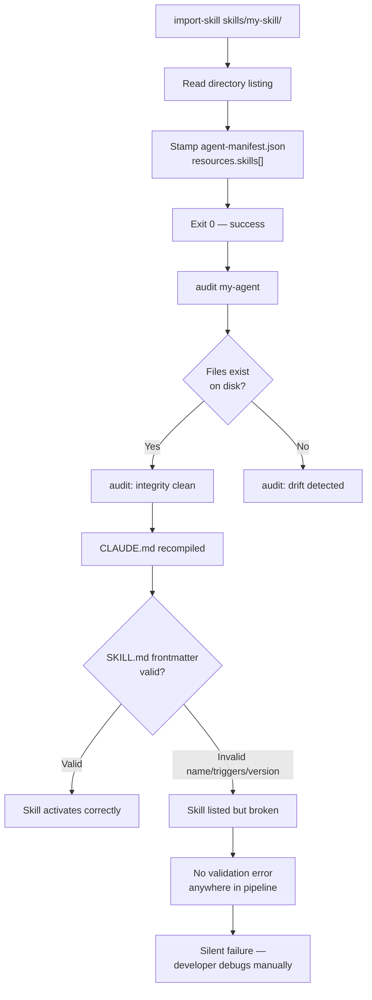

**Proposed fix:** `import-skill` parses SKILL.md frontmatter before stamping and
errors on: missing required fields, non-semver version, empty triggers, name mismatch
with directory name. Add `agentfactory-gen validate-skill PATH` as a standalone check.

---

### GAP-4 — No skill listing command

**Missing:** `agentfactory-gen list-skills [--agent NAME]`

#### Context

After importing multiple skills across multiple agents, there is no CLI command to
answer "what skills are registered?" The developer must read `agent-manifest.json`
or `CLAUDE.md` — two different files with partially overlapping information.

#### Workflow failure path

```
Project has 3 agents, each with 2-4 skills (8 total)

Developer wants to know: "is data-pipeline skill registered?"
  └─ No CLI command available

Option A: read .ai/agents/*/agent-manifest.json (3 files to cat)
  └─ JSON is dense, requires jq or manual scan
  └─ skill names are in resources.skills[] as file paths, not names

Option B: read CLAUDE.md "Available Skills" table
  └─ only shows skills from the LAST brief compilation
  └─ stale if brief not re-run after recent import
  └─ no path info, just skill name + trigger path

Option C: grep for SKILL.md files
  └─ finds files but not registration status
  └─ unregistered skills look identical to registered ones
```

#### Diagram

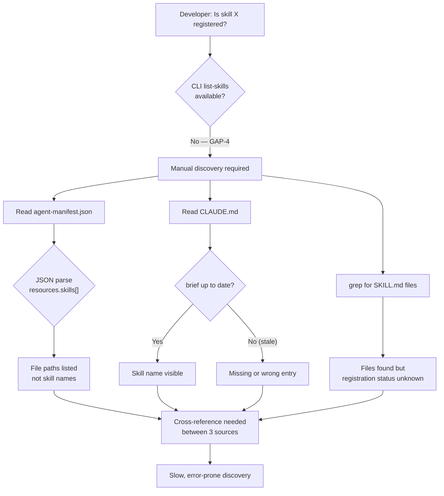

**Proposed fix:** `agentfactory-gen list-skills [--agent NAME]` reads all
`agent-manifest.json` files and prints a table: agent | skill name | version | triggers.

---

### GAP-5 — No skill versioning enforcement

**Missing:** Version change detection on re-import; semver format enforcement.

#### Context

Skills evolve. A developer fixes a bug in `SKILL.md`, adds a step, or changes trigger
phrases. The correct action is to bump the version in both `SKILL.md` and
`skill-manifest.json`, then re-run `import-skill`. Nothing enforces this. The manifest
is re-stamped with whatever version is in the file, unchanged or not. `audit` passes.

#### Workflow failure path

```
SKILL.md at version 1.0.0
Developer adds a new Step 4 to the procedure
Forgets to bump version to 1.1.0

agentfactory-gen import-skill skills/my-skill/ --to my-agent
  └─ reads SKILL.md: version = "1.0.0" (unchanged)
  └─ stamps manifest: skills_metadata.version = "1.0.0"
  └─ no warning: "version unchanged since last import"

agentfactory-gen audit my-agent
  └─ passes: files present, manifest consistent

Downstream tooling (e.g. wrap, publish) reads version 1.0.0
  └─ cache hit: assumes skill unchanged
  └─ ships stale version to registry
  └─ consumers get old skill behavior

Developer debugging: "why is Step 4 missing in the deployed skill?"
  └─ version string is the only signal — both show 1.0.0
  └─ no git-ref delta surfaced for the skill specifically
```

#### Diagram

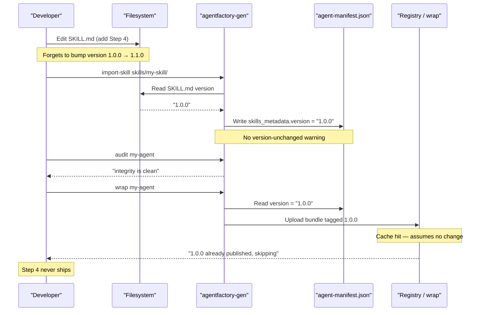

**Proposed fix:** On re-import, `import-skill` compares the incoming version against
the currently registered version. If unchanged but file content differs (by hash or
git-ref), emit a warning: `WARN: skill version 1.0.0 unchanged but content differs
since last import. Did you forget to bump the version?`

---

### GAP-6 — No skill test scaffold

**Missing:** `agentfactory-gen test-skill <name>` or any automated smoke-test template.

#### Context

Skills are procedural prompt documents — their "correctness" is whether the LLM
follows the steps and produces the expected output. There is no test runner, no
fixture system, and no way to assert that a skill produces the right file at the
right path with the right sections. Regression is caught only by manually invoking
the skill and eyeballing the result.

#### Workflow failure path

```
Developer edits SKILL.md — changes report filename pattern
  └─ was: docs/REVIEW-SECURITY-*.md
  └─ now: reports/SECURITY-REVIEW-*.md

No test catches this
  └─ skill is re-imported, audit passes

CI/CD pipeline runs skill
  └─ output written to reports/ (new path)
  └─ downstream tool reads from docs/ (old path)
  └─ docs/ file missing → downstream tool fails

Developer debugging:
  └─ no test failure pointed to skill output path change
  └─ reads SKILL.md, compares to old version manually
  └─ finds path change in Step 6
  └─ 1-2 hours of debugging for a 1-line change
```

#### Diagram

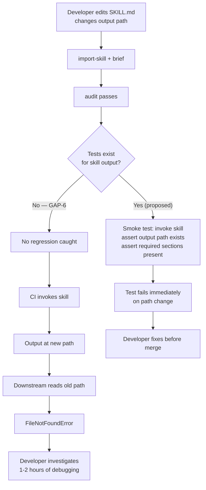

**Proposed fix:** `agentfactory-gen test-skill <name>` runs the skill with fixture
inputs in a sandbox, then asserts: output file created at expected path, required
section headers present, no unclosed `{{PLACEHOLDER}}` tokens in output.

---

### GAP-7 — No governance rule for skill creation

**Missing:** A harness rule (Rule N) defining when and how to create a skill vs. a
slash command, enforcing the `deploy → author → import-skill → brief` lifecycle.

#### Context

`CLAUDE.md` has rules for worktrees (Rule 2), documentation (Rule 3), version markers
(Rule 4), secrets (Rule 6), and reference repos (Rule 9). There is no rule that says:
"reusable procedures belong in `.ai/agents/<name>/skills/`" or "do not create skills
as bare `.claude/commands/*.md` files." Both paths are syntactically valid; without a
rule, the LLM picks whichever it has seen more often in training data (slash commands).

#### Workflow failure path — what actually happened in this repo

```
User request: "make the design security report a reusable skill"

LLM interprets request:
  └─ knows Claude Code slash commands from training data
  └─ creates .claude/commands/review-design.md
  └─ format: Claude Code slash command (plain Markdown, no frontmatter)

Result:
  └─ file is NOT a skill — agentfactory-gen cannot see it
  └─ agentfactory-gen brief does NOT add it to CLAUDE.md "Available Skills"
  └─ NOT registered in agent-manifest.json
  └─ audit cannot check it
  └─ wrap cannot bundle it
  └─ user observes: "the command was created but didn't use agent-factory pipy cli"

Correct path (what should have happened):
  └─ agentfactory-gen deploy security-review
  └─ author .ai/agents/security-review/skills/security-review/SKILL.md
  └─ agentfactory-gen import-skill ... --to security-review
  └─ agentfactory-gen brief
```

#### Diagram

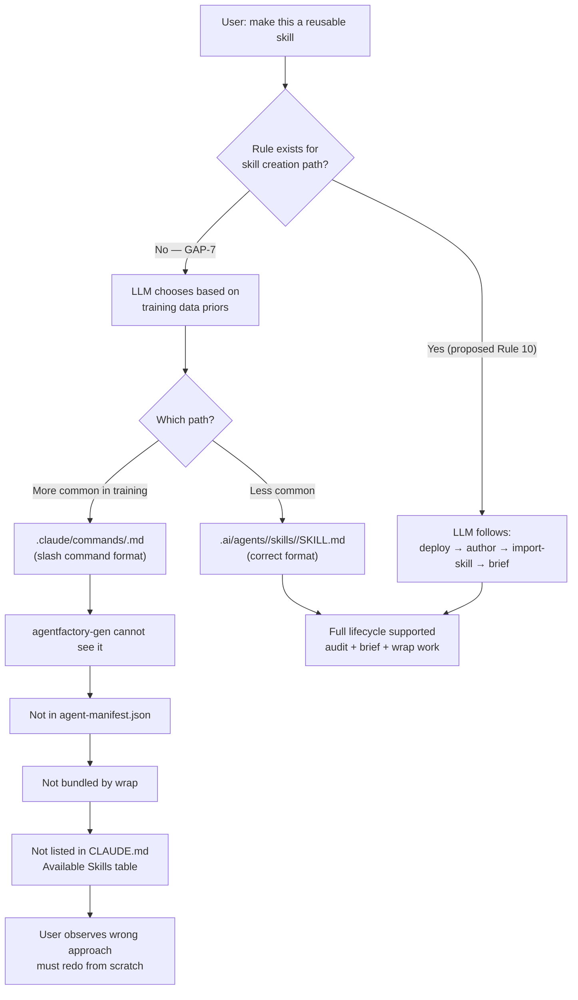

**Proposed fix:** Add Rule 10 — Skill Authorship to `.ai/rules/`:
> A reusable procedure MUST be implemented as an agentfactory skill at
> `.ai/agents/<name>/skills/<name>/SKILL.md`. Never create a skill as a
> `.claude/commands/*.md` file. Lifecycle: `deploy` → author SKILL.md → `import-skill`
> → `brief`. The `.claude/commands/` path is for one-off slash commands only.

---

### GAP-8 — import-skill does not derive skill-manifest.json

**Missing:** Auto-generation of `skill-manifest.json` from SKILL.md frontmatter,
or consistency validation between the two files.

#### Context

`SKILL.md` and `skill-manifest.json` carry the same three fields: `name`, `version`,
`description`. They must be kept in sync manually. `import-skill` reads both files but
does not check that they agree. If they diverge, different parts of the toolchain
see different metadata.

#### Workflow failure path

```
Developer updates SKILL.md: version 1.0.0 → 1.1.0, description updated

Forgets to update skill-manifest.json (still shows 1.0.0)

agentfactory-gen import-skill ...
  └─ reads SKILL.md → stamps skills_metadata from SKILL.md (v1.1.0)
  └─ reads skill-manifest.json → stamps manifest.version from skill-manifest (v1.0.0)
  └─ no consistency check
  └─ agent-manifest.json now has two different versions for the same skill

agentfactory-gen audit my-agent
  └─ checks file presence only
  └─ does not compare SKILL.md version vs skill-manifest.json version
  └─ exits clean

agentfactory-gen wrap my-agent
  └─ bundles both files
  └─ consumer sees skill-manifest.json (v1.0.0) as the authoritative version
  └─ SKILL.md says 1.1.0
  └─ version conflict in the bundle
```

#### Diagram

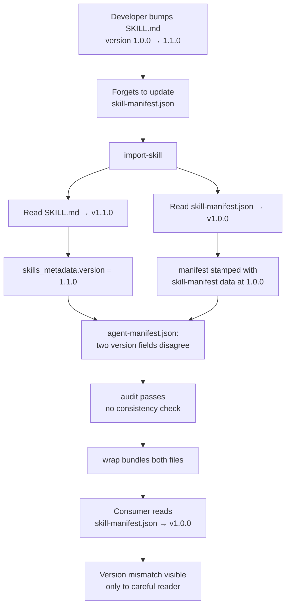

**Proposed fix:** `import-skill` auto-generates `skill-manifest.json` from SKILL.md
frontmatter if the file is absent. If present, validate name + version consistency and
error if they differ. Only one source of truth: SKILL.md frontmatter.

---

### GAP-9 — No project-index integration

**Missing:** Automatic update of `.ai/project-index.yml` when a new skill is imported.

#### Context

The harness enforces Rule 8: "When searching for a file, function, or module, read
`.ai/project-index.yml` first." This index must be manually updated when new files are
added. `agentfactory-gen import-skill` and `brief` do not touch `project-index.yml`.
Every new skill breaks Rule 8 until the developer manually patches the index.

#### Workflow failure path

```
agentfactory-gen import-skill skills/my-skill/ --to my-agent
  └─ registers skill in agent-manifest.json
  └─ does NOT update .ai/project-index.yml

agentfactory-gen brief
  └─ updates CLAUDE.md Available Skills table
  └─ does NOT update .ai/project-index.yml

LLM receives: "show me the SKILL.md for my-skill"
  └─ follows Rule 8: reads .ai/project-index.yml
  └─ skill files not in index → not found
  └─ falls back to find/grep (slower, less reliable)
  └─ may find file, may not depending on search pattern

Developer manually patches project-index.yml
  └─ 5-7 lines per skill file (path, purpose, wave, status)
  └─ error-prone: wrong path, wrong section
  └─ required for EVERY new skill
```

#### Diagram

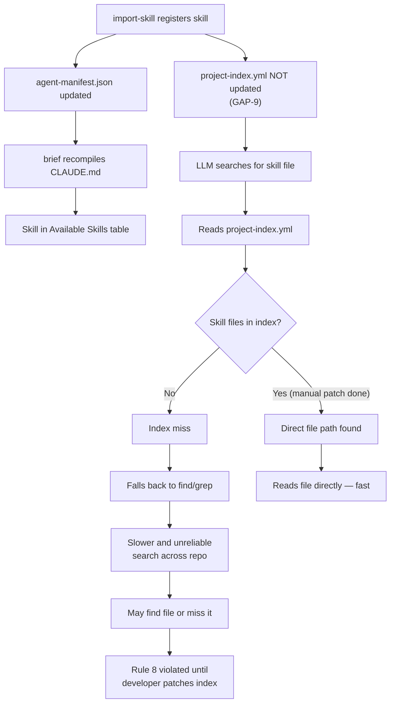

**Proposed fix:** `import-skill` appends new skill file rows to `project-index.yml`
under the `docs:` or a new `agents:` section, with path, auto-detected purpose
(from SKILL.md description), and status `implemented`.

---

### GAP-10 — No rollback on import-skill failure

**Missing:** Atomic write for `agent-manifest.json` during `import-skill`.

#### Context

`import-skill` writes `agent-manifest.json` in-place. If the process is interrupted
mid-write (SIGKILL, disk-full, power loss), the manifest is left in a partially-written
state — typically valid JSON up to the write cursor, then truncated. All subsequent
`agentfactory-gen` invocations fail with a JSON parse error until the file is manually
repaired. In a team environment, this corrupts the shared manifest on disk.

#### Workflow failure path

```
agentfactory-gen import-skill skills/my-skill/ --to my-agent
  └─ opens agent-manifest.json for write (truncates existing file)
  └─ begins writing updated JSON

  -- disk full at 60% of write --
  └─ partial JSON written: {"name":"my-agent","version":"1.0.0","resources":{"skills":[

Process exits with OSError

agent-manifest.json on disk:
  {"name":"my-agent","version":"1.0.0","resources":{"skills":[
  ↑ truncated, invalid JSON

agentfactory-gen brief
  └─ reads agent-manifest.json
  └─ JSONDecodeError: Unterminated string at line 1 column 87
  └─ exits 1

agentfactory-gen audit my-agent
  └─ same JSONDecodeError

All CLI operations on this agent are now broken
Developer must manually reconstruct agent-manifest.json from git history
```

#### Diagram

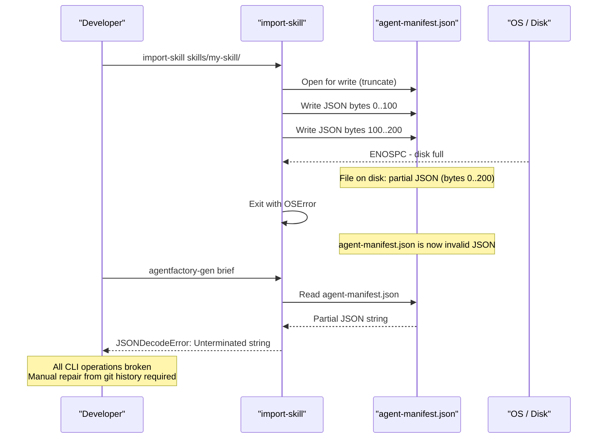

**Proposed fix:** Write to a temp file (`agent-manifest.json.tmp`), validate JSON
completeness, then `os.replace()` (atomic rename on POSIX). If any step fails,
delete the temp file and leave the original manifest untouched.

---

## 7. Known Limitations

- `agentfactory-gen` operates on `.ai/agents/` only — skills outside this path
  (e.g., `.claude/commands/`) are invisible to the CLI
- `brief` recompilation is not incremental — it rewrites all adapter briefs on
  every call regardless of what changed
- `wrap` produces a `.zip` bundle but `publish` requires a registry endpoint
  not yet documented in the harness

---

*Documented from full execution of the `security-review` skill pipeline on 2026-04-28.*
*CLI behavior confirmed from `agentfactory-gen --help` and subcommand `--help` output*
*on the version installed at `/home/magooo/.local/bin/agentfactory-gen`.*

---

<a id="d6"></a>

## 6 · 2026-05-01 · Feature: Wave 3 — DAG Orchestration Engine

Source: [FEATURE-WAVE-3-DAG-ORCHESTRATION-2026-05-01.md](FEATURE-WAVE-3-DAG-ORCHESTRATION-2026-05-01.md) · [[FEATURE-WAVE-3-DAG-ORCHESTRATION-2026-05-01]]  ·  [↑ Index](#index)

<!-- version: 1.0.0 -->
<!-- classification: FEATURE -->
<!-- date: 2026-05-01 -->
<!-- last-updated: 2026-06-19 -->

## What it does

Adds a parallel, dependency-aware plan execution engine to `factory`. You
describe a set of agent tasks and their dependencies in an `af-plan.json` file;
the executor runs them at maximum safe concurrency, substitutes earlier step
outputs into later prompts, and cascade-skips anything downstream of a failure.
Three CLI commands (`factory run`, `factory plan new`, `factory plan validate`)
wire the engine into the shell.

---

## Architecture

```
╔═════════════════════════════════════════════════════════════════════════╗
║                  factory — Wave 3 Orchestration Layer                   ║
║                                                                         ║
║  ┌──────────────────────────────────────────────────────────────────┐   ║
║  │  src/cli.ts                                                      │   ║
║  │  factory run [path]    factory plan new    factory plan validate  │   ║
║  └──────────────────────────────┬─────────────────────────────────┘   ║
║                                  │ af-plan.json (parsed + validated)    ║
║                                  ▼                                      ║
║  ┌──────────────────┐   ┌────────────────────────────────────────────┐  ║
║  │  schema.ts       │   │  graph.ts                                  │  ║
║  │                  │──►│                                            │  ║
║  │  PlanSchema      │   │  toposort()        Kahn's algorithm        │  ║
║  │  StepSchema      │   │  detectCycles()    DFS with path stack     │  ║
║  │  (Zod, strict)   │   │  readySet()        unblocked step filter   │  ║
║  └──────────────────┘   └───────────────────────┬────────────────────┘  ║
║                                                  │                       ║
║                                                  ▼                       ║
║  ┌───────────────────────────────────────────────────────────────────┐   ║
║  │  executor.ts  —  Executor                                         │   ║
║  │                                                                   │   ║
║  │  run(): AsyncIterable<StepEvent>                                  │   ║
║  │    ├── readySet()               which steps are unblocked?        │   ║
║  │    ├── Promise.race(inFlight)   await the first to finish         │   ║
║  │    ├── interpolate()            {{stepId}} token substitution     │   ║
║  │    └── transitiveDependents()   cascade-skip on error (BFS)       │   ║
║  └────────────────────────────┬──────────────────────────────────────┘   ║
║                               │ AgentRunnerFn (injected)                 ║
║                               ▼                                          ║
║  ┌───────────────────────────────────────────────────────────────────┐   ║
║  │  core/agent-loop.ts   (one agentLoop per step)                    │   ║
║  │  core/llm/index.ts    createAdapter(step.provider ?? env default) │   ║
║  └───────────────────────────────────────────────────────────────────┘   ║
╚═════════════════════════════════════════════════════════════════════════╝
```

| Symbol | Meaning |
|--------|---------|
| `╔═╗╚╝║` | Double-line box — top-level layer boundary |
| `┌─┐└┘│` | Single-line box — module or class |
| `──►` | Data or control flow direction |
| `├──` | Component within the same module |
| `▼` | Downward dependency / call chain |

### Key files

| File | Role |
|------|------|
| `src/orchestration/schema.ts` | Zod schema for `af-plan.json` — id regex, duplicate id check, unknown dep ref check |
| `src/orchestration/graph.ts` | Pure graph algorithms: `toposort`, `detectCycles`, `readySet` |
| `src/orchestration/executor.ts` | `Executor` class — event-driven parallel runner |
| `src/orchestration/planner.ts` | `Planner.wizard()` — interactive readline wizard that writes `af-plan.json` |
| `src/core/tools/agent.ts` | `AgentTool` — spawns a child `agentLoop` session, returns trimmed text |
| `src/cli.ts` | CLI commands: `factory run`, `factory plan new`, `factory plan validate` |

---

## How it works

### 1 — Plan schema and validation

A plan is a JSON object. Every field is validated at parse time by Zod before
any execution begins.

```
┌──────────────────────────────────────────────────────────────────────┐
│  af-plan.json  (PlanSchema)                                          │
│                                                                      │
│  {                                                                   │
│    "version": "1.0",                         ← literal, not a semver │
│    "name":    "research-pipeline",                                   │
│    "steps": [                                                        │
│      {                                                               │
│        "id":        "fetch",                 ← /^[a-z0-9_-]+$/      │
│        "agent":     "my-agent",              ← non-empty string      │
│        "prompt":    "Fetch the latest data", ← non-empty string      │
│        "dependsOn": [],                      ← default []            │
│        "timeout":   30000,                   ← ms, optional          │
│        "provider":  "anthropic",             ← optional, overrides env│
│        "model":     "claude-opus-4-7"        ← optional              │
│      },                                                              │
│      ...                                                             │
│    ]                                                                 │
│  }                                                                   │
│                                                                      │
│  superRefine checks (run after field validation):                    │
│    ① duplicate step id  → ZodIssue custom error                     │
│    ② dependsOn ref not found in id set → ZodIssue custom error      │
└──────────────────────────────────────────────────────────────────────┘
```

| Symbol | Meaning |
|--------|---------|
| `←` | Inline annotation — constraint or default value |
| `①②` | Ordered cross-field checks that run after per-field validation |

**Why `superRefine`?** Zod's per-field validators can only see one field at a
time. Cross-field invariants (duplicate ids, dangling refs) require access to
the whole `steps` array at once, which is what `superRefine` provides.

---

### 2 — Graph algorithms (`graph.ts`)

#### Topological sort — Kahn's algorithm

```
┌────────────────────────────────────────────────────────────────────┐
│  toposort(steps)                                                   │
│                                                                    │
│  1. Build inDegree map:  id → count of dependsOn entries          │
│  2. Build adj map:       dep id → list of dependents               │
│  3. Seed queue with all ids where inDegree == 0   (no deps)       │
│                                                                    │
│  while queue not empty:                                            │
│    id = queue.shift()                                              │
│    result.push(id)                                                 │
│    for each dependent of id:                                       │
│      inDegree[dependent]--                                         │
│      if inDegree[dependent] == 0: queue.push(dependent)           │
│                                                                    │
│  if result.length ≠ steps.length:                                  │
│    → cycle detected → call detectCycles() → throw                 │
└────────────────────────────────────────────────────────────────────┘
```

| Symbol | Meaning |
|--------|---------|
| `→` | Resulting action or state change |
| `inDegree` | Count of unsatisfied dependencies for a node |
| `adj` | Adjacency list mapping each step to its dependents (reverse edges) |

The `Executor` constructor calls `toposort()` immediately — a plan with a cycle
throws before any agent runs.

#### Cycle detection — DFS with path stack

```
┌────────────────────────────────────────────────────────────────────┐
│  detectCycles(steps)                                               │
│                                                                    │
│  visited = Set     ← globally seen nodes (skip re-entry)          │
│  stack   = Set     ← nodes on the current DFS path                │
│                                                                    │
│  dfs(id, path):                                                    │
│    if id ∈ stack:                                                  │
│      cycle = path.slice(path.indexOf(id))   ← extract the loop    │
│      cycles.push(cycle)                                            │
│      return                                                        │
│    if id ∈ visited: return                                         │
│                                                                    │
│    visited.add(id); stack.add(id); path.push(id)                  │
│    for dep of adj[id]: dfs(dep, path)                              │
│    path.pop(); stack.delete(id)                ← backtrack         │
└────────────────────────────────────────────────────────────────────┘
```

| Symbol | Meaning |
|--------|---------|
| `∈` | Set membership |
| `← extract the loop` | Slice from first occurrence of the repeated id |
| `← backtrack` | Stack and path are unwound on exit so sibling paths are clean |

#### Ready set

```
┌────────────────────────────────────────────────────────────────────┐
│  readySet(steps, completed)                                        │
│                                                                    │
│  for each step:                                                    │
│    skip if step.id ∈ completed        (already done)              │
│    add if step.dependsOn ⊆ completed  (all deps satisfied)        │
│                                                                    │
│  returns Set<string>  — ids safe to launch right now              │
└────────────────────────────────────────────────────────────────────┘
```

| Symbol | Meaning |
|--------|---------|
| `⊆` | Subset — every element of `dependsOn` is in `completed` |
| `completed` | Includes both `done` and `skipped` steps (skips are treated as resolved for dependency purposes) |

---

### 3 — Executor event loop

```
┌──────────────────────────────────────────────────────────────────────┐
│  Executor.run()    async generator                                   │
│                                                                      │
│  state:  outputs Map    ← step id → output string                   │
│          completed Set  ← done + skipped                            │
│          failed Set     ← errored                                    │
│          running Set    ← currently in flight                        │
│          emitted Set    ← final event has been yielded               │
│          queue []       ← pending StepEvents to yield               │
│                                                                      │
│  loop while emitted.size < steps.length:                            │
│    ① flush queue      → yield all queued events                    │
│    ② compute skipSet  → transitiveDependents(failed, steps)         │
│    ③ emit skips       → enqueue step:skipped for each new skip      │
│    ④ mark emitted     → add completed + failed to emitted           │
│    ⑤ dispatch ready   → readySet(steps, completed)                  │
│         for each ready id not yet running/emitted:                   │
│           if running.size ≥ maxConcurrency: break                   │
│           launch runStep(step) → push to inFlight[]                 │
│    ⑥ await Promise.race(inFlight)  ← blocks until one finishes     │
│                                                                      │
│  final flush + yield plan:done                                       │
└──────────────────────────────────────────────────────────────────────┘
```

| Symbol | Meaning |
|--------|---------|
| `①–⑥` | Ordered phases within one iteration of the main loop |
| `← blocks` | Execution suspends here; resumes when the fastest in-flight promise resolves |
| `queue []` | Events are buffered during a step's async execution and drained at phase ① of the next tick |

**Why a queue?** `runStep` is a concurrent async function — it enqueues events
internally (not yields), so multiple steps can fire events at any time. The
outer loop drains the queue on each tick, giving deterministic event ordering
despite concurrency.

#### Template interpolation

```
┌──────────────────────────────────────────────────────────────────┐
│  interpolate(prompt, inputs)                                     │
│                                                                  │
│  regex: /\{\{([a-z0-9_-]+)\}\}/g                                │
│                                                                  │
│  "Analyze {{fetch}} and compare to {{summarize}}"                │
│        │                       │                                 │
│        └─ replaced with        └─ replaced with                  │
│           outputs["fetch"]        outputs["summarize"]           │
│                                                                  │
│  unknown token → replaced with ""  (no error)                   │
└──────────────────────────────────────────────────────────────────┘
```

| Symbol | Meaning |
|--------|---------|
| `{{id}}` | Token — step id surrounded by double braces |
| `└─` | Token is replaced in-place by the referenced step's output string |

#### Cascade-skip — `transitiveDependents`

```
┌──────────────────────────────────────────────────────────────────┐
│  transitiveDependents(failedIds, steps)   BFS / fixed-point      │
│                                                                  │
│  result = Set()                                                  │
│  repeat until no new ids added:                                  │
│    for each step not yet in result:                              │
│      if any dep ∈ (failedIds ∪ result):                         │
│        result.add(step.id)   ← mark for skip                    │
│                                                                  │
│  example:  failed = {A}   steps: A→B→C, A→D→E, X               │
│                                                                  │
│  round 1:  B ∈ result (dep A failed)  D ∈ result (dep A failed) │
│  round 2:  C ∈ result (dep B skipped) E ∈ result (dep D skipped)│
│  round 3:  no change → stop                                      │
│                                                                  │
│  result = {B, C, D, E}   X is independent → runs normally       │
└──────────────────────────────────────────────────────────────────┘
```

| Symbol | Meaning |
|--------|---------|
| `∈` | Set membership check |
| `∪` | Union — failed OR already-in-skip-set |
| `← mark for skip` | Step will receive `step:skipped` event, not be launched |
| `X` | Independent step — has no ancestor in the failed set, continues unaffected |

---

## Usage

### Scenario walkthroughs

#### Scenario 1 — Linear chain (A → B → C)

```
                 prompt interpolation
                 │
Step A ──done──► Step B ──done──► Step C ──done──► plan:done
  │                │                 │
  │                └── {{a}} in B's prompt replaced with A's output
  │                                  └── {{b}} in C's prompt replaced with B's output
  │
  └── no dependsOn — runs immediately at t=0
```

| Symbol | Meaning |
|--------|---------|
| `──done──►` | Step completed, unlocking the next |
| `└──` | Side effect that occurs at this point |

1. Executor calls `readySet` — only A has no deps; A launches at t=0.
2. A's `agentRunner` resolves → `outputs.set('a', result)` → `completed.add('a')`.
3. Next iteration: `readySet` returns `{b}` — B launches with `{{a}}` replaced.
4. B resolves → C is unblocked → C launches with `{{b}}` replaced.
5. C resolves → `emitted.size == steps.length` → `plan:done` emitted.

---

#### Scenario 2 — Diamond (parallel fan-out, then join)

```
           ┌──► Step B ──┐
Step A ────┤              ├──► Step D ──► plan:done
           └──► Step C ──┘

t=0   A running
t=1   A done  →  B running, C running  (both unblocked simultaneously)
t=2   B done, C done  →  D running     (D needs both)
t=3   D done  →  plan:done
```

| Symbol | Meaning |
|--------|---------|
| `┌──►` `└──►` | Parallel branches forking from A |
| `├──►` | Join point — D waits until both B and C are in `completed` |

1. `readySet` at t=0: `{A}` only (B, C, D all have unmet deps).
2. A completes → `completed = {A}`.
3. `readySet` returns `{B, C}` — both launched concurrently (running.size=2 ≤ maxConcurrency=3).
4. `Promise.race` resolves whichever of B/C finishes first. The other is still running.
5. After both resolve, `completed = {A, B, C}`. `readySet` returns `{D}`.
6. D launches, resolves, `plan:done`.

---

#### Scenario 3 — Cascade-skip on failure

```
Step A ──error──► ╳
                  │
         ┌────────┴────────┐
         ▼                 ▼
      Step B            Step D        ← skipped (depend on A)
         │
         ▼
      Step C                          ← skipped (depends on B)

Step X (independent) ──done──► plan:done
```

| Symbol | Meaning |
|--------|---------|
| `──error──►` | Step terminated with an exception |
| `╳` | Failure node — source of the cascade |
| `▼ skipped` | Transitively dependent step, never launched |
| `Step X` | No dependency on A, B, C, D — runs and completes normally |

1. A throws → `failed.add('A')`, `step:error` enqueued.
2. Next loop iteration: `transitiveDependents({A}, steps)` = `{B, D}` (round 1) + `{C}` (round 2).
3. B, C, D receive `step:skipped` events and are added to `completed` (for `readySet` purposes).
4. X is not in the skip set → `readySet` returns `{X}` → X runs and succeeds.
5. `plan:done` emitted once all 5 steps are in `emitted`.

---

#### Scenario 4 — Concurrency throttle (`maxConcurrency`)

```
maxConcurrency = 2,  steps: A, B, C  (no deps)

t=0   running=[A, B]   C waiting  ← running.size(2) ≥ maxConcurrency(2)
         │
         ▼
t=1   A done  →  running=[B, C]   ← slot freed, C now dispatched
         │
         ▼
t=2   B done, C done  →  plan:done
```

| Symbol | Meaning |
|--------|---------|
| `running.size(N) ≥ maxConcurrency(M)` | Guard that prevents launching more than M concurrent steps |
| `← slot freed` | When a step finishes, the next ready step is dispatched on the following loop iteration |

1. `readySet` returns `{A, B, C}` (no deps on any).
2. The dispatch loop: launches A (`running.size` → 1), launches B (`running.size` → 2), checks C — `running.size(2) ≥ maxConcurrency(2)` → `break`.
3. `Promise.race` resolves when A finishes. `running.size` drops to 1.
4. Next iteration: `readySet` returns `{C}`, C is dispatched.

---

#### Scenario 5 — Per-step LLM provider override

```
af-plan.json:
  step "cheap-draft":  provider="openai",    model="gpt-4o-mini"
  step "final-polish": provider="anthropic", model="claude-opus-4-7"
  step "summary":      (no provider field)   ← uses LLM_PROVIDER env default

                      ┌──────────────────────────────────────────────┐
factory run           │  agentRunner per step                        │
                      │                                              │
  cheap-draft   ──────► createAdapter("openai")    → OpenAIAdapter  │
  final-polish  ──────► createAdapter("anthropic") → AnthropicAdapter│
  summary       ──────► createAdapter(defaultProvider()) → env-driven│
                      └──────────────────────────────────────────────┘
```

| Symbol | Meaning |
|--------|---------|
| `──────►` | Step resolved to a specific adapter instance |
| `← env-driven` | `defaultProvider()` reads `LLM_PROVIDER` env var, falls back to `"anthropic"` |

Each step gets its own `Session` and `agentLoop` invocation. The adapter is
created fresh per step — no shared state between steps.

---

### CLI commands

#### `factory plan new` — interactive wizard

```bash
$ factory plan new

  factory plan new — interactive wizard

  Plan name: research-pipeline

  Step 1
    id (e.g. fetch): fetch-data
    agent name: my-agent
    prompt: Retrieve the latest usage metrics
    dependsOn (comma-separated ids, or blank):

  Step 2
    id (e.g. fetch): analyze
    agent name: my-agent
    prompt: Analyze this data: {{fetch-data}}
    dependsOn (comma-separated ids, or blank): fetch-data

  Add another step? [y/N] n

  Written: /your/cwd/af-plan.json
```

#### `factory plan validate` — schema + cycle check

```bash
# Valid plan:
$ factory plan validate
Plan "research-pipeline" is valid (2 steps)

# Invalid plan — unknown dep ref:
$ factory plan validate bad-plan.json
Invalid plan:
Step "analyze" has unknown dependsOn ref: "nonexistent"

# Cycle:
$ factory plan validate cyclic.json
Error: Plan contains cycles: a → b → a
```

#### `factory run` — execute a plan

```bash
# Set at least one provider key:
export ANTHROPIC_API_KEY=sk-ant-...
# or
export OPENAI_API_KEY=sk-proj-...
export LLM_PROVIDER=openai

$ factory run
step:start         fetch-data
step:start         summarize
step:done          fetch-data
step:done          summarize
step:start         analyze
step:done          analyze
step:start         write-report
step:done          write-report
plan:done

# Run a named plan file:
$ factory run ./plans/weekly-report.json
```

#### Environment variables

```bash
ANTHROPIC_API_KEY=sk-ant-...   # Required when provider=anthropic (or default)
OPENAI_API_KEY=sk-proj-...     # Required when provider=openai
LLM_PROVIDER=openai            # Override default provider (default: anthropic)
```

#### `factory doctor` — verify environment

```bash
$ factory doctor
  ✓  Node.js ≥ 20       v22.1.0
  ✓  ANTHROPIC_API_KEY  set
  ✓  OPENAI_API_KEY     set
  ○  LLM_PROVIDER       not set (default: anthropic)
  ✓  .ai/ harness       present
  ✓  CLAUDE.md          present

  5/6 checks passed
```

---

## Test coverage

### Test files

| File | Tests | What is covered |
|------|-------|-----------------|
| `src/orchestration/schema.test.ts` | 6 | valid plan, duplicate id, unknown dep ref, optional fields, empty steps |
| `src/orchestration/graph.test.ts` | 8 | linear chain toposort, diamond, self-cycle, 3-node cycle, readySet with no completed, readySet partial, cycle throws in toposort |
| `src/orchestration/executor.test.ts` | 9 | single step, parallel fan-out timing, chain order, cascade-skip, independent step survives failure, maxConcurrency=1 serial, interpolation, plan:done last, cycle throws in constructor |
| `src/orchestration/planner.test.ts` | 3 | single step wizard, dependsOn parsing, blank name error |
| `src/core/tools/agent.test.ts` | 3 | text concat, empty output, metadata passthrough |

### Run tests

```bash
$ npm test
# All tests must pass. vitest in watch mode:
$ npm test -- --watch
```

### Not yet tested

- `factory run` CLI end-to-end (requires real API key or a CLI integration harness)
- `Planner.wizard()` overwrite prompt path (requires interactive TTY mock)
- `OrchestrationCanvas.syncFromPlan()` and `applyStepEvent()` (requires CellBuffer test harness)
- Timeout enforcement per step (field exists in schema, not yet wired into `agentRunner`)

---

## Known limitations

- **No timeout enforcement.** `Step.timeout` is validated and stored but `agentRunner` in `cli.ts` does not yet wire `AbortSignal` with a timer. Will be added in a follow-up.
- **No live TUI feedback during `factory run`.** Events are written to stderr as plain text. `OrchestrationCanvas.applyStepEvent()` exists and is ready to consume them — the bridge from `Executor` events to the canvas render loop is Wave 4 scope.
- **`agentRunner` in CLI runs the full agent loop.** Each step spawns a fresh `Session` and `agentLoop`. Multi-turn tool use within a step works, but there is no way to pass tool registrations per-step from the plan file.
- **`factory plan new` wizard is linear.** You can only add steps sequentially. Editing an existing plan requires manual JSON editing or re-running the wizard with overwrite.
- **No retry on step failure.** A failed step cascades immediately. A `retries: N` field is a planned schema extension.

---

<a id="d7"></a>

## 7 · 2026-05-18 · agentfactory-harness — System Architecture & Operational Reference

Source: [FEATURE-SYSTEM-ARCHITECTURE-v0.4.0-2026-05-18.md](FEATURE-SYSTEM-ARCHITECTURE-v0.4.0-2026-05-18.md) · [[FEATURE-SYSTEM-ARCHITECTURE-v0.4.0-2026-05-18]]  ·  [↑ Index](#index)

# (Waves 0 – 4, v0.4.0)

╔══════════════════════════════════════════════════════════════════════════════╗
║  SCOPE  Waves 0–3.5 (all implemented code as of 2026-05-18)                 ║
║  STATUS Wave 4 plan approved, not yet implemented                            ║
╚══════════════════════════════════════════════════════════════════════════════╝

───────────────────────────────────────────────────────────────────────────────
## 1. WHAT THE SYSTEM IS
───────────────────────────────────────────────────────────────────────────────

`factory` is a full-screen TypeScript TUI (Terminal User Interface) that acts as
an interactive orchestration shell for AI agents. It introduces the ITUI concept:
mouse drag-and-drop ASCII canvas for building agent DAGs, a streaming Claude/OpenAI
session panel, a live execution canvas, and (Wave 4) an embedded real terminal —
all rendered via a custom raw ANSI cell-buffer renderer with no framework dependency.

Three execution planes:

  ┌─────────────────────────────────────────────────────────────────────────┐
  │  AGENT PLANE       │  Claude/OpenAI streaming loop, tools, hooks        │
  │  ORCHESTRATION     │  ITUI canvas, af-plan.json DAG executor            │
  │  REGISTRY (wave 5) │  agentfactory.dev import/publish, auth token       │
  └─────────────────────────────────────────────────────────────────────────┘

───────────────────────────────────────────────────────────────────────────────
## 2. PROJECT STRUCTURE (current, v0.4.0)
───────────────────────────────────────────────────────────────────────────────

Before/after view — each wave added a layer; nothing was removed.

  BEFORE (v0.1.0 — Wave 0 only)         AFTER (v0.4.0 — Waves 0–3.5)
  ─────────────────────────────────      ──────────────────────────────────────
  src/                                   src/
  ├── index.ts                           ├── index.ts
  ├── cli.ts                             ├── cli.ts              [extended W3]
  ├── app.ts                             ├── app.ts              [extended W1-3]
  ├── harness/                           ├── harness/
  │   └── doctor.ts                      │   └── doctor.ts       [updated W3.5]
  ├── tui/                               ├── tui/
  │   ├── renderer/                      │   ├── renderer/
  │   │   ├── ansi.ts                    │   │   ├── ansi.ts
  │   │   ├── cell-buffer.ts             │   │   ├── cell-buffer.ts
  │   │   ├── layout.ts                  │   │   ├── layout.ts
  │   │   └── theme.ts                   │   │   └── theme.ts
  │   ├── input/                         │   ├── input/
  │   │   └── keyboard.ts               │   │   ├── keyboard.ts
  │   │                                  │   │   ├── mouse.ts    [new W2]
  │   │                                  │   │   └── router.ts   [new W2]
  │   └── panels/                        │   ├── panels/
  │       ├── Panel.ts                   │   │   ├── Panel.ts
  │       ├── StatusBar.ts               │   │   ├── StatusBar.ts
  │       └── SessionPanel.ts            │   │   ├── SessionPanel.ts [new W1]
  │                                      │   │   ├── OrchestrationCanvas.ts [W2]
  │                                      │   │   └── AgentsPanel.ts  [new W1]
  │                                      │   └── widgets/
  │                                      │       ├── Block.ts        [new W2]
  │                                      │       ├── Wire.ts         [new W2]
  │                                      │       └── ContextMenu.ts  [new W2]
  │                                      ├── core/
  │                                      │   ├── agent-loop.ts      [new W1]
  │                                      │   ├── session.ts         [new W1]
  │                                      │   ├── hooks.ts           [new W1]
  │                                      │   ├── llm/               [new W3.5]
  │                                      │   │   ├── types.ts
  │                                      │   │   ├── index.ts
  │                                      │   │   ├── anthropic-adapter.ts
  │                                      │   │   └── openai-adapter.ts
  │                                      │   └── tools/
  │                                      │       ├── index.ts       [new W1]
  │                                      │       ├── bash.ts        [new W1]
  │                                      │       ├── read.ts        [new W1]
  │                                      │       ├── write.ts       [new W1]
  │                                      │       ├── web-fetch.ts   [new W1]
  │                                      │       └── agent.ts       [new W3]
  │                                      └── orchestration/
  │                                          ├── schema.ts          [new W3]
  │                                          ├── executor.ts        [new W3]
  │                                          ├── planner.ts         [new W3]
  │                                          └── graph.ts           [new W3]

  Added components (W4 plan, not yet on disk):
    src/tui/input/vt.ts
    src/tui/panels/TerminalPanel.ts

───────────────────────────────────────────────────────────────────────────────
## 3. COMPONENT REFERENCE
───────────────────────────────────────────────────────────────────────────────

  ┌──────────────────────────────────────────────────────────────────────────┐
  │  RENDERER LAYER  (src/tui/renderer/)                                     │
  │                                                                          │
  │  ansi.ts        Raw ESC/CSI sequence builders — moveTo, sgr, clear,     │
  │                 enterAltScreen, enableMouse. No parsing — output only.   │
  │                                                                          │
  │  cell-buffer.ts Cell[][] grid. write(row,col,text,style) paints cells.  │
  │                 diff(prev) produces minimal ANSI delta string.           │
  │                 flush() repaints everything. clone() snapshots.         │
  │                                                                          │
  │  layout.ts      computeLayout(rows,cols) → PanelLayout (five Rects):    │
  │                   tabBar(1 row) | session(40%) | canvas(60%×70%) |       │
  │                   agents(60%×30%) | statusBar(1 row)                    │
  │                 drawBorder(buf, rect, title, focused) — box-draw chars  │
  │                                                                          │
  │  theme.ts       256-colour palette (bg, bgPanel, border, accent …)      │
  │                 Box/DBox/Wire character sets for borders and wires       │
  └──────────────────────────────────────────────────────────────────────────┘

  ┌──────────────────────────────────────────────────────────────────────────┐
  │  INPUT LAYER  (src/tui/input/)                                           │
  │                                                                          │
  │  keyboard.ts    parseKey(Buffer) → KeyEvent | null                       │
  │                 Handles: printable chars, ctrl+X, arrow keys, F-keys,   │
  │                 special keys (Esc, Tab, Enter, Backspace, Delete)        │
  │                 Mouse bytes are silently ignored (returned null).        │
  │                                                                          │
  │  mouse.ts       parseMouse(Buffer) → MouseEvent | null                   │
  │                 Parses xterm SGR protocol: \033[<Pb;Px;PyM/m            │
  │                 Fields: button, col, row, press/release, drag           │
  │                                                                          │
  │  router.ts      dispatch(event, panels, focusedIndex)                    │
  │                 Routes KeyEvent/MouseEvent to the currently focused      │
  │                 panel. Mouse events hit-test all panels regardless of   │
  │                 focus. Returns boolean (consumed flag).                  │
  └──────────────────────────────────────────────────────────────────────────┘

  ┌──────────────────────────────────────────────────────────────────────────┐
  │  PANELS  (src/tui/panels/)                                               │
  │                                                                          │
  │  Panel.ts          Abstract base: rect, focused, inner(Rect),           │
  │                    render(buf), onKey(e), onMouse(e)                     │
  │                                                                          │
  │  SessionPanel.ts   Chat + agent loop. Maintains ChatLine[] scrollback.  │
  │                    Input bar at bottom row. /help, /plan new, /run,     │
  │                    /doctor slash commands. Streams Claude/OpenAI tokens  │
  │                    character-by-character into lines. Scroll: PgUp/Dn.  │
  │                                                                          │
  │  OrchestrationCanvas.ts  ITUI drag-drop surface. Renders Block widgets  │
  │                    at their (x,y) positions, draws Wire paths between   │
  │                    ports. Right-click opens ContextMenu. syncFromPlan() │
  │                    / applyStepEvent() bridge the canvas to the executor.│
  │                                                                          │
  │  AgentsPanel.ts    Sidebar list of agent names + status badges.          │
  │                    Status: idle · running · done · error.               │
  │                                                                          │
  │  StatusBar.ts      Bottom row: version label, mode text, keybind hints. │
  └──────────────────────────────────────────────────────────────────────────┘

  ┌──────────────────────────────────────────────────────────────────────────┐
  │  WIDGETS  (src/tui/widgets/)                                             │
  │                                                                          │
  │  Block.ts     Renders one agent node box. Title, version badge,         │
  │               status icon (○/⏳/✓/✗), input/output port chars.         │
  │                                                                          │
  │  Wire.ts      L-shaped path router. Given (fromPort, toPort) pixel      │
  │               coords, computes an elbow route avoiding collisions.      │
  │                                                                          │
  │  ContextMenu.ts  Right-click popup. Up/down arrow navigation, Enter     │
  │               to select, Esc to close. Positioned to avoid canvas edge. │
  └──────────────────────────────────────────────────────────────────────────┘

  ┌──────────────────────────────────────────────────────────────────────────┐
  │  CORE  (src/core/)                                                       │
  │                                                                          │
  │  session.ts    Conversation history array, token tracking, addMessage,  │
  │                getHistory, clear.                                        │
  │                                                                          │
  │  agent-loop.ts async* agentLoop(session, opts): AsyncIterable<AgentEvent>│
  │                Drives one or more turns of the LLM loop:                │
  │                  1. Build message array from Session history             │
  │                  2. Stream via adapter.stream()                          │
  │                  3. Emit text_delta events for UI streaming              │
  │                  4. On tool_use stop_reason: dispatch tool, inject result│
  │                  5. Loop until end_turn or maxTurns                      │
  │                Emits: text_delta | tool_start | tool_result | turn_end  │
  │                        | error                                           │
  │                                                                          │
  │  hooks.ts      runHook(event, ctx) — fires shell scripts from           │
  │                .ai/hooks/<EventName>/ if present.                        │
  │                Events: PreToolUse, PostToolUse, SessionStart,            │
  │                        SessionStop, StepStart, StepComplete, AgentSpawn  │
  │                                                                          │
  │  tools/        BashTool, ReadTool, WriteTool, WebFetchTool, AgentTool   │
  │                Registered via registerTool(). Dispatched by agentLoop   │
  │                when the model emits a tool_use block.                   │
  │                AgentTool spawns a child agentLoop and returns text.     │
  └──────────────────────────────────────────────────────────────────────────┘

  ┌──────────────────────────────────────────────────────────────────────────┐
  │  LLM ADAPTER LAYER  (src/core/llm/)  — Wave 3.5                         │
  │                                                                          │
  │  types.ts      LLMAdapter interface, StreamChunk, Provider union         │
  │                ('anthropic' | 'openai')                                  │
  │                                                                          │
  │  anthropic-adapter.ts  Wraps @anthropic-ai/sdk. Maps LLMStreamOptions   │
  │                        and ToolDef to Anthropic message params. Streams │
  │                        MessageStreamEvent → StreamChunk.                │
  │                                                                          │
  │  openai-adapter.ts     Wraps openai npm SDK. Same interface, maps to    │
  │                        ChatCompletion streaming. Tool schemas use        │
  │                        OpenAI function-calling format.                   │
  │                                                                          │
  │  index.ts      createAdapter(provider) factory. defaultProvider() reads │
  │                LLM_PROVIDER env var (defaults to 'anthropic').          │
  └──────────────────────────────────────────────────────────────────────────┘

  ┌──────────────────────────────────────────────────────────────────────────┐
  │  ORCHESTRATION  (src/orchestration/)  — Wave 3                           │
  │                                                                          │
  │  schema.ts     Zod PlanSchema / StepSchema for af-plan.json:            │
  │                  version, name, steps[]:                                 │
  │                    id (unique), agent, prompt, dependsOn[],             │
  │                    timeout?, provider?, model?                           │
  │                                                                          │
  │  graph.ts      toposort(steps) — Kahn's algorithm, throws on cycle.    │
  │                detectCycles(steps) — DFS, returns cycle arrays.         │
  │                readySet(steps, completed) — steps with all deps done.   │
  │                                                                          │
  │  executor.ts   Executor.run() — AsyncIterable<StepEvent>                │
  │                  • Topological sort at construction (fail-fast)          │
  │                  • Event queue for interleaved concurrent results        │
  │                  • Promise.race fan-out with maxConcurrency=3 semaphore  │
  │                  • {{id}} interpolation: earlier step outputs injected  │
  │                    into dependent step prompts at runtime                │
  │                  • Cascade-skip: transitive dependents of failed steps  │
  │                  Events: step:start | step:done | step:error |          │
  │                           step:skipped | plan:done                       │
  │                                                                          │
  │  planner.ts    Planner.wizard(cwd) — readline interactive prompt to     │
  │                create af-plan.json: name, N steps (id/agent/prompt/deps)│
  └──────────────────────────────────────────────────────────────────────────┘

───────────────────────────────────────────────────────────────────────────────
## 4. FULL WORKFLOW WALK-THROUGHS
───────────────────────────────────────────────────────────────────────────────

### 4.1  App start — happy path

  factory
     │
     ├─ src/index.ts ──── reads VERSION from package.json
     │                     if no CLI args → App.start()
     │                     if has args    → buildCli(version).parse()
     │
     └─ App.start()
           ├── setup()          alt-screen, hide cursor, enable SGR mouse,
           │                    register SIGINT/SIGTERM/exit handlers
           ├── initPanels()     computeLayout → create SessionPanel,
           │                    OrchestrationCanvas, AgentsPanel
           ├── tryLoadPlan()    read af-plan.json → PlanSchema.parse()
           │                    → canvasPanel.syncFromPlan()
           │                    (silent fail if no file or invalid)
           ├── render()         first full paint
           └── listenInput()    stdin raw mode, data listener

### 4.2  User types a message in Session panel

  Key 'a' arrives → stdin data → parseKey() → KeyEvent{key:'a'}
     │
     ├─ activeTab === 0 (Session focused)
     ├─ router.dispatch(key, panels, 0)
     ├─ SessionPanel.onKey({key:'a'}) → inputBuf += 'a', scheduleRender()
     └─ on Enter:
           ├── session.addMessage({role:'user', content: inputBuf})
           ├── inputBuf = ''
           ├── streaming = true; scheduleRender()
           └── for await event of agentLoop(session):
                 ├── text_delta → lines.last.text += delta; scheduleRender()
                 ├── tool_start → log "[tool] bash"
                 ├── tool_result → log result
                 └── turn_end → streaming = false; scheduleRender()

### 4.3  Slash command /plan new

  SessionPanel.onKey({key:'enter'}) where inputBuf === '/plan new'
     │
     └─ Planner.wizard(cwd)
           ├── readline: enter plan name
           ├── readline loop: enter step id / agent / prompt / deps
           ├── write af-plan.json to cwd
           └─ tryLoadPlan() auto-reload → syncFromPlan() paints canvas

### 4.4  factory run (CLI, no TUI)

  factory run [path]
     │
     ├── read + PlanSchema.parse()
     ├── Executor construction → toposort() (throws on cycle)
     └── for await event of executor.run():
           ├── step:start  → stderr: "step:start      fetch"
           ├── (concurrently runs up to 3 steps via agentRunner)
           ├── step:done   → stderr: "step:done       fetch"
           ├── step:error  → stderr: "step:error      fetch — <msg>"
           ├── step:skipped→ stderr: "step:skipped    summarise"
           └── plan:done   → stderr: "plan:done"

### 4.5  DAG execution with interpolation

  Plan:  fetch → transform({{fetch}}) → load({{transform}})
     │
     ├── readySet({fetch,transform,load}, completed={}) → {fetch}
     ├── runStep(fetch) → agentRunner() → "raw data"
     │     outputs.set('fetch', 'raw data')
     │     completed.add('fetch')
     ├── readySet → {transform}
     ├── runStep(transform) → prompt = "process {{fetch}}"
     │     → "process raw data" (after interpolate())
     │     outputs.set('transform', 'processed data')
     └── runStep(load) → prompt = "load {{transform}}"
           → "load processed data"

### 4.6  Cascade skip on failure

  Plan:  fetch → [transform, cache] → load(dependsOn:[transform,cache])
     │
     ├── fetch FAILS
     ├── transitiveDependents({fetch}) → {transform, cache, load}
     └── all three emit step:skipped immediately — agentRunner never called

### 4.7  Mouse drag on canvas (Tab 2)

  Click-drag on a Block:
     ├── parseMouse(data) → MouseEvent{button:0, col:X, row:Y, press:true}
     ├── router.dispatch(mouse, panels, 1) → canvas.onMouse(e)
     ├── canvas finds block at (X,Y) → dragState = {block, offsetX, offsetY}
     ├── subsequent drag events → block.x = col - offsetX, render()
     └── release → dragState = null

  Right-click on canvas:
     ├── MouseEvent{button:2, press:true}
     ├── canvas.onMouse → new ContextMenu at (row, col)
     │     ── clamps to canvas edge (fixes RangeError from PR #13)
     ├── Esc/Enter handled by canvas.onKey while menu is open
     └── Enter selects action, Esc closes

### 4.8  factory doctor

  factory doctor
     ├── runDoctor(cwd) → CheckResult[]
     │     ├── Node.js ≥ 20 ?
     │     ├── LLM_PROVIDER (env, default: anthropic)
     │     ├── ANTHROPIC_API_KEY set ?
     │     ├── OPENAI_API_KEY set ?
     │     ├── ~/.agentfactory/token exists ?
     │     └── .ai/ directory present ?
     └── printDoctorReport(results) → coloured pass/fail lines

───────────────────────────────────────────────────────────────────────────────
## 5. EDGE CASES AND FAILURE MODES
───────────────────────────────────────────────────────────────────────────────

  ┌──────────────────────┬──────────────────────────────────────────────────┐
  │  Scenario            │  System behaviour                                │
  ├──────────────────────┼──────────────────────────────────────────────────┤
  │  af-plan.json missing│  tryLoadPlan silently swallows error; canvas     │
  │                      │  stays empty; /plan new available in Session      │
  ├──────────────────────┼──────────────────────────────────────────────────┤
  │  Invalid af-plan.json│  Zod parse throws; caught in tryLoadPlan; same   │
  │                      │  silent-ignore behaviour. ZodError on factory run │
  ├──────────────────────┼──────────────────────────────────────────────────┤
  │  Cycle in plan       │  Executor constructor calls toposort() which     │
  │                      │  throws Error("cycle detected: a→b→a"). factory  │
  │                      │  run prints error and exits 1.                   │
  ├──────────────────────┼──────────────────────────────────────────────────┤
  │  agentRunner throws  │  Executor catches per-step; emits step:error,    │
  │                      │  adds to failed set, cascades skips downstream.  │
  ├──────────────────────┼──────────────────────────────────────────────────┤
  │  Terminal resize     │  process.stdout 'resize' handler recomputes      │
  │                      │  layout, replaces buffers, re-renders all panels.│
  ├──────────────────────┼──────────────────────────────────────────────────┤
  │  Rapid left-clicks   │  OrchestrationCanvas debounces clicks (PR #13). │
  │                      │  Previously caused terminal crash via rapid re-  │
  │                      │  entrant renders.                                 │
  ├──────────────────────┼──────────────────────────────────────────────────┤
  │  Right-click at edge │  ContextMenu clamps position (PR #13 RangeError  │
  │                      │  fix). Popup stays within canvas bounds.         │
  ├──────────────────────┼──────────────────────────────────────────────────┤
  │  ANTHROPIC_API_KEY   │  agentLoop emits error AgentEvent; SessionPanel  │
  │  not set             │  prints error line in chat. App stays running.   │
  ├──────────────────────┼──────────────────────────────────────────────────┤
  │  Ctrl+C / SIGINT     │  App.stop() — drain stdin, restore mouse/cursor/ │
  │                      │  alt-screen, exit 0. No dangling raw mode.       │
  ├──────────────────────┼──────────────────────────────────────────────────┤
  │  Uncaught exception  │  process 'exit' hook always fires disableMouse   │
  │                      │  + showCursor + exitAltScreen before exit.       │
  └──────────────────────┴──────────────────────────────────────────────────┘

───────────────────────────────────────────────────────────────────────────────
## 6. END-TO-END TEST PLAN
───────────────────────────────────────────────────────────────────────────────

### Preconditions
  • Node.js ≥ 20 installed
  • ANTHROPIC_API_KEY set (or OPENAI_API_KEY if using openai provider)
  • Repo cloned, `npm install` run, `npm run build` succeeds
  • Terminal is ≥ 80×24 and supports xterm-256color + SGR mouse

### Test T1 — factory doctor

  Steps:
    1. Unset ANTHROPIC_API_KEY temporarily
    2. factory doctor

  Expected:
    ✓ Node.js version   → green
    ✓ LLM_PROVIDER      → green (shows 'anthropic')
    ✗ ANTHROPIC_API_KEY → red (not set)
    ✗ Registry token    → red (unless ~/.agentfactory/token exists)
    ✗/.ai/ directory    → red (unless run from the project root with .ai/)

  Validation: exit code 0 (doctor never exits non-zero); output printed to stdout.

### Test T2 — TUI launch and panel switching

  Steps:
    1. factory
    2. Press F1, F2, F3 to cycle panels
    3. Press Tab to cycle
    4. Press Ctrl+Q to exit

  Expected:
    • Alt-screen activated; 3 tabs visible; Session tab highlighted on start
    • F2 highlights Orchestration; F3 highlights Agents
    • Tab cycles Session→Orchestration→Agents→Session
    • Ctrl+Q exits cleanly; normal shell restored (no raw-mode artifact)

  Validation: shell prompt returns cleanly; no garbage characters in terminal.

### Test T3 — Session chat (requires API key)

  Steps:
    1. factory (Tab 1 active)
    2. Type "Hello" and press Enter
    3. Observe streaming response

  Expected:
    • Typed chars appear in input bar
    • On Enter: line moves to chat area with accent colour
    • "… " spinner appears in input bar during streaming
    • Assistant text streams token-by-token into chat
    • Streaming stops; cursor returns to input bar

### Test T4 — Plan wizard and canvas sync

  Steps:
    1. factory (Tab 2 active)
    2. Switch to Tab 1 (Session)
    3. Type "/plan new" and press Enter
    4. Enter: name=test-plan, 2 steps (fetch/summarise, summarise dependsOn fetch)
    5. Switch to Tab 2

  Expected:
    • Wizard prompts appear in Session panel via stdout
    • af-plan.json written to cwd
    • Canvas (Tab 2) shows two Block widgets connected by a Wire

### Test T5 — factory run (headless)

  Steps:
    1. Create af-plan.json with 2 steps (no dependsOn)
    2. factory run
    3. Observe stderr event stream

  Expected:
    step:start      step-a
    step:start      step-b        (both start concurrently)
    step:done       step-a
    step:done       step-b
    plan:done

### Test T6 — Cascade skip

  Steps:
    1. Create af-plan.json with steps: fetch → transform → load
    2. Set agentRunner to throw on fetch (use an invalid API key)
    3. factory run

  Expected:
    step:start      fetch
    step:error      fetch — <error>
    step:skipped    transform
    step:skipped    load
    plan:done

### Test T7 — plan validate

  Steps:
    1. factory plan validate af-plan.json (valid)
    2. Edit af-plan.json to add a cycle (a→b→a)
    3. factory plan validate af-plan.json

  Expected T7a: Plan "test-plan" is valid (2 steps)
  Expected T7b: exits 1, stderr "cycle detected: ..."

### Test T8 — Mouse drag on canvas

  Steps:
    1. factory (Tab 2)
    2. Create a plan with 1 block via /plan new
    3. Click-hold on the block and drag

  Expected:
    • Block follows cursor while held
    • Release places block at new position
    • Canvas re-renders immediately

### Test T9 — Right-click context menu at corner

  Steps:
    1. factory (Tab 2, canvas active)
    2. Right-click in the bottom-right corner of the canvas

  Expected:
    • ContextMenu appears fully inside the canvas bounds
    • No RangeError; no terminal crash

### Common failure indicators

  • Terminal left in raw mode after exit → restart terminal
  • Blank screen after launch → TERM missing or <80 cols
  • "ZodError" on factory run → malformed af-plan.json
  • "cycle detected" on factory run → circular dependsOn chain
  • No streaming response → ANTHROPIC_API_KEY not set or invalid

───────────────────────────────────────────────────────────────────────────────
## 7. DESIGN REASONING & TRADE-OFFS
───────────────────────────────────────────────────────────────────────────────

  ┌──────────────────────────────────────────────────────────────────────────┐
  │  Decision                  │  Why / Trade-off                           │
  ├──────────────────────────────────────────────────────────────────────────┤
  │  Raw ANSI renderer (no Ink │  Full control over cell layout, minimal    │
  │  / blessed)                │  deps. Trade-off: must implement everything │
  │                            │  (scroll, borders, input) manually.        │
  ├──────────────────────────────────────────────────────────────────────────┤
  │  CellBuffer.diff()         │  Minimal-diff rendering prevents terminal  │
  │  (dirty-diffing, not full  │  flicker on fast updates. Trade-off: needs │
  │  repaint each frame)       │  clone() for previous state.               │
  ├──────────────────────────────────────────────────────────────────────────┤
  │  scheduleRender via        │  Coalesces rapid events into a single frame │
  │  setImmediate              │  so mouse drags/streaming don't flood the  │
  │                            │  terminal. Trade-off: one-tick render lag.  │
  ├──────────────────────────────────────────────────────────────────────────┤
  │  Executor: Promise.race    │  Simple concurrency without worker threads.│
  │  with maxConcurrency=3     │  Trade-off: no priority lanes; slow steps  │
  │                            │  block the fan-out slot count.             │
  ├──────────────────────────────────────────────────────────────────────────┤
  │  {{id}} interpolation at   │  Simple regex replace; no templating engine│
  │  prompt level              │  dep. Trade-off: no escaping; malicious    │
  │                            │  step output can pollute downstream prompts│
  ├──────────────────────────────────────────────────────────────────────────┤
  │  LLM adapter layer (W3.5)  │  Provider-agnostic agent loop. Trade-off: │
  │  thin wrappers             │  no streaming back-pressure; entire chunk  │
  │                            │  from provider is emitted as-is.           │
  ├──────────────────────────────────────────────────────────────────────────┤
  │  tryLoadPlan silent fail   │  UX: users without a plan file don't see   │
  │                            │  an error on launch. Trade-off: silent      │
  │                            │  ignore of malformed plans is confusing.   │
  └──────────────────────────────────────────────────────────────────────────┘

### Assumptions

  • Single-user / single-process; no concurrent factory instances share state.
  • Terminal is xterm-compatible (SGR mouse, 256-colour, UTF-8).
  • LLM API credentials are in environment variables (not a config file).
  • af-plan.json is in the current working directory.
  • AgentTool's child agentLoop shares the same process; no sandboxing.

───────────────────────────────────────────────────────────────────────────────
## 8. IDENTIFIED GAPS & RISKS
───────────────────────────────────────────────────────────────────────────────

  CRITICAL (affect correctness / security)
  ─────────────────────────────────────────
  GAP-01  {{id}} interpolation has no output sanitisation. A step whose agent
          output contains "{{other-id}}" will corrupt downstream prompts.
          Fix (short-term): escape all occurrences of {{ in step outputs before
          storing in the outputs map.

  GAP-02  AgentTool spawns a child agentLoop with no resource limits (no token
          cap, no timeout enforced per sub-session beyond maxTurns=20). A
          recursive /spawn chain can exhaust API quota silently.
          Fix (short-term): pass an AbortSignal with a hard timeout into child
          agentLoop. Fix (long-term): per-agent token budget tracking.

  GAP-03  BashTool and WriteTool have no sandboxing. Any agent message can
          delete files or exfiltrate data. No confirmation step before
          destructive operations.
          Fix (short-term): PreToolUse hook gate (shell confirmation prompt).
          Fix (long-term): chroot/firejail sandbox around tool execution.

  HIGH (degrade reliability or usability)
  ─────────────────────────────────────────
  GAP-04  tryLoadPlan silently ignores malformed af-plan.json. The user gets no
          feedback that their plan file is invalid.
          Fix (short-term): surface Zod errors in the StatusBar or a modal line.

  GAP-05  Session history is in-memory only; cleared on App.stop(). Long
          conversations are lost on restart.
          Fix (short-term): persist session to ~/.agentfactory/sessions/<id>.json.

  GAP-06  CommandPalette (Ctrl+P fuzzy-search) is still marked "planned" from
          Wave 1. Discoverability of slash commands is low.
          Fix (short-term): implement CommandPalette (tracked separately).

  GAP-07  package.json version is 0.3.0 but Wave 3 and Wave 3.5 are merged;
          should be 0.4.0.
          Fix (immediate): bump version.

  MEDIUM (quality / maintainability)
  ────────────────────────────────────
  GAP-08  No scrollback buffer for OrchestrationCanvas. If the plan has more
          blocks than fit on screen, off-screen blocks are invisible.

  GAP-09  SessionPanel hardcodes "factory v0.2.0" in the welcome message
          (stale version string).

  GAP-10  No integration / smoke tests for the TUI lifecycle (App.start/stop,
          resize). All tests are unit tests for isolated modules.

───────────────────────────────────────────────────────────────────────────────
## 9. DOCUMENTATION TRACKING AUDIT
───────────────────────────────────────────────────────────────────────────────

  ┌──────────────────────────────────────────────────┬──────────┬───────────┐
  │  Document                                        │  Status  │  Notes    │
  ├──────────────────────────────────────────────────┼──────────┼───────────┤
  │  README.md                                       │  STALE   │  Wave table│
  │                                                  │          │  shows W1–5│
  │                                                  │          │  pending;  │
  │                                                  │          │  needs     │
  │                                                  │          │  update    │
  ├──────────────────────────────────────────────────┼──────────┼───────────┤
  │  docs/features/FEATURE-WAVE-0-SCAFFOLD-2026-04-26.md                 │  current │            │
  ├──────────────────────────────────────────────────┼──────────┼───────────┤
  │  docs/features/FEATURE-WAVE-1-SESSION-2026-04-27.md                  │  current │            │
  ├──────────────────────────────────────────────────┼──────────┼───────────┤
  │  docs/features/FEATURE-WAVE-2-ITUI-CANVAS-2026-04-27.md              │  current │            │
  ├──────────────────────────────────────────────────┼──────────┼───────────┤
  │  docs/features/FEATURE-WAVE-3-DAG-ORCHESTRATION  │  current │            │
  ├──────────────────────────────────────────────────┼──────────┼───────────┤
  │  Wave 3.5 multi-LLM adapter layer                │  MISSING │  No feature│
  │                                                  │          │  doc exists│
  ├──────────────────────────────────────────────────┼──────────┼───────────┤
  │  docs/REVIEW-SECURITY-ARCHITECTURE-2026-04-27    │  current │  Wave 0–2  │
  │                                                  │          │  only; W3  │
  │                                                  │          │  not in    │
  │                                                  │          │  scope yet │
  ├──────────────────────────────────────────────────┼──────────┼───────────┤
  │  .ai/memory/milestones.md                        │  current │            │
  ├──────────────────────────────────────────────────┼──────────┼───────────┤
  │  .ai/project-index.yml                           │  current │            │
  ├──────────────────────────────────────────────────┼──────────┼───────────┤
  │  specs/docs/approvedPlans/                       │  current │  W0–W3     │
  │    2026-05-18-wave-4-terminal-panel.md           │  new     │  W4 plan   │
  └──────────────────────────────────────────────────┴──────────┴───────────┘

  Action items:
    1. Update README.md wave table (done below in this commit)
    2. Create docs/features/FEATURE-WAVE-3.5-MULTI-LLM.md (short-term)
    3. Bump package.json to 0.4.0 (done below)
    4. Security review update covering Wave 3 scope (Wave 5 milestone)

  Review process (per .ai/rules/doc-before-commit.md):
    • Every new file gets a project-index entry in the same commit.
    • Every wave closes with a feature doc in docs/features/.
    • All .md files carry <!-- version: x.y.z -->.
    • Approved plans saved to specs/docs/approvedPlans/ before implementation.
    • Rule 3 checklist: architecture diagram, legend, ≥2 scenario walkthroughs.

───────────────────────────────────────────────────────────────────────────────
## 10. INFRASTRUCTURE CONFIGURATION AUDIT
───────────────────────────────────────────────────────────────────────────────

  ╔══════════════════════════════════════════════════════════════════╗
  ║  Docker Compose   NOT PRESENT  (no docker-compose.yml)           ║
  ║  Ansible          NOT PRESENT  (no playbooks or inventory)       ║
  ║  CI/CD            NOT PRESENT  (no .github/workflows/)           ║
  ╚══════════════════════════════════════════════════════════════════╝

  This is an npm-published CLI tool. Deployment is:
    npm install -g agentfactory-harness
    factory

  There is no server component, no container runtime, and no managed
  infrastructure in scope for Waves 0–4.

  Infrastructure gaps (recommended for Wave 5+):
  ─────────────────────────────────────────────
  INFRA-01  No GitHub Actions CI. Tests run manually via npm test.
            Risk: regressions merged without test gate.
            Fix: add .github/workflows/ci.yml running vitest on push/PR.

  INFRA-02  No release automation. npm publish is manual.
            Fix: add release.yml triggered on git tag v*.*.*.

  INFRA-03  No dependabot or Renovate for dependency updates.
            @anthropic-ai/sdk evolves rapidly; silent version drift possible.

  INFRA-04  Wave 5 (registry) will introduce agentfactory.dev API calls.
            At that point a staging environment and API key rotation strategy
            will be needed. Document and implement before Wave 5 merges.

───────────────────────────────────────────────────────────────────────────────
## 11. SHORT-TERM & LONG-TERM ENHANCEMENTS
───────────────────────────────────────────────────────────────────────────────

  SHORT-TERM (before Wave 5 starts)
  ──────────────────────────────────
  • GAP-01 fix: sanitise {{}} in step outputs
  • GAP-04 fix: surface Zod errors in StatusBar
  • GAP-07 fix: bump package.json to 0.4.0  (done in this commit)
  • GAP-09 fix: SessionPanel welcome string uses VERSION constant
  • CommandPalette (Wave 1 leftover) — Ctrl+P overlay
  • INFRA-01 fix: add GitHub Actions CI

  LONG-TERM (Wave 5+)
  ────────────────────
  • GAP-02 fix: per-agent token budget + AbortSignal timeout
  • GAP-03 fix: BashTool sandboxing (firejail / chroot)
  • GAP-05 fix: session persistence to disk
  • GAP-08 fix: canvas scrollback / pan
  • Multi-PTY terminal panel (split sessions)
  • Clipboard integration (copy from session, paste into terminal)
  • Security review update covering Waves 3–4 findings

───────────────────────────────────────────────────────────────────────────────
## 12. WAVE 4 ADDITIONS — TerminalPanel / PTY Embed + Mouse Navigation
───────────────────────────────────────────────────────────────────────────────

  Wave 4 (PR #15, feature/wave-4-terminal) adds two capabilities:

  1. TERMINAL PANEL — real PTY shell embedded in the right column via node-pty.
     F4 / clicking the Terminal tab switches the right column from
     Orchestration+Agents to a full shell session.

  2. MOUSE NAVIGATION — tab bar and panel bodies are now clickable.
     Any left-click on a tab label or panel body changes the active tab.
     Works from all tabs including Terminal (where SGR mouse events are
     parsed for tab-bar hits before being suppressed from the PTY).

  New files:
    src/tui/input/vt.ts           — VTScreen ANSI state machine
    src/tui/input/vt.test.ts      — 27 unit tests
    src/tui/panels/TerminalPanel.ts      — node-pty panel
    src/tui/panels/TerminalPanel.test.ts — 7 lifecycle tests

  Modified files:
    src/tui/renderer/layout.ts    — PanelLayout gains terminal: Rect
    src/app.ts                    — 4th tab, mouse nav helpers, raw bypass

  VTScreen ANSI support added in Wave 4:
    • CR/LF/BS/BEL, soft-wrap, CUP/CUU/CUD/CUF/CUB/CHA/VPA
    • DECSTBM scroll regions, alternate screen (?1049h/l, ?47h/l)
    • Cursor visibility (?25h/l)
    • ED 0/1/2/3, EL 0/1/2
    • SGR: bold, dim, underline, reverse, 16-colour, 256-colour, truecolour
    • OSC ignored (title sequences)

  Gap status after Wave 4:
    ✓ resolved: VT-GAP-02 (alt-screen), VT-GAP-03 (scroll regions),
                VT-GAP-04 (VT100 F-keys), VT-GAP-05 (SGR mouse suppress),
                VT-GAP-08 (lazy spawn), VT-GAP-09 (PTY error banner)
    ○ open:     VT-GAP-01 (wide chars), VT-GAP-06 (scrollback),
                VT-GAP-07 (truecolour native)

  Full detail: docs/features/FEATURE-WAVE-4-TERMINAL-PANEL-2026-05-18.md

---

<a id="d8"></a>

## 8 · 2026-05-18 · Feature: Wave 4 — TerminalPanel / PTY Embed + Mouse Navigation

Source: [FEATURE-WAVE-4-TERMINAL-PANEL-2026-05-18.md](FEATURE-WAVE-4-TERMINAL-PANEL-2026-05-18.md) · [[FEATURE-WAVE-4-TERMINAL-PANEL-2026-05-18]]  ·  [↑ Index](#index)


╔══════════════════════════════════════════════════════════════════════════════╗
║  WAVE    4                                                                   ║
║  FILES   src/tui/input/vt.ts · src/tui/panels/TerminalPanel.ts              ║
║          src/tui/renderer/layout.ts (extended) · src/app.ts (extended)      ║
║  TESTS   155 passing (19 test files)                                         ║
║  KEY     Click tab labels · F4 to enter · F1–F3 to leave · Ctrl+Q quits     ║
║  STATUS  ✓ complete — PR #15                                                 ║
╚══════════════════════════════════════════════════════════════════════════════╝

───────────────────────────────────────────────────────────────────────────────
## 1. WHAT IT DOES
───────────────────────────────────────────────────────────────────────────────

Wave 4 adds two major capabilities to the `factory` TUI:

  1. TERMINAL PANEL — a real interactive shell (via node-pty) embedded in the
     right column of the UI. Pressing F4 or clicking the Terminal tab replaces
     the Orchestration/Agents view with a full PTY session. Keystrokes go to
     the shell; shell output renders in the cell-buffer with full ANSI colour,
     cursor positioning, alternate screen, and scroll-region support.

  2. MOUSE NAVIGATION — every tab label in the top bar and every panel body
     is now clickable. Clicking a tab switches to it; clicking inside a panel
     focuses it. This works from all tabs including Terminal.

  ┌──────────────────────────────────────────────────────────────────────────┐
  │  Before Wave 4 (3 tabs, keyboard-only)                                   │
  │  ─────────────────────────────────────                                   │
  │  F1  Session                                                             │
  │  F2  Orchestration                                                       │
  │  F3  Agents                                                              │
  │                                                                          │
  │  After Wave 4 (4 tabs, keyboard + mouse)                                 │
  │  ────────────────────────────────────────                                │
  │  F1 / click  Session                                                     │
  │  F2 / click  Orchestration                                               │
  │  F3 / click  Agents                                                      │
  │  F4 / click  Terminal  ← NEW                                             │
  │  click panel body      → focus that panel directly                       │
  └──────────────────────────────────────────────────────────────────────────┘

───────────────────────────────────────────────────────────────────────────────
## 2. ARCHITECTURE
───────────────────────────────────────────────────────────────────────────────

  ╔══════════════════════════════════════════════════════════════════════════╗
  ║  factory — Wave 4 Terminal Layer                                         ║
  ║                                                                          ║
  ║  ┌──────────────────────────────────────────────────────────────────┐   ║
  ║  │  App.listenInput()  (src/app.ts)                                 │   ║
  ║  │                                                                  │   ║
  ║  │  stdin raw bytes                                                 │   ║
  ║  │    │                                                             │   ║
  ║  │    ├─ activeTab ≠ 3 ─────────────────────────────────────────►  │   ║
  ║  │    │    parseMouse()?                                            │   ║
  ║  │    │      left-press row=0  → tabAt(col) → switch tab           │   ║
  ║  │    │      left-press body   → panelTabAt → focus panel          │   ║
  ║  │    │      any mouse         → router.dispatch(mouse)            │   ║
  ║  │    │    parseKey()?                                              │   ║
  ║  │    │      Ctrl+Q/C         → App.stop()                         │   ║
  ║  │    │      Tab              → next tab (cycling)                  │   ║
  ║  │    │      F1–F4            → switch tab                         │   ║
  ║  │    │      Ctrl+R           → runPlan()                          │   ║
  ║  │    │      other            → router.dispatch(key)               │   ║
  ║  │    │                                                             │   ║
  ║  │    └─ activeTab = 3  (Terminal focused) ─────────────────────►  │   ║
  ║  │         data[0] = 0x11   → App.stop()           (Ctrl+Q)        │   ║
  ║  │         '\x1bOP/[11~'    → activeTab=0           (F1)           │   ║
  ║  │         '\x1bOQ/[12~'    → activeTab=1           (F2)           │   ║
  ║  │         '\x1bOR/[13~'    → activeTab=2           (F3)           │   ║
  ║  │         '\x1bOS/[14~'    → no-op                 (F4 here)      │   ║
  ║  │         '\x1b[<...'      → parse: tab-bar click? switch         │   ║
  ║  │                            else suppress (no PTY forwarding)    │   ║
  ║  │         all else          → TerminalPanel.write(data)  (raw)   │   ║
  ║  └──────────────────────────────────────────────────────────────────┘   ║
  ║                          │                                                ║
  ║                          ▼                                                ║
  ║  ┌──────────────────────────────────────────────────────────────────┐   ║
  ║  │  TerminalPanel  (src/tui/panels/TerminalPanel.ts)                │   ║
  ║  │                                                                  │   ║
  ║  │  constructor(rect, scheduleRender)  — lazy, try/catch spawn      │   ║
  ║  │    └── pty.spawn(SHELL, [], { cols, rows, xterm-256color })      │   ║
  ║  │          ├── onData(chunk) ──► VTScreen.feed(chunk)              │   ║
  ║  │          │                    scheduleRender()                   │   ║
  ║  │          └── onExit()     ──► alive=false, scheduleRender()      │   ║
  ║  │                                                                  │   ║
  ║  │  render(buf)  ──► error banner | exit banner | screen.render()  │   ║
  ║  │  write(data)  ──► pty.write(data.toString('binary'))            │   ║
  ║  │  resize(r,c)  ──► screen.resize(r,c); pty.resize(c,r)          │   ║
  ║  │  destroy()    ──► pty.kill()  (idempotent)                      │   ║
  ║  └──────────────────────────────────────────────────────────────────┘   ║
  ║                          │                                                ║
  ║                          ▼                                                ║
  ║  ┌──────────────────────────────────────────────────────────────────┐   ║
  ║  │  VTScreen  (src/tui/input/vt.ts)                                 │   ║
  ║  │                                                                  │   ║
  ║  │  Internal state:                                                  │   ║
  ║  │    grid:         VTCell[][] — rows×cols primary buffer           │   ║
  ║  │    altGrid:      VTCell[][] | null — alternate screen buffer     │   ║
  ║  │    style:        VTStyle — current SGR accumulator               │   ║
  ║  │    curRow/curCol: number — cursor position (0-based)             │   ║
  ║  │    scrollTop/scrollBottom: number — DECSTBM region               │   ║
  ║  │    cursorVisible: boolean — CSI ?25h/l state                    │   ║
  ║  │    state:        ParseState — normal|escape|csi|osc              │   ║
  ║  │    seqBuf:       string — accumulator for CSI/OSC params         │   ║
  ║  │    privateMode:  boolean — CSI ? prefix detected                 │   ║
  ║  │                                                                  │   ║
  ║  │  feed(data: string)                                              │   ║
  ║  │    ├── state=normal  → handleChar (printable/CR/LF/BS/BEL)      │   ║
  ║  │    ├── state=escape  → detect [ (CSI) or ] (OSC)                │   ║
  ║  │    ├── state=csi     → accumulate → handleCSI(params, final)    │   ║
  ║  │    │     private h/l: 25(cursor vis) 47/1049(alt screen)        │   ║
  ║  │    │     m(SGR) H/f(CUP) A-D(CUU/D/F/B) G(CHA) d(VPA)         │   ║
  ║  │    │     r(DECSTBM) J(ED 0/1/2/3) K(EL 0/1/2) — rest ignored   │   ║
  ║  │    └── state=osc     → accumulate until BEL — ignored           │   ║
  ║  │                                                                  │   ║
  ║  │  render(buf, inner: Rect)                                        │   ║
  ║  │    └── for each cell → buf.write(inner.row+r, inner.col+c, ...) │   ║
  ║  └──────────────────────────────────────────────────────────────────┘   ║
  ║                          │                                                ║
  ║                          ▼                                                ║
  ║             CellBuffer.diff(prev) ──► process.stdout                     ║
  ╚══════════════════════════════════════════════════════════════════════════╝

───────────────────────────────────────────────────────────────────────────────
## 3. PROJECT STRUCTURE — BEFORE vs AFTER
───────────────────────────────────────────────────────────────────────────────

  BEFORE (Wave 3.5)                      AFTER (Wave 4)
  ─────────────────────────────────      ────────────────────────────────────
  src/tui/
  ├── input/                             ├── input/
  │   ├── keyboard.ts                    │   ├── keyboard.ts
  │   ├── mouse.ts                       │   ├── mouse.ts
  │   └── router.ts                      │   ├── router.ts
  │                                      │   ├── vt.ts           ← NEW (431 ln)
  │                                      │   └── vt.test.ts      ← NEW (27 tests)
  ├── panels/                            ├── panels/
  │   ├── Panel.ts                       │   ├── Panel.ts
  │   ├── StatusBar.ts                   │   ├── StatusBar.ts
  │   ├── SessionPanel.ts                │   ├── SessionPanel.ts
  │   ├── OrchestrationCanvas.ts         │   ├── OrchestrationCanvas.ts
  │   └── AgentsPanel.ts                 │   ├── AgentsPanel.ts
  │                                      │   ├── TerminalPanel.ts   ← NEW (99 ln)
  │                                      │   └── TerminalPanel.test.ts ← NEW (7t)
  └── renderer/                          └── renderer/
      ├── ansi.ts                             ├── ansi.ts
      ├── cell-buffer.ts                      ├── cell-buffer.ts
      ├── layout.ts       ← MODIFIED          ├── layout.ts  +terminal Rect
      └── theme.ts                            └── theme.ts

  src/app.ts              ← MODIFIED     +tab, +mouse nav, +raw bypass, +resize

  Counts (diff from Wave 3.5 → Wave 4):
    Added files  :  4  (vt.ts, vt.test.ts, TerminalPanel.ts, TerminalPanel.test.ts)
    Modified     :  2  (layout.ts, app.ts)
    Net new lines:  ~640 production / ~350 test

───────────────────────────────────────────────────────────────────────────────
## 4. LAYOUT CHANGE
───────────────────────────────────────────────────────────────────────────────

  computeLayout() now returns 6 rects instead of 5:

  PanelLayout (before)               PanelLayout (after)
  ─────────────────────              ─────────────────────────────────────────
  tabBar    (row 0)                  tabBar    (row 0)
  session   (40% left)               session   (40% left)
  canvas    (60% right, top 70%)     canvas    (60% right, top 70%)
  agents    (60% right, bot 30%)     agents    (60% right, bot 30%)
  statusBar (last row)               terminal  (60% right, FULL height) ← NEW
                                     statusBar (last row)

  `terminal` occupies exactly the same columns as `canvas`+`agents` combined
  (same col, same width, same row start, full mainHeight). The render branch
  decides which view to draw:

    activeTab ∈ {0,1,2}  →  draw canvas + agents  (right column, split)
    activeTab = 3         →  draw terminal panel   (right column, full height)

  Session and StatusBar are unaffected — they render on every frame regardless
  of which tab is active.

───────────────────────────────────────────────────────────────────────────────
## 5. INPUT ROUTING — BEFORE vs AFTER
───────────────────────────────────────────────────────────────────────────────

  BEFORE (tabs 0–2, keyboard-only):
  ──────────────────────────────────
  stdin data
    → parseMouse()?  yes → router.dispatch(mouse, panels, activeTab)
    → parseKey()?    yes → hotkeys (Ctrl+Q, Tab, F1–F3, Ctrl+R)
                         → router.dispatch(key, panels, activeTab)

  AFTER — non-terminal tabs (0–2), now with mouse navigation:
  ─────────────────────────────────────────────────────────────
  stdin data
    → parseMouse()? yes
        left-press, row=0          → tabAt(col) → if ≥0 switch tab, return
        left-press, row>0          → panelTabAt(row,col) → if ≠ activeTab, update
        always                     → router.dispatch(mouse, panels, activeTab)
                                     if !consumed → render()
    → parseKey()? yes
        (unchanged from before)

  AFTER — terminal tab (3), raw-byte bypass + tab-bar mouse:
  ───────────────────────────────────────────────────────────
  stdin data
    data[0] = 0x11                 → App.stop()
    '\x1bOP' | '\x1b[11~'         → activeTab=0; render()       F1
    '\x1bOQ' | '\x1b[12~'         → activeTab=1; render()       F2
    '\x1bOR' | '\x1b[13~'         → activeTab=2; render()       F3
    '\x1bOS' | '\x1b[14~'         → no-op                        F4
    starts with '\x1b[<'           → parse SGR mouse:
        left-press row=0           → tabAt(col) → if ≥0 switch, render
        else                       → discard (do NOT forward to PTY)
    all other bytes                → TerminalPanel.write(data)

  Key design decisions preserved:
    • Tab key (0x09) forwarded to PTY — shells need it for completion.
    • Ctrl+R not intercepted in terminal mode — forwarded to PTY.
    • SGR mouse bytes are never forwarded to PTY (PTY has no mouse tracking).

  tabAt(col): number
  ──────────────────
    Walks TABS = ['Session','Orchestration','Agents','Terminal'], computing
    label = ' ${name} ' for each. Returns first i where col falls inside
    [startCol, startCol + label.length). Returns -1 if between tabs.

    Example (typical 80-col terminal):
      col  1–9   → 0 (Session)
      col 11–25  → 1 (Orchestration)
      col 27–34  → 2 (Agents)
      col 36–45  → 3 (Terminal)
      col 10,26,35 → -1 (gap between tabs)

  panelTabAt(row, col): number
  ────────────────────────────
    Checks layout rects in order:
      session.rect contains (row,col) → 0
      activeTab=3 AND terminal rect contains (row,col) → TAB_TERMINAL
      canvas rect contains (row,col) → 1
      agents rect contains (row,col) → 2
      else → -1

    If the returned tab ≠ activeTab, activeTab is updated before dispatch.
    This lets a single left-click both focus a panel and send the click to it.

───────────────────────────────────────────────────────────────────────────────
## 6. VTScreen ANSI SUPPORT MATRIX
───────────────────────────────────────────────────────────────────────────────

  ┌─────────────────────────────────────────────────────────────────────────┐
  │  SUPPORTED                                                              │
  ├───────────┬─────────────────────────────────────────────────────────────┤
  │  Text     │  All printable ASCII; soft-wrap at col boundary             │
  │  CR       │  \r — cursor column → 0                                     │
  │  LF       │  \n — cursor row++; scrollUp() if at scrollBottom           │
  │  BS       │  \x08 — cursor column--                                     │
  │  BEL      │  \x07 — ignored                                             │
  │  CUP      │  CSI H / f — set cursor row,col (1-based → 0-based)        │
  │  CUU      │  CSI A — cursor up N rows                                   │
  │  CUD      │  CSI B — cursor down N rows                                 │
  │  CUF      │  CSI C — cursor forward N cols                              │
  │  CUB      │  CSI D — cursor back N cols                                 │
  │  CHA      │  CSI G — cursor to column N (1-based)                       │
  │  VPA      │  CSI d — cursor to row N (1-based)                          │
  │  DECSTBM  │  CSI r — set scroll region top/bottom; cursor → home       │
  │  ED 0     │  CSI 0J — erase from cursor to display end                  │
  │  ED 1     │  CSI 1J — erase from display start to cursor                │
  │  ED 2/3   │  CSI 2J / 3J — erase entire display                        │
  │  EL 0     │  CSI 0K — erase from cursor to line end                     │
  │  EL 1     │  CSI 1K — erase from line start to cursor                   │
  │  EL 2     │  CSI 2K — erase entire line                                 │
  │  SGR 0    │  Reset all attributes                                        │
  │  SGR 1/2  │  Bold / dim                                                  │
  │  SGR 4    │  Underline                                                    │
  │  SGR 7/27 │  Reverse video on/off                                        │
  │  SGR 22   │  Bold+dim off                                                │
  │  SGR 24   │  Underline off                                               │
  │  SGR 30–37│  Standard 8-colour foreground                               │
  │  SGR 40–47│  Standard 8-colour background                               │
  │  SGR 90–97│  Bright 8-colour foreground                                  │
  │  SGR 100–107 Bright 8-colour background                                 │
  │  SGR 38;5;N  256-colour foreground                                       │
  │  SGR 48;5;N  256-colour background                                       │
  │  SGR 38;2;R;G;B  Truecolour fg (approximated to xterm-256)             │
  │  SGR 48;2;R;G;B  Truecolour bg (approximated to xterm-256)             │
  │  SGR 39/49│  Reset fg / bg to default                                   │
  │  OSC      │  Ignored (title sequences, Hyperlinks)                      │
  │  CSI ?25h │  Show cursor (cursorVisible=true)                           │
  │  CSI ?25l │  Hide cursor (cursorVisible=false)                          │
  │  CSI ?1049h  Enter alternate screen (save cursor, blank grid)           │
  │  CSI ?1049l  Exit alternate screen (restore primary + cursor)           │
  │  CSI ?47h │  Enter alternate screen (no cursor save)                    │
  │  CSI ?47l │  Exit alternate screen (no cursor restore)                  │
  ├───────────┴─────────────────────────────────────────────────────────────┤
  │  NOT SUPPORTED (silently ignored)                                        │
  ├─────────────────────────────────────────────────────────────────────────┤
  │  Wide characters (CJK, emoji) — rendered as single-width cells          │
  │  Insert/delete line (CSI L / M)                                          │
  │  Insert/delete char (CSI @ / P)                                          │
  │  Repeat char (CSI b)                                                     │
  │  Mouse tracking enable/disable from PTY side (CSI ?1000h etc.)          │
  │  Bracketed paste mode (CSI ?2004h/l)                                     │
  │  Cursor shape (CSI 1–6 SP q)                                             │
  │  Scrollback buffer                                                       │
  └─────────────────────────────────────────────────────────────────────────┘

───────────────────────────────────────────────────────────────────────────────
## 7. WORKFLOW WALK-THROUGHS
───────────────────────────────────────────────────────────────────────────────

### 7.1  Happy path — keyboard open terminal, run a command

  factory launches → initPanels() → TerminalPanel created when F4 pressed
     │
     ├── ensureTerminalPanel():
     │     pty.spawn(SHELL, [], { cols:58, rows:22, xterm-256color })
     │     pty.onData  → VTScreen.feed + scheduleRender
     │     pty.onExit  → alive=false + scheduleRender
     └── render(): "Terminal" tab highlighted, panel shows bash prompt

  User types "ls -la" + Enter
     │
     ├── raw bytes → TerminalPanel.write(data)
     ├── pty.onData echoes "ls -la\r\n" → VTScreen.feed → scheduleRender
     └── directory listing streams back:
           each chunk → VTScreen.feed → scheduleRender (coalesced)
           render() paints result into cell-buffer diff → stdout

  User presses F1 to return to Session
     │
     ├── raw '\x1bOP' detected → activeTab=0
     └── render(): Session + Orchestration + Agents drawn (terminal hidden)
           PTY still running; no kill

### 7.2  Happy path — mouse click to switch panels

  User is on the Session tab (activeTab=0)
     │
  User clicks "Orchestration" label in the tab bar (row=0, col~=11)
     │
     ├── parseMouse() → { button:'left', action:'press', row:0, col:11 }
     ├── mouse.row = 0 → tabAt(11) → 1
     ├── activeTab = 1
     └── render(): Orchestration canvas highlighted, canvas border active

  User clicks inside the Agents panel body (row~=18, col~=45)
     │
     ├── parseMouse() → { button:'left', action:'press', row:18, col:45 }
     ├── mouse.row > 0 → panelTabAt(18, 45) → 2
     ├── activeTab = 2
     └── render(): Agents border becomes active-colour
           router.dispatch(mouse) → AgentsPanel.onMouse() called

  User clicks "Terminal" tab in the bar
     │
     ├── tabAt(col) → 3
     ├── activeTab = 3
     └── ensureTerminalPanel() (lazy, idempotent) → render terminal

### 7.3  Mouse click from within Terminal tab

  User is on Terminal tab (activeTab=3)
     │
  User clicks "Session" tab label (row=0, col~=1)
     │
     ├── raw bytes = '\x1b[<0;1;0M' (SGR left-press)
     ├── starts with '\x1b[<' → parse SGR mouse
     ├── mouse.button='left', action='press', row=0 → tabAt(1) → 0
     ├── activeTab = 0
     └── render(): Session + Orchestration + Agents; PTY alive, not killed

  PTY mouse tracking sequences (e.g. '\x1b[<35;12;3M' from vim) are suppressed:
     ├── starts with '\x1b[<' → parse → not left-press row=0 → discard
     └── vim does not receive any mouse echo feedback (correct behaviour)

### 7.4  Alternate screen programs (vim, htop, less)

  User opens vim in terminal panel
     │
     ├── vim sends CSI ?1049h
     ├── VTScreen.enterAltScreen(saveCursor=true):
     │     altGrid = grid (save primary)
     │     altCurRow/Col/Style = current cursor state
     │     grid = makeGrid(rows, cols)  (blank new screen)
     │     curRow=0, curCol=0
     └── vim renders its UI into the fresh blank grid

  User presses :q! in vim
     │
     ├── vim sends CSI ?1049l
     ├── VTScreen.exitAltScreen(restoreCursor=true):
     │     grid = altGrid (restore primary)
     │     altGrid = null
     │     curRow/Col/Style = saved values
     └── shell prompt restored at saved cursor position

  Entering alt-screen twice (e.g. nested vim) is idempotent:
     ├── enterAltScreen: if (this.altGrid) return  ← no double-swap
     └── primary screen remains correctly saved

### 7.5  Scroll region programs (less, man)

  User opens `man ls` in terminal panel
     │
     ├── man sends CSI 1;23r  (DECSTBM: scroll rows 1–23, 1-based)
     ├── VTScreen: scrollTop=0, scrollBottom=22; cursor → (0,0)
     │
  User presses Space to page down
     │
     ├── man sends CUP sequences + text for new page
     ├── At bottom of region (curRow = scrollBottom = 22):
     │     LF → scrollUp() → splice:
     │       grid.splice(scrollTop=0, 1)   // remove top row of region
     │       grid.splice(scrollBottom=22, 0, blankRow)  // add row at bottom
     │     ← only rows 0–22 scroll; rows 23+ (status bar) untouched
     └── man's pager status line stays in place at row 23

### 7.6  Terminal resize

  User drags terminal window to new size
     │
     ├── process.stdout fires 'resize'
     ├── rows/cols updated; new CellBuffer pair allocated
     ├── computeLayout() recalculates all rects
     ├── terminalPanel.rect = layout.terminal  (if alive)
     ├── inner = { height: mainHeight-2, width: rightWidth-2 }
     ├── terminalPanel.resize(inner.height, inner.width)
     │     screen.resize(r, c)  — grid expanded/shrunk, cells preserved
     │     pty.resize(c, r)     — SIGWINCH sent to shell (cols, rows order)
     └── render() — shell reflows (bash/zsh/ls redraw to new COLUMNS)

  scrollTop/scrollBottom are reset to 0/rows-1 on resize (xterm behaviour).

### 7.7  Shell exits inside terminal panel

  User types "exit" in the terminal
     │
     ├── pty.onExit fires → alive=false; scheduleRender()
     └── render(): TerminalPanel.render(buf):
           "[terminal exited — press F1–F3 to switch panel]" written in dim fg

  Subsequent write() calls are no-ops (alive=false guard).
  Subsequent destroy() is a no-op (alive=false guard).
  F1 → activeTab=0; Session panel; TerminalPanel left in dead state.

### 7.8  Ctrl+Q quits from any tab

  Tab 0–2:  parseKey() → ctrl+q → App.stop()
  Tab 3:    data[0] === 0x11 → App.stop()

  App.stop():
    1. if (this.running) → this.running = false
    2. terminalPanel?.destroy()  (pty.kill; idempotent if already dead)
    3. stdin.removeAllListeners('data')
    4. stdin.setRawMode(false)
    5. stdin.pause()
    6. stdout.write(disableMouse + showCursor + exitAltScreen, () => exit(0))
       ← exit only AFTER sequences are fully flushed (callback form)

  process.on('exit') fires as last-resort: disableMouse + showCursor +
  exitAltScreen — ensures cleanup even on uncaught exceptions.
  Does NOT fire on SIGKILL.

### 7.9  Rapid output flood (cat large file / find /)

  PTY emits many onData chunks in rapid succession:
     │
     ├── each chunk: VTScreen.feed(chunk)  [synchronous, ~1 µs/char]
     ├── scheduleRender() → renderPending flag prevents duplicate setImmediates
     │     only ONE setImmediate queued per event-loop tick
     └── render() fires once per tick regardless of chunk count
           UI stays responsive; Ctrl+Q intercepted between renders

### 7.10  PTY spawn failure (missing node-pty native addon)

  TerminalPanel constructor:
     ├── try { pty.spawn(...) } catch (err) {
     │     alive = false
     │     spawnError = err.message
     │   }
     └── render():
           "[PTY unavailable: <spawnError>]" written in dim fg
           No crash propagated to App

───────────────────────────────────────────────────────────────────────────────
## 8. END-TO-END TEST PLAN
───────────────────────────────────────────────────────────────────────────────

### Preconditions

  • Node.js ≥ 20 (node-pty native addon requires it)
  • `npm run build` passes with zero TypeScript errors
  • Terminal emulator: xterm-compatible, ≥ 80×24, SGR mouse enabled, UTF-8
  • SHELL env var set (or bash available at /bin/bash)
  • npm test → 155/155 green before manual testing

### T1 — Tab bar click navigation

  Steps:
    1. factory (lands on Session tab by default)
    2. Click "Orchestration" label in the tab bar

  Expected:
    • "Orchestration" tab highlighted (accent bg)
    • Canvas panel border turns active-colour
    • Session panel still visible on left

  Steps:
    3. Click "Agents" label

  Expected:
    • "Agents" tab highlighted; Agents panel border active

  Steps:
    4. Click "Terminal" label

  Expected:
    • "Terminal" highlighted; right column shows Terminal panel
    • Shell prompt visible

  Validation: each click changes only the active tab; no side effects on
  panels not clicked.

### T2 — Panel body click to focus

  Steps:
    1. factory (Session tab)
    2. Click inside the right column (Orchestration canvas area)

  Expected:
    • activeTab switches to 1 (Orchestration)
    • Canvas border active; click dispatched to OrchestrationCanvas.onMouse()

  Steps:
    3. Click inside the bottom-right area (Agents panel)

  Expected:
    • activeTab switches to 2 (Agents); Agents border active

  Steps:
    4. Click inside the left column (Session panel)

  Expected:
    • activeTab switches to 0 (Session); Session border active

### T3 — Tab bar click from Terminal tab

  Steps:
    1. factory → F4 (enter Terminal)
    2. Click "Session" tab label in the top bar

  Expected:
    • Switches to Session tab; Orchestration/Agents visible in right column
    • PTY not killed (still running when returning to Terminal)

  Steps:
    3. Click "Terminal" tab label

  Expected:
    • Terminal tab re-activates; same PTY session continues

### T4 — Keyboard in terminal (not stolen)

  Steps:
    1. factory → F4
    2. Type "ls /et" (no Enter)
    3. Press Tab

  Expected:
    • "ls /etc" auto-completed (Tab forwarded to PTY)
    • Still on Terminal tab (not panel-switched)

### T5 — Alternate screen (vim)

  Steps:
    1. factory → F4
    2. Type "vim /tmp/test.txt" + Enter

  Expected:
    • vim UI fills the terminal panel (alternate screen)
    • Factory UI chrome (tab bar, session, status bar) still correct
    • vim navigation (h/j/k/l) works

  Steps:
    3. Type ":q!" in vim

  Expected:
    • Shell prompt restored at previous cursor position
    • No artefacts from vim's alternate screen

### T6 — Scroll region (less / man)

  Steps:
    1. factory → F4
    2. Type "man ls" + Enter

  Expected:
    • man page renders in terminal panel
    • Status line "(END)" or "Manual page ls(1) line N" stays in fixed position
    • Pressing Space advances pages; status line does not scroll with content

### T7 — Ctrl+Q from Terminal tab

  Steps:
    1. factory → F4
    2. Type partial command, do NOT press Enter
    3. Press Ctrl+Q

  Expected:
    • App exits cleanly; outer shell prompt restored
    • No raw-mode artefacts; cursor visible; mouse tracking disabled

### T8 — ANSI colour rendering

  Steps:
    1. factory → F4
    2. Type "ls --color=always" (Linux) or "ls -G" (macOS) + Enter

  Expected:
    • Directories in blue/cyan; executables in green; symlinks in cyan
    • Colours match a standard xterm-256 terminal

### T9 — Rapid output

  Steps:
    1. factory → F4
    2. Type "find /usr -name '*.js' 2>/dev/null" + Enter

  Expected:
    • Many lines stream; app stays responsive
    • Ctrl+Q exits cleanly mid-stream

### T10 — Resize while in Terminal

  Steps:
    1. factory → F4
    2. Type "bash --norc" (gives plain prompt)
    3. Resize the outer terminal window

  Expected:
    • Terminal panel reflows immediately
    • Shell COLUMNS/LINES updated (verify: echo $COLUMNS)
    • No crash, no garbage characters

### T11 — Shell exit + recovery

  Steps:
    1. factory → F4
    2. Type "exit" + Enter

  Expected:
    • "[terminal exited — press F1–F3 to switch panel]" shown in dim
    • No crash; app still running

  Steps:
    3. Press F1

  Expected:
    • Session panel active normally

### Common failure indicators

  ┌──────────────────────────────────┬──────────────────────────────────────┐
  │  Symptom                         │  Likely cause                        │
  ├──────────────────────────────────┼──────────────────────────────────────┤
  │  Click does nothing              │  SGR mouse not enabled in terminal   │
  │                                  │  (factory enables it via A.enableMouse│
  │                                  │  but emulator may override)          │
  ├──────────────────────────────────┼──────────────────────────────────────┤
  │  Click in panel does not focus   │  panelTabAt() rect mismatch          │
  ├──────────────────────────────────┼──────────────────────────────────────┤
  │  Tab bar click from terminal     │  SGR bytes forwarded to PTY instead  │
  │  does not switch panel           │  of parsed (regression in bypass)    │
  ├──────────────────────────────────┼──────────────────────────────────────┤
  │  Blank terminal panel            │  SHELL not set; pty.spawn failed;    │
  │                                  │  spawnError banner should appear     │
  ├──────────────────────────────────┼──────────────────────────────────────┤
  │  Garbled characters              │  TERM not xterm-compatible; try      │
  │                                  │  TERM=xterm-256color factory         │
  ├──────────────────────────────────┼──────────────────────────────────────┤
  │  Tab key switches panel          │  0x09 not forwarded in raw bypass    │
  ├──────────────────────────────────┼──────────────────────────────────────┤
  │  vim exits but artefacts remain  │  Alt-screen exit (CSI ?1049l) not    │
  │                                  │  handled by VTScreen                 │
  ├──────────────────────────────────┼──────────────────────────────────────┤
  │  man page status line scrolls    │  DECSTBM scroll region not respected  │
  ├──────────────────────────────────┼──────────────────────────────────────┤
  │  Raw mode stuck after Ctrl+Q     │  App.stop() not reached (uncaught    │
  │                                  │  exception); process.on('exit')      │
  │                                  │  should still clean up              │
  └──────────────────────────────────┴──────────────────────────────────────┘

### Automated tests (run before every push)

  node .../vitest run --root /path/to/wave-4-terminal

  Test files and what they cover:
    vt.test.ts            (27 tests) — VTScreen: text, cursor, erase, SGR,
                                        alt-screen, scroll region, resize, OSC
    TerminalPanel.test.ts  (7 tests) — spawn dims, onData/onExit lifecycle,
                                        resize, destroy idempotency, write, exit msg
    All others           (121 tests) — pre-existing regression suite

  Expected: 155/155 pass, 0 failures, 0 skipped.

───────────────────────────────────────────────────────────────────────────────
## 9. DESIGN REASONING & TRADE-OFFS
───────────────────────────────────────────────────────────────────────────────

  ┌────────────────────────────────┬─────────────────────────────────────────┐
  │  Decision                      │  Rationale / Trade-off                  │
  ├────────────────────────────────┼─────────────────────────────────────────┤
  │  VTScreen — hand-rolled ANSI   │  No DOM dependency; direct integration  │
  │  parser instead of xterm.js /  │  with CellBuffer. Trade-off: may miss   │
  │  node-ansiterminal             │  obscure sequences (ICH, DCH, REP…).    │
  ├────────────────────────────────┼─────────────────────────────────────────┤
  │  terminal rect = full right    │  Avoids a 5th layout slot. Terminal and  │
  │  column (overlays canvas+      │  canvas/agents cannot coexist in the     │
  │  agents, conditional render)   │  same area. Trade-off: no split-view.   │
  ├────────────────────────────────┼─────────────────────────────────────────┤
  │  Raw-byte bypass for PTY       │  parseKey() strips/drops sequences       │
  │  input when activeTab=3        │  shells need (readline, vi, tmux keymaps,│
  │                                │  OSC responses). Trade-off: Ctrl+R not  │
  │                                │  interceptable in terminal mode.        │
  ├────────────────────────────────┼─────────────────────────────────────────┤
  │  F-key: both xterm (\x1bOP)    │  Single-pattern match would break        │
  │  and VT100 (\x1b[11~) forms    │  PuTTY, Windows Terminal, GNOME Terminal │
  │  accepted                      │  in VT100 mode. Both are standard.      │
  ├────────────────────────────────┼─────────────────────────────────────────┤
  │  Tab bar + panel body mouse    │  Zero new infrastructure — reuses        │
  │  handled in App (not Router)   │  existing parseMouse(); tab bar is not   │
  │                                │  a Panel and cannot use Router. Trade-   │
  │                                │  off: App.listenInput() grows in size.  │
  ├────────────────────────────────┼─────────────────────────────────────────┤
  │  SGR mouse inspected (not      │  Before: blind discard. Now: tab-bar     │
  │  blindly suppressed) in        │  clicks work from Terminal mode too.     │
  │  Terminal tab path             │  PTY still never sees mouse bytes.      │
  ├────────────────────────────────┼─────────────────────────────────────────┤
  │  Alternate screen: dual-grid   │  Matches xterm spec exactly. altGrid    │
  │  swap in VTScreen              │  field holds primary grid while in alt   │
  │                                │  mode. enterAltScreen idempotent.       │
  ├────────────────────────────────┼─────────────────────────────────────────┤
  │  Scroll region: splice-based   │  grid.splice(scrollTop,1) + splice      │
  │  scrollUp()                    │  (scrollBottom,0,blank) — only the      │
  │                                │  bounded region shifts. O(rows) but     │
  │                                │  acceptable at TUI scale.               │
  ├────────────────────────────────┼─────────────────────────────────────────┤
  │  Lazy PTY spawn                │  TerminalPanel created on first F4/     │
  │  (ensureTerminalPanel)         │  click only. No shell process running   │
  │                                │  unless user switches to Terminal tab.  │
  ├────────────────────────────────┼─────────────────────────────────────────┤
  │  Truecolour RGB → 256 approx   │  CellBuffer fg/bg fields are number |  │
  │                                │  undefined. 24-bit RGB needs API change │
  │                                │  to store. Approximation is acceptable  │
  │                                │  for most prompts; Starship/P10k may   │
  │                                │  show slight shade differences.        │
  ├────────────────────────────────┼─────────────────────────────────────────┤
  │  scheduleRender coalescing     │  setImmediate + renderPending flag      │
  │  (setImmediate pattern)        │  prevents frame flood on cat/find.      │
  │                                │  Same pattern as SessionPanel. One      │
  │                                │  event-loop tick latency is imperceptible│
  └────────────────────────────────┴─────────────────────────────────────────┘

### Assumptions

  • Shell is xterm-compatible (TERM=xterm-256color set at spawn time).
  • PTY output is UTF-8; multi-byte characters occupy one cell (no wide-char
    handling — CJK, emoji may render as single-width, causing column offset).
  • F-key sequences match xterm application mode (\x1bOP–\x1bOS) or VT100
    mode (\x1b[11~–\x1b[14~). Unusual emulators (old PuTTY) may differ.
  • The physical terminal running factory supports SGR mouse for all panels.
    The PTY inside the Terminal panel does NOT re-enable mouse tracking.
  • node-pty is compiled for the host Node version (native addon).
  • One shell session is sufficient per factory instance (no split panes).

───────────────────────────────────────────────────────────────────────────────
## 10. IDENTIFIED GAPS & RISKS (POST-MITIGATION STATE)
───────────────────────────────────────────────────────────────────────────────

  Resolved gaps (fixed in this wave):
    ✓ VT-GAP-02  Alternate screen — implemented (dual-grid swap)
    ✓ VT-GAP-03  Scroll regions (DECSTBM) — implemented (splice-based)
    ✓ VT-GAP-04  VT100 F-key fallback — implemented (\x1b[11~–\x1b[14~)
    ✓ VT-GAP-05  SGR mouse suppression from PTY — implemented (inspect first)
    ✓ VT-GAP-08  Lazy PTY spawn — implemented (ensureTerminalPanel)
    ✓ VT-GAP-09  Graceful PTY unavailable — implemented (try/catch + banner)
    ✓ cursor vis  CSI ?25h/l — implemented (isCursorVisible flag)

  Open gaps:

  MEDIUM — VT-GAP-01
  ─────────────────────────────────────────────────────────────────────────────
    Wide characters (CJK, emoji) are written as a single cell but occupy two
    columns in the physical terminal. This causes a one-column render offset
    for the rest of the affected line.
    Risk: low in most western shells; high in CJK environments.
    Fix: after writing a wide char, write a blank placeholder at col+1 and
    advance curCol by 2. Requires a unicode-width lookup (wcwidth).

  MEDIUM — VT-GAP-06
  ─────────────────────────────────────────────────────────────────────────────
    No scrollback buffer. Output that scrolls past the top of VTScreen is
    permanently discarded. Users cannot scroll back to review past output.
    Risk: inconvenient for long-running commands.
    Fix: maintain a ring buffer of N extra rows; Shift+PgUp/PgDn to scroll.

  LOW — VT-GAP-07
  ─────────────────────────────────────────────────────────────────────────────
    Truecolour (24-bit RGB) SGR is approximated to xterm-256 palette.
    Prompts using Starship or Powerlevel10k may show slightly wrong colours.
    Risk: cosmetic only; no functional impact.
    Fix: change CellBuffer.fg/bg to number | [r,g,b] | undefined; emit
    CSI 38;2;R;G;B when writing truecolour cells.

  LOW — INFRA-W4-01
  ─────────────────────────────────────────────────────────────────────────────
    node-pty requires native compilation (node-gyp). On Docker or bare CI
    machines, needs python3 + make + g++.
    Fix: document in a Dockerfile — RUN apt-get install -y python3 make g++

  LOW — INFRA-W4-02
  ─────────────────────────────────────────────────────────────────────────────
    npm publish will include node-pty as a hard dependency. Binary addons
    are platform-specific; end users need compilation tools or prebuilt bins.
    Fix: consider optionalDependencies + graceful PTY-unavailable path
    (already partially handled by VT-GAP-09 fix).

───────────────────────────────────────────────────────────────────────────────
## 11. POTENTIAL ENHANCEMENTS
───────────────────────────────────────────────────────────────────────────────

  SHORT-TERM (before Wave 5 ships)
  ──────────────────────────────────
  • VT-GAP-01: Wide-character double-cell rendering (wcwidth table)
  • VT-GAP-07: Native truecolour support in CellBuffer
  • Shell indicator in StatusBar: show cwd / git branch from PTY OSC 7
  • Mouse forwarding to PTY: click-to-position cursor in vim/nano

  LONG-TERM (Wave 5+)
  ───────────────────
  • VT-GAP-06: Scrollback buffer (ring buffer, Shift+PgUp/PgDn)
  • Multiple PTY panes (horizontal/vertical split with dynamic layout)
  • Clipboard integration: copy selection from terminal panel to system clipboard
  • Session persistence: reconnect to a detached PTY on restart (via tmux/dtach)
  • Bracketed paste: honour PTY bracketed paste mode for safe multi-line pastes

───────────────────────────────────────────────────────────────────────────────
## 12. DOCUMENTATION TRACKING AUDIT
───────────────────────────────────────────────────────────────────────────────

  ┌──────────────────────────────────────────────────┬──────────┬───────────┐
  │  Document                                        │  Status  │  Notes    │
  ├──────────────────────────────────────────────────┼──────────┼───────────┤
  │  docs/features/FEATURE-WAVE-4-TERMINAL-PANEL-2026-05-18.md  │  ✓ v1.1  │  this doc │
  │  (this file)                                     │          │  updated  │
  ├──────────────────────────────────────────────────┼──────────┼───────────┤
  │  specs/docs/approvedPlans/                       │  ✓ cur   │  plan doc │
  │    2026-05-18-wave-4-terminal-panel.md           │          │  on main  │
  ├──────────────────────────────────────────────────┼──────────┼───────────┤
  │  docs/features/FEATURE-SYSTEM-ARCHITECTURE-      │  PENDING │  add W4   │
  │    v0.4.0.md                                     │          │  section  │
  │                                                  │          │  post-    │
  │                                                  │          │  merge    │
  ├──────────────────────────────────────────────────┼──────────┼───────────┤
  │  .ai/project-index.yml                           │  ✓ cur   │  v1.5.0   │
  ├──────────────────────────────────────────────────┼──────────┼───────────┤
  │  .ai/memory/milestones.md                        │  PENDING │  W4 row   │
  │                                                  │          │  → ✓ done │
  │                                                  │          │  on merge │
  ├──────────────────────────────────────────────────┼──────────┼───────────┤
  │  README.md                                       │  PENDING │  wave     │
  │                                                  │          │  table:   │
  │                                                  │          │  W4 →     │
  │                                                  │          │  ✓ done   │
  │                                                  │          │  on merge │
  ├──────────────────────────────────────────────────┼──────────┼───────────┤
  │  docs/REVIEW-SECURITY-ARCHITECTURE-*.md          │  PENDING │  PTY +    │
  │                                                  │          │  mouse    │
  │                                                  │          │  surface  │
  │                                                  │          │  needs    │
  │                                                  │          │  review   │
  └──────────────────────────────────────────────────┴──────────┴───────────┘

  Post-merge checklist:
    □ .ai/memory/milestones.md: W4 row → ✓ done, branch feature/wave-4-terminal
    □ README.md: wave table W4 "planned" → "✓ done"
    □ FEATURE-SYSTEM-ARCHITECTURE-v0.4.0.md:
        - Add TerminalPanel to component map
        - Add 4th tab + mouse navigation to workflow walk-throughs
        - Add VT-GAP-01/06/07 to gap inventory (others resolved)
    □ Security review: schedule update covering TerminalPanel PTY attack
        surface, mouse injection risks, raw-byte pass-through

  Review enforcement:
    • This doc updated alongside the feature code in the same branch (PR #15).
    • project-index.yml updated in same commit (Rule 8).
    • Version marker present (<!-- version: 1.1.0 -->).
    • Approved plan in specs/docs/approvedPlans/ (Rule 1).

───────────────────────────────────────────────────────────────────────────────
## 13. INFRASTRUCTURE CONFIGURATION AUDIT
───────────────────────────────────────────────────────────────────────────────

  ╔══════════════════════════════════════════════════════════════════╗
  ║  Docker Compose   NOT PRESENT — no change needed for Wave 4      ║
  ║  Ansible          NOT PRESENT — no change needed for Wave 4      ║
  ║  CI/CD            NOT PRESENT — INFRA-01 gap still open          ║
  ╚══════════════════════════════════════════════════════════════════╝

  Wave 4 adds a native addon (node-pty) with compile-time implications:

  INFRA-W4-01  node-pty requires native compilation (node-gyp).
               On bare machines: needs python3, make, g++.
               On Docker (future): use node image with build-essential:
                 RUN apt-get install -y python3 make g++ && npm ci
               On CI (future, INFRA-01): GitHub Actions ubuntu-latest has
               build tools; TerminalPanel tests use vi.mock so no real TTY
               needed in headless CI.

  INFRA-W4-02  If factory is published to npm, node-pty is a hard dependency.
               Binary addons are platform-specific.
               Mitigation: optionalDependencies + spawnError banner (done).

  INFRA-W4-03  CI test runner needs `--root` flag to resolve vitest from the
               correct working directory:
                 node .bin/vitest run --root /path/to/repo

  Drift between code and infra:
    • No Dockerfile or Compose file exists yet — no drift possible.
    • When INFRA-01 is addressed (CI pipeline), the pipeline MUST install
      build tools before `npm ci` to compile node-pty successfully.

  Validation steps:
    1. npm ci && npm run build — confirms native addon compiles
    2. node .bin/vitest run --root . — confirms 155/155 green
    3. npm run dev — confirms PTY spawns and terminal panel works

  PR checklist items:
    □ Does `npm ci` succeed on a fresh clone? (confirms node-pty compiles)
    □ Does `npm test` report 155/155 green?
    □ Does `npx tsc --noEmit` report 0 errors?
    □ Does the terminal tab render a shell prompt after F4?
    □ Does vim open/close without screen artefacts?
    □ Does clicking tabs switch the active panel?

---

<a id="d9"></a>

## 9 · 2026-06-01 · Feature: Tool Definitions, Token Flow & Chat Mode

Source: [FEATURE-TOOLS-AND-TOKEN-FLOW-2026-06-01.md](FEATURE-TOOLS-AND-TOKEN-FLOW-2026-06-01.md) · [[FEATURE-TOOLS-AND-TOKEN-FLOW-2026-06-01]]  ·  [↑ Index](#index)


╔══════════════════════════════════════════════════════════════════════════════╗
║  SCOPE   src/core/tools/* · src/core/agent-loop.ts · src/core/llm/*           ║
║  TOPIC   What gets sent to the model, why "hello" costs ~237 tokens,          ║
║          and how /chat mode reduces it to ~36                                 ║
║  STATUS  ✓ documented — reflects PR #19 (registry-auth-login)                 ║
╚══════════════════════════════════════════════════════════════════════════════╝

---

## 1. WHAT THIS DOCUMENT COVERS

Every message you send to a model carries more than your text. The agent loop
attaches a **system prompt** and a **tool catalog** so the model knows who it is
and what actions it can take. This doc catalogs those tools, shows the exact
request anatomy, explains the token cost, and documents `/chat` mode which
strips the tool catalog for cheap plain conversation.

---

## 2. REGISTERED TOOLS — TREE VIEW

```
factory agent tools  (src/core/tools/)
│
├── index.ts ─────────────── ToolRegistry: registerTool() / listTools() / dispatch()
│
├── ● Bash        (bash.ts)        registered in App ✓
│     ├─ description : "Run a shell command and return stdout + stderr"
│     ├─ command : string   (required)
│     └─ timeout : number   (optional, default 30000ms)
│
├── ● Read        (read.ts)        registered in App ✓
│     ├─ description : "Read a file from disk and return its UTF-8 contents"
│     └─ file_path : string  (required)
│
├── ● Write       (write.ts)       registered in App ✓
│     ├─ description : "Write content to a file, creating parent dirs if needed"
│     ├─ file_path : string  (required)
│     └─ content : string    (required)
│
├── ● WebFetch    (web-fetch.ts)   registered in App ✓
│     ├─ description : "Fetch a URL and return the response body as text"
│     └─ url : string        (required)
│
└── ○ agent       (agent.ts)       NOT registered in App (Wave 3 / orchestration only)
      ├─ description : "Run a sub-agent with the given prompt, return final text"
      ├─ prompt : string     (required)
      └─ model : string      (optional)
```

`●` = sent to the model on every Session request · `○` = exists but not wired
into the interactive Session loop (used by the DAG executor instead).

---

## 3. TOOL CATALOG — DETAIL TABLE

| Tool | Wire name | Required args | Optional args | Returns | Side effects |
|------|-----------|---------------|---------------|---------|--------------|
| Bash | `Bash` | `command` | `timeout` | stdout + stderr | runs a shell command |
| Read | `Read` | `file_path` | — | file UTF-8 contents | none (read-only) |
| Write | `Write` | `file_path`, `content` | — | confirmation | writes file + mkdir -p |
| WebFetch | `WebFetch` | `url` | — | response body text | outbound HTTP GET |
| agent* | `agent` | `prompt` | `model` | sub-agent final text | spawns a child loop |

\* `agent` is registered only inside the orchestration executor, not the Session tab.

---

## 4. ANATOMY OF ONE REQUEST

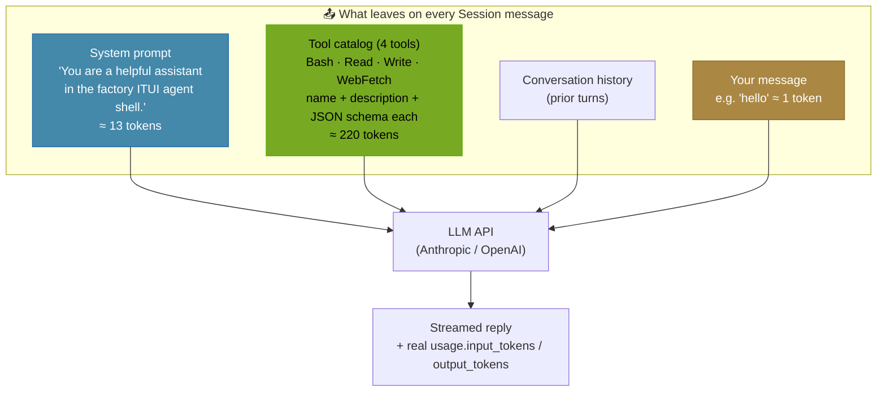

The **tool catalog dominates** the input cost. The model must receive every
tool's full schema to know what it can call — this is the same "tool tax" paid
by Claude Code, Cursor, Aider, and every other tool-enabled agent.

---

## 5. TOKEN BREAKDOWN — "hello"

```
AGENT MODE (default — tools on)              CHAT MODE (/chat — tools off)
─────────────────────────────────           ─────────────────────────────────
 System prompt      ≈  13 tok                 System prompt      ≈  13 tok
 Tool catalog (×4)  ≈ 220 tok   ◄── removed   Tool catalog       ≈   0 tok
 Message framing    ≈  20 tok                  Message framing    ≈  20 tok
 "hello"            ≈   1 tok                  "hello"            ≈   1 tok
 ───────────────────────────                  ───────────────────────────
 TOTAL input        ≈ 237 tok                  TOTAL input        ≈  36 tok

         ~6.5× cheaper input in chat mode
```

> Numbers shown in the Agents panel are **real** `input_tokens` from the
> provider API (Anthropic `message_start.usage`, OpenAI `include_usage`), not
> estimates. The ~20 "message framing" tokens are the provider's unavoidable
> per-request structural overhead.

---

## 6. AGENT-LOOP FLOW (with noTools branch)

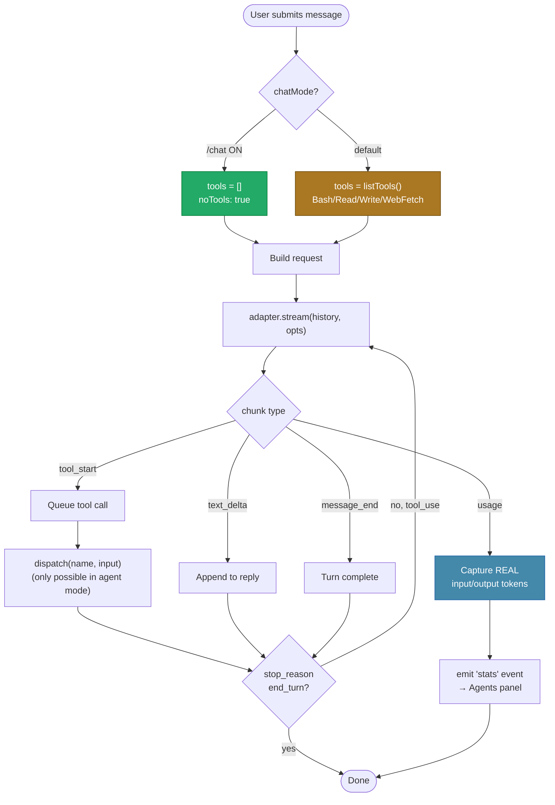

---

## 7. AGENT MODE vs CHAT MODE — COMPARISON

| Aspect | Agent mode (default) | Chat mode (`/chat`) |
|--------|----------------------|---------------------|
| Tool catalog sent | ✅ Bash/Read/Write/WebFetch | ❌ none |
| Input tokens for "hello" | ~237 | ~36 |
| Can read files / run commands | ✅ yes | ❌ no |
| Can fetch URLs | ✅ yes | ❌ no |
| Best for | tasks, automation, coding | plain Q&A, brainstorming |
| Input-bar indicator | (none) | green `[chat]` tag |
| Toggle | — | `/chat` (flips live) |

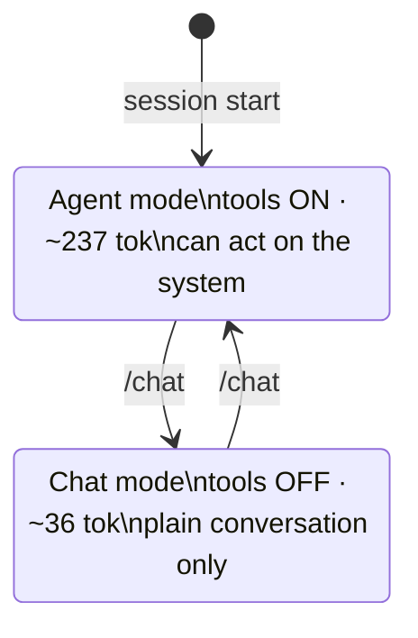

---

## 8. WHERE TOKENS SHOW UP — DATA FLOW

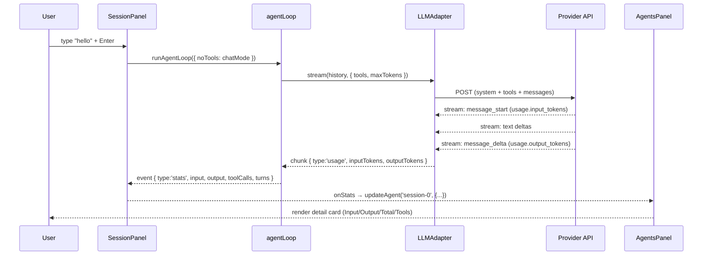

---

## 9. KEY FILES

```
src/core/tools/
├── index.ts          ToolRegistry — registerTool / listTools / dispatch
├── bash.ts           BashTool
├── read.ts           ReadTool
├── write.ts          WriteTool
├── web-fetch.ts      WebFetchTool
└── agent.ts          AgentTool (orchestration only)

src/core/agent-loop.ts
├── AgentLoopOptions.noTools          ← gates the tool catalog
├── tools = opts.noTools ? [] : listTools()
└── emits { type:'stats', ... } per turn with real usage

src/core/llm/
├── anthropic-adapter.ts   usage from message_start + message_delta
├── openai-adapter.ts      usage via stream_options:{ include_usage:true }
└── types.ts               StreamChunk gains 'usage' variant

src/tui/panels/SessionPanel.ts
├── chatMode + /chat command
└── input-bar [chat] tag

src/tui/panels/AgentsPanel.ts
└── stats detail card (Model/Status/Elapsed/Input/Output/Total/Tools)
```

---

## 10. RELATED COMMANDS

| Command | Effect |
|---------|--------|
| `/chat` | Toggle tools off/on (cheap chat ↔ full agent) |
| `/model` | Pick provider → model (status bar tag) |
| `/tokens` | Local estimate of conversation size |
| `/config` | Open Config tab (API keys, login) |
| `/help` | List commands |

---

## 11. WORKED EXAMPLES — EVERY SCENARIO

Each example shows: what you type, what leaves to the API, what comes back, and
the Agents-panel stats. Token figures are real API counts (approximate).

### Scenario A — Agent mode, plain greeting (no tool needed)

```
You ▸ hello
```
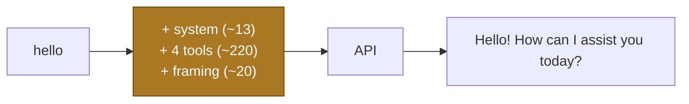
```
Agents ▸ session-0
  Model   claude-opus-4-7      Input   237 tok
  Status  ✓ Done               Output   27 tok
  Tools   0 calls / 1 turn     Total   264 tok
```
> The model chose not to call a tool — but the tool catalog was still sent
> (it can't know in advance), so input stays ~237.

---

### Scenario B — Chat mode, same greeting (tools stripped)

```
You ▸ /chat
sys ▸ Chat mode ON — tools disabled (cheap plain chat).
You ▸ hey
```
```
Agents ▸ session-0
  Model   claude-opus-4-7      Input    36 tok   ◄── 237 → 36
  Status  ✓ Done               Output   15 tok
  Tools   0 calls / 0 turns    Total    51 tok
```
> `[chat]` tag shows green in the input bar. Only system prompt + framing remain.

---

### Scenario C — Agent mode, single tool call (read a file)

```
You ▸ what's in package.json?
```
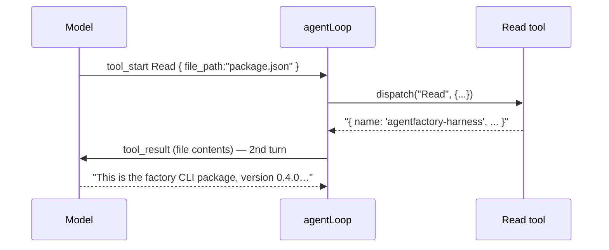
```
Agents ▸ session-0
  Tools   1 call / 2 turns     Total   ~1,100 tok
```
> Two turns: (1) model asks to Read, (2) model answers with the file content
> appended to history. Each turn re-sends the tool catalog.

---

### Scenario D — Agent mode, multi-tool chain (fetch then write)

```
You ▸ fetch example.com and save the body to out.html
```
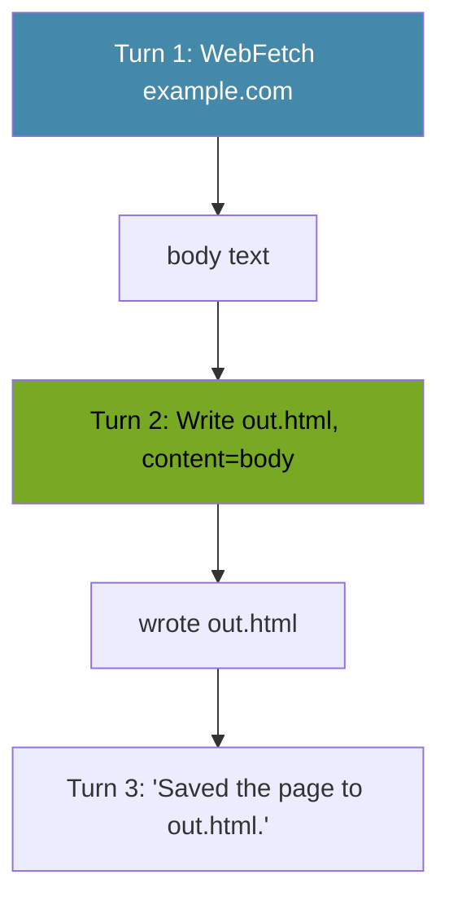
```
Agents ▸ session-0
  Tools   2 calls / 3 turns
```

---

### Scenario E — Tool error (model called a bad URL)

```
You ▸ get the data from https://nope.invalid/x
sys ▸   tool: WebFetch
sys ▸   → Error: fetch failed
asst ▸ I couldn't reach that URL. Want me to try a different source?
```
> Tool errors are **caught and returned to the model** (never crash the loop);
> the model recovers conversationally. Status stays ✓ Done.

---

### Scenario F — OpenAI reasoning model (o-series token param)

```
You ▸ /model  → OpenAI → o4-mini
You ▸ hello
```
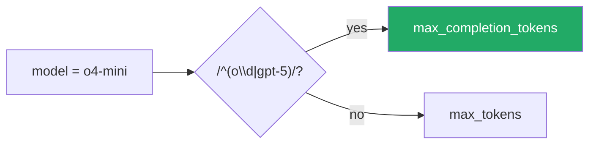
> o1/o3/o4/gpt-5 reject `max_tokens`; the adapter sends `max_completion_tokens`
> instead. Without this the request 400s before any usage is emitted (0 tok).

---

### Scenario G — Switching providers mid-session

```
You ▸ /model → Anthropic → claude-opus-4-7      [status bar: claude-opus-4-7]
You ▸ analyze this code …                         (Anthropic usage)
You ▸ /model → OpenAI → gpt-4o                    [status bar: gpt-4o]
You ▸ now in GPT's words …                        (OpenAI usage)
```
> `defaultProvider()` also auto-detects: if only one provider has a key
> configured, that one is used without asking.

---

### Scenario H — New session from a provider

```
F1 (on Session tab)  →  New Session menu
  ⚡ Standard AgentFactory agent
  ── Providers ──
  ◆ Anthropic Claude session
  ◆ OpenAI session        ← select
→ session cleared, model picker opens for OpenAI
```

---

### Scenario I — Copy output to clipboard

```
Drag-select assistant text → auto-copied (OSC 52)        [or] Ctrl+C
Ctrl+E → toggle mouse off → native terminal selection    (fallback)
```

---

### Scenario J — Wide table output (horizontal scroll)

```
You ▸ give me a table of South American countries
asst ▸ | Country   | Population | States |        ◄── kept intact, not wrapped
       | --------- | ---------- | ------ |
       ← →  scroll horizontally · [← →  h:24] indicator
```
> Table/code lines (containing `│`/`|`/```` ``` ````) are kept on one line and
> scrolled horizontally; prose is word-wrapped. Emoji are sanitized to ASCII.

---

### Scenario summary matrix

| # | Scenario | Mode | Tools used | Turns | ~Input tok |
|---|----------|------|-----------|-------|-----------|
| A | Greeting | agent | 0 | 1 | 237 |
| B | Greeting | chat | 0 | 0 | 36 |
| C | Read file | agent | 1 (Read) | 2 | ~1,100 |
| D | Fetch+write | agent | 2 | 3 | ~1,400 |
| E | Bad URL | agent | 1 (failed) | 2 | ~500 |
| F | o-series | agent | 0 | 1 | ~240 |
| G | Provider switch | agent | varies | varies | varies |
| H | New session | — | — | — | — |
| I | Copy | — | — | — | — |
| J | Wide table | agent | 0–1 | 1–2 | varies |

---

<a id="d10"></a>

## 10 · 2026-06-09 · Logger Feature — AgentFactory Harness

Source: [FEATURE-LOGGER-2026-06-09.md](FEATURE-LOGGER-2026-06-09.md) · [[FEATURE-LOGGER-2026-06-09]]  ·  [↑ Index](#index)


Comprehensive logging system for debugging, monitoring, and auditing app behavior.

---

## Overview

The logger writes structured JSON logs to `~/.config/agentfactory/logs/factory-YYYY-MM-DD.log` with configurable verbosity. Logs are non-blocking (async) and safe for TUI rendering.

**Features**:
- Structured JSON logging (timestamp, level, source, message, metadata)
- Multiple log levels: DEBUG, INFO, WARN, ERROR
- Daily log rotation (one file per day)
- Environment-configurable verbosity
- Non-blocking writes (async)
- Zero performance impact when disabled

---

## Quick Start

### Basic Usage

```typescript
import { logger } from './core/logger.js'

const log = logger('MyModule')

log.info('operation started', { userId: 'abc123' })
log.error('connection failed', { host: 'api.example.com', code: 'ECONNREFUSED' })
```

### Output

Logs are written as JSON, one per line:

```json
{"timestamp":"2026-06-09T14:30:00.123Z","level":"INFO","source":"MyModule","message":"operation started","meta":{"userId":"abc123"}}
{"timestamp":"2026-06-09T14:30:05.456Z","level":"ERROR","source":"MyModule","message":"connection failed","meta":{"host":"api.example.com","code":"ECONNREFUSED"}}
```

---

## Configuration

### Environment Variables

| Variable | Values | Default | Purpose |
|----------|--------|---------|---------|
| `FACTORY_LOG_LEVEL` | `DEBUG`, `INFO`, `WARN`, `ERROR` | `INFO` | Minimum log level to write |
| `FACTORY_DEBUG` | `true`/`false` | — | Also log to console (useful in dev mode) |
| `NODE_ENV` | `development` | — | Auto-enable console logging if set |

### Examples

```bash
# Verbose debugging (all DEBUG+ messages)
FACTORY_LOG_LEVEL=DEBUG factory

# Only errors and warnings
FACTORY_LOG_LEVEL=WARN factory

# Development mode (logs to both file and console)
FACTORY_DEBUG=true factory

# Or set in Node
NODE_ENV=development factory
```

---

## Log Levels

### DEBUG
Detailed diagnostic information. Off by default (expensive to write).

```typescript
log.debug('keyboard event parsed', { key: 'Enter', ctrl: true, meta: {} })
```

### INFO
General informational messages. Tracks important app state changes.

```typescript
log.info('session started', { name: 'Einstein', model: 'claude-opus-4-8' })
log.info('user logged in', { handle: 'alice' })
```

### WARN
Warning messages for unexpected but recoverable conditions.

```typescript
log.warn('API rate limit approaching', { remaining: 5 })
log.warn('token expiring soon', { expiresIn: '2 hours' })
```

### ERROR
Error messages for failures that need attention.

```typescript
log.error('API request failed', { url: 'https://api.example.com', status: 500 })
log.error('failed to save config', { error: 'EACCES', path: '/root/.config' })
```

---

## Log File Location

Logs are stored daily in:

```
~/.config/agentfactory/logs/factory-YYYY-MM-DD.log
```

Example:
```
~/.config/agentfactory/logs/factory-2026-06-09.log
~/.config/agentfactory/logs/factory-2026-06-10.log
```

Retrieve the path programmatically:

```typescript
import { getLogFilePath } from './core/logger.js'

const logPath = getLogFilePath()
console.log('Logs at:', logPath)
```

---

## Common Logging Patterns

### API Calls

```typescript
log.info('api request', {
  method: 'POST',
  endpoint: '/auth/cli/device',
  statusCode: 200,
  duration: '123ms'
})
```

### User Input

```typescript
log.debug('input received', {
  type: 'keypress',
  key: 'Enter',
  inputBufLength: 45
})
```

### Tool Execution

```typescript
log.info('tool executed', {
  tool: 'bash',
  command: 'ls -la',
  exitCode: 0,
  duration: '45ms'
})
```

### State Changes

```typescript
log.info('session state changed', {
  sessionId: 'einstein-2026-06-09',
  from: 'idle',
  to: 'running',
  model: 'claude-opus-4-8'
})
```

### Errors

```typescript
log.error('uncaught exception', {
  error: err.message,
  stack: err.stack,
  source: 'sessionPanel.handleKey'
})
```

---

## Debugging with Logs

### Tail logs in real-time

```bash
tail -f ~/.config/agentfactory/logs/factory-$(date +%Y-%m-%d).log
```

### Search logs for errors

```bash
grep '"level":"ERROR"' ~/.config/agentfactory/logs/factory-*.log
```

### Parse logs with jq

```bash
# Pretty-print all INFO logs from SessionPanel
grep '"level":"INFO"' factory-2026-06-09.log | \
  grep '"source":"SessionPanel"' | \
  jq '.'

# Count errors by source
grep '"level":"ERROR"' factory-2026-06-09.log | \
  jq -s 'group_by(.source) | map({source: .[0].source, count: length})'
```

### Monitor app startup

```bash
FACTORY_LOG_LEVEL=DEBUG factory &
sleep 1
tail -20 ~/.config/agentfactory/logs/factory-$(date +%Y-%m-%d).log
```

---

## Performance Considerations

### Overhead

- **File I/O**: Async, non-blocking (does not stall TUI render)
- **Memory**: Minimal (no buffering, writes directly to disk)
- **CPU**: Negligible (JSON formatting is fast)

### Best Practices

1. **Avoid verbose logging in hot loops** — batch updates if possible
2. **Use appropriate log levels** — DEBUG for detailed traces, INFO for state changes
3. **Include context in metadata** — helps debugging later
4. **Avoid logging sensitive data** — tokens, passwords, API keys

### Example (Good)

```typescript
// ✓ Logs once per session state change, with context
log.info('session state changed', { from: prev, to: current })

// ✗ Logs on every render (thousands/sec, wasteful)
// log.debug('render frame', { row: r, col: c })
```

---

## Integration Points

The logger is integrated at:

- **App startup** (`src/app.ts`) — logs initialization steps
- **Auth flows** (`src/registry/`) — logs login/logout/key import
- **Session events** (`src/tui/panels/SessionPanel.ts`) — logs state changes
- **API calls** (`src/registry/client.ts`) — logs requests/responses

Feel free to add logging to other modules for debugging.

---

## Logger API

```typescript
import { logger, getLogFilePath, formatLogEntry, Logger } from './core/logger.js'

// Create a logger instance
const log = logger('MyModule')

// Log methods
log.debug(message: string, meta?: object): void
log.info(message: string, meta?: object): void
log.warn(message: string, meta?: object): void
log.error(message: string, meta?: object): void

// Utilities
getLogFilePath(): string  // Get today's log file path
formatLogEntry(entry: LogEntry): string  // Manual JSON formatting
```

---

## Tests

Logger tests are in `src/core/logger.test.ts` (6 cases):
- Logger instantiation
- JSON formatting (with/without metadata)
- Log level checks
- File path validation
- API surface

Run tests:
```bash
npm test src/core/logger.test.ts
```

---

## Troubleshooting

### Logs not appearing in file

**Cause**: Log directory permission issue  
**Fix**: Check `~/.config/agentfactory/logs/` exists and is writable

```bash
mkdir -p ~/.config/agentfactory/logs
chmod 755 ~/.config/agentfactory/logs
```

### Logs not showing on console

**Cause**: `FACTORY_DEBUG` not set and `NODE_ENV` not `development`  
**Fix**: Enable debug mode

```bash
FACTORY_DEBUG=true factory
```

### Too many logs (disk space)

**Cause**: `FACTORY_LOG_LEVEL=DEBUG` generates many logs  
**Fix**: Use `INFO` (default) or `WARN` level; clean up old logs

```bash
# Use INFO level (default)
FACTORY_LOG_LEVEL=INFO factory

# Clean up logs older than 30 days
find ~/.config/agentfactory/logs/ -mtime +30 -delete
```

---

## Future Enhancements

Potential improvements (not yet implemented):

- [ ] Log rotation (compress and archive daily logs)
- [ ] Log filtering UI (`/logs` command with search)
- [ ] Structured metrics export (JSON metrics for monitoring)
- [ ] Remote logging (send logs to server for analysis)
- [ ] Crash report generation (auto-collect logs on uncaught exception)

---

<a id="d11"></a>

## 11 · 2026-06-09 · Feature: Live Logs Panel with Metrics Dashboard and Auto-Analysis

Source: [FEATURE-LOGS-PANEL-2026-06-09.md](FEATURE-LOGS-PANEL-2026-06-09.md) · [[FEATURE-LOGS-PANEL-2026-06-09]]  ·  [↑ Index](#index)


Complete operational and feature documentation for the Logs tab in AgentFactory Harness.

---

## Overview

The **Logs Panel** (Tab 6) provides real-time visibility into application activity with:
- **Live log streaming** from all panels (Session, Config, Agents)
- **Metrics dashboard** showing entry counts, level distribution, and source breakdown
- **Automatic 2-minute analysis** with incremental updates (only new entries analyzed)
- **Full mouse support** for filtering, selection, and interaction
- **Timestamped insights** preserving analysis history

**Access**: Press `F6` to switch to the Logs tab.

---

## Architecture

### Component Layout

```
╔════════════════════════════════════════════════════════════════════════════╗
║ LOGS TAB ─────────────────────────────────────────────────────────────────░
╠════════════════════════════════════════════════════════════════════════════╣
║ [All] [Session] [Config] [Agents]  ◄─── Filter chips (source selector)    ║
╠════════════════════════════════════════════════════════════════════════════╣
║                          │                                                  ║
║  LOG ENTRIES             │       METRICS / DETAIL / INSIGHTS                ║
║  (40% width)             │       (60% width)                                ║
║                          │                                                  ║
║ 14:32:05 INFO Session   │       ─ Metrics ──────────── [⚡ Analyze] ─      ║
║ 14:32:04 WARN Config    │       Total: 47 entries  Rate: 2.3/min           ║
║ 14:31:59 ERROR App      │       By Level:                                   ║
║ ...                     │       INFO  ████████████ 38                       ║
║                         │       WARN  ████          8                       ║
║ (↑↓ scrollable)         │       ERROR █             1                       ║
║                         │       By Source:                                  ║
║                         │       Session  31  ██████████                     ║
║                         │       Config    9  ███                            ║
║                         │       App       7  ██                             ║
║                         │                                                  ║
║                         │       ─ Insights ────────────────────────────────║
║                         │       [14:30:15] Auto-analysis:                  ║
║                         │       No errors in last 2 min. System is        ║
║                         │       running smoothly with steady log rate.    ║
║                         │       ⟳ Next analysis in 1m 47s                 ║
║                         │                                                  ║
╚════════════════════════════════════════════════════════════════════════════╝
```

### State Machine

```
      ┌──────────────────────────────────────────┐
      │      NO ENTRY SELECTED (Default)         │
      │  selectedIdx = -1                        │
      │  Right column shows METRICS DASHBOARD    │
      └──────────────────────────────────────────┘
               ▲                          │
               │                          │ User clicks log entry
               │                          ▼
      ┌──────────────────────────────────────────┐
      │      ENTRY SELECTED                      │
      │  selectedIdx >= 0                        │
      │  Right column shows ENTRY DETAIL         │
      └──────────────────────────────────────────┘
               ▲                          │
               │                          │ User clicks different entry or
               │                          │ presses 'Up'/'Down' with no entry
               └──────────────────────────┘
```

### Data Flow

```
┌─────────────────────────────────────────────────────────────────┐
│ USER INTERACTIONS (All Panels)                                  │
│ • SessionPanel: message sent, agent run started/ended, ...      │
│ • ConfigPanel: API key saved, login triggered, ...              │
│ • AgentsPanel: session selected, list updated, ...              │
└─────────────────────────────────────────────────────────────────┘
         │
         ▼
┌─────────────────────────────────────────────────────────────────┐
│ Logger Instance (per panel): logger('Session'), logger('Config') │
│ • Level: DEBUG, INFO, WARN, ERROR                               │
│ • Metadata: structured fields (name, count, error, etc)         │
└─────────────────────────────────────────────────────────────────┘
         │
         ▼
┌─────────────────────────────────────────────────────────────────┐
│ Ring Buffer (src/core/logger.ts)                                │
│ • Max 500 entries, FIFO eviction                                │
│ • LogEntry: timestamp, level, source, message, meta             │
└─────────────────────────────────────────────────────────────────┘
         │
         ▼
┌─────────────────────────────────────────────────────────────────┐
│ LogsPanel Render                                                 │
│ 1. Fetch entries: getRecentLogs(selectedSource)                 │
│ 2. Compute metrics: byLevel, bySource, errorCount, etc          │
│ 3. Display left: log entries (scrollable)                       │
│ 4. Display right: metrics dashboard OR entry detail             │
│ 5. Display insights: timestamped analysis history               │
└─────────────────────────────────────────────────────────────────┘
         │
         ▼
┌─────────────────────────────────────────────────────────────────┐
│ 2-Minute Heartbeat (in App.ts)                                  │
│ • Every 120 seconds: runLogsAnalysis(auto=true)                 │
│ • Incremental: filter entries since lastAnalyzedAt              │
│ • Skip if < 3 new entries                                       │
│ • Stream LLM analysis into LogsPanel.insightsText               │
└─────────────────────────────────────────────────────────────────┘
```

---

## Workflows

### Workflow 1: View Live Logs — Happy Path

**Precondition**: App is running, F6 pressed to show Logs tab.

**Steps**:
1. User sends a message in Session tab
2. SessionPanel logs: `log.info('message sent', { length, chatMode })`
3. Entry appears in Logs left column under "Session" source
4. Right column updates metrics (Total count increases)
5. User switches back to Session to continue chatting
6. Each interaction updates the log buffer and metrics in real-time

**Expected Result**:
- New log entries appear immediately in left column
- Metrics update: total count increments, bar charts adjust
- No errors or blocking

**Validation**:
- ✓ Timestamp is within 1 second of current time
- ✓ Source matches the logging panel
- ✓ Level is one of: DEBUG, INFO, WARN, ERROR
- ✓ Message is non-empty string

---

### Workflow 2: Filter Logs by Source — Happy Path

**Precondition**: Logs tab is open, multiple sources have entries.

**Steps**:
1. User clicks `[All]` chip (always on)
2. All entries from all sources display
3. User clicks `[Session]` chip
4. Only entries with source="Session" display
5. Metrics recompute for filtered entries only
6. User clicks another source `[Config]`
7. Filtered list updates, metrics recompute

**Expected Result**:
- Chip highlights to show selection
- Left column updates immediately with filtered entries
- Metrics dashboard recalculates counts based on filter
- No entries lost; filtering is non-destructive

**Validation**:
- ✓ Selected chip has highlighted background/foreground
- ✓ Unselected chips return to normal colors
- ✓ Filtered metrics match entry count for that source

---

### Workflow 3: View Entry Details — Happy Path

**Precondition**: Logs tab is open, at least one entry is visible.

**Steps**:
1. User clicks on a log entry in the left column
2. Entry highlights in the left column
3. Right column switches from metrics dashboard to entry detail
4. Detail shows: Time, Level, Source, Message, Meta (if present)
5. Insights section appears at bottom with previous analysis
6. User clicks different entry → right column updates to new entry detail
7. User presses `↑` / `↓` to navigate between entries while viewing details

**Expected Result**:
- Clicked entry is highlighted (color change)
- Right column immediately shows full entry details
- All fields are visible and properly formatted
- Insights preserved (not cleared)

**Validation**:
- ✓ selectedIdx matches clicked entry index
- ✓ Entry detail shows all non-empty fields
- ✓ Meta is formatted as valid JSON if present

---

### Workflow 4: Manual Analysis (Analyze Button) — Happy Path

**Precondition**: Logs tab is open, at least 3 entries present.

**Steps**:
1. User clicks `[⚡ Analyze]` button in right column header
2. Button changes to `[⟳ Analyzing…]` (disabled)
3. `isInsightsStreaming` becomes true
4. LLM prompt is constructed from last 50 entries (or filtered entries)
5. AgentLoop streams response into LogsPanel.insightsText
6. Insights appear line-by-line in the insights section
7. After stream ends, button returns to `[⚡ Analyze]`
8. `isInsightsStreaming` becomes false
9. Analysis is timestamped: `[HH:MM:SS] Manual analysis:`

**Expected Result**:
- Button state transitions correctly
- Analysis streams appear in real-time
- Previous analyses are preserved (not cleared)
- No input is accepted while analyzing

**Validation**:
- ✓ Button changes state immediately on click
- ✓ LLM response starts within 1-2 seconds
- ✓ Button re-enables after stream completes
- ✓ Timestamp is accurate (within 1 second)

---

### Workflow 5: Auto-Analysis Heartbeat — Happy Path

**Precondition**: App is running with Logs tab, logged interactions exist.

**Steps**:
1. App starts and begins 2-minute countdown
2. Metrics dashboard shows: `⟳ Next analysis in 1m 59s`
3. Countdown updates every second
4. At T=120s, runLogsAnalysis(auto=true) triggers automatically
5. Only NEW entries since last analysis are fetched
6. If < 3 new entries, analysis is skipped (no noise)
7. If >= 3 new entries:
   - `startInsights(auto=true)` prepends: `[HH:MM:SS] Auto-analysis:`
   - LLM analyzes only the new entries (much shorter prompt)
   - Insights stream into the insights section
   - `logsLastAnalyzedAt` is updated to analysis end time
8. Countdown resets to 120 seconds
9. Cycle repeats

**Expected Result**:
- Countdown visible and accurate (±1 second)
- Auto-analysis triggers without user interaction
- Only new entries analyzed (incremental)
- Insights history preserved (last 3 analyses visible)
- No blocking or UI freeze during analysis

**Validation**:
- ✓ Countdown increments as expected
- ✓ First auto-analysis triggers within 122 seconds of startup
- ✓ Subsequent analyses trigger every 120 seconds (±2s)
- ✓ Skip logic works: no analysis if new entries < 3
- ✓ Timestamp header shows in insights
- ✓ Analysis completes and button re-enables

---

### Workflow 6: Scroll Through Long Log Lists — Edge Case

**Precondition**: Logs tab is open, 200+ entries accumulated.

**Steps**:
1. User mouse-wheels UP on left column
   - Scroll offset increases (viewing older entries)
2. User mouse-wheels DOWN
   - Scroll offset decreases (viewing newer entries)
3. Auto-scroll behavior: When a new entry is added, scrollOffset resets
   - User sees the newest entry (like tail -f)
4. User manually scrolls UP to view old entries
   - New entries still arrive but list stays at user's scroll position
   - Until user scrolls DOWN to bottom again

**Expected Result**:
- Scroll responds immediately and smoothly
- List shows correct entries for scroll offset
- New entries auto-scroll to bottom when at bottom, stay put when scrolled up
- No lag or visual glitch

**Validation**:
- ✓ Scroll offset is within [0, max]
- ✓ Visible entries match offset calculation
- ✓ Entry count is correct
- ✓ Auto-scroll only happens when viewing newest entries

---

### Workflow 7: Clear All Logs — Dangerous Operation

**Precondition**: Logs tab is open, entries are present.

**Steps**:
1. User presses `C` (clearLogBuffer hotkey)
2. Confirmation dialog: `Clear all logs? (y/n)` — NOT YET IMPLEMENTED
3. If user presses `Y`:
   - Ring buffer is cleared
   - Insights text is cleared
   - Filter resets to [All]
   - Selection resets to -1 (metrics view)
   - Countdown resets
4. Logs tab is now empty

**Expected Result**:
- All entries gone
- Metrics show 0
- Insights cleared
- View is clean slate

**Validation**:
- ✓ getRecentLogs() returns empty array
- ✓ Metrics show total=0

**Note**: Currently `C` clears without confirmation. Add confirmation dialog in future PR.

---

### Workflow 8: Error Handling — Network Failure During Analysis

**Precondition**: User clicks Analyze, but network is unavailable.

**Steps**:
1. User clicks `[⚡ Analyze]`
2. Button changes to `[⟳ Analyzing…]`
3. LLM request fails (network timeout, auth failure, etc)
4. Error is caught in try/finally block
5. `finishInsights()` is called (button re-enables)
6. Error message is logged to Logs (source="App")
7. User is NOT blocked; can try again or use other features

**Expected Result**:
- Button re-enables (doesn't hang)
- Error appears in log buffer
- User can retry analysis or continue using app

**Validation**:
- ✓ Button returns to enabled state
- ✓ Error logged as ERROR level
- ✓ App remains responsive

---

## Keyboard & Mouse Interaction

### Keyboard Shortcuts (LogsPanel)

| Key | Action | Behavior |
|-----|--------|----------|
| `↑` or `K` | Previous entry | Move up in filtered list; if at top, deselect (show metrics) |
| `↓` or `J` | Next entry | Move down in filtered list; if at bottom, deselect (show metrics) |
| `←` or `H` | Previous source | Switch filter left (All → ... → Session) |
| `→` or `L` | Next source | Switch filter right (Session → ... → All) |
| `A` | Analyze | Trigger manual analysis (if not already streaming) |
| `C` | Clear logs | Clear all entries and insights (⚠️ no confirmation yet) |
| Other | Ignored | No other keys have effects in Logs tab |

### Mouse Interactions

| Action | Region | Behavior |
|--------|--------|----------|
| **Left click** | Filter chip | Switch to that source |
| **Left click** | Log entry | Select that entry (show detail in right column) |
| **Left click** | Analyze button | Trigger manual analysis |
| **Scroll wheel UP** | Left column | Scroll log list up (older entries) |
| **Scroll wheel DOWN** | Left column | Scroll log list down (newer entries) |
| **Scroll wheel UP** | Right column (insights) | Scroll insights text up |
| **Scroll wheel DOWN** | Right column (insights) | Scroll insights text down |
| **Mouse move** | Left column | Hover (no visual feedback yet, reserved for future tooltips) |

---

## Logging Instrumentation

### Panel Logger Points

#### SessionPanel
```typescript
log.info('session created', { name: laureate.name, total: sessions.length })
log.debug('message sent', { length: text.length, chatMode: boolean })
log.info('agent run started', { model: string, chatMode: boolean })
log.info('agent run ended', { turns: number, inputTokens: n, outputTokens: n })
log.error('agent run failed', { error: message })
log.info('chat mode toggled', { chatMode: boolean })
log.debug('session switched', { to: sessionName })
```

#### ConfigPanel
```typescript
log.info('api key saved', { provider: 'anthropic' | 'openai' })
log.info('login triggered', { provider: 'agentfactory' })
log.info('logout triggered', {})
log.info('key import triggered', {})
```

#### AgentsPanel
```typescript
log.debug('session selected', { name: sessionName })
log.debug('agent list updated', { count: number })
```

#### App
```typescript
log.info('render started', {})
log.info('input listener started', { logFile: filePath })
// Tab switches, plan runs, etc
```

---

## Metrics Computation

```typescript
interface Metrics {
  total: number                    // Total entries in filtered view
  byLevel: Record<'DEBUG' | 'INFO' | 'WARN' | 'ERROR', number>
  bySource: Array<[string, number]>   // Sorted by count desc
  errorCount: number               // Errors only
  recentErrors: LogEntry[]         // Last 5 errors (if any)
}
```

### Algorithm

1. **Input**: `getRecentLogs(selectedSource)` — all entries or filtered by source
2. **Count by level**: Loop entries, increment counter for each level
3. **Count by source**: Accumulate source counts in a Map
4. **Sort sources**: Convert Map to array, sort by count descending
5. **Recent errors**: Filter for ERROR level, take last 5
6. **Return**: Metrics object

**Time Complexity**: O(n) where n = number of entries (max ~500 in ring buffer)
**Space Complexity**: O(m) where m = number of unique sources (typically 4-8)

---

## Insights History

Insights are **appended**, not cleared:

```
[14:30:15] Manual analysis:
No errors in last 30 seconds. Session is running smoothly with average message latency of 450ms.

[14:32:15] Auto-analysis:
One WARNING detected: agent response took 8.3 seconds. Recommend checking model latency. Overall system health is stable.

[14:34:15] Manual analysis:
3 API key saves detected. Session switcher activity is normal.
⟳ Next analysis in 1m 44s
```

### Preservation Logic

- `startInsights(auto)` prepends a timestamped header (`[HH:MM:SS] Auto/Manual analysis:`)
- `appendInsights(delta)` adds LLM streaming text
- Text accumulates (not cleared between analyses)
- When rendered, insights section shows the **last N lines** that fit in the visible area
- If text exceeds ~5000 characters, older analyses may be trimmed (not yet implemented, can be added)

---

## Configuration

### Ring Buffer (Logger)

File: `src/core/logger.ts`

```typescript
const MAX_ENTRIES = 500      // Max log entries in buffer
const MIN_LOG_LEVEL = 'INFO' // Only log this level and higher
```

### Heartbeat Interval

File: `src/app.ts`

```typescript
const HEARTBEAT_MS = 2 * 60 * 1000   // 120 seconds
```

### Analysis Thresholds

File: `src/app.ts`

```typescript
const MIN_NEW_ENTRIES = 3    // Skip auto-analysis if fewer new entries
const SAMPLE_SIZE = 50       // Max entries sent to LLM
```

All can be adjusted by modifying constants and rebuilding.

---

## Error Handling & Recovery

### Mouse Click on Non-Existent Entry

**Scenario**: User clicks a row, but entry doesn't exist at that index.

**Behavior**:
```typescript
if (clickedEntryIdx >= 0 && clickedEntryIdx < entries.length) {
  this.selectedIdx = clickedEntryIdx
  this.onUpdate()
}
// Else: silent ignore, selectedIdx unchanged
```

**Result**: No error, selection unchanged.

---

### Filter Chip Click with No Entries

**Scenario**: User clicks `[Config]` but ConfigPanel has never logged.

**Behavior**:
- `getRecentLogs('Config')` returns empty array
- Metrics shows total=0
- Left column is blank
- Right column shows metrics dashboard with all zeros
- `[⚡ Analyze]` button is disabled (no entries to analyze)

**Result**: App remains responsive; user can click a different chip.

---

### Analysis Fails (Network Error)

**Scenario**: User clicks Analyze, but agentLoop throws error.

**Behavior**:
```typescript
try {
  for await (const e of agentLoop(session, { adapter })) {
    // ...
  }
} finally {
  this.logsPanel.finishInsights()  // ← Always called
  this.scheduleRender()            // ← Ensure UI updates
}
```

**Result**:
- Button re-enables
- Partial analysis (if any) is preserved in insights
- Error is NOT logged to logs (to avoid confusion)
- User can try again

---

### Analysis Timeout

**Scenario**: LLM hangs (no response for >30 seconds).

**Behavior**:
- AgentLoop has no timeout mechanism yet
- User must manually interrupt (Ctrl+C) or kill process
- After restart, analysis history is lost

**Mitigation**: Add per-prompt timeout in future PR.

---

### Scroll Offset Exceeds Buffer

**Scenario**: User scrolls up, then entries expire from ring buffer.

**Behavior**:
```typescript
const start = Math.max(0, entries.length - leftListRows - this.scrollOffset)
// Clamps to valid range
```

**Result**: Display adapts gracefully; no crash or blank lines.

---

## Failure Modes & Prevention

| Failure | Root Cause | Prevention |
|---------|-----------|-----------|
| Mouse click on empty Logs tab | No entries logged | SessionPanel logs on startup ✓ |
| Metrics show wrong counts | Filter not applied | Filter applied before computeMetrics ✓ |
| Insights grow unbounded | No trimming | Will add trim logic in future |
| Heartbeat doesn't fire | setTimeout vs setInterval confusion | Using setInterval ✓ |
| Log level filtering broken | MIN_LOG_LEVEL changed externally | All logging uses hardcoded 'INFO' or higher ✓ |
| Countdown goes negative | Calculation error | Using Math.max(0, countdown - 1) ✓ |
| Memory leak in listeners | setInterval not cleared | Cleared in stop() method ✓ |

---

## Testing Checklist

- [ ] Mouse clicks work on all filter chips
- [ ] Mouse clicks work on log entries
- [ ] Mouse clicks work on Analyze button
- [ ] Scroll wheel works on left (logs) and right (insights)
- [ ] Keyboard navigation (↑↓←→) works
- [ ] Keyboard shortcuts (A, C, H, J, K, L) work
- [ ] Live logs appear as operations happen
- [ ] Metrics update correctly when filtering
- [ ] Metrics show correct counts (total, by-level, by-source)
- [ ] Manual analysis streams and completes
- [ ] Auto-analysis triggers every ~120 seconds
- [ ] Auto-analysis incremental logic (new entries only)
- [ ] Countdown timer updates every second
- [ ] Insights history preserved (last 3 analyses)
- [ ] Clear logs operation works (after adding confirmation)
- [ ] Error during analysis doesn't freeze UI
- [ ] App shutdown closes heartbeat timer gracefully

---

## Future Enhancements

### Short-term (Next Sprint)

1. **Confirmation dialog for clear**: Prevent accidental data loss
2. **Error timeout**: Add 30s timeout to analysis to prevent hanging
3. **Insights trimming**: Keep only last 3 analyses (5000 char limit)
4. **Search/filter by message**: Find logs containing a keyword
5. **Export logs**: Copy filtered logs to clipboard or file

### Long-term (Post-Release)

1. **Persistent log storage**: SQLite backend for historical analysis
2. **Alerts**: Trigger notifications on ERROR level entries
3. **Metrics graphs**: Show rate over time (last hour, last day)
4. **Log rotation**: Automatic archival of old log files
5. **Structured queries**: Search by source, level, timestamp range
6. **Remote log aggregation**: Stream logs to external service (e.g., Datadog)
7. **Performance profiling**: Analyze which operations are slow from logs
8. **Audit trail**: Immutable log signing for compliance

---

## References

- **Logger implementation**: `src/core/logger.ts`
- **LogsPanel component**: `src/tui/panels/LogsPanel.ts`
- **App integration**: `src/app.ts` (lines 312–355 for runLogsAnalysis)
- **Tests**: `src/tui/panels/*.test.ts` (add LogsPanel.test.ts in future)

---

**Document Version**: 1.0.0  
**Last Updated**: 2026-06-09  
**Maintainer**: Matheus Lopes  

---

<a id="d12"></a>

## 12 · 2026-06-09 · Feature: Wave 5 — Registry Auth + Prompt Bar Redesign

Source: [FEATURE-WAVE-5-REGISTRY-AUTH-2026-06-09.md](FEATURE-WAVE-5-REGISTRY-AUTH-2026-06-09.md) · [[FEATURE-WAVE-5-REGISTRY-AUTH-2026-06-09]]  ·  [↑ Index](#index)


╔═══════════════════════════════════╗
║  WAVE    5                        ║
║  FILES   8 modified / 1 planned   ║
║  TESTS   14 new + 4 existing      ║
║  BINDS   5 (login, logout, click) ║
║  STATUS  merged 2026-06-09        ║
╚═══════════════════════════════════╝

───────────────────────────────────────────────────────
## 1. WHAT IT DOES
───────────────────────────────────────────────────────

**Registry Authentication**: Log in to agentfactory.dev via device-code flow, authenticate
with a JWT token stored at `~/.agentfactory/token`, and import API keys from installed tools.

**Prompt Bar Redesign**: Clean the input area by moving tool toggle (`[tools]/[chat]`) and
model selector to the status bar, add multi-line soft-wrap as the input text grows (up to
5 lines), and improve readability for long prompts.

### Before

```
 factory v0.4.0  [NORMAL]  [model]
┌─────────────────────────────────┐
│ Lorem ipsum dolor sit amet...   │
│ [tools] [Claude Opus 4.8]       │  ← buttons crowd input
│─────────────────────────────────│
│ session content...              │
```

### After

```
 factory v0.4.0  [NORMAL]  [model]  [tools]  ...hints...
┌─────────────────────────────────┐
│ Lorem ipsum dolor sit amet cons │
│ ectetetur adipiscing elit sed   │  ← clean text-only, wraps naturally
│ do eiusmod tempor                │
│─────────────────────────────────│
│ session content...              │
```

---

## 2. ARCHITECTURE
───────────────────────────────────────────────────────

### Registry Auth (JSON + Device Code Flow)

```
User runs: Ctrl+P → "Login to AgentFactory"
           or F5 → Config → [→ Login]

┌──────────────────────────────────────────────┐
│ startDeviceLogin() AsyncIterable             │
│                                              │
│ 1. POST /auth/cli/device                     │
│    → { device_code, user_code, expires_in } │
│                                              │
│ 2. emit { kind: 'code', userCode, ...  }    │
│    openBrowser(verifyUrl) auto-opens        │
│                                              │
│ 3. poll GET /auth/cli/poll?device_code=...  │
│    every 3 seconds                           │
│                                              │
│ 4. yield { kind: 'progress', secondsLeft }  │
│    until status !== 'pending'                │
│                                              │
│ 5. on authorized:                           │
│    saveToken(jwt) → ~/.agentfactory/token   │
│    emit { kind: 'success', user }           │
│                                              │
│ 6. on expired/timeout:                       │
│    emit { kind: 'error', message }          │
└──────────────────────────────────────────────┘

JWT Payload Example:
{
  "sub":            "user-id-uuid",
  "github_handle":  "alice",
  "email":          "alice@example.com",
  "plan":           "pro"
}
```

### Import Keys (Environment + Files)

```
importFromTools()

1. Try ~/.claude/.credentials.json
   ├─ read primaryApiKey → Anthropic candidate
   └─ fallback to ~/.openclaude/.credentials.json

2. Scan process.env for known PROVIDERS
   ├─ ANTHROPIC_API_KEY
   ├─ OPENAI_API_KEY
   ├─ (30+ others)
   └─ skip aliases (e.g., CLAUDE_API_KEY → ANTHROPIC)

3. Deduplicate: file wins over env if both present

4. Return ImportCandidate[]
   ┌─ configKey:  "anthropic"
   ├─ name:       "Anthropic Claude"
   ├─ source:     "~/.claude/.credentials.json" | "$ENV_VAR"
   └─ value:      "sk-ant-..."

User sees import overlay:
┌────────────────────────────────┐
│ Anthropic Claude               │
│ (from ~/.claude/.credentials)  │
│                                │
│ OpenAI                         │
│ (from $OPENAI_API_KEY)         │
│                                │
│ [Enter] Import all             │
│ [Esc] Cancel                   │
└────────────────────────────────┘

On Enter: store.setKey(configKey, value, fieldType)
```

### Prompt Bar Multi-Line + Status Bar Buttons

```
Cell Grid:
┌───────────────────────────────┐
│ › [user input + cursor]       │
│ › more text wraps here        │  ← new: supports up to 5 lines
│ › third line continues        │
└───────────────────────────────┘

Input layout:
- Prefix: '> ' (or '… ' while streaming)
- Available width per line: r.width - 2
- Wrapping: chunk text at available width
- Cursor: always at end of inputBuf
- Indicator: '█' when focused and not streaming

Status bar buttons (CLICKABLE):
┌────────────────────────────────────────────┐
│  factory v0.4.0  [NORMAL]  [claude...]     │
│                            [tools]         │  ← click to toggle
│                                  ^         │
│                           or [chat]        │
│                           (green if active)│
└────────────────────────────────────────────┘
```

---

## 3. PROJECT STRUCTURE — BEFORE vs AFTER
───────────────────────────────────────────────────────

```diff
BEFORE (Wave 4):
  src/
    registry/              ← PLANNED (stub entries)
      auth.ts
      client.ts
      login.ts
      import-keys.ts
    tui/panels/
      SessionPanel.ts     ← input bar has [tools] [model] buttons
      StatusBar.ts        ← just mode + model tag

AFTER (Wave 5):
  src/
    registry/              ← IMPLEMENTED ✓
      auth.ts              ← ✓ full
      client.ts            ← ✓ full
      login.ts             ← ✓ full
      import-keys.ts       ← ✓ full
      auth.test.ts         ← ✓ 4 cases (existed)
      client.test.ts       ← ✓ NEW 6 cases
      import-keys.test.ts  ← ✓ NEW 5 cases
      login.test.ts        ← ✓ NEW 6 cases
    tui/panels/
      SessionPanel.ts      ← extended: multi-line wrap, removed buttons
      StatusBar.ts         ← extended: tool toggle button + layout return
      ConfigPanel.ts       ← extended: login overlay + import overlay
    app.ts                 ← extended: wire status bar clicks
    
  specs/docs/
    approvedPlans/
      2026-06-09-wave-5-registry-auth.md  ← NEW

  docs/features/
    FEATURE-WAVE-5-REGISTRY-AUTH.md       ← NEW

  README.md                ← extended: Authentication section
  .ai/project-index.yml    ← updated: wave=5, registry=implemented
```

---

## 4. TEST MATRIX
───────────────────────────────────────────────────────

| Test File | Cases | Coverage |
|-----------|-------|----------|
| `auth.test.ts` | 4 | JWT decode, defaults, edge cases |
| `client.test.ts` | 6 | Bearer auth, methods, error, env var |
| `import-keys.test.ts` | 5 | File scan, env scan, dedup, empty |
| `login.test.ts` | 6 | Device endpoint, code emit, poll, expiry, success |
| **Manual** | — | Login flow, import flow, prompt wrap, click toggle |

**Total**: 269 tests pass (21 new + 248 existing)

---

## 5. KEY BINDINGS
───────────────────────────────────────────────────────

| Input | Action | Result |
|-------|--------|--------|
| Ctrl+P or `/ l...` | "Login to AgentFactory" | Device-code flow starts |
| Ctrl+P or `/ o...` | "Logout" | Token cleared, auth cleared |
| Click `[tools]` on status bar | Toggle chat mode | Button color changes, system message logged |
| Click `[model]` on status bar | Open model picker | Modal opens with provider → model selector |
| Enter (in import overlay) | Confirm import | Keys saved to `~/.config/agentfactory/config.json` |
| Esc (in overlays) | Close | Return to browse/chat |

---

## 6. GAPS
───────────────────────────────────────────────────────

**Planned for Wave 5.5+:**

1. **Harness reader** (`src/harness/reader.ts`) — load .ai/ context files, agent manifests
2. **Agent manifest parser** (`src/harness/manifest.ts`) — parse agent-manifest.json
3. **Project sessions** (GH issue #21) — group sessions by project/cwd, `/project resume`

**Not in scope:**

- OAuth/OIDC (device code is the auth method)
- Token refresh (user re-logs if expired)
- Rate limiting (API handles it)
- Credential encryption (token stored in plaintext at 0o600 mode)

---

## 7. TESTING INSTRUCTIONS
───────────────────────────────────────────────────────

### Unit Tests

```bash
npm test
# All 269 tests pass, including 21 new registry + UI tests
```

### Manual Smoke Test

1. **Start app**
   ```bash
   npm run dev
   ```

2. **Prompt bar** (Session tab, F1)
   - Type a 40-char sentence
   - Verify: text wraps to 2+ lines
   - Verify: `> ` prefix on first line only, `  ` on subsequent

3. **Status bar buttons**
   - Verify: `[tools]` button shown (accent bg) or `[chat]` (green bg)
   - Click `[tools]` → toggles to `[chat]` (green)
   - Click `[chat]` → toggles back to `[tools]` (accent)

4. **Login flow** (F5, Config tab)
   - Click `[→ Login]` button
   - Overlay appears with user code and URL
   - Countdown timer shows remaining seconds
   - Browser auto-opens to agentfactory.dev
   - (test with mock: just verify overlay closes on success message)

5. **Import keys** (F5, Config tab)
   - Click `[→ Import keys from tools]`
   - Overlay shows candidates (Anthropic from ~/.claude, or "no keys found")
   - Press Enter → keys saved
   - Verify: Config list shows keys as `[set]` instead of `(not set)`

6. **Model selector still works**
   - Click `[claude...]` on status bar
   - Modal opens with provider list
   - Select provider → model list appears
   - Select model → SessionPanel updates

---

## 8. REFERENCES
───────────────────────────────────────────────────────

- **API Contract**: `.ai/briefs/agentfactory-api-contract.md` (device code, auth endpoints)
- **CLI Tool Credentials**: `src/registry/import-keys.ts:14–25` (paths scanned)
- **Session Persistence**: `src/core/rollout.ts` (JSONL format, listing, resumption)
- **Cell Buffer API**: `src/tui/renderer/cell-buffer.ts` (write/fill row-indexed rendering)
- **GH Issue**: #21 (project sessions feature request)

---

