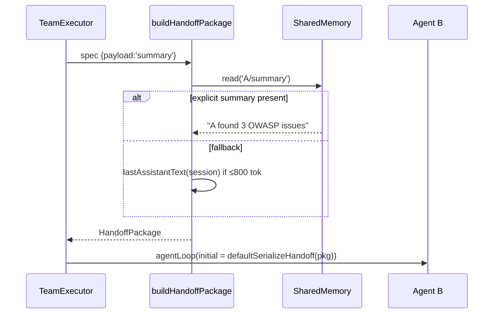
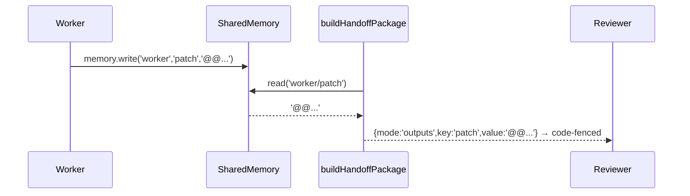

# PLAN-02 — HandoffChain & HandoffPackage

<!-- version: 1.0.0 -->
<!-- feature: src/core/team/handoff.ts -->
<!-- depends-on: PLAN-01 -->
<!-- consumed-by: PLAN-03, PLAN-08 -->

## 1. Overview

A handoff is a structured relay: when agent A finishes, it packages its result and the
package becomes agent B's initial context. Distinct from `dependsOn` (which is pure
ordering) — though after PLAN-01 normalization every handoff *also* has a `dependsOn` edge.
Three payload modes: `summary` (default), `full`, `outputs.<key>`.

## 2. HandoffPackage Interface

```typescript
// src/core/team/handoff.ts
import type { MessageParam } from '@anthropic-ai/sdk/resources/messages.js'

export interface HandoffPackage {
  schema:       '1.0'
  fromAgent:    string
  fromRole:     string | undefined
  fromSkills:   string[]
  fromProvider: string
  fromModel:    string
  finishedAt:   string                       // ISO 8601
  tokensUsed:   { input: number; output: number }
  payload:      HandoffPayload
}

export type HandoffPayload =
  | { mode: 'summary'; summary: string }
  | { mode: 'full';    messages: MessageParam[] }
  | { mode: 'outputs'; key: string; value: string }
```

## 3. Payload spec parsing

```typescript
export function parseHandoffPayloadSpec(spec: string): { to: string; payload: string } {
  const [to, payload = 'summary'] = spec.split(':')
  return { to, payload }
}
// "worker"→summary · "worker:full"→full · "worker:outputs.diff"→outputs.diff
```

## 4. buildHandoffPackage — uses kernel tokens (fixes F9) and §R summary (fixes F13)

```typescript
export async function buildHandoffPackage(
  agent: AgentNode, session: Session, ctx: OrchestrationContext, spec: HandoffSpec,
): Promise<HandoffPackage> {
  let payload: HandoffPayload
  if (spec.payload === 'full') {
    payload = { mode: 'full', messages: [...session.getHistory()] }
  } else if (spec.payload === 'summary') {
    payload = { mode: 'summary', summary: await resolveSummary(agent, session, ctx) }
  } else {
    const key = spec.payload.slice('outputs.'.length)
    payload = { mode: 'outputs', key, value: ctx.memory.read(`${agent.name}/${key}`) ?? '' }
  }
  return {
    schema: '1.0', fromAgent: agent.name, fromRole: agent.role, fromSkills: agent.skills,
    fromProvider: agent.provider, fromModel: agent.model ?? 'unknown',
    finishedAt: new Date().toISOString(),
    tokensUsed: ctx.tokens.get(agent.name) ?? { input: 0, output: 0 },   // kernel, not session
    payload,
  }
}
```

### §R resolveSummary — no extra LLM call by default

```typescript
async function resolveSummary(agent: AgentNode, session: Session, ctx: OrchestrationContext): Promise<string> {
  const explicit = ctx.memory.read(`${agent.name}/summary`)
  if (explicit) return explicit                                  // 1. agent self-summarized
  const last = lastAssistantText(session)
  if (estimateTokens(last) <= 800) return last                   // 2. final message, free
  return summarizeWith(getAdapter(agent.provider), session)      // 3. last resort, source adapter
}
```

## 5. defaultSerializeHandoff — neutral receiving format

```typescript
export function defaultSerializeHandoff(pkg: HandoffPackage): MessageParam[] {
  const intro = [
    `You are receiving a handoff from **${pkg.fromAgent}**`,
    pkg.fromRole ? `(role: ${pkg.fromRole})` : '',
    pkg.fromSkills.length ? `with skills: ${pkg.fromSkills.join(', ')}` : '',
    `| via ${pkg.fromProvider} | tokens ${pkg.tokensUsed.input}in/${pkg.tokensUsed.output}out`,
  ].filter(Boolean).join(' ')

  if (pkg.payload.mode === 'full') return pkg.payload.messages
  const body = pkg.payload.mode === 'summary'
    ? `**Summary:**\n${pkg.payload.summary}`
    : `**Output (${pkg.payload.key}):**\n\`\`\`\n${pkg.payload.value}\n\`\`\``
  return [{ role: 'user', content: `${intro}\n\n${body}` }]
}
```

## 6. Mermaid — summary mode (memory-hit, no extra LLM call)



## 7. Mermaid — outputs.patch & full modes


Full mode passes `session.getHistory()` verbatim; receiving agent gets entire trail
(⚠️ token-heavy; truncate oldest if it exceeds receiver `maxTokens`).

## 8. Edge Cases

| Case | Handling |
|---|---|
| `outputs.key` missing in memory | empty string + logged warning |
| `full` exceeds receiver maxTokens | truncate oldest messages, keep most recent |
| summary fallback LLM call fails | use last assistant text raw |
| handoffTo target already terminal (shouldn't happen post-normalize) | log + skip relay |

## 9. Test Cases

```
handoff.test.ts:
  - buildHandoffPackage summary: memory hit returns explicit
  - summary fallback: short last message used, no LLM call
  - full: returns all session messages
  - outputs.patch: reads SharedMemory key
  - outputs.missing: empty string, no throw
  - tokensUsed read from ctx.tokens (not session)
  - defaultSerializeHandoff summary/full/outputs shapes
  - parseHandoffPayloadSpec worker / worker:full / worker:outputs.diff
```

## 9.5 Codebase Reality

| Assumed | Reality | Resolution |
|---|---|---|
| `session.getTokenUsage()` | only `tokenCount()` (G7) | read `ctx.tokens.get(agent.name)` (kernel map, fed by `runAgentLoop`) |
| `summarizeWith(adapter, session)` | n/a | thin wrapper over `runAgentLoop` (maxTurns 1, "summarize in 1 paragraph") |
| `lastAssistantText(session)` | n/a | scan `session.getHistory()` for last `role:'assistant'` text |
| `estimateTokens(s)` | n/a | `Math.ceil(s.length / 4)` heuristic |
| `getAdapter(provider)` | added by PLAN-CORE §3.7 | import from `llm/index.ts` |

```typescript
function lastAssistantText(session: Session): string {
  const h = session.getHistory()
  for (let i = h.length - 1; i >= 0; i--) {
    const m = h[i]; if (m.role === 'assistant')
      return typeof m.content === 'string' ? m.content
        : m.content.filter(b => b.type === 'text').map(b => (b as { text: string }).text).join('\n')
  }
  return ''
}
const estimateTokens = (s: string) => Math.ceil(s.length / 4)
async function summarizeWith(adapter: LLMAdapter, session: Session): Promise<string> {
  const s = new Session()
  const { output } = await runAgentLoop(s, { adapter, systemPrompt: 'Summarize the following work in one paragraph.',
    initialMessages: [{ role: 'user', content: lastAssistantText(session).slice(0, 4000) }], maxTurns: 1 })
  return output
}
```

## 9.6 Contracts

```
IMPORTS:
  AgentNode, HandoffSpec ← PLAN-01 · Session ← core/session.ts · MessageParam ← anthropic sdk
  OrchestrationContext (ctx.tokens, ctx.memory) ← PLAN-00 · getAdapter, runAgentLoop ← PLAN-CORE
EXPORTS:
  HandoffPackage, HandoffPayload, buildHandoffPackage, defaultSerializeHandoff, parseHandoffPayloadSpec
    → PLAN-03 (serialize override), PLAN-08 (relay)
```

## 9.7 Integration test (crosses PLAN-03)

`handoff→serialize.test.ts`: build a summary `HandoffPackage`, pass through
`OpenAICompatAdapter('deepseek').serializeHandoff(pkg)` → assert resulting messages have
string `content` (no ContentBlock[]), intro line present.

## 10. Verification Checklist / Definition of Done

- [ ] Summary handoff with a prior `memory.write('A/summary',…)` makes **no** extra LLM call
- [ ] `outputs.patch` reaches receiver inside a code fence
- [ ] `tokensUsed` reflects kernel token map (G7), matching TUI totals
- [ ] helpers defined; no placeholders; Contracts resolve
