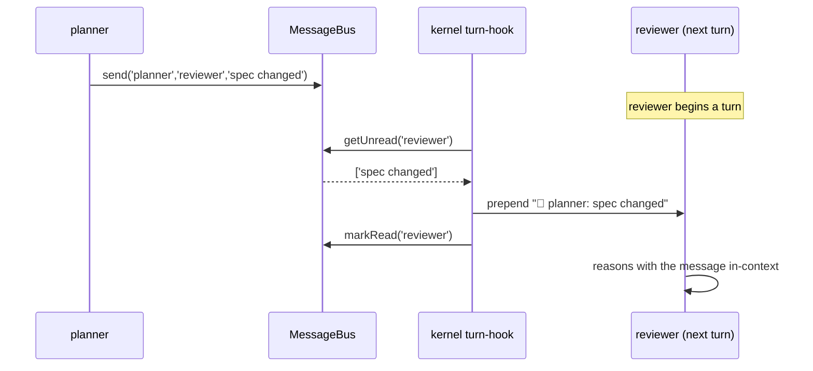
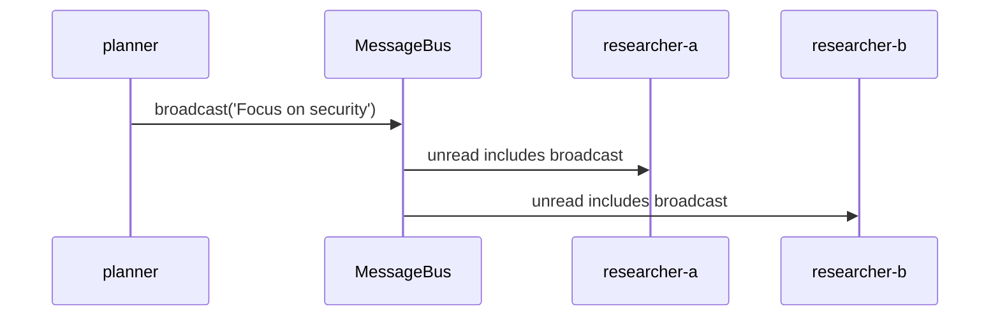

# PLAN-04 — MessageBus

<!-- version: 1.0.0 -->
<!-- feature: src/core/team/message-bus.ts, src/core/tools/message.ts -->
<!-- depends-on: PLAN-01 -->
<!-- consumed-by: PLAN-07, PLAN-08, PLAN-10 -->

## 1. Overview

In-process pub/sub for agent-to-agent messages. No external broker. **Critical fix (§O / F6):**
agents are LLM loops and never spontaneously poll — so the kernel *auto-delivers* unread
messages into each agent's context at turn boundaries, in addition to the explicit `message`
tool. Without this, messages were write-only TUI decoration.

## 2. Interface & Class

```typescript
// src/core/team/message-bus.ts
export interface AgentMessage {
  id: string; from: string; to: string; content: string; timestamp: Date
}
export interface BusStats { total: number; perAgent: Record<string, { sent: number; received: number }> }

export class MessageBus {
  private messages: AgentMessage[] = []
  private readState = new Map<string, Set<string>>()        // agent → read ids
  private subscribers = new Map<string, Set<(m: AgentMessage) => void>>()

  send(from: string, to: string, content: string): AgentMessage {
    const m = { id: crypto.randomUUID(), from, to, content, timestamp: new Date() }
    this.messages.push(m)
    this.notify(to, m); this.notify('*', m)
    return m
  }
  broadcast(from: string, content: string): AgentMessage { return this.send(from, '*', content) }

  getUnread(agent: string): AgentMessage[] {
    const read = this.readState.get(agent) ?? new Set()
    return this.messages.filter(m => m.from !== agent && (m.to === agent || m.to === '*') && !read.has(m.id))
  }
  markRead(agent: string, ids: string[]): void {
    const s = this.readState.get(agent) ?? new Set(); ids.forEach(i => s.add(i)); this.readState.set(agent, s)
  }
  subscribe(agent: string, cb: (m: AgentMessage) => void): () => void { /* add + return unsub */ }
  getConversation(a: string, b: string): AgentMessage[] { /* a↔b ordered */ }
  getAll(): AgentMessage[] { return [...this.messages] }      // TUI
  getStats(): BusStats { /* counts */ }
  private notify(key: string, m: AgentMessage): void { this.subscribers.get(key)?.forEach(cb => cb(m)) }
}
```

## 3. MessageTool (explicit pull/send)

```typescript
// src/core/tools/message.ts
export const MessageTool = buildTool({
  name: 'message',
  description: 'Send a message to another agent in the team, or "*" to broadcast.',
  isReadOnly: false,
  inputSchema: { type: 'object', properties: {
    to:      { type: 'string', description: 'Agent name or "*"' },
    content: { type: 'string', description: 'Message content' },
  }, required: ['to', 'content'] },
  async call({ to, content }, ctx) {
    ctx.bus.send(ctx.agentName, to, content)
    return `Message sent to ${to}`
  },
})
```

## 4. Auto-delivery (§O — the F6 fix)

The kernel exposes a turn hook that `agentLoop` calls before each turn. It drains the agent's
unread and prepends them as a transient user message, then marks read.

```typescript
export function injectInbox(agentName: string, ctx: OrchestrationContext): MessageParam | null {
  const unread = ctx.bus.getUnread(agentName)
  if (!unread.length) return null
  ctx.bus.markRead(agentName, unread.map(m => m.id))
  const body = unread.map(m => `- **${m.from}**: ${m.content}`).join('\n')
  return { role: 'user', content: `📨 Team messages since your last turn:\n${body}` }
}
```

## 5. Mermaid — auto-delivery



## 6. Mermaid — broadcast



## 7. TUI feed (consumed by PLAN-10)

```
14:02:01  planner → *        "Focus on security aspects only"
14:02:15  worker → reviewer  "Patch ready at worker/patch"
●=unread  ↗=sent this turn   ↙=received this turn
```

## 8. Edge Cases

| Case | Handling |
|---|---|
| send to unknown agent name | message stored; never delivered; surfaced in TUI as undeliverable (warn) |
| broadcast does not echo to sender | `m.from !== agent` filter in getUnread |
| subscriber throws | caught, logged, other subscribers still notified |
| huge message | truncated in TUI feed; full text in rollout |

## 9. Test Cases

```
message-bus.test.ts: send/getUnread; broadcast to all-but-sender; markRead;
  subscribe/unsubscribe; getConversation order; getStats counts
message-tool.test.ts: call sends; broadcast; missing ctx.bus throws
inbox.test.ts: injectInbox returns prepend msg + marks read; null when no unread
```

## 9.5 Codebase Reality

| Assumed | Reality | Resolution |
|---|---|---|
| `buildTool({... call ...})` | no `buildTool`; tools use `run(input,ctx?)` | author via PLAN-CORE `buildTool`; `run` reads `ctx.bus`, `ctx.agentName` |
| "kernel hook before each turn" delivers inbox | no per-turn hook (G10) | use `onBeforeTurn` option (PLAN-CORE §3.6); `runAgentLoop` passes `injectInbox` |
| `ctx.bus`, `ctx.agentName` | `ToolUseContext` (PLAN-CORE §3.1) | import that type |

`injectInbox` (§4) is wired by `TeamExecutor` as `onBeforeTurn: s => injectInbox(node.name, ctx)`.

## 9.6 Contracts

```
IMPORTS:
  buildTool, ToolUseContext, Tool ← PLAN-CORE · MessageParam ← anthropic sdk
EXPORTS:
  MessageBus, AgentMessage, BusStats  → PLAN-00 (createContext), PLAN-07, PLAN-08, PLAN-10
  MessageTool, injectInbox            → PLAN-08 (tool list + onBeforeTurn)
```

## 9.7 Integration test (crosses PLAN-08)

`inbox-delivery.test.ts`: a worker `message('reviewer',…)`; run reviewer via `runAgentLoop`
with `onBeforeTurn: injectInbox`; assert the reviewer's session received a `📨` user message
and the bus marked it read.

## 10. Verification Checklist / Definition of Done

- [ ] A `message('reviewer', …)` from worker appears in reviewer's *context* next turn (not just TUI)
- [ ] Broadcast reaches all agents except sender
- [ ] TUI feed shows live traffic with badges
- [ ] `MessageTool.run` reads `ctx.bus`/`ctx.agentName`; throws clearly if absent
