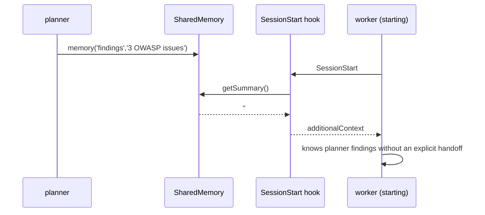

# PLAN-05 — SharedMemory (Runtime, Layer 1)

<!-- version: 1.0.0 -->
<!-- feature: src/core/team/shared-memory.ts, src/core/tools/memory.ts -->
<!-- depends-on: PLAN-01 -->
<!-- consumed-by: PLAN-08, PLAN-10, PLAN-12 -->

## 1. Overview

Ephemeral, namespaced key-value store shared by all agents **within one team run**. This is
**Layer 1** of the 3-layer memory model (PLAN-12 adds persistent Layers 2/3). `getSummary()`
is injected at each agent's SessionStart via `additionalContext` — the same seam reused by
message auto-delivery (§O) and tiered memory (PLAN-12).

## 2. Interface & Class

```typescript
// src/core/team/shared-memory.ts
export interface MemoryEntry {
  value: string; agentName: string; key: string; updatedAt: string; createdAt: string
}

export class SharedMemory {
  private store = new Map<string, MemoryEntry>()    // 'agent/key' → entry
  constructor(private persistPath?: string) {}

  write(agentName: string, key: string, value: string): void {
    const k = `${agentName}/${key}`
    const prev = this.store.get(k)
    const now = new Date().toISOString()
    this.store.set(k, { value, agentName, key, updatedAt: now, createdAt: prev?.createdAt ?? now })
  }
  read(fqKey: string): string | undefined { return this.store.get(fqKey)?.value }
  readAll(agentName: string): Record<string, string> {
    const out: Record<string, string> = {}
    for (const [k, e] of this.store) if (e.agentName === agentName) out[e.key] = e.value
    return out
  }
  entries(): IterableIterator<[string, MemoryEntry]> { return this.store.entries() }
  getSummary(): string { /* §3 */ }
  async persist(): Promise<void> { /* JSON to persistPath */ }
  async load(): Promise<void> { /* restore; missing file = empty */ }
  clear(): void { this.store.clear() }
  getStats(): { entries: number; agents: string[] } { /* ... */ }
}
```

## 3. getSummary() output

```markdown
## Team Memory

### planner
- **findings**: "CRITICAL: 3 OWASP violations: (1) line 12 weak secret…"
- **status**: "audit complete"

### worker
- **patch**: "@@ -12,3 +12,5 @@ const secret = process.env…"
```

Values truncated at 200 chars for context safety. Empty store → `""` (caller skips injection).

## 4. Persistence format (`~/.config/agentfactory/team-memory.json`)

```json
{ "version": "1.0", "savedAt": "…", "teamName": "security-audit",
  "entries": { "planner/findings": { "value": "…", "agentName": "planner", "key": "findings", "updatedAt": "…", "createdAt": "…" } } }
```

## 5. Context injection (RE-HOMED — see PLAN-CORE §3.8, fixes G5)

> ⚠️ The original design injected `getSummary()` via a `SessionStart` hook returning
> `additionalContext`. **That channel does not exist** — `HookResult` is `{continue}` only and
> hooks are shell scripts (`hooks.ts:15`). Injection is **re-homed** to the executor, which
> passes the merged context to `runAgentLoop({ additionalContext })`:

```typescript
// in TeamExecutor.runAgent (PLAN-08), NOT a hook:
const additionalContext = [
  await memoryManager.inject(node.prompt),   // PLAN-12 Layers 3+2 (if present)
  ctx.memory.getSummary(),                   // this plan, Layer 1
].filter(Boolean).join('\n\n')
await runAgentLoop(session, { ..., additionalContext })
```
`getSummary()` therefore just needs to return the markdown block (no hook plumbing). PLAN-12's
`inject()` is concatenated *ahead* of it.

## 6. MemoryTool

```typescript
// src/core/tools/memory.ts
export const MemoryTool = buildTool({
  name: 'memory',
  description: 'Store a value in shared team memory for this run. Other agents read it. Use for findings, patches, verdicts, and your own one-line summary (key "summary").',
  inputSchema: { type: 'object', properties: {
    key:   { type: 'string' }, value: { type: 'string' },
  }, required: ['key', 'value'] },
  async call({ key, value }, ctx) {
    ctx.memory.write(ctx.agentName, key, value)
    return `Stored ${ctx.agentName}/${key} (${value.length} chars)`
  },
})
```

## 7. Mermaid — write → inject



## 8. Edge Cases

| Case | Handling |
|---|---|
| write same key twice | overwrite value, keep original createdAt |
| getSummary on empty store | "" |
| persist on disk error | log, keep in-memory |
| load missing file | empty store, no throw |

## 9. Test Cases

```
shared-memory.test.ts: write/read; namespace isolation; readAll; getSummary markdown;
  empty→""; 200-char truncation; persist/load round-trip; missing-file load; clear; getStats
memory-tool.test.ts: call writes namespaced; "summary" key feeds PLAN-02 §R
```

## 9.5 Codebase Reality & Contracts

| Assumed | Reality | Resolution |
|---|---|---|
| SessionStart hook returns `additionalContext` | impossible (G5) | re-homed to `runAgentLoop({additionalContext})` (§5) |
| `buildTool` for MemoryTool | absent | PLAN-CORE `buildTool`; `run` reads `ctx.memory`, `ctx.agentName` |
| persist path | `~/.config/agentfactory/team-memory.json` | reuse `configDir()` (PLAN-01) |

```
IMPORTS: buildTool, ToolUseContext ← PLAN-CORE · configDir ← PLAN-01
EXPORTS: SharedMemory, MemoryEntry, MemoryTool  → PLAN-00, PLAN-08, PLAN-12
```

## 10. Verification Checklist / Definition of Done

- [ ] worker sees planner's `memory.write` via injected context (no handoff needed)
- [ ] `memory.write('summary', …)` makes the summary handoff free (PLAN-02 §R)
- [ ] team-memory.json written at run end and reloadable
- [ ] injection re-homed (no reliance on a hook return channel)
