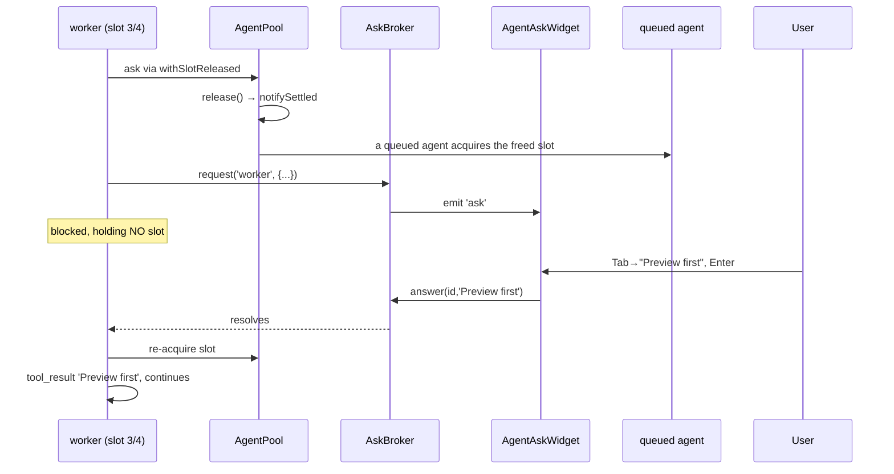
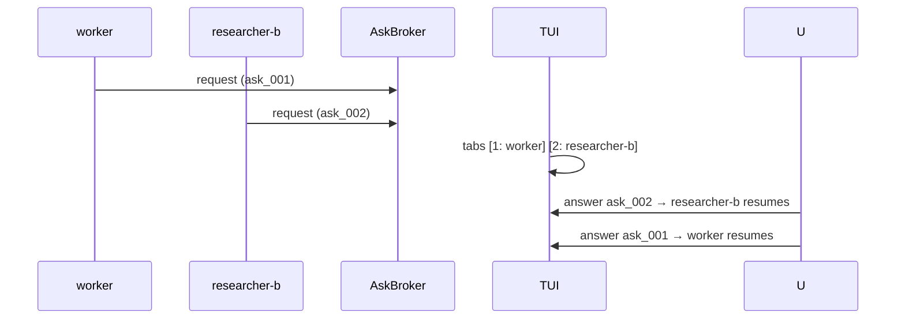

# PLAN-07 — AgentAsk

<!-- version: 1.0.0 -->
<!-- feature: src/core/team/ask-broker.ts, src/core/tools/ask.ts, src/tui/widgets/AgentAskWidget.ts -->
<!-- depends-on: PLAN-00, PLAN-01, PLAN-04 -->
<!-- consumed-by: PLAN-08, PLAN-10 -->

## 1. Overview

A running agent can pause and ask the user a question; the agent resumes when answered while
**other agents keep running**. Novel to agentfactory-harness. **Critical fix (§M / F3):** the
pause must **release the agent's pool slot**, otherwise N concurrent asks deadlock the
Semaphore.

## 2. AskBroker

```typescript
// src/core/team/ask-broker.ts
export interface AskRequest { question: string; options?: string[]; context?: string }
export interface PendingAsk {
  id: string; agentName: string; question: string; options: string[]
  context: string | undefined; askedAt: Date; resolve: (answer: string) => void
}
export type AskEvent = PendingAsk | { askId: string; answer: string; agentName: string }

export class AskBroker {
  private pending = new Map<string, PendingAsk>()
  private handlers = new Map<string, Set<(e: AskEvent) => void>>()

  request(agentName: string, q: AskRequest): Promise<string> {
    return new Promise(resolve => {
      const ask: PendingAsk = { id: crypto.randomUUID(), agentName, question: q.question,
        options: q.options ?? [], context: q.context, askedAt: new Date(), resolve }
      this.pending.set(ask.id, ask)
      this.emit('ask', ask)
    })
  }
  answer(askId: string, answer: string): void {
    const ask = this.pending.get(askId)
    if (!ask) throw new Error(`Unknown askId: ${askId}`)
    this.pending.delete(askId)
    this.emit('ask:resolved', { askId, answer, agentName: ask.agentName })
    ask.resolve(answer)
  }
  getPending(): PendingAsk[] { return [...this.pending.values()] }
  on(event: 'ask' | 'ask:resolved', cb: (e: AskEvent) => void): () => void { /* ... */ }
  private emit(event: string, data: AskEvent): void { this.handlers.get(event)?.forEach(cb => cb(data)) }
}
```

## 3. AskTool — slot-releasing (§M fix)

```typescript
// src/core/tools/ask.ts
export const AskTool = buildTool({
  name: 'ask',
  description: 'Ask the user a question and wait for an answer. Use ONLY when genuinely blocked.',
  isReadOnly: true,
  inputSchema: { type: 'object', properties: {
    question: { type: 'string' },
    options:  { type: 'array', items: { type: 'string' } },
    context:  { type: 'string' },
  }, required: ['question'] },
  async call({ question, options, context }, ctx) {
    if (!ctx.broker) throw new Error('ask unavailable outside team sessions')
    // release pool slot while blocked (fixes F3), re-acquire before resuming
    return ctx.pool.withSlotReleased(ctx.agentName, () =>
      ctx.broker.request(ctx.agentName, { question, options, context }))
  },
})
```

`AgentPool.withSlotReleased` (defined in PLAN-08 §2): `release()` → `notifySettled` (wake the
scheduler to use the freed slot) → await fn → `acquire()` before returning.

## 4. AgentAskWidget (TUI)

```typescript
// src/tui/widgets/AgentAskWidget.ts
export class AgentAskWidget {
  private asks: PendingAsk[] = []
  private selectedAskIdx = 0
  private selectedOptionIdx = 0
  private customInput = ''
  private inputMode: 'options' | 'custom' = 'options'
  constructor(private broker: AskBroker, private rect: Rect) {
    broker.on('ask', a => this.addAsk(a as PendingAsk))
    broker.on('ask:resolved', e => this.removeAsk((e as { askId: string }).askId))
  }
  render(buf: CellBuffer): void {}      // bar (≤1) or overlay (≥2 / long)
  onKey(e: KeyEvent): void {}           // Tab=cycle, Enter=confirm, Esc=custom
  addAsk(a: PendingAsk): void {}
}
```

## 5. Mermaid — full lifecycle (with slot release)



## 6. Mermaid — concurrent asks



## 7. TUI rendering

```
Bar (1 ask):  [!] worker: "Apply risky fix?" [ Yes ] [ No ] [ … ]
Overlay (≥2): boxed question + context + options + "Pending: worker(1), researcher-b(2)"
Custom (Esc): "> free text_   (Enter send · Esc cancel)"
```

## 8. Edge Cases

| Case | Handling |
|---|---|
| user never answers | agent stays parked (no slot held); liveness guard emits `team:awaiting-user` (PLAN-08 §Q) |
| answer unknown id | throws clear error |
| broker has no free slot to re-acquire on resume | waits in Semaphore queue (no deadlock — slot was released) |
| ask outside team session | tool throws ("unavailable outside team sessions") |

## 9. Test Cases

```
ask-broker.test.ts: request/answer resolves; unknown id throws; getPending; on('ask'); on('ask:resolved');
  multiple concurrent resolved independently
ask-tool.test.ts: call invokes withSlotReleased+request; releases then re-acquires; no broker throws
agent-ask-widget.test.ts: render question+options; Tab cycles; Enter answers; Esc custom; 2 asks → tabs; empty → nothing
slot-release.test.ts: 4 agents all asking → a 5th queued agent still gets dispatched (no deadlock)
```

## 9.5 Codebase Reality & Contracts

| Assumed | Reality | Resolution |
|---|---|---|
| `buildTool({... call ...})` | `run(input,ctx?)` (PLAN-CORE) | author AskTool via `buildTool`; `run` reads `ctx.broker`, `ctx.pool`, `ctx.agentName` |
| `ctx.pool.withSlotReleased` | defined in PLAN-08 §2 | import via ctx |
| widget focus/keys | `InputRouter` dispatches to focused panel (`input/router.ts`) | AgentAskWidget registers as a focus target; reuse `KeyEvent` |
| `AskRequest`, `AskEvent` | n/a | defined §2 here |

```
IMPORTS: buildTool, ToolUseContext ← PLAN-CORE · AgentPool ← PLAN-08 · CellBuffer, Rect, KeyEvent ← tui
EXPORTS: AskBroker, PendingAsk, AskRequest, AskEvent, AskTool, AgentAskWidget
  → PLAN-00 (createContext), PLAN-08 (tool list + awaiting-user), PLAN-10 (overlay)
```

## 9.6 Integration test (crosses PLAN-08)

`ask-no-deadlock.test.ts`: pool max=2; two agents both call `ask`; assert a third ready agent
acquires a slot while the two are parked; answering resumes them in order.

## 10. Verification Checklist / Definition of Done

- [ ] With maxConcurrency=4 and 4 agents asking, a 5th ready agent still runs (F3 gone)
- [ ] Other agents visibly progress while one is parked on an ask
- [ ] Custom answer text reaches the agent verbatim
- [ ] `team:awaiting-user` shown when everything is parked on asks
- [ ] AskTool.run resolves through `withSlotReleased` (slot released then re-acquired)
