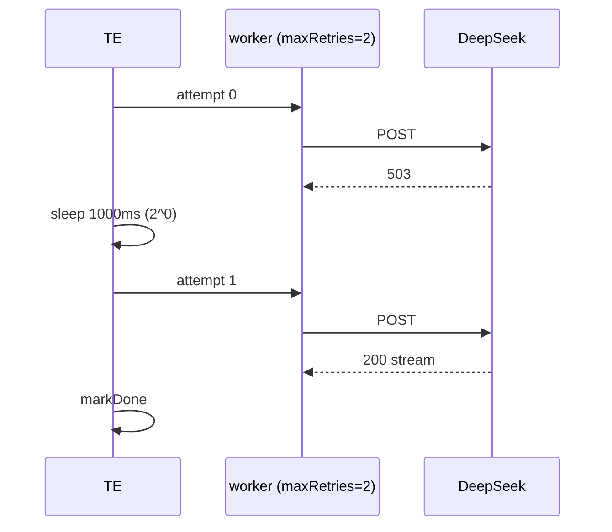

# PLAN-08 — TeamExecutor Engine

<!-- version: 1.0.0 -->
<!-- feature: src/orchestration/team-executor.ts, team-runner.ts, scheduler.ts, src/core/team/agent-pool.ts -->
<!-- depends-on: PLAN-00, PLAN-01, PLAN-02, PLAN-03, PLAN-04, PLAN-05 -->
<!-- consumed-by: PLAN-09, PLAN-10, PLAN-11 -->

## 1. Overview

The orchestration heart. Drives the **settlement-driven loop** (PART II §K — fixes the
busy-loop F1, broken early-firing F2, and ordering race F11), wires the AgentPool with
slot-releasing asks (§M/F3), runs agents with per-agent AbortSignal (§N/F5), retries with
backoff, and cascades skips through the tri-state gate.

## 2. AgentPool + Semaphore (with withSlotReleased — fixes F3)

```typescript
// src/core/team/agent-pool.ts
class Semaphore {
  private count: number; private queue: (() => void)[] = []
  constructor(max: number) { this.count = max }
  async acquire(): Promise<void> {
    if (this.count > 0) { this.count--; return }
    return new Promise(res => this.queue.push(res))
  }
  release(): void { const n = this.queue.shift(); if (n) n(); else this.count++ }
}

export class AgentPool {
  private semaphore: Semaphore
  private running = new Map<string, Promise<string>>()
  constructor(maxConcurrency: number, private ctx: OrchestrationContext) {
    this.semaphore = new Semaphore(maxConcurrency)
  }
  async run(agentName: string, fn: () => Promise<string>): Promise<string> {
    await this.semaphore.acquire()
    try { const p = fn(); this.running.set(agentName, p); return await p }
    finally { this.running.delete(agentName); this.semaphore.release() }
  }
  async withSlotReleased<T>(agentName: string, fn: () => Promise<T>): Promise<T> {
    this.semaphore.release()
    this.ctx.notifySettled(`${agentName}:ask-wait`)   // wake scheduler to use freed slot
    try { return await fn() } finally { await this.semaphore.acquire() }
  }
  activeCount(): number { return this.running.size }
}
```

## 3. Scheduler (dependency-first)

```typescript
// src/orchestration/scheduler.ts
export type SchedulerStrategy = 'dependency-first' | 'round-robin' | 'least-busy'
export class Scheduler {
  constructor(private strategy: SchedulerStrategy = 'dependency-first') {}
  prioritize(ready: AgentDef[], all: AgentDef[], statuses: Map<string, StepStatus>): AgentDef[] {
    if (this.strategy === 'round-robin') return ready
    if (this.strategy === 'least-busy')  return [...ready] // (stable; pool enforces concurrency)
    return [...ready].sort((a, b) => this.criticality(b, all) - this.criticality(a, all))
  }
  private criticality(node: AgentDef, all: AgentDef[]): number {
    // BFS over dependents: how many nodes are (transitively) blocked on this one
    let count = 0; const seen = new Set<string>(); const q = [node.name]
    while (q.length) { const n = q.shift()!; for (const d of all) {
      if (d.dependsOn.includes(n) && !seen.has(d.name)) { seen.add(d.name); count++; q.push(d.name) } } }
    return count
  }
}
```

## 4. TeamExecutor — settlement loop (REVISED, fixes F1/F2/F11)

```typescript
// src/orchestration/team-executor.ts
export class TeamExecutor {
  private settled: string[] = []
  private pendingHandoffs = new Map<string, HandoffPackage>()
  constructor(private ctx: OrchestrationContext, private pool: AgentPool, private sched: Scheduler) {}

  async *run(): AsyncGenerator<TeamStepEvent> {
    for (const n of this.ctx.graph.nodes) this.ctx.statuses.set(n.name, 'pending')
    this.dispatchReady()                                   // prime: zero-dep nodes
    while (!this.ctx.allTerminal()) {
      await this.ctx.waitForNextSettlement()               // zero-CPU block (F1)
      yield* this.ctx.drainEvents()
      while (this.settled.length) {
        const name = this.settled.shift()!
        this.evaluateDependents(name)
        yield* this.ctx.drainEvents()
      }
    }
    yield { type: 'plan:done', verdict: this.ctx.verdict() }
  }

  private dispatchReady(): void {
    for (const node of this.ctx.graph.nodes) {
      if (this.ctx.statuses.get(node.name) !== 'pending') continue
      if (node.dependsOn.length === 0 && evaluateGate(node, this.ctx.statuses) === 'FIRE') {
        this.fire(node)
      }
    }
  }

  private evaluateDependents(settled: string): void {
    for (const dep of this.ctx.graph.dependentsOf(settled)) {
      if (this.ctx.statuses.get(dep.name) !== 'pending') continue
      const gate = evaluateGate(dep, this.ctx.statuses)    // FIRE | SKIP | WAIT (PLAN-00 §3)
      if (gate === 'WAIT') continue
      if (gate === 'SKIP') { this.ctx.markSkipped(dep.name); this.settled.push(dep.name); continue }
      this.fire(dep)
    }
  }

  private fire(node: AgentDef): void {
    if (node.kind === 'port') {
      const res = evaluateLogicPort(node, this.ctx.statuses, this.ctx.outputs)
      this.ctx.firePort(node.name, res)
      if (node.logicPort === 'XOR') this.ctx.cancelXorLosers(node)
      this.settled.push(node.name)
      return
    }
    this.ctx.markRunning(node.name)
    void this.pool.run(node.name, () => this.runAgent(node))
      .then(out => { this.ctx.markDone(node.name, out) })
      .catch(err => { this.ctx.markError(node.name, err) })  // cascade happens via gate on dependents
      .finally(() => this.settled.push(node.name))
  }

  private buildInitialMessages(node: AgentNode): MessageParam[] {
    const pkg = this.pendingHandoffs.get(node.name)
    if (pkg) return getAdapter(node.provider).serializeHandoff(pkg)
    // else thread dep outputs as plain context
    return node.dependsOn
      .map(d => this.ctx.outputs.get(d)).filter(Boolean)
      .map(o => ({ role: 'user' as const, content: o! }))
  }

  private async runAgent(node: AgentNode): Promise<string> {
    let attempt = 0
    for (;;) {
      try {
        const adapter = getAdapter(node.provider)
        const systemPrompt = await buildSystemPrompt(node)
        const session = new Session()
        const signal = this.ctx.abort.signal(node.name)            // §N cancellation
        const output = await runAgentLoop(session, {
          adapter, systemPrompt, initialMessages: this.buildInitialMessages(node),
          tools: this.buildTools(node), maxTurns: node.maxTurns, signal, ctx: this.ctx,
        })
        if (node.handoffTo) {
          const pkg = await buildHandoffPackage(node, session, this.ctx, node.handoffTo)
          this.pendingHandoffs.set(node.handoffTo.to, pkg)
        }
        return output
      } catch (err) {
        if (signalAborted(this.ctx.abort.signal(node.name))) throw err   // don't retry a cancel
        if (attempt >= node.maxRetries) throw err
        await sleep(Math.min(1000 * 2 ** attempt, 30_000)); attempt++
      }
    }
  }
}
```

## 5. TeamRunner (wires kernel + pool + liveness — §Q)

```typescript
// src/orchestration/team-runner.ts
export async function runTeam(teamDef: TeamDef, opts?: TeamRunnerOptions): Promise<TeamRunResult> {
  const graph = normalizeTeam(teamDef)                      // PLAN-01 §L
  const ctx = createContext(graph, teamDef)                 // PLAN-00
  const pool = new AgentPool(teamDef.maxConcurrency, ctx)
  const exec = new TeamExecutor(ctx, pool, new Scheduler('dependency-first'))

  opts?.onAsk && ctx.broker.on('ask', opts.onAsk)
  const timer = startTeamTimeout(teamDef.timeout ?? 1800, ctx)  // §Q wall clock
  const livenessGuard = watchAllParked(ctx, pool)               // §Q awaiting-user

  const results = new Map<string, string>()
  for await (const ev of exec.run()) {
    if (ev.type === 'step:done') results.set(ev.stepId, ev.output ?? '')
    opts?.onProgress?.(ev)
  }
  clearTimeout(timer); livenessGuard.stop()
  await ctx.memory.persist()
  if (teamDef.promoteMemory) await promoteDurableMemory(ctx.memory)   // PLAN-12 Layer1→2
  return { success: ctx.verdict() !== 'FAILED', results, memory: ctx.memory.getStats() }
}
```

## 6. Liveness guards (§Q — fixes F12)

- **Team timeout:** on expiry, `ctx.abort.cancelAll('team timeout')`, yield `plan:done{FAILED}`.
- **All-parked detection:** if `pool.activeCount()===0 && broker.getPending().length>0`, emit
  `team:awaiting-user` so the TUI shows a banner instead of appearing hung.

## 7. Mermaid — full linear run (Scenario 1)

```mermaid
sequenceDiagram
    participant TE
    participant POOL as AgentPool
    participant P as planner
    participant W as worker (DeepSeek)
    participant R as reviewer
    TE->>TE: prime gate(planner)=FIRE
    TE->>POOL: run planner (signal)
    P-->>TE: markDone → settled
    TE->>TE: evaluateDependents(planner): gate(worker)=FIRE; build handoff
    TE->>POOL: run worker (serializeHandoff via DeepSeek)
    W-->>TE: markDone → settled
    TE->>TE: gate(reviewer)=FIRE; handoff outputs.patch
    TE->>POOL: run reviewer
    R-->>TE: markDone
    TE->>TE: allTerminal → plan:done APPROVE
```

## 8. Mermaid — retry with backoff



## 9. Edge Cases

| Case | Handling |
|---|---|
| agent error | markError; dependents evaluate gate → SKIP (cascade) |
| XOR fires while sibling running | cancelXorLosers aborts + skips it |
| aborted agent throws | not retried (signalAborted check) |
| all parked on asks | `team:awaiting-user` emitted |
| team timeout | cancelAll + FAILED verdict |

## 10. Test Cases

```
agent-pool.test.ts: single run; maxConcurrency limits; release on error; withSlotReleased frees+reacquires
scheduler.test.ts: dependency-first criticality order; round-robin stable
team-executor.test.ts: single; linear chain order; parallel fan-out+AND; partial-fail cascade skip;
  NAND fires→escalation; XOR race→loser skipped+aborted; retry then success; planner-fail cascades;
  handoffTo builds package injected into receiver; no busy loop (wake count == settlements)
team-runner.test.ts: team timeout → FAILED; all-parked → awaiting-user; promoteMemory on
```

## 10.5 Codebase Reality

| Assumed | Reality | Resolution |
|---|---|---|
| `runAgentLoop(...)→string` | only `agentLoop` generator (G4) | use `runAgentLoop` from PLAN-CORE; returns `{output, tokens}` → `ctx.recordTokens` |
| `buildTools(node)` | n/a | assemble per-agent `Tool[]` = node `tools[]` (from registry) + team tools (message/memory/ask/remember), passed to `runAgentLoop({tools})` |
| `signalAborted(signal)` | n/a | `const signalAborted = (s: AbortSignal) => s.aborted` |
| `createContext` | PLAN-00 §4.6 | import |
| `additionalContext` build | re-homed (G5) | build from MemoryManager.inject + SharedMemory.getSummary (PLAN-CORE §3.8) |
| inbox delivery | `onBeforeTurn` (G10) | pass `onBeforeTurn: s => injectInbox(node.name, ctx)` to `runAgentLoop` |

```typescript
private buildTools(node: AgentNode): Tool[] {
  const named = node.tools.length ? node.tools.map(getTool).filter(Boolean) as Tool[] : defaultAgentTools()
  return [...named, MessageTool, MemoryTool, AskTool, RememberTool]   // team tools always available
}
private buildCtx(node: AgentNode): ToolUseContext {
  return { agentName: node.name, signal: this.ctx.abort.signal(node.name),
           bus: this.ctx.bus, memory: this.ctx.memory, broker: this.ctx.broker,
           pool: this.pool, memoryManager: this.memoryManager }
}
```
`runAgent` (§4) calls `runAgentLoop(session, { adapter, systemPrompt, additionalContext,
initialMessages: this.buildInitialMessages(node), tools: this.buildTools(node),
ctx: this.buildCtx(node), maxTurns: node.maxTurns, signal, onBeforeTurn })` and then
`this.ctx.recordTokens(node.name, result.tokens)`.

## 10.6 Contracts

```
IMPORTS:
  OrchestrationContext, createContext, evaluateGate, evaluateLogicPort, AbortRegistry, TeamStepEvent ← PLAN-00
  normalizeTeam, NormalizedGraph, AgentDef, AgentNode, TeamDef, buildSystemPrompt ← PLAN-01
  buildHandoffPackage, HandoffPackage ← PLAN-02 · getAdapter, OpenAICompatAdapter ← PLAN-03/CORE
  MessageTool, injectInbox ← PLAN-04 · SharedMemory, MemoryTool ← PLAN-05
  AskBroker, AskTool ← PLAN-07 · MemoryManager, promoteDurableMemory, RememberTool ← PLAN-12
  runAgentLoop, TokenUsage, ToolUseContext ← PLAN-CORE · Session ← core · getTool ← tools/index
EXPORTS:
  AgentPool, Semaphore, Scheduler, SchedulerStrategy, TeamExecutor, runTeam, TeamRunResult
    → PLAN-09 (CLI), PLAN-10 (App), PLAN-11 (coordinator runs through runTeam)
```

## 10.7 Integration test (end-to-end, mocked LLM)

`team-e2e.test.ts`: 3-agent linear team with a stub adapter; assert event order
(step:start×3, handoff:start×2, step:done×3, plan:done), tokens recorded per node, and the
worker's session contained the planner handoff message.

## 11. Verification Checklist / Definition of Done

- [ ] 3-node chain wakes exactly 3 times (no busy spin)
- [ ] worker receives planner's HandoffPackage as initial context
- [ ] XOR loser is aborted; OR fires before all deps finish
- [ ] cascade: erroring planner skips worker + reviewer
- [ ] team timeout and all-parked both surface cleanly
- [ ] tokens recorded via `recordTokens` (G7); team tools available to every agent
