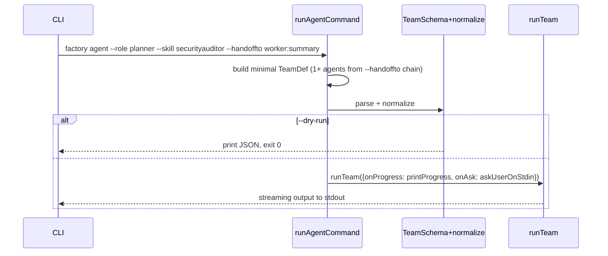
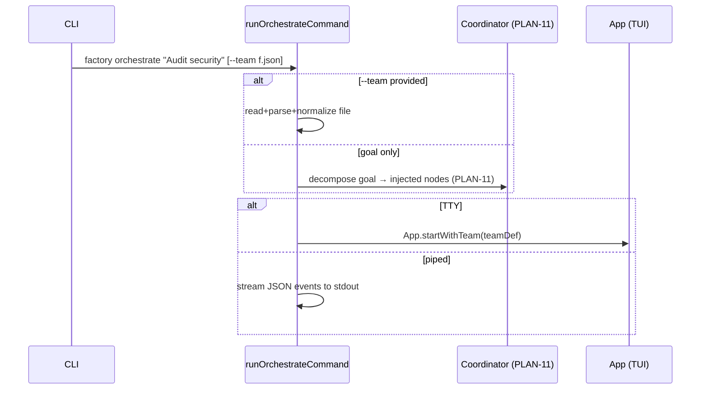

# PLAN-09 — CLI Design

<!-- version: 1.0.0 -->
<!-- feature: src/cli.ts, src/index.ts -->
<!-- depends-on: PLAN-08, PLAN-11 -->

## 1. Overview

Two new subcommands: `factory agent` (one-shot / handoff chain) and `factory orchestrate`
(team; explicit `--team` file or `"goal"` auto-decompose via the coordinator, PLAN-11).
Plus `factory memory` (PLAN-12).

## 2. Command definitions

```typescript
// src/cli.ts
program.command('agent')
  .description('Run a single agent one-shot or start a handoff chain')
  .option('--name <name>', 'Agent name (default: role)')
  .option('--role <role>', 'coordinator|planner|worker|reviewer|critic|aggregator|generic')
  .option('--skill <skill>', 'Load a skill (repeatable)', (v, a: string[]) => [...a, v], [])
  .option('--provider <name>', 'LLM provider', 'anthropic')
  .option('--model <model>', 'Model name')
  .option('--prompt <text>', 'Initial prompt (or stdin)')
  .option('--handoffto <spec>', 'agentName[:mode] — relay on completion')
  .option('--max-turns <n>', 'Max turns', parseInt)
  .option('--dry-run', 'Print resolved config, do not run')
  .action(runAgentCommand)

program.command('orchestrate [goal]')
  .description('Run a multi-agent team (goal auto-decompose or --team file)')
  .option('--team <file>', 'Path to af-team.json')
  .option('--agents <names>', 'Ad-hoc list "planner,worker,reviewer"')
  .option('--max-concurrency <n>', 'Parallel limit', parseInt)
  .option('--dry-run', 'Validate + print resolved team')
  .action(runOrchestrateCommand)
```

## 3. runAgentCommand flow



## 4. runOrchestrateCommand flow



## 5. --handoffto chain expansion

```bash
factory agent --role planner --skill securityauditor --prompt "Audit auth.ts" --handoffto worker:summary
# → TeamDef { agents:[
#     {name:planner, role:planner, skills:[securityauditor], handoffTo:{to:worker,payload:summary}, prompt:"…"},
#     {name:worker,  role:worker,  dependsOn:[planner]}  // loaded from .ai/agents/ or default
#   ]}
```
Multiple `--handoffto` build a longer chain; normalization (PLAN-01) adds the edges.

## 6. Mode detection

`isatty(stdout)` → TUI (`App.startWithTeam`). Piped/redirected → newline-delimited JSON
events (machine-readable), one `TeamStepEvent` per line.

## 7. Edge Cases

| Case | Handling |
|---|---|
| `--provider unknown` with no URL/key | error + exit 1 with guidance |
| `orchestrate` with neither goal nor --team | error: provide a goal or --team |
| invalid team JSON | ZodError printed with field path, exit 1 |
| stdin prompt + no TTY | read prompt from stdin to EOF |

## 8. Test Cases

```
cli.test.ts:
  - agent --role planner --dry-run prints config, exit 0
  - agent --provider unknown → error exit 1
  - orchestrate --team valid --dry-run prints normalized team
  - orchestrate --team invalid → ZodError exit 1
  - orchestrate "goal" (no team) → coordinator path invoked
  - --skill repeatable → array
  - --handoffto worker:summary / worker:outputs.diff parsed
  - piped stdout → JSON event lines
```

## 8.5 Codebase Reality & Contracts

| Assumed | Reality (file:line) | Resolution |
|---|---|---|
| top-level `program` | `buildCli(version): Command` (`cli.ts:14`) | add `.command('agent')` / `.command('orchestrate')` / `.command('memory')` **inside** `buildCli` |
| `App.startWithTeam` | `App` has `start()` (`app.ts:87`) | added by PLAN-10 |
| coordinator | PLAN-11 `decomposeGoal` | import |

```
IMPORTS: buildCli (extend) ← cli.ts · runTeam ← PLAN-08 · decomposeGoal ← PLAN-11
  TeamSchema, normalizeTeam ← PLAN-01 · App ← app.ts (startWithTeam from PLAN-10)
EXPORTS: runAgentCommand, runOrchestrateCommand  (registered in buildCli)
```

## 9. Verification Checklist / Definition of Done

- [ ] `factory agent --role planner --skill securityauditor --handoffto worker` runs planner then worker
- [ ] `factory orchestrate --team af-team.json` opens the TUI (TTY) via `App.startWithTeam`
- [ ] `factory orchestrate "goal"` decomposes (PLAN-11) and runs without a team file
- [ ] Piped invocation emits parseable JSON events (one TeamStepEvent/line)
- [ ] subcommands registered inside `buildCli`, `--dry-run` paths exit cleanly
