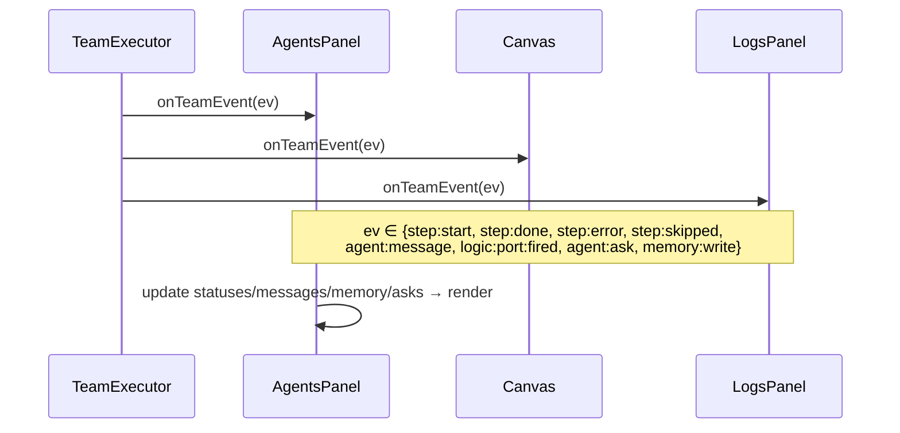

# PLAN-10 — TUI Multi-Agent

<!-- version: 1.0.0 -->
<!-- feature: src/tui/panels/AgentsPanel.ts, OrchestrationCanvas.ts, src/tui/widgets/AgentAskWidget.ts, src/app.ts -->
<!-- depends-on: PLAN-06, PLAN-07, PLAN-08 -->

## 1. Overview

Three TUI surfaces wired to `TeamStepEvent`s: AgentsPanel redesign (status + messages +
memory + asks), OrchestrationCanvas logic-port diamonds with live status, and the
AgentAskWidget overlay. All driven from the kernel event stream (`drainEvents`).

## 1.5 Codebase Reality — honest audit (what exists today is mostly NOT this)

I read `AgentsPanel.ts` (191 lines) in full. Today it is a **single-column session list**,
not a team dashboard. Almost everything PLAN-10 describes is **greenfield**, not "extend."

| PLAN-10 element | State today (file:line) | Verdict |
|---|---|---|
| Single-col session list + select/scroll | works (`AgentsPanel.ts:67-78,143-171`) | ✅ operational (but it's *sessions*, not team agents) |
| Per-agent stats (tokens, elapsed, tools) on a **toggle** | works for the selected row only (`:80-112`) | ⚠️ exists but detail-panel, not inline-per-row |
| Status set | only `idle\|running\|done\|error` (`:11`) — **no `pending`, no `skipped`** | ⚠️ insufficient for teams |
| **Two-column layout** (list ∣ messages ∣ memory) | **none** — single column + toggled detail | ❌ missing |
| **Messages feed** (MessageBus traffic) | **none** | ❌ missing |
| **Memory sub-panel** (SharedMemory) | **none** | ❌ missing |
| **AgentAsk bar** | **none** | ❌ missing |
| **Logic-port rows** (`◇ name [AND] [2/3]`) | `AgentEntry` has no port kind | ❌ missing |
| **`onTeamEvent(TeamStepEvent)`** | model is `setAgents`/`updateAgent(AgentEntry)` — **old shape, no team events** | ❌ missing |
| `App.startWithTeam` | App has only `start()` (confirmed `app.ts:87`) | ❌ missing (greenfield) |
| Nobel-laureate hover tooltip | present (`:114-141`, couples `nobel.ts`) | 🟡 easter-egg; irrelevant to team mode — gate it off when a team is active |
| Runtime canvas status | `OrchestrationCanvas.applyStepEvent` uses **old `StepEvent`** and collapses `skipped→idle` (`OrchestrationCanvas.ts:90-107`) | ⚠️ must become `onTeamEvent`, keep `skipped` |

**Conclusion:** the only solid reuse is the list-render + click/scroll selection. The team
dashboard (columns, feeds, asks, ports, team events) is **new construction**, and the data
model must change.

## 1.6 Operationalization plan

| Gap | Fix | Where |
|---|---|---|
| `AgentEntry` too thin | introduce a **team-mode model** `TeamAgentRow` (adds `kind:'agent'\|'port'`, `pending`/`skipped`, `gateType`, `depsReady`, inline `input/outputTok`) OR extend `AgentEntry`; keep the old shape for session mode | `AgentsPanel.ts` |
| single-column | add a `mode: 'sessions' \| 'team'`; team mode renders **two columns** (list ∣ feed) + a memory strip + an ask bar | `AgentsPanel.render` |
| no events | add `onTeamEvent(ev: TeamStepEvent)` that switches over the union (PLAN-00 events.ts) to mutate rows/feed/memory/asks | new method |
| missing statuses | extend status union with `pending`,`skipped`; add badges `◎`,`⊘` + colors | `statusBadge/statusColor` |
| no feed/memory/ask | subscribe to `MessageBus`, `SharedMemory`, `AskBroker` (passed in ctor) → render sub-panels | ctor + render |
| port rows | render `kind:'port'` rows as `◇ name [GATE] [k/n]` (reuse PLAN-06 colors) | render |
| canvas status event | replace `applyStepEvent(StepEvent)` with `onTeamEvent(TeamStepEvent)`; preserve `skipped` (don't map to idle) | `OrchestrationCanvas.ts:90` |
| laureate tooltip leaks into team mode | only render tooltip when `mode==='sessions'` | render |
| `App.startWithTeam` | new method drives `executor.run()` loop → fan events to panels → `renderFrame` | `app.ts` |

> Same inversion lesson as PLAN-13: today the panel's `AgentEntry[]` *is* the data and can't
> represent ports/messages/memory/asks. Team mode needs a model that can — fed exclusively by
> `TeamStepEvent` + the three kernel primitives.

## 2. AgentsPanel layout (≥80 cols, two-column)

```
╔════════════════════════════════════════════════════════════╗
║  Agents — <team>  [N running / M total]   HH:MM:SS        ║
╠═══════════════════════╦════════════════════════════════════╣
║  Agent List           ║  Messages Feed                     ║
║  ● name  [status]     ║  HH:MM src → dst: "content…"       ║
║    X.Xk/X.Xk tok      ║  HH:MM * src → *: "broadcast…"     ║
║  ◇ portname [AND]     ║  Memory                            ║
║    [2/3 done]         ║  agent/key: "value…"               ║
╠═══════════════════════╩════════════════════════════════════╣
║  [!] AgentAsk bar (if pending)                            ║
╚════════════════════════════════════════════════════════════╝
```

## 3. Status indicators

```
●[running]↻ cyan+spinner · ✓[done] green · ✗[error] red ·
◎[pending] dim · ⊘[skipped] dim strike · ◇port[AND] colored diamond + [2/3]
```

## 4. Event wiring



## 5. Canvas port rendering & colors

(Reuses PLAN-06 §4 `renderPortBlock`.) AgentBlock pending=grey, running=cyan, done=green,
error=red, skipped=grey⊘. PortBlock per-type fired color. Wires colored by target status.

## 6. AgentAskWidget modes

```
Bar:     [!] worker: "Apply risky fix?" [ Yes ] [ No ] [ … ]
Overlay: boxed [1/2] question + context + options + Pending list
Custom:  > free text_  (Enter send · Esc cancel)
```
Keyboard: Tab cycles options, Enter confirms (`broker.answer`), Esc → custom input.

## 7. App.startWithTeam wiring

```typescript
// src/app.ts
async function startWithTeam(teamDef: TeamDef): Promise<void> {
  const graph = normalizeTeam(teamDef)
  const ctx = createContext(graph, teamDef)
  const agentsPanel = new AgentsPanel(ctx.bus, ctx.memory, ctx.broker, layout.agents)
  const canvas = new OrchestrationCanvas(layout.canvas); canvas.syncFromTeam(teamDef)
  const askWidget = new AgentAskWidget(ctx.broker, layout.askBar)

  const exec = new TeamExecutor(ctx, new AgentPool(teamDef.maxConcurrency, ctx), new Scheduler())
  for await (const ev of exec.run()) {
    agentsPanel.onTeamEvent(ev); canvas.onTeamEvent(ev); logsPanel.onTeamEvent(ev)
    renderFrame()
  }
}
```

## 8. Backward compatibility

AgentsPanel with no active team renders the existing Wave-5 session list (`render()` checks
`ctx == null`). No regression to single-session mode.

## 9. Edge Cases

| Case | Handling |
|---|---|
| <80 cols | single-column stacked layout; messages collapsible |
| many agents | agent list scrolls (reuse ScrollableList) |
| `team:awaiting-user` | banner: "All agents waiting on your answer" |
| long question | overlay mode auto-selected |

## 10. Test Cases

```
agents-panel.test.ts: empty→session list; team→agent badges; step:start spinner;
  step:done green+tokens; agent:message in feed; logic:port:fired diamond; addAsk bar; Tab/Enter resolves
orchestration-canvas.test.ts: syncFromTeam blocks+diamonds+wires; step:done green;
  port:fired type color; renderPortDiamond shape/label; renderAgentBlock dims
agent-ask-widget.test.ts: render question+options; no asks→nothing; Tab/Enter/Esc
```

## 10.5 Codebase Reality & Contracts

| Assumed | Reality (file:line) | Resolution |
|---|---|---|
| `App.startWithTeam` | `App` has `start()`, `panels: Panel[]`, `router: InputRouter` (`app.ts:43,70,71`) | add `startWithTeam(teamDef)` method; register AgentAskWidget as a focusable target on `router` |
| `AgentsPanel` redesign | existing class (`AgentsPanel.ts`) shows session list | extend with `onTeamEvent` + two-column team mode; `render` branches on team-active |
| `onTeamEvent` | n/a | adapter that switches over `TeamStepEvent` (PLAN-00 events.ts) to update internal state |
| canvas `syncFromTeam` | `OrchestrationCanvas.syncFromPlan` exists | add `syncFromTeam(teamDef)` building agent blocks + `PortBlock`s (PLAN-06) |
| `ScrollableList` | exists (Wave 5, `widgets/ScrollableList.ts`) | reuse for agent list + message feed |

```
IMPORTS: TeamStepEvent, createContext ← PLAN-00 · TeamExecutor, AgentPool, Scheduler ← PLAN-08
  renderPortBlock, PortBlock ← PLAN-06 · AgentAskWidget ← PLAN-07 · MessageBus,SharedMemory,AskBroker ← PLAN-04/05/07
  Panel, InputRouter, CellBuffer, ScrollableList ← existing tui
EXPORTS: AgentsPanel (extended), OrchestrationCanvas (extended), App.startWithTeam → PLAN-09
```

## 11. Verification Checklist / Definition of Done

**Operationalization (every ❌/⚠️ row from §1.5 must now work):**
- [ ] `AgentsPanel` has a `mode: 'sessions' | 'team'`; team mode renders **two columns + memory strip + ask bar** (not the single-column list)
- [ ] Status union extended with `pending` (`◎`) and `skipped` (`⊘`); badges + colors added
- [ ] `onTeamEvent(TeamStepEvent)` mutates rows/feed/memory/asks — the old `setAgents`/`updateAgent` path stays for session mode
- [ ] **Messages feed** renders live `MessageBus` traffic
- [ ] **Memory strip** renders `SharedMemory` entries
- [ ] **Logic-port rows** render `◇ name [GATE] [k/n]`
- [ ] Nobel-laureate tooltip suppressed in team mode (`mode==='sessions'` only)
- [ ] `OrchestrationCanvas.applyStepEvent` replaced by `onTeamEvent(TeamStepEvent)`; `skipped` preserved (not collapsed to idle)

**End-to-end:**
- [ ] Live status badges update as agents run (driven by TeamStepEvent)
- [ ] AgentAsk overlay answerable by mouse/keyboard while others run (router focus)
- [ ] Single-session mode unchanged (no regression — sessions remain the default)
- [ ] `App.startWithTeam` drives the executor event loop + render (greenfield method)
