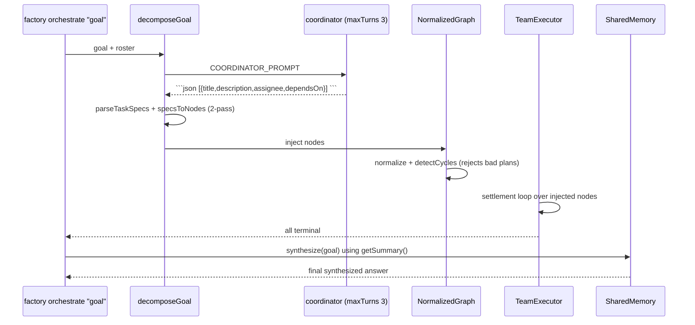

# PLAN-11 — Coordinator / Goal Decomposition

<!-- version: 1.0.0 -->
<!-- feature: src/orchestration/coordinator.ts -->
<!-- depends-on: PLAN-00, PLAN-01, PLAN-08 -->
<!-- consumed-by: PLAN-09 -->

## 1. Overview

Implements the `factory orchestrate "goal"` path (Mode B) that was referenced everywhere but
never specified (PART II §F7). A coordinator agent decomposes a natural-language goal into a
task array, injects those tasks as nodes into the `NormalizedGraph` *before* the executor
primes, runs them, then re-invokes the coordinator to synthesize a final result. Ports
`open-multi-agent/orchestrator.ts:641-740` (`runTeam`) and `:944-1001` (`loadSpecsIntoQueue`).

## 2. Interfaces

```typescript
// src/orchestration/coordinator.ts
export interface TaskSpec {
  title: string                       // human label, also the node name (slugified)
  description: string                 // becomes the agent prompt
  assignee?: string                   // role or existing agent name
  dependsOn?: string[]                // task titles (resolved to node names in pass 2)
}

export async function decomposeGoal(
  goal: string, roster: AgentDef[], ctx: OrchestrationContext,
): Promise<AgentDef[]>                // returns nodes to inject

export async function synthesize(
  goal: string, ctx: OrchestrationContext,
): Promise<string>                    // final answer from SharedMemory.getSummary()
```

## 3. Decomposition

```typescript
export async function decomposeGoal(goal, roster, ctx): Promise<AgentDef[]> {
  const coord = makeCoordinatorAgent(roster)                 // maxTurns: 3
  const session = new Session()
  const out = await runAgentLoop(session, {
    adapter: getAdapter('anthropic'), maxTurns: 3,
    systemPrompt: COORDINATOR_PROMPT(roster),
    initialMessages: [{ role: 'user', content: `Goal:\n${goal}\n\nEmit a JSON task array.` }],
    signal: ctx.abort.signal('coordinator'),
  })
  const specs = parseTaskSpecs(out)                          // extract ```json fence + validate
  return specsToNodes(specs, roster)                         // 2-pass title→name resolution
}
```

`parseTaskSpecs(text)`: find the ```json fence, `JSON.parse`, validate each item shape.
`specsToNodes`: pass 1 assigns slugified names; pass 2 maps each `dependsOn` title to a name;
unassigned `assignee` defaults by Scheduler `capability-match` or `worker`.

## 4. Injection + run + synthesis



## 5. Dynamic injection into the kernel

`ctx.graph.injectNodes(nodes)` adds nodes + edges, re-runs `detectCycles`, and is called
*before* `TeamExecutor.run()` primes. If the generated plan has a cycle or dangling
`dependsOn`, decomposition fails fast with a `TeamError` (no agents run).

## 6. Edge Cases

| Case | Handling |
|---|---|
| coordinator emits no JSON fence | retry once with a stricter reminder; then error |
| generated plan has a cycle | detectCycles rejects; surface coordinator output for debugging |
| assignee references unknown role | default to `worker`, warn |
| empty task array | error: "coordinator produced no tasks for goal" |

## 7. Test Cases

```
coordinator.test.ts:
  - parseTaskSpecs: valid fence → specs; missing fence → retry path; malformed JSON → error
  - specsToNodes: title→name 2-pass resolution; dependsOn titles mapped
  - decomposeGoal (mock LLM): returns injectable nodes
  - cycle in generated plan → TeamError before run
  - synthesize: includes every agent's memory output
```

## 7.5 Codebase Reality & Contracts

| Assumed | Reality | Resolution |
|---|---|---|
| `runAgentLoop` for coordinator | PLAN-CORE | import; coordinator runs maxTurns 3 |
| `ctx.graph.injectNodes` | PLAN-00 §4.7 / PLAN-01 | inject before `TeamExecutor.run()` primes |
| `getAdapter('anthropic')` | PLAN-CORE §3.7 | import |
| `Scheduler capability-match` | PLAN-08 Scheduler | use for unassigned `assignee` defaulting |

```
IMPORTS: runAgentLoop ← PLAN-CORE · getAdapter ← PLAN-CORE/03 · NormalizedGraph.injectNodes, AgentDef ← PLAN-00/01
  Session ← core · Scheduler ← PLAN-08 · OrchestrationContext ← PLAN-00
EXPORTS: decomposeGoal, synthesize, parseTaskSpecs, TaskSpec  → PLAN-09 (orchestrate goal mode)
```

## 8. Verification Checklist / Definition of Done

- [ ] `factory orchestrate "Build a REST API with tests and docs"` produces ≥3 tasks and runs them
- [ ] Generated cyclic plan is rejected before any agent runs (injectNodes re-validates)
- [ ] Final synthesis references all sub-agent outputs (via getSummary)
- [ ] missing JSON fence → one retry then actionable error
